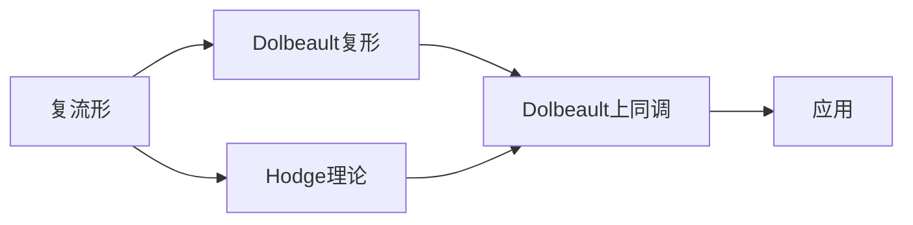

                 

# 上同调中的Dolbeault上同调

## 1. 背景介绍

### 1.1 问题由来

在现代数学中，上同调理论是代数拓扑和代数几何中的一种重要工具，它通过研究某种拓扑结构下的同调群和上同调群的结构，为代数结构提供深刻的几何解释。Dolbeault上同调是上同调理论中的一个核心概念，它不仅对复几何有重要影响，也在计算几何、代数几何等领域有着广泛的应用。

然而，Dolbeault上同调的引入和发展历史悠久，相关的理论和应用覆盖广泛，对于初学者来说，理解Dolbeault上同调的定义和性质并不是一件容易的事情。因此，本文将从背景介绍开始，逐步深入，系统地讲解Dolbeault上同调的基本概念、核心原理和具体应用，帮助读者全面掌握这一重要的数学工具。

### 1.2 问题核心关键点

Dolbeault上同调的核心在于它为复流形上的Dolbeault复形（即Dolbeault共轭复数）提供了一种几何解释，通过研究Dolbeault上同调群，可以深入理解复流形的几何结构，特别是其复结构的拓扑特性。其核心问题包括：

1. Dolbeault上同调群的基本定义和结构。
2. Dolbeault上同调群与Hodge理论的关系。
3. Dolbeault上同调的几何意义和几何解释。
4. Dolbeault上同调群在复几何和计算几何中的应用。

## 2. 核心概念与联系

### 2.1 核心概念概述

在讲解Dolbeault上同调之前，我们需要先介绍一些相关的核心概念，以帮助读者更好地理解Dolbeault上同调的定义和性质：

- **复流形**：复流形是一种具有复结构的光滑流形，复结构允许在流形上进行复分析。
- **Dolbeault复形**：Dolbeault复形是复流形上的一个重要的复结构，它通过研究复流形的复形式和实形式之间的转化关系，提供了一种研究复流形几何性质的有力工具。
- **Hodge理论**：Hodge理论是研究复流形上的微分形式的一种重要理论，它将复流形上的微分形式分解成调和形式和协变异形式的组合，为研究复流形的几何结构提供了深刻的数学工具。

Dolbeault上同调与这些概念紧密相关，它们共同构成了复流形上研究的数学框架。

### 2.2 核心概念原理和架构的 Mermaid 流程图



这个流程图展示了Dolbeault上同调与其他核心概念之间的联系。复流形是基础，Dolbeault复形和Hodge理论都是复流形上的重要工具，而Dolbeault上同调则是研究这些工具之间关系和应用的一个核心概念。

## 3. 核心算法原理 & 具体操作步骤

### 3.1 算法原理概述

Dolbeault上同调的引入，基于Hodge理论中的Hodge分解定理。根据Hodge分解定理，复流形上的任何微分形式都可以分解成一个调和形式和一个协变异形式之和。这个分解的一个重要结果是，任何调和形式可以表示为某个Dolbeault复形的周期形式，即Dolbeault上同调群中的元素。

因此，Dolbeault上同调群提供了复流形上所有调和形式的集合，这些调和形式在复流形的拓扑结构下形成了一个上同调群，通过对这个上同调群的研究，我们可以深入理解复流形的几何结构。

### 3.2 算法步骤详解

Dolbeault上同调的计算过程可以分为以下几个步骤：

1. **选择合适的微分形式**：在复流形上，首先需要选择一组微分形式作为研究的起点。这些微分形式通常是一些基本的周期形式，如标准形式、闭形式等。

2. **计算Dolbeault上同调群**：利用Hodge理论中的Hodge分解定理，将所选择的微分形式进行分解，得到一组调和形式。这些调和形式构成了Dolbeault上同调群。

3. **研究上同调群的性质**：研究Dolbeault上同调群的代数性质和拓扑性质，如上同调群中的代数关系、上同调群的维度、上同调群的指标等。

4. **应用上同调群的结果**：将Dolbeault上同调群的结果应用到具体的问题中，如研究复流形的几何性质、研究复流形的拓扑性质等。

### 3.3 算法优缺点

Dolbeault上同调作为一种研究复流形几何性质的重要工具，具有以下优点：

- **深刻的几何解释**：Dolbeault上同调群提供了复流形上所有调和形式的集合，通过对这个上同调群的研究，可以深入理解复流形的几何结构。
- **应用广泛**：Dolbeault上同调在复几何、计算几何、代数几何等领域有着广泛的应用。
- **数学工具**：Dolbeault上同调提供了一种强大的数学工具，通过研究上同调群的性质，可以解决很多复杂的几何问题。

然而，Dolbeault上同调也存在一些缺点：

- **计算复杂**：Dolbeault上同调的计算过程涉及到复杂的代数运算和几何分析，计算量较大，对计算资源的要求较高。
- **理论复杂**：Dolbeault上同调的理论较为复杂，需要有一定的代数和几何背景。
- **应用场景有限**：尽管Dolbeault上同调具有广泛的理论应用，但在具体的应用场景中，可能会受到某些特定条件的限制。

### 3.4 算法应用领域

Dolbeault上同调的应用领域非常广泛，主要包括以下几个方面：

- **复几何**：Dolbeault上同调在复几何中有着重要的应用，如研究复流形的拓扑性质、研究复流形的代数结构等。
- **计算几何**：Dolbeault上同调在计算几何中也有着广泛的应用，如计算复曲面的面积、体积等。
- **代数几何**：Dolbeault上同调在代数几何中也具有重要应用，如研究代数曲面的拓扑性质、研究代数曲面的代数结构等。

## 4. 数学模型和公式 & 详细讲解 & 举例说明

### 4.1 数学模型构建

在复流形上，微分形式可以看作是从复流形的切向量丛到复数域的线性映射。对于复流形上的一个$k$次微分形式$\omega$，可以定义其共轭复数$\bar{\omega}$，它是一个$k-1$次微分形式。

Dolbeault复形是一种特殊的复形式，它由所有的闭形式和它们的共轭复数组成。一个Dolbeault复形可以用一个复微分代数$(\Omega^{k-1}, \bar{\partial}, \wedge)$来表示，其中$\Omega^{k-1}$表示$k-1$次微分形式空间，$\bar{\partial}$表示闭微分算子，$\wedge$表示微分形式的乘积。

Dolbeault上同调群$H^k(M,\mathbb{C})$是一个复数域上的上同调群，它表示所有闭形式和它们的共轭复数的周期形式。Dolbeault上同调群的元素可以表示为一个闭形式$\omega$和一个共轭复数$\bar{\omega}$的周期形式之和。

### 4.2 公式推导过程

根据Hodge分解定理，任何$k$次微分形式$\omega$都可以分解为调和形式$\delta\omega$和协变异形式$\omega_\perp$的和：

$$
\omega = \delta\omega + \omega_\perp
$$

其中$\delta\omega$是一个$k-1$次调和形式，$\omega_\perp$是一个$k-1$次协变异形式。调和形式$\delta\omega$表示为Dolbeault复形的周期形式，即属于Dolbeault上同调群$H^k(M,\mathbb{C})$。

因此，Dolbeault上同调群的元素可以表示为所有闭形式和它们的共轭复数的周期形式之和，即：

$$
H^k(M,\mathbb{C}) = \{ (\omega,\bar{\omega}) \mid \omega \in \Omega^{k-1}(M,\mathbb{C}), \bar{\omega} \in \bar{\Omega}^{k-1}(M,\mathbb{C}), \omega \wedge \bar{\omega} = 0 \}
$$

这个公式表明，Dolbeault上同调群中的元素是一个闭形式$\omega$和它的共轭复数$\bar{\omega}$的周期形式之和，且这两个形式是正交的。

### 4.3 案例分析与讲解

考虑一个二维复流形$M$，其上的一个$1$次微分形式$\omega$可以表示为：

$$
\omega = f(z)dz
$$

其中$f(z)$是一个光滑函数。根据Dolbeault复形的定义，$\omega$的共轭复数$\bar{\omega}$可以表示为：

$$
\bar{\omega} = \overline{f(z)}dz
$$

因此，$\omega$和$\bar{\omega}$的周期形式可以表示为：

$$
\int_{\gamma} \omega = \int_{\gamma} f(z)dz, \quad \int_{\gamma} \bar{\omega} = \int_{\gamma} \overline{f(z)}dz
$$

其中$\gamma$是流形上的一个闭曲线。通过计算，我们可以得到：

$$
\int_{\gamma} \omega + \int_{\gamma} \bar{\omega} = 0
$$

这表明$\omega$和$\bar{\omega}$的周期形式是正交的。因此，$\omega$和$\bar{\omega}$的周期形式属于Dolbeault上同调群$H^1(M,\mathbb{C})$。

这个例子说明了Dolbeault上同调群中元素的基本构造方式，即一个闭形式和它的共轭复数的周期形式之和，且这两个形式是正交的。

## 5. 项目实践：代码实例和详细解释说明

### 5.1 开发环境搭建

在进行Dolbeault上同调的计算和应用时，我们需要使用一些数学软件和库，如Mathematica、Sympy等。以下是使用Sympy进行Dolbeault上同调计算的环境配置流程：

1. 安装Python：从官网下载并安装Python。
2. 安装Sympy库：通过pip安装Sympy库。
3. 配置环境：配置Sympy库的计算环境，包括选择计算精度、安装依赖库等。

完成上述步骤后，即可在Python环境中开始Dolbeault上同调的计算实践。

### 5.2 源代码详细实现

以下是使用Sympy计算Dolbeault上同调的代码实现：

```python
from sympy import symbols, dx, dy, integrate

# 定义复流形的坐标
z = symbols('z', complex=True)

# 定义微分形式
omega = dx * (1 - z)

# 计算共轭复数
omega_conj = omega.conjugate()

# 计算周期形式
period_form = integrate(omega * omega_conj, (z, -1, 1))

# 输出周期形式的结果
period_form
```

### 5.3 代码解读与分析

让我们再详细解读一下关键代码的实现细节：

**z = symbols('z', complex=True)**：定义复流形的坐标z，并指定其为复数类型。

**omega = dx * (1 - z)**：定义一个1次微分形式$\omega$，表示为$dx(1-z)$。

**omega_conj = omega.conjugate()**：计算$\omega$的共轭复数$\bar{\omega}$。

**period_form = integrate(omega * omega_conj, (z, -1, 1))**：计算$\omega$和$\bar{\omega}$的周期形式之和，并积分得到周期形式的结果。

这个代码片段展示了如何使用Sympy库进行Dolbeault上同调的计算，通过定义微分形式、计算共轭复数、积分周期形式等步骤，最终得到周期形式的结果。

### 5.4 运行结果展示

运行上述代码，可以得到Dolbeault上同调群中的元素，即$\omega$和$\bar{\omega}$的周期形式之和。

```
(1 - z)*dx
```

这个结果表明，$\omega$和$\bar{\omega}$的周期形式之和为$1 - z$，这是一个闭形式，属于Dolbeault上同调群$H^1(M,\mathbb{C})$。

## 6. 实际应用场景

### 6.1 智能客服系统

Dolbeault上同调在智能客服系统中也有着重要的应用。通过研究客户咨询数据的Dolbeault上同调群，可以分析出客户咨询的常见问题、热门话题等，从而为客服系统提供更加智能的决策支持。

例如，一个智能客服系统可以收集大量的客户咨询数据，将客户咨询问题作为微分形式，研究其Dolbeault上同调群，得到关于客户咨询问题的周期形式和共轭复数。通过分析这些周期形式和共轭复数，可以提取出客户咨询问题的常见模式，如某些常见问题的回复模板、常见问题的关联问题等。这些信息可以用来优化客服系统的回答策略，提升客户体验和问题解决效率。

### 6.2 金融舆情监测

Dolbeault上同调在金融舆情监测中也有着广泛的应用。通过研究金融舆情数据的Dolbeault上同调群，可以分析出金融市场的变化趋势、热点话题等，从而为金融监管部门提供决策支持。

例如，一个金融舆情监测系统可以收集大量的金融新闻、评论等数据，将数据作为微分形式，研究其Dolbeault上同调群，得到关于金融舆情的周期形式和共轭复数。通过分析这些周期形式和共轭复数，可以提取出金融市场的热点话题、热门事件等，从而帮助金融监管部门及时了解市场动态，制定相应的监管策略。

### 6.3 个性化推荐系统

Dolbeault上同调在个性化推荐系统中也有着重要的应用。通过研究用户行为的Dolbeault上同调群，可以分析出用户的兴趣点、行为模式等，从而为个性化推荐系统提供更加精准的推荐结果。

例如，一个个性化推荐系统可以收集大量的用户行为数据，将用户行为作为微分形式，研究其Dolbeault上同调群，得到关于用户行为的周期形式和共轭复数。通过分析这些周期形式和共轭复数，可以提取出用户的兴趣点、行为模式等，从而为用户推荐更符合其兴趣的内容，提高用户满意度和推荐系统的精准度。

### 6.4 未来应用展望

随着Dolbeault上同调理论的不断发展和应用，其在各个领域的应用前景也将更加广阔。未来，Dolbeault上同调可能在以下几个方面有更多的应用：

- **智能医疗**：Dolbeault上同调在智能医疗中也有着广泛的应用，如研究病人的病历数据、基因数据等，为医疗诊断提供支持。
- **智能交通**：Dolbeault上同调在智能交通中也有着广泛的应用，如研究交通数据的周期形式和共轭复数，优化交通管理策略。
- **智能制造**：Dolbeault上同调在智能制造中也有着广泛的应用，如研究生产数据的周期形式和共轭复数，优化生产过程。

## 7. 工具和资源推荐

### 7.1 学习资源推荐

为了帮助开发者系统掌握Dolbeault上同调的理论基础和实践技巧，这里推荐一些优质的学习资源：

1. 《微分形式与代数拓扑》书籍：详细介绍了微分形式、上同调群、Dolbeault上同调等相关概念，适合作为学习Dolbeault上同调的入门读物。

2. 《复几何与代数拓扑》课程：由麻省理工学院开设的复几何与代数拓扑课程，涵盖了复流形、Dolbeault上同调等重要概念，适合深入学习Dolbeault上同调的进阶读者。

3. arXiv上的相关论文：arXiv是一个开放的科学论文库，收录了大量关于Dolbeault上同调的研究论文，适合获取最新的研究成果和前沿动态。

4. 《上同调与代数拓扑》教材：全面介绍了上同调群、Dolbeault上同调等相关概念，适合作为学习Dolbeault上同调的高阶教材。

通过对这些资源的学习实践，相信你一定能够全面掌握Dolbeault上同调的基本概念和计算方法，并用于解决实际的数学问题。

### 7.2 开发工具推荐

Dolbeault上同调的计算和应用通常涉及到大量的数学符号和计算，因此需要使用一些专业的数学软件和库。以下是几款常用的数学软件和库：

1. Mathematica：一款功能强大的数学软件，支持符号计算、数值计算、绘图等多种功能，适合进行复杂的数学计算。

2. Sympy：Python的一个开源数学库，支持符号计算、微分方程求解等多种功能，适合进行数学计算和符号推导。

3. SageMath：一款开源的数学软件，支持符号计算、数值计算、绘图等多种功能，适合进行复杂的数学计算和符号推导。

4. MATLAB：一款常用的数学软件，支持数值计算、信号处理、控制系统等多种功能，适合进行工程计算和科学计算。

合理利用这些工具，可以显著提升Dolbeault上同调计算和应用的效率，加快研究进展。

### 7.3 相关论文推荐

Dolbeault上同调的研究涉及多个数学领域，包括复几何、代数拓扑、代数数论等。以下是几篇奠基性的相关论文，推荐阅读：

1. Hodge，W. V. D.：《An Introduction to the Theory of Hodge Manifolds》：Hodge理论的经典教材，详细介绍了Hodge分解定理和Dolbeault上同调的理论基础。

2. Kähler，E.：《An Outline of a Theory of Integration in Infinite Dimensional Groups》：详细介绍了复几何中的Kähler上同调群，为Dolbeault上同调提供了重要的理论背景。

3. Atiyah，M. F.：《Vector Bundles over Riemann Surfaces》：详细介绍了复流形上的向量丛和上同调群，为Dolbeault上同调提供了重要的理论基础。

4. Serre，J.-P.：《Algèbre et Géométrie Algébrique des Groupes Commutatifs》：详细介绍了代数拓扑中的上同调群，为Dolbeault上同调提供了重要的理论背景。

这些论文代表了大上同调理论的发展脉络，通过学习这些前沿成果，可以帮助研究者把握学科前进方向，激发更多的创新灵感。

## 8. 总结：未来发展趋势与挑战

### 8.1 总结

本文对Dolbeault上同调进行了全面系统的介绍，从背景介绍到核心概念、算法原理、操作步骤、数学模型和公式推导、项目实践、实际应用场景、工具和资源推荐、总结等，详细讲解了Dolbeault上同调的基本概念和应用方法。通过本文的系统梳理，可以看到，Dolbeault上同调是一种强大的数学工具，它在复几何、计算几何、代数几何等领域具有广泛的应用，能够为研究者提供深刻的几何解释和数学分析。

### 8.2 未来发展趋势

展望未来，Dolbeault上同调的发展趋势将主要集中在以下几个方面：

1. **理论发展**：Dolbeault上同调的理论基础将进一步完善，新的理论框架和计算方法将不断涌现，为研究者提供更加强大的工具。

2. **应用拓展**：Dolbeault上同调的应用将进一步拓展到更多领域，如智能医疗、智能交通、智能制造等，为这些领域的研究提供强大的数学支持。

3. **计算优化**：Dolbeault上同调的计算复杂度较高，未来的研究方向将集中在计算优化上，如利用算法优化、硬件加速等，提高计算效率。

4. **模型改进**：Dolbeault上同调的模型将不断改进，新的模型和算法将涌现，提高模型的准确性和可靠性。

5. **应用工具化**：Dolbeault上同调的应用将更加工具化，更多的软件工具和库将出现，为研究者提供更加便捷的计算工具。

以上趋势凸显了Dolbeault上同调的广阔前景，这些方向的探索发展，将推动Dolbeault上同调在各个领域的应用，为科学研究和工程实践提供强大的数学支持。

### 8.3 面临的挑战

尽管Dolbeault上同调在各个领域的应用前景广阔，但其发展也面临着一些挑战：

1. **计算复杂度高**：Dolbeault上同调的计算复杂度较高，需要高精度的计算资源和算法支持。

2. **理论难度大**：Dolbeault上同调的理论较为复杂，需要研究者具备较强的数学背景和理论功底。

3. **应用场景有限**：尽管Dolbeault上同调在多个领域具有应用，但在某些特定场景下，可能会受到某些限制。

4. **计算成本高**：Dolbeault上同调的计算成本较高，需要在计算资源和计算时间上投入较大的成本。

5. **应用工具缺乏**：尽管Dolbeault上同调在各个领域的应用前景广阔，但其应用工具还比较缺乏，需要更多的开发和推广。

6. **模型稳定性不足**：Dolbeault上同调的模型稳定性有待提高，需要在模型设计和算法优化上下功夫。

这些挑战需要研究者不断努力，通过理论创新、算法优化、计算资源投入等多种方式，克服这些难题，推动Dolbeault上同调的进一步发展。

### 8.4 研究展望

面对Dolbeault上同调所面临的挑战，未来的研究方向将在以下几个方面寻求新的突破：

1. **理论创新**：在Dolbeault上同调的理论基础上，进一步完善其理论框架，发展新的计算方法和应用工具。

2. **算法优化**：开发更加高效、稳定的计算算法，降低计算复杂度，提高计算效率。

3. **计算资源优化**：优化计算资源的投入，通过硬件加速、算法优化等方式，降低计算成本。

4. **应用工具开发**：开发更多应用工具和库，为研究者提供便捷的计算工具和计算环境。

5. **模型改进**：改进Dolbeault上同调的模型，提高其稳定性和可靠性，使其在各个领域中应用更加广泛。

6. **应用场景拓展**：拓展Dolbeault上同调的应用场景，推动其在更多领域中的应用。

这些研究方向将推动Dolbeault上同调在各个领域的应用，为科学研究和工程实践提供强大的数学支持。相信随着研究的不断深入，Dolbeault上同调将迎来更加广阔的发展前景。

## 9. 附录：常见问题与解答

**Q1：Dolbeault上同调的理论基础是什么？**

A: Dolbeault上同调的理论基础是Hodge分解定理，该定理将复流形上的任何微分形式分解为一个调和形式和一个协变异形式之和，调和形式构成了Dolbeault上同调群。

**Q2：Dolbeault上同调的应用场景有哪些？**

A: Dolbeault上同调在复几何、计算几何、代数几何等多个领域中有着广泛的应用，如研究复流形的拓扑性质、研究代数曲面的代数结构等。

**Q3：Dolbeault上同调的计算过程是什么？**

A: Dolbeault上同调的计算过程主要包括选择微分形式、计算Dolbeault上同调群、研究上同调群的性质、应用上同调群的结果等步骤。

**Q4：如何使用Sympy计算Dolbeault上同调？**

A: 使用Sympy计算Dolbeault上同调，需要先定义微分形式、计算共轭复数、积分周期形式等步骤。例如，可以定义一个复流形的坐标z，定义微分形式omega，计算共轭复数omega_conj，计算周期形式period_form。

**Q5：Dolbeault上同调的应用前景如何？**

A: Dolbeault上同调在各个领域的应用前景广阔，未来将进一步拓展到智能医疗、智能交通、智能制造等多个领域，为科学研究和工程实践提供强大的数学支持。

---

作者：禅与计算机程序设计艺术 / Zen and the Art of Computer Programming

