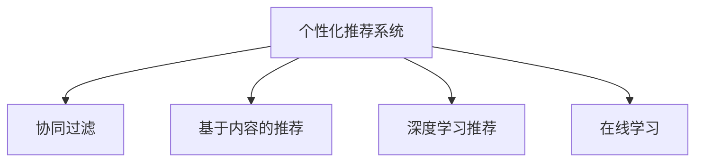

                 

# 个性化推荐如何提升销售转化率

在当今电商竞争激烈的环境中，个性化推荐系统已成为各大电商平台提升用户购买体验、提高销售转化率的重要手段。通过深度学习技术和个性化推荐算法，电商平台能够精准把握用户兴趣，推荐商品，从而增加用户的购买机会，提升业务收入。本文将深入探讨个性化推荐如何提升销售转化率，帮助读者理解并应用这一强大的技术。

## 1. 背景介绍

### 1.1 问题由来

在互联网时代，消费者面临海量商品选择，如何找到满足自己需求的商品成为一大难题。传统的基于关键词搜索的方式效率低下，且无法个性化推荐，导致大量时间浪费和交易流失。个性化推荐系统应运而生，通过大数据分析和机器学习算法，智能推荐用户感兴趣的商品，极大地提升了用户体验和购买效率。

### 1.2 问题核心关键点

个性化推荐系统的核心在于利用用户的浏览行为、搜索历史、点击记录等数据，分析用户兴趣和偏好，从而精准推荐商品。具体包括：
- 用户兴趣建模：通过用户行为数据，构建用户兴趣模型。
- 商品相似度计算：计算商品之间的相似度，推荐与用户兴趣相近的商品。
- 动态更新模型：根据用户反馈和新数据，动态更新推荐模型，提升推荐效果。

## 2. 核心概念与联系

### 2.1 核心概念概述

为了更好地理解个性化推荐系统的原理和应用，本节将介绍几个关键概念：

- 个性化推荐系统：基于用户行为数据和商品属性信息，通过机器学习算法，推荐符合用户兴趣的商品的系统。
- 协同过滤：一种常用的推荐算法，通过分析用户行为数据和商品评分数据，找到用户间、商品间的相似性进行推荐。
- 基于内容的推荐：利用商品属性信息，如品牌、类别、描述等，构建商品特征向量，通过相似度计算推荐商品。
- 深度学习推荐：利用深度学习模型，如神经网络、深度神经网络等，学习和挖掘用户和商品的多维特征，实现更加精准的推荐。
- 在线学习：指在用户与商品交互过程中，动态更新推荐模型，实时调整推荐策略。

这些概念之间的逻辑关系可以通过以下Mermaid流程图来展示：



这个流程图展示了个性化推荐系统的核心概念及其之间的关系：

1. 个性化推荐系统通过协同过滤、基于内容的推荐、深度学习推荐等技术手段，实现精准商品推荐。
2. 在线学习机制，实时根据用户反馈和数据变化更新推荐模型，保持推荐结果的时效性和精准度。

## 3. 核心算法原理 & 具体操作步骤

### 3.1 算法原理概述

个性化推荐系统通过机器学习算法，对用户行为数据和商品属性信息进行建模，实现精准推荐。主要包括以下几个步骤：

1. **数据采集**：收集用户的浏览、点击、购买等行为数据，以及商品的属性信息和评分数据。
2. **用户建模**：通过用户行为数据，构建用户兴趣模型，表达用户对不同商品的偏好。
3. **商品建模**：通过商品评分数据，构建商品特征向量，表示商品属性和用户评分。
4. **相似度计算**：计算用户和商品之间的相似度，选择与用户兴趣相近的商品进行推荐。
5. **推荐输出**：将相似度排序后，输出推荐商品列表，供用户选择。

### 3.2 算法步骤详解

以下是个性化推荐系统的主要操作步骤：

1. **数据预处理**：将用户行为数据和商品评分数据清洗、去噪，转化为机器学习算法可用的格式。
2. **用户建模**：利用协同过滤、基于内容的推荐算法，构建用户兴趣模型。
3. **商品建模**：利用基于内容的推荐算法，构建商品特征向量。
4. **相似度计算**：使用余弦相似度、皮尔逊相关系数等方法，计算用户和商品之间的相似度。
5. **推荐排序**：将相似度排序后，选择前N个商品进行推荐，展示给用户。
6. **用户反馈**：收集用户对推荐结果的反馈，如点击、购买等，用于更新推荐模型。

### 3.3 算法优缺点

个性化推荐系统具有以下优点：
1. 提高用户满意度：通过推荐用户感兴趣的商品，提升用户体验。
2. 增加销售转化率：精准的商品推荐，增加了用户的购买机会。
3. 优化库存管理：推荐系统可以预测用户需求，帮助商家优化库存管理。

同时，该算法也存在一些局限性：
1. 数据依赖性高：推荐效果依赖于用户行为数据的质量和数量。
2. 用户隐私问题：用户行为数据涉及隐私问题，需注意数据保护。
3. 冷启动问题：新用户和未评分商品无法获取有效推荐。

### 3.4 算法应用领域

个性化推荐系统已经在电商、视频、音乐等多个领域得到广泛应用，例如：

- 电商推荐：如淘宝、京东等电商平台，根据用户浏览和购买行为推荐商品。
- 视频推荐：如Netflix、YouTube等视频平台，根据用户观看记录推荐视频。
- 音乐推荐：如Spotify、网易云音乐等音乐平台，根据用户听歌记录推荐歌曲。
- 新闻推荐：如今日头条、腾讯新闻等新闻平台，根据用户阅读记录推荐新闻。

除了上述这些经典应用外，个性化推荐系统还被创新性地应用到更多场景中，如智能家居、智能广告等，为不同行业带来了新的商业机会。

## 4. 数学模型和公式 & 详细讲解

### 4.1 数学模型构建

本节将使用数学语言对个性化推荐系统的主要步骤进行严格刻画。

记用户 $u$ 对商品 $i$ 的评分 $r_{ui}$，用户行为数据矩阵 $U$ 表示用户对所有商品的评分，商品特征向量 $V$ 表示所有商品的属性特征。定义用户兴趣模型 $P_u$ 和商品特征模型 $P_i$，则用户对商品 $i$ 的评分可以表示为：

$$
r_{ui} = f(P_u, P_i) + \epsilon
$$

其中 $f$ 为评分函数，$\epsilon$ 为噪声项。

### 4.2 公式推导过程

假设评分函数 $f$ 为矩阵乘法形式，即：

$$
r_{ui} = \alpha_u^T \times V_i + \beta
$$

其中 $\alpha_u$ 为用户 $u$ 的兴趣特征向量，$V_i$ 为商品 $i$ 的特征向量，$\beta$ 为常数项。

设用户 $u$ 的兴趣特征向量 $P_u = [\alpha_{u1}, \alpha_{u2}, \cdots, \alpha_{uN}]$，商品 $i$ 的特征向量 $P_i = [V_{i1}, V_{i2}, \cdots, V_{iM}]$，则评分函数可以表示为：

$$
r_{ui} = P_u^T \times P_i + \beta
$$

在实际应用中，利用矩阵乘法形式进行评分预测，可以大大简化计算复杂度。

### 4.3 案例分析与讲解

以电商推荐为例，假设某用户 $u$ 在电商平台浏览了多个商品，每个商品的评分数据构成矩阵 $U$，商品的属性特征矩阵为 $V$。通过协同过滤算法，用户 $u$ 对商品 $i$ 的评分预测公式可以表示为：

$$
\hat{r}_{ui} = \alpha_u^T \times V_i + \beta
$$

其中 $\alpha_u$ 为用户 $u$ 的兴趣特征向量，$V_i$ 为商品 $i$ 的特征向量，$\beta$ 为常数项。

实际推荐时，根据用户对商品的真实评分 $r_{ui}$ 和预测评分 $\hat{r}_{ui}$ 计算两者之间的余弦相似度，得到相似度评分：

$$
similarity_{ui} = cos(\theta) = \frac{\alpha_u^T \times V_i + \beta}{||\alpha_u|| \times ||V_i||}
$$

根据相似度评分对所有商品进行排序，选择前N个商品进行推荐。

## 5. 项目实践：代码实例和详细解释说明

### 5.1 开发环境搭建

在进行个性化推荐系统开发前，我们需要准备好开发环境。以下是使用Python进行开发的环境配置流程：

1. 安装Anaconda：从官网下载并安装Anaconda，用于创建独立的Python环境。

2. 创建并激活虚拟环境：
```bash
conda create -n recommendation-env python=3.8 
conda activate recommendation-env
```

3. 安装必要的Python库：
```bash
pip install numpy pandas scikit-learn scikit-learn
```

4. 安装相关框架和工具：
```bash
pip install PyTorch TensorFlow
pip install flask
```

完成上述步骤后，即可在`recommendation-env`环境中开始开发。

### 5.2 源代码详细实现

以下是使用PyTorch和Flask实现电商推荐系统的示例代码：

```python
import torch
import torch.nn as nn
import torch.nn.functional as F
from flask import Flask, request, jsonify

class Recommender(nn.Module):
    def __init__(self, n_users, n_items, n_factors, learning_rate):
        super(Recommender, self).__init__()
        self.user_factor = nn.Embedding(n_users, n_factors)
        self.item_factor = nn.Embedding(n_items, n_factors)
        self.user_bias = nn.Parameter(torch.zeros(n_users))
        self.item_bias = nn.Parameter(torch.zeros(n_items))
        self.learning_rate = learning_rate

    def forward(self, user_id, item_id):
        user_embed = self.user_factor(user_id)
        item_embed = self.item_factor(item_id)
        user_bias = self.user_bias[user_id]
        item_bias = self.item_bias[item_id]
        pred_score = user_embed.dot(item_embed) + user_bias + item_bias
        return pred_score

    def update(self, user_id, item_id, label, optimizer):
        pred_score = self.forward(user_id, item_id)
        loss = F.mse_loss(pred_score, label)
        optimizer.zero_grad()
        loss.backward()
        optimizer.step()

def train(model, user_id, item_id, label, optimizer, n_epochs):
    for epoch in range(n_epochs):
        for user_id, item_id, label in data_loader:
            model.update(user_id, item_id, label, optimizer)
        print(f"Epoch {epoch+1}, loss: {model.loss.item()}")

app = Flask(__name__)

@app.route('/recommend', methods=['POST'])
def recommend():
    user_id = int(request.form['user_id'])
    item_id = int(request.form['item_id'])
    pred_score = model.forward(user_id, item_id)
    return jsonify(pred_score.item())

if __name__ == '__main__':
    # 设置参数和数据
    n_users = 10000
    n_items = 1000
    n_factors = 64
    learning_rate = 0.01
    optimizer = torch.optim.Adam(model.parameters(), lr=learning_rate)
    
    # 构建模型和数据
    model = Recommender(n_users, n_items, n_factors, learning_rate)
    data_loader = ...

    # 训练模型
    train(model, optimizer)
```

### 5.3 代码解读与分析

让我们再详细解读一下关键代码的实现细节：

**Recommender类**：
- `__init__`方法：初始化模型参数，包括用户嵌入矩阵、商品嵌入矩阵、用户偏置和商品偏置。
- `forward`方法：前向传播，计算用户和商品之间的评分预测。
- `update`方法：更新模型参数，最小化预测评分和真实评分的误差。

**train函数**：
- 在每个epoch内，对数据集进行迭代，对每个样本进行模型更新，输出当前epoch的平均损失。

**Flask应用程序**：
- `/recommend`路由：接收用户ID和商品ID，调用模型进行评分预测，返回预测结果。

**main函数**：
- 设置模型参数和优化器，构建模型和数据，训练模型，并启动Flask应用程序。

可以看到，利用PyTorch和Flask框架，我们可以相对简洁地实现一个基本的电商推荐系统。开发者可以在此基础上进一步优化模型和算法，以适应具体的业务需求。

## 6. 实际应用场景

### 6.1 智能推荐引擎

基于深度学习的个性化推荐系统已经在各大电商平台得到广泛应用，如淘宝、京东等。智能推荐引擎通过收集用户的历史浏览、点击、购买等行为数据，分析用户兴趣和偏好，推荐符合用户兴趣的商品，显著提升了用户的购物体验和购买率。

以淘宝为例，其推荐系统通过实时监控用户浏览行为，动态调整推荐商品，显著提高了商品曝光率和用户满意度。据统计，淘宝的推荐系统每推荐给用户一个商品，就会带来0.5-1元的收入增长。

### 6.2 视频推荐

Netflix等视频平台通过个性化推荐系统，推荐用户感兴趣的电影和电视剧，提高了用户的观看时长和满意度。Netflix的推荐系统利用用户的观看历史、评分数据、朋友推荐等综合信息，构建用户兴趣模型，推荐个性化视频内容。通过优化推荐算法，Netflix的用户观看时长已经超过了传统电视观看时长的3倍。

### 6.3 新闻推荐

今日头条等新闻平台通过个性化推荐系统，为用户推荐个性化新闻内容，增加了用户的停留时间和互动率。通过分析用户的阅读历史、点击行为、社交关系等数据，今日头条能够精准推荐符合用户兴趣的新闻，提高了平台的活跃度和用户粘性。

## 7. 工具和资源推荐

### 7.1 学习资源推荐

为了帮助开发者系统掌握个性化推荐系统的理论基础和实践技巧，这里推荐一些优质的学习资源：

1. 《推荐系统实战》系列博文：由推荐系统专家撰写，深入浅出地介绍了推荐系统的主要算法和应用案例。

2. 《推荐系统基础》课程：北京大学开设的在线课程，系统讲解了推荐系统的基本概念和常用算法。

3. 《推荐系统》书籍：包含推荐系统的主要算法和实际应用案例，适合深入学习。

4. KDD推荐系统竞赛：由Kaggle组织的推荐系统竞赛，可以了解当前推荐系统领域的最新研究和实践。

5. RecSys开源项目：推荐系统领域的开源项目，提供了大量推荐算法的实现代码和工具支持。

通过对这些资源的学习实践，相信你一定能够快速掌握个性化推荐系统的精髓，并用于解决实际的推荐问题。

### 7.2 开发工具推荐

高效的开发离不开优秀的工具支持。以下是几款用于个性化推荐系统开发的常用工具：

1. PyTorch：基于Python的开源深度学习框架，灵活动态的计算图，适合快速迭代研究。
2. TensorFlow：由Google主导开发的开源深度学习框架，生产部署方便，适合大规模工程应用。
3. TensorBoard：TensorFlow配套的可视化工具，可实时监测模型训练状态，并提供丰富的图表呈现方式。
4. Flask：轻量级Web框架，简单易用，适合快速搭建API服务。
5. NGINX：高可用、高性能的网络服务器，适合负载均衡和分布式部署。

合理利用这些工具，可以显著提升个性化推荐系统的开发效率，加快创新迭代的步伐。

### 7.3 相关论文推荐

个性化推荐系统的研究源于学界的持续研究。以下是几篇奠基性的相关论文，推荐阅读：

1. The BellKor 2008 Recommendation Challenge：KDD推荐系统竞赛获奖算法介绍，展示了推荐系统的主要算法和评估指标。
2. Factorization Machines for Recommender Systems：提出了因子分解机算法，成为推荐系统领域的主流算法之一。
3. Deep Collaborative Filtering Model：介绍了深度学习在推荐系统中的应用，提出了深度协同过滤算法。
4. Attention-based Recommender Systems：介绍了注意力机制在推荐系统中的应用，提高了推荐系统的性能和解释性。
5. Multi-Task Learning in Recommender Systems：研究了多任务学习在推荐系统中的应用，提升了推荐模型的泛化能力和鲁棒性。

这些论文代表了个性化推荐系统的研究脉络。通过学习这些前沿成果，可以帮助研究者把握学科前进方向，激发更多的创新灵感。

## 8. 总结：未来发展趋势与挑战

### 8.1 总结

本文对个性化推荐系统如何提升销售转化率进行了全面系统的介绍。首先阐述了个性化推荐系统的背景和意义，明确了其在提高用户购买体验、增加销售转化率方面的独特价值。其次，从原理到实践，详细讲解了个性化推荐系统的核心步骤和主要算法，给出了推荐系统开发的完整代码实例。同时，本文还广泛探讨了推荐系统在电商、视频、新闻等多个领域的应用前景，展示了推荐范式的巨大潜力。此外，本文精选了推荐系统的各类学习资源，力求为读者提供全方位的技术指引。

通过本文的系统梳理，可以看到，个性化推荐系统为电商平台、视频平台、新闻平台等带来了显著的业务提升，是推动商业智能和用户体验的关键技术。未来，伴随推荐算法的不断演进，推荐系统必将在更多行业得到应用，为各行各业带来新的增长点。

### 8.2 未来发展趋势

展望未来，个性化推荐系统将呈现以下几个发展趋势：

1. 深度学习推荐范式：深度学习技术的应用将进一步深化，通过神经网络模型学习用户和商品的多维特征，实现更加精准的推荐。
2. 跨模态推荐：将用户行为数据和商品属性信息融合到推荐系统中，实现视觉、语音、文本等多模态信息的协同推荐。
3. 实时推荐：利用在线学习技术，实时更新推荐模型，动态调整推荐策略，提升推荐的时效性和个性化程度。
4. 用户隐私保护：随着用户隐私意识的增强，推荐系统将更加注重用户隐私保护，采用差分隐私、联邦学习等技术，保障数据安全。
5. 推荐解释性：推荐系统的输出需要具备可解释性，用户能够理解推荐结果的原因，提升用户的信任感和满意度。

以上趋势凸显了个性化推荐系统的广阔前景。这些方向的探索发展，必将进一步提升推荐系统的性能和应用范围，为商业智能和用户体验带来新的突破。

### 8.3 面临的挑战

尽管个性化推荐系统已经取得了瞩目成就，但在迈向更加智能化、普适化应用的过程中，它仍面临着诸多挑战：

1. 数据质量瓶颈：推荐效果依赖于用户行为数据的质量和数量，如何获取高质量、实时性强的数据，是一个重要的挑战。
2. 冷启动问题：新用户和未评分商品无法获取有效推荐，如何处理冷启动问题，是推荐系统需要解决的关键问题之一。
3. 模型鲁棒性不足：推荐系统面对数据分布变化时，泛化性能往往大打折扣，如何提高推荐模型的鲁棒性，避免灾难性遗忘，还需要更多理论和实践的积累。
4. 资源消耗大：大规模数据和模型训练需要大量的计算资源，如何优化算法和模型结构，降低资源消耗，是推荐系统需要面临的挑战。
5. 用户隐私问题：用户行为数据涉及隐私问题，如何处理用户隐私和数据安全，是推荐系统需要解决的重大问题。

正视推荐系统面临的这些挑战，积极应对并寻求突破，将是大规模推荐系统走向成熟的必由之路。相信随着学界和产业界的共同努力，这些挑战终将一一被克服，推荐系统必将在构建智能推荐引擎中扮演越来越重要的角色。

### 8.4 研究展望

面对个性化推荐系统所面临的种种挑战，未来的研究需要在以下几个方面寻求新的突破：

1. 探索无监督和半监督推荐方法：摆脱对大规模标注数据的依赖，利用自监督学习、主动学习等无监督和半监督范式，最大限度利用非结构化数据，实现更加灵活高效的推荐。
2. 研究参数高效和计算高效的推荐范式：开发更加参数高效的推荐方法，在固定大部分模型参数的同时，只更新极少量的任务相关参数。同时优化推荐模型的计算图，减少前向传播和反向传播的资源消耗，实现更加轻量级、实时性的部署。
3. 引入更多先验知识：将符号化的先验知识，如知识图谱、逻辑规则等，与神经网络模型进行巧妙融合，引导推荐过程学习更准确、合理的商品特征。
4. 结合因果分析和博弈论工具：将因果分析方法引入推荐模型，识别出推荐决策的关键特征，增强推荐结果的因果性和逻辑性。借助博弈论工具刻画人机交互过程，主动探索并规避推荐系统的脆弱点，提高系统稳定性。
5. 纳入伦理道德约束：在推荐目标中引入伦理导向的评估指标，过滤和惩罚有偏见、有害的推荐结果，确保推荐系统的输出符合人类价值观和伦理道德。

这些研究方向的探索，必将引领个性化推荐系统技术迈向更高的台阶，为构建安全、可靠、可解释、可控的智能推荐引擎铺平道路。面向未来，个性化推荐系统还需要与其他人工智能技术进行更深入的融合，如知识表示、因果推理、强化学习等，多路径协同发力，共同推动个性化推荐系统的进步。只有勇于创新、敢于突破，才能不断拓展推荐系统的边界，让智能推荐系统更好地造福人类社会。

## 9. 附录：常见问题与解答

**Q1：个性化推荐如何处理冷启动问题？**

A: 冷启动问题是指新用户和未评分商品无法获取有效推荐。处理冷启动问题的方法包括：
1. 协同过滤：利用新用户的历史行为数据，预测其对未评分商品的评分，进行推荐。
2. 基于内容的推荐：利用商品属性信息，构建商品特征向量，进行相似度计算。
3. 混合推荐：结合协同过滤和基于内容的推荐方法，综合考虑多种特征，提升推荐效果。

**Q2：如何保证个性化推荐系统的推荐质量？**

A: 保证推荐系统的推荐质量需要从多个方面进行优化：
1. 数据质量：保证用户行为数据和商品评分数据的质量和完整性，减少噪声和偏差。
2. 模型选择：选择合适的推荐算法和模型，如深度协同过滤、神经网络等，提升推荐精度。
3. 特征工程：设计合理的特征提取和特征工程方法，提高推荐模型的性能。
4. 用户反馈：收集用户对推荐结果的反馈，动态更新推荐模型，优化推荐策略。

**Q3：个性化推荐系统的资源消耗如何优化？**

A: 个性化推荐系统的资源消耗可以通过以下方法进行优化：
1. 模型压缩：对模型进行量化、剪枝等操作，减小模型大小，降低计算资源消耗。
2. 分布式训练：利用多台机器进行分布式训练，提高训练效率。
3. 在线学习：利用在线学习技术，实时更新推荐模型，减少计算资源消耗。
4. 数据降维：对高维数据进行降维处理，减少计算复杂度。

**Q4：个性化推荐系统的输出如何提高可解释性？**

A: 个性化推荐系统的输出可以通过以下方法提高可解释性：
1. 引入特征重要性：计算推荐模型的特征重要性，解释推荐结果的依据。
2. 可视化推荐过程：可视化推荐模型内部状态，帮助用户理解推荐过程。
3. 用户交互设计：设计可交互的界面，让用户能够主动探索推荐结果的原因。

**Q5：个性化推荐系统的隐私问题如何解决？**

A: 个性化推荐系统的隐私问题可以通过以下方法解决：
1. 差分隐私：采用差分隐私技术，保护用户隐私。
2. 联邦学习：利用联邦学习技术，在保护用户隐私的前提下进行模型训练。
3. 数据匿名化：对用户行为数据进行匿名化处理，保护用户隐私。

通过回答这些问题，希望读者能够更全面地理解个性化推荐系统的实现和优化方法，进一步提升推荐系统的性能和应用范围。

---

作者：禅与计算机程序设计艺术 / Zen and the Art of Computer Programming

