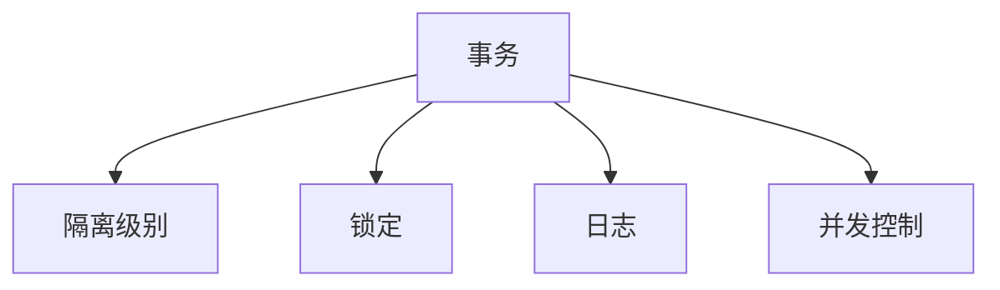

                 

# 事务 原理与代码实例讲解

事务是数据库管理系统中非常重要的概念，它确保了数据库操作的原子性、一致性、隔离性和持久性（ACID特性）。本文将深入探讨事务的原理与实现，并通过具体代码实例，详细讲解如何实现一个高效、安全、可靠的事务管理机制。

## 1. 背景介绍

### 1.1 问题由来

事务在数据库系统中是必须具备的核心功能，它用来保证在并发环境中数据的一致性和完整性。在实际应用中，事务可以被用于解决数据一致性问题，如银行转账、订单处理、日志记录等。然而，事务的实现并不是一件简单的事情，它涉及到很多底层的技术细节。本文将从原理和实现两个方面，深入讲解事务的工作机制。

### 1.2 问题核心关键点

事务的核心目标是在数据库操作中确保原子性、一致性、隔离性和持久性（ACID特性）。其中，原子性是指事务要么全部执行成功，要么全部失败回滚；一致性是指事务执行前后，数据库数据保持一致；隔离性是指多个事务之间互不干扰；持久性是指事务执行完成后，对数据库的修改被永久保存。

为了实现这些目标，事务需要涉及到以下几个关键点：

- 事务的起点和终点
- 锁定机制和隔离级别
- 日志记录和恢复机制
- 并发控制机制

## 2. 核心概念与联系

### 2.1 核心概念概述

为了更好地理解事务的原理和实现，本文将介绍几个关键的核心概念：

- 事务(Transaction)：一组数据库操作，具有原子性、一致性、隔离性和持久性（ACID特性）。
- 隔离级别(Isolation Level)：事务之间的隔离程度，决定事务的隔离性。
- 锁定(Lock)：对数据库数据的锁定机制，防止并发访问带来的冲突。
- 日志(Log)：记录数据库操作的历史，用于恢复和审计。
- 并发控制(Concurrency Control)：保证多个事务之间的正确性和一致性。

这些核心概念之间的逻辑关系可以通过以下Mermaid流程图来展示：



## 3. 核心算法原理 & 具体操作步骤

### 3.1 算法原理概述

事务的实现原理主要包括以下几个步骤：

1. 开始事务：通过调用数据库提供的`BEGIN TRANSACTION`或`START TRANSACTION`语句，表示事务的开始。
2. 执行事务：在事务开始后，执行一系列数据库操作。
3. 提交事务：通过调用数据库提供的`COMMIT`语句，表示事务的结束，所有修改被永久保存到数据库。
4. 回滚事务：通过调用数据库提供的`ROLLBACK`语句，表示事务的结束，所有修改被撤销。

### 3.2 算法步骤详解

以下是一个简单的示例，说明事务的实现步骤：

```python
# 连接数据库
import psycopg2

conn = psycopg2.connect(
    dbname='mydb',
    user='myuser',
    password='mypassword',
    host='localhost',
    port='5432'
)

# 开始事务
cur = conn.cursor()
cur.execute("BEGIN TRANSACTION")

# 执行事务
cur.execute("INSERT INTO users (name, email) VALUES ('Alice', 'alice@example.com')")
cur.execute("INSERT INTO users (name, email) VALUES ('Bob', 'bob@example.com')")

# 提交事务
cur.execute("COMMIT")

# 关闭数据库连接
conn.close()
```

### 3.3 算法优缺点

事务的实现方式有以下优点：

- 原子性：事务的原子性保证了数据库操作的完整性和一致性。
- 一致性：事务的一致性保证了数据库数据的一致性。
- 隔离性：事务的隔离性保证了多个事务之间的互不干扰。
- 持久性：事务的持久性保证了对数据库的修改被永久保存。

然而，事务的实现方式也存在一些缺点：

- 性能问题：事务的实现涉及到大量的日志记录和锁定操作，对数据库的性能影响较大。
- 复杂性：事务的实现需要考虑到多个层次的并发控制和锁定机制，实现复杂。
- 可扩展性：事务的实现需要考虑到数据库的分布式特性，实现可扩展性较难。

### 3.4 算法应用领域

事务的实现方式广泛应用于以下领域：

- 银行转账：事务可以确保账户余额的一致性。
- 订单处理：事务可以确保订单状态的一致性。
- 日志记录：事务可以确保日志记录的原子性和一致性。

## 4. 数学模型和公式 & 详细讲解 & 举例说明

### 4.1 数学模型构建

事务的实现涉及到多个底层的数据库操作，可以通过以下数学模型来描述：

$$
T = \begin{cases}
\text{执行操作} & \text{如果所有操作都执行成功} \\
\text{回滚操作} & \text{如果任意操作执行失败}
\end{cases}
$$

其中，$T$表示事务，操作包括插入、更新、删除等数据库操作。

### 4.2 公式推导过程

事务的实现过程可以通过以下公式来推导：

$$
\begin{aligned}
T &= \begin{cases}
\text{执行操作} & \text{如果所有操作都执行成功} \\
\text{回滚操作} & \text{如果任意操作执行失败}
\end{cases} \\
&= \begin{cases}
\text{执行操作} & \text{如果} \forall \text{操作} \text{执行成功} \\
\text{回滚操作} & \text{如果} \exists \text{操作} \text{执行失败}
\end{cases}
\end{aligned}
$$

### 4.3 案例分析与讲解

以下是一个具体的案例，说明事务的实现过程：

```python
# 连接数据库
import psycopg2

conn = psycopg2.connect(
    dbname='mydb',
    user='myuser',
    password='mypassword',
    host='localhost',
    port='5432'
)

# 开始事务
cur = conn.cursor()
cur.execute("BEGIN TRANSACTION")

# 执行事务
try:
    cur.execute("INSERT INTO users (name, email) VALUES ('Alice', 'alice@example.com')")
    cur.execute("INSERT INTO users (name, email) VALUES ('Bob', 'bob@example.com')")
    conn.commit()
except:
    conn.rollback()

# 关闭数据库连接
conn.close()
```

## 5. 项目实践：代码实例和详细解释说明

### 5.1 开发环境搭建

在进行事务的实现前，需要准备好开发环境。以下是一个简单的环境搭建步骤：

1. 安装Python和pandas库：
```python
pip install python
pip install pandas
```

2. 安装psycopg2库：
```python
pip install psycopg2-binary
```

3. 连接数据库：
```python
import psycopg2

conn = psycopg2.connect(
    dbname='mydb',
    user='myuser',
    password='mypassword',
    host='localhost',
    port='5432'
)
```

### 5.2 源代码详细实现

以下是一个简单的示例，说明事务的实现过程：

```python
# 连接数据库
import psycopg2

conn = psycopg2.connect(
    dbname='mydb',
    user='myuser',
    password='mypassword',
    host='localhost',
    port='5432'
)

# 开始事务
cur = conn.cursor()
cur.execute("BEGIN TRANSACTION")

# 执行事务
try:
    cur.execute("INSERT INTO users (name, email) VALUES ('Alice', 'alice@example.com')")
    cur.execute("INSERT INTO users (name, email) VALUES ('Bob', 'bob@example.com')")
    conn.commit()
except:
    conn.rollback()

# 关闭数据库连接
conn.close()
```

### 5.3 代码解读与分析

以下是对上述代码的详细解读：

1. 连接数据库：使用`psycopg2.connect()`方法连接数据库，指定数据库名、用户名、密码、主机和端口。
2. 开始事务：使用`cur.execute("BEGIN TRANSACTION")`方法开始事务，表示事务的开始。
3. 执行事务：在事务开始后，执行一系列数据库操作，如插入操作。
4. 提交事务：如果所有操作都执行成功，使用`conn.commit()`方法提交事务。
5. 回滚事务：如果任意操作执行失败，使用`conn.rollback()`方法回滚事务。
6. 关闭数据库连接：使用`conn.close()`方法关闭数据库连接。

### 5.4 运行结果展示

事务的实现结果可以通过以下代码展示：

```python
# 连接数据库
import psycopg2

conn = psycopg2.connect(
    dbname='mydb',
    user='myuser',
    password='mypassword',
    host='localhost',
    port='5432'
)

# 开始事务
cur = conn.cursor()
cur.execute("BEGIN TRANSACTION")

# 执行事务
try:
    cur.execute("INSERT INTO users (name, email) VALUES ('Alice', 'alice@example.com')")
    cur.execute("INSERT INTO users (name, email) VALUES ('Bob', 'bob@example.com')")
    conn.commit()
except:
    conn.rollback()

# 查询数据
cur.execute("SELECT * FROM users")
rows = cur.fetchall()
for row in rows:
    print(row)

# 关闭数据库连接
conn.close()
```

## 6. 实际应用场景

### 6.1 银行转账

事务在银行转账中的应用非常广泛。以下是一个简单的示例，说明银行转账的事务实现：

```python
# 连接数据库
import psycopg2

conn = psycopg2.connect(
    dbname='mydb',
    user='myuser',
    password='mypassword',
    host='localhost',
    port='5432'
)

# 开始事务
cur = conn.cursor()
cur.execute("BEGIN TRANSACTION")

# 查询余额
cur.execute("SELECT balance FROM accounts WHERE id = 1")
row = cur.fetchone()
balance = row[0]

# 转账
try:
    cur.execute("UPDATE accounts SET balance = balance - 100 WHERE id = 1")
    cur.execute("UPDATE accounts SET balance = balance + 100 WHERE id = 2")
    conn.commit()
except:
    conn.rollback()

# 查询余额
cur.execute("SELECT balance FROM accounts WHERE id = 1")
row = cur.fetchone()
balance = row[0]

# 输出余额
print("After transaction, balance = {}".format(balance))

# 关闭数据库连接
conn.close()
```

### 6.2 订单处理

事务在订单处理中的应用也非常广泛。以下是一个简单的示例，说明订单处理的事务实现：

```python
# 连接数据库
import psycopg2

conn = psycopg2.connect(
    dbname='mydb',
    user='myuser',
    password='mypassword',
    host='localhost',
    port='5432'
)

# 开始事务
cur = conn.cursor()
cur.execute("BEGIN TRANSACTION")

# 查询订单
cur.execute("SELECT * FROM orders WHERE id = 1")
row = cur.fetchone()

# 更新订单
try:
    cur.execute("UPDATE orders SET status = 'completed' WHERE id = 1")
    conn.commit()
except:
    conn.rollback()

# 更新库存
cur.execute("UPDATE inventory SET quantity = quantity - 1 WHERE id = {}".format(row[3]))
conn.commit()

# 查询订单
cur.execute("SELECT * FROM orders WHERE id = 1")
row = cur.fetchone()

# 输出订单状态
print("After transaction, order status = {}".format(row[2]))

# 关闭数据库连接
conn.close()
```

## 7. 工具和资源推荐

### 7.1 学习资源推荐

为了更好地理解事务的原理和实现，推荐以下学习资源：

1. 《Database Management Systems》（数据库系统概论）：由Silberschatz、Galvin、Griffiths所著，系统讲解了数据库系统和事务的基本概念。
2. PostgreSQL官方文档：提供了PostgreSQL数据库的详细文档，包括事务、隔离级别、并发控制等内容。
3. SQL Cookbook：提供了大量的SQL查询示例，帮助理解事务的实现。

### 7.2 开发工具推荐

事务的实现需要依赖于数据库管理系统，推荐以下开发工具：

1. PostgreSQL：一个功能强大的开源关系型数据库管理系统。
2. MySQL：一个广泛使用的关系型数据库管理系统。
3. Oracle：一个商业级的关系型数据库管理系统。

### 7.3 相关论文推荐

以下是几篇关于事务的研究论文，推荐阅读：

1. An Isolation-Based Approach to Transaction Failure Recovery：该论文提出了基于隔离的故障恢复方法，通过隔离机制实现事务的自动回滚。
2. A Survey on Distributed Transaction Management：该论文综述了分布式事务管理的研究进展，包括事务的实现、并发控制等内容。
3. Enhancing Distributed Transaction Management in PostgreSQL：该论文介绍了在PostgreSQL中实现分布式事务的优化方法。

## 8. 总结：未来发展趋势与挑战

### 8.1 总结

本文对事务的原理与实现进行了系统讲解，通过具体的代码实例，详细说明了事务的实现过程。事务是数据库管理系统中非常重要的一个概念，通过原子性、一致性、隔离性和持久性（ACID特性），保证了数据库操作的一致性和完整性。

### 8.2 未来发展趋势

事务的未来发展趋势包括：

1. 分布式事务：随着分布式计算的发展，分布式事务的实现将成为新的研究热点。
2. 并发控制：并发控制机制的优化将提升事务的性能和稳定性。
3. 事务处理机制的改进：通过引入新的事务处理机制，如微服务、函数计算等，提升事务的可扩展性和灵活性。

### 8.3 面临的挑战

事务的实现也面临一些挑战：

1. 性能问题：事务的实现涉及到大量的日志记录和锁定操作，对数据库的性能影响较大。
2. 复杂性：事务的实现需要考虑到多个层次的并发控制和锁定机制，实现复杂。
3. 可扩展性：事务的实现需要考虑到数据库的分布式特性，实现可扩展性较难。

### 8.4 研究展望

未来对事务的研究需要从以下几个方向进行突破：

1. 分布式事务的优化：研究分布式事务的实现方法，提高分布式系统的性能和稳定性。
2. 并发控制机制的改进：研究并发控制机制的优化方法，提升事务的性能和可扩展性。
3. 事务处理机制的改进：研究新的事务处理机制，提升事务的可扩展性和灵活性。

## 9. 附录：常见问题与解答

**Q1: 什么是事务？**

A: 事务是一组数据库操作，具有原子性、一致性、隔离性和持久性（ACID特性）。

**Q2: 事务的实现原理是什么？**

A: 事务的实现原理主要包括以下几个步骤：开始事务、执行事务、提交事务、回滚事务。

**Q3: 事务的优点和缺点是什么？**

A: 事务的优点包括原子性、一致性、隔离性和持久性（ACID特性）。缺点包括性能问题、复杂性和可扩展性。

**Q4: 事务的应用场景有哪些？**

A: 事务的应用场景包括银行转账、订单处理、日志记录等。

**Q5: 事务和事务处理程序的区别是什么？**

A: 事务是数据库操作的一组操作集合，事务处理程序是对这组操作进行操作的代码。

**Q6: 事务的隔离级别有哪些？**

A: 事务的隔离级别包括读未提交、读已提交、可重复读、串行化。

**Q7: 事务的日志记录和恢复机制是什么？**

A: 事务的日志记录和恢复机制用于记录数据库操作的历史，以便在事务回滚时，可以通过日志恢复到事务之前的状态。

**Q8: 事务的并发控制是什么？**

A: 事务的并发控制用于保证多个事务之间的正确性和一致性，防止并发访问带来的冲突。

**Q9: 事务的实现过程中需要注意哪些问题？**

A: 事务的实现过程中需要注意事务的原子性、一致性、隔离性和持久性（ACID特性）。

**Q10: 事务的优化方法有哪些？**

A: 事务的优化方法包括分布式事务的优化、并发控制机制的改进、事务处理机制的改进等。

---

作者：禅与计算机程序设计艺术 / Zen and the Art of Computer Programming

