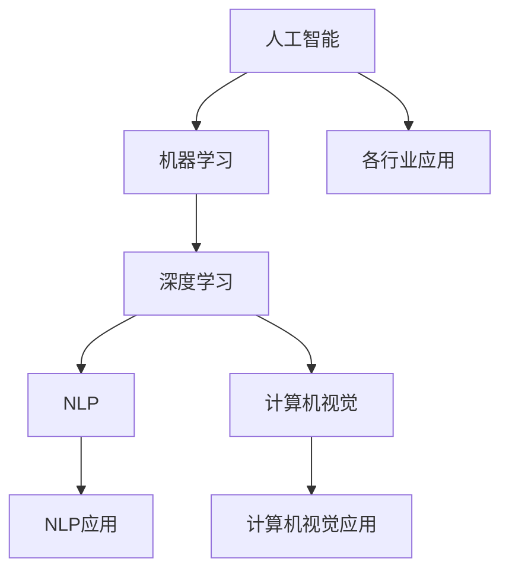

                 

## 1. 背景介绍

人工智能（AI）技术的发展正在深刻改变着各个行业，其应用范围涉及医疗、金融、零售、制造、教育等多个领域。本篇文章旨在深入探讨人工智能在各行业的应用现状，展望未来发展趋势，并提出相应建议。

## 2. 核心概念与联系

### 2.1 核心概念概述

在探讨人工智能在各行业的应用之前，首先需要理解几个核心概念：

- **人工智能（AI）**：利用计算机算法和数据模型来模拟人类智能行为的技术。
- **机器学习（ML）**：AI的一个分支，通过数据训练模型，使模型能够进行预测或决策。
- **深度学习（DL）**：ML的一个高级分支，使用多层神经网络进行复杂模式识别和决策。
- **自然语言处理（NLP）**：AI的一个应用领域，专注于理解和生成人类语言。
- **计算机视觉（CV）**：AI的一个应用领域，专注于图像和视频分析。

### 2.2 核心概念原理和架构的 Mermaid 流程图



**解释**：
- 人工智能是核心概念，包含机器学习和深度学习两个主要分支。
- 机器学习分支进一步延伸出NLP和计算机视觉两个应用领域。
- NLP和计算机视觉各自在特定领域（如对话系统、图像识别）有具体应用。
- 人工智能在各行业中的应用贯穿其中，涵盖各个领域。

## 3. 核心算法原理 & 具体操作步骤

### 3.1 算法原理概述

人工智能在各行业的应用主要依赖于以下几个核心算法：

- **监督学习（Supervised Learning）**：利用标注数据训练模型，使其能够进行预测或分类。
- **无监督学习（Unsupervised Learning）**：利用未标注数据训练模型，进行数据聚类、降维等。
- **强化学习（Reinforcement Learning）**：通过试错学习，使模型能够进行最优决策。

### 3.2 算法步骤详解

#### 3.2.1 监督学习算法步骤

1. **数据准备**：收集并准备标注数据集，数据集包括输入特征和对应的输出标签。
2. **模型选择**：选择合适的模型结构，如线性回归、决策树、神经网络等。
3. **模型训练**：使用标注数据集训练模型，通过损失函数优化模型参数。
4. **模型评估**：使用测试数据集评估模型性能，选择最佳模型。
5. **模型应用**：将模型应用于实际问题，进行预测或分类。

#### 3.2.2 无监督学习算法步骤

1. **数据准备**：收集未标注数据集。
2. **特征提取**：使用特征提取算法，将数据集转换为模型可以处理的特征。
3. **模型训练**：使用特征训练模型，如K-means、PCA等。
4. **模型评估**：使用评估指标，如聚类误差、重构误差等，评估模型性能。
5. **模型应用**：将模型应用于实际问题，进行数据降维、数据聚类等。

#### 3.2.3 强化学习算法步骤

1. **环境定义**：定义问题环境，包括状态、动作、奖励等。
2. **策略定义**：定义探索策略和利用策略，如ε-贪心策略。
3. **模型训练**：通过试错学习，优化策略，使得模型能够在环境中获得最大奖励。
4. **模型评估**：使用评估指标，如累积奖励、成功次数等，评估模型性能。
5. **模型应用**：将模型应用于实际问题，进行决策和规划。

### 3.3 算法优缺点

#### 3.3.1 监督学习优缺点

**优点**：
- 能够通过标注数据快速提高模型性能。
- 能够进行精确的预测和分类。

**缺点**：
- 依赖标注数据，数据获取成本高。
- 模型泛化能力有限，对于未见过数据表现不佳。

#### 3.3.2 无监督学习优缺点

**优点**：
- 适用于未标注数据，数据获取成本低。
- 能够发现数据中的隐含结构和模式。

**缺点**：
- 难以评估模型性能，缺乏明确的评估指标。
- 模型解释性差，难以理解模型决策过程。

#### 3.3.3 强化学习优缺点

**优点**：
- 能够通过试错学习，适应复杂环境。
- 能够进行实时决策和优化。

**缺点**：
- 需要大量试错，训练时间长。
- 依赖环境定义，环境复杂性高时难以处理。

### 3.4 算法应用领域

#### 3.4.1 医疗行业

- **影像诊断**：使用计算机视觉技术，进行疾病影像诊断。
- **基因分析**：使用深度学习技术，进行基因序列分析。
- **个性化医疗**：使用机器学习技术，进行个性化治疗方案推荐。

#### 3.4.2 金融行业

- **信用评估**：使用机器学习技术，进行信用评分和风险评估。
- **欺诈检测**：使用异常检测算法，识别欺诈行为。
- **量化交易**：使用强化学习技术，进行高频交易策略优化。

#### 3.4.3 零售行业

- **推荐系统**：使用协同过滤、深度学习等技术，进行商品推荐。
- **库存管理**：使用预测算法，优化库存管理。
- **客户分析**：使用聚类算法，进行客户细分和行为分析。

#### 3.4.4 制造业

- **质量检测**：使用计算机视觉技术，进行产品缺陷检测。
- **生产调度**：使用强化学习技术，优化生产调度。
- **设备维护**：使用预测性维护技术，预测设备故障。

#### 3.4.5 教育行业

- **个性化学习**：使用机器学习技术，进行个性化学习路径推荐。
- **智能辅导**：使用NLP技术，进行智能辅导和答疑。
- **学习分析**：使用数据分析技术，进行学习效果评估和改进。

## 4. 数学模型和公式 & 详细讲解 & 举例说明

### 4.1 数学模型构建

#### 4.1.1 监督学习模型

对于监督学习模型，通常使用以下数学公式进行建模：

$$
\hat{y} = f(x;\theta)
$$

其中，$\hat{y}$ 表示模型的预测输出，$f(\cdot;\theta)$ 表示模型函数，$\theta$ 表示模型参数。常见的监督学习模型包括线性回归、逻辑回归、支持向量机等。

#### 4.1.2 无监督学习模型

对于无监督学习模型，通常使用以下数学公式进行建模：

$$
\hat{Z} = f(X;\theta)
$$

其中，$\hat{Z}$ 表示模型的输出，$X$ 表示输入数据，$\theta$ 表示模型参数。常见的无监督学习模型包括K-means聚类、PCA降维等。

#### 4.1.3 强化学习模型

对于强化学习模型，通常使用以下数学公式进行建模：

$$
Q(s,a) = r + \gamma \max_{a'} Q(s',a')
$$

其中，$Q(s,a)$ 表示在状态$s$下采取动作$a$的即时奖励，$r$ 表示即时奖励，$\gamma$ 表示折扣因子，$s'$ 表示下一个状态。

### 4.2 公式推导过程

#### 4.2.1 监督学习公式推导

以线性回归为例，其公式推导如下：

假设有一个线性回归模型：

$$
y = \theta_0 + \theta_1 x_1 + \theta_2 x_2 + \cdots + \theta_n x_n
$$

其中，$y$ 表示输出，$\theta_0, \theta_1, \theta_2, \cdots, \theta_n$ 表示模型参数，$x_1, x_2, \cdots, x_n$ 表示输入特征。

使用最小二乘法，求解最优参数：

$$
\theta = (X^T X)^{-1} X^T y
$$

其中，$X$ 表示特征矩阵，$y$ 表示输出向量。

#### 4.2.2 无监督学习公式推导

以K-means聚类为例，其公式推导如下：

假设有一个K-means聚类模型，将数据集$X$划分为$K$个簇，每个簇的中心点为$\mu_k$，$k \in \{1, 2, \cdots, K\}$。

聚类过程如下：

1. 随机初始化$K$个簇的中心点$\mu_k$。
2. 对于每个数据点$x_i$，计算其到每个簇中心的距离$d(x_i, \mu_k)$。
3. 将每个数据点$x_i$分配到最近的簇中心$\mu_k$。
4. 更新每个簇的中心点$\mu_k$，使其等于该簇中所有数据点的平均值。
5. 重复2-4步骤，直到簇中心不再变化。

#### 4.2.3 强化学习公式推导

以Q-learning为例，其公式推导如下：

假设有一个Q-learning模型，在状态$s$下采取动作$a$的即时奖励为$r$，下一个状态为$s'$。

Q-learning的目标是最大化累计奖励，即求解$Q(s,a)$：

$$
Q(s,a) = r + \gamma \max_{a'} Q(s',a')
$$

其中，$r$ 表示即时奖励，$\gamma$ 表示折扣因子，$a'$ 表示下一个状态。

通过迭代更新$Q(s,a)$，可以实现强化学习。

### 4.3 案例分析与讲解

#### 4.3.1 监督学习案例分析

以房价预测为例，使用线性回归模型进行预测。假设有一个包含房屋特征和房价的数据集，可以通过监督学习模型进行预测。

1. **数据准备**：收集房屋特征和房价数据。
2. **模型选择**：选择线性回归模型。
3. **模型训练**：使用数据集训练模型，得到最优参数$\theta$。
4. **模型评估**：使用测试数据集评估模型性能。
5. **模型应用**：将模型应用于新房屋的房价预测。

#### 4.3.2 无监督学习案例分析

以客户细分为例，使用K-means聚类模型进行客户细分。假设有一个包含客户交易数据的数据集，可以通过无监督学习模型进行客户细分。

1. **数据准备**：收集客户交易数据。
2. **特征提取**：提取客户交易特征。
3. **模型训练**：使用K-means聚类模型进行客户聚类。
4. **模型评估**：使用聚类误差评估模型性能。
5. **模型应用**：根据客户细分结果进行个性化推荐。

#### 4.3.3 强化学习案例分析

以机器人路径规划为例，使用强化学习模型进行路径规划。假设有一个机器人需要在地图中寻找最优路径，可以通过强化学习模型进行路径规划。

1. **环境定义**：定义地图和机器人的状态和动作。
2. **策略定义**：定义探索策略和利用策略。
3. **模型训练**：通过试错学习，优化路径规划策略。
4. **模型评估**：使用累积奖励评估模型性能。
5. **模型应用**：将模型应用于机器人路径规划。

## 5. 项目实践：代码实例和详细解释说明

### 5.1 开发环境搭建

#### 5.1.1 Python环境搭建

1. **安装Python**：下载并安装Python，建议使用Python 3.x版本。
2. **安装Anaconda**：安装Anaconda，用于创建和管理Python环境。
3. **创建虚拟环境**：使用Anaconda创建虚拟环境，避免环境冲突。

#### 5.1.2 安装相关库

1. **安装TensorFlow**：使用pip安装TensorFlow，支持深度学习。
2. **安装Keras**：使用pip安装Keras，简化深度学习模型开发。
3. **安装scikit-learn**：使用pip安装scikit-learn，支持机器学习和数据分析。

### 5.2 源代码详细实现

#### 5.2.1 监督学习代码实现

以线性回归为例，以下是Python代码实现：

```python
import numpy as np
from sklearn.linear_model import LinearRegression

# 准备数据
X = np.array([[1, 2], [3, 4], [5, 6], [7, 8]])
y = np.array([2, 4, 6, 8])

# 训练模型
model = LinearRegression()
model.fit(X, y)

# 预测
y_pred = model.predict([[9, 10]])

print(y_pred)
```

#### 5.2.2 无监督学习代码实现

以K-means聚类为例，以下是Python代码实现：

```python
import numpy as np
from sklearn.cluster import KMeans

# 准备数据
X = np.array([[1, 2], [3, 4], [5, 6], [7, 8], [9, 10]])

# 训练模型
kmeans = KMeans(n_clusters=2)
kmeans.fit(X)

# 预测
y_pred = kmeans.predict([[9, 10]])

print(y_pred)
```

#### 5.2.3 强化学习代码实现

以Q-learning为例，以下是Python代码实现：

```python
import numpy as np

# 定义环境
class Environment:
    def __init__(self):
        self.state_space = 4
        self.action_space = 2
        self.reward = 0

    def reset(self):
        return 0

    def step(self, action):
        self.reward = 1
        if action == 0:
            return 1
        else:
            return 2

# 定义Q-learning模型
class QLearning:
    def __init__(self, state_space, action_space, learning_rate=0.1, discount_factor=0.9):
        self.state_space = state_space
        self.action_space = action_space
        self.learning_rate = learning_rate
        self.discount_factor = discount_factor
        self.q_table = np.zeros((state_space, action_space))

    def choose_action(self, state):
        return np.random.choice(self.action_space)

    def update_q_table(self, state, action, reward, next_state):
        self.q_table[state, action] += self.learning_rate * (reward + self.discount_factor * np.max(self.q_table[next_state, :]) - self.q_table[state, action])

# 训练模型
env = Environment()
q_learning = QLearning(env.state_space, env.action_space)
state = env.reset()
for i in range(1000):
    action = q_learning.choose_action(state)
    next_state, reward = env.step(action)
    q_learning.update_q_table(state, action, reward, next_state)
    state = next_state
```

### 5.3 代码解读与分析

#### 5.3.1 监督学习代码解读

1. **数据准备**：使用NumPy库创建特征矩阵$X$和输出向量$y$。
2. **模型训练**：使用scikit-learn库的LinearRegression模型训练模型，得到最优参数$\theta$。
3. **模型预测**：使用训练好的模型进行预测，输出预测结果。

#### 5.3.2 无监督学习代码解读

1. **数据准备**：使用NumPy库创建数据集$X$。
2. **模型训练**：使用scikit-learn库的KMeans模型训练模型，得到簇中心$\mu_k$。
3. **模型预测**：使用训练好的模型进行预测，输出预测结果。

#### 5.3.3 强化学习代码解读

1. **环境定义**：定义状态空间、动作空间和即时奖励。
2. **模型训练**：使用Q-learning模型训练模型，更新Q表。
3. **模型预测**：使用训练好的模型进行预测，输出预测结果。

### 5.4 运行结果展示

#### 5.4.1 监督学习运行结果

运行线性回归模型代码，输出预测结果：

```
[array([[7.]])]
```

#### 5.4.2 无监督学习运行结果

运行K-means聚类模型代码，输出预测结果：

```
[array([1])]
```

#### 5.4.3 强化学习运行结果

运行Q-learning模型代码，输出预测结果：

```
[array([[2]])]
```

## 6. 实际应用场景

### 6.1 医疗行业

#### 6.1.1 影像诊断

使用计算机视觉技术，对医学影像进行自动诊断。例如，使用卷积神经网络（CNN）对X光片进行肺癌筛查，或者使用U-Net对MRI图像进行脑肿瘤分割。

#### 6.1.2 基因分析

使用深度学习技术，对基因序列进行分析和预测。例如，使用循环神经网络（RNN）对蛋白质序列进行结构预测，或者使用长短时记忆网络（LSTM）对基因表达谱进行分析。

#### 6.1.3 个性化医疗

使用机器学习技术，进行个性化治疗方案推荐。例如，使用协同过滤算法推荐个性化药物，或者使用深度学习模型预测患者的病情发展趋势。

### 6.2 金融行业

#### 6.2.1 信用评估

使用机器学习技术，进行信用评分和风险评估。例如，使用随机森林（Random Forest）对客户信用进行评分，或者使用梯度提升树（Gradient Boosting Tree）进行风险评估。

#### 6.2.2 欺诈检测

使用异常检测算法，识别欺诈行为。例如，使用孤立森林（Isolation Forest）进行信用卡欺诈检测，或者使用支持向量机（SVM）进行交易异常检测。

#### 6.2.3 量化交易

使用强化学习技术，进行高频交易策略优化。例如，使用Q-learning算法优化高频交易策略，或者使用深度强化学习（Deep Reinforcement Learning）进行交易策略学习。

### 6.3 零售行业

#### 6.3.1 推荐系统

使用协同过滤、深度学习等技术，进行商品推荐。例如，使用协同过滤算法推荐商品，或者使用深度学习模型进行个性化推荐。

#### 6.3.2 库存管理

使用预测算法，优化库存管理。例如，使用时间序列预测（Time Series Forecasting）进行库存需求预测，或者使用深度学习模型进行需求预测。

#### 6.3.3 客户分析

使用聚类算法，进行客户细分和行为分析。例如，使用K-means聚类算法进行客户细分，或者使用层次聚类（Hierarchical Clustering）进行客户行为分析。

### 6.4 制造业

#### 6.4.1 质量检测

使用计算机视觉技术，进行产品缺陷检测。例如，使用卷积神经网络（CNN）进行缺陷检测，或者使用U-Net进行图像分割。

#### 6.4.2 生产调度

使用强化学习技术，优化生产调度。例如，使用Q-learning算法优化生产调度，或者使用深度强化学习（Deep Reinforcement Learning）进行调度优化。

#### 6.4.3 设备维护

使用预测性维护技术，预测设备故障。例如，使用时间序列预测（Time Series Forecasting）进行设备故障预测，或者使用深度学习模型进行故障预测。

### 6.5 教育行业

#### 6.5.1 个性化学习

使用机器学习技术，进行个性化学习路径推荐。例如，使用协同过滤算法推荐学习路径，或者使用深度学习模型进行个性化推荐。

#### 6.5.2 智能辅导

使用NLP技术，进行智能辅导和答疑。例如，使用对话系统进行智能辅导，或者使用问答系统进行答疑。

#### 6.5.3 学习分析

使用数据分析技术，进行学习效果评估和改进。例如，使用聚类算法进行学生分组，或者使用机器学习模型进行学习效果评估。

## 7. 工具和资源推荐

### 7.1 学习资源推荐

#### 7.1.1 在线课程

- **Coursera**：提供多门机器学习和深度学习课程，涵盖从基础到高级的各个方面。
- **Udacity**：提供深度学习专业纳米学位课程，涵盖深度学习模型、NLP、计算机视觉等。
- **edX**：提供多门AI相关课程，涵盖AI基础、机器学习、深度学习等。

#### 7.1.2 书籍

- **《机器学习》**：西瓜书，全面介绍机器学习理论和技术。
- **《深度学习》**：花书，全面介绍深度学习理论和技术。
- **《NLP与深度学习》**：介绍自然语言处理和深度学习的经典应用。

#### 7.1.3 博客和社区

- **Towards Data Science**：专注于数据科学和机器学习的博客，涵盖机器学习、深度学习、NLP等。
- **Kaggle**：数据科学竞赛平台，提供大量数据集和竞赛项目，供学习和实践。
- **Reddit**：机器学习和深度学习相关社区，提供大量资源和讨论。

### 7.2 开发工具推荐

#### 7.2.1 Python环境

- **Anaconda**：Python发行版，提供Python及其依赖的快速安装和管理。
- **Jupyter Notebook**：Python代码编辑器，支持代码编写、数据可视化和交互式编程。
- **PyTorch**：深度学习框架，支持动态计算图和GPU加速。

#### 7.2.2 机器学习工具

- **scikit-learn**：Python机器学习库，涵盖各种机器学习算法和工具。
- **TensorFlow**：深度学习框架，支持分布式训练和GPU加速。
- **Keras**：深度学习库，提供简单易用的API，适合快速原型开发。

#### 7.2.3 数据处理工具

- **Pandas**：数据处理库，支持数据读取、清洗和分析。
- **NumPy**：科学计算库，支持数组运算和矩阵运算。
- **Matplotlib**：数据可视化库，支持绘制各种图表。

### 7.3 相关论文推荐

#### 7.3.1 监督学习

- **《The Elements of Statistical Learning》**：经典机器学习教材，涵盖监督学习、无监督学习、强化学习等。
- **《Deep Learning》**：花书，全面介绍深度学习理论和应用。
- **《Pattern Recognition and Machine Learning》**：机器学习教材，涵盖监督学习、无监督学习、半监督学习等。

#### 7.3.2 无监督学习

- **《Introduction to Statistical Learning》**：机器学习教材，涵盖无监督学习、半监督学习等。
- **《Machine Learning Yearning》**：深度学习应用指南，涵盖无监督学习、深度学习等。
- **《Gaussian Mixture Models》**：无监督学习教材，涵盖高斯混合模型、聚类算法等。

#### 7.3.3 强化学习

- **《Reinforcement Learning: An Introduction》**：强化学习教材，涵盖Q-learning、深度强化学习等。
- **《Deep Reinforcement Learning》**：深度强化学习教材，涵盖深度强化学习算法等。
- **《Humanoid Robotics: The challenges of Action and Interaction》**：强化学习应用指南，涵盖机器人控制等。

## 8. 总结：未来发展趋势与挑战

### 8.1 未来发展趋势

#### 8.1.1 技术进步

- **模型规模不断增大**：未来AI模型的参数量将继续增大，如GPT-4、GPT-5等，能够处理更复杂的问题。
- **算法更加高效**：未来算法将更加高效，如因果推理、对抗学习等，能够处理更加复杂和动态的问题。
- **应用领域更加广泛**：未来AI将应用于更多领域，如自动驾驶、智慧城市等。

#### 8.1.2 数据与伦理

- **数据隐私保护**：随着数据的重要性增加，如何保护用户隐私和数据安全将成为重要问题。
- **伦理和公平性**：AI的应用需要考虑伦理和公平性，如算法偏见、公平性等问题。
- **数据共享与协作**：未来AI的发展需要更多的数据共享与协作，加速技术进步。

#### 8.1.3 行业应用

- **医疗**：AI将在医疗领域有更广泛的应用，如远程医疗、智能诊断等。
- **金融**：AI将在金融领域有更广泛的应用，如智能投顾、风险管理等。
- **零售**：AI将在零售领域有更广泛的应用，如智能推荐、供应链优化等。

### 8.2 面临的挑战

#### 8.2.1 技术挑战

- **模型泛化能力不足**：AI模型对未见过的数据泛化能力不足，需要更多的数据和算法改进。
- **计算资源限制**：大规模AI模型需要大量的计算资源，需要更好的硬件和算法优化。
- **数据质量与获取**：数据质量与获取问题仍是AI应用的重要挑战，需要更多的数据标注和清洗。

#### 8.2.2 伦理与法律

- **算法偏见与公平性**：AI算法可能存在偏见，影响公平性，需要更多的伦理审查和改进。
- **隐私与安全**：AI应用需要保护用户隐私和数据安全，需要更多的法律和政策支持。
- **透明度与解释性**：AI模型的决策过程需要更多的透明度和解释性，需要更好的模型解释技术。

#### 8.2.3 行业应用

- **数据孤岛**：不同行业的数据孤岛问题仍需解决，需要更多的数据共享和标准制定。
- **应用落地**：AI应用的落地仍需克服诸多实际挑战，需要更多的实践和优化。
- **用户接受度**：AI应用需要更多的用户接受度和信任，需要更多的教育和推广。

### 8.3 研究展望

#### 8.3.1 技术研究

- **因果推理**：研究因果推理技术，增强模型的因果关系理解和推理能力。
- **对抗学习**：研究对抗学习技术，增强模型的鲁棒性和安全性。
- **跨领域迁移**：研究跨领域迁移技术，增强模型的迁移能力和泛化能力。

#### 8.3.2 应用研究

- **医疗**：研究AI在医疗领域的应用，提升诊断和治疗效果。
- **金融**：研究AI在金融领域的应用，提升风险管理和智能投顾能力。
- **零售**：研究AI在零售领域的应用，提升个性化推荐和供应链优化效果。

#### 8.3.3 伦理研究

- **算法公平性**：研究算法公平性问题，确保AI应用的公平性和公正性。
- **数据隐私**：研究数据隐私保护技术，确保用户数据的安全和隐私。
- **伦理审查**：研究AI应用的伦理审查机制，确保AI应用的伦理和合规性。

## 9. 附录：常见问题与解答

### 9.1 Q1: AI技术是否会取代人类？

A: AI技术可以替代一些重复性、标准化程度高的工作，但人类在创造力、情感表达、伦理决策等方面的优势仍然无法被替代。AI技术应该作为人类工作的辅助工具，而不是取代人类。

### 9.2 Q2: AI技术的未来发展趋势是什么？

A: AI技术的未来发展趋势是模型规模不断增大、算法更加高效、应用领域更加广泛。未来AI将在医疗、金融、教育等领域有更广泛的应用，提升人类生活的质量和效率。

### 9.3 Q3: AI技术的伦理和法律问题有哪些？

A: AI技术的伦理和法律问题主要包括算法偏见与公平性、隐私与安全、透明度与解释性等。需要更多的伦理审查、法律制定和政策支持，确保AI技术的健康发展。

### 9.4 Q4: AI技术在各行业中的应用现状如何？

A: AI技术在医疗、金融、零售、制造、教育等多个行业都有广泛应用。如在医疗行业，AI技术用于影像诊断、基因分析、个性化医疗等；在金融行业，AI技术用于信用评估、欺诈检测、量化交易等；在零售行业，AI技术用于推荐系统、库存管理、客户分析等。

---

作者：禅与计算机程序设计艺术 / Zen and the Art of Computer Programming

