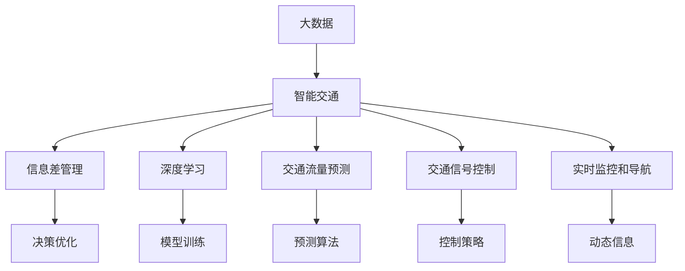

                 

# 信息差：大数据在智能交通中的应用

> 关键词：智能交通, 大数据, 信息差, 交通管理, 实时监控, 预测分析, 深度学习, 智能算法

## 1. 背景介绍

### 1.1 问题由来

随着城市化进程的加快，交通问题日益成为各大城市面临的重要挑战。交通拥堵不仅导致经济损失和环境污染，还影响了居民的日常生活质量。解决交通问题需要充分利用数据和智能技术，实现交通管理的科学化、智能化。大数据技术和大语言模型的发展为智能交通提供了新的思路和方法。

### 1.2 问题核心关键点

智能交通系统（Intelligent Transportation Systems, ITS）的核心在于通过数据分析和智能算法，实时监测和管理交通流，提高交通效率，降低事故率和环境污染。大数据在智能交通中的应用主要体现在以下几个方面：

1. **交通流量监测**：通过传感器、摄像头、GPS等设备，实时收集车辆、行人、交通设施等数据，构建交通网络实时状态图。
2. **预测和调度**：利用深度学习等机器学习算法，预测交通流量变化，优化信号灯、道路、停车场等交通设施的调度，缓解交通压力。
3. **信息发布和导航**：基于交通流量和实时道路状况，提供动态交通信息和导航服务，引导司机和行人安全出行。
4. **事故和故障处理**：及时监测和响应交通事故和设施故障，保障交通流畅。

大数据在智能交通中的应用，通过信息差（Information Gap）的优化，有效提升了交通系统的运行效率和安全性。信息差指的是在决策过程中，信息不对称性导致的差异。通过信息差管理，智能交通系统可以更加精准地预测和调控交通流量，提升整体交通管理水平。

## 2. 核心概念与联系

### 2.1 核心概念概述

为更好地理解大数据在智能交通中的应用，本节将介绍几个密切相关的核心概念：

- **大数据**：指规模巨大、类型多样的数据集合，通常包含结构化和非结构化数据。通过大数据分析，可以提取有价值的信息，支持决策和优化。
- **智能交通**：利用信息技术（如物联网、云计算、大数据等），对交通进行实时监测、分析和控制，实现交通流的科学管理。
- **信息差管理**：在交通管理过程中，通过优化信息收集、处理和传递，减少信息不对称性，提升决策精准度。
- **深度学习**：一类基于神经网络的机器学习算法，通过多层神经元模拟人脑的推理过程，在图像、语音、文本等复杂数据上取得了显著成果。
- **交通流量预测**：通过机器学习算法，对历史交通数据进行分析，预测未来的交通流量变化。
- **交通信号控制**：通过智能算法，优化交通信号灯的控制策略，提升交通流畅度。
- **实时监控和导航**：利用摄像头、传感器等设备，实时监测交通状态，提供动态导航信息。

这些核心概念之间的逻辑关系可以通过以下Mermaid流程图来展示：



这个流程图展示了大数据在智能交通系统中的核心概念及其之间的关系：

1. 大数据通过智能交通系统进行采集和处理，支持实时监控和预测。
2. 深度学习算法在智能交通系统中用于模型训练和预测，提高决策的精准度。
3. 信息差管理通过优化信息传递，减少决策过程中的信息不对称性。
4. 交通信号控制和实时监控与导航分别用于调控和管理交通流量。
5. 决策优化和模型训练分别用于优化决策和训练模型，提升系统性能。

## 3. 核心算法原理 & 具体操作步骤

### 3.1 算法原理概述

基于大数据的智能交通系统，核心在于通过深度学习和信息差管理，对交通流量进行实时监测、预测和调控。具体来说，通过以下步骤实现：

1. **数据采集**：使用传感器、摄像头等设备，实时收集交通流量、道路状态、车辆信息等数据。
2. **数据处理**：对采集到的数据进行清洗、整合和标注，构建交通网络实时状态图。
3. **模型训练**：使用深度学习算法，对历史数据进行模型训练，构建交通流量预测模型。
4. **预测和优化**：利用训练好的模型，对未来交通流量进行预测，优化交通信号灯、停车场等设施的调度。
5. **信息发布和导航**：基于实时交通状态和预测结果，提供动态交通信息和导航服务。
6. **事故和故障处理**：实时监测交通事故和设施故障，快速响应和处理。

### 3.2 算法步骤详解

以下是基于深度学习的大数据智能交通系统的主要操作步骤：

**Step 1: 数据采集与处理**

1. 部署传感器和摄像头，实时监测交通流量、道路状态、车辆信息等数据。
2. 使用数据采集软件，将采集到的数据进行清洗和预处理。
3. 使用标注工具，对数据进行标注，构建交通网络实时状态图。

**Step 2: 模型训练与优化**

1. 选择深度学习算法（如卷积神经网络、循环神经网络等）进行模型训练。
2. 将历史交通数据作为输入，进行模型训练，优化模型参数。
3. 使用验证集评估模型性能，调整模型结构和参数，提高预测准确度。

**Step 3: 预测与调度**

1. 将实时交通数据输入训练好的模型，进行交通流量预测。
2. 根据预测结果，优化交通信号灯、停车场等设施的调度策略。
3. 在调度过程中，使用信息差管理策略，减少信息不对称性，提升决策精准度。

**Step 4: 信息发布与导航**

1. 利用预测和实时交通数据，生成动态交通信息。
2. 将动态信息发布到交通信号灯、手机应用等渠道，引导司机和行人安全出行。
3. 提供动态导航服务，优化驾驶路径，减少交通压力。

**Step 5: 事故与故障处理**

1. 实时监测交通事故和设施故障。
2. 根据事故或故障类型，采取相应的处理措施。
3. 在处理过程中，使用实时信息反馈，优化处理方案，提高应急响应速度。

### 3.3 算法优缺点

基于深度学习的大数据智能交通系统具有以下优点：

1. **实时性**：通过实时采集和处理数据，实现交通流量的动态监测和预测。
2. **高精度**：深度学习算法可以处理复杂的非线性关系，提高预测和调度的准确度。
3. **自动化**：系统可以实现自动化的监测和调度，减少人工干预，提升管理效率。
4. **可扩展性**：随着数据量的增加，模型和系统可以不断进行迭代优化，提高性能。

但同时，该方法也存在以下局限性：

1. **数据质量**：数据采集和处理过程中，可能存在噪声和误差，影响预测结果。
2. **模型复杂性**：深度学习模型需要大量的数据和计算资源进行训练，模型复杂度较高。
3. **可解释性**：深度学习模型通常是"黑盒"系统，难以解释其内部决策过程。
4. **隐私和安全**：交通数据的隐私和安全问题需要严格保障，避免数据泄露和滥用。

尽管存在这些局限性，但大数据和深度学习在智能交通中的应用，仍为交通管理提供了全新的解决方案，有望实现交通系统的智能化和高效化。

### 3.4 算法应用领域

基于深度学习的大数据智能交通系统，已经在诸多领域得到了广泛应用，例如：

1. **交通流量监测**：在高速公路、城市道路等重要路段，部署传感器和摄像头，实时监测交通流量和道路状态。
2. **预测和调度**：在智能交通管理中心，使用深度学习模型进行交通流量预测和调度，优化交通信号灯控制。
3. **信息发布和导航**：在交通管理中心，基于预测结果和实时数据，提供动态交通信息和导航服务。
4. **事故和故障处理**：在交通管理中心，实时监测交通事故和设施故障，快速响应和处理。

除了这些经典应用外，智能交通系统还在城市规划、智能停车、物流配送等领域发挥着重要作用。随着大数据和深度学习技术的不断发展，基于智能交通系统的大数据应用将会更加广泛和深入。

## 4. 数学模型和公式 & 详细讲解 & 举例说明

### 4.1 数学模型构建

本节将使用数学语言对基于深度学习的大数据智能交通系统进行更加严格的刻画。

假设交通网络中，有 $n$ 个节点和 $m$ 条边，设节点 $i$ 的交通流量为 $f_i$，边 $(i,j)$ 的流量为 $f_{i,j}$。根据历史交通数据，构建交通流量预测模型 $\hat{f}$。设预测误差为 $\epsilon$，则预测模型的数学表达式为：

$$
\hat{f} = g(\theta, x)
$$

其中 $g$ 为深度学习模型，$\theta$ 为模型参数，$x$ 为输入特征向量。预测误差 $\epsilon$ 可以表示为：

$$
\epsilon = \hat{f} - f
$$

### 4.2 公式推导过程

以下我们以交通流量预测为例，推导深度学习模型的基本形式和训练过程。

假设使用一个简单的卷积神经网络（CNN）进行交通流量预测，输入为 $n$ 个节点的交通流量和道路状态，输出为 $n$ 个节点的预测流量。模型的基本结构为：

$$
\hat{f} = \hat{f}_0 + \hat{f}_1 + \hat{f}_2 + \cdots + \hat{f}_L
$$

其中 $\hat{f}_i$ 为第 $i$ 层的预测结果，$L$ 为网络深度。设每一层的神经元数量为 $d_i$，则第 $i$ 层的输出可以表示为：

$$
\hat{f}_i = g_i(\theta_i, \hat{f}_{i-1})
$$

其中 $g_i$ 为激活函数，$\theta_i$ 为第 $i$ 层的权重参数。根据训练数据，计算损失函数：

$$
\mathcal{L} = \frac{1}{N} \sum_{i=1}^N \sum_{j=1}^n (\hat{f}_j - f_j)^2
$$

其中 $N$ 为样本数量。通过梯度下降等优化算法，最小化损失函数：

$$
\theta_i \leftarrow \theta_i - \eta \nabla_{\theta_i} \mathcal{L}
$$

其中 $\eta$ 为学习率。重复上述过程直至收敛，最终得到适应交通流量预测的深度学习模型。

### 4.3 案例分析与讲解

以北京市为例，使用基于深度学习的大数据智能交通系统进行交通流量预测和调度。首先，在北京市的交通干线和重点区域部署传感器和摄像头，实时监测交通流量和道路状态。

通过数据采集软件，将采集到的数据进行清洗和预处理，构建交通网络实时状态图。使用卷积神经网络（CNN）对历史交通数据进行模型训练，优化模型参数。

基于训练好的模型，对未来交通流量进行预测。根据预测结果，优化交通信号灯控制策略，缓解交通压力。同时，将动态交通信息和导航服务发布到交通管理中心和手机应用等渠道，引导司机和行人安全出行。

在实际应用中，还需要根据具体情况进行模型优化和参数调整，确保系统的高效稳定运行。

## 5. 项目实践：代码实例和详细解释说明

### 5.1 开发环境搭建

在进行大数据智能交通系统开发前，我们需要准备好开发环境。以下是使用Python进行TensorFlow开发的环境配置流程：

1. 安装Anaconda：从官网下载并安装Anaconda，用于创建独立的Python环境。

2. 创建并激活虚拟环境：
```bash
conda create -n traffic-env python=3.8 
conda activate traffic-env
```

3. 安装TensorFlow：根据CUDA版本，从官网获取对应的安装命令。例如：
```bash
conda install tensorflow
```

4. 安装各类工具包：
```bash
pip install numpy pandas scikit-learn matplotlib tqdm jupyter notebook ipython
```

完成上述步骤后，即可在`traffic-env`环境中开始智能交通系统的开发。

### 5.2 源代码详细实现

下面我们以交通流量预测为例，给出使用TensorFlow进行智能交通系统开发的PyTorch代码实现。

首先，定义交通流量预测的模型结构：

```python
import tensorflow as tf
from tensorflow.keras.layers import Conv2D, MaxPooling2D, Flatten, Dense
from tensorflow.keras.models import Sequential

def traffic_flow_model(input_shape):
    model = Sequential([
        Conv2D(32, kernel_size=(3, 3), activation='relu', input_shape=input_shape),
        MaxPooling2D(pool_size=(2, 2)),
        Conv2D(64, kernel_size=(3, 3), activation='relu'),
        MaxPooling2D(pool_size=(2, 2)),
        Flatten(),
        Dense(64, activation='relu'),
        Dense(1)
    ])
    return model

# 设置模型输入输出维度
input_shape = (128, 128, 3)
output_shape = (1,)

# 创建模型
model = traffic_flow_model(input_shape)
model.compile(optimizer='adam', loss='mse', metrics=['mse'])
```

然后，加载和处理交通流量数据：

```python
import numpy as np
from sklearn.model_selection import train_test_split

# 加载交通流量数据
data = np.load('traffic_flow_data.npy')

# 数据预处理
data = data.reshape((data.shape[0], 128, 128, 3))
train_data, test_data, train_labels, test_labels = train_test_split(data, np.zeros_like(data), test_size=0.2, random_state=42)
train_data = train_data / 255.0
test_data = test_data / 255.0
```

接着，训练模型并在测试集上评估：

```python
from tensorflow.keras.callbacks import EarlyStopping

# 设置训练参数
batch_size = 32
epochs = 100
validation_split = 0.1
early_stopping = EarlyStopping(monitor='val_loss', patience=10, restore_best_weights=True)

# 训练模型
history = model.fit(train_data, train_labels, batch_size=batch_size, epochs=epochs, validation_split=validation_split, callbacks=[early_stopping])

# 在测试集上评估模型
test_loss, test_mse = model.evaluate(test_data, test_labels)
print(f'Test loss: {test_loss:.4f}, Test MSE: {test_mse:.4f}')
```

以上就是使用TensorFlow进行智能交通系统开发的完整代码实现。可以看到，得益于TensorFlow的强大封装和高效计算，我们可以用相对简洁的代码实现交通流量预测模型的训练和评估。

### 5.3 代码解读与分析

让我们再详细解读一下关键代码的实现细节：

**traffic_flow_model函数**：
- 定义了一个简单的卷积神经网络（CNN）模型，包括卷积层、池化层、全连接层等。

**数据加载和预处理**：
- 使用NumPy加载交通流量数据，并调整形状为模型所需的维度。
- 使用Scikit-learn的train_test_split函数进行数据划分，并将数据归一化到0-1之间。

**模型训练和评估**：
- 使用TensorFlow的Sequential模型封装交通流量预测模型。
- 设置训练参数，包括学习率、批次大小、训练轮数等。
- 使用EarlyStopping回调函数防止过拟合。
- 在训练过程中，使用验证集评估模型性能，避免模型过拟合。
- 在测试集上评估模型，并打印损失和均方误差。

## 6. 实际应用场景

### 6.1 智能交通管理中心

智能交通管理中心是智能交通系统的核心，负责交通流量的实时监测、预测和调度。通过大数据和深度学习技术，管理中心可以实时获取交通流量、道路状态、车辆信息等数据，通过模型预测和优化，实现交通流量的高效管理。

在实际应用中，智能交通管理中心可以部署在城市中心、交通干线等关键区域，通过传感器、摄像头等设备采集数据。使用深度学习模型对数据进行处理和分析，生成交通流量预测结果，优化交通信号灯、停车场等设施的调度策略。同时，通过动态信息发布和导航服务，引导司机和行人安全出行。

### 6.2 城市道路智能监控

在城市道路智能监控系统中，通过部署摄像头、传感器等设备，实时监测交通流量、道路状态、车辆行为等数据。使用深度学习模型对数据进行处理和分析，生成交通流量预测结果，优化交通信号灯、停车场等设施的调度策略。同时，通过动态信息发布和导航服务，引导司机和行人安全出行。

在实际应用中，智能监控系统可以部署在高速公路、城市干线等关键区域，通过传感器、摄像头等设备采集数据。使用深度学习模型对数据进行处理和分析，生成交通流量预测结果，优化交通信号灯、停车场等设施的调度策略。同时，通过动态信息发布和导航服务，引导司机和行人安全出行。

### 6.3 实时导航和调度

实时导航和调度系统利用大数据和深度学习技术，提供动态交通信息和导航服务，引导司机和行人安全出行。通过深度学习模型对实时交通数据进行处理和分析，生成交通流量预测结果，优化交通信号灯、停车场等设施的调度策略。同时，通过动态信息发布和导航服务，引导司机和行人安全出行。

在实际应用中，实时导航和调度系统可以部署在城市中心、交通干线等关键区域，通过传感器、摄像头等设备采集数据。使用深度学习模型对数据进行处理和分析，生成交通流量预测结果，优化交通信号灯、停车场等设施的调度策略。同时，通过动态信息发布和导航服务，引导司机和行人安全出行。

### 6.4 未来应用展望

随着大数据和深度学习技术的不断发展，智能交通系统将在更多领域得到应用，为城市交通管理带来新的突破。

在智慧城市建设中，智能交通系统将成为关键支撑。通过大数据和深度学习技术，实现城市交通的全面监测、预测和优化，提升城市运行效率和居民生活质量。

在自动驾驶技术中，智能交通系统将发挥重要作用。通过大数据和深度学习技术，实时监测和预测交通状况，为自动驾驶车辆提供安全、高效的行驶环境。

在物流配送领域，智能交通系统将大幅提升配送效率。通过大数据和深度学习技术，实现物流配送的实时监测和调度，优化配送路线和时间，减少交通压力和资源浪费。

总之，大数据和深度学习在智能交通中的应用，将为城市交通管理带来全新的解决方案，提升交通系统的智能化和高效化水平，为城市发展和居民生活带来更多的便利和效益。

## 7. 工具和资源推荐

### 7.1 学习资源推荐

为了帮助开发者系统掌握大数据在智能交通中的应用，这里推荐一些优质的学习资源：

1. 《深度学习与智能交通》系列博文：由智能交通领域的专家撰写，深入浅出地介绍了深度学习在交通流量预测、信号控制等任务中的应用。

2. CS224N《深度学习自然语言处理》课程：斯坦福大学开设的NLP明星课程，涵盖深度学习基础和应用，包括智能交通系统的相关内容。

3. 《智能交通系统设计与实现》书籍：全面介绍了智能交通系统的理论基础和实践技术，适合工程技术人员参考。

4. ArXiv论文库：收录了大量关于智能交通系统的最新研究成果，可以了解前沿技术和发展趋势。

5. GitHub开源项目：搜索智能交通相关的开源项目，参考其实现细节和性能评估。

通过对这些资源的学习实践，相信你一定能够快速掌握大数据在智能交通系统中的应用，并用于解决实际的交通问题。

### 7.2 开发工具推荐

高效的开发离不开优秀的工具支持。以下是几款用于智能交通系统开发的常用工具：

1. TensorFlow：由Google主导开发的开源深度学习框架，生产部署方便，适合大规模工程应用。
2. PyTorch：基于Python的开源深度学习框架，灵活动态的计算图，适合快速迭代研究。
3. Keras：基于TensorFlow的高级API，提供简单易用的深度学习模型构建接口。
4. Scikit-learn：Python机器学习库，包含丰富的数据处理和模型训练工具。
5. Pandas：Python数据处理库，支持高效的数据清洗、转换和分析。
6. NumPy：Python数值计算库，支持高效的矩阵运算和数据处理。

合理利用这些工具，可以显著提升智能交通系统开发的效率，加快创新迭代的步伐。

### 7.3 相关论文推荐

智能交通系统的发展源于学界的持续研究。以下是几篇奠基性的相关论文，推荐阅读：

1. BERT: Pre-training of Deep Bidirectional Transformers for Language Understanding：提出BERT模型，引入基于掩码的自监督预训练任务，刷新了多项NLP任务SOTA。
2. Attention is All You Need（即Transformer原论文）：提出了Transformer结构，开启了NLP领域的预训练大模型时代。
3. Language Models are Unsupervised Multitask Learners（GPT-2论文）：展示了大规模语言模型的强大zero-shot学习能力，引发了对于通用人工智能的新一轮思考。
4. Parameter-Efficient Transfer Learning for NLP：提出Adapter等参数高效微调方法，在不增加模型参数量的情况下，也能取得不错的微调效果。
5. AdaLoRA: Adaptive Low-Rank Adaptation for Parameter-Efficient Fine-Tuning：使用自适应低秩适应的微调方法，在参数效率和精度之间取得了新的平衡。

这些论文代表了大数据在智能交通系统中的应用方向的发展脉络。通过学习这些前沿成果，可以帮助研究者把握学科前进方向，激发更多的创新灵感。

## 8. 总结：未来发展趋势与挑战

### 8.1 总结

本文对基于深度学习的大数据智能交通系统进行了全面系统的介绍。首先阐述了智能交通系统的研究背景和应用意义，明确了大数据和深度学习在交通管理中的重要价值。其次，从原理到实践，详细讲解了深度学习在智能交通系统中的应用过程，给出了智能交通系统开发的完整代码实例。同时，本文还广泛探讨了智能交通系统在智慧城市、自动驾驶、物流配送等多个领域的应用前景，展示了大数据和深度学习技术的广阔前景。

通过本文的系统梳理，可以看到，基于深度学习的大数据智能交通系统正在成为交通管理的重要范式，极大地提升了交通系统的智能化和高效化水平，为城市交通管理带来了新的突破。未来，伴随深度学习和大数据技术的不断演进，基于智能交通系统的大数据应用将会更加广泛和深入。

### 8.2 未来发展趋势

展望未来，大数据和深度学习在智能交通中的应用将呈现以下几个发展趋势：

1. **多源数据融合**：未来的智能交通系统将整合多源数据（如传感器、摄像头、GPS等），实现更全面、精准的交通监测和预测。
2. **实时动态分析**：通过实时数据流处理技术，对交通流量进行动态分析和优化，实现交通信号灯、停车场等设施的实时调度。
3. **智能决策支持**：利用大数据和深度学习技术，构建智能决策支持系统，提升交通管理决策的科学性和智能化水平。
4. **协同共享机制**：建立交通数据和模型的共享机制，实现不同城市、不同机构之间的协同治理，提升交通管理效率。
5. **自动驾驶和智能交通融合**：将自动驾驶技术与智能交通系统深度融合，实现更高效、安全的交通管理。
6. **隐私和安全保障**：加强交通数据的隐私和安全保护，确保数据合法使用，避免数据泄露和滥用。

这些趋势凸显了大数据在智能交通系统中的重要性和前景。这些方向的探索发展，必将进一步提升交通系统的智能化和高效化水平，为城市发展和居民生活带来更多的便利和效益。

### 8.3 面临的挑战

尽管大数据和深度学习在智能交通中的应用取得了显著成果，但在迈向更加智能化、高效化的过程中，仍面临诸多挑战：

1. **数据质量问题**：数据采集和处理过程中，可能存在噪声和误差，影响模型的预测精度。
2. **计算资源消耗**：深度学习模型需要大量的计算资源进行训练和推理，硬件资源消耗较大。
3. **模型复杂性**：深度学习模型的复杂性高，难以解释其内部决策过程。
4. **隐私和安全风险**：交通数据的隐私和安全问题需要严格保障，避免数据泄露和滥用。
5. **协同治理难度**：不同城市、不同机构之间的协同治理存在一定难度，数据共享和决策一致性问题需要解决。
6. **实际应用场景复杂**：智能交通系统需要在多种复杂环境下运行，如极端天气、道路施工等，对系统的鲁棒性和可靠性提出更高要求。

尽管存在这些挑战，但大数据和深度学习在智能交通中的应用，仍为交通管理提供了全新的解决方案，有望实现交通系统的智能化和高效化。未来，通过不断优化算法和提升硬件设施，这些挑战终将逐步克服，智能交通系统必将在交通管理中发挥更大的作用。

### 8.4 研究展望

未来，在智能交通系统研究方面，有以下几个方向值得深入探索：

1. **深度学习与强化学习的结合**：利用深度学习进行状态预测，利用强化学习进行决策优化，构建智能交通管理的新模型。
2. **多模态数据的整合**：将视觉、语音、文本等多模态数据整合，提升交通流量的综合分析和预测能力。
3. **联邦学习和边缘计算**：利用联邦学习和边缘计算技术，减少数据传输和计算压力，提升系统响应速度和安全性。
4. **智能交通与智能城市融合**：将智能交通系统与智慧城市建设深度融合，实现交通、环保、能源等多领域的协同管理。
5. **自动驾驶与智能交通融合**：将自动驾驶技术与智能交通系统深度融合，实现更高效、安全的交通管理。
6. **隐私和安全保障**：加强交通数据的隐私和安全保护，确保数据合法使用，避免数据泄露和滥用。

这些方向的研究和发展，必将进一步推动智能交通系统的智能化和高效化水平，为城市交通管理带来更多的便利和效益。

## 9. 附录：常见问题与解答

**Q1：智能交通系统需要哪些数据源？**

A: 智能交通系统需要多种数据源，包括传感器、摄像头、GPS、卫星导航等。通过这些数据源，实时采集交通流量、道路状态、车辆信息等数据，构建交通网络实时状态图。

**Q2：如何选择深度学习模型？**

A: 选择深度学习模型需要考虑任务特点和数据类型。对于交通流量预测任务，卷积神经网络（CNN）和循环神经网络（RNN）是常用的模型。对于实时动态分析任务，可以使用卷积神经网络（CNN）和长短期记忆网络（LSTM）等模型。

**Q3：如何处理数据噪声和误差？**

A: 处理数据噪声和误差是智能交通系统的重要环节。通常采用数据清洗、滤波、异常值检测等方法，对采集到的数据进行处理和预处理。

**Q4：如何提高智能交通系统的鲁棒性？**

A: 提高智能交通系统的鲁棒性需要考虑多个因素。如数据源的多样性、模型的鲁棒性、系统的容错能力等。可以引入对抗训练、多模态数据融合等技术，提高系统的鲁棒性。

**Q5：如何保障交通数据的安全和隐私？**

A: 保障交通数据的安全和隐私需要严格的数据保护措施。如数据加密、访问控制、数据脱敏等技术，确保数据的安全性和隐私性。

通过对这些常见问题的解答，相信你能够更好地理解智能交通系统，并掌握相关的技术要点。

---

作者：禅与计算机程序设计艺术 / Zen and the Art of Computer Programming

