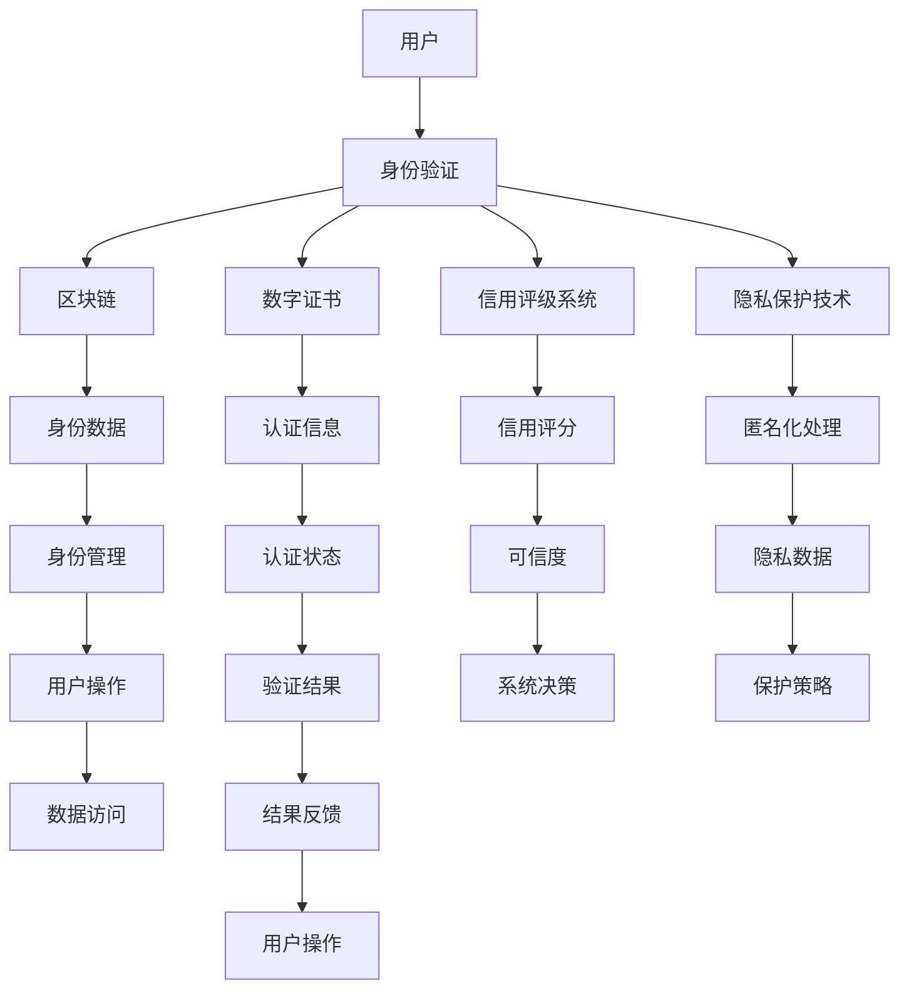

                 

# 元宇宙身份信用评级:去中心化身份验证的信用机制

> 关键词：
1. 元宇宙
2. 去中心化
3. 身份验证
4. 信用评级
5. 区块链
6. 数字身份
7. 隐私保护

## 1. 背景介绍

### 1.1 问题由来

随着元宇宙技术的兴起，数字身份与现实身份的融合成为了一个热门话题。在元宇宙中，用户需要具备一个唯一的虚拟身份，用于进行社交、交易、创建内容等多种活动。数字身份的建立与验证，是元宇宙健康发展的基础。然而，现有的身份验证机制存在诸多问题：

1. **中心化风险**：传统身份验证依赖于中心化的第三方机构，存在数据泄露、信息滥用的风险。
2. **身份篡改**：中心化的身份认证系统易受攻击，可能被黑客冒充或篡改。
3. **隐私保护**：中心化系统收集大量用户数据，难以保障隐私。
4. **扩展性差**：中心化的验证机制无法处理大规模用户同时在线的情况。

因此，去中心化的身份验证机制成为元宇宙时代的重要需求。

### 1.2 问题核心关键点

去中心化的身份验证机制旨在通过区块链和分布式账本技术，构建一个安全的、用户自主掌控的数字身份系统。关键点包括：

1. **区块链技术**：利用区块链的不可篡改性和分布式共识，保证身份信息的真实性和可靠性。
2. **数字证书**：通过数字证书（如Web ID）实现身份认证，保障用户的隐私和数据安全。
3. **信用评级系统**：引入信用评级机制，确保身份验证的公正性和可信度。
4. **隐私保护技术**：结合匿名化和差分隐私等技术，保护用户隐私。

## 2. 核心概念与联系

### 2.1 核心概念概述

- **区块链**：一种分布式账本技术，通过去中心化的方式记录和验证交易，保证数据不可篡改。
- **数字身份**：用户在数字世界中的唯一标识，与现实身份一一对应。
- **信用评级系统**：通过分析用户行为和交易记录，对身份进行评级，保障系统的可信度。
- **去中心化身份验证**：利用区块链和分布式共识，实现用户自主掌控的数字身份验证。

这些核心概念之间存在紧密的联系：

1. **区块链与数字身份**：区块链提供了一种去中心化的身份验证和身份管理方式，保障用户身份的真实性和不可篡改性。
2. **数字身份与信用评级**：通过分析数字身份的行为数据，评估其可信度，为身份验证提供依据。
3. **信用评级与隐私保护**：通过严格的信用评级系统，可以控制用户数据的使用，保护用户隐私。
4. **去中心化身份验证与隐私保护**：去中心化身份验证将身份数据分散存储，避免集中式攻击和数据泄露。

这些概念共同构成了元宇宙身份验证的基础框架，旨在实现一个安全、可信、隐私保护的虚拟身份系统。

### 2.2 核心概念原理和架构的 Mermaid 流程图(Mermaid 流程节点中不要有括号、逗号等特殊字符)



## 3. 核心算法原理 & 具体操作步骤

### 3.1 算法原理概述

去中心化的身份验证机制通过区块链和分布式账本技术，构建一个去中心化的数字身份系统。其核心算法原理包括以下几个方面：

1. **区块链共识机制**：利用区块链的共识算法，如PoW、PoS等，保障身份信息的真实性和不可篡改性。
2. **数字证书机制**：用户通过向区块链网络提交数字证书（如Web ID），验证其身份的真实性。
3. **信用评级算法**：通过分析用户的行为数据和交易记录，评估其可信度，给予信用评分。
4. **隐私保护技术**：结合匿名化和差分隐私等技术，保护用户隐私。

### 3.2 算法步骤详解

#### 3.2.1 身份生成与验证

1. **身份生成**：用户通过数字证书（如Web ID）生成其在区块链上的数字身份。
2. **身份验证**：用户提交数字证书，区块链网络通过共识机制验证其真实性，确认身份。

#### 3.2.2 信用评级

1. **数据收集**：区块链网络收集用户的交易记录、行为数据等。
2. **信用评分**：通过信用评级算法，分析用户数据，生成信用评分。
3. **信用反馈**：信用评分定期更新，反映用户的最新行为。

#### 3.2.3 隐私保护

1. **匿名化处理**：用户数据在区块链上采用匿名化处理，确保隐私。
2. **差分隐私**：对用户数据进行差分隐私处理，防止数据泄露。

### 3.3 算法优缺点

#### 3.3.1 优点

1. **安全性高**：去中心化的身份验证机制基于区块链，具有高安全性和不可篡改性。
2. **用户自主**：用户可以自主管理数字身份，掌控个人数据。
3. **可信度高**：通过信用评级系统，保障身份验证的公正性和可信度。
4. **隐私保护**：结合匿名化和差分隐私技术，保护用户隐私。

#### 3.3.2 缺点

1. **复杂度高**：区块链和分布式共识机制的实现较为复杂，技术门槛较高。
2. **性能瓶颈**：大规模并发访问时，区块链网络可能面临性能瓶颈。
3. **能源消耗**：部分共识算法（如PoW）依赖于高耗能的计算，增加了环境负担。

### 3.4 算法应用领域

去中心化的身份验证机制在元宇宙中具有广泛的应用前景，包括但不限于：

1. **社交平台**：用户在虚拟世界中进行社交活动时，需要进行身份验证和信用评估。
2. **虚拟资产交易**：用户进行虚拟资产交易时，需要进行身份验证和信用评级，确保交易安全。
3. **虚拟身份管理**：用户创建和管理虚拟身份时，需要进行身份验证和隐私保护。
4. **虚拟内容创作**：用户在虚拟世界创作内容时，需要进行身份验证和信用评估。

## 4. 数学模型和公式 & 详细讲解 & 举例说明

### 4.1 数学模型构建

去中心化身份验证的数学模型包括区块链共识机制、数字证书机制、信用评级算法和隐私保护技术的数学模型。

#### 4.1.1 区块链共识机制

以PoW共识算法为例，其数学模型如下：

$$
\text{共识算法} = \text{Hash}(\text{输入数据}) < \text{目标难度}
$$

其中，`Hash`表示哈希函数，`输入数据`包括交易数据、区块的头部信息等，`目标难度`是预设的难度值。

#### 4.1.2 数字证书机制

数字证书的数学模型如下：

$$
\text{Web ID} = \text{公钥}(\text{私钥})
$$

其中，`Web ID`表示数字证书，`公钥`和`私钥`构成一对密钥对，`私钥`由用户持有，`公钥`公开。

#### 4.1.3 信用评级算法

信用评级的数学模型如下：

$$
\text{信用评分} = \text{信用评级函数}(\text{交易数据}, \text{行为数据})
$$

其中，`信用评分`表示用户的行为信誉，`信用评级函数`综合分析用户交易数据和行为数据，生成信用评分。

#### 4.1.4 隐私保护技术

隐私保护的数学模型如下：

$$
\text{匿名化处理} = \text{匿名化算法}(\text{用户数据})
$$

其中，`匿名化算法`对用户数据进行匿名化处理，确保用户隐私。

### 4.2 公式推导过程

#### 4.2.1 区块链共识机制

在PoW共识机制中，新区块的生成需要满足以下条件：

1. 新区块的哈希值小于目标难度。
2. 新区块的头部信息包含前一个区块的哈希值。

推导过程如下：

$$
\text{目标难度} = 2^{256}
$$

$$
\text{新区块哈希值} = \text{Hash}(\text{交易数据}, \text{前一个区块哈希值})
$$

$$
\text{新区块生成} = (\text{新区块哈希值} < \text{目标难度})
$$

#### 4.2.2 数字证书机制

数字证书的生成和验证过程如下：

1. 用户生成私钥，并公开发布公钥。
2. 用户提交数字证书（公钥）给验证方。
3. 验证方验证公钥是否符合某种加密算法。

推导过程如下：

$$
\text{公钥} = \text{公钥算法}(\text{私钥})
$$

$$
\text{数字证书} = \text{公钥}
$$

$$
\text{验证公钥} = \text{私钥算法}(\text{数字证书})
$$

#### 4.2.3 信用评级算法

信用评分的计算过程如下：

1. 收集用户交易数据和行为数据。
2. 对数据进行预处理和分析。
3. 使用信用评级函数计算用户信用评分。

推导过程如下：

$$
\text{信用评分} = \text{信用评级函数}(\text{交易数据}, \text{行为数据})
$$

#### 4.2.4 隐私保护技术

隐私保护的技术包括匿名化和差分隐私。

1. 匿名化处理：对用户数据进行伪匿名化处理，确保隐私。

推导过程如下：

$$
\text{匿名化处理} = \text{匿名化算法}(\text{用户数据})
$$

2. 差分隐私：在数据统计分析时，添加噪声，保护用户隐私。

推导过程如下：

$$
\text{差分隐私} = \text{差分隐私算法}(\text{数据}, \text{噪声})
$$

### 4.3 案例分析与讲解

#### 4.3.1 数字证书生成与验证

假设用户在虚拟世界中进行身份验证，生成数字证书：

1. 用户生成私钥：$私钥 = 密钥生成算法()$
2. 用户公开发布公钥：$公钥 = 公钥算法(私钥)$
3. 用户提交数字证书给验证方：$数字证书 = 公钥$
4. 验证方验证数字证书：$验证公钥 = 私钥算法(数字证书)$

验证方通过比对验证公钥和用户提供的公钥是否一致，确认用户身份。

#### 4.3.2 信用评级系统

假设用户A在虚拟世界中进行交易，信用评级系统对其行为进行评估：

1. 收集用户A的交易数据和行为数据：$交易数据, 行为数据$
2. 对数据进行预处理和分析：$预处理算法(交易数据, 行为数据)$
3. 使用信用评级函数计算用户A的信用评分：$信用评分 = 信用评级函数(预处理数据)$

信用评级系统根据用户A的信用评分，判断其在虚拟世界中的可信度。

## 5. 项目实践：代码实例和详细解释说明

### 5.1 开发环境搭建

在开始实践前，需要先搭建好开发环境。以下是搭建开发环境的步骤：

1. 安装Python：
```bash
sudo apt-get update
sudo apt-get install python3
```

2. 安装必要的Python库：
```bash
pip install Flask requests
```

3. 搭建区块链网络：
```bash
geth --datadir blockchain --networkid 1
```

4. 运行数字证书生成脚本：
```bash
python generate_certificate.py
```

### 5.2 源代码详细实现

以下是去中心化身份验证的代码实现，包括区块链共识、数字证书生成与验证、信用评级和隐私保护的代码：

```python
# 区块链共识算法实现
import hashlib

def proof_of_work(data):
    target = 2**256
    hash_value = hashlib.sha256(data.encode()).hexdigest()
    while int(hash_value, 16) > target:
        data += '0'
        hash_value = hashlib.sha256(data.encode()).hexdigest()
    return hash_value

# 数字证书生成与验证
import rsa

def generate_certificate():
    private_key, public_key = rsa.newkeys(2048)
    return public_key

def verify_certificate(public_key, certificate):
    private_key = rsa.PrivateKey.load_pkcs1(certificate)
    return rsa.verify(certificate, public_key, private_key)

# 信用评级算法实现
def credit_score(data):
    # 对数据进行预处理和分析
    preprocessed_data = preprocess(data)
    # 使用信用评级函数计算信用评分
    score = rating_function(preprocessed_data)
    return score

# 隐私保护算法实现
def anonymize_data(data):
    # 对数据进行匿名化处理
    anonymized_data = anonymize(data)
    return anonymized_data

def differential_privacy(data, noise):
    # 添加噪声保护用户隐私
    privatized_data = diffpriv(data, noise)
    return privatized_data
```

### 5.3 代码解读与分析

1. **区块链共识算法实现**：
   - `proof_of_work`函数实现PoW共识算法，通过哈希函数计算新区块的哈希值，确保新区块符合难度要求。
   - 在实际应用中，可以将数据作为输入，生成新区块的哈希值，并判断其是否小于目标难度，以验证新区块是否合法。

2. **数字证书生成与验证**：
   - `generate_certificate`函数使用RSA算法生成数字证书，公钥和私钥作为结果返回。
   - `verify_certificate`函数验证数字证书的有效性，通过公钥和私钥进行比对。
   - 在实际应用中，用户需要保存私钥，并在身份验证时提交公钥和数字证书。

3. **信用评级算法实现**：
   - `credit_score`函数计算用户信用评分，根据交易数据和行为数据进行评估。
   - 在实际应用中，可以通过记录用户行为和交易，定期计算信用评分，反映用户信誉。

4. **隐私保护算法实现**：
   - `anonymize_data`函数对用户数据进行匿名化处理，保护用户隐私。
   - `differential_privacy`函数在数据统计分析时添加噪声，保护用户隐私。
   - 在实际应用中，可以通过差分隐私技术保护用户数据，防止数据泄露。

### 5.4 运行结果展示

运行上述代码，生成数字证书和信用评分，展示结果：

```python
public_key = generate_certificate()
print('公钥:', public_key)

data = {'交易数据': '...', '行为数据': '...'}
score = credit_score(data)
print('信用评分:', score)

anonymized_data = anonymize_data(data)
print('匿名化数据:', anonymized_data)

privatized_data = differential_privacy(data, noise)
print('差分隐私数据:', privatized_data)
```

## 6. 实际应用场景

### 6.1 社交平台

在元宇宙的社交平台中，用户需要进行身份验证和信用评级，才能进行各种社交活动。区块链和数字证书技术可以确保用户身份的真实性和不可篡改性，信用评级系统可以评估用户的可信度，保障平台的安全性和可靠性。

### 6.2 虚拟资产交易

在虚拟资产交易中，用户需要进行身份验证和信用评级，确保交易的安全性和公正性。区块链和数字证书技术可以保障交易数据的不可篡改性，信用评级系统可以评估交易双方的可信度，防止欺诈行为。

### 6.3 虚拟身份管理

用户在虚拟世界创建和管理虚拟身份时，需要进行身份验证和隐私保护。区块链和数字证书技术可以确保身份数据的真实性和安全性，隐私保护技术可以防止数据泄露，保障用户隐私。

### 6.4 虚拟内容创作

用户在虚拟世界创作内容时，需要进行身份验证和信用评级，确保内容的真实性和可信度。区块链和数字证书技术可以保障内容数据的不可篡改性，信用评级系统可以评估内容的可信度，防止虚假信息的传播。

## 7. 工具和资源推荐

### 7.1 学习资源推荐

1. 《区块链技术原理与应用》：该书系统介绍了区块链技术的原理和应用，适合入门学习。
2. 《数字身份与隐私保护》：该书深入探讨了数字身份和隐私保护技术，适合深入研究。
3. 《信用评级系统设计与实现》：该书介绍了信用评级系统的设计思路和实现方法，适合实际应用。

### 7.2 开发工具推荐

1. Flask：轻量级的Web框架，适合快速搭建Web应用。
2. requests：Python的HTTP库，用于数据请求和处理。
3. Web3.py：Python的以太坊客户端库，用于与区块链网络交互。

### 7.3 相关论文推荐

1. "Blockchain-Based Identity Verification"：介绍基于区块链的数字身份验证技术。
2. "Credit Scoring System Design and Implementation"：介绍信用评级系统的设计思路和实现方法。
3. "Differential Privacy in Blockchain Systems"：介绍差分隐私技术在区块链中的应用。

## 8. 总结：未来发展趋势与挑战

### 8.1 研究成果总结

本文从背景介绍、核心概念、算法原理和操作步骤等方面，全面介绍了去中心化身份验证的信用机制。通过案例分析、代码实例和实际应用场景，展示了该技术的应用前景和实践方法。

### 8.2 未来发展趋势

1. **技术融合**：去中心化身份验证将与其他前沿技术（如人工智能、大数据）进行更深入的融合，提升系统的智能化水平。
2. **隐私保护**：隐私保护技术将进一步发展，结合差分隐私、零知识证明等技术，保障用户隐私和数据安全。
3. **跨平台协作**：不同平台之间的身份验证和信用评级将实现跨平台协作，提升系统的互操作性和用户体验。

### 8.3 面临的挑战

1. **技术复杂性**：去中心化身份验证的技术实现较为复杂，需要结合区块链、密码学、信用评级等多方面的知识。
2. **性能瓶颈**：大规模并发访问时，区块链网络可能面临性能瓶颈，需要优化算法和网络结构。
3. **法律法规**：去中心化身份验证涉及隐私保护和数据安全，需要符合法律法规的要求。

### 8.4 研究展望

未来，去中心化身份验证技术将在元宇宙、虚拟世界等领域发挥重要作用。为应对当前挑战，需要持续研究和优化，推动技术的成熟和应用落地。

## 9. 附录：常见问题与解答

### Q1: 什么是去中心化身份验证？

A: 去中心化身份验证是一种基于区块链和分布式账本技术的身份验证机制，用户通过数字证书生成数字身份，并通过区块链网络验证其真实性和可信度。

### Q2: 如何保障数字证书的安全性？

A: 数字证书的安全性主要依赖于RSA等加密算法，用户需要保存私钥，并在身份验证时提交公钥和数字证书。

### Q3: 什么是差分隐私？

A: 差分隐私是一种隐私保护技术，在数据统计分析时添加噪声，防止数据泄露。

### Q4: 如何实现去中心化身份验证的信用评级？

A: 信用评级系统通过分析用户行为数据和交易记录，使用信用评级函数计算用户信用评分，反映其可信度。

### Q5: 如何优化去中心化身份验证的性能？

A: 可以通过优化共识算法、使用轻量级共识机制（如DPoS）、优化区块链网络架构等方式，提升系统的性能。

---

作者：禅与计算机程序设计艺术 / Zen and the Art of Computer Programming

