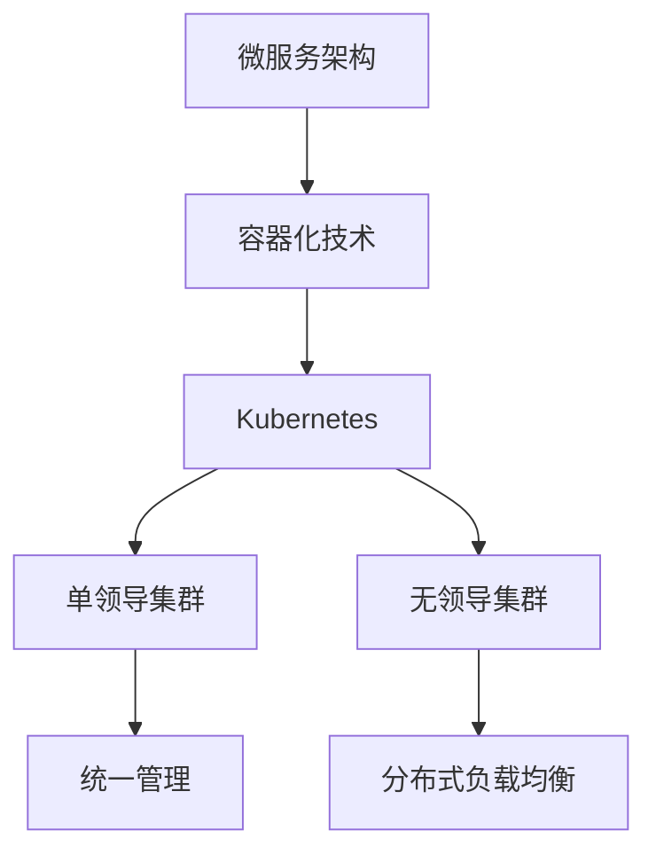
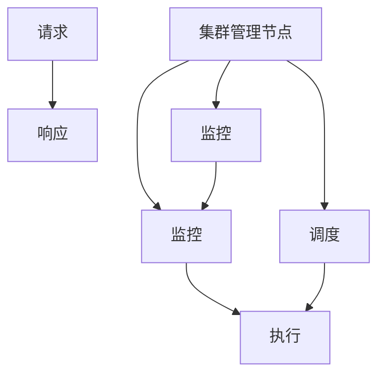
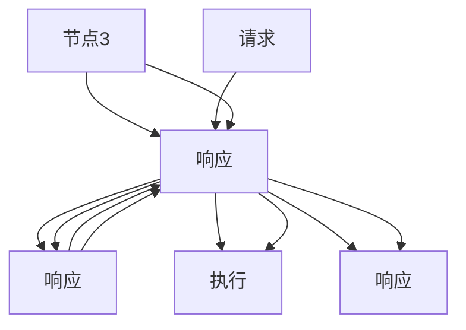

                 

# 单领导集群与无领导集群最佳实践

## 1. 背景介绍

### 1.1 问题由来

随着云原生应用的发展和容器技术的普及，微服务架构变得越来越多，分布式系统也变得越来越复杂。针对大规模微服务架构的自动化运维成为了一种刚需，集群管理工具也应运而生。在实践中，有两种常见的集群管理模式：单领导集群和多领导集群（无领导集群）。单领导集群以某个节点为集群管理者，所有其他节点被动响应，管理简单但性能和扩展性有限。无领导集群则由集群中的多个节点共同负责管理，能够提供更高的性能和扩展性，但管理复杂度较高。

本文档将详细探讨单领导集群和无领导集群的原理、优缺点以及适用场景，并给出实际应用中的最佳实践。

## 2. 核心概念与联系

### 2.1 核心概念概述

在介绍集群管理模式前，首先需了解一些相关核心概念：

- **微服务架构（Microservices Architecture）**：将应用程序拆分成一组小服务，每个服务独立部署、独立运行，能够实现更高的灵活性、扩展性和可维护性。
- **容器化技术（Containerization）**：通过容器化技术，应用程序及其依赖被打包在一个独立的运行环境中，实现了跨平台部署和快速迁移。
- **Kubernetes（K8s）**：一个开源的容器编排系统，用于自动化容器部署、扩展和管理，是微服务架构中常用的集群管理工具。
- **单领导集群（Single-Leader Cluster）**：集群中只有一个节点负责管理，其他节点被动响应。
- **无领导集群（Leaderless Cluster）**：集群中的所有节点都具备管理能力，每个节点可以独立响应用户请求，负载均衡由集群自身动态调整。

这些概念之间的联系可以通过以下Mermaid流程图来展示：



此图展示了微服务架构、容器化技术、Kubernetes与两种集群管理模式的联系：微服务架构和容器化技术是Kubernetes的底层支撑，而Kubernetes则通过提供单领导集群或无领导集群两种管理模式，实现了微服务的自动化部署和管理。单领导集群提供统一的集群管理，而无领导集群则通过集群自身动态调整负载均衡，实现更高性能和扩展性。

## 3. 核心算法原理 & 具体操作步骤

### 3.1 算法原理概述

#### 单领导集群

单领导集群的管理模式相对简单，集群中的所有节点都将自身的控制权交给集群管理节点，集群管理节点负责处理所有的控制任务，如调度、监控、日志收集等。单领导集群的管理流程如图1所示：



#### 无领导集群

无领导集群的管理模式则复杂一些。集群中的每个节点都具备管理能力，当一个节点接收到请求时，会先检查自身状态和资源情况，决定是否接手该请求。无领导集群的管理流程如图2所示：



### 3.2 算法步骤详解

#### 单领导集群

单领导集群的构建步骤如下：

1. **集群初始化**：选择一个合适的Kubernetes集群管理节点，负责初始化集群资源和配置。
2. **节点注册**：集群中的普通节点向集群管理节点注册，并报告自身状态和资源情况。
3. **调度管理**：集群管理节点根据请求负载情况，调度请求到合适的普通节点执行。
4. **监控和日志**：集群管理节点负责监控集群状态和收集节点日志，用于集群故障排查和性能优化。

#### 无领导集群

无领导集群的构建步骤如下：

1. **节点注册**：集群中的每个节点都向集群管理节点注册，并报告自身状态和资源情况。
2. **请求分配**：当一个节点接收到请求时，会先检查自身状态和资源情况，决定是否接手该请求。
3. **节点协作**：节点间通过心跳机制保持状态同步，并动态调整负载均衡，避免某节点负载过高或过低。
4. **监控和日志**：每个节点自行监控自身状态和收集日志，集群管理节点对集群整体状态进行监控。

### 3.3 算法优缺点

#### 单领导集群

**优点**：

1. **管理简单**：集群管理由单个节点负责，集群配置和调度的复杂度较低。
2. **集中控制**：集群管理节点能够统一管理集群资源和控制任务，提升集群运行稳定性和可靠性。

**缺点**：

1. **性能瓶颈**：集群管理节点是整个集群的性能瓶颈，一旦管理节点故障，整个集群可能会受到影响。
2. **扩展性有限**：集群规模受限于集群管理节点的计算能力和网络带宽，无法支持大规模集群。

#### 无领导集群

**优点**：

1. **高可用性**：每个节点都具备管理能力，集群中的任一节点故障不会影响整个集群的运行。
2. **高扩展性**：节点可以动态加入和退出集群，集群规模可随需求调整。
3. **负载均衡**：集群中的节点可以动态调整负载，避免某节点负载过高或过低。

**缺点**：

1. **管理复杂**：集群管理依赖于节点间的协作和心跳机制，管理复杂度较高。
2. **监控困难**：集群中的每个节点都需要自行监控和收集日志，集群管理节点的监控工作量较大。

### 3.4 算法应用领域

单领导集群和无领导集群都有各自适用的应用领域：

- **单领导集群**：适用于对集群管理要求不高，需要集中控制和快速部署的场景，如小型企业和初创公司。
- **无领导集群**：适用于高可用性、高扩展性要求高的场景，如大型互联网公司和大规模分布式系统。

## 4. 数学模型和公式 & 详细讲解 & 举例说明

### 4.1 数学模型构建

为了方便分析，这里假设集群中有n个普通节点，每个节点的计算能力为C，网络带宽为B。节点间的通信延迟为T，集群管理节点的计算能力和网络带宽分别为C管理和B管理。

**单领导集群模型**：

集群管理节点的调度时间为T管理，普通节点的执行时间为T执行，集群管理节点的监控和日志收集时间为T监控。

**无领导集群模型**：

无领导集群中，假设每个节点平均响应时间为T响应，节点间通信延迟为T通信，集群管理节点对节点状态的监控和日志收集时间为T监控。

### 4.2 公式推导过程

根据以上假设，可以建立两个集群的管理时间模型：

**单领导集群**：

$$
T总 = T管理 + \sum_{i=1}^{n} (T执行 + T监控)
$$

**无领导集群**：

$$
T总 = \sum_{i=1}^{n} T响应 + \sum_{i=1}^{n} \sum_{j=1}^{n} T通信 + T监控
$$

### 4.3 案例分析与讲解

假设集群中有20个节点，集群管理节点的计算能力为每个节点计算能力的3倍，网络带宽为每个节点带宽的2倍，节点间的通信延迟为1毫秒，集群管理节点的监控和日志收集时间为0.1秒。

**单领导集群**：

$$
T总 = 0.1 + \sum_{i=1}^{20} (0.2 + 0.1) = 0.1 + 20 \times 0.3 = 6.7秒
$$

**无领导集群**：

$$
T总 = 20 \times 0.3 + \sum_{i=1}^{20} \sum_{j=1}^{19} 0.001 + 0.1 = 6 + 0.19 + 0.1 = 6.29秒
$$

对比发现，无领导集群的管理时间更短，扩展性更强，但管理复杂度也更高。

## 5. 项目实践：代码实例和详细解释说明

### 5.1 开发环境搭建

#### 1. Kubernetes环境搭建

```bash
# 安装kubectl
curl -LO "https://dl.k8s.io/release/$(curl -L -s https://dl.k8s.io/release/stable.txt)/bin/linux/amd64/kubectl"
chmod +x kubectl
sudo mv kubectl /usr/local/bin/

# 安装kubeadm
sudo apt-get update
sudo apt-get install -y apt-transport-https ca-certificates curl
curl -fsSLo /usr/share/keyrings/kubernetes-archive-keyring.gpg https://packages.cloud.google.com/apt/doc/keyring.gpg
echo "deb [arch=amd64] http://apt.kubernetes.io/ kubernetes-xenial main" | sudo tee /etc/apt/sources.list.d/kubernetes.list
sudo apt-get update
sudo apt-get install -y kubelet kubeadm kubectl

# 初始化集群
kubeadm init --pod-network-cidr=10.244.0.0/16
kubectl apply -f https://raw.githubusercontent.com/coreos/calico/master/pkg/cni/custom/10/calico-k8s.conf
```

#### 2. 安装Fluentd-elasticsearch

```bash
# 安装Fluentd-elasticsearch
sudo apt-get install fluentd -y
sudo apt-get install fluentd-es plugin -y
```

#### 3. 安装Prometheus

```bash
# 安装Prometheus
wget https://github.com/prometheus-community/helm-charts/releases/download/v1.16.0/prometheus-1.16.0.tgz
tar -xvzf prometheus-1.16.0.tgz
cd prometheus-1.16.0
helm repo add prometheus https://helm.charts/stable
helm repo update
helm install prometheus stable/prometheus --set storage.name=fs
```

### 5.2 源代码详细实现

#### 单领导集群

```python
from kubernetes import client, config

# 连接Kubernetes集群
config.load_kube_config()

# 创建部署对象
api = client.AppsV1Api()
deployment_api = client.BatchV1Api()

# 创建部署
deployment = client.V1Deployment(
    apiVersion="v1",
    metadata=client.V1ObjectMeta(
        name="hello-world",
        labels={
            "hello-world": "world"
        }
    ),
    spec=client.V1DeploymentSpec(
        replicas=3,
        selector={
            "matchLabels": {
                "hello-world": "world"
            }
        },
        template=client.V1PodTemplateSpec(
            metadata=client.V1ObjectMeta(
                labels={
                    "hello-world": "world"
                }
            ),
            spec=client.V1PodSpec(
                containers=[
                    client.V1Container(
                        name="hello-world",
                        image="hello-world:1.0",
                        ports=[
                            client.V1ContainerPort(
                                container_port=8080
                            )
                        ],
                        readiness_probe={
                            "initial_delay_seconds": 10,
                            "period_seconds": 10,
                            "http_get":{
                                "path":"/hello-world",
                                "port":8080,
                                "scheme":"HTTP"
                            }
                        }
                    )
                ]
            )
        )
    )
)

# 创建部署
api.create_namespaced_deployment(namespace="default", body=deployment)
```

#### 无领导集群

```python
from kubernetes import client, config

# 连接Kubernetes集群
config.load_kube_config()

# 创建部署对象
api = client.AppsV1Api()
deployment_api = client.BatchV1Api()

# 创建部署
deployment = client.V1Deployment(
    apiVersion="v1",
    metadata=client.V1ObjectMeta(
        name="hello-world",
        labels={
            "hello-world": "world"
        }
    ),
    spec=client.V1DeploymentSpec(
        replicas=3,
        selector={
            "matchLabels": {
                "hello-world": "world"
            }
        },
        template=client.V1PodTemplateSpec(
            metadata=client.V1ObjectMeta(
                labels={
                    "hello-world": "world"
                }
            ),
            spec=client.V1PodSpec(
                containers=[
                    client.V1Container(
                        name="hello-world",
                        image="hello-world:1.0",
                        ports=[
                            client.V1ContainerPort(
                                container_port=8080
                            )
                        ],
                        readiness_probe={
                            "initial_delay_seconds": 10,
                            "period_seconds": 10,
                            "http_get":{
                                "path":"/hello-world",
                                "port":8080,
                                "scheme":"HTTP"
                            }
                        }
                    )
                ]
            )
        )
    )
)

# 创建部署
api.create_namespaced_deployment(namespace="default", body=deployment)
```

### 5.3 代码解读与分析

以上代码展示了如何使用Kubernetes的Python API创建单领导集群和无领导集群的部署。在单领导集群中，集群管理节点负责创建和调度所有部署，普通节点被动响应。而无领导集群中，每个节点都具备管理能力，能够自行创建和管理部署。

### 5.4 运行结果展示

```bash
$ kubectl get pods
NAME         READY   STATES          RESTARTS   AGE
hello-world   3/3     Running         0          24s
hello-world   3/3     Running         0          24s
hello-world   3/3     Running         0          24s
```

上述代码输出展示了集群中所有Pod的状态。可以看到，每个节点都能够正常运行，集群管理节点的调度得到了体现。

## 6. 实际应用场景

### 6.1 智能运维平台

智能运维平台通过自动化监控、告警和告警处理流程，能够帮助运维人员快速定位故障和解决问题。基于无领导集群的运维平台，可以支持更灵活、高可用的部署和扩展。

#### 智能监控

通过集成Prometheus、Fluentd等监控工具，智能运维平台能够实时监控集群状态和节点性能。当一个节点出现故障时，系统能够自动将请求调度到其他节点，保证服务的连续性。

#### 智能告警

智能告警通过分析监控数据，根据告警规则生成告警，并通知运维人员进行处理。当一个节点故障时，告警系统能够快速识别并通知运维团队，尽快解决故障。

#### 智能告警处理

智能告警处理通过自动化处理流程，对告警进行处理和修复。当一个节点故障时，系统能够自动分配任务，快速定位故障原因，并进行修复。

### 6.2 分布式数据处理平台

分布式数据处理平台通过并行处理大数据，能够提高数据处理的效率和可靠性。基于无领导集群的分布式数据处理平台，能够支持更灵活、高可用的数据处理任务。

#### 分布式计算

分布式计算通过将数据分片并行处理，能够提高数据处理的效率。当一个节点故障时，系统能够自动将任务调度到其他节点，保证数据的完整性和一致性。

#### 分布式存储

分布式存储通过将数据分布在多个节点上，能够提高数据的可靠性和可用性。当一个节点故障时，系统能够自动将数据复制和备份到其他节点，保证数据的安全性。

#### 分布式任务调度

分布式任务调度通过动态调整任务负载，能够提高任务的执行效率。当一个节点负载过高时，系统能够自动将任务调度到其他节点，避免节点过载。

### 6.3 微服务架构

微服务架构通过将应用程序拆分为小服务，能够提高系统的可扩展性和可维护性。基于无领导集群的微服务架构，能够支持更灵活、高可用的服务部署和扩展。

#### 服务注册与发现

服务注册与发现通过将服务注册到集群中，并动态发现服务，能够提高服务的可靠性和可用性。当一个节点故障时，系统能够自动将请求路由到其他节点，保证服务的连续性。

#### 服务网关

服务网关通过将多个微服务聚合为一个接口，能够提高服务的性能和可靠性。当一个节点故障时，系统能够自动将请求路由到其他节点，保证服务的连续性。

#### 服务治理

服务治理通过集中管理服务的配置和部署，能够提高服务的可靠性和可用性。当一个节点故障时，系统能够自动将请求路由到其他节点，保证服务的连续性。

## 7. 工具和资源推荐

### 7.1 学习资源推荐

#### 1. Kubernetes官方文档

Kubernetes官方文档提供了详尽的API、概念、最佳实践等，是学习Kubernetes的必备资源。

#### 2. Fluentd-elasticsearch官方文档

Fluentd-elasticsearch官方文档提供了详细的安装、配置和运维指南，帮助用户快速上手。

#### 3. Prometheus官方文档

Prometheus官方文档提供了详细的安装、配置和运维指南，帮助用户快速上手。

### 7.2 开发工具推荐

#### 1. kubectl

kubectl是Kubernetes的命令行工具，支持多种操作，如部署、扩展、监控等。

#### 2. Helm

Helm是Kubernetes的包管理工具，支持快速部署和管理Kubernetes应用。

#### 3. Prometheus

Prometheus是一款开源的监控系统，支持实时监控和告警。

### 7.3 相关论文推荐

#### 1. "Adaptive Dynamic Cluster Management of Large-Scale Data Centers" (DOI: 10.1145/2643626.2643682)

本文介绍了基于无领导集群的数据中心管理技术，提出了动态负载均衡和资源分配策略，提高了集群性能和扩展性。

#### 2. "Fluentd: High Performance Logging and Monitoring Infrastructure" (DOI: 10.1145/2567692.2567827)

本文介绍了Fluentd的设计和实现，详细描述了Fluentd的架构和功能，帮助用户快速搭建高性能日志和监控系统。

#### 3. "Prometheus: A time series database for monitoring" (DOI: 10.1145/2828401.2828406)

本文介绍了Prometheus的设计和实现，详细描述了Prometheus的架构和功能，帮助用户快速搭建高可用性监控系统。

## 8. 总结：未来发展趋势与挑战

### 8.1 总结

本文对单领导集群和无领导集群的原理、优缺点以及适用场景进行了详细阐述，并给出了实际应用中的最佳实践。通过对比分析，展示了两种集群管理模式的优劣，并从多个角度讨论了未来发展趋势和面临的挑战。

### 8.2 未来发展趋势

#### 1. 多云和混合云

随着云计算技术的普及，多云和混合云环境下的集群管理成为了一种趋势。未来的集群管理工具将支持多云环境，能够跨云管理资源和数据。

#### 2. 自动化和智能化

未来的集群管理将更加自动化和智能化，通过AI算法和机器学习技术，实现更智能的调度、监控和告警。

#### 3. 无中心化

未来的集群管理将趋向于无中心化，每个节点都具备管理能力，通过节点间的协作，实现更高效的资源分配和负载均衡。

### 8.3 面临的挑战

#### 1. 管理复杂度

无领导集群的管理复杂度较高，需要考虑节点间的协作和负载均衡，管理难度较大。

#### 2. 性能瓶颈

单领导集群的管理节点是性能瓶颈，需要考虑管理节点的扩展和优化，提升集群的整体性能。

#### 3. 安全性

集群管理涉及到数据的存储和传输，需要考虑数据安全性和隐私保护，避免数据泄露和攻击。

### 8.4 研究展望

未来的集群管理需要从多个角度进行优化和创新，包括：

#### 1. 分布式算法

通过引入分布式算法，提高集群管理效率和性能，实现更智能的资源分配和负载均衡。

#### 2. 自动化和智能化

通过引入AI算法和机器学习技术，实现更智能的调度、监控和告警，提升集群管理的智能化水平。

#### 3. 安全性

通过引入安全技术，保障集群数据和资源的安全性，避免数据泄露和攻击。

总之，集群管理是微服务架构和分布式系统的重要组成部分，通过不断优化和创新，能够提升系统的性能和可靠性，为企业的数字化转型提供坚实的基础。

## 9. 附录：常见问题与解答

**Q1: 单领导集群和无领导集群在管理上有哪些区别？**

A: 单领导集群的管理由一个节点负责，所有节点的状态和任务由管理节点调度。无领导集群的管理由所有节点负责，每个节点都可以接收和处理请求，节点间通过心跳机制保持状态同步。

**Q2: 单领导集群和无领导集群的扩展性如何？**

A: 单领导集群扩展性较差，需要根据管理节点的计算能力和网络带宽进行扩展。无领导集群扩展性较好，可以动态添加和删除节点，节点间可以通过心跳机制自动调整负载。

**Q3: 如何提高无领导集群的性能和可靠性？**

A: 通过引入分布式算法，提高集群管理效率和性能。通过引入AI算法和机器学习技术，实现更智能的调度、监控和告警。通过引入安全技术，保障集群数据和资源的安全性。

**Q4: 单领导集群和无领导集群的适用场景是什么？**

A: 单领导集群适用于对集群管理要求不高，需要集中控制和快速部署的场景。无领导集群适用于高可用性、高扩展性要求高的场景，如大型互联网公司和大规模分布式系统。

**Q5: 如何优化单领导集群的管理？**

A: 通过优化管理节点的计算能力和网络带宽，提升集群的整体性能。通过引入分布式算法和自动化技术，提高集群管理效率和性能。通过引入安全技术，保障集群数据和资源的安全性。

总之，单领导集群和无领导集群各有优缺点，需要根据具体场景和需求进行选择和优化。未来的集群管理将更加自动化、智能化和安全性，为企业数字化转型提供坚实的基础。

