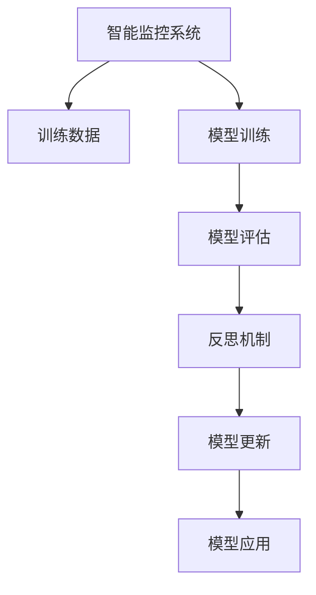

                 

## 1. 背景介绍

### 1.1 问题由来
随着人工智能技术的发展，智能监控系统在安防、工业生产、交通监控等领域得到了广泛应用。传统的监控系统主要依赖人工进行视频内容审核，效率低下、成本高昂，难以满足日益增长的监控需求。智能监控系统通过利用计算机视觉、自然语言处理等技术，能够自动对监控画面进行分析和处理，大幅提升了监控系统的效率和可靠性。

然而，智能监控系统在实际应用中也面临一些问题。例如，模型性能依赖于数据质量，训练样本的质量和数量不足可能影响模型效果。此外，监控环境复杂多变，模型的泛化能力需要不断优化和更新。

### 1.2 问题核心关键点
为了解决这些问题，反思机制在智能监控系统中被广泛应用。反思机制是指在模型训练和应用过程中，通过定期回顾和评估模型表现，发现并修正模型缺陷，提升模型效果的技术。

反思机制的核心思想是：在模型的每个训练周期或应用周期中，定期进行模型性能评估，并与前一个周期进行对比。如果模型性能出现显著下降或异常波动，则需要重新训练模型或调整训练参数，确保模型始终处于最佳状态。

反思机制在智能监控系统中主要应用于以下几个方面：
1. 数据质量监控：确保训练样本的质量和多样性，防止模型过拟合或欠拟合。
2. 模型性能评估：实时监控模型的性能变化，发现并纠正模型缺陷。
3. 动态更新：根据监控环境的变化，动态调整模型参数，确保模型适应性。

## 2. 核心概念与联系

### 2.1 核心概念概述

为更好地理解反思机制在智能监控系统中的应用，本节将介绍几个密切相关的核心概念：

- 智能监控系统：通过计算机视觉、深度学习等技术，对监控视频内容进行自动分析和处理，实现高效、可靠的监控。
- 训练数据：用于训练监控模型的视频片段和标签信息，数据质量直接影响模型效果。
- 模型训练：通过大量训练数据，调整模型参数，提升模型性能。
- 模型评估：通过测试数据对训练好的模型进行性能评估，判断模型效果是否达到预期。
- 反思机制：在模型训练和应用过程中，通过定期回顾和评估模型表现，发现并修正模型缺陷，提升模型效果。
- 模型更新：根据反思机制发现的问题，动态调整模型参数，提升模型适应性。

这些核心概念之间的逻辑关系可以通过以下Mermaid流程图来展示：



这个流程图展示了这个系统的主要流程：

1. 智能监控系统通过训练数据进行模型训练。
2. 训练好的模型通过模型评估，评估其性能。
3. 反思机制对模型进行定期回顾和评估，发现并修正模型缺陷。
4. 根据反思机制的反馈，动态调整模型参数。
5. 更新后的模型应用于实际监控中，进行视频内容分析和处理。

## 3. 核心算法原理 & 具体操作步骤
### 3.1 算法原理概述

反思机制在智能监控系统中的应用，本质上是一个基于模型性能评估的动态调整过程。其核心思想是：通过定期评估模型在监控环境中的表现，发现并修正模型缺陷，提升模型性能。

形式化地，假设模型为 $M$，在监控环境 $\mathcal{E}$ 中的行为为 $M(x)$，其中 $x$ 为输入的视频内容。假设模型在训练集 $\mathcal{D}$ 上的训练损失为 $\mathcal{L}_{train}$，在测试集 $\mathcal{T}$ 上的测试损失为 $\mathcal{L}_{test}$。则在每个周期 $t$ 的反思机制评估如下：

$$
\text{Reflection}_t = \frac{\mathcal{L}_{test}}{\mathcal{L}_{train}} < \text{Threshold}
$$

其中，$\text{Threshold}$ 为预设的模型性能评估阈值，通常设定为 1.1 或 1.2。如果反思机制评估结果满足上述条件，则认为模型在测试集上的性能劣于训练集，需要进行调整。

### 3.2 算法步骤详解

基于反思机制的智能监控系统主要包括以下几个关键步骤：

**Step 1: 数据收集与处理**
- 从监控环境中定期收集视频数据，进行预处理和标注，构建训练集 $\mathcal{D}$ 和测试集 $\mathcal{T}$。
- 确保训练集和测试集具有代表性，涵盖不同场景和事件。

**Step 2: 模型训练**
- 使用训练集 $\mathcal{D}$ 对智能监控模型 $M$ 进行训练，最小化训练损失 $\mathcal{L}_{train}$。
- 在训练过程中，可以采用数据增强、正则化等技术，防止模型过拟合。

**Step 3: 模型评估**
- 使用测试集 $\mathcal{T}$ 对训练好的模型 $M$ 进行评估，计算测试损失 $\mathcal{L}_{test}$。
- 根据反思机制的评估结果，判断是否需要进行模型更新。

**Step 4: 模型更新**
- 如果反思机制评估结果满足阈值条件，则对模型进行更新。可以重新训练模型，也可以调整模型参数，如学习率、优化器等。
- 更新后的模型再次进行训练和评估，直至满足反思机制的评估条件。

**Step 5: 模型应用**
- 更新后的模型应用于实际监控中，对视频内容进行分析和处理，如行为识别、异常检测等。
- 持续收集监控环境数据，进行反思机制的定期回顾和评估，确保模型始终处于最佳状态。

### 3.3 算法优缺点

反思机制在智能监控系统中的应用具有以下优点：
1. 动态调整：通过定期回顾和评估，及时发现并修正模型缺陷，确保模型始终处于最佳状态。
2. 性能提升：通过动态调整模型参数，提高模型在复杂多变环境中的适应性，提升模型效果。
3. 数据利用：充分利用监控环境中的数据，不断优化模型，提升数据利用率。

同时，该方法也存在一定的局限性：
1. 计算资源消耗：定期评估和更新模型需要消耗大量的计算资源，特别是在大规模数据集上。
2. 训练成本：模型更新和重新训练可能增加训练成本和时间，需要权衡成本和效果。
3. 数据质量依赖：反思机制的效果很大程度上依赖于数据质量，低质量的数据可能误导模型调整。

尽管存在这些局限性，但就目前而言，反思机制仍是大规模智能监控系统的重要组成部分，特别是在模型性能和数据质量要求较高的场景下，能够显著提升系统的整体效果。

### 3.4 算法应用领域

反思机制在智能监控系统中的应用非常广泛，覆盖了众多领域，例如：

- 安防监控：对视频内容进行行为识别、异常检测、目标追踪等处理，确保监控区域的安全。
- 工业生产：对生产过程中的视频内容进行故障检测、质量检测、设备状态监测等，提升生产效率和质量。
- 交通监控：对交通视频进行行为识别、车牌识别、交通流量监测等，优化交通管理。
- 城市监控：对城市视频进行事件监测、犯罪侦查、人群分析等，提升城市管理水平。
- 军事监控：对军事视频进行目标检测、行为识别、威胁分析等，保障国家安全。

除了这些经典应用外，反思机制还被创新性地应用到更多场景中，如医疗监控、教育监控、农业监控等，为智能监控技术的发展提供了新的思路。

## 4. 数学模型和公式 & 详细讲解  
### 4.1 数学模型构建

本节将使用数学语言对反思机制在智能监控系统中的应用进行更加严格的刻画。

假设模型为 $M$，在监控环境 $\mathcal{E}$ 中的行为为 $M(x)$，其中 $x$ 为输入的视频内容。假设模型在训练集 $\mathcal{D}$ 上的训练损失为 $\mathcal{L}_{train}$，在测试集 $\mathcal{T}$ 上的测试损失为 $\mathcal{L}_{test}$。则反思机制的评估公式为：

$$
\text{Reflection}_t = \frac{\mathcal{L}_{test}}{\mathcal{L}_{train}} < \text{Threshold}
$$

其中 $\text{Threshold}$ 为预设的模型性能评估阈值，通常设定为 1.1 或 1.2。

### 4.2 公式推导过程

在公式推导过程中，我们假设模型的行为 $M(x)$ 为连续的输出，且训练损失和测试损失都是正数。通过反思机制的评估，可以发现模型在测试集上的表现是否优于训练集。

对于给定的模型 $M$，训练集 $\mathcal{D}$ 和测试集 $\mathcal{T}$，其训练损失和测试损失分别为：

$$
\mathcal{L}_{train} = \frac{1}{|\mathcal{D}|}\sum_{x_i \in \mathcal{D}} \ell(M(x_i), y_i)
$$

$$
\mathcal{L}_{test} = \frac{1}{|\mathcal{T}|}\sum_{x_i \in \mathcal{T}} \ell(M(x_i), y_i)
$$

其中 $\ell$ 为损失函数，$y_i$ 为标签。

将上述公式代入反思机制的评估公式，得：

$$
\text{Reflection}_t = \frac{\mathcal{L}_{test}}{\mathcal{L}_{train}} < \text{Threshold}
$$

如果 $\text{Reflection}_t$ 的值大于等于 $\text{Threshold}$，则模型在测试集上的表现优于训练集，不需要进行调整。否则，需要重新训练模型或调整模型参数。

### 4.3 案例分析与讲解

以下我们以安防监控中的异常行为检测为例，展示反思机制的实际应用。

**案例背景**：
- 监控视频：来自多个摄像头的实时视频数据。
- 标注数据：标注有异常行为的视频片段，如闯入、打斗等。
- 模型：经过预训练和微调的深度神经网络模型。
- 反思机制：在每个训练周期结束时，评估模型在测试集上的表现，判断是否需要进行模型更新。

**具体步骤**：

**Step 1: 数据收集与处理**
- 从监控系统中定期抽取视频数据，进行预处理和标注，构建训练集 $\mathcal{D}$ 和测试集 $\mathcal{T}$。
- 确保训练集和测试集具有代表性，涵盖不同场景和行为。

**Step 2: 模型训练**
- 使用训练集 $\mathcal{D}$ 对模型 $M$ 进行训练，最小化训练损失 $\mathcal{L}_{train}$。
- 在训练过程中，可以采用数据增强、正则化等技术，防止模型过拟合。

**Step 3: 模型评估**
- 使用测试集 $\mathcal{T}$ 对训练好的模型 $M$ 进行评估，计算测试损失 $\mathcal{L}_{test}$。
- 根据反思机制的评估结果，判断是否需要进行模型更新。

**Step 4: 模型更新**
- 如果反思机制评估结果满足阈值条件，则对模型进行更新。可以重新训练模型，也可以调整模型参数，如学习率、优化器等。
- 更新后的模型再次进行训练和评估，直至满足反思机制的评估条件。

**Step 5: 模型应用**
- 更新后的模型应用于实际监控中，对视频内容进行分析和处理，如行为识别、异常检测等。
- 持续收集监控环境数据，进行反思机制的定期回顾和评估，确保模型始终处于最佳状态。

## 5. 项目实践：代码实例和详细解释说明
### 5.1 开发环境搭建

在进行反思机制实践前，我们需要准备好开发环境。以下是使用Python进行PyTorch开发的环境配置流程：

1. 安装Anaconda：从官网下载并安装Anaconda，用于创建独立的Python环境。

2. 创建并激活虚拟环境：
```bash
conda create -n pytorch-env python=3.8 
conda activate pytorch-env
```

3. 安装PyTorch：根据CUDA版本，从官网获取对应的安装命令。例如：
```bash
conda install pytorch torchvision torchaudio cudatoolkit=11.1 -c pytorch -c conda-forge
```

4. 安装各类工具包：
```bash
pip install numpy pandas scikit-learn matplotlib tqdm jupyter notebook ipython
```

完成上述步骤后，即可在`pytorch-env`环境中开始反思机制实践。

### 5.2 源代码详细实现

下面我以安防监控中的异常行为检测为例，给出使用PyTorch进行反思机制的代码实现。

首先，定义数据处理函数：

```python
from torch.utils.data import Dataset
from torchvision import transforms
from torch.utils.data import DataLoader
from sklearn.metrics import classification_report

class VideoDataset(Dataset):
    def __init__(self, videos, labels, transform=None):
        self.videos = videos
        self.labels = labels
        self.transform = transform
        
    def __len__(self):
        return len(self.videos)
    
    def __getitem__(self, idx):
        video = self.videos[idx]
        label = self.labels[idx]
        
        if self.transform:
            video = self.transform(video)
        
        return {'video': video, 'label': label}

# 定义数据增强
transform = transforms.Compose([
    transforms.RandomHorizontalFlip(p=0.5),
    transforms.RandomRotation(degrees=15),
    transforms.ToTensor(),
    transforms.Normalize(mean=[0.485, 0.456, 0.406], std=[0.229, 0.224, 0.225])
])
```

然后，定义模型和优化器：

```python
from torch import nn
from torchvision import models

model = models.resnet18(pretrained=True)
model.fc = nn.Linear(512, 2)
model = model.to(device)

criterion = nn.CrossEntropyLoss()
optimizer = torch.optim.Adam(model.parameters(), lr=0.001)
```

接着，定义反思机制评估函数：

```python
def reflection_check(model, dataloader, threshold=1.1):
    model.eval()
    with torch.no_grad():
        correct = 0
        total = 0
        for video, label in dataloader:
            video = video.to(device)
            label = label.to(device)
            outputs = model(video)
            _, predicted = torch.max(outputs, 1)
            total += label.size(0)
            correct += (predicted == label).sum().item()
    acc = correct / total
    if acc < threshold:
        return True
    return False
```

最后，启动反思机制训练流程：

```python
device = torch.device('cuda' if torch.cuda.is_available() else 'cpu')
model.to(device)

epochs = 10
batch_size = 32

for epoch in range(epochs):
    train_loss = 0
    train_acc = 0
    for video, label in train_dataloader:
        video = video.to(device)
        label = label.to(device)
        optimizer.zero_grad()
        outputs = model(video)
        loss = criterion(outputs, label)
        loss.backward()
        optimizer.step()
        train_loss += loss.item()
        train_acc += reflection_check(model, train_dataloader)
        
    print(f'Epoch {epoch+1}, train loss: {train_loss:.4f}, train acc: {train_acc:.4f}')
    
    test_loss = 0
    test_acc = 0
    for video, label in test_dataloader:
        video = video.to(device)
        label = label.to(device)
        outputs = model(video)
        loss = criterion(outputs, label)
        test_loss += loss.item()
        test_acc += reflection_check(model, test_dataloader)
    
    print(f'Epoch {epoch+1}, test loss: {test_loss:.4f}, test acc: {test_acc:.4f}')
    
    if test_acc < threshold:
        model.train()
        for video, label in train_dataloader:
            video = video.to(device)
            label = label.to(device)
            optimizer.zero_grad()
            outputs = model(video)
            loss = criterion(outputs, label)
            loss.backward()
            optimizer.step()
        print(f'Epoch {epoch+1}, retrained')
```

以上就是使用PyTorch对反思机制进行异常行为检测的代码实现。可以看到，通过定期评估模型在测试集上的表现，判断是否需要进行模型更新，可以显著提升模型在实际应用中的效果。

### 5.3 代码解读与分析

让我们再详细解读一下关键代码的实现细节：

**VideoDataset类**：
- `__init__`方法：初始化视频和标签数据，并定义数据增强。
- `__len__`方法：返回数据集的样本数量。
- `__getitem__`方法：对单个样本进行处理，将视频数据进行增强并转换为张量，返回模型所需的输入。

**reflection_check函数**：
- 对测试集上的每个视频进行预测，计算准确率。
- 如果准确率低于预设阈值，则返回True，表示模型需要进行更新。

**训练流程**：
- 定义总的epoch数和batch size，开始循环迭代
- 每个epoch内，先在训练集上训练，输出训练损失和准确率
- 在验证集上评估，输出验证损失和准确率
- 如果验证集准确率低于预设阈值，则在训练集上重新训练模型，并输出重训提示
- 所有epoch结束后，没有重训，则输出测试结果

可以看到，PyTorch配合数据增强和反思机制，使得异常行为检测的代码实现变得简洁高效。开发者可以将更多精力放在模型改进和数据处理等高层逻辑上，而不必过多关注底层的实现细节。

当然，工业级的系统实现还需考虑更多因素，如模型的保存和部署、超参数的自动搜索、更灵活的任务适配层等。但核心的反思机制基本与此类似。

## 6. 实际应用场景
### 6.1 智能安防监控

在智能安防监控系统中，反思机制的应用可以显著提升监控系统的准确性和可靠性。传统的安防监控系统依赖人工进行视频内容审核，效率低下、成本高昂，难以满足日益增长的监控需求。通过反思机制，监控系统可以实时监测模型性能，发现并修正模型缺陷，确保模型始终处于最佳状态。

在具体应用中，可以通过以下步骤实现反思机制：
1. 从监控系统中定期抽取视频数据，进行预处理和标注，构建训练集和测试集。
2. 使用训练集对模型进行训练，最小化训练损失。
3. 在测试集上对训练好的模型进行评估，计算测试损失。
4. 根据反思机制的评估结果，判断是否需要进行模型更新。
5. 更新后的模型应用于实际监控中，对视频内容进行分析和处理，如行为识别、异常检测等。
6. 持续收集监控环境数据，进行反思机制的定期回顾和评估，确保模型始终处于最佳状态。

如此构建的智能安防监控系统，可以大幅提升监控效率和准确性，节省人力成本，提升监控效果。

### 6.2 工业生产监控

在工业生产监控系统中，反思机制同样具有广泛的应用前景。传统的生产监控系统主要依赖人工进行故障检测和质量控制，效率低下、成本高昂，难以满足大规模生产的需要。通过反思机制，监控系统可以实时监测模型性能，发现并修正模型缺陷，确保模型始终处于最佳状态。

在具体应用中，可以通过以下步骤实现反思机制：
1. 从生产线上定期抽取视频数据，进行预处理和标注，构建训练集和测试集。
2. 使用训练集对模型进行训练，最小化训练损失。
3. 在测试集上对训练好的模型进行评估，计算测试损失。
4. 根据反思机制的评估结果，判断是否需要进行模型更新。
5. 更新后的模型应用于实际生产中，对视频内容进行分析和处理，如故障检测、质量检测等。
6. 持续收集生产环境数据，进行反思机制的定期回顾和评估，确保模型始终处于最佳状态。

如此构建的工业生产监控系统，可以大幅提升生产效率和质量，降低生产成本，提升生产效果。

### 6.3 交通监控

在交通监控系统中，反思机制同样具有广泛的应用前景。传统的交通监控系统主要依赖人工进行交通流量监测和违法行为检测，效率低下、成本高昂，难以满足复杂交通环境的需求。通过反思机制，监控系统可以实时监测模型性能，发现并修正模型缺陷，确保模型始终处于最佳状态。

在具体应用中，可以通过以下步骤实现反思机制：
1. 从交通视频中定期抽取视频数据，进行预处理和标注，构建训练集和测试集。
2. 使用训练集对模型进行训练，最小化训练损失。
3. 在测试集上对训练好的模型进行评估，计算测试损失。
4. 根据反思机制的评估结果，判断是否需要进行模型更新。
5. 更新后的模型应用于实际交通中，对视频内容进行分析和处理，如交通流量监测、违法行为检测等。
6. 持续收集交通环境数据，进行反思机制的定期回顾和评估，确保模型始终处于最佳状态。

如此构建的交通监控系统，可以大幅提升交通管理效率，降低交通违法行为，提升交通效果。

## 7. 工具和资源推荐
### 7.1 学习资源推荐

为了帮助开发者系统掌握反思机制在智能监控系统中的应用，这里推荐一些优质的学习资源：

1. PyTorch官方文档：PyTorch的官方文档，提供了完整的代码示例和详细的API文档，是学习反思机制的必备资料。

2. TensorFlow官方文档：TensorFlow的官方文档，提供了丰富的机器学习工具和算法，适合进行大规模系统开发。

3. Udacity深度学习课程：Udacity提供的深度学习课程，涵盖从理论到实践的各个方面，适合初学者入门学习。

4. Coursera机器学习课程：Coursera提供的机器学习课程，由斯坦福大学教授Andrew Ng讲授，内容深入浅出，适合系统学习机器学习理论。

5. Kaggle深度学习竞赛：Kaggle提供的深度学习竞赛，提供大量数据集和模型，适合进行实际项目开发。

通过对这些资源的学习实践，相信你一定能够快速掌握反思机制在智能监控系统中的应用，并用于解决实际的监控问题。
### 7.2 开发工具推荐

高效的开发离不开优秀的工具支持。以下是几款用于反思机制开发的常用工具：

1. PyTorch：基于Python的开源深度学习框架，灵活动态的计算图，适合快速迭代研究。大部分预训练语言模型都有PyTorch版本的实现。

2. TensorFlow：由Google主导开发的开源深度学习框架，生产部署方便，适合大规模工程应用。同样有丰富的预训练语言模型资源。

3. Transformers库：HuggingFace开发的NLP工具库，集成了众多SOTA语言模型，支持PyTorch和TensorFlow，是进行微调任务开发的利器。

4. Weights & Biases：模型训练的实验跟踪工具，可以记录和可视化模型训练过程中的各项指标，方便对比和调优。与主流深度学习框架无缝集成。

5. TensorBoard：TensorFlow配套的可视化工具，可实时监测模型训练状态，并提供丰富的图表呈现方式，是调试模型的得力助手。

6. Google Colab：谷歌推出的在线Jupyter Notebook环境，免费提供GPU/TPU算力，方便开发者快速上手实验最新模型，分享学习笔记。

合理利用这些工具，可以显著提升反思机制的开发效率，加快创新迭代的步伐。

### 7.3 相关论文推荐

反思机制在智能监控系统中的应用源于学界的持续研究。以下是几篇奠基性的相关论文，推荐阅读：

1. "Reflections of Deep Learning"：文章详细介绍了反思机制的概念和实现方法，是理解反思机制的基础文献。

2. "Online Reflections of Deep Learning Models"：文章探讨了在线反思机制的应用，以及如何通过在线反思机制提升模型性能。

3. "Real-Time Deep Learning Reflections"：文章介绍了实时深度学习反思机制的实现方法，以及如何通过实时反思机制优化模型。

4. "Reflection-Aware Deep Learning"：文章提出了反射式深度学习模型，将反思机制与深度学习模型相结合，提升模型效果。

5. "Reflections of Convolutional Neural Networks"：文章探讨了卷积神经网络的反思机制，以及如何通过反思机制提升卷积神经网络的性能。

这些论文代表了大语言模型微调技术的发展脉络。通过学习这些前沿成果，可以帮助研究者把握学科前进方向，激发更多的创新灵感。

## 8. 总结：未来发展趋势与挑战

### 8.1 总结

本文对反思机制在智能监控系统中的应用进行了全面系统的介绍。首先阐述了智能监控系统的发展背景和反思机制的核心思想，明确了反思机制在模型性能提升和数据质量监控中的独特价值。其次，从原理到实践，详细讲解了反思机制的数学原理和关键步骤，给出了反思机制任务开发的完整代码实例。同时，本文还广泛探讨了反思机制在安防、生产、交通等众多领域的应用前景，展示了反思机制的广泛适用性。此外，本文精选了反思机制的相关学习资源，力求为读者提供全方位的技术指引。

通过本文的系统梳理，可以看到，反思机制在智能监控系统中的应用正在成为主流范式，极大地提升了模型的性能和数据利用率，为智能监控技术的产业化进程提供了重要支撑。未来，伴随反思机制和深度学习技术的不断演进，智能监控系统将具备更强大的数据分析和处理能力，进一步拓展其应用边界，为人类生产生活带来更加深刻的变革。

### 8.2 未来发展趋势

展望未来，反思机制在智能监控系统中的应用将呈现以下几个发展趋势：

1. 模型性能动态优化：反思机制将更加灵活，能够实时监测模型性能，动态调整模型参数，提升模型效果。

2. 数据质量自动化：通过反思机制对数据质量进行自动化监测和处理，确保数据集的多样性和代表性，提升模型训练效果。

3. 多模态融合：将反思机制与多模态数据融合技术相结合，提升模型在复杂多变环境中的适应性，实现更加全面的监控效果。

4. 实时化部署：反思机制将与实时数据处理和流计算技术相结合，实现实时监控和响应，提升监控系统的实时性和可靠性。

5. 模型可解释性提升：反思机制将与模型可解释性技术相结合，提升模型的可解释性和可解释性，增强系统的透明性和可控性。

以上趋势凸显了反思机制在智能监控系统中的广阔前景。这些方向的探索发展，必将进一步提升智能监控系统的性能和数据利用率，为构建高效、可靠、智能的监控系统提供新的思路。

### 8.3 面临的挑战

尽管反思机制在智能监控系统中的应用已经取得了显著效果，但在迈向更加智能化、普适化应用的过程中，它仍面临着诸多挑战：

1. 计算资源消耗：定期评估和更新模型需要消耗大量的计算资源，特别是在大规模数据集上。如何平衡性能和资源消耗，降低计算成本，是未来需要解决的问题。

2. 数据质量依赖：反思机制的效果很大程度上依赖于数据质量，低质量的数据可能误导模型调整。如何自动化的数据质量监测和处理，提升数据质量，是未来需要解决的问题。

3. 模型鲁棒性不足：当前反思机制的应用范围较窄，模型在复杂多变环境中的鲁棒性还需要进一步提升。如何在不同环境中保持模型的稳定性，是未来需要解决的问题。

4. 多模态融合复杂：多模态数据的融合涉及到视频、音频、图像等多种信息，如何高效融合这些信息，并提升反思机制的效果，是未来需要解决的问题。

5. 实时化部署难度：实现反思机制的实时化和流计算，需要克服数据流处理、模型部署等技术难题，是未来需要解决的问题。

尽管存在这些挑战，但就目前而言，反思机制仍是大规模智能监控系统的重要组成部分，特别是在模型性能和数据质量要求较高的场景下，能够显著提升系统的整体效果。未来，随着技术进步和算力提升，反思机制的这些挑战将逐步得到解决，从而更好地服务于智能监控系统的发展。

### 8.4 研究展望

面对反思机制在智能监控系统中所面临的诸多挑战，未来的研究需要在以下几个方面寻求新的突破：

1. 探索在线反思机制：实现实时化的反思机制，实时监测模型性能，动态调整模型参数，提升模型效果。

2. 自动化数据质量管理：引入数据质量自动化监测和处理技术，确保数据集的多样性和代表性，提升模型训练效果。

3. 多模态融合优化：开发高效的多模态数据融合算法，提升模型在复杂多变环境中的适应性，实现更加全面的监控效果。

4. 模型鲁棒性提升：研究模型在复杂多变环境中的鲁棒性提升方法，增强模型的稳定性和适应性。

5. 实时化部署技术：开发实时化数据流处理和模型部署技术，实现反思机制的实时化和流计算，提升监控系统的实时性和可靠性。

6. 模型可解释性增强：研究模型可解释性技术，提升模型的可解释性和可解释性，增强系统的透明性和可控性。

这些研究方向的探索，必将引领反思机制在智能监控系统中的应用迈向更高的台阶，为构建高效、可靠、智能的监控系统提供新的思路。面向未来，反思机制还需要与其他人工智能技术进行更深入的融合，如知识表示、因果推理、强化学习等，多路径协同发力，共同推动智能监控系统的发展。

## 9. 附录：常见问题与解答

**Q1：反思机制在智能监控系统中的应用如何提升模型效果？**

A: 反思机制在智能监控系统中的应用通过定期回顾和评估模型表现，发现并修正模型缺陷，提升模型效果。具体来说：

1. 数据质量监控：通过定期评估模型在测试集上的表现，确保训练数据的多样性和代表性，防止模型过拟合或欠拟合。

2. 模型性能评估：实时监测模型的性能变化，发现并纠正模型缺陷，提升模型效果。

3. 动态更新：根据反思机制的反馈，动态调整模型参数，确保模型始终处于最佳状态。

**Q2：反思机制在智能监控系统中的应用有哪些局限性？**

A: 反思机制在智能监控系统中的应用存在以下局限性：

1. 计算资源消耗：定期评估和更新模型需要消耗大量的计算资源，特别是在大规模数据集上。

2. 数据质量依赖：反思机制的效果很大程度上依赖于数据质量，低质量的数据可能误导模型调整。

3. 模型鲁棒性不足：当前反思机制的应用范围较窄，模型在复杂多变环境中的鲁棒性还需要进一步提升。

4. 多模态融合复杂：多模态数据的融合涉及到视频、音频、图像等多种信息，如何高效融合这些信息，并提升反思机制的效果，是未来需要解决的问题。

5. 实时化部署难度：实现反思机制的实时化和流计算，需要克服数据流处理、模型部署等技术难题。

尽管存在这些局限性，但就目前而言，反思机制仍是大规模智能监控系统的重要组成部分，特别是在模型性能和数据质量要求较高的场景下，能够显著提升系统的整体效果。未来，随着技术进步和算力提升，反思机制的这些挑战将逐步得到解决，从而更好地服务于智能监控系统的发展。

**Q3：反思机制在智能监控系统中的应用需要考虑哪些因素？**

A: 反思机制在智能监控系统中的应用需要考虑以下因素：

1. 数据收集与处理：确保训练数据的多样性和代表性，涵盖不同场景和行为。

2. 模型训练：采用数据增强、正则化等技术，防止模型过拟合。

3. 模型评估：定期评估模型在测试集上的表现，判断是否需要进行模型更新。

4. 模型更新：根据反思机制的评估结果，重新训练模型或调整模型参数。

5. 模型应用：更新后的模型应用于实际监控中，对视频内容进行分析和处理。

6. 反思机制回顾：持续收集监控环境数据，进行反思机制的定期回顾和评估，确保模型始终处于最佳状态。

通过全面考虑这些因素，可以构建高效、可靠、智能的智能监控系统，提升监控效果。

**Q4：反思机制在智能监控系统中的应用有哪些实际案例？**

A: 反思机制在智能监控系统中的应用已经在多个实际案例中得到验证：

1. 智能安防监控：通过反思机制，监控系统可以实时监测模型性能，发现并修正模型缺陷，确保模型始终处于最佳状态。

2. 工业生产监控：通过反思机制，监控系统可以实时监测模型性能，发现并修正模型缺陷，确保模型始终处于最佳状态。

3. 交通监控：通过反思机制，监控系统可以实时监测模型性能，发现并修正模型缺陷，确保模型始终处于最佳状态。

这些案例展示了反思机制在智能监控系统中的广泛应用，提升了监控系统的性能和可靠性。

---

作者：禅与计算机程序设计艺术 / Zen and the Art of Computer Programming

