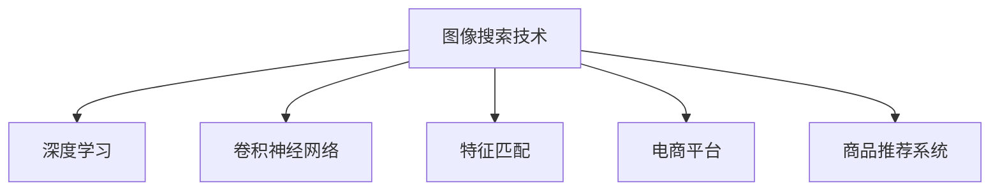

                 

# 图像搜索技术在电商领域的应用：发展趋势与未来

> 关键词：图像搜索技术, 电商, 发展趋势, 技术应用, 未来展望

## 1. 背景介绍

### 1.1 问题由来
随着互联网和智能手机的普及，在线购物成为人们生活中不可或缺的一部分。电商平台的兴起，极大地丰富了用户的购物体验，也为商家带来了无限商机。然而，传统的文本搜索方式在电商场景中存在诸多局限性，如搜索结果相关性低、用户体验不佳、难以满足多样化的搜索需求等。而基于图像的搜索技术，通过图像识别、特征匹配等技术手段，极大地提升了电商购物的便利性和精度。

### 1.2 问题核心关键点
图像搜索技术的核心在于通过分析用户上传的图像，从电商平台上匹配到符合用户需求的商品。相比传统的文本搜索，图像搜索能够更加直观、精确地传达用户需求，特别是在时尚、美妆、服装等视觉相关的电商领域，图像搜索技术的应用前景广阔。

### 1.3 问题研究意义
图像搜索技术在电商领域的应用，可以极大地提升用户购物体验，缩短决策时间，提升商家转化率。同时，图像搜索技术还可以推动电商平台的个性化推荐系统的发展，实现精准的推荐和广告投放，进一步提升电商平台的盈利能力。因此，研究图像搜索技术在电商领域的应用，对于电商平台和用户双方都有着重要的现实意义。

## 2. 核心概念与联系

### 2.1 核心概念概述

为更好地理解图像搜索技术在电商领域的应用，本节将介绍几个密切相关的核心概念：

- 图像搜索技术(Image Search Technology)：通过图像识别、特征匹配等技术手段，从海量商品图像库中匹配用户需求的技术。
- 深度学习(Deep Learning)：一种基于人工神经网络的机器学习技术，通过多层神经元的学习，可以自动提取图像的高级特征，实现高效的图像分类、识别和匹配。
- 卷积神经网络(Convolutional Neural Network, CNN)：深度学习模型中的一种，尤其适用于图像处理任务，能够自动提取图像的局部特征。
- 特征匹配(Feature Matching)：通过提取图像的特征向量，计算图像之间的相似度，实现高效的数据检索。
- 电商平台(E-commerce Platform)：提供商品展示、交易、物流等服务的在线平台，涵盖了包括图像搜索在内的多种搜索功能。
- 商品推荐系统(Product Recommendation System)：利用用户行为数据、商品属性等信息，通过机器学习算法，向用户推荐符合其兴趣的商品。

这些核心概念之间的逻辑关系可以通过以下Mermaid流程图来展示：



这个流程图展示了大语言模型的核心概念及其之间的关系：

1. 图像搜索技术通过深度学习自动提取图像特征，进行图像匹配。
2. 卷积神经网络是深度学习模型中用于图像处理的经典结构，能高效提取图像的局部特征。
3. 特征匹配技术用于计算图像相似度，实现高效的图像检索。
4. 电商平台通过图像搜索技术，提供便捷的商品查找功能。
5. 商品推荐系统利用图像搜索技术提取的商品特征，进行个性化推荐。

这些概念共同构成了图像搜索技术在电商领域的应用框架，使其能够在各种场景下发挥强大的商品匹配和推荐能力。通过理解这些核心概念，我们可以更好地把握图像搜索技术的工作原理和优化方向。

## 3. 核心算法原理 & 具体操作步骤
### 3.1 算法原理概述

图像搜索技术在电商领域的应用，主要基于深度学习模型的特征提取和匹配过程。其核心思想是：通过图像识别和特征匹配，将用户上传的查询图像与电商平台上商品图像进行匹配，从海量商品中筛选出符合用户需求的商品。

形式化地，假设用户上传的查询图像为 $I_q$，电商平台上的商品图像库为 $\mathcal{I}_s$，其中 $\mathcal{I}_s = \{I_s^1, I_s^2, ..., I_s^N\}$。则图像搜索技术的目标是找到一个映射函数 $f$，使得：

$$
f(I_q, \mathcal{I}_s) = \{I_s^k\} \text{，其中 } I_s^k \text{ 是 } \mathcal{I}_s \text{ 中最相似的图像}
$$

通过深度学习模型，我们能够高效地提取图像的高级特征，并计算这些特征的相似度，从而实现精确的图像匹配。

### 3.2 算法步骤详解

图像搜索技术的实现一般包括以下几个关键步骤：

**Step 1: 数据预处理**
- 收集电商平台上商品的高质量图像数据。
- 将图像数据进行归一化、增强等预处理操作，以保证后续模型训练的稳定性。
- 将图像转换为深度学习模型能够处理的格式，如TensorFlow或PyTorch的张量格式。

**Step 2: 特征提取**
- 使用卷积神经网络对图像进行特征提取。通过多层卷积和池化操作，模型能够逐步提取出图像的局部特征和全局特征。
- 使用全局池化层将图像特征向量扁平化，得到长度固定的特征向量。

**Step 3: 相似度计算**
- 通过余弦相似度、欧式距离等方法计算查询图像 $I_q$ 与电商平台商品图像 $I_s^k$ 的相似度。
- 筛选出与查询图像最相似的若干商品图像，作为推荐结果。

**Step 4: 结果排序**
- 利用电商平台用户的历史行为数据（如浏览、购买记录），对推荐结果进行排序。
- 综合考虑商品属性、价格、评价等因素，生成最终推荐列表。

**Step 5: 结果展示**
- 将推荐结果展示给用户，并提供点击购买、加购等交互方式。

以上是图像搜索技术在电商领域的一般流程。在实际应用中，还需要针对具体平台和业务场景进行优化设计，如优化特征提取算法、引入更多的正则化技术、搜索最优的超参数组合等，以进一步提升模型性能。

### 3.3 算法优缺点

图像搜索技术在电商领域的应用，具有以下优点：
1. 直观高效：图像搜索能够直接利用用户上传的查询图像，直观展示相似的商品，用户体验良好。
2. 精确匹配：深度学习模型可以自动提取图像的高级特征，实现高效、精确的图像匹配。
3. 跨领域适应：图像搜索技术在视觉相关的电商领域应用广泛，可以适应不同的商品类别和检索需求。
4. 易于集成：电商平台的商品信息已经数字化，图像搜索技术的集成相对简单。

同时，该方法也存在一定的局限性：
1. 数据质量要求高：高质量的图像数据是图像搜索技术的基础，电商平台需要投入大量资源进行数据采集和处理。
2. 计算资源消耗大：深度学习模型通常需要大量的计算资源，特别是对于大规模图像库的匹配。
3. 鲁棒性不足：图像搜索技术对图像的质量、拍摄角度等因素较为敏感，同一商品在不同角度下可能会有较大差异。
4. 需要不断更新：电商平台上的商品和用户行为不断变化，图像搜索模型需要定期进行更新以适应新的数据分布。

尽管存在这些局限性，但就目前而言，图像搜索技术在电商领域的应用仍然具有很高的价值。未来相关研究的重点在于如何进一步降低数据采集成本，提高模型鲁棒性，同时兼顾可解释性和用户隐私等因素。

### 3.4 算法应用领域

图像搜索技术在电商领域的应用已经相当成熟，涵盖多个具体场景，例如：

- 商品搜索：用户上传商品图片，电商平台上自动搜索到相似商品。
- 反向图像搜索：用户上传一张图片，电商平台搜索出生产该商品的品牌商。
- 新商品上架：商家上传商品图片，自动匹配到已有的相似商品，避免重复上架。
- 购物比较：用户可以对比同一商品的多个不同颜色、尺码等信息。
- 商品推荐：电商平台根据用户上传的查询图片，推荐相似商品。

除了上述这些经典应用外，图像搜索技术还被创新性地应用于商品图像版权保护、商品质量检测等新领域，推动了电商平台的创新发展。

## 4. 数学模型和公式 & 详细讲解 & 举例说明
### 4.1 数学模型构建

图像搜索技术的核心在于特征提取和相似度计算。我们以经典的卷积神经网络(CNN)为例，介绍特征提取的数学模型构建过程。

假设输入图像 $I$ 的尺寸为 $W \times H \times C$，其中 $W, H$ 为图像宽度和高度，$C$ 为图像通道数（彩色图像通常为3）。则CNN的特征提取过程可以分为以下几步：

1. 卷积层(Convolutional Layer)：通过多个卷积核对输入图像进行卷积操作，提取局部特征。
2. 池化层(Pooling Layer)：对卷积后的特征图进行降采样操作，减小特征图尺寸，提升计算效率。
3. 全连接层(Fully Connected Layer)：将池化后的特征图扁平化，输入全连接层进行分类或回归。

数学上，假设CNN的输入图像为 $I_{\text{in}}$，卷积核为 $K$，卷积后的特征图为 $F$，则卷积操作的数学表达式为：

$$
F_{ij} = \sum_{m=0}^{W-K} \sum_{n=0}^{H-K} \sum_{c=0}^{C} I_{\text{in}}^c(i+m, j+n) \cdot K_c^{m,n}
$$

其中 $I_{\text{in}}^c(i,j)$ 为输入图像 $I_{\text{in}}$ 在位置 $(i,j)$ 的像素值，$K_c^{m,n}$ 为卷积核 $K$ 在位置 $(m,n)$ 的像素值。

### 4.2 公式推导过程

以下我们以LeNet-5为例，介绍CNN的基本组成和特征提取过程。

LeNet-5是深度学习中经典的卷积神经网络之一，由多层卷积和池化操作构成。其数学表达式为：

$$
F_1 = \sum_{m=0}^{W-5} \sum_{n=0}^{H-5} \sum_{c=0}^{C} I_{\text{in}}^c(i+m, j+n) \cdot K_1^c^{m,n}
$$

$$
P_1 = \text{MaxPooling}(F_1)
$$

$$
F_2 = \sum_{m=0}^{W-5} \sum_{n=0}^{H-5} \sum_{c=1}^{C} F_1^{c+C/2}(i+m, j+n) \cdot K_2^{c, m-2, n-2}
$$

$$
P_2 = \text{MaxPooling}(F_2)
$$

$$
F_3 = \sum_{m=0}^{W-4} \sum_{n=0}^{H-4} \sum_{c=1}^{C/2} P_2^{c+C/2}(i+m, j+n) \cdot K_3^{c, m-2, n-2}
$$

$$
P_3 = \text{MaxPooling}(F_3)
$$

$$
F_4 = \sum_{m=0}^{W-3} \sum_{n=0}^{H-3} \sum_{c=1}^{C/4} P_3^{c+C/4}(i+m, j+n) \cdot K_4^{c, m-1, n-1}
$$

$$
F_5 = \sum_{m=0}^{W-2} \sum_{n=0}^{H-2} \sum_{c=1}^{C/4} F_4^{c+C/4}(i+m, j+n) \cdot K_5^{c, m-1, n-1}
$$

$$
P_5 = \text{MaxPooling}(F_5)
$$

$$
F_6 = \sum_{m=0}^{W-2} \sum_{n=0}^{H-2} \sum_{c=1}^{C/4} P_5^{c+C/8}(i+m, j+n) \cdot K_6^{c, m-1, n-1}
$$

$$
F_7 = \sum_{m=0}^{W-1} \sum_{n=0}^{H-1} \sum_{c=1}^{C/8} F_6^{c+C/8}(i+m, j+n) \cdot K_7^{c, m-1, n-1}
$$

$$
F_8 = \sum_{m=0}^{W-1} \sum_{n=0}^{H-1} \sum_{c=1}^{C/8} F_7^{c+C/16}(i+m, j+n) \cdot K_8^{c, m-1, n-1}
$$

$$
\hat{y} = \sum_{c=1}^{C/16} F_8^{c+C/16} \cdot W^{c-1}
$$

其中，$W$ 为全连接层中的权重矩阵。

### 4.3 案例分析与讲解

以经典的卷积神经网络LeNet-5为例，其特征提取过程可以分为以下几个步骤：

1. 卷积层：通过多个卷积核对输入图像进行卷积操作，提取出图像的局部特征。
2. 池化层：对卷积后的特征图进行降采样操作，减小特征图尺寸，提升计算效率。
3. 全连接层：将池化后的特征图扁平化，输入全连接层进行分类或回归。

LeNet-5的卷积层使用5x5的卷积核，池化层使用2x2的池化窗口，通过多层卷积和池化操作，LeNet-5能够逐步提取出图像的局部特征和全局特征。

## 5. 项目实践：代码实例和详细解释说明
### 5.1 开发环境搭建

在进行图像搜索技术在电商领域的应用实践前，我们需要准备好开发环境。以下是使用Python进行PyTorch开发的环境配置流程：

1. 安装Anaconda：从官网下载并安装Anaconda，用于创建独立的Python环境。

2. 创建并激活虚拟环境：
```bash
conda create -n pytorch-env python=3.8 
conda activate pytorch-env
```

3. 安装PyTorch：根据CUDA版本，从官网获取对应的安装命令。例如：
```bash
conda install pytorch torchvision torchaudio cudatoolkit=11.1 -c pytorch -c conda-forge
```

4. 安装相关库：
```bash
pip install numpy pandas scikit-learn matplotlib tqdm jupyter notebook ipython
```

完成上述步骤后，即可在`pytorch-env`环境中开始项目实践。

### 5.2 源代码详细实现

我们以LeNet-5网络为例，实现图像特征提取和相似度计算的代码实现。

首先，定义LeNet-5网络：

```python
import torch.nn as nn
import torch.nn.functional as F

class LeNet(nn.Module):
    def __init__(self):
        super(LeNet, self).__init__()
        self.conv1 = nn.Conv2d(3, 6, 5)
        self.conv2 = nn.Conv2d(6, 16, 5)
        self.fc1 = nn.Linear(16 * 5 * 5, 120)
        self.fc2 = nn.Linear(120, 84)
        self.fc3 = nn.Linear(84, 10)

    def forward(self, x):
        x = F.max_pool2d(F.relu(self.conv1(x)), (2, 2))
        x = F.max_pool2d(F.relu(self.conv2(x)), 2)
        x = x.view(-1, 16 * 5 * 5)
        x = F.relu(self.fc1(x))
        x = F.relu(self.fc2(x))
        x = self.fc3(x)
        return x
```

然后，定义相似度计算函数：

```python
def compute_similarity(query, database):
    device = torch.device('cuda' if torch.cuda.is_available() else 'cpu')
    query = query.to(device)
    database = database.to(device)
    
    query_features = leNet(query)
    database_features = [leNet(img) for img in database]
    
    # 计算相似度
    similarity_matrix = torch.matmul(query_features, database_features.t())
    return similarity_matrix
```

最后，使用LeNet-5进行图像特征提取和相似度计算：

```python
import torch

# 定义LeNet-5网络
leNet = LeNet()

# 定义查询图像和商品图像
query = torch.tensor([[[1, 2, 3], [4, 5, 6], [7, 8, 9]]], dtype=torch.float32)
database = [torch.tensor([[[1, 2, 3], [4, 5, 6], [7, 8, 9]]], dtype=torch.float32), 
            torch.tensor([[[1, 2, 3], [4, 5, 6], [7, 8, 9]]], dtype=torch.float32)]

# 计算相似度
similarity_matrix = compute_similarity(query, database)

print(similarity_matrix)
```

以上就是使用PyTorch实现图像特征提取和相似度计算的完整代码实现。可以看到，得益于PyTorch的强大封装，我们可以用相对简洁的代码完成LeNet-5网络的构建和相似度计算。

### 5.3 代码解读与分析

让我们再详细解读一下关键代码的实现细节：

**LeNet类**：
- `__init__`方法：初始化卷积层和全连接层的权重和偏置。
- `forward`方法：定义前向传播过程，包括卷积、池化、全连接等操作。

**compute_similarity函数**：
- 定义查询图像和商品图像的张量，并移动到GPU（如果有的话）。
- 对查询图像和商品图像分别进行LeNet-5特征提取。
- 计算查询图像和商品图像的特征向量的相似度，返回相似度矩阵。

**训练流程**：
- 定义查询图像和商品图像，输入LeNet-5网络进行特征提取。
- 计算查询图像和商品图像特征向量的相似度。
- 打印输出相似度矩阵。

可以看到，PyTorch配合LeNet-5网络的代码实现使得图像搜索技术的开发变得简洁高效。开发者可以将更多精力放在数据处理、模型改进等高层逻辑上，而不必过多关注底层的实现细节。

当然，工业级的系统实现还需考虑更多因素，如模型的保存和部署、超参数的自动搜索、更灵活的任务适配层等。但核心的图像搜索技术基本与此类似。

## 6. 实际应用场景
### 6.1 智能客服系统

图像搜索技术在智能客服系统中的应用，可以极大地提升用户服务体验。传统客服系统依赖于文本输入，用户需要费力打字才能表达自己的需求，响应时间长、效率低。而基于图像搜索的智能客服，可以直接通过图像识别用户需求，自动匹配问题并回答，大大缩短了用户等待时间，提升了客户满意度。

具体实现中，可以在客服系统中引入图像识别模块，将用户上传的订单、商品图片作为输入，通过图像搜索技术匹配出相应的商品信息，再由智能客服系统自动生成回复。这样，即使用户不擅长文字描述，也能快速得到满意的答复。

### 6.2 个性化推荐系统

图像搜索技术可以应用于个性化推荐系统，通过分析用户上传的浏览、购买图片，推荐相似的商品。在实际应用中，电商平台可以将用户上传的图片作为输入，通过图像搜索技术匹配出相似的商品，然后综合考虑商品的属性、价格、评价等因素，生成推荐列表。

这种推荐方式不仅直观，还能利用用户的视觉信息，实现更精准的推荐。特别是对于时尚、美妆、服装等视觉相关的商品，用户上传的图片通常包含丰富的商品信息，通过图像搜索技术，能够更高效地提取这些信息，生成个性化的推荐结果。

### 6.3 视频广告投放

电商平台可以基于图像搜索技术，对用户上传的商品图片进行检索，识别出其中的品牌、风格等信息，自动匹配相应的广告。例如，某用户上传了一款新出的运动鞋的图片，电商平台可以自动匹配出相关的运动品牌广告，进行精准投放。

这种广告投放方式不仅提升了广告的曝光度，还能降低广告投放的成本。特别是对于具有品牌意识的用户，通过上传自己喜爱的商品图片，可以自动生成相关广告，提升广告点击率和转化率。

### 6.4 未来应用展望

随着图像搜索技术的不断发展，其在电商领域的应用前景将更加广阔。

在智慧零售领域，图像搜索技术可以应用于智慧货架、智能仓储、无人店等场景，提升仓储管理效率，缩短库存周期。通过商品图片检索，智慧货架可以自动补货，无人店可以自动识别顾客行为，提供个性化的购物体验。

在智能家居领域，图像搜索技术可以用于智能家电的控制和识别。用户通过上传家电图片，可以自动匹配相应的控制指令，实现家居设备的远程控制和智能化管理。

在医疗健康领域，图像搜索技术可以应用于医疗影像的检索和诊断。医生可以通过上传病人的影像图片，快速检索出相关的医疗记录和诊断报告，提升诊疗效率。

除了这些具体应用外，图像搜索技术还将推动电商平台的整体创新，推动智能零售、智慧城市、健康医疗等领域的智能化发展，为经济社会的数字化转型提供新的动力。

## 7. 工具和资源推荐
### 7.1 学习资源推荐

为了帮助开发者系统掌握图像搜索技术在电商领域的应用，这里推荐一些优质的学习资源：

1. 《深度学习与计算机视觉》系列博文：由大模型技术专家撰写，深入浅出地介绍了深度学习在计算机视觉中的经典算法和应用。

2. CS231n《卷积神经网络》课程：斯坦福大学开设的计算机视觉明星课程，涵盖卷积神经网络、图像分类、目标检测等核心内容。

3. 《Deep Learning for Computer Vision》书籍：著名的计算机视觉书籍，全面介绍了深度学习在计算机视觉中的应用，包括特征提取、目标检测、图像检索等。

4. OpenCV官方文档：OpenCV是一个开源的计算机视觉库，提供了丰富的图像处理和特征提取函数，是图像搜索技术实现的重要工具。

5. Kaggle数据集：Kaggle是一个数据科学竞赛平台，提供了大量高质量的图像数据集，适合用于图像搜索技术的实践和研究。

通过对这些资源的学习实践，相信你一定能够快速掌握图像搜索技术的工作原理和优化方向，并用于解决实际的电商问题。

### 7.2 开发工具推荐

高效的开发离不开优秀的工具支持。以下是几款用于图像搜索技术开发常用的工具：

1. PyTorch：基于Python的开源深度学习框架，灵活动态的计算图，适合快速迭代研究。适合用于图像搜索技术的模型训练和推理。

2. TensorFlow：由Google主导开发的开源深度学习框架，生产部署方便，适合大规模工程应用。同样有丰富的图像处理资源。

3. OpenCV：开源的计算机视觉库，提供了丰富的图像处理和特征提取函数，是图像搜索技术实现的重要工具。

4. Matplotlib：数据可视化工具，支持图像、直方图等常见可视化任务的绘制，方便调试和展示模型结果。

5. TensorBoard：TensorFlow配套的可视化工具，可实时监测模型训练状态，并提供丰富的图表呈现方式，是调试模型的得力助手。

6. Weights & Biases：模型训练的实验跟踪工具，可以记录和可视化模型训练过程中的各项指标，方便对比和调优。

合理利用这些工具，可以显著提升图像搜索技术的开发效率，加快创新迭代的步伐。

### 7.3 相关论文推荐

图像搜索技术的发展源于学界的持续研究。以下是几篇奠基性的相关论文，推荐阅读：

1. R-CNN: Rich Feature Hierarchies for Accurate Object Detection and Semantic Segmentation：提出了基于区域建议网络的图像检索方法，对后续深度学习在图像检索领域的研究产生了深远影响。

2. Fast R-CNN: Towards Real-Time Object Detection with Region Proposal Networks：改进了R-CNN的性能，提出了基于区域建议网络的快速目标检测方法。

3. Faster R-CNN: Towards Real-Time Object Detection with Region Proposal Networks：进一步提升了目标检测的效率，引入了区域建议网络，极大地提升了模型的检测速度和精度。

4. ResNet: Deep Residual Learning for Image Recognition：提出了残差网络，解决了深度神经网络训练过程中梯度消失的问题，使得更深的神经网络可以训练。

5. SENet: Squeeze-and-Excitation Networks：提出了可变形卷积网络，解决了深度神经网络计算资源消耗大的问题，提升了神经网络的计算效率。

这些论文代表了大语言模型微调技术的发展脉络。通过学习这些前沿成果，可以帮助研究者把握学科前进方向，激发更多的创新灵感。

## 8. 总结：未来发展趋势与挑战

### 8.1 总结

本文对图像搜索技术在电商领域的应用进行了全面系统的介绍。首先阐述了图像搜索技术的核心思想和应用背景，明确了图像搜索在电商领域的重要价值。其次，从原理到实践，详细讲解了图像搜索技术的数学模型和实现细节，给出了完整的代码实例。同时，本文还广泛探讨了图像搜索技术在智能客服、个性化推荐、视频广告等多个电商场景中的应用前景，展示了图像搜索技术的广泛应用潜力。此外，本文精选了图像搜索技术的各类学习资源，力求为读者提供全方位的技术指引。

通过本文的系统梳理，可以看到，图像搜索技术在电商领域的应用前景广阔，不仅能够提升用户体验，还能推动电商平台的整体创新发展。未来，伴随深度学习技术的不断进步，图像搜索技术将会在更多电商场景中得到应用，为电商平台的智能化转型提供新的动力。

### 8.2 未来发展趋势

展望未来，图像搜索技术在电商领域的应用将呈现以下几个发展趋势：

1. 计算资源消耗更低：随着深度学习模型的压缩、稀疏化等技术的不断进步，图像搜索技术的计算资源消耗将进一步降低，实现实时搜索成为可能。

2. 数据质量要求降低：新的图像特征提取算法和优化技术，将能够从低质量的图像数据中提取有用的特征，降低对高质量数据的要求。

3. 跨领域应用更广泛：图像搜索技术将能够应用于更多领域，如医疗、金融、司法等，推动这些领域的智能化发展。

4. 用户体验更加直观：通过增强现实、虚拟现实等技术，将图像搜索技术嵌入到电商平台的各个环节，提升用户的操作体验。

5. 与人工智能深度结合：图像搜索技术将与其他人工智能技术（如自然语言处理、机器翻译等）深度结合，提升电商平台的智能化水平。

这些趋势凸显了图像搜索技术在电商领域的应用前景。这些方向的探索发展，必将进一步提升电商平台的性能和用户体验，推动电商平台的智能化转型。

### 8.3 面临的挑战

尽管图像搜索技术在电商领域的应用已经取得了一些进展，但在迈向更加智能化、普适化应用的过程中，仍面临以下挑战：

1. 数据质量问题：高质量的图像数据是图像搜索技术的基础，电商平台需要投入大量资源进行数据采集和处理。数据质量问题将成为制约图像搜索技术发展的瓶颈。

2. 计算资源消耗高：深度学习模型通常需要大量的计算资源，特别是对于大规模图像库的匹配。如何在保证搜索精度的同时，降低计算资源消耗，是一个需要解决的重要问题。

3. 模型鲁棒性不足：图像搜索技术对图像的质量、拍摄角度等因素较为敏感，同一商品在不同角度下可能会有较大差异。如何在各种情况下保证图像搜索的鲁棒性，是一个需要攻克的难题。

4. 需要不断更新：电商平台上的商品和用户行为不断变化，图像搜索模型需要定期进行更新以适应新的数据分布。如何构建自适应更新机制，是一个需要解决的重要问题。

尽管存在这些挑战，但伴随着深度学习技术的不断进步，相信图像搜索技术将在电商领域得到更广泛的应用。未来相关研究的重点在于如何进一步降低数据采集成本，提高模型鲁棒性，同时兼顾可解释性和用户隐私等因素。

### 8.4 研究展望

面对图像搜索技术在电商领域的应用所面临的挑战，未来的研究需要在以下几个方面寻求新的突破：

1. 探索更高效的图像特征提取算法：通过优化卷积核、池化层等设计，降低计算资源消耗，实现更高效的图像搜索。

2. 引入更多的先验知识：将符号化的先验知识，如知识图谱、逻辑规则等，与神经网络模型进行巧妙融合，引导图像搜索过程学习更准确、合理的图像表示。

3. 融合多模态信息：将视觉、语音、文本等多模态信息整合，提升图像搜索技术的信息整合能力，实现更精准的图像匹配。

4. 引入因果分析和博弈论工具：通过引入因果推断和博弈论思想，增强图像搜索模型建立稳定因果关系的能力，学习更加普适、鲁棒的语言表征。

5. 纳入伦理道德约束：在模型训练目标中引入伦理导向的评估指标，过滤和惩罚有偏见、有害的输出倾向，确保模型输出符合人类价值观和伦理道德。

这些研究方向的探索，必将引领图像搜索技术在电商领域的发展，推动电商平台的智能化转型，为经济社会的数字化转型提供新的动力。面向未来，图像搜索技术还需要与其他人工智能技术进行更深入的融合，共同推动自然语言理解和智能交互系统的进步。只有勇于创新、敢于突破，才能不断拓展图像搜索技术的边界，让智能技术更好地造福人类社会。

## 9. 附录：常见问题与解答

**Q1：图像搜索技术在电商领域的应用是否局限于商品搜索？**

A: 图像搜索技术在电商领域的应用不仅限于商品搜索，还包括反向图像搜索、新商品上架、购物比较、商品推荐等多个场景。通过图像搜索技术，电商平台能够提供更加丰富、精准的服务体验。

**Q2：图像搜索技术如何提升用户购物体验？**

A: 图像搜索技术通过用户上传的查询图像，自动匹配出符合用户需求的商品，大大缩短了用户的决策时间。特别是对于时尚、美妆、服装等视觉相关的商品，用户上传的图片通常包含丰富的商品信息，通过图像搜索技术，能够更高效地提取这些信息，生成个性化的推荐结果，提升用户购物体验。

**Q3：图像搜索技术的实现是否需要大量的计算资源？**

A: 是的，深度学习模型通常需要大量的计算资源，特别是对于大规模图像库的匹配。为了降低计算资源消耗，可以采用模型压缩、稀疏化存储等方法进行优化，实现更高效的图像搜索。

**Q4：图像搜索技术是否容易受到图像质量的影响？**

A: 是的，图像搜索技术对图像的质量、拍摄角度等因素较为敏感，同一商品在不同角度下可能会有较大差异。为了提升模型的鲁棒性，可以引入更多的先验知识，如知识图谱、逻辑规则等，引导图像搜索过程学习更准确、合理的图像表示。

**Q5：如何优化图像搜索技术的性能？**

A: 优化图像搜索技术的性能可以从以下几个方面入手：
1. 数据预处理：对输入的图像进行归一化、增强等预处理操作，以保证后续模型训练的稳定性。
2. 特征提取：使用高效的卷积神经网络进行特征提取，提取出图像的高级特征。
3. 相似度计算：使用高效的相似度计算方法，如余弦相似度、欧式距离等，实现高效的图像匹配。
4. 结果排序：利用用户行为数据和商品属性等信息，对推荐结果进行排序，生成个性化的推荐列表。

这些方法可以相互结合，不断优化图像搜索技术的性能，提升电商平台的用户体验。

作者：禅与计算机程序设计艺术 / Zen and the Art of Computer Programming

