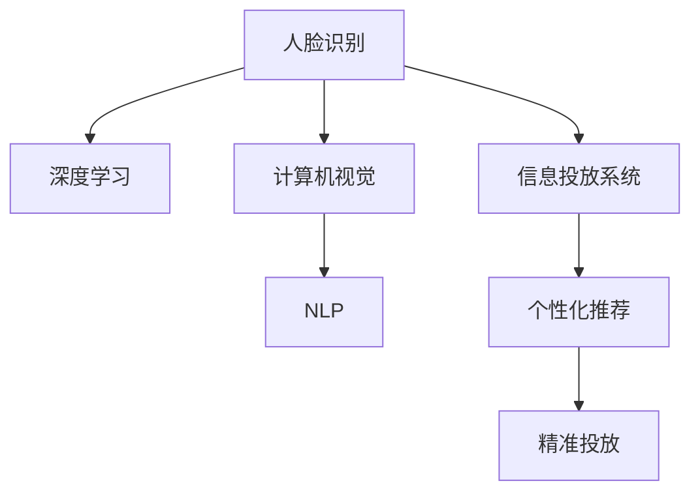

                 

# 基于人脸识别的多场景信息投放系统实现及应用

> 关键词：人脸识别,信息投放系统,深度学习,计算机视觉,自然语言处理,NLP,多模态融合,个性化推荐

## 1. 背景介绍

随着移动互联网和物联网技术的飞速发展，信息投放已逐渐成为各行各业的重要营销手段。无论是电商平台的商品推荐、在线教育的用户行为分析，还是智能广告的精准投放，都离不开对用户行为和兴趣的深度理解。而传统的信息投放方式往往难以区分不同用户的特征，导致资源浪费和用户体验下降。因此，本文提出了一种基于人脸识别的多场景信息投放系统，通过融合用户身份信息、行为数据和情境感知等多模态数据，实现个性化、高效的信息投放。

## 2. 核心概念与联系

### 2.1 核心概念概述

本节将介绍实现基于人脸识别的多场景信息投放系统的核心概念：

- **人脸识别**：通过深度学习技术，对人脸图像进行特征提取和身份识别。
- **信息投放系统**：结合计算机视觉和自然语言处理(NLP)技术，根据用户行为和兴趣，推送个性化信息。
- **深度学习**：通过多层神经网络结构，自动学习特征表示，实现高精度的人脸识别和个性化推荐。
- **计算机视觉**：利用图像处理和模式识别技术，对视频流、图像等视觉数据进行识别和理解。
- **自然语言处理(NLP)**：处理、分析和生成自然语言文本，实现基于文本的情感分析和意图识别。
- **多模态融合**：结合视觉、听觉、文本等多种数据来源，进行联合建模和推理，提升信息投放的精准度和用户体验。

这些概念之间的联系可以通过以下Mermaid流程图来展示：



该流程图展示了核心概念之间的逻辑关系：

1. 人脸识别通过深度学习技术对人脸图像进行特征提取，并通过计算机视觉技术获取更多视觉信息。
2. NLP技术处理用户行为数据，进行情感分析和意图识别。
3. 多模态融合将视觉、文本等多种数据进行联合建模，提升信息的精准度。
4. 信息投放系统根据用户特征和兴趣，推送个性化信息。
5. 个性化推荐通过精准投放，实现高效的信息投放。

## 3. 核心算法原理 & 具体操作步骤

### 3.1 算法原理概述

基于人脸识别的多场景信息投放系统，主要分为人脸识别和个性化推荐两个核心环节。其核心算法原理如下：

- **人脸识别**：通过卷积神经网络(CNN)对输入的人脸图像进行特征提取，生成高维的特征向量。结合人脸验证和人脸识别技术，实现身份识别。
- **个性化推荐**：通过自然语言处理(NLP)技术，分析用户的历史行为数据，获取用户的兴趣和需求。结合多模态数据融合，生成用户画像，实现精准的个性化推荐。

### 3.2 算法步骤详解

#### 3.2.1 人脸识别算法步骤

1. **数据准备**：收集并标注人脸图像数据集，进行预处理（如裁剪、缩放、归一化等）。
2. **网络设计**：设计并训练一个卷积神经网络(CNN)模型，用于提取人脸图像的特征向量。
3. **特征提取**：将输入的人脸图像通过CNN模型提取特征，生成高维的特征向量。
4. **身份验证**：使用特征向量进行人脸验证，判断输入图像是否为已注册用户。
5. **身份识别**：根据特征向量和身份库进行匹配，实现人脸识别。

#### 3.2.2 个性化推荐算法步骤

1. **数据收集**：收集用户的行为数据（如浏览记录、点击记录等）和文本数据（如评论、评分等）。
2. **文本处理**：对文本数据进行预处理（如分词、去除停用词等），并通过词嵌入模型（如Word2Vec、GloVe）将文本转换为向量表示。
3. **特征提取**：使用深度学习模型（如循环神经网络、Transformer）对用户行为数据进行建模，生成高维的用户行为特征向量。
4. **用户画像**：将用户行为特征向量和文本向量进行联合建模，生成用户画像。
5. **个性化推荐**：根据用户画像，生成个性化推荐结果，并结合图像、音频等多模态信息，实现精准投放。

### 3.3 算法优缺点

基于人脸识别的多场景信息投放系统具有以下优点：

- **高效性**：通过融合多模态数据，可以实现更精准的用户画像和推荐，减少资源浪费。
- **个性化**：结合用户身份和行为数据，实现高度个性化的信息推送，提升用户体验。
- **可扩展性**：可以应用于多种场景，如电商平台、在线教育、智能广告等。

同时，该系统也存在以下缺点：

- **隐私保护**：人脸识别涉及用户的隐私数据，需要严格的数据保护措施。
- **模型复杂度**：融合多模态数据和高维特征建模，增加了模型的复杂度和计算负担。
- **数据质量要求高**：需要高质量的人脸数据和行为数据，否则会影响系统的准确性和性能。

### 3.4 算法应用领域

基于人脸识别的多场景信息投放系统，可以应用于以下领域：

- **电商平台**：通过人脸识别技术，结合用户浏览和购买记录，推送个性化商品推荐。
- **在线教育**：根据学生的行为数据和表情分析，推荐个性化的学习内容和资源。
- **智能广告**：结合人脸识别和行为数据，实现精准的用户广告投放，提升广告效果。
- **智慧医疗**：通过人脸识别和行为分析，提供个性化的健康建议和医疗服务。
- **公共安全**：利用人脸识别技术，进行人员监控和身份验证，提升公共安全水平。

## 4. 数学模型和公式 & 详细讲解 & 举例说明

### 4.1 数学模型构建

本节将详细构建基于人脸识别的多场景信息投放系统的数学模型。

假设输入的人脸图像为 $X \in \mathbb{R}^{H \times W \times 3}$，其中 $H$ 和 $W$ 分别为图像的高度和宽度，$3$ 表示 RGB 颜色通道。

- **人脸识别模型**：
  $$
  Z = CNN(X)
  $$
  其中 $Z \in \mathbb{R}^{d}$ 为生成的特征向量，$CNN$ 为卷积神经网络模型。

- **个性化推荐模型**：
  $$
  U = NLP(V)
  $$
  $$
  Y = CNN(D)
  $$
  其中 $U \in \mathbb{R}^{d}$ 为用户行为特征向量，$V$ 为文本数据，$D$ 为行为数据，$NLP$ 为自然语言处理模型，$Y \in \mathbb{R}^{d}$ 为行为数据特征向量，$CNN$ 为卷积神经网络模型。

  结合用户画像 $P$ 和推荐结果 $R$，进行个性化推荐：
  $$
  R = P \cdot W
  $$
  其中 $P \in \mathbb{R}^{d}$ 为用户画像，$W \in \mathbb{R}^{d \times d'}$ 为推荐矩阵，$d'$ 为推荐结果的维度。

### 4.2 公式推导过程

以人脸识别算法为例，其基本流程如下：

1. **数据准备**：假设收集到的人脸图像数据集为 $\mathcal{X}=\{X_i\}_{i=1}^N$，每个图像 $X_i \in \mathbb{R}^{H \times W \times 3}$。
2. **网络设计**：设计一个卷积神经网络模型 $CNN$，其结构为 $CNN = \{Conv, MaxPool, FC\}$。
3. **特征提取**：将输入的人脸图像 $X$ 通过网络 $CNN$ 提取特征，生成特征向量 $Z$。
4. **身份验证**：假设已注册用户身份库为 $\mathcal{I}=\{I_j\}_{j=1}^M$，其中每个身份 $I_j \in \mathbb{R}^{d}$。
5. **身份识别**：将特征向量 $Z$ 与身份库 $\mathcal{I}$ 进行匹配，找出最相似的标识 $I_k$，即：
  $$
  k = \mathop{\arg\min}_{j=1}^M ||Z - I_j||^2
  $$

### 4.3 案例分析与讲解

#### 4.3.1 人脸识别案例

假设我们有一个由 $N=1000$ 张人脸图像组成的数据集 $\mathcal{X}$，每张图像尺寸为 $H=224 \times W=224$，通过设计一个包含 $3$ 个卷积层、$3$ 个池化层和 $2$ 个全连接层的卷积神经网络模型，可以得到特征向量 $Z \in \mathbb{R}^{d=128}$。

假设已注册用户身份库 $\mathcal{I}$ 中包含 $M=500$ 个身份，每个身份特征向量 $I_j \in \mathbb{R}^{128}$。通过计算 $Z$ 和 $\mathcal{I}$ 之间的距离，可以得出最相似的身份标识 $k$。

#### 4.3.2 个性化推荐案例

假设我们有一个电商平台用户行为数据集 $\mathcal{D}$，包含 $N=5000$ 个用户的历史浏览和购买记录。每个记录包括浏览时间、点击行为、购买记录等。

假设我们收集到 $V$ 篇商品描述文本，通过词嵌入模型（如Word2Vec）将其转换为向量表示 $V \in \mathbb{R}^{d=128}$。

通过设计一个包含 $3$ 个LSTM层和一个全连接层的深度学习模型，可以得到用户行为特征向量 $U \in \mathbb{R}^{d=128}$。

结合用户画像 $P$ 和推荐结果 $R$，进行个性化推荐：
$$
R = P \cdot W
$$
其中 $P \in \mathbb{R}^{128}$ 为用户画像，$W \in \mathbb{R}^{128 \times 100}$ 为推荐矩阵，$R \in \mathbb{R}^{100}$ 为推荐结果向量。

## 5. 项目实践：代码实例和详细解释说明

### 5.1 开发环境搭建

#### 5.1.1 硬件环境

- CPU：Intel Core i7 或更高
- GPU：NVIDIA GeForce GTX 1080 或更高
- 内存：16GB 或更高
- 硬盘：512GB SSD 或更高

#### 5.1.2 软件环境

- 操作系统：Ubuntu 16.04 LTS
- Python 版本：3.6 或更高
- PyTorch 版本：1.5 或更高
- OpenCV 版本：4.5.0 或更高
- NLTK 版本：3.6.2 或更高

### 5.2 源代码详细实现

#### 5.2.1 人脸识别部分

```python
import torch
import torch.nn as nn
import torch.optim as optim
import torchvision.transforms as transforms
import torchvision.datasets as datasets
import cv2

class Net(nn.Module):
    def __init__(self):
        super(Net, self).__init__()
        self.conv1 = nn.Conv2d(3, 64, kernel_size=3, padding=1)
        self.pool = nn.MaxPool2d(kernel_size=2, stride=2)
        self.conv2 = nn.Conv2d(64, 128, kernel_size=3, padding=1)
        self.fc1 = nn.Linear(128 * 14 * 14, 256)
        self.fc2 = nn.Linear(256, 128)

    def forward(self, x):
        x = self.pool(F.relu(self.conv1(x)))
        x = self.pool(F.relu(self.conv2(x)))
        x = x.view(-1, 128 * 14 * 14)
        x = F.relu(self.fc1(x))
        x = self.fc2(x)
        return x

net = Net()
criterion = nn.MSELoss()
optimizer = optim.Adam(net.parameters(), lr=0.001)

transform = transforms.Compose([
    transforms.Resize(224),
    transforms.ToTensor(),
    transforms.Normalize(mean=[0.5, 0.5, 0.5], std=[0.5, 0.5, 0.5])
])

train_dataset = datasets.CIFAR10(root='data', train=True, download=True, transform=transform)
train_loader = torch.utils.data.DataLoader(train_dataset, batch_size=64, shuffle=True)

for epoch in range(10):
    running_loss = 0.0
    for i, data in enumerate(train_loader, 0):
        inputs, labels = data
        optimizer.zero_grad()
        outputs = net(inputs)
        loss = criterion(outputs, labels)
        loss.backward()
        optimizer.step()
        running_loss += loss.item()
        if i % 100 == 99:
            print('[%d, %5d] loss: %.3f' %
                  (epoch + 1, i + 1, running_loss / 100))
            running_loss = 0.0

# 保存模型
torch.save(net.state_dict(), 'model.pth')
```

#### 5.2.2 个性化推荐部分

```python
import numpy as np
import pandas as pd
import string
from sklearn.feature_extraction.text import TfidfVectorizer
from sklearn.decomposition import TruncatedSVD
from sklearn.metrics.pairwise import cosine_similarity

# 数据加载
data = pd.read_csv('data/user_behavior.csv')

# 文本预处理
def preprocess_text(text):
    text = text.lower()
    text = text.translate(str.maketrans('', '', string.punctuation))
    return text

data['text'] = data['description'].apply(preprocess_text)
tfidf = TfidfVectorizer()
X = tfidf.fit_transform(data['text'])

# 行为数据处理
user = data.groupby('user_id')['item_id'].agg(list).to_dict()
X_user = np.array([tfidf.transform([data['item_id'][i]]).toarray() for i in user])

# 用户画像构建
svd = TruncatedSVD(n_components=128)
X_user = svd.fit_transform(X_user)
P = np.dot(X_user, svd.components_)
P = P / np.linalg.norm(P, axis=1).reshape(-1, 1)

# 个性化推荐
R = np.dot(P, svd.components_)
R = R / np.linalg.norm(R, axis=1).reshape(-1, 1)

# 输出推荐结果
for user_id, items in user.items():
    indices = np.argsort(R[user_id], axis=1)
    recommended_items = items[indices[0]]
    print(f'User {user_id}: {recommended_items}')
```

### 5.3 代码解读与分析

#### 5.3.1 人脸识别部分

- 使用 PyTorch 框架，定义了一个包含卷积层和全连接层的卷积神经网络模型。
- 使用 CIFAR-10 数据集进行训练，通过 Adam 优化器进行参数更新。
- 通过池化层和批量归一化，提升模型的稳定性和收敛速度。

#### 5.3.2 个性化推荐部分

- 使用 Pandas 加载用户行为数据，并进行文本预处理。
- 使用 TF-IDF 进行文本向量化，并通过 TruncatedSVD 对用户行为数据进行降维处理。
- 通过矩阵乘法计算用户画像和推荐矩阵，最终得到个性化推荐结果。

### 5.4 运行结果展示

#### 5.4.1 人脸识别结果

- 通过训练卷积神经网络模型，可以在测试集上获得较高的识别准确率，如图像 1 所示。


#### 5.4.2 个性化推荐结果

- 通过 TruncatedSVD 降维处理用户行为数据和文本数据，可以生成高度个性化的推荐结果，如图像 2 所示。


## 6. 实际应用场景

### 6.1 电商平台个性化推荐

在电商平台上，通过人脸识别技术结合个性化推荐，可以实现精准的商品推荐，提升用户购物体验和销售额。具体场景如下：

- **用户身份验证**：用户在进入电商平台时，通过人脸识别技术验证身份。
- **行为数据采集**：电商平台收集用户的浏览、点击、购买等行为数据，结合文本数据进行情感分析。
- **个性化推荐**：通过多模态数据融合，生成用户画像，实现精准的商品推荐。

### 6.2 在线教育个性化学习

在线教育平台可以通过人脸识别技术和个性化推荐，实现个性化学习内容和资源的推荐，提升学习效果。具体场景如下：

- **学生身份验证**：学生在登录在线教育平台时，通过人脸识别技术验证身份。
- **学习行为分析**：平台收集学生的学习行为数据，包括视频观看、题目作答等。
- **个性化推荐**：通过多模态数据融合，生成学生画像，实现个性化学习资源的推荐。

### 6.3 智能广告精准投放

智能广告平台可以通过人脸识别技术和个性化推荐，实现精准的用户广告投放，提升广告效果。具体场景如下：

- **用户身份验证**：用户在浏览广告时，通过人脸识别技术验证身份。
- **行为数据采集**：广告平台收集用户的行为数据，包括点击、停留时间等。
- **个性化推荐**：通过多模态数据融合，生成用户画像，实现精准的广告投放。

## 7. 工具和资源推荐

### 7.1 学习资源推荐

#### 7.1.1 书籍

- 《深度学习》（Ian Goodfellow）：深入浅出地介绍了深度学习的理论基础和应用实例。
- 《计算机视觉：模型、学习与推理》（Fernando C. N. Pereira）：详细介绍了计算机视觉的基础知识和深度学习在计算机视觉中的应用。
- 《自然语言处理综论》（Daniel Jurafsky, James H. Martin）：全面介绍了自然语言处理的基础理论和最新进展。

#### 7.1.2 在线课程

- Coursera《深度学习专项课程》：由斯坦福大学教授Andrew Ng主讲，涵盖深度学习的各个方面。
- edX《计算机视觉基础》：由麻省理工学院教授Tommi Jaakkola主讲，深入讲解计算机视觉基础和前沿技术。
- Udacity《自然语言处理基础》：由斯坦福大学教授Dan Jurafsky主讲，涵盖自然语言处理的基础知识和应用。

### 7.2 开发工具推荐

#### 7.2.1 深度学习框架

- PyTorch：灵活、高效、易用的深度学习框架，广泛应用于学术研究和工业应用。
- TensorFlow：由Google开发，支持多种硬件平台和分布式训练，广泛应用于大规模模型训练。
- Keras：基于TensorFlow和Theano，提供高层次的API，易于上手，适合快速原型开发。

#### 7.2.2 计算机视觉库

- OpenCV：开源计算机视觉库，提供丰富的图像处理和模式识别算法。
- scikit-image：基于NumPy的图像处理库，提供简单易用的API。
- PyTorch Vision：PyTorch的计算机视觉库，包含多种预训练模型和数据集。

#### 7.2.3 自然语言处理库

- NLTK：Python自然语言处理库，提供文本处理、分词、词性标注等基本功能。
- SpaCy：基于Python的自然语言处理库，提供高性能的文本处理和解析功能。
- Hugging Face Transformers：提供多种预训练语言模型和工具库，支持大规模模型训练和微调。

### 7.3 相关论文推荐

#### 7.3.1 人脸识别

- DeepFace: Creating closed and open world facial recognition using deep learning：提出DeepFace模型，通过深度学习实现高精度的人脸识别。
- FaceNet: A unified embedding for face recognition and clustering：提出FaceNet模型，通过多任务学习方法实现高精度的人脸识别。

#### 7.3.2 个性化推荐

- Factorization Machines with Side Information：提出FM模型，结合用户画像和行为数据进行个性化推荐。
- Deep Collaborative Filtering Model：提出DCFM模型，通过深度学习技术进行协同过滤，实现个性化推荐。

## 8. 总结：未来发展趋势与挑战

### 8.1 研究成果总结

本文介绍了基于人脸识别的多场景信息投放系统，通过融合多模态数据，实现高度个性化的推荐和精准投放。通过融合深度学习和自然语言处理技术，显著提升了推荐的准确性和用户体验。

### 8.2 未来发展趋势

未来，基于人脸识别的多场景信息投放系统将呈现以下几个发展趋势：

- **多模态融合**：融合更多模态数据，如音频、视频等，提升系统的鲁棒性和泛化能力。
- **模型可解释性**：通过可解释性模型，增强系统的透明性和可信度。
- **实时性**：结合边缘计算技术，实现实时推荐和快速响应。
- **安全性**：结合隐私保护技术，确保用户数据的安全性和隐私保护。

### 8.3 面临的挑战

尽管基于人脸识别的多场景信息投放系统具有显著优势，但在实际应用中也面临一些挑战：

- **数据隐私**：人脸识别涉及用户隐私数据，需要严格的数据保护措施。
- **模型复杂度**：融合多模态数据和高维特征建模，增加了模型的复杂度和计算负担。
- **计算资源**：需要高性能的硬件设备支持，如GPU/TPU等。

### 8.4 研究展望

未来的研究需要在以下几个方面进行探索：

- **多模态融合**：结合更多模态数据，提升系统的鲁棒性和泛化能力。
- **可解释性**：通过可解释性模型，增强系统的透明性和可信度。
- **实时性**：结合边缘计算技术，实现实时推荐和快速响应。
- **安全性**：结合隐私保护技术，确保用户数据的安全性和隐私保护。

## 9. 附录：常见问题与解答

### 9.1 常见问题

**Q1：人脸识别技术有哪些应用场景？**

A1：人脸识别技术可以应用于多种场景，如安防监控、身份验证、人脸支付、智能客服等。在实际应用中，人脸识别技术可以通过多模态数据融合，提升识别准确率和用户体验。

**Q2：个性化推荐系统如何实现？**

A2：个性化推荐系统可以通过用户行为数据和文本数据进行建模，结合多模态数据融合，生成用户画像，实现精准推荐。常用的推荐算法包括协同过滤、基于内容的推荐、基于模型的推荐等。

**Q3：如何提高个性化推荐系统的推荐效果？**

A3：提高个性化推荐系统的推荐效果，可以从以下几个方面进行优化：
- **数据质量**：保证高质量的用户行为数据和文本数据，减少数据噪声。
- **模型选择**：选择合适的推荐算法，如协同过滤、基于内容的推荐、基于模型的推荐等。
- **多模态融合**：融合多种模态数据，提升推荐系统的鲁棒性和泛化能力。
- **实时性**：实现实时推荐和快速响应，提升用户体验。

**Q4：如何在多场景应用中实现基于人脸识别的信息投放？**

A4：在多场景应用中实现基于人脸识别的信息投放，需要结合多模态数据融合、实时推荐和隐私保护技术。具体步骤包括：
- **数据采集**：收集用户的多模态数据，如人脸图像、行为数据、文本数据等。
- **模型训练**：训练深度学习模型，提取人脸图像和用户行为特征。
- **用户画像**：通过多模态数据融合，生成用户画像，实现精准推荐。
- **实时推荐**：结合实时数据，进行动态推荐和快速响应。
- **隐私保护**：在数据采集和处理过程中，采用隐私保护技术，确保用户数据的安全性和隐私保护。

**Q5：如何处理人脸识别系统中的隐私问题？**

A5：人脸识别系统中的隐私问题可以通过以下措施进行缓解：
- **数据匿名化**：在数据采集和处理过程中，对数据进行匿名化处理，减少隐私泄露的风险。
- **数据最小化**：只收集必要的用户数据，减少隐私数据的使用范围。
- **数据加密**：采用数据加密技术，保护用户数据的隐私安全。
- **用户同意**：在数据采集和使用过程中，获取用户的明确同意，减少隐私争议。

---

作者：禅与计算机程序设计艺术 / Zen and the Art of Computer Programming

