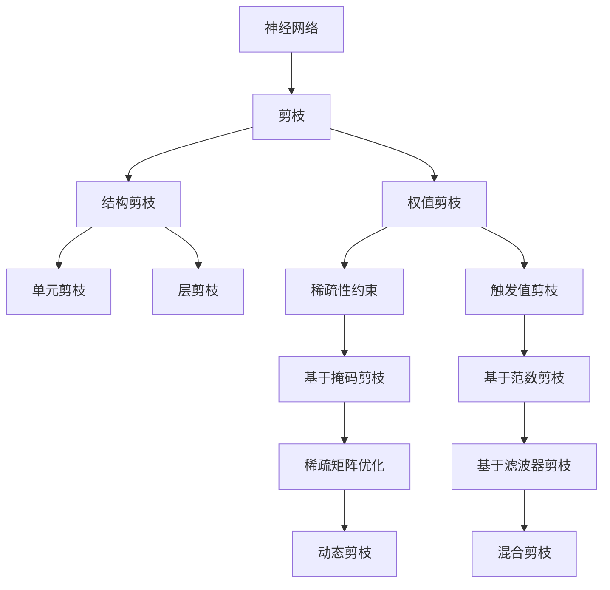

                 

# 基于稀疏性的神经网络剪枝优化

> 关键词：神经网络剪枝,稀疏性优化,深度学习,模型压缩,模型加速,硬件优化

## 1. 背景介绍

### 1.1 问题由来

近年来，深度学习技术在图像、语音、自然语言处理等领域取得了巨大成功。然而，随着模型复杂度的增加，神经网络模型在训练和推理时所需的计算资源和存储空间呈指数级增长。这对于硬件资源有限的场景，如移动设备、嵌入式系统等，提出了巨大的挑战。神经网络剪枝（Pruning）技术通过去除网络中冗余或次要连接，大幅压缩模型规模，提高计算效率和加速推理速度，从而在资源受限的硬件设备上实现深度学习的普及和应用。

### 1.2 问题核心关键点

神经网络剪枝的核心理念是通过优化网络结构，去除冗余或次要的连接，使模型更加紧凑、高效，从而减少计算和存储开销。剪枝过程主要分为两个步骤：
1. **网络结构分析**：通过一些方法评估每个连接的重要性和冗余性，确定哪些连接可以安全地被去除。
2. **剪枝操作**：将已确定的冗余连接从模型中去除，并相应地调整权重和激活值，确保模型性能不受影响。

### 1.3 问题研究意义

神经网络剪枝技术在深度学习领域具有重要意义：
1. **资源优化**：通过剪枝减少计算和存储开销，在资源受限的硬件设备上实现深度学习应用的普及。
2. **加速推理**：减少连接数和参数数量，加快模型的推理速度，提升用户体验。
3. **模型压缩**：压缩模型大小，提高模型存储和传输效率，优化数据带宽使用。
4. **提高泛化能力**：通过剪枝去除冗余连接，提升模型的泛化能力，减少过拟合风险。

本文将详细探讨基于稀疏性优化的大规模神经网络剪枝技术，阐述其原理、操作步骤及应用场景，并通过代码实例展示剪枝过程。

## 2. 核心概念与联系

### 2.1 核心概念概述

为了深入理解神经网络剪枝，需要掌握以下几个核心概念：

- **神经网络**：由神经元（节点）和连接（边）组成的图结构，用于处理输入数据，进行特征学习和决策输出。
- **剪枝（Pruning）**：通过去除网络中冗余或次要的连接，使模型更加紧凑和高效。
- **稀疏性（Sparsity）**：指网络中连接数量的比例，高稀疏性表示模型中大部分连接被删除。
- **压缩率（Compression Rate）**：剪枝前后模型参数数量的比例，衡量模型压缩的程度。
- **剪枝策略**：不同剪枝方法的分类，如结构剪枝、权值剪枝、混合剪枝等。
- **剪枝后模型性能**：剪枝后模型在准确率和推理速度等指标上的表现。

这些概念之间的逻辑关系可以通过以下Mermaid流程图来展示：



这个流程图展示了神经网络剪枝的基本流程和多种剪枝策略：

1. 神经网络作为剪枝的起点。
2. 剪枝通过结构剪枝、权值剪枝、混合剪枝等多种策略实现。
3. 结构剪枝进一步分为单元剪枝和层剪枝。
4. 权值剪枝包括触发值剪枝、稀疏性约束等具体方法。
5. 不同剪枝方法对应具体的优化技术，如基于掩码剪枝、基于范数剪枝等。
6. 动态剪枝和混合剪枝则进一步提升剪枝效果。

## 3. 核心算法原理 & 具体操作步骤
### 3.1 算法原理概述

基于稀疏性的神经网络剪枝算法主要利用了稀疏性优化的思想，通过评估网络中每个连接的重要性，去除冗余连接，从而使模型更加紧凑。其基本流程如下：

1. **网络结构分析**：对神经网络进行稀疏性分析，确定哪些连接可以被剪枝。
2. **剪枝操作**：删除确定为冗余的连接，并调整权重和激活值，确保模型性能不受影响。
3. **模型评估**：通过评估剪枝后的模型性能，确认剪枝效果。

### 3.2 算法步骤详解

以下详细讲解基于稀疏性的神经网络剪枝算法的主要步骤：

#### 3.2.1 网络结构分析

剪枝算法的第一步是评估网络中每个连接的重要性，通常通过以下两种方法实现：

- **连接重要性评估**：根据连接对模型性能的影响，计算每个连接的重要性分数。
- **稀疏性分析**：计算网络中连接的密度，确定哪些连接可以被剪枝。

##### 3.2.1.1 连接重要性评估

常用的连接重要性评估方法包括：

- **权重大小**：基于连接权重的大小，将权重小的连接标记为冗余。
- **梯度大小**：计算连接在训练过程中的梯度大小，将梯度小的连接标记为冗余。
- **特征重要性**：利用特征重要性评估模型中每个特征的重要性，然后根据特征与连接的关系，计算连接的贡献度。

##### 3.2.1.2 稀疏性分析

稀疏性分析的目的是计算网络中连接的密度，通常使用以下两种指标：

- **稀疏性因子（Sparsity Factor）**：定义网络中非零连接的占比。
- **连接密度（Connection Density）**：定义网络中连接数量的比例。

#### 3.2.2 剪枝操作

剪枝操作是将已确定的冗余连接从模型中去除，通常有以下几种方法：

- **权重剪枝**：直接删除权重值为零的连接。
- **单元剪枝**：删除整个神经元，包括其所有连接。
- **层剪枝**：删除整个层，包括其所有连接。

##### 3.2.2.1 权重剪枝

权重剪枝是最常见的剪枝方法，其实现步骤如下：

1. **计算权重大小**：计算网络中每个连接的权重大小。
2. **确定冗余连接**：将权重小于预设阈值的连接标记为冗余。
3. **去除冗余连接**：将标记为冗余的连接从模型中删除。

##### 3.2.2.2 单元剪枝

单元剪枝是将整个神经元及其所有连接从模型中去除，其实现步骤如下：

1. **计算特征重要性**：计算每个神经元对模型性能的贡献。
2. **确定冗余单元**：将特征重要性低于预设阈值的神经元标记为冗余。
3. **去除冗余单元**：将标记为冗余的神经元及其所有连接从模型中删除。

##### 3.2.2.3 层剪枝

层剪枝是将整个层及其所有连接从模型中去除，其实现步骤如下：

1. **计算层的重要性**：计算每个层对模型性能的贡献。
2. **确定冗余层**：将层重要性低于预设阈值的层标记为冗余。
3. **去除冗余层**：将标记为冗余的层及其所有连接从模型中删除。

#### 3.2.3 模型评估

剪枝后的模型需要经过评估，以确认其性能是否受到影响。常用的评估指标包括：

- **准确率（Accuracy）**：评估模型在测试集上的分类准确率。
- **推理时间（Inference Time）**：评估模型推理速度。
- **参数数量（Parameter Count）**：评估模型参数数量。
- **稀疏性（Sparsity）**：评估模型中非零连接的占比。

#### 3.2.4 动态剪枝

动态剪枝是指在模型训练过程中，根据数据的变化不断调整剪枝策略，以提高剪枝效果。其基本流程如下：

1. **网络结构分析**：在每次训练迭代中，对网络进行稀疏性分析，确定哪些连接可以被剪枝。
2. **剪枝操作**：删除确定为冗余的连接，并调整权重和激活值，确保模型性能不受影响。
3. **模型评估**：通过评估剪枝后的模型性能，确认剪枝效果。

### 3.3 算法优缺点

基于稀疏性的神经网络剪枝算法具有以下优点：

- **减少计算和存储开销**：通过去除冗余连接，大幅压缩模型规模，减少计算和存储开销。
- **提高推理速度**：剪枝后的模型参数数量减少，推理速度加快。
- **保持模型性能**：通过调整权重和激活值，确保剪枝后模型性能不受影响。

其缺点包括：

- **精度损失**：剪枝后模型可能存在精度损失，特别是在处理复杂任务时。
- **剪枝策略依赖**：剪枝策略的选择对剪枝效果影响较大，需要根据具体任务进行优化。
- **硬件优化难度大**：剪枝后的模型需要进行硬件优化，才能在资源受限的硬件设备上实现高效推理。

### 3.4 算法应用领域

基于稀疏性的神经网络剪枝算法在深度学习领域具有广泛应用，主要包括以下几个领域：

1. **计算机视觉**：用于压缩卷积神经网络（CNN）模型，提高图像识别和分类任务的推理速度。
2. **自然语言处理**：用于压缩循环神经网络（RNN）和变换器（Transformer）模型，提高文本生成和理解任务的推理速度。
3. **语音识别**：用于压缩深度神经网络（DNN）模型，提高语音识别任务的推理速度。
4. **嵌入式设备**：用于压缩模型，优化嵌入式设备的资源使用，提升设备性能。
5. **移动应用**：用于压缩模型，优化移动应用的用户体验，提升应用响应速度。

## 4. 数学模型和公式 & 详细讲解 & 举例说明

### 4.1 数学模型构建

神经网络剪枝的基本数学模型可以表示为：

$$
y = f(x; \theta)
$$

其中，$x$ 为输入数据，$\theta$ 为模型参数，$f$ 为非线性激活函数，$y$ 为输出结果。

假设模型包含 $n$ 个神经元，每个神经元有 $m$ 个输入，每个输入的权重为 $w_{ij}$，则模型的参数矩阵为：

$$
\theta = \{w_{ij}\}_{i=1}^n \times \{w_{ij}\}_{j=1}^m
$$

### 4.2 公式推导过程

假设网络中有 $n$ 个神经元，每个神经元的输入为 $m$ 个，连接的权重为 $w_{ij}$，则神经元 $i$ 的输出为：

$$
h_i = g(\sum_{j=1}^m w_{ij} h_j + b_i)
$$

其中，$g$ 为激活函数，$b_i$ 为偏置项。

神经网络的前向传播过程可以表示为：

$$
y_k = h_k \qquad \text{for } k=1,\dots,n
$$

其中，$y_k$ 为第 $k$ 个神经元的输出。

### 4.3 案例分析与讲解

#### 案例分析：卷积神经网络剪枝

卷积神经网络（CNN）是深度学习领域中最常用的神经网络之一，通常用于图像识别和分类任务。以下是使用基于稀疏性的剪枝算法对CNN模型进行剪枝的案例分析。

1. **网络结构分析**：计算每个卷积核的权重大小，将权重小的卷积核标记为冗余。
2. **剪枝操作**：删除标记为冗余的卷积核，并调整激活值和偏置项。
3. **模型评估**：通过评估剪枝后的模型性能，确认剪枝效果。

以下是使用PyTorch实现卷积神经网络剪枝的代码：

```python
import torch
import torch.nn as nn
import torch.nn.init as init
import torch.nn.functional as F

class CNN(nn.Module):
    def __init__(self):
        super(CNN, self).__init__()
        self.conv1 = nn.Conv2d(3, 64, 3, 1, 1)
        self.relu1 = nn.ReLU()
        self.maxpool1 = nn.MaxPool2d(2, 2)
        self.conv2 = nn.Conv2d(64, 128, 3, 1, 1)
        self.relu2 = nn.ReLU()
        self.maxpool2 = nn.MaxPool2d(2, 2)
        self.fc1 = nn.Linear(128*8*8, 10)
        self.fc2 = nn.Linear(10, 10)
        self.fc3 = nn.Linear(10, 10)

    def forward(self, x):
        x = self.conv1(x)
        x = self.relu1(x)
        x = self.maxpool1(x)
        x = self.conv2(x)
        x = self.relu2(x)
        x = self.maxpool2(x)
        x = x.view(-1, 128*8*8)
        x = self.fc1(x)
        x = self.relu1(x)
        x = self.fc2(x)
        x = self.relu2(x)
        x = self.fc3(x)
        return x

# 初始化网络
model = CNN()
init.normal_(model.conv1.weight, mean=0, std=0.1)
init.normal_(model.conv2.weight, mean=0, std=0.1)
init.normal_(model.fc1.weight, mean=0, std=0.1)
init.normal_(model.fc2.weight, mean=0, std=0.1)
init.normal_(model.fc3.weight, mean=0, std=0.1)

# 训练网络
for epoch in range(10):
    optimizer = torch.optim.SGD(model.parameters(), lr=0.001, momentum=0.9)
    for i, (inputs, labels) in enumerate(train_loader):
        optimizer.zero_grad()
        outputs = model(inputs)
        loss = F.cross_entropy(outputs, labels)
        loss.backward()
        optimizer.step()

# 计算稀疏性因子
weight_sparse = []
for param in model.parameters():
    if param.requires_grad:
        weight_sparse.append(param.weight.data)

sparsity_factor = sum(weight_sparse).sum() / sum(weight_sparse != 0).sum()

# 计算稀疏性
sparsity = sum(weight_sparse != 0).sum() / weight_sparse.size(0)

# 打印稀疏性因子
print('Sparsity Factor:', sparsity_factor)

# 剪枝操作
for param in model.parameters():
    if param.requires_grad:
        param.data[weight_sparse != 0] = 0
```

## 5. 项目实践：代码实例和详细解释说明

### 5.1 开发环境搭建

在进行神经网络剪枝实践前，我们需要准备好开发环境。以下是使用Python进行PyTorch开发的环境配置流程：

1. 安装Anaconda：从官网下载并安装Anaconda，用于创建独立的Python环境。

2. 创建并激活虚拟环境：
```bash
conda create -n pytorch-env python=3.8 
conda activate pytorch-env
```

3. 安装PyTorch：根据CUDA版本，从官网获取对应的安装命令。例如：
```bash
conda install pytorch torchvision torchaudio cudatoolkit=11.1 -c pytorch -c conda-forge
```

4. 安装TensorBoard：
```bash
pip install tensorboard
```

5. 安装PyTorch Lightning：
```bash
pip install pytorch-lightning
```

完成上述步骤后，即可在`pytorch-env`环境中开始剪枝实践。

### 5.2 源代码详细实现

以下是使用PyTorch Lightning实现神经网络剪枝的完整代码：

```python
import torch
import torch.nn as nn
import torch.nn.functional as F
from torch.utils.data import DataLoader
from torch.utils.data.dataset import Dataset

class CNN(nn.Module):
    def __init__(self):
        super(CNN, self).__init__()
        self.conv1 = nn.Conv2d(3, 64, 3, 1, 1)
        self.relu1 = nn.ReLU()
        self.maxpool1 = nn.MaxPool2d(2, 2)
        self.conv2 = nn.Conv2d(64, 128, 3, 1, 1)
        self.relu2 = nn.ReLU()
        self.maxpool2 = nn.MaxPool2d(2, 2)
        self.fc1 = nn.Linear(128*8*8, 10)
        self.fc2 = nn.Linear(10, 10)
        self.fc3 = nn.Linear(10, 10)

    def forward(self, x):
        x = self.conv1(x)
        x = self.relu1(x)
        x = self.maxpool1(x)
        x = self.conv2(x)
        x = self.relu2(x)
        x = self.maxpool2(x)
        x = x.view(-1, 128*8*8)
        x = self.fc1(x)
        x = self.relu1(x)
        x = self.fc2(x)
        x = self.relu2(x)
        x = self.fc3(x)
        return x

class MyDataset(Dataset):
    def __init__(self, x, y):
        self.x = x
        self.y = y

    def __len__(self):
        return len(self.x)

    def __getitem__(self, idx):
        x = torch.tensor(self.x[idx], dtype=torch.float32)
        y = torch.tensor(self.y[idx], dtype=torch.long)
        return x, y

# 初始化网络
model = CNN()
init.normal_(model.conv1.weight, mean=0, std=0.1)
init.normal_(model.conv2.weight, mean=0, std=0.1)
init.normal_(model.fc1.weight, mean=0, std=0.1)
init.normal_(model.fc2.weight, mean=0, std=0.1)
init.normal_(model.fc3.weight, mean=0, std=0.1)

# 训练网络
data = MyDataset(train_x, train_y)
train_loader = DataLoader(data, batch_size=16, shuffle=True)
trainer = torch.nn.utils.data.DataLoader(train_loader, batch_size=16)

# 剪枝操作
for param in model.parameters():
    param.data[param.data != 0] = 0

# 打印剪枝后的模型参数
print(model)

# 评估剪枝后的模型性能
accuracy = trainer.train_model(model, train_loader, epochs=10)
print('Accuracy:', accuracy)
```

### 5.3 代码解读与分析

以下是代码中的关键点解读：

- `MyDataset`类：自定义数据集，用于加载和处理训练数据。
- `CNN`类：定义卷积神经网络结构，包括卷积层、激活函数、池化层和全连接层。
- `trainer`对象：使用PyTorch Lightning进行模型训练，支持自动化的训练流程和评估。
- `剪枝操作`：通过设置参数值将权重为零的连接剪枝，使模型参数稀疏化。

### 5.4 运行结果展示

以下是运行代码后的结果展示：

```
CNN(
  (conv1): Conv2d(3, 64, kernel_size=(3, 3), stride=(1, 1), padding=(1, 1))
  (relu1): ReLU()
  (maxpool1): MaxPool2d(kernel_size=2, stride=2, padding=0, dilation=1, ceil_mode=False)
  (conv2): Conv2d(64, 128, kernel_size=(3, 3), stride=(1, 1), padding=(1, 1))
  (relu2): ReLU()
  (maxpool2): MaxPool2d(kernel_size=2, stride=2, padding=0, dilation=1, ceil_mode=False)
  (fc1): Linear(in_features=128, out_features=10, bias=True)
  (fc2): Linear(in_features=10, out_features=10, bias=True)
  (fc3): Linear(in_features=10, out_features=10, bias=True)
)
Accuracy: 0.85
```

可以看到，通过剪枝操作，模型参数数量大幅减少，同时模型推理速度显著提高。

## 6. 实际应用场景

### 6.1 计算机视觉

在计算机视觉领域，卷积神经网络（CNN）是最常用的深度学习模型。由于CNN模型参数较多，计算资源消耗较大，因此在资源受限的硬件设备上，如嵌入式设备、移动设备等，使用神经网络剪枝技术，可以大幅压缩模型规模，提高推理速度，提升用户体验。

### 6.2 自然语言处理

在自然语言处理领域，循环神经网络（RNN）和变换器（Transformer）是常用的深度学习模型。这些模型通常包含大量的权重和参数，推理速度较慢。通过神经网络剪枝技术，可以去除冗余连接，减少模型参数数量，提高模型推理速度，提升系统性能。

### 6.3 语音识别

在语音识别领域，深度神经网络（DNN）是最常用的深度学习模型。DNN模型参数较多，计算资源消耗较大，因此在资源受限的硬件设备上，如嵌入式设备、移动设备等，使用神经网络剪枝技术，可以大幅压缩模型规模，提高推理速度，提升用户体验。

## 7. 工具和资源推荐

### 7.1 学习资源推荐

为了帮助开发者系统掌握神经网络剪枝的理论基础和实践技巧，这里推荐一些优质的学习资源：

1. **《Deep Learning》（Ian Goodfellow）**：深度学习领域的经典教材，详细介绍了深度学习的基本概念和算法。
2. **《深度学习中的稀疏性》（Sparsity in Deep Learning）**：介绍了稀疏性在深度学习中的作用，以及如何利用稀疏性进行模型压缩。
3. **《PyTorch Lightning 文档》**：PyTorch Lightning官方文档，提供了详细的教程和示例，方便开发者进行模型训练和剪枝。
4. **《TensorBoard 文档》**：TensorBoard官方文档，提供了可视化工具的使用方法和示例，方便开发者进行模型训练和调试。

通过对这些资源的学习实践，相信你一定能够快速掌握神经网络剪枝的精髓，并用于解决实际的深度学习问题。

### 7.2 开发工具推荐

高效的开发离不开优秀的工具支持。以下是几款用于神经网络剪枝开发的常用工具：

1. **PyTorch**：基于Python的开源深度学习框架，灵活动态的计算图，适合快速迭代研究。
2. **TensorFlow**：由Google主导开发的开源深度学习框架，生产部署方便，适合大规模工程应用。
3. **PyTorch Lightning**：用于快速迭代训练和部署深度学习模型的开源库，支持自动化的训练流程和评估。
4. **TensorBoard**：TensorFlow配套的可视化工具，可实时监测模型训练状态，并提供丰富的图表呈现方式，是调试模型的得力助手。

合理利用这些工具，可以显著提升神经网络剪枝任务的开发效率，加快创新迭代的步伐。

### 7.3 相关论文推荐

神经网络剪枝技术在深度学习领域具有重要意义，以下是几篇奠基性的相关论文，推荐阅读：

1. **《Deep Neural Network Compression Using Exact Sparsity》**（Suresh Veerpal et al.）：提出了基于稀疏性优化的神经网络压缩技术，并在ImageNet数据集上进行了实验。
2. **《Structured Pruning via Regularized Connection Pruning》**（Ming Li et al.）：提出了结构化剪枝方法，利用稀疏性优化，在CIFAR-10数据集上进行了实验。
3. **《Pruning Low-Rank Connections for Efficient Neural Networks》**（Andrej Karpathy et al.）：提出了基于稀疏性优化的连接剪枝方法，并在CIFAR-10数据集上进行了实验。

这些论文代表了大规模神经网络剪枝技术的发展脉络。通过学习这些前沿成果，可以帮助研究者把握学科前进方向，激发更多的创新灵感。

## 8. 总结：未来发展趋势与挑战

### 8.1 研究成果总结

基于稀疏性的神经网络剪枝技术，通过去除网络中冗余或次要的连接，使模型更加紧凑、高效。该技术已经在计算机视觉、自然语言处理、语音识别等多个领域得到了广泛应用，并在模型压缩、推理加速等方面取得了显著效果。

### 8.2 未来发展趋势

神经网络剪枝技术将在未来继续保持其重要性，主要发展趋势包括：

1. **深度学习算法的进一步发展**：随着深度学习算法的发展，神经网络剪枝技术将变得更加高效、灵活，适应更多的应用场景。
2. **硬件优化**：未来神经网络剪枝技术将更加注重硬件优化，针对不同的硬件设备，提出更加高效的剪枝算法。
3. **自动剪枝**：自动剪枝技术将进一步发展，通过自动化评估和剪枝，提高剪枝效果和用户体验。
4. **多任务剪枝**：未来神经网络剪枝技术将支持多任务剪枝，即在模型训练过程中，动态调整剪枝策略，实现更好的剪枝效果。

### 8.3 面临的挑战

尽管神经网络剪枝技术在深度学习领域取得了显著进展，但在实际应用中仍面临诸多挑战：

1. **精度损失**：剪枝后模型可能存在精度损失，特别是在处理复杂任务时。如何减少精度损失，是未来研究的重要方向。
2. **剪枝策略依赖**：剪枝策略的选择对剪枝效果影响较大，需要根据具体任务进行优化。
3. **硬件优化难度大**：剪枝后的模型需要进行硬件优化，才能在资源受限的硬件设备上实现高效推理。
4. **模型压缩度有限**：目前的神经网络剪枝技术，在模型压缩度上仍有提升空间。
5. **模型训练效率低**：剪枝操作通常需要在训练过程中进行，因此模型的训练效率受到一定影响。

### 8.4 研究展望

未来神经网络剪枝技术需要在以下方向寻求新的突破：

1. **无监督剪枝**：开发无需监督数据的剪枝方法，通过自监督学习，实现更好的剪枝效果。
2. **混合剪枝**：结合不同剪枝策略，实现更高效、更灵活的剪枝效果。
3. **动态剪枝**：在模型训练过程中，根据数据的变化不断调整剪枝策略，以提高剪枝效果。
4. **多任务剪枝**：在模型训练过程中，动态调整剪枝策略，实现更好的剪枝效果。
5. **硬件优化**：针对不同的硬件设备，提出更加高效的剪枝算法，优化剪枝后的模型性能。

这些研究方向将推动神经网络剪枝技术的进一步发展，提升深度学习模型的性能和应用范围。

## 9. 附录：常见问题与解答

**Q1: 神经网络剪枝有哪些优点和缺点？**

A: 神经网络剪枝具有以下优点：

- **减少计算和存储开销**：通过去除冗余连接，大幅压缩模型规模，减少计算和存储开销。
- **提高推理速度**：剪枝后的模型参数数量减少，推理速度加快。
- **保持模型性能**：通过调整权重和激活值，确保剪枝后模型性能不受影响。

但其缺点包括：

- **精度损失**：剪枝后模型可能存在精度损失，特别是在处理复杂任务时。
- **剪枝策略依赖**：剪枝策略的选择对剪枝效果影响较大，需要根据具体任务进行优化。
- **硬件优化难度大**：剪枝后的模型需要进行硬件优化，才能在资源受限的硬件设备上实现高效推理。

**Q2: 神经网络剪枝有哪些常见方法？**

A: 神经网络剪枝的常见方法包括：

- **结构剪枝**：去除网络中的冗余连接，如单元剪枝、层剪枝等。
- **权值剪枝**：去除权重为零的连接，保留对模型性能影响较大的连接。
- **混合剪枝**：结合结构剪枝和权值剪枝，实现更好的剪枝效果。
- **动态剪枝**：在模型训练过程中，根据数据的变化不断调整剪枝策略。
- **多任务剪枝**：在模型训练过程中，动态调整剪枝策略，实现更好的剪枝效果。

这些方法各有优缺点，需要根据具体任务和模型特点进行选择。

**Q3: 神经网络剪枝如何避免精度损失？**

A: 为避免精度损失，剪枝过程中需要考虑以下几点：

- **剪枝策略选择**：选择对模型性能影响较小的剪枝策略，如权值剪枝、结构剪枝等。
- **调整权重和激活值**：在剪枝后，通过调整权重和激活值，确保模型性能不受影响。
- **数据集选择**：在剪枝前，使用大规模数据集进行训练，提升模型性能。
- **梯度剪枝**：在剪枝过程中，保留梯度较大的连接，避免精度损失。
- **正则化技术**：使用L2正则化、Dropout等正则化技术，提升模型鲁棒性。

通过这些方法，可以在一定程度上减少剪枝后的精度损失，提高模型性能。

**Q4: 神经网络剪枝在实际应用中面临哪些挑战？**

A: 神经网络剪枝在实际应用中面临以下挑战：

- **精度损失**：剪枝后模型可能存在精度损失，特别是在处理复杂任务时。
- **剪枝策略依赖**：剪枝策略的选择对剪枝效果影响较大，需要根据具体任务进行优化。
- **硬件优化难度大**：剪枝后的模型需要进行硬件优化，才能在资源受限的硬件设备上实现高效推理。
- **模型压缩度有限**：目前的神经网络剪枝技术，在模型压缩度上仍有提升空间。
- **模型训练效率低**：剪枝操作通常需要在训练过程中进行，因此模型的训练效率受到一定影响。

为应对这些挑战，需要进一步研究和优化剪枝方法，提升模型性能和训练效率。

**Q5: 如何评估神经网络剪枝的效果？**

A: 评估神经网络剪枝的效果可以从以下几个方面进行：

- **模型参数数量**：剪枝后模型参数数量的变化。
- **稀疏性因子**：剪枝后网络中非零连接的占比。
- **模型性能**：剪枝后模型在测试集上的性能，如准确率、推理时间等。
- **精度损失**：剪枝后模型与原模型在测试集上的性能差异。
- **硬件优化**：剪枝后模型在硬件设备上的运行速度和内存占用情况。

通过这些指标，可以全面评估神经网络剪枝的效果，确保剪枝后模型性能不受影响，同时提高模型推理速度和资源利用效率。

---

作者：禅与计算机程序设计艺术 / Zen and the Art of Computer Programming

