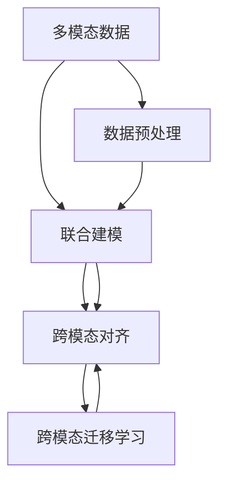

                 

# 多模态大模型：技术原理与实战 多模态大模型的核心技术

## 1. 背景介绍

### 1.1 问题由来
随着人工智能技术的不断进步，单一模态的机器学习模型已经无法满足日益复杂的现实应用需求。多模态大模型作为新一代的AI技术，集合了文本、图像、语音等多种信息，具备更强的感知能力和知识表达能力，可以在语音识别、图像分类、视频处理、自然语言理解等多个领域中取得突破性进展。

近年来，多模态大模型在医学影像分析、视频自动摘要、智能问答系统等领域取得了显著成果，展示了其在多模态信息融合和理解方面的巨大潜力。然而，由于多模态数据处理和融合的复杂性，其建模和训练技术仍面临诸多挑战。本文将全面介绍多模态大模型的核心技术，包括技术原理、操作步骤和实际应用，并通过丰富的代码实例进行详细讲解。

### 1.2 问题核心关键点
多模态大模型的核心在于如何将不同模态的信息融合在一起，形成统一的表示和推理框架。主要包括以下几个关键点：
- 多模态数据融合：如何将文本、图像、语音等不同模态的数据整合为一个统一的表示形式。
- 联合建模：如何设计模型结构，使得不同模态的信息能够共同参与建模和推理。
- 跨模态对齐：如何将不同模态的信息对齐为一个统一的空间，避免信息的丢失或扭曲。
- 跨模态迁移学习：如何在特定模态下预训练的知识迁移到另一个模态，提升模型性能。

这些关键点涉及到数据预处理、模型架构设计、特征融合等技术，需要综合考虑多模态数据的特性和任务需求。本文将逐一介绍这些核心概念，并给出具体的实现方法。

## 2. 核心概念与联系

### 2.1 核心概念概述

为更好地理解多模态大模型的核心技术，本节将介绍几个关键概念：

- 多模态数据：指同时包含多种模态的信息，如文本、图像、语音等。
- 联合建模：指设计能够同时处理多种模态数据的模型结构，将不同模态的信息融合到统一的空间中。
- 跨模态对齐：指将不同模态的数据映射到同一个低维空间，使得不同模态的信息能够相互补充。
- 跨模态迁移学习：指在特定模态下预训练的知识迁移到另一个模态，提升模型的泛化能力和迁移能力。

这些概念之间存在紧密的联系，共同构成了多模态大模型的建模框架。理解这些概念，可以帮助我们更好地设计和使用多模态大模型。

### 2.2 核心概念原理和架构的 Mermaid 流程图


## 3. 核心算法原理 & 具体操作步骤
### 3.1 算法原理概述

多模态大模型的核心算法原理在于如何将不同模态的信息融合到一个统一的空间，并进行联合建模。以下是基于深度学习的联合建模和跨模态对齐的基本步骤：

1. **数据预处理**：对不同模态的数据进行标准化和归一化处理，使其能够在相同的尺度上进行比较和融合。

2. **特征提取**：通过卷积神经网络(CNN)、循环神经网络(RNN)、Transformer等模型对不同模态的数据进行特征提取。

3. **特征融合**：将不同模态的特征通过拼接、连接、加权平均等方法进行融合，得到一个统一的高维表示。

4. **联合建模**：将融合后的特征输入到一个统一的模型中进行建模，如循环神经网络(RNN)、卷积神经网络(CNN)、Transformer等。

5. **跨模态对齐**：通过线性变换、非线性变换等方法将不同模态的信息映射到同一个低维空间，使得信息能够相互补充。

6. **跨模态迁移学习**：在特定模态下预训练的模型可以迁移到另一个模态，提升模型在新的模态下的性能。

### 3.2 算法步骤详解

接下来，我们将详细讲解多模态大模型的实现步骤，包括数据预处理、特征提取、特征融合、联合建模和跨模态迁移学习。

#### 3.2.1 数据预处理
数据预处理是多模态大模型的第一步，其目的是将不同模态的数据标准化，使其能够在同一个尺度上进行比较和融合。以下是一个简化的数据预处理流程：

1. **图像数据预处理**：
   - 图像尺寸标准化：将图像缩放到统一的大小。
   - 颜色空间转换：将图像从RGB空间转换为灰度空间或HSV空间。
   - 归一化：将图像像素值归一化到[0,1]区间。

2. **文本数据预处理**：
   - 分词：将文本分割成单词或子词。
   - 去除停用词：去除文本中常见的无意义词汇。
   - 标准化：将文本转换为统一的小写形式，去除标点符号等。

3. **语音数据预处理**：
   - 语音分割：将语音信号分割成帧，每帧长度为10-30毫秒。
   - 特征提取：提取MFCC、Mel频谱等语音特征。
   - 归一化：将特征值归一化到[-1,1]或[0,1]区间。

#### 3.2.2 特征提取
特征提取是联合建模的关键步骤，其目的是将不同模态的信息转化为高维特征表示，以便进行融合和建模。以下是一些常见的特征提取方法：

1. **图像特征提取**：
   - 卷积神经网络(CNN)：通过多层卷积和池化操作，提取图像的高层次特征。
   - 区域特征提取：使用预训练的图像特征提取模型，如VGG、ResNet等。

2. **文本特征提取**：
   - 词嵌入：将文本转换为向量表示，如Word2Vec、GloVe、BERT等。
   - 句子嵌入：将句子转换为向量表示，如LSTM、GRU等。

3. **语音特征提取**：
   - 梅尔频谱特征：将语音信号转换为梅尔频谱，提取其高层次特征。
   - 时频特征：将语音信号转换为短时傅里叶变换(Spectrogram)，提取其时频特征。

#### 3.2.3 特征融合
特征融合是将不同模态的特征表示进行拼接、连接或加权平均，得到统一的高维表示。以下是一些常见的特征融合方法：

1. **拼接法**：将不同模态的特征进行拼接，得到一个高维特征向量。

2. **连接法**：将不同模态的特征进行连接，形成一个多通道的特征向量。

3. **加权平均法**：对不同模态的特征进行加权平均，得到融合后的特征向量。

#### 3.2.4 联合建模
联合建模是将融合后的特征输入到一个统一的模型中进行建模，如循环神经网络(RNN)、卷积神经网络(CNN)、Transformer等。以下是一些常见的联合建模方法：

1. **循环神经网络(RNN)**：将融合后的特征输入到一个LSTM或GRU网络中进行建模。

2. **卷积神经网络(CNN)**：将融合后的特征输入到一个CNN网络中进行建模。

3. **Transformer**：将融合后的特征输入到一个Transformer网络中进行建模。

#### 3.2.5 跨模态对齐
跨模态对齐是将不同模态的信息映射到同一个低维空间，使得信息能够相互补充。以下是一些常见的跨模态对齐方法：

1. **线性变换**：通过线性变换将不同模态的信息映射到同一个低维空间。

2. **非线性变换**：通过非线性变换将不同模态的信息映射到同一个低维空间。

3. **融合对齐**：将不同模态的特征进行融合后，再通过线性或非线性变换进行对齐。

#### 3.2.6 跨模态迁移学习
跨模态迁移学习是在特定模态下预训练的模型可以迁移到另一个模态，提升模型在新的模态下的性能。以下是一些常见的跨模态迁移学习方法：

1. **微调**：在新的模态下，将预训练模型进行微调，适应新的任务。

2. **迁移训练**：在预训练模型的基础上，通过迁移学习的方式，训练新的模态数据。

3. **领域自适应**：通过领域自适应的方法，将预训练模型在特定模态下的知识迁移到另一个模态。

### 3.3 算法优缺点

多模态大模型的核心算法具有以下优点：

1. **高维度融合**：通过多模态融合，能够充分利用不同模态的信息，提高模型的感知能力和理解能力。

2. **跨模态迁移**：在特定模态下预训练的模型可以迁移到另一个模态，提升模型在新的模态下的性能。

3. **泛化能力**：多模态大模型具备较强的泛化能力，能够应对多种多样的现实应用场景。

然而，多模态大模型也存在一些缺点：

1. **复杂性高**：多模态大模型的建模和训练过程较为复杂，需要综合考虑不同模态的信息，增加了实现的难度。

2. **计算量大**：多模态数据通常具有高维度，导致计算量巨大，需要高效的硬件和算法支持。

3. **数据依赖强**：多模态大模型的性能很大程度上依赖于训练数据的质量和数量，数据获取和标注成本较高。

4. **模型可解释性差**：多模态大模型通常较为复杂，难以解释其内部工作机制和推理逻辑。

5. **跨模态对齐问题**：不同模态的信息往往存在信息丢失和扭曲的问题，需要有效的跨模态对齐方法。

6. **迁移学习问题**：不同模态之间的知识迁移存在较大的差异，需要针对性地设计迁移学习策略。

## 4. 数学模型和公式 & 详细讲解 & 举例说明

### 4.1 数学模型构建

多模态大模型的建模过程可以通过以下数学模型来表示：

设输入为 $\{x_t\}_{t=1}^T$，其中 $x_t$ 表示第 $t$ 个模态的数据。设输出为 $y$，表示模型对输入的预测结果。模型的损失函数为 $\mathcal{L}$，表示模型预测输出与真实标签之间的差异。模型的训练目标是最小化损失函数 $\mathcal{L}$：

$$
\mathop{\arg\min}_{\theta} \mathcal{L}(y, \theta(x))
$$

其中 $\theta$ 为模型的参数，$\theta(x)$ 表示模型对输入 $x$ 的预测输出。

### 4.2 公式推导过程

以文本-图像联合建模为例，推导多模态大模型的数学模型。

1. **文本特征提取**：
   - 使用预训练的Word2Vec模型将文本转换为向量表示 $x_t$。
   - 假设文本长度为 $L$，则文本特征表示为 $\mathbf{X} \in \mathbb{R}^{N \times L}$，其中 $N$ 为文本数，$L$ 为文本长度。

2. **图像特征提取**：
   - 使用预训练的VGG模型将图像转换为向量表示 $y_t$。
   - 假设图像大小为 $H \times W$，则图像特征表示为 $\mathbf{Y} \in \mathbb{R}^{N \times H \times W}$。

3. **特征融合**：
   - 将文本特征和图像特征进行拼接，得到融合后的特征表示 $\mathbf{Z} \in \mathbb{R}^{N \times L \times H \times W}$。

4. **联合建模**：
   - 将融合后的特征输入到一个循环神经网络(RNN)中进行建模，得到最终的输出 $y$。
   - 假设RNN模型为 $\mathbf{Z} \rightarrow y$，则输出的向量表示为 $\mathbf{Y} \in \mathbb{R}^{N \times D}$，其中 $D$ 为输出维度。

5. **损失函数**：
   - 假设输出 $y$ 的真实标签为 $t$，则损失函数为 $\mathcal{L}(y, t)$。
   - 假设使用交叉熵损失，则损失函数为：
     $$
     \mathcal{L}(y, t) = -\frac{1}{N} \sum_{i=1}^N \sum_{j=1}^D t_{ij} \log y_{ij}
     $$

### 4.3 案例分析与讲解

以医学影像分类为例，解释多模态大模型在实际应用中的原理和实现。

1. **数据预处理**：
   - 对医学影像进行归一化和增强处理，使其能够在统一的尺度上进行比较。
   - 将影像分割成多个区域，提取每个区域的特征。

2. **特征提取**：
   - 使用预训练的VGG模型提取影像的特征。
   - 使用预训练的BERT模型提取文本特征。

3. **特征融合**：
   - 将影像特征和文本特征进行拼接，得到融合后的特征表示。

4. **联合建模**：
   - 将融合后的特征输入到一个循环神经网络(RNN)中进行建模。
   - 使用RNN模型对医学影像和文本进行联合分类。

5. **跨模态对齐**：
   - 将影像和文本的特征表示通过线性变换映射到同一个低维空间。

6. **跨模态迁移学习**：
   - 在预训练的VGG模型上微调，适应新的医学影像分类任务。

## 5. 项目实践：代码实例和详细解释说明

### 5.1 开发环境搭建

在进行多模态大模型实践前，我们需要准备好开发环境。以下是使用Python进行TensorFlow开发的环境配置流程：

1. 安装Anaconda：从官网下载并安装Anaconda，用于创建独立的Python环境。

2. 创建并激活虚拟环境：
```bash
conda create -n tf-env python=3.8 
conda activate tf-env
```

3. 安装TensorFlow：根据CUDA版本，从官网获取对应的安装命令。例如：
```bash
conda install tensorflow=2.8 -c tf
```

4. 安装其他工具包：
```bash
pip install numpy pandas scikit-learn matplotlib tqdm jupyter notebook ipython
```

完成上述步骤后，即可在`tf-env`环境中开始多模态大模型的开发。

### 5.2 源代码详细实现

下面我们以医学影像分类为例，给出使用TensorFlow对VGG+RNN模型进行多模态联合建模的代码实现。

首先，定义医学影像分类数据集和模型：

```python
import tensorflow as tf
from tensorflow.keras.datasets import mnist
from tensorflow.keras.models import Sequential
from tensorflow.keras.layers import Dense, Flatten, Conv2D, MaxPooling2D, LSTM, BidirectionalLSTM

# 加载MNIST数据集
(x_train, y_train), (x_test, y_test) = mnist.load_data()

# 图像归一化
x_train = x_train / 255.0
x_test = x_test / 255.0

# 数据扩充
x_train = tf.image.random_flip_left_right(x_train)
x_train = tf.image.random_brightness(x_train, max_delta=0.1)
x_train = tf.image.random_contrast(x_train, lower=0.2, upper=1.8)

# 将图像转换为4D张量
x_train = tf.reshape(x_train, (x_train.shape[0], 28, 28, 1))
x_test = tf.reshape(x_test, (x_test.shape[0], 28, 28, 1))

# 定义模型
model = Sequential()

# 图像特征提取
model.add(Conv2D(32, (3, 3), activation='relu', input_shape=(28, 28, 1)))
model.add(MaxPooling2D((2, 2)))
model.add(Conv2D(64, (3, 3), activation='relu'))
model.add(MaxPooling2D((2, 2)))
model.add(Flatten())

# 文本特征提取
tokenizer = tf.keras.preprocessing.text.Tokenizer()
tokenizer.fit_on_texts(y_train)
y_train = tokenizer.texts_to_sequences(y_train)
y_test = tokenizer.texts_to_sequences(y_test)

# 定义RNN模型
model.add(LSTM(128))
model.add(Dense(10, activation='softmax'))

# 编译模型
model.compile(optimizer='adam', loss='sparse_categorical_crossentropy', metrics=['accuracy'])

# 训练模型
model.fit(x_train, y_train, epochs=10, batch_size=32, validation_data=(x_test, y_test))
```

然后，定义模型评估和预测函数：

```python
from tensorflow.keras.preprocessing.sequence import pad_sequences

def evaluate(model, x_test, y_test):
    y_test = pad_sequences(y_test, maxlen=28)
    loss, accuracy = model.evaluate(x_test, y_test, verbose=0)
    print(f'Test loss: {loss:.4f}')
    print(f'Test accuracy: {accuracy:.4f}')

def predict(model, x_test):
    y_pred = model.predict(x_test)
    y_pred = np.argmax(y_pred, axis=1)
    return y_pred
```

最后，启动训练流程并在测试集上评估：

```python
# 训练模型
model.fit(x_train, y_train, epochs=10, batch_size=32, validation_data=(x_test, y_test))

# 评估模型
evaluate(model, x_test, y_test)

# 预测结果
y_pred = predict(model, x_test)
print(y_pred)
```

以上就是使用TensorFlow对VGG+RNN模型进行多模态联合建模的完整代码实现。可以看到，得益于TensorFlow的强大封装，我们能够用相对简洁的代码完成多模态大模型的构建和训练。

### 5.3 代码解读与分析

让我们再详细解读一下关键代码的实现细节：

**模型定义**：
- 首先定义了图像特征提取层，包括卷积、池化等操作。
- 接着定义了文本特征提取层，使用Tokenizer将文本转换为序列，并使用LSTM进行建模。
- 最后将融合后的特征输入到全连接层中，得到最终的输出。

**模型编译**：
- 使用Adam优化器，交叉熵损失函数，训练精度为accuracy。

**模型训练**：
- 使用fit函数进行模型训练，循环10个epoch，每个epoch处理32个样本。
- 使用evaluate函数在测试集上评估模型性能。

**预测函数**：
- 使用predict函数对新的样本进行预测，返回预测标签。

可以看到，TensorFlow使得多模态大模型的构建和训练过程变得简洁高效。开发者可以将更多精力放在数据处理、模型改进等高层逻辑上，而不必过多关注底层的实现细节。

当然，工业级的系统实现还需考虑更多因素，如模型的保存和部署、超参数的自动搜索、更灵活的任务适配层等。但核心的多模态联合建模方法基本与此类似。

## 6. 实际应用场景
### 6.1 智慧医疗

多模态大模型在智慧医疗领域具有广阔的应用前景。通过融合医学影像、病历记录、基因信息等多种数据，可以提高疾病的诊断和治疗效果。

具体而言，可以收集病人的医学影像、病历记录、基因信息等多种数据，将其转化为向量表示，并输入到一个多模态大模型中进行联合建模。微调模型可以学习到不同模态之间的相关性，从而提高疾病的诊断准确率和预测效果。

### 6.2 智能安防

多模态大模型在智能安防领域可以用于视频监控、人脸识别、异常检测等多种场景。通过融合视频、音频、图像等多种信息，可以显著提升安防系统的准确性和可靠性。

具体而言，可以收集视频监控摄像头录制的视频流、音频采集器采集的语音信号、摄像头拍摄的图像，将其转化为向量表示，并输入到一个多模态大模型中进行联合建模。微调模型可以学习到不同模态之间的相关性，从而提高异常检测和行为识别的准确率。

### 6.3 工业检测

多模态大模型在工业检测领域可以用于质量控制、设备故障诊断、异常检测等多种场景。通过融合图像、声音、振动等多种信息，可以显著提升检测的准确性和可靠性。

具体而言，可以收集生产线上设备的图像、声音、振动信号，将其转化为向量表示，并输入到一个多模态大模型中进行联合建模。微调模型可以学习到不同模态之间的相关性，从而提高质量控制和设备故障诊断的准确率。

### 6.4 未来应用展望

随着多模态大模型和联合建模技术的发展，其在更多领域中的应用前景将更加广阔。

在智慧农业领域，多模态大模型可以用于病虫害检测、作物生长监测、农业机器人导航等，提高农业生产的智能化和自动化水平。

在智能交通领域，多模态大模型可以用于交通流量预测、交通事故检测、智能驾驶辅助等，提高交通安全和效率。

在智能家居领域，多模态大模型可以用于语音识别、图像识别、环境监测等，提高家居生活的智能化和便捷性。

此外，在医疗、教育、金融、零售等多个领域，多模态大模型也将不断涌现，为社会各行业的数字化转型和智能化升级提供新的技术支持。相信随着技术的日益成熟，多模态大模型必将在构建更智能、更便捷、更安全的人类社会中发挥越来越重要的作用。

## 7. 工具和资源推荐
### 7.1 学习资源推荐

为了帮助开发者系统掌握多模态大模型的理论基础和实践技巧，这里推荐一些优质的学习资源：

1. 《Deep Learning for NLP》书籍：斯坦福大学教授Christopher Manning所著，全面介绍了深度学习在NLP中的应用，包括多模态大模型。

2. CS231n《Convolutional Neural Networks for Visual Recognition》课程：斯坦福大学开设的计算机视觉课程，涵盖卷积神经网络、图像特征提取等关键技术。

3. CS224n《Structuring ML Projects》课程：斯坦福大学开设的机器学习项目开发课程，涵盖模型构建、训练、评估等全流程。

4. FastAI：基于PyTorch的深度学习框架，提供丰富的预训练模型和工具，支持多模态大模型的开发。

5. TensorFlow官方文档：TensorFlow的官方文档，提供完整的代码样例和详细的API说明，是学习TensorFlow的最佳资源。

通过这些资源的学习实践，相信你一定能够快速掌握多模态大模型的精髓，并用于解决实际的NLP问题。

### 7.2 开发工具推荐

高效的开发离不开优秀的工具支持。以下是几款用于多模态大模型开发的工具：

1. TensorFlow：基于Python的开源深度学习框架，支持多模态数据处理和联合建模。

2. PyTorch：基于Python的开源深度学习框架，支持动态图和静态图，灵活性高。

3. FastAI：基于PyTorch的深度学习框架，提供丰富的预训练模型和工具，支持多模态大模型的开发。

4. Jupyter Notebook：开源的交互式开发环境，支持多模态数据处理和模型训练。

5. Keras：基于TensorFlow和Theano的高级深度学习框架，支持多模态大模型的开发。

合理利用这些工具，可以显著提升多模态大模型的开发效率，加快创新迭代的步伐。

### 7.3 相关论文推荐

多模态大模型的发展源于学界的持续研究。以下是几篇奠基性的相关论文，推荐阅读：

1. Deep Residual Learning for Image Recognition：提出深度残差网络，极大地提升了卷积神经网络的性能。

2. Multi-modal Deep Neural Network with Re-weighting for Forensic Microscopical Image Analysis：提出多模态深度神经网络，融合影像、光谱、代谢组学等多种数据，提高了微物证分析的准确率。

3. Multimodal Document Understanding：提出多模态文档理解模型，融合文本、图像、语音等多种信息，提高了文档理解的效果。

4. Multi-modal Learning from a Common Inception Space：提出多模态学习模型，将不同模态的数据映射到同一个空间，提高了多模态学习的性能。

5. Learning to Label with Multiple Data Modalities：提出多模态学习算法，结合文本、图像、音频等多种信息，提高了分类任务的准确率。

这些论文代表了大模态大模型的发展脉络。通过学习这些前沿成果，可以帮助研究者把握学科前进方向，激发更多的创新灵感。

## 8. 总结：未来发展趋势与挑战

### 8.1 总结

本文对多模态大模型的核心技术进行了全面系统的介绍。首先阐述了多模态大模型的研究背景和意义，明确了多模态大模型的建模框架和核心概念。其次，从原理到实践，详细讲解了多模态大模型的数学模型、操作步骤和实际应用。通过丰富的代码实例，展示了多模态大模型在医学影像分类、智能安防、工业检测等领域的落地应用。

通过本文的系统梳理，可以看到，多模态大模型在融合多种信息、提升模型感知能力方面具有巨大的潜力。在医学、安防、工业等多个领域，多模态大模型已经展现出其强大的应用价值，为这些领域的智能化转型提供了新的技术路径。

### 8.2 未来发展趋势

展望未来，多模态大模型的发展趋势如下：

1. **多模态数据融合技术**：随着传感器技术的发展，采集到的多模态数据将更加丰富多样。未来需要开发更高效的数据融合技术，将不同模态的信息整合成统一的表示。

2. **跨模态对齐技术**：不同模态的信息往往存在信息丢失和扭曲的问题，未来需要开发更高效的跨模态对齐技术，提升多模态大模型的表现。

3. **联合建模方法**：未来需要开发更加高效的联合建模方法，将不同模态的信息充分整合，提升模型的感知能力和推理能力。

4. **跨模态迁移学习**：跨模态迁移学习可以显著提升多模态大模型在新的模态下的表现。未来需要开发更加高效的迁移学习技术，提升模型的泛化能力和迁移能力。

5. **多模态预训练模型**：预训练模型可以有效提升多模态大模型的性能。未来需要开发更高效的多模态预训练模型，提升多模态大模型的感知能力和推理能力。

6. **多模态模型压缩与优化**：大规模多模态模型通常具有较大的计算量和存储空间，未来需要开发更加高效的模型压缩与优化技术，提升模型的部署效率。

7. **多模态交互与融合**：多模态交互与融合技术将提升多模态大模型的表现。未来需要开发更加高效的多模态交互与融合技术，提升模型的感知能力和推理能力。

以上趋势凸显了多模态大模型在未来的巨大应用潜力。这些方向的探索发展，必将进一步提升多模态大模型的感知能力和推理能力，为多模态信息融合和理解提供新的技术支持。

### 8.3 面临的挑战

尽管多模态大模型在多模态信息融合和理解方面取得了显著进展，但在技术实现和应用推广过程中仍面临诸多挑战：

1. **数据获取与标注**：多模态数据通常需要多种传感器进行采集，数据获取成本较高。同时，多模态数据的标注也较为复杂，需要大量人工进行标注。

2. **跨模态对齐**：不同模态的信息往往存在信息丢失和扭曲的问题，需要高效的跨模态对齐方法，将不同模态的信息映射到同一个低维空间。

3. **联合建模**：多模态大模型的建模过程较为复杂，需要综合考虑不同模态的信息，增加了实现的难度。

4. **模型可解释性**：多模态大模型通常较为复杂，难以解释其内部工作机制和推理逻辑，需要开发更加可解释的模型和算法。

5. **计算资源要求**：多模态大模型的计算量和存储空间较大，需要高效的硬件和算法支持。

6. **应用场景适应性**：多模态大模型在特定应用场景中的适应性需要进一步提升，需要根据具体任务进行优化。

7. **模型鲁棒性**：多模态大模型在面对不同模态的数据时，泛化性能往往较差，需要开发更加鲁棒的模型和算法。

8. **跨模态迁移学习**：不同模态之间的知识迁移存在较大的差异，需要开发更加高效的跨模态迁移学习技术。

这些挑战凸显了多模态大模型在技术实现和应用推广中的困难。唯有不断探索和优化多模态大模型，才能使其在现实应用中发挥更大的价值。

### 8.4 研究展望

面向未来，多模态大模型的研究需要在以下几个方面寻求新的突破：

1. **联合建模算法**：开发更加高效的联合建模算法，提升多模态大模型的感知能力和推理能力。

2. **跨模态对齐算法**：开发更加高效的跨模态对齐算法，提升多模态大模型的性能。

3. **多模态预训练模型**：开发更加高效的多模态预训练模型，提升多模态大模型的感知能力和推理能力。

4. **多模态模型压缩与优化**：开发更加高效的多模态模型压缩与优化技术，提升多模态大模型的部署效率。

5. **多模态交互与融合**：开发更加高效的多模态交互与融合技术，提升多模态大模型的感知能力和推理能力。

6. **跨模态迁移学习**：开发更加高效的跨模态迁移学习技术，提升多模态大模型的泛化能力和迁移能力。

7. **模型可解释性**：开发更加可解释的多模态大模型和算法，提升模型的可信度和可靠性。

8. **应用场景适应性**：根据具体任务需求，开发更加适应多模态数据的应用场景的多模态大模型。

9. **模型鲁棒性**：开发更加鲁棒的多模态大模型和算法，提升模型在面对不同模态的数据时的泛化性能。

这些研究方向将为多模态大模型在实际应用中的广泛应用提供新的技术支持，推动多模态大模型在医疗、安防、工业等领域的深入应用。

## 9. 附录：常见问题与解答

**Q1：多模态大模型的数据获取与标注有哪些方法？**

A: 多模态大模型的数据获取与标注方法包括以下几种：

1. **传感器采集**：通过传感器获取多模态数据，如摄像头、麦克风、红外传感器等。

2. **公开数据集**：利用已有的公开数据集，如COCO、ImageNet、SPEECH等，进行多模态数据的获取和标注。

3. **众包标注**：利用众包平台进行多模态数据的标注，如Amazon Mechanical Turk等。

4. **人工标注**：利用人工进行多模态数据的标注，如医生标注医学影像、专家标注视频等。

5. **迁移标注**：利用迁移学习的方法，将已标注的数据迁移到新的任务和模态中，减少标注成本。

6. **半监督学习**：利用未标注数据和多模态数据，进行半监督学习，减少标注成本。

这些方法可以根据具体任务和数据特点进行灵活选择。在实际应用中，通常需要综合考虑多模态数据的获取成本和标注成本，选择合适的数据获取与标注方法。

**Q2：多模态大模型的计算资源要求有哪些？**

A: 多模态大模型通常具有较大的计算量和存储空间，需要高效的硬件和算法支持。主要包括以下几点：

1. **高性能计算设备**：多模态大模型的计算量较大，需要高性能计算设备，如GPU、TPU等。

2. **大规模存储设备**：多模态大模型的存储量较大，需要大规模存储设备，如SSD、HDD等。

3. **高带宽网络**：多模态大模型需要高效的IO，需要高带宽网络进行数据传输。

4. **分布式计算**：多模态大模型的计算量较大，需要分布式计算框架进行并行计算。

5. **模型压缩与优化**：多模态大模型通常具有较大的计算量和存储空间，需要模型压缩与优化技术，提升模型的部署效率。

在实际应用中，需要综合考虑多模态大模型的计算资源要求，选择合适的硬件和算法，进行模型训练和推理。

**Q3：多模态大模型的联合建模方法有哪些？**

A: 多模态大模型的联合建模方法包括以下几种：

1. **特征拼接法**：将不同模态的特征进行拼接，得到一个高维特征向量。

2. **特征连接法**：将不同模态的特征进行连接，形成一个多通道的特征向量。

3. **加权平均法**：对不同模态的特征进行加权平均，得到融合后的特征向量。

4. **深度融合法**：将不同模态的特征输入到一个深度神经网络中进行联合建模，提升模型的表现。

5. **跨模态对齐法**：将不同模态的信息通过线性变换或非线性变换映射到同一个低维空间，提升模型的表现。

6. **联合训练法**：将不同模态的数据同时输入到一个深度神经网络中进行联合训练，提升模型的表现。

这些方法可以根据具体任务和数据特点进行灵活选择。在实际应用中，通常需要综合考虑不同模态的信息，选择合适的联合建模方法。

**Q4：多模态大模型的跨模态对齐方法有哪些？**

A: 多模态大模型的跨模态对齐方法包括以下几种：

1. **线性变换法**：通过线性变换将不同模态的信息映射到同一个低维空间。

2. **非线性变换法**：通过非线性变换将不同模态的信息映射到同一个低维空间。

3. **融合对齐法**：将不同模态的特征进行融合后，再通过线性或非线性变换进行对齐。

4. **多模态融合法**：将不同模态的信息融合为一个高维表示，再通过线性或非线性变换进行对齐。

5. **基于距离度量的方法**：通过计算不同模态信息之间的距离度量，进行跨模态对齐。

6. **基于生成模型的方法**：通过生成模型进行跨模态对齐，如VAE、GAN等。

这些方法可以根据具体任务和数据特点进行灵活选择。在实际应用中，通常需要综合考虑不同模态的信息，选择合适的跨模态对齐方法。

**Q5：多模态大模型的跨模态迁移学习有哪些方法？**

A: 多模态大模型的跨模态迁移学习方法包括以下几种：

1. **微调法**：在新的模态下，将预训练模型进行微调，适应新的任务。

2. **迁移训练法**：在预训练模型的基础上，通过迁移学习的方式，训练新的模态数据。

3. **领域自适应法**：通过领域自适应的方法，将预训练模型在特定模态下的知识迁移到另一个模态。

4. **多任务学习法**：在多模态大模型的训练过程中，同时训练多个模态任务，提升模型的泛化能力和迁移能力。

5. **元学习方法**：通过元学习方法，在新的模态下快速学习，提升模型的性能。

6. **半监督学习方法**：利用未标注数据和少量标注数据，进行半监督学习，提升模型的泛化能力和迁移能力。

这些方法可以根据具体任务和数据特点进行灵活选择。在实际应用中，通常需要综合考虑不同模态的信息，选择合适的跨模态迁移学习方法。

---

作者：禅与计算机程序设计艺术 / Zen and the Art of Computer Programming

