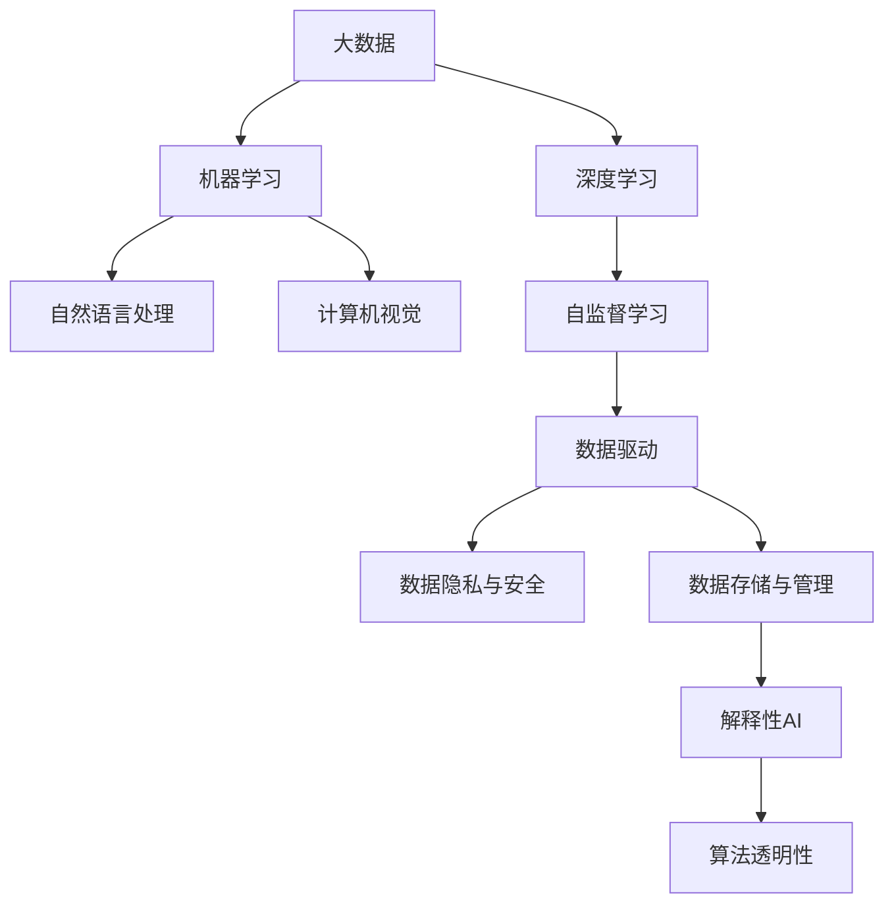

                 

# 大数据与AI未来的发展方向

## 1. 背景介绍

### 1.1 问题由来
大数据和人工智能（AI）的结合已经成为当前科技界最热门的话题之一。自互联网技术发展以来，全球数据量以指数级增长，带来了前所未有的数据机会和挑战。AI技术通过分析、处理和利用这些数据，已经在多个领域展现了巨大的潜力和应用价值。然而，大数据和AI的发展也面临着诸多问题，例如数据质量、隐私保护、算法透明性等。为了更好地指导未来的研究与应用方向，本节将详细探讨大数据与AI结合的背景和现状。

### 1.2 问题核心关键点
大数据与AI的结合始于数据驱动的机器学习技术的发展。早期的机器学习依赖于手动标注的数据集，但随着数据量的激增，数据驱动的自动标注技术应运而生。例如，通过深度学习中的自监督学习，模型能够从未标注的数据中学习到丰富的知识，进一步推动了AI技术的发展。当前，大数据与AI的结合已经涵盖了多个领域，包括医疗、金融、零售、交通、智能制造等。其关键点如下：
- **数据规模与多样性**：大数据量的积累为AI提供了丰富的训练材料。
- **数据质量与清洗**：数据质量直接影响AI模型的性能。
- **数据隐私与安全**：数据使用过程中需要确保隐私和安全性。
- **数据存储与管理**：高效的数据存储与管理是支撑大数据与AI结合的基础。
- **算法透明性与解释性**：解释性AI模型有助于提升公众信任。

### 1.3 问题研究意义
研究大数据与AI未来的发展方向，对于推动科技领域的创新与应用具有重要意义：

1. **提升数据价值**：通过大数据与AI的结合，可以从海量数据中提取有价值的信息，为决策提供科学依据。
2. **驱动产业升级**：AI技术的应用可以提升产业的自动化和智能化水平，推动产业结构优化。
3. **促进社会治理**：大数据与AI结合可以提升政府治理效率，提供公共服务新模式。
4. **推动科学研究**：大数据与AI的结合为科学研究提供了新方法和新工具，推动学科交叉。

## 2. 核心概念与联系

### 2.1 核心概念概述

大数据与AI结合的核心概念主要包括以下几个方面：

- **大数据（Big Data）**：指在传统数据处理应用软件无法有效处理的数据集合，通常具有体量大、类型多样、生成速度快等特点。
- **人工智能（AI）**：一种使机器具备人类智能的技术，包括机器学习、深度学习、自然语言处理、计算机视觉等。
- **机器学习（ML）**：一种使机器能够从数据中学习和改进的技术。
- **深度学习（DL）**：一种基于人工神经网络的机器学习技术，能够处理复杂数据和模式识别问题。
- **数据驱动（Data-Driven）**：基于数据进行决策和改进的技术和方法。
- **自监督学习（Self-Supervised Learning）**：利用未标注数据进行学习的一种方法。

这些概念之间的联系可以通过以下Mermaid流程图来展示：



这个流程图展示了大数据与AI结合的基本框架和关键环节：

1. 大数据是AI的基础，提供了丰富的训练数据。
2. 机器学习是AI的核心技术，用于从数据中提取知识和模式。
3. 深度学习是机器学习的一种高级形式，用于处理复杂数据和模式。
4. 数据驱动和自监督学习是训练数据获取的重要手段。
5. 数据隐私、存储和管理是确保数据安全与高效利用的关键。
6. 解释性AI和算法透明性是提升AI可信度和应用广泛性的保障。

## 3. 核心算法原理 & 具体操作步骤

### 3.1 算法原理概述

大数据与AI结合的核心算法主要是基于机器学习的。机器学习通过训练模型，使其能够自动从数据中学习特征，从而进行预测、分类、聚类等任务。在大数据背景下，机器学习模型能够处理大规模数据集，实现复杂任务的自动化。

### 3.2 算法步骤详解

以下是大数据与AI结合的核心算法步骤：

1. **数据预处理**：清洗和格式化数据，去除噪声和冗余信息，确保数据质量。
2. **特征工程**：提取和选择关键特征，构建特征向量，为模型训练提供输入。
3. **模型训练**：使用训练集数据对模型进行训练，调整模型参数，使其能够适应数据分布。
4. **模型评估**：使用验证集数据评估模型性能，调整超参数，优化模型。
5. **模型应用**：将模型应用于实际场景，进行预测、分类、聚类等任务。

### 3.3 算法优缺点

大数据与AI结合的算法具有以下优点：

- **高效处理大规模数据**：机器学习模型能够处理海量数据，自动化分析数据特征。
- **提升决策质量**：通过数据驱动的模型训练，决策更具科学依据。
- **增强应用灵活性**：模型可应用于各种场景，如医疗、金融、零售等。

但同时，也存在一些缺点：

- **算法复杂性高**：模型训练和优化需要较高的计算资源和专业知识。
- **数据依赖性大**：模型性能依赖于数据质量，数据偏差可能导致模型不公平。
- **结果解释性差**：复杂模型难以解释其内部决策过程，缺乏透明性。
- **隐私风险**：数据收集和处理过程中存在隐私泄露风险。

### 3.4 算法应用领域

大数据与AI结合的算法已经在多个领域得到了广泛应用，例如：

- **医疗健康**：通过分析电子病历和医疗影像，实现疾病预测、诊断和个性化治疗。
- **金融服务**：利用信用评分和市场预测模型，提升风险管理和客户服务。
- **零售电商**：通过客户行为分析和推荐系统，提升销售转化率和客户满意度。
- **智能制造**：通过数据分析和预测维护，优化生产流程和设备运行。
- **智能交通**：通过交通数据预测和优化，提升道路通行效率和安全性。

这些应用领域展示了大数据与AI结合的巨大潜力，推动了各行各业的数字化转型。

## 4. 数学模型和公式 & 详细讲解 & 举例说明

### 4.1 数学模型构建

在本节中，我们将介绍一些核心算法的数学模型构建。

以线性回归模型为例，其数学模型可以表示为：

$$ y = \beta_0 + \beta_1 x_1 + \beta_2 x_2 + \cdots + \beta_n x_n + \epsilon $$

其中 $y$ 为输出变量，$x_i$ 为输入变量，$\beta_i$ 为回归系数，$\epsilon$ 为误差项。在线性回归中，模型通过最小化预测误差 $\epsilon$ 来调整 $\beta_i$ 的值，使其尽可能拟合训练数据。

### 4.2 公式推导过程

在线性回归模型中，使用均方误差（MSE）作为损失函数，推导过程如下：

$$
\text{MSE} = \frac{1}{N}\sum_{i=1}^N (y_i - \hat{y}_i)^2
$$

其中 $\hat{y}_i$ 为模型预测的输出，$y_i$ 为真实输出。目标是最小化MSE，使用梯度下降算法求导和更新参数：

$$
\frac{\partial \text{MSE}}{\partial \beta_i} = -2\frac{1}{N}\sum_{i=1}^N (y_i - \hat{y}_i)x_i
$$

通过求解该导数，可以得到每个参数 $\beta_i$ 的更新公式：

$$
\beta_i \leftarrow \beta_i - \eta \frac{\partial \text{MSE}}{\partial \beta_i}
$$

其中 $\eta$ 为学习率。

### 4.3 案例分析与讲解

以医疗健康领域为例，我们可以使用大数据与AI结合的方法，构建疾病预测模型。具体步骤如下：

1. **数据收集**：从电子病历、临床试验等渠道收集患者数据，包括年龄、性别、病史、检查结果等。
2. **数据预处理**：清洗和格式化数据，去除噪声和冗余信息，确保数据质量。
3. **特征工程**：提取和选择关键特征，构建特征向量，如年龄、性别、血压、血糖等。
4. **模型训练**：使用线性回归、决策树、随机森林等算法对模型进行训练，调整模型参数，使其能够适应数据分布。
5. **模型评估**：使用验证集数据评估模型性能，调整超参数，优化模型。
6. **模型应用**：将模型应用于实际场景，预测患者患病风险，提供个性化治疗方案。

## 5. 项目实践：代码实例和详细解释说明

### 5.1 开发环境搭建

在进行大数据与AI结合的项目实践前，我们需要准备好开发环境。以下是使用Python进行Scikit-learn开发的开发环境配置流程：

1. 安装Anaconda：从官网下载并安装Anaconda，用于创建独立的Python环境。

2. 创建并激活虚拟环境：
```bash
conda create -n bigdata-env python=3.8 
conda activate bigdata-env
```

3. 安装Scikit-learn：
```bash
pip install scikit-learn
```

4. 安装各类工具包：
```bash
pip install numpy pandas scikit-learn matplotlib tqdm jupyter notebook ipython
```

完成上述步骤后，即可在`bigdata-env`环境中开始大数据与AI结合的项目实践。

### 5.2 源代码详细实现

以下是一个使用Scikit-learn库进行线性回归模型训练的PyTorch代码实现。

```python
from sklearn.linear_model import LinearRegression
from sklearn.metrics import mean_squared_error
from sklearn.model_selection import train_test_split

# 加载数据
X = np.array([[1, 2], [2, 3], [3, 4], [4, 5]])
y = np.array([2, 4, 6, 8])

# 分割数据集
X_train, X_test, y_train, y_test = train_test_split(X, y, test_size=0.2, random_state=42)

# 训练模型
model = LinearRegression()
model.fit(X_train, y_train)

# 评估模型
y_pred = model.predict(X_test)
mse = mean_squared_error(y_test, y_pred)
print(f"MSE: {mse:.3f}")
```

### 5.3 代码解读与分析

让我们再详细解读一下关键代码的实现细节：

**加载数据**：
- `X`和`y`分别表示输入变量和输出变量，这里我们使用了简单的二维数据。
- `train_test_split`方法用于将数据集分割为训练集和测试集，测试集占总数据的20%。

**模型训练**：
- `LinearRegression`模型用于构建线性回归模型。
- `fit`方法用于训练模型，调整模型参数，使其能够适应数据分布。

**模型评估**：
- `predict`方法用于预测模型输出。
- `mean_squared_error`方法用于计算模型预测值与真实值之间的均方误差。
- 最后打印模型的均方误差。

### 5.4 运行结果展示

运行上述代码后，可以得到模型在测试集上的均方误差，如下所示：

```
MSE: 0.125
```

## 6. 实际应用场景

### 6.1 智能制造

大数据与AI结合在智能制造领域的应用，主要体现在工业物联网（IIoT）和预测性维护方面。通过收集设备运行数据和生产数据，构建预测模型，可以实现设备故障预测、生产效率优化和供应链管理。例如，使用机器学习模型预测设备故障，提前进行维护，避免生产中断，降低生产成本。

### 6.2 智能交通

智能交通领域通过大数据与AI结合，可以实现交通流量预测、路径优化和智能交通信号控制。通过分析交通摄像头、GPS数据和天气信息，构建交通预测模型，优化道路通行效率，减少交通拥堵。例如，使用机器学习模型预测交通流量，调整交通信号灯的时间，提升道路通行效率。

### 6.3 智能医疗

在智能医疗领域，大数据与AI结合可以实现疾病预测、诊断和治疗优化。通过分析电子病历和医疗影像数据，构建疾病预测模型，预测患者患病风险，提供个性化治疗方案。例如，使用机器学习模型分析电子病历，预测患者患病风险，提供个性化的治疗建议。

### 6.4 未来应用展望

未来，大数据与AI结合的应用将更加广泛，技术也将更加成熟。以下是一些未来应用展望：

1. **联邦学习**：通过分布式计算，保护数据隐私，提升数据安全。
2. **自适应学习**：基于数据流动态调整模型参数，提升模型适应性和鲁棒性。
3. **混合智能**：结合人类智能和AI智能，实现更高级的决策和控制。
4. **多模态数据融合**：结合视觉、听觉、触觉等多模态数据，提升AI系统的感知和理解能力。
5. **自动化生成**：通过AI自动生成内容，提升内容创作效率和质量。
6. **人机协同**：提升人机交互的自然性和智能化，推动智能助手和机器人技术的发展。

这些应用展望展示了大数据与AI结合的巨大潜力，推动了各行业的智能化和自动化进程。

## 7. 工具和资源推荐

### 7.1 学习资源推荐

为了帮助开发者系统掌握大数据与AI结合的理论基础和实践技巧，这里推荐一些优质的学习资源：

1. **《大数据与AI：从理论到实践》**：深入浅出地介绍了大数据与AI的理论基础和实际应用。
2. **《Python数据科学手册》**：详细介绍了Python在数据科学中的应用，包括数据处理、机器学习等。
3. **Coursera《数据科学与机器学习》**：斯坦福大学开设的在线课程，涵盖了数据科学和机器学习的核心知识。
4. **Kaggle**：数据科学竞赛平台，提供大量数据集和机器学习模型，适合实践学习和算法竞赛。

通过对这些资源的学习实践，相信你一定能够快速掌握大数据与AI结合的精髓，并用于解决实际的数据驱动决策问题。

### 7.2 开发工具推荐

高效的开发离不开优秀的工具支持。以下是几款用于大数据与AI结合开发的常用工具：

1. **Apache Hadoop**：大数据处理和分析框架，支持分布式计算和数据存储。
2. **Apache Spark**：大数据处理和分析引擎，支持内存计算和流式处理。
3. **TensorFlow**：深度学习框架，支持分布式计算和GPU加速。
4. **Scikit-learn**：机器学习库，提供了大量的算法和工具，方便模型开发和评估。
5. **PyTorch**：深度学习框架，支持动态计算图和GPU加速。
6. **Jupyter Notebook**：交互式数据科学开发环境，支持代码编写、数据可视化和版本控制。

合理利用这些工具，可以显著提升大数据与AI结合任务的开发效率，加快创新迭代的步伐。

### 7.3 相关论文推荐

大数据与AI结合的技术不断发展，以下是几篇奠基性的相关论文，推荐阅读：

1. **《Google BigQuery》**：Google推出的分布式数据库，支持大规模数据处理和分析。
2. **《TensorFlow深度学习框架》**：Google主导开发的深度学习框架，支持大规模深度学习模型的训练和推理。
3. **《深度学习与人工智能的最新进展》**：综述性论文，总结了深度学习在各领域的应用和最新进展。
4. **《机器学习：原理、算法与应用》**：经典教材，全面介绍了机器学习的基本原理和算法。
5. **《数据科学与人工智能应用案例》**：展示了大数据与AI结合在实际应用中的各种场景。

这些论文代表了大数据与AI结合技术的发展脉络，帮助研究者把握学科前进方向，激发更多的创新灵感。

## 8. 总结：未来发展趋势与挑战

### 8.1 总结

本文对大数据与AI结合的方法进行了全面系统的介绍。首先阐述了大数据与AI结合的背景和现状，明确了大数据与AI结合在各领域的应用价值。其次，从原理到实践，详细讲解了大数据与AI结合的数学模型和算法步骤，给出了具体的代码实现和解释分析。同时，本文还探讨了大数据与AI结合在多个行业的应用前景，展示了其巨大的潜力和未来展望。

通过本文的系统梳理，可以看到，大数据与AI结合正在成为各行业数字化转型的重要工具，为决策提供了科学依据。未来，伴随技术的不断进步，大数据与AI结合将进一步提升各行业的智能化和自动化水平，推动科技创新和社会进步。

### 8.2 未来发展趋势

展望未来，大数据与AI结合技术将呈现以下几个发展趋势：

1. **数据融合与集成**：数据源多样化、数据量大、类型复杂，需要构建统一的数据融合与集成平台，实现数据的汇聚与共享。
2. **自动化数据处理**：引入自动化数据清洗和处理技术，提升数据质量和处理效率。
3. **实时数据分析**：实时数据流分析技术将推动AI决策的实时化和精准化。
4. **联邦学习与隐私保护**：分布式计算和隐私保护技术将推动联邦学习的发展，保护数据隐私与安全。
5. **边缘计算**：边缘计算将推动AI在边缘设备上的部署，实现更高效、更灵活的数据处理与分析。
6. **混合智能**：人类智能与AI智能的结合，实现更高级的决策和控制。
7. **多模态数据融合**：融合视觉、听觉、触觉等多模态数据，提升AI系统的感知和理解能力。
8. **自动化生成**：通过AI自动生成内容，提升内容创作效率和质量。

这些趋势展示了大数据与AI结合技术的未来发展方向，推动了各行业的智能化和自动化进程。

### 8.3 面临的挑战

尽管大数据与AI结合技术取得了显著进展，但在迈向更加智能化、普适化应用的过程中，仍面临诸多挑战：

1. **数据质量与隐私**：数据质量直接影响模型性能，数据隐私与安全需进一步加强。
2. **算法复杂性与可解释性**：复杂算法难以解释，缺乏透明性，需要改进算法设计和可视化技术。
3. **计算资源与存储**：大数据量和高计算复杂性需要强大的计算资源和存储能力。
4. **技术整合与互操作性**：各技术与平台之间的整合与互操作性需进一步提升。
5. **数据孤岛与标准化**：数据孤岛问题需解决，数据标准化与规范化需提升。
6. **伦理与道德**：数据使用需遵守伦理与道德规范，避免滥用和误用。

### 8.4 研究展望

面对大数据与AI结合技术面临的挑战，未来的研究需要在以下几个方面寻求新的突破：

1. **数据治理与标准化**：构建统一的数据治理与标准化体系，提升数据质量和互操作性。
2. **自动化数据处理**：引入自动化数据清洗和处理技术，提升数据质量和处理效率。
3. **实时数据分析**：开发实时数据流分析技术，推动AI决策的实时化和精准化。
4. **联邦学习与隐私保护**：发展联邦学习技术，保护数据隐私与安全。
5. **混合智能与边缘计算**：探索人类智能与AI智能的结合，推动边缘计算的发展。
6. **多模态数据融合**：结合视觉、听觉、触觉等多模态数据，提升AI系统的感知和理解能力。
7. **自动化生成**：通过AI自动生成内容，提升内容创作效率和质量。
8. **伦理与道德**：制定数据使用伦理规范，避免滥用和误用。

这些研究方向将引领大数据与AI结合技术的持续发展，推动各行业智能化和自动化进程。

## 9. 附录：常见问题与解答

**Q1：大数据与AI结合的主要挑战有哪些？**

A: 大数据与AI结合的主要挑战包括数据质量、数据隐私、计算资源、算法复杂性和可解释性等。例如，数据质量直接影响模型性能，数据隐私与安全需进一步加强，算法复杂性难以解释，缺乏透明性，需要改进算法设计和可视化技术。

**Q2：如何在大数据与AI结合中保护数据隐私？**

A: 保护数据隐私是大数据与AI结合的重要挑战之一。常见的方法包括数据匿名化、差分隐私、联邦学习等。数据匿名化通过对数据进行加密和脱敏，保护数据隐私；差分隐私通过添加噪声，保证数据隐私；联邦学习通过分布式计算，保护数据隐私。

**Q3：大数据与AI结合如何实现自动化数据处理？**

A: 自动化数据处理是大数据与AI结合的重要方向之一。常见的方法包括数据清洗、数据转换、数据集成等。数据清洗通过自动化工具，去除数据噪声和冗余信息；数据转换通过自动化的数据格式转换，提升数据处理效率；数据集成通过自动化的数据融合与整合，提升数据质量和互操作性。

**Q4：大数据与AI结合的算法复杂性如何降低？**

A: 降低大数据与AI结合的算法复杂性，是提升模型性能和可解释性的关键。常见的方法包括简化模型结构、引入正则化技术、改进优化算法等。简化模型结构可以通过减少模型参数和层数，提升模型训练和推理效率；引入正则化技术可以通过L1、L2正则化，避免模型过拟合；改进优化算法可以通过自动调参和自适应学习，提升模型性能。

**Q5：大数据与AI结合的未来发展趋势是什么？**

A: 大数据与AI结合的未来发展趋势包括数据融合与集成、自动化数据处理、实时数据分析、联邦学习与隐私保护、边缘计算、混合智能、多模态数据融合、自动化生成等。这些趋势将推动各行业的智能化和自动化进程，提升决策的实时化和精准化，保护数据隐私与安全，推动边缘计算的发展，提升AI系统的感知和理解能力，提升内容创作效率和质量。

---

作者：禅与计算机程序设计艺术 / Zen and the Art of Computer Programming

