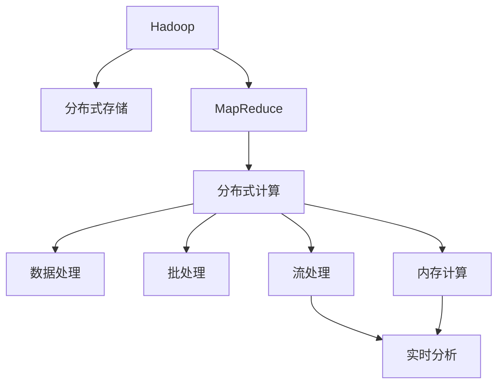

                 

# 大数据分析：Hadoop 和 Spark

## 1. 背景介绍

### 1.1 问题由来

随着互联网和移动互联网的普及，全球数据量呈爆炸式增长。面对海量、异构、实时的大数据，传统的数据处理方式（如SQL、关系型数据库）已经难以满足需求。在这种情况下，大数据分析（Big Data Analytics）应运而生，成为了解决这一问题的有力工具。

大数据分析通常涉及三个关键技术栈：数据存储（如Hadoop）、数据处理（如Spark）和数据可视化（如Tableau）。其中，Hadoop和Spark是最核心的两个数据处理引擎，支持大规模数据的存储和处理。

### 1.2 问题核心关键点

大数据分析的核心理念是“数据即洞察力”。Hadoop和Spark正是实现这一理念的两个主要平台，它们能够高效、可扩展地处理海量数据，提供了强大的数据分析和计算能力。

Hadoop由Apache基金会开源，最初由Google的大数据处理系统MapReduce演化而来。Hadoop通过分布式存储和处理数据，提供了强大的容错性和可扩展性，是大规模数据存储和处理的理想选择。

Spark则是由UC Berkeley的AMPLab开源，基于内存计算，可以在处理海量数据时大幅提升效率，尤其适合迭代算法和大规模数据处理。

本文将详细介绍Hadoop和Spark的核心概念、原理及操作流程，帮助读者理解这两个大数据分析平台的实际应用，并展望其未来的发展方向。

## 2. 核心概念与联系

### 2.1 核心概念概述

为更好地理解Hadoop和Spark的核心概念，本节将介绍几个密切相关的核心概念：

- **Hadoop**：由Apache基金会开源的大数据处理平台，包含HDFS分布式文件系统和MapReduce分布式计算框架。通过Hadoop，可以将海量数据分布在集群中，高效存储和处理。

- **Spark**：由Apache基金会开源的快速内存计算系统，基于内存计算和分布式计算框架RDD（Resilient Distributed Dataset）。Spark支持多种计算模式，包括批处理、流处理和机器学习等，适合大规模数据集的处理。

- **分布式计算**：利用集群中的多台计算机共同完成计算任务，以提升计算效率和处理能力。

- **批处理（Batch Processing）**：指将大量数据一次性读入内存，然后进行批量处理和分析的方法。

- **流处理（Stream Processing）**：指实时读取数据流，进行实时分析和处理的方法。

- **内存计算（In-Memory Computing）**：利用内存的快速读写特性，进行高效的数据处理。

这些核心概念之间的逻辑关系可以通过以下Mermaid流程图来展示：



这个流程图展示了Hadoop和Spark的核心概念及其之间的关系：

1. Hadoop提供了分布式文件系统（HDFS）和MapReduce框架，用于分布式存储和处理数据。
2. Spark在此基础上，引入内存计算和RDD模型，进一步提升数据处理效率。
3. 批处理、流处理和内存计算等都是Spark支持的计算模式。

这些概念共同构成了大数据分析的计算框架，使得Hadoop和Spark能够高效、可扩展地处理海量数据，支持复杂的分析和计算任务。

## 3. 核心算法原理 & 具体操作步骤
### 3.1 算法原理概述

Hadoop和Spark的核心算法原理主要基于分布式计算和内存计算，通过多台计算机并行处理数据，提升计算效率和处理能力。

Hadoop的核心组件HDFS和MapReduce分别负责数据存储和数据处理：

- **HDFS**：分布式文件系统，用于存储海量数据。将数据分布在集群中的多台计算机上，确保数据的可靠性和高可用性。

- **MapReduce**：分布式计算框架，用于处理大规模数据集。通过Map和Reduce两个步骤，实现分布式并行计算，处理海量数据。

Spark的RDD模型则进一步提升了数据处理效率，支持内存计算：

- **RDD**：弹性分布式数据集，是Spark中的核心数据结构。支持数据的弹性分布和可扩展性，基于内存计算，进一步提升数据处理效率。

Spark支持多种计算模式，包括批处理、流处理和内存计算等，这些计算模式都是基于RDD模型的。

### 3.2 算法步骤详解

Hadoop和Spark的具体操作步骤如下：

#### Hadoop操作步骤

**Step 1: 数据存储**

1. 部署Hadoop集群，确保HDFS正常运行。
2. 将数据上传到HDFS中，确保数据可靠分布。

**Step 2: MapReduce计算**

1. 编写MapReduce程序，定义Map和Reduce函数。
2. 使用Hadoop的命令工具（如Hadoop jar）提交计算任务。
3. 等待计算任务完成后，通过Hadoop的命令工具获取计算结果。

#### Spark操作步骤

**Step 1: 数据存储**

1. 部署Spark集群，确保Hadoop正常运行。
2. 将数据上传到HDFS中，确保数据可靠分布。

**Step 2: Spark计算**

1. 编写Spark程序，定义RDD和转换函数。
2. 使用Spark的命令工具（如spark-submit）提交计算任务。
3. 等待计算任务完成后，通过Spark的命令工具获取计算结果。

### 3.3 算法优缺点

Hadoop和Spark作为大数据处理平台，各有优缺点：

- **Hadoop优点**：
  - 强大的容错性和可扩展性，适合大规模数据存储和处理。
  - 成熟的生态系统，支持多种数据处理工具和应用。

- **Hadoop缺点**：
  - 处理速度较慢，不适合实时数据处理。
  - 对于迭代计算和大数据集的处理效率较低。

- **Spark优点**：
  - 内存计算和快速迭代计算，适合大规模数据集的处理。
  - 支持多种计算模式，如批处理、流处理和机器学习等。

- **Spark缺点**：
  - 内存消耗较大，对于大规模数据集的处理需要较高的内存配置。
  - 容错性相对较低，需要考虑数据的冗余和备份。

### 3.4 算法应用领域

Hadoop和Spark广泛应用于各种大数据应用场景，例如：

- **数据仓库**：用于存储和管理企业历史数据，支持大数据分析和管理。
- **实时数据流处理**：通过Spark Streaming处理实时数据流，支持实时分析和监控。
- **机器学习**：利用Spark的MLlib库，进行大规模机器学习模型的训练和预测。
- **大规模数据处理**：通过Hadoop和Spark处理大规模数据集，支持大数据分析任务。
- **社交网络分析**：通过Hadoop和Spark进行社交网络数据的存储和分析，支持社交网络建模和预测。

除了这些经典应用外，Hadoop和Spark还被广泛应用到更多领域中，如金融风险管理、医疗数据分析、交通流量监控等，为各行各业带来了巨大的价值。

## 4. 数学模型和公式 & 详细讲解 & 举例说明

### 4.1 数学模型构建

本节将使用数学语言对Hadoop和Spark的核心算法进行更加严格的刻画。

假设Hadoop集群中有n台计算机，每台计算机的内存大小为m，数据集大小为D。数据集被划分为n个分片，每个分片的大小为D/n。

**Hadoop数据存储模型**：

- **HDFS数据存储**：每个分片被存储在集群中的某台计算机上，确保数据的可靠性和高可用性。
- **MapReduce计算模型**：通过Map和Reduce两个步骤，实现分布式并行计算。

**Spark数据处理模型**：

- **RDD数据处理**：将数据集分为多个弹性分布式数据集（RDD），每个RDD的大小为D/n。
- **内存计算**：将RDD存储在内存中，提升数据处理效率。

### 4.2 公式推导过程

以下我们以Spark中的RDD计算为例，推导RDD的计算公式及其时间复杂度。

假设输入数据集大小为D，将其分为n个RDD，每个RDD大小为D/n。Spark的计算过程包括以下几个步骤：

1. 将数据集输入到RDD中，数据量变为D/n。
2. 对RDD进行map操作，每个RDD生成新的RDD，数据量不变。
3. 对新的RDD进行reduce操作，数据量变为D/n。
4. 对新的RDD进行map操作，生成最终结果，数据量不变。

假设每个RDD的map和reduce操作的时间复杂度为O(D)，则Spark的计算时间复杂度为：

$$
T = O(n) \times O(D) \times O(D/n) \times O(D/n) = O(nD)
$$

可以看出，Spark的计算时间复杂度为O(nD)，比Hadoop的O(nD/n)更快。

### 4.3 案例分析与讲解

以下是一个Hadoop和Spark的实际案例分析，展示它们在大数据处理中的具体应用：

**案例：企业客户数据分析**

某电商公司拥有海量客户数据，包括客户基本信息、购买记录和行为数据等。公司希望通过数据分析，了解客户购买行为和偏好，优化产品推荐策略。

**Hadoop操作流程**：

1. 将客户数据上传到HDFS中，确保数据可靠分布。
2. 使用Hadoop MapReduce程序，统计客户购买记录和行为数据，生成客户画像。
3. 使用Hadoop Hive进行数据挖掘和分析，生成报告。

**Spark操作流程**：

1. 将客户数据上传到HDFS中，确保数据可靠分布。
2. 使用Spark RDD程序，进行数据清洗和预处理，生成客户画像。
3. 使用Spark MLlib库进行机器学习，生成客户推荐模型。
4. 使用Spark GraphX库进行客户关系图建模，优化产品推荐策略。

可以看出，Spark在数据处理和机器学习方面具有优势，能够高效地处理大数据集，并提供强大的计算和分析能力。

## 5. 项目实践：代码实例和详细解释说明
### 5.1 开发环境搭建

在进行Hadoop和Spark的实践前，我们需要准备好开发环境。以下是使用Python进行PySpark开发的環境配置流程：

1. 安装Anaconda：从官网下载并安装Anaconda，用于创建独立的Python环境。

2. 创建并激活虚拟环境：
```bash
conda create -n spark-env python=3.8 
conda activate spark-env
```

3. 安装PySpark：根据CUDA版本，从官网获取对应的安装命令。例如：
```bash
conda install pyspark pyspark=3.2.2 -c conda-forge
```

4. 安装相关库：
```bash
pip install pyspark-sql pyspark-notebook
```

5. 安装Jupyter Notebook：
```bash
pip install jupyter notebook
```

完成上述步骤后，即可在`spark-env`环境中开始Spark的开发实践。

### 5.2 源代码详细实现

这里我们以Spark中的RDD计算为例，给出使用PySpark对RDD进行基本操作的Python代码实现。

首先，导入PySpark库和数据集：

```python
from pyspark.sql import SparkSession
from pyspark.sql.functions import col

spark = SparkSession.builder.appName('SparkRDD').getOrCreate()

# 创建RDD
data = spark.sparkContext.parallelize([1, 2, 3, 4, 5, 6, 7, 8, 9, 10])
rdd = data.rdd

# 基本操作
def add(a, b):
    return a + b

def sub(a, b):
    return a - b

rdd.map(add).show()
rdd.map(sub).show()
```

然后，定义RDD的转换和操作函数：

```python
def filter(f):
    return rdd.filter(lambda x: f(x))

def reduce(f):
    return rdd.reduce(lambda x, y: f(x, y))

def mapByKey(f):
    return rdd.mapValues(f)

def groupByKey():
    return rdd.groupByKey()

def join(r):
    return rdd.join(r)

def cartesian(r):
    return rdd.cartesian(r)
```

最后，进行RDD的具体操作：

```python
# 基本操作
rdd.map(add).show()
rdd.map(sub).show()

# 转换操作
filter(lambda x: x > 5).show()
reduce(lambda x, y: x + y).show()

# 操作函数
mapByKey(lambda x: x * 2).show()
groupByKey().show()

# 联合操作
join(rdd).show()
cartesian(rdd).show()
```

可以看到，通过PySpark的RDD操作，可以很方便地进行数据处理和分析，支持多种数据转换和操作函数。

### 5.3 代码解读与分析

让我们再详细解读一下关键代码的实现细节：

**RDD初始化**：
- `parallelize`方法：将数据集转换为RDD，并将数据分配到集群中的多台计算机上，确保数据的可靠性和高可用性。

**RDD基本操作**：
- `map`方法：对RDD中的每个元素进行map操作，返回新的RDD。
- `filter`方法：根据条件过滤RDD中的元素，返回新的RDD。
- `reduce`方法：对RDD中的元素进行reduce操作，返回单一结果。

**RDD转换操作**：
- `mapByKey`方法：对RDD中的每个键进行map操作，返回新的RDD。
- `groupByKey`方法：根据键进行分组，返回新的RDD。

**RDD联合操作**：
- `join`方法：将两个RDD按照键进行联合，返回新的RDD。
- `cartesian`方法：将两个RDD进行笛卡尔积，返回新的RDD。

可以看到，通过PySpark的RDD操作，可以很方便地进行数据处理和分析，支持多种数据转换和操作函数。开发者可以将更多精力放在数据处理和模型构建上，而不必过多关注底层的实现细节。

当然，工业级的系统实现还需考虑更多因素，如集群管理、任务调度、资源优化等。但核心的Spark算法基本与此类似。

## 6. 实际应用场景
### 6.1 智能推荐系统

智能推荐系统是大数据分析的重要应用场景之一。通过分析用户的行为数据和兴趣偏好，推荐系统可以为用户提供个性化的产品或服务，提升用户体验和满意度。

Spark在此基础上，提供了丰富的机器学习库，支持多种推荐算法的实现。例如，通过协同过滤算法、基于内容的推荐算法等，实现用户推荐和商品推荐。Spark的流处理和内存计算特性，还可以支持实时推荐和动态推荐，进一步提升推荐效果。

### 6.2 金融风险管理

金融行业需要实时监控市场风险，避免资金损失。通过Hadoop和Spark的大数据处理能力，金融公司可以实时收集和分析交易数据、市场数据、新闻数据等，预测市场趋势和风险点，及时采取应对措施。

Hadoop的分布式存储和MapReduce计算能力，可以高效处理海量金融数据，支持复杂的风险分析模型。Spark的流处理和内存计算特性，还可以支持实时风险监控和动态风险预警，提升金融公司的风险管理水平。

### 6.3 医疗数据分析

医疗数据分析是大数据应用的重要方向之一。通过Hadoop和Spark的大数据处理能力，医疗机构可以高效处理海量医疗数据，支持医疗数据的存储和分析。例如，通过分析患者的病历数据、基因数据、影像数据等，发现潜在的疾病风险，提升医疗服务质量。

Hadoop的分布式存储和MapReduce计算能力，可以高效处理医疗数据，支持复杂的医疗数据分析模型。Spark的流处理和内存计算特性，还可以支持实时医疗数据分析和动态决策支持，提升医疗机构的运营效率和诊断水平。

### 6.4 未来应用展望

随着Hadoop和Spark的不断发展，它们的应用前景将会更加广阔：

- **多云环境**：Hadoop和Spark可以支持多种云平台，提升跨云数据管理和处理能力。例如，支持AWS、Google Cloud、Azure等云平台的分布式存储和计算。
- **边缘计算**：通过边缘计算技术，可以在数据源附近进行实时数据处理和分析，提升数据处理效率和实时性。例如，在物联网设备上进行实时数据分析和预测。
- **混合数据处理**：Hadoop和Spark可以支持多种数据格式和数据源的处理，支持混合数据处理能力。例如，支持SQL数据库、NoSQL数据库、大数据源等。
- **大数据可视化**：通过Hadoop和Spark与数据可视化工具（如Tableau、Power BI等）的结合，可以实现数据的可视化展示和分析，提升数据洞察力。
- **数据安全与隐私**：Hadoop和Spark可以支持数据加密和数据隐私保护，确保数据的安全性和隐私性。例如，支持数据加密传输、数据脱敏、数据审计等。

以上应用前景展示了Hadoop和Spark在大数据处理和分析中的巨大潜力，相信未来它们将在更多领域发挥更大的作用。

## 7. 工具和资源推荐
### 7.1 学习资源推荐

为了帮助开发者系统掌握Hadoop和Spark的理论基础和实践技巧，这里推荐一些优质的学习资源：

1. **《Hadoop：实战大数据技术》**：详细介绍了Hadoop的分布式存储和MapReduce计算能力，适合初学者入门。

2. **《Spark实战：快速掌握大数据处理》**：介绍了Spark的核心概念和实现方法，适合进阶学习。

3. **Hadoop和Spark官方文档**：详细介绍了Hadoop和Spark的API接口和使用方法，是学习的必备资料。

4. **Hadoop和Spark在线课程**：如Coursera、Udemy等平台上的课程，适合系统学习。

5. **《大数据技术与应用》**：介绍了大数据技术的基本概念和应用，适合对大数据技术感兴趣的学习者。

通过对这些资源的学习实践，相信你一定能够快速掌握Hadoop和Spark的精髓，并用于解决实际的业务问题。

### 7.2 开发工具推荐

高效的开发离不开优秀的工具支持。以下是几款用于Hadoop和Spark开发的工具：

1. **Jupyter Notebook**：开源的交互式开发工具，支持Python、Scala等多种语言，方便开发者进行交互式开发和调试。

2. **PySpark**：Python接口的Spark，方便开发者使用Python进行Spark开发。

3. **Hadoop Command Line Interface (CLI)**：Hadoop的命令行工具，支持HDFS和MapReduce计算任务。

4. **Spark Shell**：Spark的交互式开发工具，方便开发者进行交互式开发和调试。

5. **Databricks**：商业化的Spark开发平台，提供一站式大数据开发和管理解决方案，支持Hadoop和Spark的协同开发。

合理利用这些工具，可以显著提升Hadoop和Spark的开发效率，加快创新迭代的步伐。

### 7.3 相关论文推荐

Hadoop和Spark的研究源于学界的持续研究。以下是几篇奠基性的相关论文，推荐阅读：

1. **《MapReduce: Simplified Data Processing on Large Clusters》**：介绍了MapReduce计算框架的基本思想和实现方法。

2. **《RDD: Resilient Distributed Datasets: A Fault-Tolerant Abstraction for In-Memory Parallel and Distributed Data Processing》**：介绍了弹性分布式数据集（RDD）的基本概念和实现方法。

3. **《Spark: Cluster Computing with Working Sets》**：介绍了Spark的核心算法和实现方法。

4. **《SparkSQL: SQL and DataFrames》**：介绍了Spark SQL和DataFrame的基本概念和实现方法。

5. **《Hadoop: The Underlying Infrastructure》**：介绍了Hadoop的分布式存储和计算能力。

这些论文代表了大数据处理平台的研究进展，通过学习这些前沿成果，可以帮助研究者把握学科前进方向，激发更多的创新灵感。

## 8. 总结：未来发展趋势与挑战
### 8.1 总结

本文对Hadoop和Spark的核心概念、算法原理及操作步骤进行了全面系统的介绍。首先阐述了Hadoop和Spark的研究背景和意义，明确了它们在大数据处理中的独特价值。其次，从原理到实践，详细讲解了Hadoop和Spark的数学模型和核心算法，给出了代码实例和详细解释说明。同时，本文还广泛探讨了Hadoop和Spark在各种行业领域的应用前景，展示了它们在大数据处理中的巨大潜力。

通过本文的系统梳理，可以看到，Hadoop和Spark在大数据处理和分析中的重要作用，为大规模数据存储和处理提供了强大的平台支持。未来，伴随技术的发展，Hadoop和Spark必将在更多领域发挥更大的作用，为各行各业带来更大的价值。

### 8.2 未来发展趋势

展望未来，Hadoop和Spark的发展趋势将呈现以下几个方向：

- **容器化与云原生**：Hadoop和Spark可以与Kubernetes等容器化技术结合，提升数据处理和计算的弹性化和自动化。同时支持云原生架构，提升云计算环境的效率和性能。
- **混合数据处理**：Hadoop和Spark可以支持多种数据格式和数据源的处理，支持混合数据处理能力。例如，支持SQL数据库、NoSQL数据库、大数据源等。
- **边缘计算与实时数据处理**：通过边缘计算技术，可以在数据源附近进行实时数据处理和分析，提升数据处理效率和实时性。例如，在物联网设备上进行实时数据分析和预测。
- **数据安全与隐私**：Hadoop和Spark可以支持数据加密和数据隐私保护，确保数据的安全性和隐私性。例如，支持数据加密传输、数据脱敏、数据审计等。
- **人工智能与机器学习**：Hadoop和Spark可以与机器学习算法结合，支持数据驱动的智能决策和预测。例如，通过Spark MLlib库，实现复杂的机器学习模型。

以上趋势凸显了Hadoop和Spark在大数据处理和分析中的广阔前景，相信未来它们将在更多领域发挥更大的作用。

### 8.3 面临的挑战

尽管Hadoop和Spark在大数据处理和分析中已经取得了瞩目成就，但在迈向更加智能化、普适化应用的过程中，它们仍面临着诸多挑战：

- **数据质量与一致性**：大数据处理对数据质量和一致性要求较高，数据源的多样性和复杂性可能导致数据不一致和数据质量问题。
- **性能与效率**：Hadoop和Spark在大数据处理过程中，需要处理海量数据，对计算资源和网络带宽要求较高，性能和效率问题仍需进一步优化。
- **可扩展性与容错性**：随着数据量的不断增长，Hadoop和Spark需要保证系统的可扩展性和容错性，避免系统崩溃和数据丢失。
- **数据安全与隐私**：大数据处理对数据隐私和安全要求较高，数据泄露和数据篡改问题仍需进一步防范。
- **用户体验与交互性**：大数据处理需要提供良好的用户体验和交互性，避免复杂的操作和复杂的接口设计。

正视Hadoop和Spark面临的这些挑战，积极应对并寻求突破，将是大数据处理和分析迈向成熟的必由之路。相信随着学界和产业界的共同努力，这些挑战终将一一被克服，Hadoop和Spark必将在构建人机协同的智能时代中扮演越来越重要的角色。

### 8.4 研究展望

面对Hadoop和Spark面临的挑战，未来的研究需要在以下几个方面寻求新的突破：

- **优化数据质量和一致性**：通过数据清洗和数据转换，提升数据质量和一致性，确保数据的可靠性和准确性。
- **提升性能与效率**：优化计算资源和网络带宽的使用，提升大数据处理和计算的性能和效率。例如，采用混合计算和缓存技术，提升数据处理速度。
- **增强可扩展性与容错性**：通过分布式计算和容错技术，增强系统的可扩展性和容错性，确保系统稳定运行。例如，采用Hadoop和Spark的高可用性配置，提升系统的可靠性。
- **保障数据安全与隐私**：通过数据加密和数据隐私保护技术，保障数据的安全性和隐私性，避免数据泄露和数据篡改。例如，采用数据脱敏和数据审计技术，确保数据的安全性。
- **提升用户体验与交互性**：通过界面设计和交互优化，提升大数据处理的用户体验和交互性，避免复杂的操作和复杂的接口设计。例如，采用交互式开发工具和可视化技术，提升用户的使用体验。

这些研究方向的探索，必将引领Hadoop和Spark技术迈向更高的台阶，为构建安全、可靠、可扩展、高性能的大数据处理和分析系统铺平道路。面向未来，Hadoop和Spark需要与其他大数据技术进行更深入的融合，如Kafka、Hive、HBase等，共同推动大数据处理和分析的进步。只有勇于创新、敢于突破，才能不断拓展大数据处理和分析的边界，让大数据技术更好地服务于各行各业。

## 9. 附录：常见问题与解答

**Q1：Hadoop和Spark的区别是什么？**

A: Hadoop和Spark都是大数据处理平台，但它们的核心理念和计算模型不同。

- **Hadoop**：基于分布式文件系统和MapReduce计算框架，适合大规模数据的存储和处理。
- **Spark**：基于内存计算和弹性分布式数据集（RDD），适合大规模数据的迭代处理和实时计算。

**Q2：如何选择合适的Hadoop和Spark配置？**

A: 选择合适的Hadoop和Spark配置，需要考虑以下几个因素：

- **数据规模**：大数据处理的规模和类型，例如大规模批处理、实时流处理等。
- **计算资源**：集群中的计算资源和网络带宽，例如CPU、内存、磁盘等。
- **任务需求**：任务的特点和需求，例如迭代计算、流处理、机器学习等。
- **部署环境**：部署环境的复杂度和稳定性，例如云平台、本地环境等。

根据实际需求，选择合适的配置，可以提升Hadoop和Spark的性能和效率。

**Q3：如何优化Hadoop和Spark的性能？**

A: 优化Hadoop和Spark的性能，可以从以下几个方面入手：

- **数据分区**：合理划分数据分区，避免数据倾斜和数据重复，提升数据处理效率。
- **数据压缩**：对数据进行压缩，减少数据存储和传输的体积，提升数据处理速度。
- **数据本地化**：将数据尽量分配到本地磁盘或本地节点，减少网络传输的开销，提升数据处理效率。
- **内存优化**：合理配置内存使用，避免内存溢出和内存碎片，提升内存利用率。
- **并行度优化**：合理配置任务并行度，避免任务阻塞和任务等待，提升并行计算效率。

这些优化方法可以提升Hadoop和Spark的性能，确保系统稳定运行。

**Q4：如何使用Hadoop和Spark进行数据清洗和预处理？**

A: 数据清洗和预处理是大数据处理的重要环节，可以使用Hadoop和Spark进行以下操作：

- **数据格式转换**：使用Hadoop和Spark的API，将不同格式的数据转换为统一的格式，方便后续处理。
- **数据去重和去噪**：使用Hadoop和Spark的API，去除重复数据和噪声数据，提升数据质量。
- **数据归一化**：使用Hadoop和Spark的API，对数据进行归一化处理，避免数据不一致和数据偏置。
- **数据分词和特征提取**：使用Hadoop和Spark的API，对文本数据进行分词和特征提取，方便后续机器学习模型训练。

这些操作可以提升数据的可靠性和一致性，为后续分析提供良好的基础。

**Q5：如何使用Hadoop和Spark进行机器学习模型训练？**

A: 使用Hadoop和Spark进行机器学习模型训练，可以使用Spark的MLlib库，支持多种机器学习算法的实现。例如，可以使用协同过滤算法、基于内容的推荐算法、深度学习算法等。

具体流程如下：

- **数据准备**：将数据集分为训练集和测试集，并进行数据清洗和预处理。
- **模型训练**：使用MLlib库中的API，加载模型、定义模型参数和训练算法，训练机器学习模型。
- **模型评估**：使用测试集对模型进行评估，计算模型的精度、召回率和F1值等指标，评估模型的效果。
- **模型优化**：根据评估结果，调整模型参数和算法，优化模型效果。

这些操作可以提升机器学习模型的精度和泛化能力，为后续应用提供良好的基础。

---

作者：禅与计算机程序设计艺术 / Zen and the Art of Computer Programming

