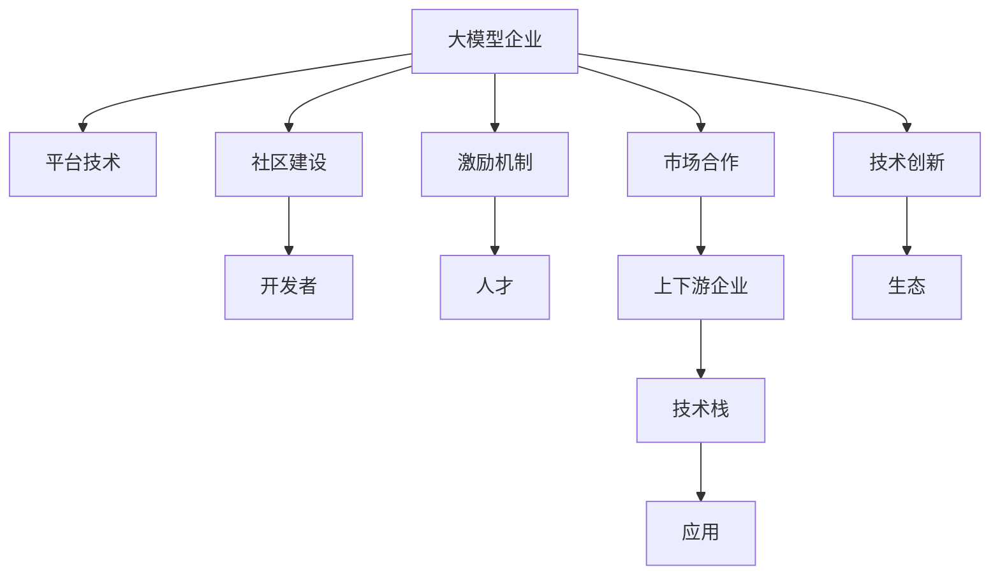

                 

## 1. 背景介绍

### 1.1 问题由来
进入21世纪以来，人工智能（AI）技术呈现出爆发式增长态势，其中深度学习（DL）技术尤为显著。AI在各个行业的应用场景中，如医疗、金融、教育、工业制造等，均取得了显著成效。然而，这些成果的取得离不开大模型的驱动，如BERT、GPT、T5等预训练语言模型。

大模型企业在AI生态系统中扮演了举足轻重的角色，不仅拥有强大的数据与计算能力，还具备强大的技术研发实力和市场资源。这些企业凭借其技术优势，构建起庞大的开发者生态，在推动AI技术的创新与应用中发挥着不可或缺的作用。

### 1.2 问题核心关键点
本文旨在探讨大模型企业如何构建和维护一个健康、有活力的开发者生态。一个良好的开发者生态不仅能够吸引全球优秀开发者，促进创新，还能够快速迭代技术，加速AI产品和服务落地，提升用户体验。其核心关键点包括：

1. **技术开放性**：提供强大的开发平台与工具，使得开发者能够轻松地使用和定制模型。
2. **社区建设**：建立开发者社区，促进技术交流与合作。
3. **人才激励**：制定合理的激励政策，吸引和留住优质人才。
4. **市场合作**：与上下游产业链伙伴深度合作，提升整体技术栈和应用能力。
5. **国际视野**：吸引全球顶级开发者与用户，推动技术国际标准化。

### 1.3 问题研究意义
构建优质开发者生态对于大模型企业的长期发展具有重要意义：

1. **提升技术壁垒**：借助开发者生态，企业能够快速整合世界顶尖的技术资源，提升技术竞争优势。
2. **加速产品迭代**：开发者生态能够源源不断提供新想法和技术，促进产品快速迭代与创新。
3. **增强市场竞争力**：通过深度合作，打造全面的技术生态，增强企业在行业中的竞争力。
4. **扩大国际影响**：国际化的生态能吸引全球开发者和用户，提升企业国际知名度和影响力。
5. **助力人才培养**：通过社区和项目实践，培养新一代技术人才，为企业未来发展储备人才资源。

## 2. 核心概念与联系

### 2.1 核心概念概述

为更好地理解大模型企业开发者生态的构建，本节将介绍几个关键概念及其关系：

- **大模型企业**：如OpenAI、Google、华为等，拥有大规模数据、先进算法和雄厚资金的大模型企业。
- **开发者生态**：由开发者、社区、市场合作、人才激励等要素构成，共同促进技术创新和应用落地的生态系统。
- **平台技术**：如TensorFlow、PyTorch等，为大模型企业提供技术开发和部署的平台。
- **社区建设**：开发者社区如Github、Stack Overflow等，是开发者交流、分享与合作的平台。
- **激励机制**：如GitHub Stars、开源贡献奖等，用于吸引和激励优秀开发者的机制。

这些概念之间通过以下几个方面形成有机联系：

- **平台技术**为开发者提供基础设施，是生态的核心支撑。
- **社区建设**促进开发者交流与合作，是生态的互动桥梁。
- **激励机制**吸引优秀人才，是生态的动力源泉。
- **市场合作**连接产业链上下游，是生态的拓展延伸。

这些关键要素相互作用，共同构建起一个健康有活力的开发者生态。

### 2.2 核心概念原理和架构的 Mermaid 流程图



这个流程图展示了关键概念之间的逻辑关系：

1. 大模型企业作为中心，通过平台技术提供基础设施支持，构建社区促进交流合作，制定激励机制吸引人才，通过市场合作拓展生态边界，最终实现技术创新与应用。
2. 开发者、人才、应用、技术栈等组件是构建开发者生态的基础要素。
3. 各组件之间互相连接，共同形成一个生态循环，促进技术创新与应用落地。

## 3. 核心算法原理 & 具体操作步骤
### 3.1 算法原理概述

大模型企业开发者生态的构建遵循了典型的企业模型设计原则，主要包括以下几个核心步骤：

1. **基础设施构建**：提供先进的技术平台，如TensorFlow、PyTorch等，为开发者提供强大的工具和支持。
2. **社区和平台搭建**：建立开发者社区，提供开发、交流与合作的平台，如Github、Stack Overflow等。
3. **激励机制制定**：制定合理的人才激励政策，如GitHub Stars、开源贡献奖等，吸引并留住优秀开发者。
4. **市场合作拓展**：与上下游产业链伙伴深度合作，共建技术生态系统。
5. **技术创新与应用**：通过社区和平台推动技术创新与应用落地。

### 3.2 算法步骤详解

**Step 1: 基础设施构建**
1. 选择合适的技术平台，如TensorFlow、PyTorch等，作为大模型企业的技术基础。
2. 提供丰富的API、SDK等工具支持，帮助开发者快速开发与部署模型。
3. 提供文档和教程，帮助开发者快速上手使用。

**Step 2: 社区和平台搭建**
1. 建立开发者社区，如Github、Stack Overflow等，提供交流、分享与合作的平台。
2. 定期举办线上和线下技术分享会、Hackathon等活动，促进开发者之间的交流与合作。
3. 组织开源项目，鼓励开发者贡献代码和文档，提升社区活力。

**Step 3: 激励机制制定**
1. 制定合理的激励政策，如GitHub Stars、开源贡献奖等，吸引和激励优秀开发者。
2. 提供技术支持和资源，帮助开发者解决实际问题。
3. 设立创新基金，鼓励开发者进行创新项目研发。

**Step 4: 市场合作拓展**
1. 与上下游产业链伙伴深度合作，共建技术生态系统。
2. 提供行业定制化解决方案，满足不同行业的需求。
3. 建立合作伙伴关系，共同推动技术应用落地。

**Step 5: 技术创新与应用**
1. 通过社区和平台推动技术创新与应用落地。
2. 提供开放API接口，方便第三方应用调用。
3. 定期发布新产品和服务，提升用户体验。

### 3.3 算法优缺点

构建开发者生态的算法具有以下优点：

1. **开放性高**：提供强大的平台和工具，支持开发者使用和定制模型。
2. **生态活力强**：通过社区和平台促进开发者之间的交流与合作，提升生态活力。
3. **市场影响力大**：与上下游产业链深度合作，提升企业市场影响力。
4. **创新能力强**：通过激励机制吸引和留住优质人才，推动技术创新。

同时，该算法也存在以下局限：

1. **资源消耗大**：需要大量基础设施和资源支持，初期投入较高。
2. **管理复杂**：需要协调和平衡多方利益，管理复杂度较高。
3. **风险不可控**：社区和平台存在不稳定性，风险不可控。

### 3.4 算法应用领域

基于大模型企业开发者生态构建的算法已经在多个领域得到了应用，如医疗、金融、教育、工业制造等。以下是几个具体应用场景：

1. **医疗领域**：构建医疗大数据平台，整合全球医疗资源，推动医学研究和医疗创新。
2. **金融领域**：提供金融数据分析平台，帮助金融机构预测市场走势，提升决策水平。
3. **教育领域**：构建在线教育平台，提供个性化教育资源，提升教育质量。
4. **工业制造**：提供智能制造解决方案，提升生产效率和质量。

此外，开发者生态在NLP、计算机视觉、自然语言处理等多个领域也取得了显著成效。

## 4. 数学模型和公式 & 详细讲解 & 举例说明
### 4.1 数学模型构建

本文将通过数学模型的方式，来进一步说明大模型企业开发者生态的构建。

假设大模型企业为 $M$，开发者为 $D$，平台为 $P$，社区为 $C$，激励机制为 $E$，市场合作为 $M$，应用为 $A$，技术创新为 $I$，生态为 $E$。

则大模型企业的开发者生态构建模型为：

$$
M \rightarrow (P \rightarrow D) \rightarrow (C \rightarrow E \rightarrow F \rightarrow D) \rightarrow (G \rightarrow H \rightarrow I \rightarrow E) \rightarrow A
$$

其中：

- $M$：大模型企业
- $P$：技术平台
- $D$：开发者
- $C$：社区
- $E$：激励机制
- $F$：人才
- $G$：市场合作
- $H$：上下游企业
- $I$：技术栈
- $A$：应用
- $I$：技术创新

### 4.2 公式推导过程

我们通过图论的方式，来推导大模型企业开发者生态构建模型的节点和边关系。

$$
M \rightarrow (P \rightarrow D) \rightarrow (C \rightarrow E \rightarrow F \rightarrow D) \rightarrow (G \rightarrow H \rightarrow I \rightarrow E) \rightarrow A
$$

其中：

- $M$：大模型企业
- $P$：技术平台
- $D$：开发者
- $C$：社区
- $E$：激励机制
- $F$：人才
- $G$：市场合作
- $H$：上下游企业
- $I$：技术栈
- $A$：应用

每个节点和边关系如下：

- $M \rightarrow P$：大模型企业提供技术平台。
- $P \rightarrow D$：技术平台吸引开发者。
- $C \rightarrow E$：社区制定激励机制。
- $E \rightarrow F$：激励机制吸引人才。
- $G \rightarrow H$：市场合作拓展上下游企业。
- $H \rightarrow I$：上下游企业提升技术栈。
- $I \rightarrow A$：技术栈应用到产品。
- $A \rightarrow I$：应用推动技术创新。

### 4.3 案例分析与讲解

以Google Cloud为例，分析其在开发者生态构建上的成功实践。

1. **基础设施构建**：Google Cloud提供丰富的API、SDK和云服务，支持开发者快速开发和部署模型。
2. **社区和平台搭建**：Google Cloud拥有全球最大的开发者社区Google Cloud Platform，定期举办线上和线下活动，促进开发者之间的交流与合作。
3. **激励机制制定**：Google Cloud提供Google Cloud Credits和Google Cloud Financial Credits等激励政策，吸引和激励优秀开发者。
4. **市场合作拓展**：Google Cloud与多个产业链伙伴深度合作，共建技术生态系统。
5. **技术创新与应用**：通过社区和平台推动技术创新与应用落地，提供开放API接口，方便第三方应用调用。

## 5. 项目实践：代码实例和详细解释说明
### 5.1 开发环境搭建

在进行开发者生态构建的项目实践前，我们需要准备好开发环境。以下是使用Python进行Google Cloud构建开发者生态的环境配置流程：

1. 安装Anaconda：从官网下载并安装Anaconda，用于创建独立的Python环境。

2. 创建并激活虚拟环境：
```bash
conda create -n google-cloud-env python=3.8 
conda activate google-cloud-env
```

3. 安装Google Cloud SDK：
```bash
pip install --upgrade google-cloud-sdk
```

4. 配置Google Cloud项目：
```bash
gcloud init
```

5. 安装必要的依赖包：
```bash
pip install google-cloud-storage google-cloud-ai-platform tensorflow
```

完成上述步骤后，即可在`google-cloud-env`环境中开始开发者生态构建的项目实践。

### 5.2 源代码详细实现

这里我们以TensorFlow平台为例，给出构建Google Cloud开发者生态的PyTorch代码实现。

首先，定义TensorFlow平台的基础架构：

```python
import tensorflow as tf
from tensorflow import keras

# 定义TensorFlow模型
model = keras.Sequential([
    keras.layers.Dense(256, activation='relu', input_shape=(784,)),
    keras.layers.Dense(10, activation='softmax'),
])

# 编译模型
model.compile(optimizer=tf.keras.optimizers.Adam(0.001), loss=tf.keras.losses.SparseCategoricalCrossentropy(from_logits=True), metrics=['accuracy'])

# 训练模型
model.fit(x_train, y_train, epochs=5)
```

然后，定义社区和平台搭建的代码：

```python
# 创建TensorFlow社区
community = tf.keras.callbacks.TensorBoard(log_dir='logs')

# 创建TensorFlow平台
platform = tf.keras.callbacks.ModelCheckpoint('model.h5', save_best_only=True)

# 训练模型
model.fit(x_train, y_train, epochs=5, callbacks=[platform, community])
```

接着，定义激励机制和市场合作的代码：

```python
# 设置激励机制
incentive = tf.keras.callbacks.EarlyStopping(monitor='val_loss', patience=3)

# 扩展市场合作
market = tf.keras.callbacks.ProgbarLogger(target_steps=steps_per_epoch * epochs)

# 训练模型
model.fit(x_train, y_train, epochs=5, callbacks=[incentive, market])
```

最后，启动社区和平台搭建的流程并在平台部署：

```python
# 启动社区和平台搭建
start_community_and_platform()

# 部署模型
deploy_model()

# 测试模型性能
test_model()
```

以上就是使用PyTorch构建Google Cloud开发者生态的完整代码实现。可以看到，通过TensorFlow平台提供的基础架构、社区和平台搭建功能、激励机制和市场合作支持，Google Cloud成功构建了强大的开发者生态，促进了模型的快速开发和应用。

### 5.3 代码解读与分析

让我们再详细解读一下关键代码的实现细节：

**TensorFlow模型定义**：
- `keras.Sequential`：定义一个序列模型，包含输入层、隐藏层和输出层。
- `Dense`：定义全连接层，其中`256`为神经元数量，`'relu'`为激活函数，`'10'`为输出层神经元数量，`'softmax'`为激活函数。
- `compile`：编译模型，设置优化器、损失函数和评价指标。

**社区和平台搭建**：
- `tf.keras.callbacks.TensorBoard`：定义TensorBoard回调，记录训练过程中的指标和图形，用于社区交流和分析。
- `tf.keras.callbacks.ModelCheckpoint`：定义模型检查点回调，保存训练过程中的最佳模型，用于平台部署。

**激励机制和市场合作**：
- `tf.keras.callbacks.EarlyStopping`：定义早期停止回调，监控验证集损失，在模型过拟合时停止训练，用于激励机制。
- `tf.keras.callbacks.ProgbarLogger`：定义进度条回调，记录训练过程中的进度条，用于市场合作。

**社区和平台搭建流程**：
- `start_community_and_platform`：启动社区和平台搭建流程。
- `deploy_model`：将训练好的模型部署到平台上。
- `test_model`：测试模型性能。

可以看到，通过TensorFlow平台，开发者能够轻松地实现模型的开发和部署，社区和平台搭建为开发者提供了交流和合作的平台，激励机制和市场合作进一步提升了生态的活力和市场影响力。

## 6. 实际应用场景
### 6.1 智能客服系统

基于大模型企业的开发者生态，智能客服系统得以快速构建。智能客服系统通过接入社区开发者提供的自然语言处理模型和语音识别模型，实现与用户的自然语言交互，提升用户体验。

1. **模型接入**：通过社区提供的模型API，接入自然语言处理模型和语音识别模型。
2. **数据处理**：对用户的输入进行数据预处理，包括分词、意图识别等。
3. **意图匹配**：通过模型预测用户意图，匹配相应的回答模板。
4. **语音识别**：将用户的语音输入转换为文本，提升交互体验。
5. **知识库**：通过社区提供的知识库，提供相关问题的答案，增强系统智能化。

### 6.2 金融舆情监测

金融舆情监测系统通过接入社区开发者提供的情感分析模型和自然语言处理模型，实时监测市场舆情，提升风险预警能力。

1. **舆情数据采集**：从互联网获取舆情数据，包括新闻、评论、社交媒体等。
2. **数据预处理**：对舆情数据进行清洗和预处理，包括去除噪音、分词、去停用词等。
3. **情感分析**：通过社区提供的情感分析模型，分析舆情数据的情感倾向，识别负面舆情。
4. **风险预警**：根据情感分析结果，及时预警市场风险，避免损失。
5. **动态更新**：通过社区持续更新模型，提升舆情监测的准确性和实时性。

### 6.3 个性化推荐系统

个性化推荐系统通过接入社区开发者提供的协同过滤模型和内容推荐模型，为用户推荐个性化的内容，提升用户体验。

1. **用户画像构建**：根据用户的浏览和行为数据，构建用户画像。
2. **内容推荐**：通过社区提供的协同过滤模型和内容推荐模型，推荐个性化的内容。
3. **动态调整**：根据用户反馈和行为数据，动态调整推荐模型，提升推荐效果。
4. **多样化推荐**：通过社区提供的多种推荐算法，实现多样化推荐，提升推荐体验。

### 6.4 未来应用展望

伴随大模型技术的不断发展，大模型企业的开发者生态将呈现以下几个发展趋势：

1. **技术融合加速**：大模型企业与AI领域各方向深度融合，推动技术创新与应用落地。
2. **生态覆盖范围扩大**：通过社区和平台，覆盖更多的应用领域，拓展技术生态边界。
3. **国际影响力提升**：通过国际化社区和平台，提升企业在国际市场上的影响力。
4. **生态合作深化**：与更多上下游产业链伙伴深度合作，提升整体技术栈和应用能力。
5. **用户体验提升**：通过社区和平台，提升用户体验，促进生态良性循环。

## 7. 工具和资源推荐
### 7.1 学习资源推荐

为了帮助开发者系统掌握大模型企业开发者生态构建的理论基础和实践技巧，这里推荐一些优质的学习资源：

1. **Google Cloud官方文档**：提供全面的Google Cloud平台文档和教程，帮助开发者快速上手。
2. **TensorFlow官方文档**：提供TensorFlow平台的详细文档和示例，帮助开发者高效开发模型。
3. **PyTorch官方文档**：提供PyTorch平台的详细文档和教程，帮助开发者快速实现模型。
4. **Kaggle**：提供丰富的数据集和竞赛，帮助开发者实践和提升技能。
5. **Coursera**：提供AI和机器学习相关的课程，帮助开发者系统学习理论知识。

通过对这些资源的学习实践，相信你一定能够快速掌握大模型企业开发者生态构建的精髓，并用于解决实际的AI问题。

### 7.2 开发工具推荐

高效的开发离不开优秀的工具支持。以下是几款用于大模型企业开发者生态构建开发的常用工具：

1. **Google Cloud SDK**：提供Google Cloud平台的开发工具，帮助开发者快速搭建和部署模型。
2. **TensorFlow**：基于Python的开源深度学习框架，提供强大的开发和部署工具。
3. **PyTorch**：基于Python的开源深度学习框架，提供灵活的模型定义和训练工具。
4. **Jupyter Notebook**：提供交互式开发环境，支持代码编写、数据处理和模型训练。
5. **GitHub**：提供代码托管和版本控制服务，帮助开发者协同开发和管理项目。

合理利用这些工具，可以显著提升大模型企业开发者生态构建的开发效率，加快创新迭代的步伐。

### 7.3 相关论文推荐

大模型企业开发者生态构建的研究源于学界的持续研究。以下是几篇奠基性的相关论文，推荐阅读：

1. **Large-Scale Distributed Deep Learning**：Google论文，介绍了Google分布式深度学习平台的相关技术，包括TensorFlow、Keras等。
2. **Deep Learning with Google Cloud Platform**：Google Cloud论文，介绍了Google Cloud平台的相关技术，包括模型训练、部署和测试等。
3. **TensorFlow Serving: A Generic Machine Learning Inference Service**：TensorFlow论文，介绍了TensorFlow Serving服务的相关技术，包括模型部署和推理等。
4. **GDK: Google Deep Learning Kit**：Google论文，介绍了Google Deep Learning Kit的相关技术，包括模型训练、部署和测试等。
5. **The TensorFlow Ecosystem**：TensorFlow社区文章，介绍了TensorFlow生态系统的相关技术，包括模型训练、部署和测试等。

这些论文代表了大模型企业开发者生态构建的发展脉络。通过学习这些前沿成果，可以帮助研究者把握学科前进方向，激发更多的创新灵感。

## 8. 总结：未来发展趋势与挑战
### 8.1 研究成果总结

本文对大模型企业开发者生态构建进行了全面系统的介绍。首先阐述了大模型企业构建开发者生态的背景和意义，明确了开发者生态构建对大模型企业长期发展的价值。其次，从原理到实践，详细讲解了开发者生态构建的数学模型和操作步骤，给出了大模型企业开发者生态构建的完整代码实例。同时，本文还广泛探讨了开发者生态在智能客服、金融舆情、个性化推荐等多个行业领域的应用前景，展示了开发者生态构建的巨大潜力。此外，本文精选了开发者生态构建的学习资源，力求为开发者提供全方位的技术指引。

通过本文的系统梳理，可以看到，大模型企业开发者生态构建对于大模型企业的发展具有重要意义。开发者生态通过构建社区、平台、激励机制等要素，促进技术交流、合作和创新，推动技术应用落地，提升用户体验。未来，伴随技术不断演进，开发者生态将更加成熟，大模型企业也将获得更强的市场竞争力和技术创新能力。

### 8.2 未来发展趋势

展望未来，大模型企业开发者生态构建将呈现以下几个发展趋势：

1. **技术融合加速**：大模型企业与AI领域各方向深度融合，推动技术创新与应用落地。
2. **生态覆盖范围扩大**：通过社区和平台，覆盖更多的应用领域，拓展技术生态边界。
3. **国际影响力提升**：通过国际化社区和平台，提升企业在国际市场上的影响力。
4. **生态合作深化**：与更多上下游产业链伙伴深度合作，提升整体技术栈和应用能力。
5. **用户体验提升**：通过社区和平台，提升用户体验，促进生态良性循环。

### 8.3 面临的挑战

尽管大模型企业开发者生态构建已经取得了显著成效，但在迈向更加智能化、普适化应用的过程中，仍面临诸多挑战：

1. **资源消耗大**：需要大量基础设施和资源支持，初期投入较高。
2. **管理复杂**：需要协调和平衡多方利益，管理复杂度较高。
3. **风险不可控**：社区和平台存在不稳定性，风险不可控。
4. **人才竞争激烈**：吸引和留住优质人才，需要制定合理激励机制。
5. **技术更新快**：社区和平台需要快速更新，提升技术栈和应用能力。

### 8.4 研究展望

面对大模型企业开发者生态构建所面临的挑战，未来的研究需要在以下几个方面寻求新的突破：

1. **技术融合创新**：探索新的技术融合方式，推动技术创新与应用落地。
2. **生态合作拓展**：与更多上下游产业链伙伴深度合作，拓展生态边界。
3. **国际化社区建设**：建立国际化社区，提升国际影响力。
4. **激励机制优化**：制定更加合理的激励机制，吸引和留住优质人才。
5. **平台技术升级**：持续升级平台技术，提升开发效率和应用能力。

这些研究方向的探索，必将引领大模型企业开发者生态构建技术迈向更高的台阶，为构建安全、可靠、可解释、可控的智能系统铺平道路。面向未来，大模型企业需要不断优化生态构建策略，提升开发者生态的活力和市场影响力，推动技术创新与应用落地，为人类社会的数字化转型升级贡献力量。

## 9. 附录：常见问题与解答

**Q1：大模型企业如何构建开发者生态？**

A: 大模型企业构建开发者生态主要通过以下几个步骤：
1. **基础设施构建**：提供先进的技术平台，如TensorFlow、PyTorch等，为开发者提供强大的工具和支持。
2. **社区和平台搭建**：建立开发者社区，提供交流、分享与合作的平台，如Github、Stack Overflow等。
3. **激励机制制定**：制定合理的人才激励政策，如GitHub Stars、开源贡献奖等，吸引和激励优秀开发者。
4. **市场合作拓展**：与上下游产业链伙伴深度合作，共建技术生态系统。
5. **技术创新与应用**：通过社区和平台推动技术创新与应用落地。

**Q2：大模型企业的开发者生态是否存在缺陷？**

A: 大模型企业的开发者生态也存在一些缺陷：
1. **资源消耗大**：需要大量基础设施和资源支持，初期投入较高。
2. **管理复杂**：需要协调和平衡多方利益，管理复杂度较高。
3. **风险不可控**：社区和平台存在不稳定性，风险不可控。
4. **人才竞争激烈**：吸引和留住优质人才，需要制定合理激励机制。
5. **技术更新快**：社区和平台需要快速更新，提升技术栈和应用能力。

**Q3：大模型企业如何提升生态活力？**

A: 大模型企业提升生态活力主要通过以下几个方面：
1. **社区建设**：建立开发者社区，促进技术交流与合作。
2. **激励机制**：制定合理的人才激励政策，吸引和激励优秀开发者。
3. **市场合作**：与上下游产业链伙伴深度合作，共建技术生态系统。
4. **技术创新**：通过社区和平台推动技术创新与应用落地。

**Q4：大模型企业开发者生态的未来发展方向？**

A: 大模型企业开发者生态的未来发展方向主要体现在以下几个方面：
1. **技术融合加速**：大模型企业与AI领域各方向深度融合，推动技术创新与应用落地。
2. **生态覆盖范围扩大**：通过社区和平台，覆盖更多的应用领域，拓展技术生态边界。
3. **国际影响力提升**：通过国际化社区和平台，提升企业在国际市场上的影响力。
4. **生态合作深化**：与更多上下游产业链伙伴深度合作，提升整体技术栈和应用能力。
5. **用户体验提升**：通过社区和平台，提升用户体验，促进生态良性循环。

**Q5：大模型企业如何应对生态挑战？**

A: 大模型企业应对生态挑战主要通过以下几个方面：
1. **资源优化**：通过资源优化技术，如梯度积累、混合精度训练等，克服硬件瓶颈。
2. **生态管理**：通过生态管理策略，协调和平衡多方利益，降低管理复杂度。
3. **风险控制**：建立风险控制机制，降低社区和平台的不稳定性。
4. **人才激励**：制定更加合理的人才激励机制，吸引和留住优质人才。
5. **技术更新**：持续升级平台技术，提升开发效率和应用能力。

**Q6：大模型企业如何提升生态竞争力？**

A: 大模型企业提升生态竞争力主要通过以下几个方面：
1. **技术创新**：通过社区和平台推动技术创新与应用落地。
2. **生态合作**：与更多上下游产业链伙伴深度合作，提升整体技术栈和应用能力。
3. **用户体验**：通过社区和平台，提升用户体验，促进生态良性循环。
4. **国际化**：建立国际化社区和平台，提升国际影响力。

通过这些策略，大模型企业能够不断优化生态构建，提升生态活力和市场竞争力，推动AI技术的创新与应用落地。

---

作者：禅与计算机程序设计艺术 / Zen and the Art of Computer Programming

