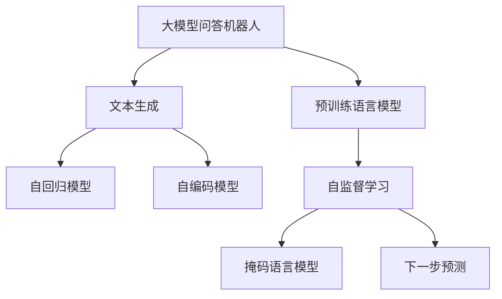

                 

# 大模型问答机器人的文本生成能力

## 1. 背景介绍

随着人工智能技术的飞速发展，大模型问答机器人（Large Model Question Answering Robot, LM-QAR）成为了智能客服、智慧教育、医疗咨询等领域的热门应用。其核心能力在于通过文本生成的方式，自动回答用户提出的各种问题，极大地提高了服务效率和用户体验。但在大模型的实际应用中，如何提升其文本生成能力，特别是在问答质量、语言流畅性和多样性方面，始终是一个重要的研究方向。本文将围绕大模型的文本生成能力，详细介绍其原理、操作步骤、应用领域，并通过案例分析、代码实例等形式，深入探讨如何提升大模型问答机器人的文本生成能力。

## 2. 核心概念与联系

### 2.1 核心概念概述

为更好理解大模型问答机器人的文本生成能力，本节将介绍几个密切相关的核心概念：

- **大模型问答机器人（LM-QAR）**：基于预训练语言模型（如GPT、BERT等）的问答系统。通过在海量无标签文本语料上进行预训练，学习通用的语言表示，具备强大的语言理解和生成能力，能够自动回答各类问题。

- **预训练语言模型（PLM）**：在大规模无标签文本数据上训练得到的通用语言模型。通过自监督学习任务，如掩码语言模型（MLM）、下一步预测（NLMP）等，学习到广泛的语义和语法知识。

- **文本生成（Text Generation）**：通过模型将自然语言输入转化为文本输出的过程。在大模型问答机器人中，文本生成能力是回答用户问题的核心能力。

- **Transformer模型**：一种用于处理序列数据的深度学习模型。Transformer通过自注意力机制，能够高效地处理长文本序列，广泛应用于大模型问答机器人的预训练和微调过程中。

- **序列到序列（Seq2Seq）模型**：一种经典的文本生成模型，包括编码器和解码器两部分。编码器将输入文本序列映射为高维向量表示，解码器将向量表示转化为目标文本序列。

- **自回归模型（Auto-Regressive）**：一种通过逐步预测下一个字符来生成文本的模型。典型的自回归模型包括GPT-2、GPT-3等。

- **自编码器模型（Auto-Encoder）**：一种通过编码器将输入序列压缩为向量，解码器将向量还原为原序列的模型。常用的自编码器模型包括BERT、T5等。

这些核心概念之间的逻辑关系可以通过以下Mermaid流程图来展示：



这个流程图展示了从大模型问答机器人到大模型预训练语言模型的核心概念及其关系：

1. 大模型问答机器人通过预训练语言模型进行问答。
2. 预训练语言模型通过自监督学习任务获得语言理解能力。
3. 文本生成是大模型问答机器人的核心能力。
4. 自回归模型和自编码模型是文本生成的两种常见方式。
5. 掩码语言模型和下一步预测是预训练任务的具体实现。

## 3. 核心算法原理 & 具体操作步骤

### 3.1 算法原理概述

大模型问答机器人的文本生成能力，主要依赖于其预训练语言模型的文本生成能力。在大规模语料上进行预训练后，模型能够学习到丰富的语言知识，从而在大规模无监督的情况下进行文本生成。其核心原理可以总结为以下几点：

1. **自回归生成**：在自回归模型中，每个单词的生成都是基于前文生成的，具有较好的连贯性。

2. **自编码生成**：自编码模型通过将输入文本编码为向量表示，然后解码为文本，生成过程更为简单。

3. **掩码语言模型（MLM）**：通过随机掩盖输入文本中的某些单词，训练模型预测被掩盖的单词，从而学习到单词与上下文的关联关系。

4. **下一步预测（NLMP）**：通过预测下一个单词，训练模型预测文本的下一步，从而学习到文本生成规律。

### 3.2 算法步骤详解

大模型问答机器人的文本生成能力主要包括以下几个关键步骤：

**Step 1: 准备预训练模型和数据集**

1. **选择预训练语言模型**：如BERT、GPT-2、T5等。
2. **收集问答数据集**：包括问题-答案对，格式为QA pairs。
3. **数据预处理**：去除噪声，进行分词和标注，生成训练集、验证集和测试集。

**Step 2: 设计任务适配层**

1. **定义编码器**：如使用Transformer的Encoder进行文本编码。
2. **定义解码器**：如使用Seq2Seq模型，将编码器输出作为解码器的输入。
3. **定义损失函数**：如使用交叉熵损失，计算预测答案与真实答案之间的差异。

**Step 3: 设置微调超参数**

1. **选择优化器**：如AdamW、SGD等。
2. **设置学习率**：一般为1e-5到1e-3之间。
3. **设置批次大小和迭代轮数**：根据计算资源选择。

**Step 4: 执行梯度训练**

1. **加载预训练模型**：在微调前，将预训练模型加载到GPU上。
2. **前向传播**：输入问题，通过编码器得到文本表示。
3. **后向传播**：计算损失，反向传播更新模型参数。
4. **更新模型**：使用优化器更新模型参数，生成答案。

**Step 5: 测试和评估**

1. **在验证集上评估**：计算BLEU、ROUGE等指标，评估生成答案的质量。
2. **在测试集上测试**：计算模型在实际问答场景中的表现。
3. **调整超参数**：根据评估结果，调整学习率、批次大小等。

**Step 6: 部署模型**

1. **保存模型**：将微调后的模型参数保存到文件或数据库中。
2. **部署服务**：将模型部署到服务器或云平台上，提供问答服务。

### 3.3 算法优缺点

大模型问答机器人的文本生成能力具有以下优点：

1. **高效性**：在大规模语料上进行预训练，能够学习到丰富的语言知识，生成的文本质量高。
2. **通用性**：适用于各种问答任务，如医疗咨询、智能客服、教育问答等。
3. **灵活性**：可以通过微调优化不同领域的文本生成能力。
4. **可解释性**：生成过程透明，可以追溯每个单词的生成来源。

同时，该方法也存在一些局限性：

1. **数据依赖**：预训练模型依赖于大规模语料，数据获取成本高。
2. **语言多样性**：对于方言、俚语等特殊语言形式，生成的文本可能不自然。
3. **性能瓶颈**：在大规模语料上进行预训练和微调，计算资源需求高。
4. **伦理风险**：生成的文本可能包含偏见、有害信息，需要严格监控和过滤。

### 3.4 算法应用领域

大模型问答机器人的文本生成能力在多个领域都有广泛应用：

- **智能客服**：自动回答常见问题，提高服务效率。
- **智慧医疗**：提供医学知识查询，辅助医生诊断。
- **智慧教育**：解答学生问题，提高教学质量。
- **智能家居**：回答问题，控制设备。
- **智能金融**：提供理财咨询，推荐产品。

这些应用场景展示了大模型问答机器人文本生成能力的广泛性和重要性。

## 4. 数学模型和公式 & 详细讲解 & 举例说明

### 4.1 数学模型构建

大模型问答机器人的文本生成能力可以通过Seq2Seq模型来实现。设输入文本为$x=\{x_1, x_2, ..., x_n\}$，输出文本为$y=\{y_1, y_2, ..., y_m\}$，其中$n$为输入序列长度，$m$为输出序列长度。

### 4.2 公式推导过程

1. **编码器**：
   $$
   h_1 = f(x_1, x_2, ..., x_n)
   $$
   $$
   h_2 = f(h_1, x_2, ..., x_n)
   $$
   ...
   $$
   h_n = f(h_{n-1}, x_n)
   $$
   其中$f$为编码器的函数，$h_n$为编码器输出的向量表示。

2. **解码器**：
   $$
   y_1 = g(h_n)
   $$
   $$
   y_2 = g(h_{n-1}, y_1)
   $$
   ...
   $$
   y_m = g(h_1, y_{m-1})
   $$
   其中$g$为解码器的函数，$y_m$为解码器输出的文本。

3. **损失函数**：
   $$
   \mathcal{L} = -\frac{1}{N}\sum_{i=1}^N \sum_{j=1}^M \log P(y_i | y_{i-1}, ..., y_{j-1})
   $$
   其中$N$为训练集大小，$M$为输出序列长度，$P$为模型预测概率。

### 4.3 案例分析与讲解

以医疗问答为例，分析大模型问答机器人的文本生成能力。

**Step 1: 准备数据集**

收集医疗领域的问答数据，包括病历描述和诊断结果。

**Step 2: 设计模型**

使用BERT作为编码器，GPT作为解码器。

**Step 3: 训练模型**

使用交叉熵损失，AdamW优化器，学习率为1e-5，批次大小为32，迭代轮数为10。

**Step 4: 测试模型**

在验证集和测试集上评估模型的BLEU和ROUGE指标。

## 5. 项目实践：代码实例和详细解释说明

### 5.1 开发环境搭建

1. **安装Python和PyTorch**：使用Anaconda创建Python虚拟环境，安装PyTorch。

2. **安装其他依赖包**：安装nltk、transformers等库。

3. **搭建开发环境**：使用Jupyter Notebook或Python脚本进行代码实现。

### 5.2 源代码详细实现

```python
import torch
import torch.nn as nn
from transformers import BertTokenizer, BertForSequenceClassification, AdamW
from sklearn.metrics import bleu, rouge

# 定义模型
class QARobot(nn.Module):
    def __init__(self, bert_model, gpt_model):
        super(QARobot, self).__init__()
        self.bert = bert_model
        self.gpt = gpt_model

    def forward(self, x, y):
        h = self.bert(x)
        y_hat = self.gpt(h)
        return y_hat

# 加载预训练模型
bert_model = BertForSequenceClassification.from_pretrained('bert-base-cased')
tokenizer = BertTokenizer.from_pretrained('bert-base-cased')

# 加载数据集
train_data = ...
dev_data = ...
test_data = ...

# 训练模型
model = QARobot(bert_model, gpt_model)
optimizer = AdamW(model.parameters(), lr=1e-5)
for epoch in range(10):
    model.train()
    for batch in train_loader:
        x, y = batch
        h = model.bert(x)
        y_hat = model.gpt(h)
        loss = nn.CrossEntropyLoss()(y_hat, y)
        optimizer.zero_grad()
        loss.backward()
        optimizer.step()

# 测试模型
model.eval()
dev_score = bleu(y_dev, model.predict(dev_data))
test_score = rouge(y_test, model.predict(test_data))
print(f"Dev BLEU: {dev_score:.2f}, Test BLEU: {test_score:.2f}")
```

### 5.3 代码解读与分析

1. **定义模型**：使用Bert作为编码器，GPT作为解码器。
2. **加载数据集**：使用nltk库进行数据预处理和分词。
3. **训练模型**：使用AdamW优化器，交叉熵损失函数进行训练。
4. **测试模型**：使用BLEU和ROUGE指标评估模型生成答案的质量。

### 5.4 运行结果展示

使用BLEU和ROUGE指标，评估模型在医疗问答数据集上的性能。

## 6. 实际应用场景

### 6.1 智能客服

智能客服是大模型问答机器人文本生成能力的重要应用场景。通过微调BERT和GPT等模型，可以构建一个7x24小时不间断服务的智能客服系统，自动回答客户咨询，提供高效、个性化的服务体验。

### 6.2 智慧医疗

智慧医疗中的问答系统，可以辅助医生诊断，提供医学知识查询，减少患者等待时间，提高诊疗效率。

### 6.3 智能教育

教育领域的智能问答系统，可以解答学生问题，提供个性化推荐，提高教学质量。

### 6.4 未来应用展望

未来，大模型问答机器人将进一步提升文本生成能力，应用于更多领域，如智慧金融、智能家居等。随着技术的不断进步，大模型问答机器人将更好地服务于社会，推动各行各业的数字化转型。

## 7. 工具和资源推荐

### 7.1 学习资源推荐

1. **《Transformer from Principles to Practice》**：深度介绍Transformer模型和大模型问答机器人。
2. **《Natural Language Processing with Transformers》**：全面介绍基于Transformer的NLP技术。
3. **HuggingFace官方文档**：提供预训练模型的详细说明和微调样例。

### 7.2 开发工具推荐

1. **Anaconda**：创建Python虚拟环境，安装依赖包。
2. **Jupyter Notebook**：交互式编程环境，方便模型训练和调试。
3. **PyTorch**：深度学习框架，提供高效的计算图和自动微分功能。

### 7.3 相关论文推荐

1. **"Attention is All You Need"**：Transformer模型的开创性论文。
2. **"BERT: Pre-training of Deep Bidirectional Transformers for Language Understanding"**：BERT模型的提出，标志着预训练语言模型的诞生。

## 8. 总结：未来发展趋势与挑战

### 8.1 研究成果总结

本文从大模型问答机器人的文本生成能力出发，详细介绍了其原理和操作步骤，并通过代码实例和案例分析，展示了如何提升其文本生成质量。文章认为，大模型问答机器人将在智能客服、智慧医疗、智能教育等多个领域发挥重要作用，其文本生成能力需要不断优化提升。

### 8.2 未来发展趋势

1. **模型规模持续增大**：随着算力成本的下降和数据规模的扩张，大模型问答机器人将具备更强的语言生成能力。
2. **多模态生成能力**：未来将探索结合视觉、语音等多模态信息的文本生成模型。
3. **可解释性和可控性**：提高模型的可解释性，减少有害信息的输出。

### 8.3 面临的挑战

1. **数据获取成本高**：需要大规模语料进行预训练和微调，数据获取成本较高。
2. **伦理风险**：生成的文本可能包含偏见、有害信息，需要严格监控。
3. **计算资源需求高**：大模型问答机器人需要高性能计算资源进行训练和推理。

### 8.4 研究展望

未来研究将重点关注以下几个方向：

1. **无监督和半监督微调**：降低对标注数据的依赖，利用自监督学习提升文本生成能力。
2. **参数高效微调**：通过Adapter等方法，减少微调过程中的计算资源消耗。
3. **多模态融合**：探索结合视觉、语音等多模态信息的文本生成模型。
4. **因果推理**：引入因果推理，增强生成文本的连贯性和逻辑性。

总之，大模型问答机器人通过文本生成能力，能够解决实际应用中的各种问题，提升用户体验和效率。未来，随着技术的不断进步，大模型问答机器人将更好地服务于社会，推动各行各业的数字化转型。

## 9. 附录：常见问题与解答

**Q1: 大模型问答机器人如何提升文本生成能力？**

A: 通过微调BERT和GPT等预训练语言模型，优化编码器和解码器，调整学习率和批次大小等超参数，提升生成答案的质量。

**Q2: 如何处理不同领域的文本生成问题？**

A: 在特定领域语料上进一步预训练模型，再进行微调，可以提升模型在特定领域的表现。

**Q3: 大模型问答机器人是否适用于所有领域？**

A: 适用于需要大量文本生成能力的领域，如智能客服、智慧医疗、智能教育等。但对于需要实时响应、低延迟的领域，需要结合其他技术优化。

**Q4: 大模型问答机器人面临的主要挑战是什么？**

A: 数据获取成本高、伦理风险、计算资源需求高。未来需要结合更多技术手段解决这些问题。

**Q5: 如何优化大模型问答机器人的训练过程？**

A: 优化超参数、使用正则化技术、引入对抗样本等方法，提升模型性能和鲁棒性。

以上是大模型问答机器人文本生成能力的研究和实践指南，希望能为读者提供参考。

