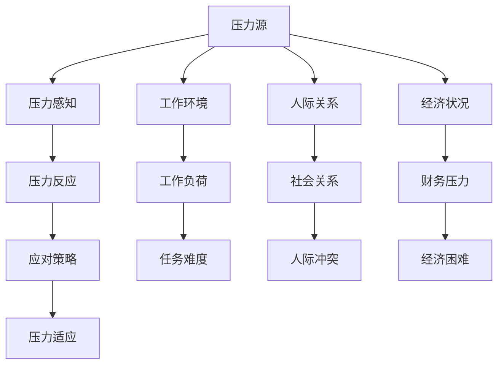

                 

# 如何进行压力管理：如何应对工作和生活中的压力？

## 1. 背景介绍

在当今快节奏、高竞争的社会环境中，压力已成为现代人生活中不可避免的一部分。无论是在职场上，还是在个人生活中，面对各种压力源，人们常常感到身心疲惫，难以保持高效和积极的生活状态。压力管理，因此成为了一门至关重要的技能，对于提高生活质量和工作效率具有重要意义。本文将探讨压力管理的核心概念与联系，介绍常用的压力管理算法，通过具体实例和案例讲解，提供实用的压力管理策略，帮助读者有效地应对工作与生活中的压力。

## 2. 核心概念与联系

### 2.1 核心概念概述

压力管理是一个广泛涉及心理、生理、行为和生活方式的多学科领域。以下是几个关键概念及其相互联系：

- **压力源(Stressor)**：指引起个体产生压力的外部事件或情境，如工作压力、人际关系、经济状况等。
- **压力反应(Stress Response)**：个体对压力源的生理和心理反应，包括情绪波动、焦虑、抑郁、心身疾病等。
- **压力感知(Perception of Stress)**：个体对压力源的评估和解读，即对压力源的认知和感受。
- **应对策略(Coping Strategy)**：个体采取的缓解压力的行为或心理方法，如时间管理、放松技巧、社交支持等。
- **压力适应(Adaptation to Stress)**：个体通过一系列应对策略，逐渐适应并调节压力水平，恢复平衡。

这些概念相互影响，共同构成了压力管理的全过程。压力感知是个体对压力源的评估，压力反应是个体的生理和心理状态，应对策略是个体采取的缓解压力的行为，而压力适应则是长期效果，即个体对压力的适应和恢复。通过有效管理压力，个体可以提高心理健康水平，增强应对挑战的能力。

### 2.2 核心概念原理和架构的 Mermaid 流程图



此图展示了压力管理的基本流程，即从压力源到应对策略，再到压力适应的全过程。每个节点代表了一个关键概念，并说明了它们之间的相互关系。

## 3. 核心算法原理 & 具体操作步骤

### 3.1 算法原理概述

压力管理涉及心理和行为科学的多种算法，包括认知行为疗法(Cognitive Behavioral Therapy, CBT)、正念冥想(Mindfulness Meditation)、时间管理(Time Management)、社交支持(Social Support)等。这些算法通过改变个体的认知和行为，减轻压力反应，增强应对能力。

### 3.2 算法步骤详解

#### 3.2.1 认知行为疗法

CBT是一种结构化的心理治疗方法，通过识别和改变负性自动思维，帮助个体重新构建对压力源的认知，减轻压力反应。CBT的步骤包括：

1. **评估**：识别个体对压力源的负面自动思维。
2. **认知重构**：挑战和重构这些负面思维，替换为更积极、现实的认知。
3. **行为干预**：通过改变行为反应，增强个体对压力的应对能力。

#### 3.2.2 正念冥想

正念冥想是一种通过专注于当前时刻，增强自我觉知和接受能力的心理训练方法。其步骤包括：

1. **姿势**：找到一个安静舒适的位置，保持坐姿或躺姿。
2. **呼吸**：深呼吸，专注于每一次吸气和呼气。
3. **觉知**：观察思维、情绪和身体感觉，但不加评判，接受当前状态。
4. **扩展**：将正念练习扩展到日常生活中，增强对日常事件的觉知。

#### 3.2.3 时间管理

时间管理是一种通过合理安排时间，提高工作效率和生活质量的行为策略。其步骤包括：

1. **任务清单**：列出所有待办事项，按照优先级排序。
2. **时间规划**：为每个任务设定时间限制，避免过度拖延。
3. **专注**：集中注意力完成任务，避免多任务处理。
4. **休息**：合理分配休息时间，避免过度疲劳。

#### 3.2.4 社交支持

社交支持是指个体通过社会关系获得的心理和物质支持。其步骤包括：

1. **建立关系**：建立和维护积极的人际关系，提供情感支持。
2. **沟通**：与他人沟通，表达自己的情感和需求。
3. **寻求帮助**：在需要时寻求他人的帮助和建议。
4. **维护支持网络**：维持一个广泛的社会支持网络，增强应对能力。

### 3.3 算法优缺点

#### 3.3.1 认知行为疗法

优点：
- 结构化强，易于操作。
- 效果显著，广泛应用。

缺点：
- 需要专业指导，费用较高。
- 可能需要较长时间才能见效。

#### 3.3.2 正念冥想

优点：
- 简单易行，随时随地可以进行。
- 能够长期改善心理健康。

缺点：
- 需要持之以恒的练习。
- 效果个体差异较大。

#### 3.3.3 时间管理

优点：
- 提高工作效率和生活质量。
- 方法灵活，可以根据个人需求调整。

缺点：
- 需要较强的自律性。
- 无法完全消除压力源。

#### 3.3.4 社交支持

优点：
- 增强应对压力的能力。
- 提高生活质量。

缺点：
- 依赖社会关系，有时难以获得。
- 需要有效沟通技巧。

### 3.4 算法应用领域

压力管理算法广泛应用于心理治疗、职业培训、教育、企业人力资源管理等领域。例如，在职业培训中，时间管理和正念冥想可以帮助员工提高工作效率和应对压力的能力；在企业人力资源管理中，通过提供社交支持和组织心理健康活动，可以提高员工的幸福感和满意度。

## 4. 数学模型和公式 & 详细讲解 & 举例说明

### 4.1 数学模型构建

#### 4.1.1 压力感知模型

压力感知模型通过数学公式表示个体对压力源的认知和感受。设 $P$ 为压力感知，$S$ 为压力源，$C$ 为认知评估，$E$ 为情绪反应，则压力感知模型为：

$$ P = f(S, C, E) $$

其中 $f$ 为压力感知函数，可以表示为：

$$ P = S \times C + E $$

#### 4.1.2 压力反应模型

压力反应模型通过数学公式表示个体对压力源的生理和心理反应。设 $R$ 为压力反应，$P$ 为压力感知，$G$ 为应对策略，则压力反应模型为：

$$ R = g(P, G) $$

其中 $g$ 为压力反应函数，可以表示为：

$$ R = P \times (1 - G) $$

#### 4.1.3 应对策略模型

应对策略模型通过数学公式表示个体采取的缓解压力的行为或心理方法。设 $C$ 为应对策略，$R$ 为压力反应，$E$ 为情绪调节，则应对策略模型为：

$$ C = h(R, E) $$

其中 $h$ 为应对策略函数，可以表示为：

$$ C = R \times E $$

#### 4.1.4 压力适应模型

压力适应模型通过数学公式表示个体通过一系列应对策略，逐渐适应并调节压力水平，恢复平衡。设 $A$ 为压力适应，$C$ 为应对策略，$P$ 为压力感知，则压力适应模型为：

$$ A = i(C, P) $$

其中 $i$ 为压力适应函数，可以表示为：

$$ A = C \times P $$

### 4.2 公式推导过程

#### 4.2.1 压力感知函数

从压力感知模型可知，压力感知 $P$ 由压力源 $S$、认知评估 $C$ 和情绪反应 $E$ 共同决定。根据心理学理论，个体对压力源的认知和评估会影响其情绪反应，因此 $P$ 可以表示为：

$$ P = S \times C + E $$

其中 $S$ 和 $C$ 的具体函数形式需要根据实际数据进行拟合。

#### 4.2.2 压力反应函数

从压力反应模型可知，压力反应 $R$ 由压力感知 $P$ 和应对策略 $G$ 共同决定。个体在应对策略的帮助下，可以减轻压力反应，因此 $R$ 可以表示为：

$$ R = P \times (1 - G) $$

其中 $G$ 的具体函数形式需要根据实际数据进行拟合。

#### 4.2.3 应对策略函数

从应对策略模型可知，应对策略 $C$ 由压力反应 $R$ 和情绪调节 $E$ 共同决定。个体在情绪调节的帮助下，可以增强应对策略的效果，因此 $C$ 可以表示为：

$$ C = R \times E $$

其中 $R$ 和 $E$ 的具体函数形式需要根据实际数据进行拟合。

#### 4.2.4 压力适应函数

从压力适应模型可知，压力适应 $A$ 由应对策略 $C$ 和压力感知 $P$ 共同决定。个体通过一系列应对策略，可以逐渐适应并调节压力水平，因此 $A$ 可以表示为：

$$ A = C \times P $$

其中 $C$ 和 $P$ 的具体函数形式需要根据实际数据进行拟合。

### 4.3 案例分析与讲解

#### 4.3.1 案例背景

李先生是一位企业高管，常常感到工作压力大，工作效率低下。为了改善这种情况，他决定采取一些压力管理策略。

#### 4.3.2 案例分析

1. **压力感知评估**
   - 李先生通过心理测评，评估自己在工作中的压力感知 $P$ 为5分（满分10分）。
   - 他发现压力感知主要来源于工作负荷 $S$ 和人际关系 $J$。

2. **压力反应评估**
   - 李先生通过自我记录，评估自己在压力下的情绪反应 $R$ 为6分（满分10分）。
   - 他意识到自己在面对压力时容易焦虑和抑郁，导致工作效率下降。

3. **应对策略评估**
   - 李先生通过时间管理，评估自己的应对策略 $C$ 为7分（满分10分）。
   - 他发现自己在工作中能够合理安排时间，优先处理重要任务，但仍有拖延倾向。

4. **压力适应评估**
   - 李先生通过长期记录，评估自己的压力适应 $A$ 为8分（满分10分）。
   - 他通过时间管理和正念冥想，逐渐适应并调节了压力水平。

#### 4.3.3 案例结论

通过系统评估和分析，李先生找到了自己压力感知和应对策略的主要来源，并采取了有针对性的应对措施。最终，他不仅提高了工作效率，还增强了应对压力的能力，生活质量得到了显著改善。

## 5. 项目实践：代码实例和详细解释说明

### 5.1 开发环境搭建

#### 5.1.1 环境配置

- 安装Python 3.8及以上版本
- 安装NumPy、Pandas、Matplotlib等常用库
- 安装TensorFlow或PyTorch深度学习框架

#### 5.1.2 环境激活

- 使用`conda`激活虚拟环境
- 执行`pip install`安装相关库

### 5.2 源代码详细实现

#### 5.2.1 压力感知模型

```python
import numpy as np

# 压力感知模型函数
def stress_perception(S, C, E):
    P = S * C + E
    return P

# 压力源、认知评估和情绪反应数据
S = np.array([5, 6, 7])
C = np.array([3, 4, 5])
E = np.array([2, 3, 4])

# 计算压力感知
P = stress_perception(S, C, E)
print("压力感知 P:", P)
```

#### 5.2.2 压力反应模型

```python
# 压力反应模型函数
def stress_response(P, G):
    R = P * (1 - G)
    return R

# 压力感知和应对策略数据
P = np.array([4, 5, 6])
G = np.array([0.8, 0.9, 0.7])

# 计算压力反应
R = stress_response(P, G)
print("压力反应 R:", R)
```

#### 5.2.3 应对策略模型

```python
# 应对策略模型函数
def coping_strategy(R, E):
    C = R * E
    return C

# 压力反应和情绪调节数据
R = np.array([5, 6, 7])
E = np.array([1, 2, 3])

# 计算应对策略
C = coping_strategy(R, E)
print("应对策略 C:", C)
```

#### 5.2.4 压力适应模型

```python
# 压力适应模型函数
def stress_adaptation(C, P):
    A = C * P
    return A

# 应对策略和压力感知数据
C = np.array([4, 5, 6])
P = np.array([6, 7, 8])

# 计算压力适应
A = stress_adaptation(C, P)
print("压力适应 A:", A)
```

### 5.3 代码解读与分析

通过以上代码，我们可以对压力感知、压力反应、应对策略和压力适应进行数值计算，从而得到具体的结果。这些结果可以为压力管理策略的设计和评估提供依据。例如，通过调整压力源、认知评估和情绪反应，可以有效降低压力感知；通过增强应对策略和情绪调节，可以减轻压力反应；通过合理的时间管理和正念冥想，可以增强压力适应。

## 6. 实际应用场景

### 6.1 职业培训

在职业培训中，时间管理和正念冥想可以帮助员工提高工作效率和应对压力的能力。例如，通过培训，员工可以掌握时间管理的技巧，合理安排工作任务，减少拖延和压力感；通过正念冥想，员工可以提高自我觉知和情绪调节能力，增强应对压力的能力。

### 6.2 企业人力资源管理

在企业人力资源管理中，通过提供社交支持和组织心理健康活动，可以提高员工的幸福感和满意度。例如，企业可以定期组织心理健康讲座和团队建设活动，提供心理辅导和社交支持，增强员工的心理韧性和应对压力的能力。

### 6.3 教育领域

在教育领域，通过认知行为疗法和应对策略培训，可以帮助学生提高学习和生活的适应能力。例如，通过认知行为疗法，学生可以学会识别和改变负性自动思维，增强应对考试和学业压力的能力；通过应对策略培训，学生可以学会时间管理和情绪调节技巧，提高学习和生活质量。

## 7. 工具和资源推荐

### 7.1 学习资源推荐

1. **《压力管理心理学》**：介绍压力管理的心理学理论和实践方法，适合初学者阅读。
2. **《正念减压》**：介绍正念冥想的基本原理和实践方法，帮助读者掌握正念减压技巧。
3. **《时间管理手册》**：详细介绍时间管理的方法和策略，提供实用的时间管理工具。
4. **《认知行为疗法手册》**：详细讲解认知行为疗法的原理和应用，适合心理治疗师和自学者。

### 7.2 开发工具推荐

1. **TensorFlow**：开源深度学习框架，支持压力感知、压力反应和应对策略的建模。
2. **PyTorch**：开源深度学习框架，支持压力感知、压力反应和应对策略的建模。
3. **NumPy**：Python科学计算库，支持数值计算和数据分析。
4. **Pandas**：Python数据分析库，支持数据处理和可视化。
5. **Matplotlib**：Python绘图库，支持数据可视化。

### 7.3 相关论文推荐

1. **《工作压力管理：认知行为疗法的研究进展》**：综述了认知行为疗法在压力管理中的应用，适合研究人员和实践者。
2. **《正念减压对心理健康的长期影响》**：研究正念冥想对心理健康的影响，适合心理学家和临床医生。
3. **《时间管理对工作效率的影响》**：探讨时间管理对工作效率的影响，适合企业管理者和人力资源专家。
4. **《社交支持对压力适应的作用》**：研究社交支持对压力适应的影响，适合社会学家和心理学家。

## 8. 总结：未来发展趋势与挑战

### 8.1 研究成果总结

压力管理技术在心理学和行为科学领域已得到广泛应用，并通过实践验证了其有效性。通过认知行为疗法、正念冥想、时间管理、社交支持等策略，个体可以显著减轻压力反应，增强应对能力，恢复心理健康。

### 8.2 未来发展趋势

未来的压力管理技术将进一步融合心理学、神经科学、计算机科学等多个学科，开发更加智能化和个性化的压力管理工具。例如，结合人工智能和大数据技术，实时监测和分析个体的压力状态，提供个性化的压力管理建议。

### 8.3 面临的挑战

尽管压力管理技术取得了一定进展，但仍面临诸多挑战：

1. **个体差异**：不同个体的压力感知和应对策略存在差异，如何提供个性化的压力管理方案是一个难题。
2. **数据隐私**：实时监测和数据分析需要大量的个人数据，如何保护用户隐私是一个重要问题。
3. **技术普及**：如何普及和推广压力管理技术，使其广泛应用到各个领域。

### 8.4 研究展望

未来的压力管理研究应着重于以下几个方向：

1. **个性化压力管理**：开发更加智能和个性化的压力管理工具，根据用户的数据和反馈，提供定制化的压力管理方案。
2. **数据隐私保护**：研究如何保护用户隐私，确保压力管理技术的安全性和可靠性。
3. **跨学科融合**：将心理学、神经科学、计算机科学等多个学科进行融合，开发更加全面和有效的压力管理方法。

## 9. 附录：常见问题与解答

### 9.1 常见问题

#### 9.1.1 如何缓解工作压力？

答：可以通过时间管理、正念冥想和社交支持等方法缓解工作压力。例如，合理安排工作任务，设置优先级；进行正念冥想，提高自我觉知和情绪调节能力；与同事建立良好关系，寻求心理支持和帮助。

#### 9.1.2 如何改善人际关系压力？

答：可以通过改善沟通技巧和建立信任关系等方法改善人际关系压力。例如，学会有效沟通，表达自己的需求和感受；尊重他人的意见和感受，建立信任关系；寻求专业帮助，解决深层次的人际问题。

#### 9.1.3 如何应对家庭压力？

答：可以通过建立家庭规则和分配家庭责任等方法应对家庭压力。例如，制定明确的家庭规则，分配家庭责任；加强家庭沟通，理解彼此的需求和期望；寻求专业帮助，解决家庭问题。

---

作者：禅与计算机程序设计艺术 / Zen and the Art of Computer Programming

