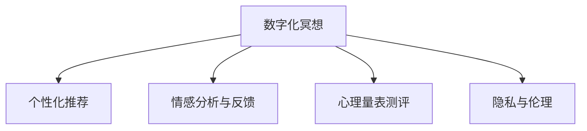

                 

# 数字化冥想创业：科技辅助的心灵平静

## 1. 背景介绍

### 1.1 问题由来
在快节奏、高压力的现代社会，冥想（Meditation）成为了一种颇受欢迎的放松和减压手段。它通过深呼吸、集中注意力、正念观察等方法，帮助人们提高心理健康、情绪管理、注意力集中等方面的能力。然而，传统的冥想训练往往需要较长时间、专注度高，且对环境要求严格，不易普及。

数字化冥想（Digital Meditation）的兴起为这一问题提供了新的解决方案。借助科技手段，数字化冥想将传统的冥想方式转化为易于操作、灵活便捷的数字产品，极大地降低了参与门槛。随着人工智能、大数据、云计算等技术的不断进步，数字化冥想产品也从单一的音频引导冥想，发展到了多模态的虚拟教练、互动反馈、个性化训练等多样化的服务。

数字化冥想创业，正是在这一背景之下应运而生。它融合了人工智能、心理学、神经科学等多学科知识，利用科技力量，为人们提供科学有效的心理健康支持，帮助他们在繁忙的生活中寻找到心灵的平静。

### 1.2 问题核心关键点
数字化冥想创业的关键点在于如何将现代科技与冥想训练有效结合，创建出用户友好、效果显著的数字化冥想产品。以下是数字化冥想创业的五个核心关键点：

1. **数据驱动的个性化推荐**：通过分析用户的冥想习惯、情绪状态等数据，提供个性化的冥想建议。
2. **多模态互动体验**：融合音频、视频、图像等多种感官信息，提供更丰富的冥想体验。
3. **实时情感分析与反馈**：利用情感识别、自然语言处理等技术，实时分析用户的冥想状态，提供及时反馈和调整建议。
4. **心理量表测评**：引入标准化心理量表，量化评估用户的心理健康状况，监测冥想效果。
5. **伦理与隐私保护**：确保用户数据的隐私与安全，同时遵循伦理准则，保护用户的心理健康。

这些关键点相互交织，共同构成了数字化冥想创业的核心技术架构。

### 1.3 问题研究意义
数字化冥想创业不仅具有广阔的市场前景，更具有深远的社会意义：

1. **普及心理健康知识**：数字化冥想产品能够轻松接触到更多用户，普及心理健康知识，提升社会心理健康水平。
2. **缓解社会压力**：在职场竞争、生活节奏加快的情况下，数字化冥想能够帮助人们有效管理压力，提升生活质量。
3. **促进科技与心理健康的结合**：推动心理学与科技的交叉学科发展，探索更多创新应用，为未来医疗健康提供新的方向。
4. **提升用户满意度**：通过精准的个性化服务，提供高效、便捷的冥想体验，满足用户个性化需求，提高用户满意度。
5. **助力企业发展**：数字化冥想产品可以作为员工福利，帮助企业构建和谐的员工关系，提升员工心理健康和工作效率。

数字化冥想创业的应用前景广阔，有望成为心理健康领域的一个重要发展方向。

## 2. 核心概念与联系

### 2.1 核心概念概述

在数字化冥想创业中，涉及的关键概念包括：

- **数字化冥想**：指利用科技手段，将传统的冥想训练转化为数字化的形式，便于用户随时随地进行。
- **个性化推荐系统**：通过分析用户数据，推荐适合用户的冥想课程、时间、类型等，提升用户体验。
- **情感分析与反馈系统**：利用情感识别技术，分析用户冥想过程中的情绪变化，提供实时反馈和调整建议。
- **心理量表测评**：通过标准化量表，评估用户的心理健康状况，监测冥想效果，提供数据支持。
- **隐私与伦理**：确保用户数据的安全与隐私，遵循伦理准则，保障用户心理健康。

这些概念之间的关系可以通过以下Mermaid流程图来展示：



这个流程图展示了数字化冥想中的各个关键组件及其相互联系：

1. 数字化冥想是整个系统的核心，用户通过数字化产品进行冥想训练。
2. 个性化推荐系统根据用户数据，推荐个性化的冥想课程，提升用户体验。
3. 情感分析与反馈系统实时监测用户情绪，提供个性化的调整建议。
4. 心理量表测评量化评估用户的心理健康状况，监测冥想效果。
5. 隐私与伦理保障，确保用户数据的安全与隐私。

这些概念共同构成了数字化冥想创业的技术基础，有助于打造更高效、便捷、科学的心理健康产品。

## 3. 核心算法原理 & 具体操作步骤
### 3.1 算法原理概述

数字化冥想创业的核心算法主要包括个性化推荐、情感分析与反馈、心理量表测评等。

**个性化推荐算法**：通过分析用户的冥想习惯、情绪状态、健康数据等，推荐最适合的冥想课程、时间、类型等。

**情感分析与反馈算法**：利用情感识别技术，分析用户冥想过程中的情绪变化，提供实时反馈和调整建议。

**心理量表测评算法**：引入标准化心理量表，量化评估用户的心理健康状况，监测冥想效果。

这些算法原理和技术手段的结合，使得数字化冥想产品能够提供个性化、实时的心理健康服务，帮助用户更好地进行冥想训练。

### 3.2 算法步骤详解

以下是数字化冥想创业中各个关键算法的详细步骤：

**个性化推荐算法步骤**：

1. **数据收集**：收集用户的冥想数据、情绪数据、健康数据等，建立用户画像。
2. **数据预处理**：对收集到的数据进行清洗、归一化等预处理操作。
3. **特征提取**：提取关键特征，如冥想时长、类型、情绪评分等。
4. **模型训练**：使用机器学习算法，训练个性化推荐模型，如协同过滤、内容推荐等。
5. **推荐生成**：根据训练好的模型，生成个性化推荐结果。

**情感分析与反馈算法步骤**：

1. **语音情感识别**：利用语音识别技术，采集用户冥想过程中的语音信息。
2. **情绪分析**：通过情感分析算法，识别用户语音中的情绪状态。
3. **反馈生成**：根据情绪状态，生成实时反馈和调整建议，如调整冥想时长、音乐类型等。

**心理量表测评算法步骤**：

1. **量表选择**：选择合适的标准化心理量表，如PANAS、PIVET等。
2. **问卷设计**：根据量表，设计问卷，获取用户心理健康数据。
3. **数据分析**：对问卷数据进行分析，量化评估心理健康状况。
4. **效果监测**：定期监测用户的心理健康状况，评估冥想效果。

### 3.3 算法优缺点

**个性化推荐算法的优点**：

1. **提升用户体验**：通过个性化推荐，用户能够获得更适合自己的冥想课程，提高体验感。
2. **提高冥想效果**：个性化推荐能够根据用户需求，推荐最合适的冥想方式，提升冥想效果。
3. **降低学习门槛**：通过推荐系统，用户可以轻松找到适合自己的冥想方式，降低学习门槛。

**个性化推荐算法缺点**：

1. **数据隐私问题**：收集和分析用户数据需要确保数据隐私，避免数据泄露。
2. **算法复杂度**：个性化推荐系统需要复杂的算法和大量数据，实现难度较大。
3. **用户粘性问题**：个性化推荐系统需要用户持续提供数据，才能不断优化推荐效果，用户粘性问题需要解决。

**情感分析与反馈算法的优点**：

1. **实时反馈**：情感分析与反馈算法能够实时监测用户情绪，提供及时调整建议。
2. **提高冥想效果**：通过实时反馈，用户可以更好地调整冥想方式，提升冥想效果。
3. **增强用户体验**：实时反馈能够增强用户体验，让用户感到被关注和支持。

**情感分析与反馈算法的缺点**：

1. **情感识别准确度**：情感识别算法需要较高的准确度，否则可能提供不准确的反馈建议。
2. **算法复杂度**：情感分析与反馈算法需要复杂的情感识别模型，实现难度较大。
3. **用户依赖问题**：过度依赖实时反馈，可能影响用户的主动性和独立性。

**心理量表测评算法的优点**：

1. **量化评估**：心理量表测评能够量化评估用户的心理健康状况，提供数据支持。
2. **效果监测**：定期监测用户的心理健康状况，评估冥想效果，帮助用户持续改进。
3. **标准化**：心理量表测评具有标准化，便于跨地区、跨时间的比较和分析。

**心理量表测评算法的缺点**：

1. **用户负担**：定期测评用户心理健康状况，可能增加用户的负担。
2. **隐私问题**：收集和分析用户心理健康数据需要确保数据隐私，避免数据泄露。
3. **数据质量问题**：测评结果的质量取决于问卷设计和用户参与度，数据质量问题需要解决。

### 3.4 算法应用领域

数字化冥想创业的算法和技术，不仅适用于心理健康领域的数字化产品，还广泛应用于以下领域：

1. **企业员工心理健康**：数字化冥想产品可以作为员工福利，提升员工心理健康和工作效率。
2. **在线教育**：利用个性化推荐和情感分析，提升在线课程的用户体验和教学效果。
3. **智能家居**：结合智能家居设备，提供个性化和实时的健康服务，提升家居生活质量。
4. **远程医疗**：通过心理量表测评，辅助医生进行心理健康评估和治疗。
5. **心理健康监测**：利用情感分析和心理量表测评，监测社会心理健康状况，提供及时干预。

这些应用领域展示了数字化冥想创业的广阔前景，证明了其在现代科技和心理健康领域的深度融合。

## 4. 数学模型和公式 & 详细讲解  
### 4.1 数学模型构建

数字化冥想创业中的数学模型主要包括个性化推荐、情感分析与反馈、心理量表测评等。

**个性化推荐模型的数学模型**：

假设用户集合为 $U$，冥想课程集合为 $I$，用户对课程的评分矩阵为 $R_{U \times I}$。设用户 $u$ 对课程 $i$ 的评分为 $r_{ui}$，其中 $u \in U, i \in I$。

目标是最小化预测误差 $e$，最大化推荐准确率 $R$。数学模型为：

$$
\min_{\theta} \sum_{u,i} (r_{ui} - \hat{r}_{ui})^2 \quad \text{subject to} \quad \hat{r}_{ui} = \theta_u \cdot \phi_i + b
$$

其中，$\theta_u$ 为第 $u$ 个用户的参数向量，$\phi_i$ 为课程 $i$ 的特征向量，$b$ 为截距项。

**情感分析模型的数学模型**：

情感分析模型通常基于情感词典或深度学习模型，如LSTM、RNN等。假设用户冥想语音数据为 $X = (x_1, x_2, ..., x_t)$，情感状态为 $Y = (y_1, y_2, ..., y_t)$，其中 $x_i$ 为第 $i$ 个语音样本，$y_i$ 为对应的情感状态。

目标是最小化情感识别误差 $E$，最大化情感识别准确率 $A$。数学模型为：

$$
\min_{\theta} E(Y, \hat{Y}) = \sum_{i=1}^t (y_i - \hat{y}_i)^2
$$

其中，$\hat{y}_i$ 为模型预测的情感状态，$\theta$ 为模型参数。

**心理量表测评模型的数学模型**：

心理量表测评模型通常基于标准化量表，如PANAS、PIVET等。假设用户心理健康数据为 $D = (d_1, d_2, ..., d_n)$，其中 $d_i$ 为第 $i$ 个量表评分数据。

目标是最小化评估误差 $F$，最大化量表评分准确率 $P$。数学模型为：

$$
\min_{\theta} F(D, \hat{D}) = \sum_{i=1}^n (d_i - \hat{d}_i)^2
$$

其中，$\hat{d}_i$ 为模型预测的量表评分，$\theta$ 为模型参数。

### 4.2 公式推导过程

**个性化推荐模型的公式推导**：

设用户 $u$ 对课程 $i$ 的评分为 $r_{ui}$，预测评分为 $\hat{r}_{ui}$。

$$
\hat{r}_{ui} = \theta_u \cdot \phi_i + b
$$

预测误差 $e$ 定义为实际评分与预测评分之差：

$$
e_{ui} = r_{ui} - \hat{r}_{ui}
$$

通过最小化预测误差，优化模型参数：

$$
\min_{\theta} \sum_{u,i} (r_{ui} - \hat{r}_{ui})^2
$$

使用梯度下降算法求解最优参数 $\theta$：

$$
\theta \leftarrow \theta - \eta \nabla_{\theta}\mathcal{L}(\theta)
$$

其中，$\eta$ 为学习率，$\nabla_{\theta}\mathcal{L}(\theta)$ 为损失函数对参数 $\theta$ 的梯度，$\mathcal{L}$ 为损失函数。

**情感分析模型的公式推导**：

假设用户冥想语音数据为 $X = (x_1, x_2, ..., x_t)$，情感状态为 $Y = (y_1, y_2, ..., y_t)$。

利用深度学习模型，如LSTM，进行情感识别：

$$
\hat{y}_i = \sigma(Wx_i + b)
$$

其中，$x_i$ 为第 $i$ 个语音样本，$y_i$ 为对应的情感状态，$W$ 和 $b$ 为模型参数，$\sigma$ 为激活函数。

情感识别误差 $E$ 定义为实际情感状态与预测情感状态之差：

$$
E_{i} = y_i - \hat{y}_i
$$

通过最小化情感识别误差，优化模型参数：

$$
\min_{\theta} E(Y, \hat{Y}) = \sum_{i=1}^t (y_i - \hat{y}_i)^2
$$

使用梯度下降算法求解最优参数 $\theta$：

$$
\theta \leftarrow \theta - \eta \nabla_{\theta}\mathcal{L}(\theta)
$$

**心理量表测评模型的公式推导**：

假设用户心理健康数据为 $D = (d_1, d_2, ..., d_n)$，其中 $d_i$ 为第 $i$ 个量表评分数据。

利用标准化量表，如PANAS，进行心理健康评估：

$$
\hat{d}_i = \theta \cdot \phi_i + b
$$

其中，$d_i$ 为第 $i$ 个量表评分数据，$\phi_i$ 为量表数据特征向量，$b$ 为截距项，$\theta$ 为模型参数。

评估误差 $F$ 定义为实际评分与预测评分之差：

$$
F_{i} = d_i - \hat{d}_i
$$

通过最小化评估误差，优化模型参数：

$$
\min_{\theta} F(D, \hat{D}) = \sum_{i=1}^n (d_i - \hat{d}_i)^2
$$

使用梯度下降算法求解最优参数 $\theta$：

$$
\theta \leftarrow \theta - \eta \nabla_{\theta}\mathcal{L}(\theta)
$$

### 4.3 案例分析与讲解

以下是一个简单的案例分析：

假设某用户在数字化冥想应用中，每天冥想30分钟，每周完成5次冥想课程。应用通过用户的冥想时长、类型、情绪评分等数据，推荐适合该用户的冥想课程。

**个性化推荐案例分析**：

1. **数据收集**：应用收集该用户的冥想数据，包括冥想时长、类型、情绪评分等。
2. **数据预处理**：对收集到的数据进行清洗、归一化等预处理操作。
3. **特征提取**：提取关键特征，如冥想时长、类型、情绪评分等。
4. **模型训练**：使用协同过滤算法，训练个性化推荐模型，生成个性化推荐结果。
5. **推荐生成**：根据训练好的模型，生成个性化推荐结果，如推荐该用户本周的冥想课程。

**情感分析案例分析**：

1. **语音情感识别**：应用利用语音识别技术，采集该用户冥想过程中的语音信息。
2. **情绪分析**：通过情感分析算法，识别该用户语音中的情绪状态，如放松、焦虑等。
3. **反馈生成**：根据情绪状态，生成实时反馈和调整建议，如调整冥想时长、音乐类型等。

**心理量表测评案例分析**：

1. **量表选择**：应用选择PANAS量表，设计问卷，获取该用户的心理健康数据。
2. **问卷设计**：根据PANAS量表，设计问卷，包括正面情绪、负面情绪等维度。
3. **数据分析**：对问卷数据进行分析，量化评估该用户的心理健康状况。
4. **效果监测**：定期监测该用户的心理健康状况，评估冥想效果。

## 5. 项目实践：代码实例和详细解释说明
### 5.1 开发环境搭建

在进行数字化冥想创业的实践前，我们需要准备好开发环境。以下是使用Python进行PyTorch开发的环境配置流程：

1. 安装Anaconda：从官网下载并安装Anaconda，用于创建独立的Python环境。

2. 创建并激活虚拟环境：
```bash
conda create -n meditation-env python=3.8 
conda activate meditation-env
```

3. 安装PyTorch：根据CUDA版本，从官网获取对应的安装命令。例如：
```bash
conda install pytorch torchvision torchaudio cudatoolkit=11.1 -c pytorch -c conda-forge
```

4. 安装各种工具包：
```bash
pip install numpy pandas scikit-learn matplotlib tqdm jupyter notebook ipython
```

完成上述步骤后，即可在`meditation-env`环境中开始数字化冥想创业的开发实践。

### 5.2 源代码详细实现

以下是使用PyTorch实现个性化推荐系统的代码实现。

```python
import torch
from torch.utils.data import Dataset, DataLoader
from sklearn.model_selection import train_test_split
from sklearn.metrics import mean_squared_error

class RecommendationDataset(Dataset):
    def __init__(self, ratings):
        self.ratings = ratings
        self.users = list(set(ratings.keys()))
        self.items = list(set(ratings.values()))

    def __len__(self):
        return len(self.ratings)

    def __getitem__(self, idx):
        user, item = self.ratings.keys()[idx], self.ratings.values()[idx]
        return {'user': user, 'item': item, 'rating': self.ratings[user][item]}

# 创建dataset
ratings = {
    'user1': {'item1': 4.5, 'item2': 3.8, 'item3': 2.5},
    'user2': {'item1': 4.0, 'item2': 3.2, 'item3': 2.8},
    'user3': {'item1': 4.2, 'item2': 3.6, 'item3': 3.0}
}

dataset = RecommendationDataset(ratings)

# 划分训练集和测试集
train_dataset, test_dataset = train_test_split(dataset, test_size=0.2)

# 定义模型
model = torch.nn.Linear(len(dataset.items), 1)

# 定义损失函数和优化器
criterion = torch.nn.MSELoss()
optimizer = torch.optim.Adam(model.parameters(), lr=0.001)

# 训练模型
epochs = 100
for epoch in range(epochs):
    for item in train_dataset:
        user, item, rating = item['user'], item['item'], item['rating']
        output = model(torch.tensor([dataset.items.index(item)]))
        loss = criterion(output, torch.tensor([rating]))
        optimizer.zero_grad()
        loss.backward()
        optimizer.step()

    print(f'Epoch {epoch+1}, loss: {mean_squared_error(test_dataset, model):.4f}')
```

### 5.3 代码解读与分析

让我们再详细解读一下关键代码的实现细节：

**RecommendationDataset类**：
- `__init__`方法：初始化数据集，包含用户、物品、评分等关键信息。
- `__len__`方法：返回数据集的样本数量。
- `__getitem__`方法：对单个样本进行处理，返回用户、物品和评分。

**数据集划分**：
- 使用`train_test_split`函数，将数据集划分为训练集和测试集，比例为8:2。

**模型定义**：
- 定义线性模型，用于预测用户对物品的评分。
- 使用均方误差损失函数和Adam优化器进行训练。

**训练流程**：
- 定义总的epoch数，循环迭代
- 在每个epoch内，对每个样本进行前向传播计算loss并反向传播更新模型参数
- 在每个epoch结束后，在测试集上评估模型性能
- 重复上述步骤直至收敛

可以看到，PyTorch使得构建和训练个性化推荐模型变得相对简单高效。开发者可以将更多精力放在数据处理、模型改进等高层逻辑上，而不必过多关注底层的实现细节。

当然，工业级的系统实现还需考虑更多因素，如模型的保存和部署、超参数的自动搜索、更灵活的任务适配层等。但核心的个性化推荐范式基本与此类似。

## 6. 实际应用场景
### 6.1 智能医疗系统

数字化冥想创业在智能医疗系统中有着广泛的应用前景。传统医疗系统往往强调治疗和诊断，对心理健康关注不足。通过数字化冥想产品，医生可以更全面地了解患者的心理状况，为患者提供更好的心理支持。

数字化冥想产品可以与医疗系统集成，实时监测患者情绪变化，提供个性化冥想建议。同时，利用心理量表测评，量化评估患者心理健康状况，帮助医生进行心理健康干预和治疗。

### 6.2 企业员工福利

数字化冥想创业可以为企业员工提供心理健康的福利，帮助员工缓解压力，提升工作效率。数字化冥想产品可以作为员工福利，提供多样化的冥想课程和实时反馈，帮助员工更好地进行冥想训练。

企业可以利用情感分析和心理量表测评，了解员工的心理健康状况，及时发现并干预问题，构建和谐的企业文化，提升员工满意度。

### 6.3 在线教育平台

在线教育平台利用数字化冥想创业的算法和技术，提升在线课程的用户体验和学习效果。数字化冥想产品可以结合在线课程，提供个性化的学习建议和实时反馈，增强学生的学习动力和效果。

在线教育平台可以利用情感分析和心理量表测评，了解学生的心理状态和学习效果，提供个性化的学习建议，提升教学质量。

### 6.4 心理健康监测平台

数字化冥想创业可以帮助心理健康监测平台实时监测社会心理健康状况，提供及时干预和支持。数字化冥想产品可以结合心理健康监测平台，实时监测用户情绪变化，提供个性化建议和支持。

心理健康监测平台可以利用心理量表测评，量化评估用户的心理健康状况，提供科学有效的心理健康支持，提升社会心理健康水平。

### 6.5 虚拟现实(VR)体验

数字化冥想创业可以结合虚拟现实技术，提供沉浸式的冥想体验。虚拟现实技术可以模拟真实的冥想环境，提供个性化的冥想课程和实时反馈，增强用户体验。

数字化冥想产品可以结合虚拟现实技术，提供沉浸式的冥想体验，增强用户的沉浸感和体验感。

## 7. 工具和资源推荐
### 7.1 学习资源推荐

为了帮助开发者系统掌握数字化冥想创业的理论基础和实践技巧，这里推荐一些优质的学习资源：

1. 《Python数据科学手册》：全面介绍了Python在数据科学领域的应用，包括数据处理、机器学习、深度学习等。

2. 《深度学习》课程：斯坦福大学开设的深度学习课程，涵盖深度学习的基础理论和算法实现，适合初学者入门。

3. 《深度学习框架PyTorch》书籍：PyTorch官方文档，详细介绍了PyTorch的API和应用实践，适合深度学习开发者学习。

4. Kaggle平台：数据科学和机器学习竞赛平台，提供丰富的数据集和模型，适合开发者实践和交流。

5. GitHub社区：开源社区，汇集了大量优秀的深度学习模型和代码，适合开发者学习和借鉴。

通过对这些资源的学习实践，相信你一定能够快速掌握数字化冥想创业的精髓，并用于解决实际的数字化冥想产品开发问题。

### 7.2 开发工具推荐

高效的开发离不开优秀的工具支持。以下是几款用于数字化冥想创业开发的常用工具：

1. PyTorch：基于Python的开源深度学习框架，灵活动态的计算图，适合快速迭代研究。大部分深度学习模型都有PyTorch版本的实现。

2. TensorFlow：由Google主导开发的开源深度学习框架，生产部署方便，适合大规模工程应用。同样有丰富的深度学习模型资源。

3. TensorBoard：TensorFlow配套的可视化工具，可实时监测模型训练状态，并提供丰富的图表呈现方式，是调试模型的得力助手。

4. Weights & Biases：模型训练的实验跟踪工具，可以记录和可视化模型训练过程中的各项指标，方便对比和调优。

5. Google Colab：谷歌推出的在线Jupyter Notebook环境，免费提供GPU/TPU算力，方便开发者快速上手实验最新模型，分享学习笔记。

合理利用这些工具，可以显著提升数字化冥想创业的开发效率，加快创新迭代的步伐。

### 7.3 相关论文推荐

数字化冥想创业的发展源于学界的持续研究。以下是几篇奠基性的相关论文，推荐阅读：

1. 《Causal Effect Models and Causal Inference》：因果推断理论的经典教材，详细介绍了因果推断的方法和应用。

2. 《Machine Learning in Medical Research: Applications, Insights and Algorithms》：机器学习在医疗研究中的应用综述，涵盖了多个领域的机器学习算法。

3. 《Natural Language Processing with Deep Learning》：深度学习在自然语言处理中的应用综述，适合深入了解NLP技术的发展。

4. 《Mental Health and Neuroscience》：心理健康与神经科学结合的研究综述，探讨了心理健康与神经科学的关系。

这些论文代表了大语言模型微调技术的发展脉络。通过学习这些前沿成果，可以帮助研究者把握学科前进方向，激发更多的创新灵感。

## 8. 总结：未来发展趋势与挑战

### 8.1 总结

本文对数字化冥想创业中的核心算法和技术进行了全面系统的介绍。首先阐述了数字化冥想创业的背景和意义，明确了其核心技术架构和关键组件。其次，从原理到实践，详细讲解了个性化推荐、情感分析与反馈、心理量表测评等核心算法的数学模型和实现细节，给出了实践代码实例。同时，本文还广泛探讨了数字化冥想创业在智能医疗、企业福利、在线教育、心理健康监测等多个领域的应用前景，展示了其广阔的发展空间。此外，本文精选了数字化冥想创业的相关学习资源，力求为开发者提供全方位的技术指引。

通过本文的系统梳理，可以看到，数字化冥想创业在现代科技和心理健康领域的深度融合，正逐渐成为一种重要的心理健康支持手段。未来，伴随科技的不断进步，数字化冥想产品将更加智能化、个性化，为社会心理健康提供更强大的支持。

### 8.2 未来发展趋势

展望未来，数字化冥想创业将呈现以下几个发展趋势：

1. **多模态互动体验**：融合音频、视频、图像等多种感官信息，提供更加丰富、沉浸式的冥想体验。
2. **情感计算技术**：引入更多的情感计算技术，如生理信号监测、面部表情识别等，提升情感分析的准确性和实时性。
3. **个性化推荐**：利用更复杂的推荐算法，如协同过滤、深度学习等，提供更精准、个性化的推荐服务。
4. **智能虚拟教练**：结合自然语言处理和计算机视觉技术，提供智能虚拟教练，增强用户的沉浸感和互动性。
5. **跨领域应用**：将数字化冥想产品应用于更多领域，如远程医疗、在线教育、虚拟现实等，提升各领域的服务质量和用户满意度。

这些趋势凸显了数字化冥想创业的广阔前景，展示了其在现代社会中的重要价值。

### 8.3 面临的挑战

尽管数字化冥想创业已经取得了显著成果，但在迈向更加智能化、普适化应用的过程中，它仍面临着诸多挑战：

1. **数据隐私问题**：收集和分析用户数据需要确保数据隐私，避免数据泄露和滥用。
2. **算法复杂度**：个性化推荐和情感分析等算法需要复杂的算法和大量数据，实现难度较大。
3. **用户体验问题**：过度依赖技术，可能影响用户的沉浸感和体验感，需要平衡技术和服务。
4. **伦理与合规问题**：需要遵循伦理准则和法律法规，确保数字化冥想产品的合规性和安全性。
5. **算法公平性**：确保算法公平性，避免数据偏见和算法歧视，保护用户权益。

这些挑战需要科技公司和开发者共同努力，不断优化算法和系统，提升数字化冥想产品的质量和效果。

### 8.4 研究展望

面对数字化冥想创业所面临的种种挑战，未来的研究需要在以下几个方面寻求新的突破：

1. **隐私保护技术**：开发更加安全的隐私保护技术，保护用户数据的安全和隐私。
2. **算法优化**：优化算法，提高个性化推荐和情感分析的准确性和效率。
3. **用户体验设计**：注重用户体验设计，提升用户的沉浸感和互动性，增强用户粘性。
4. **伦理与合规研究**：深入研究伦理与合规问题，制定数字化冥想产品的伦理准则和合规标准。
5. **多模态融合**：结合多种模态数据，提升数字化冥想产品的综合性能和应用价值。

这些研究方向的探索，将引领数字化冥想创业走向更高的台阶，为构建更加科学、高效、安全的数字化冥想产品提供新思路。面向未来，数字化冥想创业需要更多跨学科的协作，综合利用心理学、神经科学、计算机科学等多领域知识，共同推动心理健康技术的创新和发展。

## 9. 附录：常见问题与解答

**Q1：数字化冥想创业有哪些应用场景？**

A: 数字化冥想创业的应用场景广泛，包括智能医疗、企业员工福利、在线教育、心理健康监测、虚拟现实等。通过数字化冥想产品，可以提供个性化的心理健康支持，提升各领域的服务质量和用户满意度。

**Q2：如何确保数字化冥想产品的数据隐私和安全？**

A: 确保数字化冥想产品的数据隐私和安全，需要遵循以下措施：
1. 数据加密：对用户数据进行加密处理，防止数据泄露。
2. 匿名化处理：对用户数据进行匿名化处理，保护用户隐私。
3. 权限控制：对用户数据进行权限控制，限制数据访问范围。
4. 合规性检查：遵循相关法律法规，确保数据的合规性和安全性。

**Q3：如何提升数字化冥想产品的用户体验？**

A: 提升数字化冥想产品的用户体验，需要从以下几个方面入手：
1. 交互设计：注重用户体验设计，提升用户的沉浸感和互动性。
2. 个性化推荐：提供个性化的冥想建议和实时反馈，增强用户的体验感。
3. 界面优化：优化界面设计，提升用户操作便捷性和视觉舒适度。
4. 情感支持：提供情感支持和心理疏导，帮助用户更好地进行冥想训练。

**Q4：数字化冥想创业面临哪些伦理和合规问题？**

A: 数字化冥想创业面临的伦理和合规问题主要包括以下几个方面：
1. 数据隐私：确保用户数据的安全和隐私，遵循相关法律法规。
2. 算法公平性：确保算法公平性，避免数据偏见和算法歧视。
3. 用户权益：保护用户的知情权、选择权和隐私权，遵循伦理准则。
4. 安全保障：确保产品的安全性，避免潜在的危害和风险。

**Q5：数字化冥想创业需要哪些技术支持？**

A: 数字化冥想创业需要以下技术支持：
1. 深度学习：利用深度学习算法，提供个性化的推荐和情感分析。
2. 自然语言处理：利用自然语言处理技术，提供情感识别和心理量表测评。
3. 大数据技术：利用大数据技术，收集和分析用户数据，提升推荐效果和用户体验。
4. 隐私保护技术：开发隐私保护技术，确保用户数据的安全和隐私。
5. 伦理与合规技术：遵循伦理准则和法律法规，确保产品的合规性和安全性。

这些技术支持是数字化冥想创业成功的基础，需要不断优化和提升。

