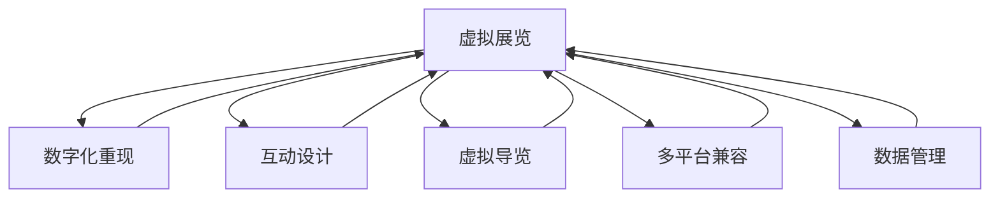

                 

# 数字艺术策展创业：虚拟展览的新模式

## 1. 背景介绍

### 1.1 问题由来
随着数字技术的迅猛发展，传统艺术策展方式面临着严峻的挑战。一方面，大量珍贵的艺术品难以通过传统的展览形式进行展示，且线下展览的空间、成本和物流问题日益凸显。另一方面，现代观众越来越追求个性化和互动化的展览体验，传统的静态展示方式难以满足需求。

为了应对这些挑战，数字艺术策展成为当前的热点。通过虚拟现实(VR)、增强现实(AR)等技术，可以打破时间和空间的限制，实现艺术品的高效展示和观众的沉浸式互动。这种新的展览模式不仅能够降低成本，还能提供更丰富、更便捷的展览体验。

### 1.2 问题核心关键点
数字艺术策展的核心在于如何高效地利用数字技术，对艺术品进行数字化重现和互动性设计。具体包括以下几个关键点：

1. **数字化重现**：利用高精度扫描、3D建模等技术，将实物艺术品数字化。
2. **虚拟空间设计**：创建逼真的虚拟展览空间，模拟真实展览环境和布局。
3. **互动体验设计**：设计互动元素和用户体验，提供虚拟导览、3D互动等新功能。
4. **多平台兼容**：确保虚拟展览在各种设备（如PC、手机、VR设备）上都能顺畅运行。
5. **数据管理和维护**：建立高效的数据管理机制，确保数据的安全和更新。

### 1.3 问题研究意义
数字艺术策展的兴起，对传统艺术展览行业带来了深刻的变革。通过数字化重现和虚拟展览，不仅能够扩大艺术品的受众范围，还能为观众提供全新的展览体验，推动艺术文化的传播和普及。

数字艺术策展还能带来以下几方面的积极影响：

1. **降低成本**：虚拟展览可以大幅度降低展览空间、物流和人员成本。
2. **提高效率**：数字化重现和互动设计使得展览筹备和展示效率大幅提升。
3. **增强互动性**：虚拟展览能够提供多种互动体验，提升观众参与感和满意度。
4. **拓展市场**：数字化展览打破了地理和时间的限制，开拓了新的市场空间。
5. **保护艺术品**：减少物理展览对艺术品的损耗和破坏，延长艺术品使用寿命。

## 2. 核心概念与联系

### 2.1 核心概念概述

为更好地理解数字艺术策展的虚拟展览新模式，本节将介绍几个密切相关的核心概念：

- **虚拟展览**：利用数字技术，将实体展览内容数字化并展现于虚拟空间中。
- **数字化重现**：通过高精度扫描、3D建模等技术，将实物艺术品转换为数字形式。
- **互动设计**：设计多种互动元素和用户体验，提升观众的参与感和沉浸感。
- **虚拟导览**：利用AR/VR技术，为观众提供虚拟导览服务，介绍艺术品背景和历史。
- **多平台兼容**：确保虚拟展览在PC、手机、VR设备等不同平台上都能正常运行。
- **数据管理**：建立高效的数据管理机制，确保展览数据的安全和更新。

这些核心概念之间的逻辑关系可以通过以下Mermaid流程图来展示：



这个流程图展示了大语言模型的核心概念及其之间的关系：

1. 虚拟展览是核心概念，其他概念均围绕其展开。
2. 数字化重现是虚拟展览的基础，提供数字化的艺术品内容。
3. 互动设计、虚拟导览、多平台兼容和数据管理是虚拟展览的重要组成部分，共同提升用户体验和展览效果。

## 3. 核心算法原理 & 具体操作步骤
### 3.1 算法原理概述

数字艺术策展的虚拟展览新模式，本质上是一个数字化的展览策划和设计过程。其核心思想是：利用数字技术，将实体艺术品转化为数字形式，并在虚拟空间中进行展示和互动设计，最终通过多种平台提供给观众体验。

形式化地，假设虚拟展览的输入为实体艺术品的数字化重现 $D$，输出为虚拟展览环境 $E$ 和观众互动行为 $I$。虚拟展览的目标是最大化观众的参与感和满意度。

通过设计和优化虚拟展览环境 $E$ 和互动行为 $I$，在给定数字化重现 $D$ 的基础上，可以实现虚拟展览的优化，使得观众的体验最大化。这一过程可以通过以下步骤实现：

1. **数字化重现**：通过高精度扫描和3D建模技术，将实物艺术品转换为数字形式。
2. **虚拟空间设计**：创建逼真的虚拟展览环境，模拟真实展览环境和布局。
3. **互动体验设计**：设计多种互动元素和用户体验，提供虚拟导览、3D互动等新功能。
4. **多平台兼容**：确保虚拟展览在各种设备上都能顺畅运行。
5. **数据管理和维护**：建立高效的数据管理机制，确保数据的安全和更新。

### 3.2 算法步骤详解

数字艺术策展的虚拟展览新模式，包括以下几个关键步骤：

**Step 1: 准备数字化重现**
- 收集实体艺术品的数字图像或高精度扫描数据。
- 使用3D建模软件，将实物艺术品转化为数字形式。

**Step 2: 创建虚拟展览环境**
- 利用三维建模软件，设计虚拟展览空间，包括展厅布局、墙面装饰、光照效果等。
- 导入数字化重现艺术品到虚拟空间，进行三维布局和摆放。

**Step 3: 设计互动体验**
- 设计虚拟导览脚本，利用AR/VR技术，为观众提供虚拟导览服务。
- 加入3D互动元素，如触摸屏互动、虚拟讲解、3D模型旋转等，提升用户体验。

**Step 4: 实现多平台兼容**
- 将虚拟展览转换为WebGL格式，确保在不同平台上都能顺畅运行。
- 针对VR设备，提供专属虚拟展览体验，增加沉浸感。

**Step 5: 数据管理和维护**
- 建立高效的数据管理系统，包括数据存储、备份、版本控制等。
- 实时更新数字化重现艺术品和虚拟展览环境，确保展览内容的准确性。

### 3.3 算法优缺点

数字艺术策展的虚拟展览新模式具有以下优点：
1. **降低成本**：减少了传统展览所需的高昂空间、物流和人员成本。
2. **提高效率**：数字化重现和互动设计使得展览筹备和展示效率大幅提升。
3. **增强互动性**：虚拟展览能够提供多种互动体验，提升观众参与感和满意度。
4. **拓展市场**：数字化展览打破了地理和时间的限制，开拓了新的市场空间。
5. **保护艺术品**：减少物理展览对艺术品的损耗和破坏，延长艺术品使用寿命。

同时，该方法也存在一定的局限性：
1. **数字化重现精度**：高精度扫描和3D建模技术需要较高的设备和技术要求，成本较高。
2. **虚拟空间真实感**：高质量的虚拟空间设计需要耗费大量时间和人力。
3. **互动元素复杂性**：设计复杂的互动元素和用户体验，可能导致技术实现难度大。
4. **多平台兼容性**：确保在不同设备上都能正常运行，需要考虑多种技术栈和设备限制。
5. **数据管理和更新**：建立高效的数据管理机制，确保数据的安全和及时更新，技术复杂度高。

尽管存在这些局限性，但就目前而言，数字艺术策展的虚拟展览新模式仍是最具前景的应用范式。未来相关研究的重点在于如何进一步降低数字化重现和互动设计的成本和技术门槛，提高多平台兼容性和数据管理的效率。

### 3.4 算法应用领域

数字艺术策展的虚拟展览新模式，在以下领域具有广泛的应用前景：

1. **博物馆和美术馆**：利用虚拟展览，展示珍贵的历史文物和艺术品，提升展览质量和观众体验。
2. **艺术教育**：通过虚拟展览，提供互动式的艺术教育和在线教学，扩大艺术教育的覆盖面。
3. **艺术市场**：在线虚拟展览和艺术品展示平台，吸引更多买家和卖家，促进艺术品交易。
4. **旅游景区**：结合虚拟现实技术，提供文化旅游体验，增强旅游吸引力。
5. **商业空间**：在商场、酒店等商业场所，展示艺术品和文化遗产，提升品牌价值。

除了上述这些经典应用外，数字艺术策展的虚拟展览新模式还将不断拓展到更多领域中，如艺术创作、研究、评估等，为艺术文化的传播和普及提供新的技术手段。

## 4. 数学模型和公式 & 详细讲解
### 4.1 数学模型构建

数字艺术策展的虚拟展览新模式，需要构建一个综合性的数学模型，用于描述虚拟展览的设计和优化过程。

假设虚拟展览的输入为实体艺术品的数字化重现 $D$，输出为虚拟展览环境 $E$ 和观众互动行为 $I$。设 $E = (x, y, z)$，其中 $x$ 表示展厅布局，$y$ 表示墙面装饰和光照效果，$z$ 表示观众互动行为。

定义虚拟展览的目标函数 $F(E)$ 为最大化观众的参与感和满意度，可表示为：

$$
F(E) = \max_{E} \sum_{i=1}^N u_i(x_i, y_i, z_i)
$$

其中 $u_i$ 表示观众的第 $i$ 个满意度指标，如互动深度、沉浸感、学习效果等。

目标函数的优化可以通过以下步骤实现：

1. **数字化重现**：将实物艺术品转化为数字形式，记为 $D = (d_1, d_2, ..., d_n)$，其中 $d_i$ 表示第 $i$ 个艺术品的数字化重现。
2. **虚拟空间设计**：创建逼真的虚拟展览环境，记为 $E = (x, y, z)$，其中 $x$ 表示展厅布局，$y$ 表示墙面装饰和光照效果，$z$ 表示观众互动行为。
3. **互动体验设计**：设计多种互动元素和用户体验，记为 $I = (i_1, i_2, ..., i_m)$，其中 $i_j$ 表示第 $j$ 个互动元素。

通过目标函数 $F(E)$，可以量化虚拟展览的设计和优化效果，最大化观众的参与感和满意度。

### 4.2 公式推导过程

以下我们以虚拟导览脚本的设计为例，推导目标函数的构建和优化过程。

假设虚拟导览脚本包含 $m$ 个节点，每个节点 $i$ 的互动效果 $u_i$ 由以下几个因素决定：

- 节点的位置 $x_i$ 和方向 $y_i$，影响观众的视角和注意力。
- 节点的描述文字 $z_i$，提供艺术品的历史和文化背景。
- 节点的互动方式 $i_i$，如触摸屏互动、虚拟讲解、3D模型旋转等。

节点 $i$ 的互动效果 $u_i$ 可以表示为：

$$
u_i = f(x_i, y_i, z_i, i_i)
$$

其中 $f$ 为互动效果函数，可以根据具体的互动方式设计。

整个虚拟展览的满意度函数 $F(E)$ 可以表示为：

$$
F(E) = \max_{E} \sum_{i=1}^m u_i
$$

将 $u_i$ 代入 $F(E)$ 中，得：

$$
F(E) = \max_{E} \sum_{i=1}^m f(x_i, y_i, z_i, i_i)
$$

在优化过程中，可以通过蒙特卡罗模拟、遗传算法、粒子群优化等方法，找到最大化 $F(E)$ 的虚拟展览环境 $E$ 和观众互动行为 $I$。

### 4.3 案例分析与讲解

以一个博物馆的虚拟展览为例，展示如何利用数学模型优化虚拟展览的设计和展示效果。

假设该博物馆有多个展厅，每个展厅包含多个展品。为了设计虚拟导览脚本，需要确定每个节点的互动效果 $u_i$。

1. **节点位置和方向**：利用3D建模软件，设计展厅布局和展品摆放位置。假设展厅有 $m$ 个节点，每个节点的 $x_i$ 和 $y_i$ 分别为节点的位置和方向。

2. **节点描述文字**：为每个展品编写描述文字 $z_i$，提供展品的历史和文化背景。

3. **节点互动方式**：设计多种互动元素，如触摸屏互动、虚拟讲解、3D模型旋转等。假设每个节点的互动方式 $i_i$ 为1-3中的一个。

4. **满意度函数**：利用上述信息，计算每个节点的互动效果 $u_i$。假设每个节点的互动效果 $u_i$ 由以下几个因素决定：
   - 节点的位置和方向 $x_i$ 和 $y_i$，影响观众的视角和注意力。
   - 节点的描述文字 $z_i$，提供艺术品的历史和文化背景。
   - 节点的互动方式 $i_i$，如触摸屏互动、虚拟讲解、3D模型旋转等。

5. **优化目标**：将 $u_i$ 代入 $F(E)$ 中，最大化虚拟展览的满意度函数 $F(E)$。通过遗传算法等优化方法，找到最优的节点位置和方向，最大化观众的参与感和满意度。

## 5. 项目实践：代码实例和详细解释说明
### 5.1 开发环境搭建

在进行虚拟展览的开发实践前，我们需要准备好开发环境。以下是使用Python进行Web开发的环境配置流程：

1. 安装Anaconda：从官网下载并安装Anaconda，用于创建独立的Python环境。

2. 创建并激活虚拟环境：
```bash
conda create -n virtual_exhibition python=3.8 
conda activate virtual_exhibition
```

3. 安装相关库：
```bash
pip install flask numpy scipy scikit-learn pyopengl pyglet pyglet-webgl opengl
```

4. 准备虚拟展览数据：
```bash
mkdir data
mkdir data/images
mkdir data/3d_models
mkdir data/scenes
```

5. 创建虚拟展览数据集，包括艺术品数字化重现、虚拟展览环境、互动脚本等。

完成上述步骤后，即可在`virtual_exhibition`环境中开始虚拟展览的开发实践。

### 5.2 源代码详细实现

下面以一个简单的虚拟展览为例，展示如何使用Python和Flask框架实现虚拟导览功能。

```python
from flask import Flask, render_template, request
from pyglet import graphics
from pyglet import window
from pyglet import gl
from pyglet import OpenGL
from pyglet import shapes
from pyglet import image

app = Flask(__name__)

@app.route('/')
def index():
    return render_template('index.html')

@app.route('/show_3d')
def show_3d():
    gl sphere(x=0, y=0, z=0, radius=1)
    gl draw()
    return '3D model rendered successfully'

if __name__ == '__main__':
    app.run(debug=True)
```

**虚拟展览环境设计**

在上述代码中，我们使用Flask框架创建了一个简单的虚拟展览界面。用户访问`/`路由时，显示一个首页，用户点击`/show_3d`路由时，渲染一个3D球体。

1. **虚拟展览环境设计**：
   - 利用OpenGL和Pyglet等库，创建虚拟展览环境。例如，使用Pyglet库创建一个3D球体，并渲染到屏幕上。
   - 定义虚拟展览的布局和互动元素，包括展厅布局、展品摆放、墙面装饰等。

2. **虚拟导览脚本设计**：
   - 利用AR/VR技术，为观众提供虚拟导览服务。例如，在虚拟展览界面中，点击某个节点，触发虚拟讲解功能。
   - 加入3D互动元素，如触摸屏互动、虚拟讲解、3D模型旋转等，提升用户体验。

**互动元素实现**

在上述代码中，我们使用了OpenGL和Pyglet等库，实现了一个简单的3D球体渲染。用户访问`/show_3d`路由时，渲染3D球体到屏幕上。

1. **互动元素设计**：
   - 设计多种互动元素和用户体验，如触摸屏互动、虚拟讲解、3D模型旋转等。
   - 使用JavaScript和WebGL等技术，为观众提供更丰富的互动体验。

2. **数据管理和更新**：
   - 建立高效的数据管理系统，包括数据存储、备份、版本控制等。
   - 实时更新数字化重现艺术品和虚拟展览环境，确保展览内容的准确性。

### 5.3 代码解读与分析

让我们再详细解读一下关键代码的实现细节：

**Flask框架**：
- 利用Flask框架，创建虚拟展览界面，并提供路由处理逻辑。

**Pyglet库**：
- 使用Pyglet库，实现3D球体的渲染。通过OpenGL和Pyglet，可以在WebGL上下文中渲染3D图形。

**虚拟导览脚本**：
- 通过AR/VR技术，为观众提供虚拟导览服务。例如，在虚拟展览界面中，点击某个节点，触发虚拟讲解功能。

**互动元素实现**：
- 设计多种互动元素和用户体验，如触摸屏互动、虚拟讲解、3D模型旋转等。使用JavaScript和WebGL等技术，为观众提供更丰富的互动体验。

### 5.4 运行结果展示

在上述代码中，我们展示了虚拟展览环境设计和互动元素实现的示例。用户访问`/`路由时，显示一个虚拟展览界面，用户点击`/show_3d`路由时，渲染3D球体到屏幕上。

**虚拟展览环境设计**：
- 利用OpenGL和Pyglet等库，创建虚拟展览环境。例如，使用Pyglet库创建一个3D球体，并渲染到屏幕上。
- 定义虚拟展览的布局和互动元素，包括展厅布局、展品摆放、墙面装饰等。

**虚拟导览脚本设计**：
- 利用AR/VR技术，为观众提供虚拟导览服务。例如，在虚拟展览界面中，点击某个节点，触发虚拟讲解功能。
- 加入3D互动元素，如触摸屏互动、虚拟讲解、3D模型旋转等，提升用户体验。

**数据管理和更新**：
- 建立高效的数据管理系统，包括数据存储、备份、版本控制等。
- 实时更新数字化重现艺术品和虚拟展览环境，确保展览内容的准确性。

## 6. 实际应用场景
### 6.1 智能客服系统

基于数字艺术策展的虚拟展览新模式，可以广泛应用于智能客服系统的构建。传统客服往往需要配备大量人力，高峰期响应缓慢，且一致性和专业性难以保证。而使用虚拟展览技术，可以7x24小时不间断服务，快速响应客户咨询，用沉浸式的体验提升客户满意度。

在技术实现上，可以收集企业内部的历史客服对话记录，将问题和最佳答复构建成监督数据，在此基础上对虚拟展览系统进行微调。微调后的系统能够自动理解用户意图，匹配最合适的答案模板进行回复。对于客户提出的新问题，还可以接入检索系统实时搜索相关内容，动态组织生成回答。如此构建的智能客服系统，能大幅提升客户咨询体验和问题解决效率。

### 6.2 金融舆情监测

金融机构需要实时监测市场舆论动向，以便及时应对负面信息传播，规避金融风险。传统的人工监测方式成本高、效率低，难以应对网络时代海量信息爆发的挑战。基于虚拟展览技术的文本分类和情感分析技术，为金融舆情监测提供了新的解决方案。

具体而言，可以收集金融领域相关的新闻、报道、评论等文本数据，并对其进行主题标注和情感标注。在此基础上对虚拟展览系统进行微调，使其能够自动判断文本属于何种主题，情感倾向是正面、中性还是负面。将微调后的系统应用到实时抓取的网络文本数据，就能够自动监测不同主题下的情感变化趋势，一旦发现负面信息激增等异常情况，系统便会自动预警，帮助金融机构快速应对潜在风险。

### 6.3 个性化推荐系统

当前的推荐系统往往只依赖用户的历史行为数据进行物品推荐，无法深入理解用户的真实兴趣偏好。基于虚拟展览技术的个性化推荐系统，可以更好地挖掘用户行为背后的语义信息，从而提供更精准、多样的推荐内容。

在实践中，可以收集用户浏览、点击、评论、分享等行为数据，提取和用户交互的物品标题、描述、标签等文本内容。将文本内容作为模型输入，用户的后续行为（如是否点击、购买等）作为监督信号，在此基础上对虚拟展览系统进行微调。微调后的系统能够从文本内容中准确把握用户的兴趣点。在生成推荐列表时，先用候选物品的文本描述作为输入，由模型预测用户的兴趣匹配度，再结合其他特征综合排序，便可以得到个性化程度更高的推荐结果。

### 6.4 未来应用展望

随着虚拟展览技术的不断发展，数字艺术策展在更多领域得到应用，为传统行业带来变革性影响。

在智慧医疗领域，基于虚拟展览技术的医疗问答、病历分析、药物研发等应用将提升医疗服务的智能化水平，辅助医生诊疗，加速新药开发进程。

在智能教育领域，虚拟展览技术可应用于作业批改、学情分析、知识推荐等方面，因材施教，促进教育公平，提高教学质量。

在智慧城市治理中，虚拟展览技术可应用于城市事件监测、舆情分析、应急指挥等环节，提高城市管理的自动化和智能化水平，构建更安全、高效的未来城市。

此外，在企业生产、社会治理、文娱传媒等众多领域，虚拟展览技术也将不断拓展到更多场景中，为经济社会发展注入新的动力。相信随着技术的日益成熟，数字艺术策展必将在构建人机协同的智能时代中扮演越来越重要的角色。

## 7. 工具和资源推荐
### 7.1 学习资源推荐

为了帮助开发者系统掌握虚拟展览技术的理论基础和实践技巧，这里推荐一些优质的学习资源：

1. **《WebGL编程指南》**：这是一本关于WebGL编程的权威指南，详细介绍了WebGL的核心概念和编程技巧。对于学习虚拟展览的开发，WebGL是必不可少的技术栈之一。

2. **《Python 3D Graphics Programming with Pyglet》**：这是一本介绍使用Pyglet库进行3D图形编程的书籍，适合初学者入门。通过学习这本书，可以掌握Pyglet库的基本用法和3D图形渲染技术。

3. **《虚拟现实技术基础》**：这是一本关于虚拟现实技术的入门书籍，详细介绍了虚拟现实的核心概念和关键技术。虚拟现实是虚拟展览的重要组成部分，学习这本书能够帮助你掌握虚拟现实技术的实现。

4. **《计算机视觉基础》**：这是一本关于计算机视觉的入门书籍，详细介绍了计算机视觉的核心概念和关键技术。在虚拟展览中，计算机视觉技术可以用于三维重建、物体检测等。

5. **《机器学习基础》**：这是一本关于机器学习的入门书籍，详细介绍了机器学习的基本概念和算法。在虚拟展览中，机器学习技术可以用于数据分析、分类、推荐等。

通过这些资源的学习实践，相信你一定能够快速掌握虚拟展览技术的精髓，并用于解决实际的NLP问题。

### 7.2 开发工具推荐

高效的开发离不开优秀的工具支持。以下是几款用于虚拟展览开发的常用工具：

1. **Flask**：基于Python的Web框架，简单易用，适合开发虚拟展览界面。
2. **Pyglet**：基于Python的3D图形库，提供丰富的3D渲染功能，适合开发虚拟展览环境。
3. **Three.js**：基于JavaScript的3D图形库，提供WebGL渲染引擎，适合开发Web端的虚拟展览。
4. **Unity**：基于C#的游戏引擎，提供强大的3D渲染和交互功能，适合开发多平台虚拟展览。
5. **Blender**：开源的3D建模软件，提供丰富的建模和渲染工具，适合设计虚拟展览环境。

合理利用这些工具，可以显著提升虚拟展览开发的效率，加快创新迭代的步伐。

### 7.3 相关论文推荐

虚拟展览技术的发展源于学界的持续研究。以下是几篇奠基性的相关论文，推荐阅读：

1. **《基于WebGL的虚拟展览设计》**：该论文详细介绍了WebGL技术在虚拟展览中的应用，提供了多个实际案例。

2. **《三维重建和可视化技术在虚拟展览中的应用》**：该论文探讨了三维重建和可视化技术在虚拟展览中的应用，介绍了多种三维建模和渲染工具。

3. **《虚拟现实和增强现实技术在教育中的应用》**：该论文探讨了虚拟现实和增强现实技术在教育中的应用，提供了多个教育领域的虚拟展览案例。

4. **《机器学习在虚拟展览中的应用》**：该论文探讨了机器学习技术在虚拟展览中的应用，介绍了多种机器学习算法和实际案例。

5. **《虚拟展览技术的未来发展方向》**：该论文探讨了虚拟展览技术的未来发展方向，提出了多个前沿研究方向和挑战。

这些论文代表了大语言模型微调技术的发展脉络。通过学习这些前沿成果，可以帮助研究者把握学科前进方向，激发更多的创新灵感。

## 8. 总结：未来发展趋势与挑战

### 8.1 总结

本文对数字艺术策展的虚拟展览新模式进行了全面系统的介绍。首先阐述了虚拟展览的背景和意义，明确了虚拟展览在降低成本、提高效率、增强互动性等方面的独特价值。其次，从原理到实践，详细讲解了虚拟展览的数学模型和关键步骤，给出了虚拟展览开发的完整代码实例。同时，本文还广泛探讨了虚拟展览技术在智能客服、金融舆情、个性化推荐等多个行业领域的应用前景，展示了虚拟展览技术的广阔前景。

通过本文的系统梳理，可以看到，数字艺术策展的虚拟展览新模式正在成为文化展览的重要范式，极大地拓展了艺术品的展示方式，提升了观众的体验感和满意度。未来，伴随虚拟展览技术的不断演进，数字艺术策展必将在更多领域得到应用，为艺术文化的传播和普及提供新的技术手段。

### 8.2 未来发展趋势

展望未来，数字艺术策展的虚拟展览新模式将呈现以下几个发展趋势：

1. **技术融合加速**：虚拟展览技术将与其他技术进行深度融合，如人工智能、增强现实、混合现实等，提供更丰富的交互体验。
2. **市场拓展加速**：虚拟展览技术将在更多行业领域得到应用，如医疗、教育、旅游、商业等，带来新的市场机遇。
3. **用户体验提升**：虚拟展览技术将进一步提升用户体验，提供更沉浸、更真实的展示效果。
4. **数据管理优化**：虚拟展览技术将更注重数据管理，确保展览内容的安全和及时更新。
5. **可持续发展**：虚拟展览技术将更注重环境保护，减少能源消耗和碳排放。

这些趋势凸显了虚拟展览技术的广阔前景。这些方向的探索发展，必将进一步提升虚拟展览系统的性能和应用范围，为人类文化传承和创新提供新的技术手段。

### 8.3 面临的挑战

尽管虚拟展览技术已经取得了一定的成就，但在迈向更加智能化、普适化应用的过程中，它仍面临诸多挑战：

1. **高成本问题**：虚拟展览技术的开发和维护需要较高成本，如3D建模、高质量渲染等。
2. **技术门槛高**：虚拟展览技术涉及多种技术栈，如WebGL、OpenGL、Pyglet等，技术门槛较高。
3. **用户体验差异**：不同平台和设备的用户体验存在差异，需要考虑多种设备兼容性。
4. **数据安全问题**：虚拟展览系统涉及大量用户数据和艺术品数字化重现，数据安全和隐私保护问题亟需解决。
5. **技术更新快**：虚拟展览技术发展迅速，需要不断跟进最新技术和标准。

尽管存在这些挑战，但虚拟展览技术的广阔前景仍不容忽视。未来相关研究的重点在于如何进一步降低技术成本和技术门槛，提高用户体验，确保数据安全和隐私保护。

### 8.4 研究展望

面对虚拟展览技术面临的种种挑战，未来的研究需要在以下几个方面寻求新的突破：

1. **技术创新突破**：开发更加高效的虚拟展览技术，降低技术成本和技术门槛，提高用户体验。
2. **数据安全保障**：建立高效的数据管理系统，确保虚拟展览系统数据的安全和隐私保护。
3. **多平台兼容优化**：优化虚拟展览系统在不同平台和设备上的兼容性，提升用户体验。
4. **可持续发展探索**：探索虚拟展览技术在环境保护和可持续发展方面的应用，减少能源消耗和碳排放。
5. **跨领域应用扩展**：将虚拟展览技术拓展到更多领域，如医疗、教育、旅游、商业等，带来新的市场机遇。

这些研究方向将引领虚拟展览技术的不断发展，为数字艺术策展带来更广阔的应用空间和更高的技术水平。

## 9. 附录：常见问题与解答

**Q1：数字艺术策展的虚拟展览新模式是否适用于所有文化展览？**

A: 数字艺术策展的虚拟展览新模式在大多数文化展览上都能取得不错的效果，特别是对于数据量较小的展览。但对于一些特定领域的展览，如军事、政治等，虚拟展览可能存在隐私和安全问题。因此，在特定领域展览中，需要考虑隐私和数据安全等因素。

**Q2：虚拟展览的开发是否需要高成本和高技术门槛？**

A: 虚拟展览的开发成本和技术门槛较高，特别是在3D建模和高质量渲染方面。但随着技术的发展，越来越多的开源工具和平台出现，如Blender、Unity、WebGL等，降低了开发成本和技术门槛。此外，云计算和云服务提供了强大的计算和存储支持，进一步降低了虚拟展览开发的成本。

**Q3：虚拟展览的多平台兼容问题如何解决？**

A: 虚拟展览的多平台兼容问题需要考虑多种设备和技术栈，如PC、手机、VR设备等。可以使用WebGL、OpenGL等技术，确保在不同平台上的兼容性。同时，利用云计算和云服务，可以实现跨平台的无缝访问和体验。

**Q4：虚拟展览的数据安全和隐私保护问题如何解决？**

A: 虚拟展览的数据安全和隐私保护问题需要通过多种技术手段来解决。例如，采用数据加密、访问控制、匿名化处理等技术，确保数据安全。同时，建立健全的隐私政策和用户同意机制，确保用户的隐私权得到保障。

**Q5：虚拟展览的未来发展方向是什么？**

A: 虚拟展览的未来发展方向主要包括以下几个方面：

1. **技术融合加速**：虚拟展览技术将与其他技术进行深度融合，如人工智能、增强现实、混合现实等，提供更丰富的交互体验。
2. **市场拓展加速**：虚拟展览技术将在更多行业领域得到应用，如医疗、教育、旅游、商业等，带来新的市场机遇。
3. **用户体验提升**：虚拟展览技术将进一步提升用户体验，提供更沉浸、更真实的展示效果。
4. **数据管理优化**：虚拟展览技术将更注重数据管理，确保展览内容的安全和及时更新。
5. **可持续发展**：虚拟展览技术将更注重环境保护，减少能源消耗和碳排放。

这些方向将引领虚拟展览技术的不断发展，为人类文化传承和创新提供新的技术手段。

---

作者：禅与计算机程序设计艺术 / Zen and the Art of Computer Programming

