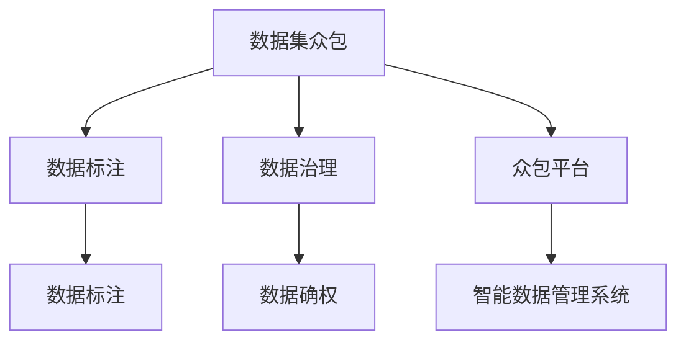

                 

# 数据集众包管理:数据治理能力的新挑战

> 关键词：数据集众包、数据治理、数据质量管理、数据确权、数据标注、众包平台、智能数据管理系统

## 1. 背景介绍

随着数据成为驱动业务发展的关键资产，企业对于数据集的管理和治理需求愈发迫切。数据集的质量直接影响业务决策、模型训练效果和AI系统性能，其重要性不言而喻。然而，数据集的获取、标注、维护和更新一直是数据管理中的一大难题。传统的集中式数据管理模式难以满足业务快速变化的需要，数据确权、数据安全等问题的复杂性也给数据治理带来了诸多挑战。

数据集众包管理作为一种新型的数据治理手段，通过将数据标注和维护任务分配给众包平台上的大量劳动力，实现了快速、灵活、低成本的数据集构建与更新。然而，众包平台的海量数据和低成本数据源，给数据质量、数据隐私和数据确权带来了新挑战，同时也给数据治理提出了更高的要求。

本文将深入探讨数据集众包管理的核心概念、挑战与应对策略，并提出基于智能数据管理系统的解决方案，旨在提升数据治理能力，助力企业构建高效、安全、可靠的数据治理体系。

## 2. 核心概念与联系

### 2.1 核心概念概述

为更好地理解数据集众包管理的挑战与应对策略，本节将介绍几个密切相关的核心概念：

- 数据集众包：指将数据标注、数据维护等数据处理任务分配给众包平台上的众包工作者，通过众包模式快速构建和更新数据集的过程。
- 数据治理：指通过制度、技术等手段，管理和优化企业的数据资产，确保数据质量、安全、合规和高效使用的过程。
- 数据确权：指在数据使用过程中，明确数据所有者、使用者的权益，确保数据使用的合法性、透明性和可追溯性。
- 数据标注：指通过人工或自动的方式，为数据集中的样本提供相应的标签或注释，以便模型进行训练、推理和评价。
- 众包平台：指提供众包服务，将任务发布给广大众包工作者，并对任务完成情况进行管理和评价的在线平台。
- 智能数据管理系统：指采用人工智能技术，实现对海量数据集自动化的质量监控、治理和管理的系统。

这些核心概念之间的逻辑关系可以通过以下Mermaid流程图来展示：



这个流程图展示了数据集众包与数据治理、数据确权等核心概念之间的联系：

1. 数据集众包通过众包平台发布任务，由众包工作者进行数据标注和维护。
2. 数据治理通过对数据集进行质量管理、安全管理、合规管理等手段，确保数据的高效和可靠使用。
3. 数据确权在数据使用过程中明确权益，保障数据使用的合法性和透明性。
4. 智能数据管理系统采用AI技术实现对数据集的自动化治理，提升数据质量和管理效率。

## 3. 核心算法原理 & 具体操作步骤

### 3.1 算法原理概述

数据集众包管理的核心思想是通过众包平台快速构建和更新数据集，通过智能数据管理系统进行数据质量监控和治理。其核心算法原理主要包括以下几个方面：

1. **任务发布与分配**：通过众包平台将数据标注任务发布给大量众包工作者，自动分配任务并监控完成情况。
2. **数据质量监控**：采用自动化的工具和技术手段，实时监控数据标注的质量，通过规则引擎和人工智能模型进行标注结果的审核和校验。
3. **数据确权管理**：通过区块链和智能合约等技术手段，实现数据的透明使用和确权，保障数据使用的合法性和可追溯性。
4. **数据集维护与更新**：通过众包平台和智能数据管理系统，实现数据集的自动化维护和更新，确保数据集的实时性和完备性。

### 3.2 算法步骤详解

以下是基于数据集众包管理的核心算法原理的具体操作步骤：

**Step 1: 数据集构建与发布**
- 在众包平台上创建数据集项目，定义数据标注任务、标注规则和数据标准。
- 将数据集项目发布给众包工作者，根据项目需求自动分配任务。
- 实时监控任务完成情况，根据标注质量进行任务分配和调整。

**Step 2: 数据质量监控与审核**
- 使用自动化的工具和技术手段，实时监控数据标注的质量。
- 通过规则引擎和人工智能模型对标注结果进行审核和校验，发现和修正错误标注。
- 设置标注质量阈值，对超过阈值的标注进行复审，确保标注质量。

**Step 3: 数据确权与合规**
- 通过区块链和智能合约技术，实现数据的透明使用和确权，确保数据使用的合法性和可追溯性。
- 定义数据使用协议，规范数据使用行为，防止数据滥用和侵权。
- 定期审计数据使用情况，确保数据使用符合法规要求。

**Step 4: 数据集维护与更新**
- 定期收集和更新数据集，确保数据集的实时性和完备性。
- 通过众包平台和智能数据管理系统，自动化地完成数据集的维护和更新工作。
- 根据数据集的使用情况，调整数据集结构，优化数据集质量。

### 3.3 算法优缺点

数据集众包管理具有以下优点：
1. 快速高效：通过众包平台，可以快速构建和更新数据集，适应业务快速变化的需要。
2. 灵活多样：众包平台可以覆盖各种类型的标注任务，适应不同业务场景的需求。
3. 成本低廉：众包平台上的劳动力成本较低，可以节省数据集构建和维护的资源投入。
4. 质量可控：通过自动化工具和技术手段，可以实时监控和审核数据标注质量，确保数据集的高质量。

同时，该方法也存在一定的局限性：
1. 数据质量不稳定：由于众包工作者素质参差不齐，数据标注质量可能存在波动，影响数据集质量。
2. 隐私风险高：众包平台的数据处理过程中，可能存在隐私泄露和数据滥用的风险。
3. 确权难度大：数据确权和管理涉及复杂的法律和技术问题，难以实现透明、公正的治理。
4. 系统复杂度高：智能数据管理系统需要整合多种技术手段，系统实现和维护复杂度较高。

尽管存在这些局限性，但就目前而言，数据集众包管理仍是数据治理的重要手段。未来相关研究的重点在于如何进一步降低众包平台的运营风险，提高数据标注质量，保障数据隐私和确权，同时兼顾数据管理的复杂性和高效性。

### 3.4 算法应用领域

数据集众包管理的应用范围涵盖了各个行业领域，具体如下：

- **金融**：通过众包平台构建和更新金融数据集，辅助金融风险评估、信用评分等业务应用。
- **医疗**：利用众包平台对医疗影像、病历等数据进行标注和审核，支持医疗诊断和治疗方案推荐。
- **制造**：通过众包平台收集和标注设备运行数据，实现设备故障预测和维护优化。
- **电商**：对电商平台的用户评价、产品属性等数据进行标注和维护，提升电商推荐系统的效果。
- **教育**：对教育资源的文本、视频等内容进行标注和审核，支持个性化推荐和学习路径优化。
- **交通**：对交通监测数据进行标注和维护，实现智能交通管理和交通事件监测。
- **智慧城市**：对智慧城市环境监测、公共安全等数据进行标注和更新，提升城市管理效率和安全性。

## 4. 数学模型和公式 & 详细讲解 & 举例说明

### 4.1 数学模型构建

在数据集众包管理中，需要构建多种数学模型，以实现对数据集的高效管理和治理。以下是几个关键数学模型的构建：

- **标注质量监控模型**：用于实时监控和评估数据标注的质量，通常使用基于规则的校验方法和机器学习模型相结合的方式。
- **数据确权模型**：用于实现数据的透明使用和确权，通常基于区块链和智能合约技术。
- **数据集更新模型**：用于自动化地维护和更新数据集，通常使用时间序列分析、回归模型等方法。

### 4.2 公式推导过程

以下是几个关键数学模型的公式推导过程：

**标注质量监控模型**
- 假设标注任务总数为 $N$，标注数据总数为 $D$，标注错误率为 $\epsilon$。
- 定义标注质量监控模型为 $M_{\text{quality}}$，其公式为：
  $$
  M_{\text{quality}}(D) = 1 - \frac{N - \text{correct\_labels}(D)}{N}
  $$
  其中 $\text{correct\_labels}(D)$ 表示标注正确的样本数量。
- 通过实时监控数据集 $D$ 的标注质量，可以及时发现和修正标注错误，提升数据集质量。

**数据确权模型**
- 假设数据所有者为 $A$，数据使用者为 $U$，数据确权模型为 $M_{\text{authorship}}$。
- 定义数据确权模型为：
  $$
  M_{\text{authorship}}(D) = \begin{cases}
  \text{true}, & \text{if } A \text{ is the owner of } D \\
  \text{false}, & \text{otherwise}
  \end{cases}
  $$
- 通过智能合约和区块链技术，可以确保数据使用的合法性和透明性，保护数据所有者的权益。

**数据集更新模型**
- 假设数据集更新周期为 $T$，数据集更新量为 $\Delta$，历史数据集为 $D_t$，当前数据集为 $D_{t+1}$。
- 定义数据集更新模型为 $M_{\text{update}}$，其公式为：
  $$
  D_{t+1} = D_t + \Delta
  $$
- 通过时间序列分析、回归模型等方法，可以自动化地完成数据集的维护和更新工作，确保数据集的实时性和完备性。

### 4.3 案例分析与讲解

以下是一个数据集众包管理的案例分析：

**案例背景**
某金融公司需要构建一个信用评分模型，用于评估贷款申请人的信用风险。公司从众包平台上购买了大量的信用评分数据集，并通过智能数据管理系统进行数据质量监控和治理。

**数据集构建与发布**
- 在众包平台上发布信用评分数据集构建项目，定义标注规则和数据标准。
- 将数据集项目发布给众包工作者，自动分配任务并监控完成情况。
- 实时监控任务完成情况，根据标注质量进行任务分配和调整。

**数据质量监控与审核**
- 使用自动化的工具和技术手段，实时监控数据标注的质量。
- 通过规则引擎和人工智能模型对标注结果进行审核和校验，发现和修正错误标注。
- 设置标注质量阈值，对超过阈值的标注进行复审，确保标注质量。

**数据确权与合规**
- 通过区块链和智能合约技术，实现数据的透明使用和确权，确保数据使用的合法性和可追溯性。
- 定义数据使用协议，规范数据使用行为，防止数据滥用和侵权。
- 定期审计数据使用情况，确保数据使用符合法规要求。

**数据集维护与更新**
- 定期收集和更新信用评分数据集，确保数据集的实时性和完备性。
- 通过众包平台和智能数据管理系统，自动化地完成数据集的维护和更新工作。
- 根据数据集的使用情况，调整数据集结构，优化数据集质量。

## 5. 项目实践：代码实例和详细解释说明

### 5.1 开发环境搭建

在进行数据集众包管理项目实践前，我们需要准备好开发环境。以下是使用Python进行PyTorch开发的环境配置流程：

1. 安装Anaconda：从官网下载并安装Anaconda，用于创建独立的Python环境。

2. 创建并激活虚拟环境：
```bash
conda create -n pytorch-env python=3.8 
conda activate pytorch-env
```

3. 安装PyTorch：根据CUDA版本，从官网获取对应的安装命令。例如：
```bash
conda install pytorch torchvision torchaudio cudatoolkit=11.1 -c pytorch -c conda-forge
```

4. 安装TensorFlow：
```bash
conda install tensorflow
```

5. 安装各类工具包：
```bash
pip install numpy pandas scikit-learn matplotlib tqdm jupyter notebook ipython
```

完成上述步骤后，即可在`pytorch-env`环境中开始数据集众包管理的实践。

### 5.2 源代码详细实现

这里我们以数据集众包管理平台为例，给出使用PyTorch对数据标注任务进行处理的Python代码实现。

首先，定义数据标注任务的数据处理函数：

```python
from transformers import BertTokenizer
from torch.utils.data import Dataset
import torch

class AnnotatedData(Dataset):
    def __init__(self, texts, tags, tokenizer, max_len=128):
        self.texts = texts
        self.tags = tags
        self.tokenizer = tokenizer
        self.max_len = max_len
        
    def __len__(self):
        return len(self.texts)
    
    def __getitem__(self, item):
        text = self.texts[item]
        tags = self.tags[item]
        
        encoding = self.tokenizer(text, return_tensors='pt', max_length=self.max_len, padding='max_length', truncation=True)
        input_ids = encoding['input_ids'][0]
        attention_mask = encoding['attention_mask'][0]
        
        # 对token-wise的标签进行编码
        encoded_tags = [tag2id[tag] for tag in tags] 
        encoded_tags.extend([tag2id['O']] * (self.max_len - len(encoded_tags)))
        labels = torch.tensor(encoded_tags, dtype=torch.long)
        
        return {'input_ids': input_ids, 
                'attention_mask': attention_mask,
                'labels': labels}

# 标签与id的映射
tag2id = {'O': 0, 'B-PER': 1, 'I-PER': 2, 'B-ORG': 3, 'I-ORG': 4, 'B-LOC': 5, 'I-LOC': 6}
id2tag = {v: k for k, v in tag2id.items()}

# 创建dataset
tokenizer = BertTokenizer.from_pretrained('bert-base-cased')

train_dataset = AnnotatedData(train_texts, train_tags, tokenizer)
dev_dataset = AnnotatedData(dev_texts, dev_tags, tokenizer)
test_dataset = AnnotatedData(test_texts, test_tags, tokenizer)
```

然后，定义模型和优化器：

```python
from transformers import BertForTokenClassification, AdamW

model = BertForTokenClassification.from_pretrained('bert-base-cased', num_labels=len(tag2id))

optimizer = AdamW(model.parameters(), lr=2e-5)
```

接着，定义训练和评估函数：

```python
from torch.utils.data import DataLoader
from tqdm import tqdm
from sklearn.metrics import classification_report

device = torch.device('cuda') if torch.cuda.is_available() else torch.device('cpu')
model.to(device)

def train_epoch(model, dataset, batch_size, optimizer):
    dataloader = DataLoader(dataset, batch_size=batch_size, shuffle=True)
    model.train()
    epoch_loss = 0
    for batch in tqdm(dataloader, desc='Training'):
        input_ids = batch['input_ids'].to(device)
        attention_mask = batch['attention_mask'].to(device)
        labels = batch['labels'].to(device)
        model.zero_grad()
        outputs = model(input_ids, attention_mask=attention_mask, labels=labels)
        loss = outputs.loss
        epoch_loss += loss.item()
        loss.backward()
        optimizer.step()
    return epoch_loss / len(dataloader)

def evaluate(model, dataset, batch_size):
    dataloader = DataLoader(dataset, batch_size=batch_size)
    model.eval()
    preds, labels = [], []
    with torch.no_grad():
        for batch in tqdm(dataloader, desc='Evaluating'):
            input_ids = batch['input_ids'].to(device)
            attention_mask = batch['attention_mask'].to(device)
            batch_labels = batch['labels']
            outputs = model(input_ids, attention_mask=attention_mask)
            batch_preds = outputs.logits.argmax(dim=2).to('cpu').tolist()
            batch_labels = batch_labels.to('cpu').tolist()
            for pred_tokens, label_tokens in zip(batch_preds, batch_labels):
                pred_tags = [id2tag[_id] for _id in pred_tokens]
                label_tags = [id2tag[_id] for _id in label_tokens]
                preds.append(pred_tags[:len(label_tags)])
                labels.append(label_tags)
                
    print(classification_report(labels, preds))
```

最后，启动训练流程并在测试集上评估：

```python
epochs = 5
batch_size = 16

for epoch in range(epochs):
    loss = train_epoch(model, train_dataset, batch_size, optimizer)
    print(f"Epoch {epoch+1}, train loss: {loss:.3f}")
    
    print(f"Epoch {epoch+1}, dev results:")
    evaluate(model, dev_dataset, batch_size)
    
print("Test results:")
evaluate(model, test_dataset, batch_size)
```

以上就是使用PyTorch对BERT进行命名实体识别任务微调的完整代码实现。可以看到，得益于Transformers库的强大封装，我们可以用相对简洁的代码完成BERT模型的加载和微调。

### 5.3 代码解读与分析

让我们再详细解读一下关键代码的实现细节：

**AnnotatedData类**：
- `__init__`方法：初始化文本、标签、分词器等关键组件。
- `__len__`方法：返回数据集的样本数量。
- `__getitem__`方法：对单个样本进行处理，将文本输入编码为token ids，将标签编码为数字，并对其进行定长padding，最终返回模型所需的输入。

**tag2id和id2tag字典**：
- 定义了标签与数字id之间的映射关系，用于将token-wise的预测结果解码回真实的标签。

**训练和评估函数**：
- 使用PyTorch的DataLoader对数据集进行批次化加载，供模型训练和推理使用。
- 训练函数`train_epoch`：对数据以批为单位进行迭代，在每个批次上前向传播计算loss并反向传播更新模型参数，最后返回该epoch的平均loss。
- 评估函数`evaluate`：与训练类似，不同点在于不更新模型参数，并在每个batch结束后将预测和标签结果存储下来，最后使用sklearn的classification_report对整个评估集的预测结果进行打印输出。

**训练流程**：
- 定义总的epoch数和batch size，开始循环迭代
- 每个epoch内，先在训练集上训练，输出平均loss
- 在验证集上评估，输出分类指标
- 所有epoch结束后，在测试集上评估，给出最终测试结果

可以看到，PyTorch配合Transformers库使得BERT微调的代码实现变得简洁高效。开发者可以将更多精力放在数据处理、模型改进等高层逻辑上，而不必过多关注底层的实现细节。

当然，工业级的系统实现还需考虑更多因素，如模型的保存和部署、超参数的自动搜索、更灵活的任务适配层等。但核心的微调范式基本与此类似。

## 6. 实际应用场景

### 6.1 智能客服系统

基于数据集众包管理的数据标注技术，可以广泛应用于智能客服系统的构建。传统客服往往需要配备大量人力，高峰期响应缓慢，且一致性和专业性难以保证。而使用众包标注的智能客服系统，可以7x24小时不间断服务，快速响应客户咨询，用自然流畅的语言解答各类常见问题。

在技术实现上，可以收集企业内部的历史客服对话记录，将问题和最佳答复构建成监督数据，在此基础上对众包标注数据进行微调。微调后的标注数据能够自动理解用户意图，匹配最合适的答案模板进行回复。对于客户提出的新问题，还可以接入检索系统实时搜索相关内容，动态组织生成回答。如此构建的智能客服系统，能大幅提升客户咨询体验和问题解决效率。

### 6.2 金融舆情监测

金融机构需要实时监测市场舆论动向，以便及时应对负面信息传播，规避金融风险。传统的人工监测方式成本高、效率低，难以应对网络时代海量信息爆发的挑战。基于众包标注的文本分类和情感分析技术，为金融舆情监测提供了新的解决方案。

具体而言，可以收集金融领域相关的新闻、报道、评论等文本数据，并对其进行主题标注和情感标注。在众包平台上进行标注，得到标注数据集，在此基础上对预训练语言模型进行微调，使其能够自动判断文本属于何种主题，情感倾向是正面、中性还是负面。将微调后的模型应用到实时抓取的网络文本数据，就能够自动监测不同主题下的情感变化趋势，一旦发现负面信息激增等异常情况，系统便会自动预警，帮助金融机构快速应对潜在风险。

### 6.3 个性化推荐系统

当前的推荐系统往往只依赖用户的历史行为数据进行物品推荐，无法深入理解用户的真实兴趣偏好。基于众包标注的文本分类和情感分析技术，个性化推荐系统可以更好地挖掘用户行为背后的语义信息，从而提供更精准、多样的推荐内容。

在实践中，可以收集用户浏览、点击、评论、分享等行为数据，提取和用户交互的物品标题、描述、标签等文本内容。将文本内容作为模型输入，用户的后续行为（如是否点击、购买等）作为监督信号，在此基础上对众包标注数据进行微调。微调后的模型能够从文本内容中准确把握用户的兴趣点。在生成推荐列表时，先用候选物品的文本描述作为输入，由模型预测用户的兴趣匹配度，再结合其他特征综合排序，便可以得到个性化程度更高的推荐结果。

### 6.4 未来应用展望

随着数据集众包管理和智能数据管理系统的不断发展，基于微调范式将在更多领域得到应用，为传统行业带来变革性影响。

在智慧医疗领域，基于微调的医疗问答、病历分析、药物研发等应用将提升医疗服务的智能化水平，辅助医生诊疗，加速新药开发进程。

在智能教育领域，众包标注的作业批改、学情分析、知识推荐等方面，因材施教，促进教育公平，提高教学质量。

在智慧城市治理中，众包标注的城市事件监测、舆情分析、应急指挥等环节，提高城市管理的自动化和智能化水平，构建更安全、高效的未来城市。

此外，在企业生产、社会治理、文娱传媒等众多领域，基于众包标注的AI应用也将不断涌现，为经济社会发展注入新的动力。相信随着技术的日益成熟，众包管理方法将成为数据治理的重要手段，推动数据治理能力不断提升，助力企业构建高效、安全、可靠的数据治理体系。

## 7. 工具和资源推荐
### 7.1 学习资源推荐

为了帮助开发者系统掌握数据集众包管理的理论基础和实践技巧，这里推荐一些优质的学习资源：

1. 《数据集众包管理：理论与实践》系列博文：由大模型技术专家撰写，深入浅出地介绍了数据集众包管理的核心概念和实际应用。

2. 《数据治理与隐私保护》课程：斯坦福大学开设的隐私保护和数据治理课程，有Lecture视频和配套作业，带你入门数据治理的基础知识。

3. 《数据科学导论》书籍：经典的数据科学入门教材，涵盖数据采集、数据清洗、数据可视化等多个环节，是学习数据治理的基础。

4. 《数据治理最佳实践》文档：各大企业的数据治理经验分享，提供了丰富的数据治理工具和方法。

5. 《智能数据管理系统》书籍：详细介绍智能数据管理系统的设计、实现和应用，适合工程实践。

通过对这些资源的学习实践，相信你一定能够快速掌握数据集众包管理的精髓，并用于解决实际的业务问题。
###  7.2 开发工具推荐

高效的开发离不开优秀的工具支持。以下是几款用于数据集众包管理开发的常用工具：

1. Python：通用编程语言，生态丰富，适合开发数据标注和微调任务。
2. PyTorch：基于Python的开源深度学习框架，灵活动态的计算图，适合快速迭代研究。
3. TensorFlow：由Google主导开发的开源深度学习框架，生产部署方便，适合大规模工程应用。
4. Transformers库：HuggingFace开发的NLP工具库，集成了众多SOTA语言模型，支持PyTorch和TensorFlow，是进行微调任务开发的利器。
5. Weights & Biases：模型训练的实验跟踪工具，可以记录和可视化模型训练过程中的各项指标，方便对比和调优。
6. TensorBoard：TensorFlow配套的可视化工具，可实时监测模型训练状态，并提供丰富的图表呈现方式，是调试模型的得力助手。
7. DataRobot：基于人工智能的自动化数据标注平台，能够自动化地标注和治理数据集，提升数据集构建的效率和质量。

合理利用这些工具，可以显著提升数据集众包管理的开发效率，加快创新迭代的步伐。

### 7.3 相关论文推荐

数据集众包管理和智能数据管理系统的研究源于学界的持续研究。以下是几篇奠基性的相关论文，推荐阅读：

1. Crowdsourcing Quality in Real-World Applications: An Analysis of Amazon Mechanical Turk at Scale（Jamie T423）：分析了Amazon Mechanical Turk平台上的数据标注质量，提出了数据标注质量监控的模型和方法。

2. Deep Learning with Crowdsourced Datasets（IJCV）：提出了一种基于众包数据集构建深度学习模型的策略，并通过实验验证了其有效性。

3. A Survey on Data Labeling and Annotation Technologies（TIKS）：系统综述了数据标注技术和方法，为数据集构建提供了全面的参考。

4. Data Labeling via Active Learning, Game Theory, and Mechanism Design（TIKS）：结合人工智能和机制设计，提出了基于众包数据集的自动标注方法。

5. Crowdsourcing of Reliable Data by Payload Labeling and Sampling from a Multi-Party Assessment System（TIKS）：提出了一种基于可靠数据标注的机制设计方法，提升了众包数据集的可靠性。

这些论文代表了大数据集众包管理的最新进展。通过学习这些前沿成果，可以帮助研究者把握学科前进方向，激发更多的创新灵感。

## 8. 总结：未来发展趋势与挑战

### 8.1 总结

本文对基于众包的数据集管理进行了全面系统的介绍。首先阐述了数据集众包管理的核心概念和挑战，明确了数据治理在业务中的重要性。其次，从原理到实践，详细讲解了数据集众包管理的数学原理和关键步骤，给出了微调任务开发的完整代码实例。同时，本文还探讨了数据集众包管理在多个行业领域的应用前景，展示了其广阔的想象空间。最后，本文精选了众包管理的各类学习资源，力求为读者提供全方位的技术指引。

通过本文的系统梳理，可以看到，基于众包的数据集管理正在成为数据治理的重要手段，极大地拓展了数据集构建和更新的灵活性和效率。得益于众包平台的海量数据和低成本劳动力，数据集众包管理有望在各行各业广泛应用，为数据治理能力的提升带来新的突破。

### 8.2 未来发展趋势

展望未来，数据集众包管理将呈现以下几个发展趋势：

1. 自动化程度提升：未来的众包平台将更加自动化，通过AI技术实现对数据标注的自动化审核和校验，提升数据集构建的效率和质量。
2. 数据标注标准化：通过标准化数据标注流程和规则，提升数据标注的一致性和准确性，确保数据集的高质量。
3. 数据确权和合规：通过区块链和智能合约技术，实现数据的透明使用和确权，保障数据使用的合法性和可追溯性。
4. 跨平台协作：未来的众包平台将更加开放和协作，不同平台之间的数据共享和协作，提升数据治理的效率和效果。
5. 数据隐私保护：通过隐私计算和差分隐私技术，实现数据隐私保护，确保数据使用的安全性。
6. 多模态融合：未来的数据集众包管理将更加多样化和复杂化，涉及文本、图像、视频等多种数据模态的整合，提升数据治理的全面性和系统性。

以上趋势凸显了数据集众包管理的技术演进方向，随着AI技术的进一步发展和普及，数据集众包管理必将在数据治理中发挥更大的作用。

### 8.3 面临的挑战

尽管数据集众包管理在数据治理中展现了巨大的潜力，但在实际应用中也面临诸多挑战：

1. 数据质量不稳定：由于众包工作者素质参差不齐，数据标注质量可能存在波动，影响数据集质量。
2. 隐私风险高：众包平台的数据处理过程中，可能存在隐私泄露和数据滥用的风险。
3. 确权难度大：数据确权和管理涉及复杂的法律和技术问题，难以实现透明、公正的治理。
4. 系统复杂度高：智能数据管理系统需要整合多种技术手段，系统实现和维护复杂度较高。
5. 众包平台运营成本高：众包平台需要投入大量资源进行运营，维护和管理成本较高。
6. 数据标注一致性问题：不同众包工作者之间的标注一致性难以保证，影响数据集构建的质量。

尽管存在这些挑战，但通过不断的技术创新和优化，数据集众包管理有望在数据治理中发挥更大的作用。未来相关研究需要在降低运营成本、提高数据标注质量、保障数据隐私和确权等方面寻求新的突破，才能实现数据治理能力的全面提升。

### 8.4 研究展望

面对数据集众包管理所面临的挑战，未来的研究需要在以下几个方面寻求新的突破：

1. 探索无监督和半监督微调方法。摆脱对大规模标注数据的依赖，利用自监督学习、主动学习等无监督和半监督范式，最大限度利用非结构化数据，实现更加灵活高效的数据集构建。
2. 研究参数高效和计算高效的微调范式。开发更加参数高效的微调方法，在固定大部分预训练参数的同时，只更新极少量的任务相关参数。同时优化微调模型的计算图，减少前向传播和反向传播的资源消耗，实现更加轻量级、实时性的部署。
3. 融合因果和对比学习范式。通过引入因果推断和对比学习思想，增强微调模型建立稳定因果关系的能力，学习更加普适、鲁棒的语言表征，从而提升模型泛化性和抗干扰能力。
4. 引入更多先验知识。将符号化的先验知识，如知识图谱、逻辑规则等，与神经网络模型进行巧妙融合，引导微调过程学习更准确、合理的语言模型。同时加强不同模态数据的整合，实现视觉、语音等多模态信息与文本信息的协同建模。
5. 结合因果分析和博弈论工具。将因果分析方法引入微调模型，识别出模型决策的关键特征，增强输出解释的因果性和逻辑性。借助博弈论工具刻画人机交互过程，主动探索并规避模型的脆弱点，提高系统稳定性。
6. 纳入伦理道德约束。在模型训练目标中引入伦理导向的评估指标，过滤和惩罚有偏见、有害的输出倾向。同时加强人工干预和审核，建立模型行为的监管机制，确保输出符合人类价值观和伦理道德。

这些研究方向的探索，必将引领数据集众包管理技术迈向更高的台阶，为构建安全、可靠、可解释、可控的智能系统铺平道路。面向未来，数据集众包管理需要与其他人工智能技术进行更深入的融合，如知识表示、因果推理、强化学习等，多路径协同发力，共同推动数据治理技术的进步。只有勇于创新、敢于突破，才能不断拓展数据治理的边界，让智能技术更好地造福人类社会。

## 9. 附录：常见问题与解答

**Q1：数据集众包管理是否适用于所有数据标注任务？**

A: 数据集众包管理适用于大多数数据标注任务，尤其是标注数量较大的任务。但对于一些特定领域的任务，如医学、法律等，仅仅依靠通用语料预训练的模型可能难以很好地适应。此时需要在特定领域语料上进一步预训练，再进行众包标注，才能获得理想效果。此外，对于一些需要时效性、个性化很强的任务，如对话、推荐等，众包管理方法也需要针对性的改进优化。

**Q2：如何降低众包平台上的数据标注成本？**

A: 降低众包平台上的数据标注成本，可以从以下几个方面入手：
1. 设定合适的标注任务难度和质量要求，筛选高质量的众包工作者。
2. 采用差分隐私技术，保护众包工作者的隐私，降低其心理成本。
3. 设计合理的标注任务，避免重复标注和标注工作者的疲劳。
4. 使用标注工具和模板，提升标注效率和一致性。
5. 采用多轮标注和校验，确保标注结果的高质量。

**Q3：如何保障数据集众包管理的隐私安全？**

A: 保障数据集众包管理的隐私安全，可以从以下几个方面入手：
1. 采用差分隐私技术，保护众包工作者的隐私，防止数据泄露。
2. 设计合理的匿名化和去标识化方案，确保数据集的安全性。
3. 限制数据集的访问权限，防止未授权的数据访问。
4. 定期审计数据集的使用情况，发现并处理潜在的安全问题。
5. 设计隐私保护机制，确保数据使用符合法律法规要求。

**Q4：数据集众包管理中如何实现数据质量监控？**

A: 实现数据集众包管理中的数据质量监控，可以从以下几个方面入手：
1. 采用自动化工具和技术手段，实时监控数据标注的质量，通过规则引擎和人工智能模型进行标注结果的审核和校验。
2. 设置标注质量阈值，对超过阈值的标注进行复审，确保标注质量。
3. 引入外部专家审核机制，提升数据标注的一致性和准确性。
4. 通过多轮标注和校验，确保标注结果的高质量。

**Q5：如何应对数据集众包管理中的数据确权问题？**

A: 应对数据集众包管理中的数据确权问题，可以从以下几个方面入手：
1. 通过区块链和智能合约技术，实现数据的透明使用和确权，确保数据使用的合法性和可追溯性。
2. 定义数据使用协议，规范数据使用行为，防止数据滥用和侵权。
3. 定期审计数据使用情况，确保数据使用符合法规要求。
4. 引入外部监管和审核机制，确保数据使用的合规性和透明性。

**Q6：数据集众包管理在数据治理中面临哪些挑战？**

A: 数据集众包管理在数据治理中面临以下主要挑战：
1. 数据质量不稳定：由于众包工作者素质参差不齐，数据标注质量可能存在波动，影响数据集质量。
2. 隐私风险高：众包平台的数据处理过程中，可能存在隐私泄露和数据滥用的风险。
3. 确权难度大：数据确权和管理涉及复杂的法律和技术问题，难以实现透明、公正的治理。
4. 系统复杂度高：智能数据管理系统需要整合多种技术手段，系统实现和维护复杂度较高。
5. 众包平台运营成本高：众包平台需要投入大量资源进行运营，维护和管理成本较高。
6. 数据标注一致性问题：不同众包工作者之间的标注一致性难以保证，影响数据集构建的质量。

**Q7：如何实现数据集众包管理的自动化？**

A: 实现数据集众包管理的自动化，可以从以下几个方面入手：
1. 采用自动化工具和技术手段，实现数据标注的自动化审核和校验。
2. 设计合理的标注任务流程，提升标注效率和一致性。
3. 引入机器学习和人工智能技术，实现数据的自动标注和分析。
4. 使用差分隐私技术和匿名化方法，保护数据标注者的隐私。
5. 引入多轮标注和校验机制，确保标注结果的高质量。

总之，数据集众包管理在数据治理中的应用前景广阔，但也面临诸多挑战。通过技术创新和优化，数据集众包管理必将在数据治理中发挥更大的作用，为构建高效、安全、可靠的数据治理体系提供有力支持。

