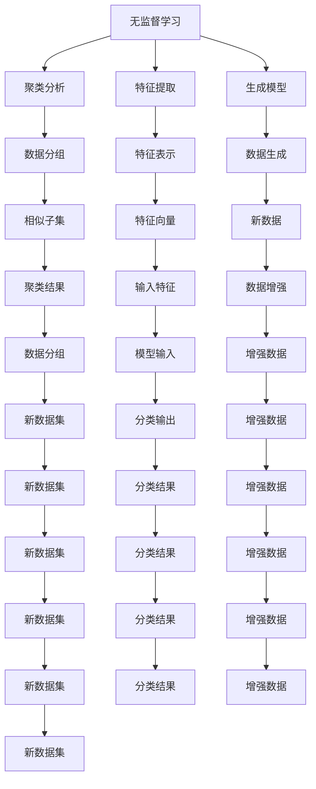

                 

# 无监督学习 原理与代码实例讲解

> 关键词：无监督学习, 深度学习, 聚类分析, 特征提取, 生成对抗网络, 自编码器, 原型学习, 自监督学习

## 1. 背景介绍

### 1.1 问题由来

无监督学习(Unsupervised Learning)是机器学习中的一大重要分支，与监督学习(Supervised Learning)和强化学习(Reinforcement Learning)共同构成了三大机器学习范式。与监督学习依赖于带有标签的训练数据不同，无监督学习无需预先标注的数据，通过数据本身的内在结构进行学习和建模，具有更广泛的适用性和可解释性。

在实际应用中，无监督学习广泛应用于数据分析、特征提取、聚类分析、生成模型等领域。例如，在图像处理中，无监督学习能够自动发现数据中的潜在模式，用于图像去噪、特征提取、图像分割等任务；在自然语言处理中，无监督学习可用于文本主题提取、情感分析、语言建模等任务。

近年来，深度学习技术在无监督学习中的应用日趋成熟，涌现出了一系列具有重要影响力的无监督学习方法。这些方法基于深度神经网络架构，通过自动化特征提取、模式发现等技术，极大提升了无监督学习的效率和效果。

### 1.2 问题核心关键点

无监督学习的核心在于如何从无标签的数据中发现隐含的模式和结构，进行有效的学习和建模。具体来说，主要包括：

1. **特征提取(Feature Extraction)**：通过无监督学习方法，从原始数据中学习到有意义的特征表示，用于后续的分类、聚类等任务。
2. **聚类分析(Clustering Analysis)**：将数据分组或归类，找出数据中的相似子集，常用于数据探索和初步分析。
3. **生成模型(Generative Modeling)**：学习数据的生成机制，用于数据生成和数据分布建模。
4. **自监督学习(Self-Supervised Learning)**：利用数据自身的属性进行学习，例如预测数据的某些属性，用于预训练模型的初始化。

这些核心概念共同构成了无监督学习的框架，使其能够在数据丰富但标注数据稀缺的领域发挥重要作用。

### 1.3 问题研究意义

无监督学习的研究和应用，对于拓展机器学习应用的边界，提升数据的价值挖掘能力，具有重要意义：

1. **数据利用效率提升**：无监督学习能够对大规模数据进行高效探索，挖掘出有价值的模式和结构，避免浪费标注成本。
2. **模型泛化能力增强**：无监督学习通过学习数据的内在结构，获得更具泛化能力的特征表示，提升了后续监督学习任务的性能。
3. **算法可解释性增强**：无监督学习方法往往具有较低的维度，可以更好地解释模型的学习过程和决策机制。
4. **多模态学习支持**：无监督学习能够融合多种数据模态，如文本、图像、语音等，实现更全面的信息建模。
5. **数据生成与合成**：生成模型能够从数据中学习生成机制，用于生成新数据，支持数据增强、数据合成等应用。
6. **自动化特征工程**：无监督学习能够自动提取数据特征，为复杂数据分析任务提供了高效的特征工程解决方案。

## 2. 核心概念与联系

### 2.1 核心概念概述

无监督学习的核心概念包括：

- **无监督学习**：利用无标签数据进行学习和建模，目标是从数据中发现隐含的模式和结构。
- **聚类分析**：将数据分组或归类，找出数据中的相似子集，常用于数据探索和初步分析。
- **特征提取**：从原始数据中学习到有意义的特征表示，用于后续的分类、聚类等任务。
- **生成模型**：学习数据的生成机制，用于数据生成和数据分布建模。
- **自监督学习**：利用数据自身的属性进行学习，例如预测数据的某些属性，用于预训练模型的初始化。

这些概念之间有着紧密的联系：聚类分析、特征提取和生成模型均是无监督学习的重要组成部分，而自监督学习则是预训练模型的常用技术手段。

通过这些核心概念，无监督学习能够从数据中自动发现模式，学习到有意义的特征表示，并用于后续的监督学习或生成任务，极大地提升了数据处理的效率和效果。

### 2.2 核心概念原理和架构的 Mermaid 流程图



通过这张流程图，我们可以直观地看到无监督学习的各个组成部分及其相互关系。无监督学习不仅包括聚类分析和特征提取，还包括生成模型和自监督学习，这些技术手段共同构成了无监督学习的核心框架。

## 3. 核心算法原理 & 具体操作步骤

### 3.1 算法原理概述

无监督学习中的核心算法原理主要包括：

- **聚类分析**：通过聚类算法将数据分成多个子集，每个子集内的数据相似度较高，而不同子集间的数据相似度较低。常见的聚类算法包括K-means、层次聚类、DBSCAN等。
- **特征提取**：通过降维算法或特征学习算法，将高维数据映射到低维空间中，提取有意义的特征表示。常见的特征提取算法包括PCA、t-SNE、Autoencoder等。
- **生成模型**：通过生成模型学习数据的生成机制，生成新的数据样本。常见的生成模型包括VAE、GAN、Flow等。
- **自监督学习**：通过自监督学习任务，利用数据自身的属性进行预训练，学习到有意义的特征表示。常见的自监督学习任务包括自回归预测、掩码语言建模、噪声注入等。

这些算法原理共同构成了无监督学习的核心框架，使其能够在数据探索、特征提取、数据生成等方面发挥重要作用。

### 3.2 算法步骤详解

无监督学习的步骤主要包括以下几个关键环节：

**Step 1: 数据准备**

无监督学习对数据的要求相对宽松，但需保证数据的质量和完整性。数据通常需要预处理，包括数据清洗、缺失值处理、归一化等步骤。

**Step 2: 选择算法**

根据任务需求，选择合适的无监督学习算法。例如，如果目标是数据聚类，可以选择K-means、层次聚类等算法；如果目标是特征提取，可以选择PCA、Autoencoder等算法；如果目标是数据生成，可以选择GAN、VAE等算法。

**Step 3: 模型训练**

根据选择的算法，对数据进行训练。通常需要设置一些超参数，如聚类数量、特征维度、生成模型参数等。训练过程可以是批处理或增量更新，根据具体情况选择。

**Step 4: 模型评估**

对训练得到的模型进行评估，通常使用一些指标，如聚类效果、特征提取效果、生成质量等。评估结果可以用于调整模型参数，优化模型性能。

**Step 5: 应用部署**

将训练好的模型应用到实际任务中，进行数据分析、特征提取、数据生成等操作。具体应用场景包括图像处理、文本分析、数据探索等。

### 3.3 算法优缺点

无监督学习的优点包括：

1. **数据利用效率高**：无监督学习利用无标签数据进行学习和建模，避免标注成本高昂的问题。
2. **模型泛化能力强**：无监督学习通过学习数据的内在结构，获得的特征表示具有较好的泛化能力。
3. **算法可解释性强**：无监督学习通常具有较低的维度，可以更好地解释模型的学习过程和决策机制。
4. **多模态支持良好**：无监督学习能够融合多种数据模态，如文本、图像、语音等，实现更全面的信息建模。

无监督学习的缺点包括：

1. **模型选择难度大**：无监督学习算法种类繁多，选择合适的算法和参数设置需要丰富的经验和实验验证。
2. **结果解释困难**：无监督学习的结果往往难以解释，缺乏明确的输出解释，需要借助领域知识进行解读。
3. **数据分布假设较强**：无监督学习算法通常对数据分布有一定的假设，如高斯分布、独立同分布等，可能不适用于复杂的非线性数据结构。

尽管存在这些缺点，但无监督学习在数据探索、特征提取、数据生成等方面具有独特的优势，值得在实际应用中广泛推广。

### 3.4 算法应用领域

无监督学习的应用领域非常广泛，以下是几个典型的应用场景：

- **图像处理**：用于图像去噪、特征提取、图像分割等任务。常见的算法包括自编码器、VAE、GAN等。
- **文本分析**：用于文本主题提取、情感分析、语言建模等任务。常见的算法包括TF-IDF、LDA、t-SNE等。
- **推荐系统**：用于推荐系统中的用户兴趣发现、物品相似性计算等任务。常见的算法包括协同过滤、矩阵分解等。
- **信号处理**：用于信号的降噪、特征提取、异常检测等任务。常见的算法包括PCA、ICA等。
- **生物信息学**：用于基因序列分析、蛋白质结构预测等任务。常见的算法包括PCA、LDA、Gaussian混合模型等。
- **社交网络分析**：用于社交网络中的用户聚类、社区发现等任务。常见的算法包括谱聚类、层次聚类等。

## 4. 数学模型和公式 & 详细讲解 & 举例说明

### 4.1 数学模型构建

无监督学习的数学模型构建主要包括以下几个关键环节：

**Step 1: 定义数据**

假设我们有一组无标签数据 $\{x_i\}_{i=1}^N$，其中 $x_i \in \mathbb{R}^d$，$d$ 为数据的维度。

**Step 2: 定义损失函数**

无监督学习的目标是通过学习数据的内在结构，获得有意义的特征表示。常见的损失函数包括重构误差、kl散度、自回归误差等。

**Step 3: 定义优化目标**

无监督学习的优化目标是最小化损失函数。常见的方法包括梯度下降、随机梯度下降、Adam等。

### 4.2 公式推导过程

以自编码器(Autoencoder)为例，介绍无监督学习的数学模型构建和公式推导过程。

自编码器是一种常用的无监督学习模型，通过将输入数据压缩成低维编码，再通过解码器还原到高维空间，学习数据的特征表示。自编码器的目标是最小化重构误差。

假设输入数据 $x_i \in \mathbb{R}^d$，编码器 $g$ 和解码器 $h$ 的参数分别为 $\theta_g$ 和 $\theta_h$。则自编码器的损失函数为：

$$
\mathcal{L}(\theta_g, \theta_h) = \frac{1}{N} \sum_{i=1}^N \|x_i - h(g(x_i), \theta_h)\|
$$

其中 $\|\cdot\|$ 表示欧几里得范数。自编码器的优化目标是：

$$
\mathop{\min}_{\theta_g, \theta_h} \mathcal{L}(\theta_g, \theta_h)
$$

### 4.3 案例分析与讲解

假设我们有一组手写数字图像数据，目标是自动提取数字特征。我们可以使用自编码器进行特征提取。

首先，定义输入数据 $x_i \in \mathbb{R}^D$，其中 $D$ 为图像像素数量。定义编码器 $g$ 和解码器 $h$，参数分别为 $\theta_g$ 和 $\theta_h$。

在训练过程中，我们首先对输入数据 $x_i$ 进行编码，得到低维编码 $z_i = g(x_i, \theta_g)$，然后通过解码器 $h$ 还原到高维空间：

$$
\hat{x_i} = h(z_i, \theta_h)
$$

计算重构误差：

$$
\mathcal{L}(\theta_g, \theta_h) = \frac{1}{N} \sum_{i=1}^N \|x_i - \hat{x_i}\|
$$

通过梯度下降等优化算法，最小化损失函数 $\mathcal{L}(\theta_g, \theta_h)$，得到最优的编码器和解码器参数 $\theta_g^*$ 和 $\theta_h^*$。

最后，将训练好的编码器 $g(x_i, \theta_g^*)$ 作为特征提取器，用于后续的分类或聚类任务。

## 5. 项目实践：代码实例和详细解释说明

### 5.1 开发环境搭建

进行无监督学习项目实践前，我们需要准备好开发环境。以下是使用Python进行TensorFlow开发的环境配置流程：

1. 安装Anaconda：从官网下载并安装Anaconda，用于创建独立的Python环境。

2. 创建并激活虚拟环境：
```bash
conda create -n tf-env python=3.8 
conda activate tf-env
```

3. 安装TensorFlow：从官网获取对应的安装命令。例如：
```bash
conda install tensorflow -c pytorch -c conda-forge
```

4. 安装各类工具包：
```bash
pip install numpy pandas scikit-learn matplotlib tqdm jupyter notebook ipython
```

完成上述步骤后，即可在`tf-env`环境中开始无监督学习实践。

### 5.2 源代码详细实现

这里我们以图像去噪为例，使用自编码器进行无监督学习。

首先，定义自编码器的编码器和解码器：

```python
import tensorflow as tf
from tensorflow.keras import layers

# 定义编码器
class Encoder(tf.keras.Model):
    def __init__(self, input_dim, latent_dim):
        super(Encoder, self).__init__()
        self.dense1 = layers.Dense(16, activation='relu')
        self.dense2 = layers.Dense(latent_dim, activation='relu')
        
    def call(self, x):
        x = self.dense1(x)
        x = self.dense2(x)
        return x

# 定义解码器
class Decoder(tf.keras.Model):
    def __init__(self, input_dim, latent_dim):
        super(Decoder, self).__init__()
        self.dense1 = layers.Dense(16, activation='relu')
        self.dense2 = layers.Dense(input_dim, activation='sigmoid')
        
    def call(self, x):
        x = self.dense1(x)
        x = self.dense2(x)
        return x
```

然后，定义自编码器的优化器和损失函数：

```python
# 定义优化器
optimizer = tf.keras.optimizers.Adam(learning_rate=0.001)

# 定义损失函数
def contrastive_loss(y_true, y_pred):
    return tf.keras.losses.binary_crossentropy(y_true, y_pred)

# 计算重构误差
def reconstruction_loss(x, x_hat):
    return tf.keras.losses.mean_squared_error(x, x_hat)

# 定义总损失函数
def total_loss(x, x_hat):
    return reconstruction_loss(x, x_hat) + contrastive_loss(tf.ones_like(x_hat), x_hat)
```

接着，定义训练和评估函数：

```python
# 定义训练函数
@tf.function
def train_step(x):
    with tf.GradientTape() as tape:
        z = encoder(x)
        x_hat = decoder(z)
        loss = total_loss(x, x_hat)
    grads = tape.gradient(loss, [encoder.trainable_variables, decoder.trainable_variables])
    optimizer.apply_gradients(zip(grads, [encoder.trainable_variables, decoder.trainable_variables]))

# 定义评估函数
def evaluate(x, x_hat):
    mse = tf.reduce_mean(tf.square(x - x_hat))
    return mse.numpy()
```

最后，启动训练流程并在测试集上评估：

```python
# 加载数据
(x_train, y_train), (x_test, y_test) = tf.keras.datasets.mnist.load_data()

# 数据预处理
x_train = x_train / 255.0
x_test = x_test / 255.0

# 定义模型和优化器
encoder = Encoder(input_dim=784, latent_dim=64)
decoder = Decoder(input_dim=784, latent_dim=64)

# 训练模型
num_epochs = 10
batch_size = 128
for epoch in range(num_epochs):
    for i in range(0, len(x_train), batch_size):
        x_batch = x_train[i:i+batch_size]
        train_step(x_batch)

    # 在测试集上评估模型
    mse = evaluate(x_test, encoder(x_test) + decoder(encoder(x_test)))
    print(f"Epoch {epoch+1}, test MSE: {mse}")
```

以上就是使用TensorFlow进行自编码器图像去噪的完整代码实现。可以看到，TensorFlow提供了丰富的深度学习组件，可以快速搭建和训练无监督学习模型。

### 5.3 代码解读与分析

让我们再详细解读一下关键代码的实现细节：

**Encoder类和Decoder类**：
- 编码器将输入数据映射到低维空间，解码器将低维数据映射回高维空间。

**contrastive_loss函数和reconstruction_loss函数**：
- 定义了对比损失和重构误差，用于计算总损失函数。

**total_loss函数**：
- 定义了自编码器的总损失函数，结合了对比损失和重构误差。

**train_step函数**：
- 定义了训练过程，包括计算损失、反向传播和更新模型参数。

**evaluate函数**：
- 定义了评估过程，计算模型在测试集上的重构误差。

**训练流程**：
- 定义总训练轮数和批次大小，开始循环迭代
- 每个epoch内，在训练集上迭代，每次迭代训练一个批次
- 在测试集上评估模型，输出重构误差
- 所有epoch结束后，评估模型的最终性能

可以看到，TensorFlow使得无监督学习模型的构建和训练变得简洁高效。开发者可以将更多精力放在模型设计、数据处理等高层逻辑上，而不必过多关注底层的实现细节。

当然，工业级的系统实现还需考虑更多因素，如模型的保存和部署、超参数的自动搜索、更灵活的任务适配层等。但核心的无监督学习范式基本与此类似。

## 6. 实际应用场景

### 6.1 数据分析与探索

无监督学习在数据分析和探索方面具有重要应用。例如，通过对大规模数据集进行聚类分析，可以发现数据中的隐藏模式和结构，用于数据探索、异常检测、数据预处理等任务。

在实际应用中，可以收集互联网上的用户行为数据，通过聚类算法找出具有相似行为的用户群体，分析用户行为模式，发现潜在的异常行为，及时采取措施。此外，还可以通过聚类分析对数据进行预处理，去除噪声和冗余信息，提高后续分析的效率和效果。

### 6.2 图像处理与计算机视觉

无监督学习在图像处理和计算机视觉中也有广泛应用。例如，通过自编码器进行图像去噪、图像压缩、图像生成等任务。

在实际应用中，可以利用自编码器对医学图像进行去噪和压缩，提高图像诊断的准确性；或者利用生成对抗网络(GAN)生成高质量的图像，用于图像增强和图像生成。这些技术在医学、艺术、游戏等领域均有重要应用。

### 6.3 自然语言处理

无监督学习在自然语言处理中也具有重要应用。例如，通过主题模型(LDA)进行文本主题提取，通过自编码器进行文本降维等任务。

在实际应用中，可以利用主题模型对新闻文章进行主题聚类，发现热门话题和趋势；或者利用自编码器对文本进行降维，用于文本分类、情感分析等任务。这些技术在新闻媒体、社交网络、电子商务等领域均有重要应用。

### 6.4 推荐系统

无监督学习在推荐系统中也有广泛应用。例如，通过协同过滤进行用户和物品的相似性计算，通过矩阵分解进行低秩特征提取等任务。

在实际应用中，可以利用协同过滤对用户进行聚类，发现相似用户，进行个性化推荐；或者利用矩阵分解进行低秩特征提取，提高推荐算法的精度。这些技术在电子商务、视频平台、音乐平台等领域均有重要应用。

### 6.5 信号处理

无监督学习在信号处理中也有重要应用。例如，通过自编码器进行信号去噪、特征提取等任务。

在实际应用中，可以利用自编码器对音频信号进行去噪，提高音频质量；或者利用自编码器进行信号特征提取，用于语音识别、图像处理等任务。这些技术在通信、医疗、安全等领域均有重要应用。

### 6.6 生物信息学

无监督学习在生物信息学中也有广泛应用。例如，通过PCA进行基因序列分析，通过LDA进行蛋白质结构预测等任务。

在实际应用中，可以利用PCA对基因序列进行降维，发现基因表达模式，用于疾病诊断和基因分析；或者利用LDA对蛋白质结构进行聚类，预测蛋白质功能。这些技术在生物医学、制药、农业等领域均有重要应用。

## 7. 工具和资源推荐

### 7.1 学习资源推荐

为了帮助开发者系统掌握无监督学习的理论基础和实践技巧，这里推荐一些优质的学习资源：

1. 《Deep Learning》书籍：Ian Goodfellow所著，系统介绍了深度学习的基本概念和算法，包括无监督学习等内容。

2. 《Unsupervised Learning with TensorFlow》教程：Google官方教程，介绍了如何使用TensorFlow进行无监督学习实践，包括自编码器、GAN等模型的搭建和训练。

3. 《Python Data Science Handbook》书籍：Jake VanderPlas所著，介绍了Python数据科学的基础知识和工具，包括TensorFlow、Pandas等。

4. 《K-means Clustering in TensorFlow》教程：Google官方教程，介绍了如何使用TensorFlow进行K-means聚类分析。

5. 《LDA Topic Modeling in Python》教程：Jupyter Notebook实现的LDA主题模型教程，介绍了如何使用Python进行文本主题提取。

6. 《Autoencoders in TensorFlow》教程：Google官方教程，介绍了如何使用TensorFlow进行自编码器模型搭建和训练。

通过对这些资源的学习实践，相信你一定能够快速掌握无监督学习的精髓，并用于解决实际的机器学习问题。

### 7.2 开发工具推荐

无监督学习的开发通常需要借助深度学习框架和工具，以下是几款常用的开发工具：

1. TensorFlow：Google开源的深度学习框架，支持分布式训练和推理，适合大规模工程应用。

2. PyTorch：Facebook开源的深度学习框架，灵活易用，适合研究和原型开发。

3. Keras：高层API，能够快速搭建深度学习模型，适合快速原型开发和实验。

4. Jupyter Notebook：交互式开发环境，支持Python和R等语言，方便实验和分享。

5. Weights & Biases：模型训练的实验跟踪工具，可以记录和可视化模型训练过程中的各项指标，方便对比和调优。

6. Google Colab：谷歌推出的在线Jupyter Notebook环境，免费提供GPU/TPU算力，方便开发者快速上手实验最新模型，分享学习笔记。

合理利用这些工具，可以显著提升无监督学习任务的开发效率，加快创新迭代的步伐。

### 7.3 相关论文推荐

无监督学习的不断发展得益于学界的持续研究。以下是几篇奠基性的相关论文，推荐阅读：

1. auto-encoders: The Learning of Invariant Representations by Denoising (Hinton, Salakhutdinov, 2006)：提出自编码器模型，用于无监督特征学习。

2. Deep Boltzmann Machines (Hinton, Salakhutdinov, 2006)：提出深度玻尔兹曼机模型，用于无监督学习。

3. Generative Adversarial Nets (Goodfellow, Bengio, Mirza, et al., 2014)：提出生成对抗网络模型，用于无监督生成学习。

4. Variational Autoencoders (Kingma, Welling, 2013)：提出变分自编码器模型，用于无监督特征学习。

5. t-distributed Stochastic Neighbor Embedding (t-SNE, van der Maaten, Hinton, 2008)：提出t-SNE算法，用于降维和可视化。

6. Probabilistic Latent Semantic Analysis (LDA, Blei, Ng, Jordan, 2003)：提出LDA模型，用于主题建模。

这些论文代表了大无监督学习的发展脉络。通过学习这些前沿成果，可以帮助研究者把握学科前进方向，激发更多的创新灵感。

## 8. 总结：未来发展趋势与挑战

### 8.1 总结

本文对无监督学习的原理和实践进行了全面系统的介绍。首先阐述了无监督学习的背景和重要性，明确了无监督学习在数据探索、特征提取、数据生成等方面的独特价值。其次，从原理到实践，详细讲解了无监督学习的核心算法原理和具体操作步骤，给出了无监督学习任务开发的完整代码实例。同时，本文还广泛探讨了无监督学习在数据分析、图像处理、自然语言处理、推荐系统、信号处理、生物信息学等领域的实际应用，展示了无监督学习技术的广泛潜力。此外，本文精选了无监督学习的各类学习资源，力求为读者提供全方位的技术指引。

通过本文的系统梳理，可以看到，无监督学习在数据探索、特征提取、数据生成等方面具有独特的优势，值得在实际应用中广泛推广。未来，伴随深度学习技术的发展和算力资源的丰富，无监督学习将进一步拓展其应用边界，成为机器学习领域的核心技术之一。

### 8.2 未来发展趋势

展望未来，无监督学习的发展趋势如下：

1. **深度学习算法的演进**：深度学习算法的不断演进将进一步提升无监督学习模型的精度和效果，如图灵机、自适应学习等新算法将有望成为无监督学习的重要工具。

2. **多模态学习**：多模态学习能够融合多种数据模态，如文本、图像、语音等，实现更全面的信息建模。未来无监督学习将更多地关注多模态数据的融合，提升模型的性能和泛化能力。

3. **自动特征提取**：自动特征提取技术将进一步发展，能够从原始数据中学习到更具有解释性的特征表示，用于后续的分类、聚类等任务。

4. **无监督生成模型**：生成模型将进一步优化，提升数据生成和生成质量，用于数据增强、数据合成等应用。

5. **联合学习**：联合学习能够将多个数据源中的无监督知识进行联合，提升模型在多源数据上的泛化能力。

6. **自监督学习的扩展**：自监督学习将继续扩展其应用场景，如图像、文本、信号等，提升模型的预训练效果和迁移能力。

以上趋势凸显了无监督学习技术的广阔前景，将进一步推动其在数据探索、特征提取、数据生成等方面的应用，为机器学习技术的发展提供新的动力。

### 8.3 面临的挑战

尽管无监督学习技术取得了重要进展，但在实际应用中仍面临一些挑战：

1. **算法选择复杂**：无监督学习算法种类繁多，选择合适的算法和参数设置需要丰富的经验和实验验证。

2. **结果解释困难**：无监督学习的结果往往难以解释，缺乏明确的输出解释，需要借助领域知识进行解读。

3. **数据分布假设强**：无监督学习算法通常对数据分布有一定的假设，如高斯分布、独立同分布等，可能不适用于复杂的非线性数据结构。

4. **计算资源需求高**：无监督学习通常需要较大的计算资源进行训练，如GPU/TPU等高性能设备，成本较高。

5. **模型复杂度高**：无监督学习模型通常较为复杂，难以部署和维护。

尽管存在这些挑战，但无监督学习在数据探索、特征提取、数据生成等方面具有独特的优势，值得在实际应用中广泛推广。相信通过不断的研究和实践，无监督学习技术将进一步优化，更好地服务于机器学习应用。

### 8.4 研究展望

未来，无监督学习的研究将在以下几个方向寻求新的突破：

1. **多模态学习**：融合多种数据模态，如文本、图像、语音等，实现更全面的信息建模。

2. **生成模型**：提升数据生成和生成质量，用于数据增强、数据合成等应用。

3. **联合学习**：将多个数据源中的无监督知识进行联合，提升模型在多源数据上的泛化能力。

4. **自监督学习**：扩展其应用场景，如图像、文本、信号等，提升模型的预训练效果和迁移能力。

5. **无监督学习与监督学习的结合**：探索如何将无监督学习与监督学习结合，提升模型的性能和泛化能力。

6. **自动化特征工程**：开发自动化特征工程工具，提高特征提取的效率和效果。

这些研究方向将进一步推动无监督学习技术的发展，拓展其在实际应用中的潜力。相信随着技术的不断进步，无监督学习必将在数据探索、特征提取、数据生成等领域发挥更大的作用，为机器学习技术的发展提供新的动力。

## 9. 附录：常见问题与解答

**Q1: 无监督学习和监督学习的区别是什么？**

A: 无监督学习与监督学习的区别在于是否需要标注数据。无监督学习利用无标注数据进行学习和建模，目标是从数据中发现隐含的模式和结构；而监督学习需要带有标签的训练数据，目标是从数据中学习到有监督的任务映射。

**Q2: 无监督学习有哪些典型算法？**

A: 无监督学习的典型算法包括聚类分析、特征提取、生成模型、自监督学习等。常见的聚类算法有K-means、层次聚类、DBSCAN等；常见的特征提取算法有PCA、t-SNE、Autoencoder等；常见的生成模型有VAE、GAN、Flow等；常见的自监督学习任务有自回归预测、掩码语言建模、噪声注入等。

**Q3: 无监督学习的应用场景有哪些？**

A: 无监督学习在数据分析、图像处理、自然语言处理、推荐系统、信号处理、生物信息学等领域具有重要应用。例如，在图像处理中，无监督学习可用于图像去噪、特征提取、图像分割等任务；在自然语言处理中，无监督学习可用于文本主题提取、情感分析、语言建模等任务；在推荐系统中，无监督学习可用于用户兴趣发现、物品相似性计算等任务。

**Q4: 无监督学习模型需要大量的计算资源吗？**

A: 无监督学习模型通常需要较大的计算资源进行训练，如GPU/TPU等高性能设备。但随着深度学习技术的演进，一些无监督学习算法已经可以实现较高效的计算，如VAE、GMM等。

**Q5: 无监督学习的结果是否可解释？**

A: 无监督学习的结果往往难以解释，缺乏明确的输出解释，需要借助领域知识进行解读。一些无监督学习算法（如PCA、K-means）的结果相对简单，解释起来比较容易；而一些生成模型（如GAN、VAE）的结果较为复杂，需要深入理解其生成机制。

---

作者：禅与计算机程序设计艺术 / Zen and the Art of Computer Programming

