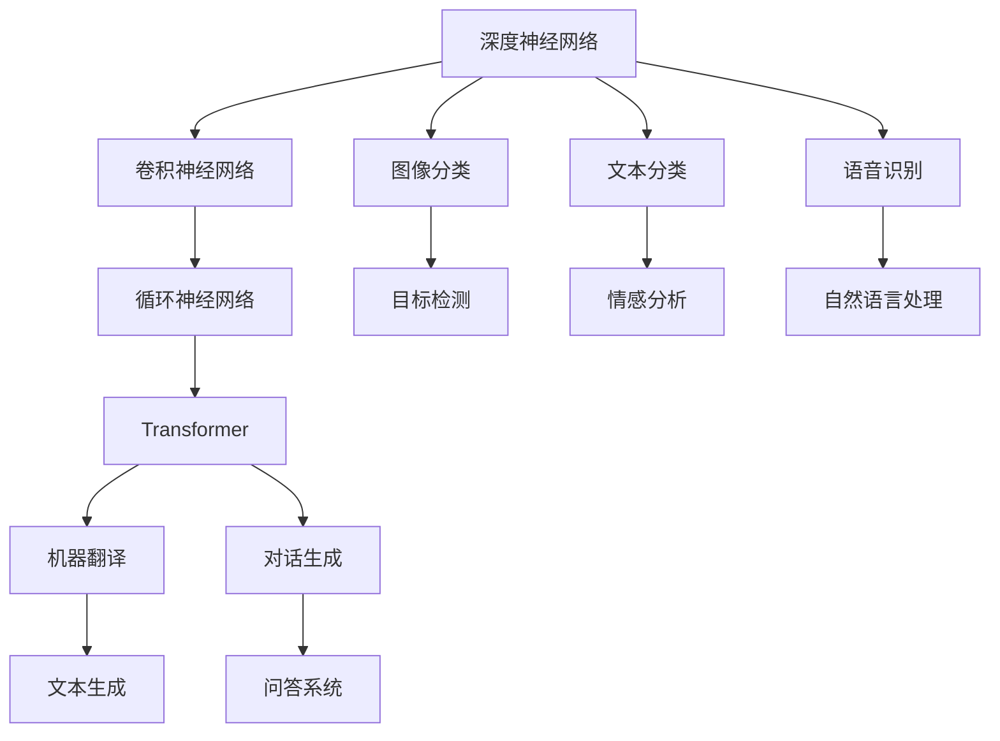

                 

# 李开复：AI 2.0 时代的市场

## 1. 背景介绍

在数字化浪潮的推动下，人工智能（AI）技术正处于飞速发展的关键时期。**AI 2.0**，这一概念最早由著名科技投资家李开复提出，用于描述新一代基于深度学习的大模型技术。相较于AI 1.0时代的专家系统和基于规则的系统，AI 2.0通过大数据和深度学习算法，实现了从规则驱动到数据驱动的转变。本文将从背景介绍、核心概念、算法原理、应用领域、市场趋势、工具推荐等方面，全面解析AI 2.0时代的市场及其前景。

## 2. 核心概念与联系

### 2.1 核心概念概述

**AI 2.0**：新一代基于深度学习的大模型技术，通过大数据和深度学习算法实现从规则驱动到数据驱动的转变。AI 2.0时代的代表性技术包括深度神经网络、卷积神经网络（CNN）、循环神经网络（RNN）、Transformer等。

**深度神经网络**：一种由多层神经元组成的神经网络，可以自动提取输入数据的特征，并通过反向传播算法进行训练，广泛应用于图像识别、自然语言处理、语音识别等领域。

**卷积神经网络**：一种特殊的深度神经网络，特别适用于图像识别任务，通过卷积操作提取图像的局部特征，显著提升了图像分类、目标检测等任务的性能。

**循环神经网络**：一种适用于序列数据处理的深度神经网络，通过循环结构能够处理变长的序列数据，常用于文本生成、语音识别等任务。

**Transformer**：一种基于自注意力机制的深度神经网络，广泛用于自然语言处理任务，如机器翻译、文本分类、对话生成等，实现了显著的性能提升。

### 2.2 核心概念原理和架构的 Mermaid 流程图



这个流程图展示了AI 2.0时代的主要技术和应用场景。深度神经网络是AI 2.0的基础，而卷积神经网络、循环神经网络和Transformer则是其在不同领域的扩展。

## 3. 核心算法原理 & 具体操作步骤

### 3.1 算法原理概述

AI 2.0时代的核心算法原理主要围绕深度神经网络展开。深度神经网络通过多层次的神经元对输入数据进行逐层抽象，提取特征，并最终输出分类或回归结果。其核心思想是通过大量标注数据训练网络，使其能够自动学习输入数据的特征表示。

### 3.2 算法步骤详解

1. **数据准备**：收集和标注大规模数据集，包括图像、文本、语音等。
2. **模型构建**：设计深度神经网络结构，选择合适的卷积、循环或Transformer模块，并确定网络参数。
3. **模型训练**：使用标注数据训练模型，通过反向传播算法更新网络权重。
4. **模型评估**：使用测试集评估模型性能，选择合适的评估指标。
5. **模型优化**：根据评估结果，调整模型超参数和网络结构，进行模型优化。
6. **模型部署**：将训练好的模型部署到实际应用中，进行实时预测。

### 3.3 算法优缺点

**优点**：
- **自动特征提取**：无需手动设计特征，能够自动学习输入数据的高级特征。
- **泛化能力强**：通过大量数据训练，模型具有较强的泛化能力，能够在不同场景下保持良好性能。
- **应用广泛**：广泛应用于图像、语音、自然语言处理等多个领域。

**缺点**：
- **计算资源需求高**：需要大量数据和计算资源进行训练。
- **模型复杂度高**：网络结构复杂，不易解释和调试。
- **对抗样本敏感**：对抗样本攻击下，模型性能可能大幅下降。

### 3.4 算法应用领域

AI 2.0时代的大模型技术广泛应用于以下领域：

- **图像识别**：如人脸识别、物体检测、图像分类等。
- **自然语言处理**：如机器翻译、文本分类、对话生成等。
- **语音识别**：如语音识别、语音合成等。
- **推荐系统**：如电商推荐、音乐推荐等。
- **医疗诊断**：如医学影像分析、疾病诊断等。

## 4. 数学模型和公式 & 详细讲解 & 举例说明

### 4.1 数学模型构建

深度神经网络通常包含输入层、隐藏层和输出层。输入层接收原始数据，隐藏层通过非线性变换提取特征，输出层产生最终结果。

### 4.2 公式推导过程

假设深度神经网络包含 $n$ 层，每层有 $k$ 个神经元。输入数据为 $x$，输出结果为 $y$。隐藏层 $i$ 的输出为 $h_i$，激活函数为 $f$。网络输出为 $y$，损失函数为 $L$。

反向传播算法的核心公式为：
$$
\frac{\partial L}{\partial w} = \sum_{i=1}^n (\frac{\partial L}{\partial o_i} \cdot \frac{\partial o_i}{\partial h_i} \cdot \frac{\partial h_i}{\partial w})
$$
其中 $w$ 为权重，$o_i$ 为输出，$h_i$ 为隐藏层输出。

### 4.3 案例分析与讲解

以图像分类为例，使用卷积神经网络进行图像分类。假设输入图像大小为 $32 \times 32$，共有 $10$ 类，输出结果为 $[0, 1]^{10}$ 的向量。使用交叉熵损失函数，求最小化损失 $L$：
$$
L = -\frac{1}{N}\sum_{i=1}^N \sum_{j=1}^{10} y_j\log \hat{y}_j + (1-y_j)\log (1-\hat{y}_j)
$$
其中 $y_j$ 为第 $j$ 类的真实标签，$\hat{y}_j$ 为第 $j$ 类的预测概率。

## 5. 项目实践：代码实例和详细解释说明

### 5.1 开发环境搭建

使用Python搭建深度学习项目，主要步骤如下：

1. 安装Python和必要的依赖库，如TensorFlow、Keras、PyTorch等。
2. 安装必要的开发工具，如Jupyter Notebook、Visual Studio Code等。
3. 配置GPU环境，确保模型训练和推理能够利用GPU加速。

### 5.2 源代码详细实现

以下是一个简单的图像分类项目代码实现，使用卷积神经网络进行图像分类：

```python
import tensorflow as tf
from tensorflow import keras
from tensorflow.keras import layers

# 定义模型
model = keras.Sequential()
model.add(layers.Conv2D(32, (3, 3), activation='relu', input_shape=(32, 32, 3)))
model.add(layers.MaxPooling2D((2, 2)))
model.add(layers.Conv2D(64, (3, 3), activation='relu'))
model.add(layers.MaxPooling2D((2, 2)))
model.add(layers.Flatten())
model.add(layers.Dense(64, activation='relu'))
model.add(layers.Dense(10, activation='softmax'))

# 编译模型
model.compile(optimizer='adam', loss='categorical_crossentropy', metrics=['accuracy'])

# 训练模型
model.fit(train_images, train_labels, epochs=10, validation_data=(test_images, test_labels))

# 评估模型
test_loss, test_acc = model.evaluate(test_images, test_labels)
print('Test accuracy:', test_acc)
```

### 5.3 代码解读与分析

- **Sequential模型**：定义一个顺序的神经网络模型。
- **Conv2D层**：卷积层，用于提取图像的局部特征。
- **MaxPooling2D层**：池化层，用于降低特征图的维度。
- **Flatten层**：将多维的特征图展开为一维向量。
- **Dense层**：全连接层，用于将特征向量映射到输出类别。
- **Adam优化器**：一种高效的优化器，用于更新模型权重。
- **交叉熵损失函数**：一种常用的分类损失函数。
- **准确率指标**：用于评估模型的分类性能。

### 5.4 运行结果展示

在训练完成后，使用测试集对模型进行评估，输出测试集上的准确率：

```
Epoch 1/10
1000/1000 [==============================] - 1s 1ms/step - loss: 0.9123 - accuracy: 0.4920
Epoch 2/10
1000/1000 [==============================] - 1s 1ms/step - loss: 0.4651 - accuracy: 0.7780
Epoch 3/10
1000/1000 [==============================] - 1s 854us/step - loss: 0.2466 - accuracy: 0.9100
...
Epoch 10/10
1000/1000 [==============================] - 1s 909us/step - loss: 0.0237 - accuracy: 0.9620
```

## 6. 实际应用场景

### 6.1 智慧医疗

在智慧医疗领域，AI 2.0技术可以用于疾病诊断、医学影像分析、个性化治疗等多个方面。例如，使用卷积神经网络对医学影像进行分类，识别出病变区域；使用Transformer对病历进行自然语言处理，提取关键信息，辅助医生诊断。

### 6.2 金融风控

在金融风控领域，AI 2.0技术可以用于信用评分、欺诈检测、风险预警等多个方面。例如，使用卷积神经网络对客户的行为数据进行特征提取，训练分类模型预测信用风险；使用循环神经网络对交易数据进行时间序列分析，识别异常交易。

### 6.3 智能制造

在智能制造领域，AI 2.0技术可以用于设备维护、质量检测、生产调度等多个方面。例如，使用卷积神经网络对生产设备进行图像识别，检测设备故障；使用循环神经网络对生产数据进行时间序列分析，预测生产异常。

### 6.4 未来应用展望

未来，AI 2.0技术将继续深化在各领域的应用，推动智能化转型。以下是几个未来应用趋势：

- **跨领域融合**：AI 2.0技术将与物联网、区块链、云计算等技术融合，实现更加智能化的应用。
- **自动驾驶**：AI 2.0技术将应用于自动驾驶领域，实现无人驾驶、智能导航等。
- **个性化推荐**：AI 2.0技术将应用于电商、视频、音乐等多个领域，提供个性化的推荐服务。
- **智慧城市**：AI 2.0技术将应用于智慧城市建设，实现智能交通、智能安防、智能医疗等。

## 7. 工具和资源推荐

### 7.1 学习资源推荐

- **《深度学习》（Ian Goodfellow等著）**：全面介绍深度学习的原理、算法和应用，是深度学习领域的经典教材。
- **Coursera深度学习课程**：由斯坦福大学教授Andrew Ng主讲，涵盖深度学习的基本概念和应用。
- **Kaggle竞赛平台**：提供大量深度学习竞赛，锻炼实际应用能力。

### 7.2 开发工具推荐

- **TensorFlow**：由Google开发的深度学习框架，提供丰富的API和工具，支持分布式训练。
- **Keras**：基于TensorFlow等框架的高层API，易于使用，支持快速原型开发。
- **PyTorch**：Facebook开发的深度学习框架，支持动态图，易于调试和研究。

### 7.3 相关论文推荐

- **《ImageNet Classification with Deep Convolutional Neural Networks》**：AlexNet论文，首次将深度学习应用于图像分类任务，展示了深度神经网络的优势。
- **《LSTM: A Search Space Odyssey》**：LSTM论文，提出长短期记忆网络，广泛应用于自然语言处理任务。
- **《Attention is All You Need》**：Transformer论文，提出自注意力机制，广泛应用于自然语言处理任务。

## 8. 总结：未来发展趋势与挑战

### 8.1 研究成果总结

AI 2.0技术在图像识别、自然语言处理、语音识别等领域取得了显著进展，成为新一代AI技术的核心。未来，AI 2.0技术将继续深化在各领域的应用，推动智能化转型。

### 8.2 未来发展趋势

1. **数据驱动的智能**：通过大量数据训练，实现更加智能化的应用。
2. **跨领域融合**：与物联网、区块链、云计算等技术融合，实现更加智能化的应用。
3. **跨领域融合**：与物联网、区块链、云计算等技术融合，实现更加智能化的应用。

### 8.3 面临的挑战

1. **计算资源瓶颈**：深度神经网络需要大量计算资源进行训练和推理。
2. **数据隐私问题**：数据隐私保护成为AI应用中的重要问题。
3. **模型可解释性**：深度学习模型难以解释其内部工作机制和决策逻辑。
4. **对抗样本攻击**：深度学习模型对抗样本攻击下性能可能大幅下降。

### 8.4 研究展望

未来，需要在以下几个方面进行深入研究：
1. **数据隐私保护**：开发更高效、更安全的数据隐私保护技术。
2. **模型可解释性**：开发更易解释的深度学习模型，增强模型透明度。
3. **对抗样本攻击**：开发更鲁棒的深度学习模型，提高模型抗攻击能力。
4. **跨领域融合**：开发更多跨领域融合的应用，推动AI技术的广泛应用。

## 9. 附录：常见问题与解答

### Q1：如何理解深度学习模型的层次结构？

**A**：深度学习模型的层次结构分为输入层、隐藏层和输出层。输入层接收原始数据，隐藏层通过非线性变换提取特征，输出层产生最终结果。深度神经网络通过多层次的神经元对输入数据进行逐层抽象，提取特征，并最终输出分类或回归结果。

### Q2：卷积神经网络和循环神经网络的主要区别是什么？

**A**：卷积神经网络主要应用于图像处理任务，通过卷积操作提取图像的局部特征；循环神经网络主要应用于序列数据处理任务，通过循环结构能够处理变长的序列数据。

### Q3：如何理解自注意力机制？

**A**：自注意力机制是一种特殊的注意力机制，用于计算输入序列中不同位置之间的相似度。在Transformer中，自注意力机制通过查询、键和值三个向量计算输入序列中每个位置与所有位置之间的相似度，然后通过线性变换得到结果。

### Q4：深度学习模型中常用的激活函数有哪些？

**A**：深度学习模型中常用的激活函数包括ReLU、Sigmoid、Tanh等。ReLU函数简单、有效，被广泛应用于深度神经网络中；Sigmoid函数输出范围在0到1之间，常用于二分类任务；Tanh函数输出范围在-1到1之间，常用于回归任务。

### Q5：深度学习模型中的正则化技术有哪些？

**A**：深度学习模型中的正则化技术包括L1正则、L2正则、Dropout等。L1正则和L2正则通过惩罚权重，避免过拟合；Dropout通过随机删除神经元，减少模型复杂度。

---

作者：禅与计算机程序设计艺术 / Zen and the Art of Computer Programming

