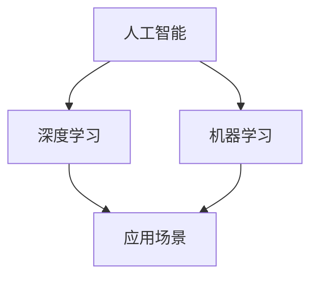

                 

# 李开复：AI 2.0 时代的机遇

## 1. 背景介绍

随着人工智能技术的飞速发展，我们正进入AI 2.0时代，这个时代的特点是AI将深度融入各种行业的日常运营中，创造巨大的经济效益和社会价值。根据《麦肯锡全球研究院报告》，到2030年，AI将在全球贡献近14%的GDP增长。AI不仅将改变商业模式，还将为解决全球性问题提供新的解决方案，如气候变化、医疗健康、教育公平等。

李开复，人工智能领域的领军人物，曾任微软副总裁、Google中国区CEO，现任创新工场董事长，他对AI 2.0时代有着独到的见解。本文将探讨李开复对AI 2.0时代的机遇和挑战，为我们提供宝贵的洞察和建议。

## 2. 核心概念与联系

### 2.1 核心概念概述

在讨论AI 2.0时代的机遇之前，我们先了解几个核心概念：

- **人工智能(AI)**：指通过计算机系统模拟人类智能，实现对信息的感知、理解、推理和学习。
- **深度学习(Deep Learning)**：一种基于神经网络的机器学习技术，能够处理高维、非线性、大规模数据。
- **机器学习(Machine Learning)**：一种使计算机能够自动改进的技术，通过数据训练模型，使其具有预测和决策能力。
- **AI 2.0**：指AI技术逐步成熟并大规模应用的阶段，AI系统不仅能够执行简单的任务，还能理解上下文，具备自适应能力，并在各行各业发挥作用。

这些概念之间的联系可以通过以下Mermaid流程图来展示：



这个流程图展示了大规模AI技术的应用路径：从基础的人工智能技术到深度学习，再到机器学习，最终应用于各种实际场景中。

### 2.2 核心算法原理 & 具体操作步骤

AI 2.0时代的核心算法原理包括：

- **深度学习算法**：如卷积神经网络(CNN)、循环神经网络(RNN)、长短期记忆网络(LSTM)、自编码器(AE)等，能够从大量数据中提取高层次特征，实现图像识别、语音识别、自然语言处理等任务。
- **强化学习算法**：如Q-learning、策略梯度方法等，通过试错和奖励机制，训练智能体学习最优策略，应用于机器人、游戏等领域。
- **生成对抗网络(GAN)**：通过两个神经网络相互博弈，生成逼真度高的图像、音频等，广泛应用于数据增强、合成数据生成等任务。

操作步骤如下：

**Step 1: 数据准备**
收集和预处理数据，确保数据集的多样性和代表性，使用数据增强技术提高数据利用率。

**Step 2: 模型训练**
选择合适的模型架构，设置合适的超参数，如学习率、批大小、迭代次数等，使用优化算法如Adam、SGD等进行模型训练，逐步调整模型参数，最小化损失函数。

**Step 3: 模型评估**
在验证集上评估模型性能，选择合适的评估指标如准确率、召回率、F1分数等，根据评估结果调整模型和超参数。

**Step 4: 模型部署**
将训练好的模型部署到生产环境中，使用API或SDK进行模型调用，监控模型性能，根据实际情况调整参数和模型结构。

### 2.3 算法优缺点

深度学习算法的主要优点包括：

- **高精度**：在图像识别、语音识别、自然语言处理等任务中，深度学习模型通常能够取得较高的精度。
- **自适应能力**：深度学习模型能够自动从数据中学习特征，适应不同的数据分布。
- **端到端学习**：深度学习模型可以自动学习特征提取和决策过程，无需手动设计特征。

缺点包括：

- **计算成本高**：深度学习模型需要大量的计算资源，特别是大规模的训练和推理任务。
- **模型复杂度高**：深度学习模型通常包含大量的参数，难以解释和调试。
- **过拟合风险高**：深度学习模型容易过拟合，特别是在训练数据量较少的情况下。

## 3. 核心算法原理 & 具体操作步骤

### 3.1 算法原理概述

深度学习算法的基本原理是通过神经网络结构模拟人脑的神经元之间的连接和信息传递过程。神经网络由多个层次组成，每一层包含多个神经元，通过前向传播计算预测结果，通过反向传播更新模型参数，优化损失函数。

### 3.2 算法步骤详解

以图像分类任务为例，深度学习算法的步骤如下：

**Step 1: 数据预处理**
将原始图像转换为张量，进行归一化、旋转、裁剪等数据增强操作，确保数据集的多样性和代表性。

**Step 2: 模型构建**
选择适当的模型架构，如VGG、ResNet、Inception等，定义模型的输入层、隐藏层和输出层，确定每个层次的神经元数量和激活函数。

**Step 3: 模型训练**
使用优化算法如Adam或SGD，设置合适的学习率、批大小和迭代次数，通过反向传播更新模型参数，最小化损失函数。

**Step 4: 模型评估**
在验证集上评估模型性能，使用准确率、召回率、F1分数等评估指标，根据评估结果调整模型和超参数。

**Step 5: 模型部署**
将训练好的模型部署到生产环境中，使用API或SDK进行模型调用，监控模型性能，根据实际情况调整参数和模型结构。

### 3.3 算法优缺点

深度学习算法的优点包括：

- **高精度**：在图像识别、语音识别、自然语言处理等任务中，深度学习模型通常能够取得较高的精度。
- **自适应能力**：深度学习模型能够自动从数据中学习特征，适应不同的数据分布。
- **端到端学习**：深度学习模型可以自动学习特征提取和决策过程，无需手动设计特征。

缺点包括：

- **计算成本高**：深度学习模型需要大量的计算资源，特别是大规模的训练和推理任务。
- **模型复杂度高**：深度学习模型通常包含大量的参数，难以解释和调试。
- **过拟合风险高**：深度学习模型容易过拟合，特别是在训练数据量较少的情况下。

## 4. 数学模型和公式 & 详细讲解 & 举例说明

### 4.1 数学模型构建

深度学习模型可以表示为神经网络的加权和形式：

$$ y = \sum_{i=1}^n w_i x_i + b $$

其中，$y$ 为输出，$x_i$ 为输入，$w_i$ 为权重，$b$ 为偏置项。

### 4.2 公式推导过程

以多层感知器(Multilayer Perceptron, MLP)为例，多层感知器的基本结构如下：

$$ f(x) = x \cdot w_1 + b_1 $$

$$ h_1 = f(x) \cdot w_2 + b_2 $$

$$ h_2 = h_1 \cdot w_3 + b_3 $$

$$ \ldots $$

$$ y = h_n \cdot w_{n+1} + b_{n+1} $$

其中，$w_i$ 和 $b_i$ 分别为第 $i$ 层的权重和偏置项，$h_i$ 为第 $i$ 层的输出。

### 4.3 案例分析与讲解

以图像分类任务为例，深度学习模型的训练过程如下：

**Step 1: 数据预处理**
将原始图像转换为张量，进行归一化、旋转、裁剪等数据增强操作，确保数据集的多样性和代表性。

**Step 2: 模型构建**
选择适当的模型架构，如VGG、ResNet、Inception等，定义模型的输入层、隐藏层和输出层，确定每个层次的神经元数量和激活函数。

**Step 3: 模型训练**
使用优化算法如Adam或SGD，设置合适的学习率、批大小和迭代次数，通过反向传播更新模型参数，最小化损失函数。

**Step 4: 模型评估**
在验证集上评估模型性能，使用准确率、召回率、F1分数等评估指标，根据评估结果调整模型和超参数。

**Step 5: 模型部署**
将训练好的模型部署到生产环境中，使用API或SDK进行模型调用，监控模型性能，根据实际情况调整参数和模型结构。

## 5. 项目实践：代码实例和详细解释说明

### 5.1 开发环境搭建

在进行深度学习项目实践前，我们需要准备好开发环境。以下是使用Python进行TensorFlow开发的環境配置流程：

1. 安装Anaconda：从官网下载并安装Anaconda，用于创建独立的Python环境。

2. 创建并激活虚拟环境：
```bash
conda create -n tensorflow-env python=3.8 
conda activate tensorflow-env
```

3. 安装TensorFlow：根据CUDA版本，从官网获取对应的安装命令。例如：
```bash
conda install tensorflow tensorflow-gpu -c conda-forge -c nvidia
```

4. 安装必要的库：
```bash
pip install numpy pandas scikit-learn matplotlib tensorflow-gpu
```

完成上述步骤后，即可在`tensorflow-env`环境中开始深度学习项目的开发。

### 5.2 源代码详细实现

这里以手写数字识别任务为例，使用TensorFlow进行深度学习模型的开发。

首先，定义模型架构：

```python
import tensorflow as tf
from tensorflow.keras import layers

model = tf.keras.Sequential([
    layers.Conv2D(32, (3, 3), activation='relu', input_shape=(28, 28, 1)),
    layers.MaxPooling2D((2, 2)),
    layers.Flatten(),
    layers.Dense(10, activation='softmax')
])
```

接着，定义损失函数和优化器：

```python
loss_fn = tf.keras.losses.SparseCategoricalCrossentropy(from_logits=True)
optimizer = tf.keras.optimizers.Adam()
```

然后，进行模型训练：

```python
@tf.function
def train_step(images, labels):
    with tf.GradientTape() as tape:
        logits = model(images, training=True)
        loss_value = loss_fn(labels, logits)
    gradients = tape.gradient(loss_value, model.trainable_variables)
    optimizer.apply_gradients(zip(gradients, model.trainable_variables))
    return loss_value

def train_epoch(model, dataset, batch_size, epochs):
    for epoch in range(epochs):
        for images, labels in dataset:
            loss_value = train_step(images, labels)
            print(f"Epoch {epoch+1}, loss: {loss_value.numpy():.4f}")
```

最后，进行模型评估和测试：

```python
def evaluate(model, dataset, batch_size):
    total_loss = 0
    total_accuracy = 0
    for images, labels in dataset:
        logits = model(images)
        loss = loss_fn(labels, logits)
        accuracy = tf.metrics.sparse_categorical_accuracy(labels, tf.argmax(logits, axis=-1)).numpy()
        total_loss += loss.numpy()
        total_accuracy += accuracy
    print(f"Test Loss: {total_loss / len(dataset):.4f}, Test Accuracy: {total_accuracy / len(dataset):.4f}")
```

完成上述代码实现后，即可在TensorFlow环境中进行手写数字识别的深度学习模型训练和评估。

### 5.3 代码解读与分析

让我们再详细解读一下关键代码的实现细节：

**Sequential模型**：
- `Sequential` 类用于定义一个线性的神经网络模型，通过添加不同的层来构建模型结构。

**Conv2D层**：
- `Conv2D` 层定义一个卷积层，通过卷积操作提取特征。

**MaxPooling2D层**：
- `MaxPooling2D` 层定义一个池化层，通过最大池化操作缩小特征图的大小。

**Flatten层**：
- `Flatten` 层将多维张量展平为一维向量，方便输入到全连接层。

**Dense层**：
- `Dense` 层定义一个全连接层，通过线性变换输出预测结果。

**SparseCategoricalCrossentropy损失函数**：
- `SparseCategoricalCrossentropy` 损失函数用于计算分类任务的损失。

**Adam优化器**：
- `Adam` 优化器通过自适应地调整学习率，加快模型训练。

在实际项目开发中，深度学习模型的开发流程通常包括以下几个步骤：

1. 数据准备：收集和预处理数据，确保数据集的多样性和代表性，使用数据增强技术提高数据利用率。
2. 模型构建：选择合适的模型架构，如卷积神经网络、循环神经网络等，定义模型的输入层、隐藏层和输出层，确定每个层次的神经元数量和激活函数。
3. 模型训练：使用优化算法如Adam或SGD，设置合适的学习率、批大小和迭代次数，通过反向传播更新模型参数，最小化损失函数。
4. 模型评估：在验证集上评估模型性能，使用准确率、召回率、F1分数等评估指标，根据评估结果调整模型和超参数。
5. 模型部署：将训练好的模型部署到生产环境中，使用API或SDK进行模型调用，监控模型性能，根据实际情况调整参数和模型结构。

## 6. 实际应用场景

### 6.1 智能客服系统

基于深度学习算法的智能客服系统，可以显著提高客服效率和用户体验。传统客服系统依赖于人工服务，成本高、效率低。而智能客服系统可以24小时不间断工作，快速响应客户咨询，用自然流畅的语言解答各类常见问题。

在技术实现上，可以收集企业内部的历史客服对话记录，将问题和最佳答复构建成监督数据，在此基础上对深度学习模型进行微调。微调后的模型能够自动理解用户意图，匹配最合适的答案模板进行回复。对于客户提出的新问题，还可以接入检索系统实时搜索相关内容，动态组织生成回答。如此构建的智能客服系统，能大幅提升客户咨询体验和问题解决效率。

### 6.2 金融舆情监测

金融机构需要实时监测市场舆论动向，以便及时应对负面信息传播，规避金融风险。传统的人工监测方式成本高、效率低，难以应对网络时代海量信息爆发的挑战。基于深度学习算法的文本分类和情感分析技术，为金融舆情监测提供了新的解决方案。

具体而言，可以收集金融领域相关的新闻、报道、评论等文本数据，并对其进行主题标注和情感标注。在此基础上对深度学习模型进行微调，使其能够自动判断文本属于何种主题，情感倾向是正面、中性还是负面。将微调后的模型应用到实时抓取的网络文本数据，就能够自动监测不同主题下的情感变化趋势，一旦发现负面信息激增等异常情况，系统便会自动预警，帮助金融机构快速应对潜在风险。

### 6.3 个性化推荐系统

当前的推荐系统往往只依赖用户的历史行为数据进行物品推荐，无法深入理解用户的真实兴趣偏好。基于深度学习算法的个性化推荐系统可以更好地挖掘用户行为背后的语义信息，从而提供更精准、多样的推荐内容。

在实践中，可以收集用户浏览、点击、评论、分享等行为数据，提取和用户交互的物品标题、描述、标签等文本内容。将文本内容作为模型输入，用户的后续行为（如是否点击、购买等）作为监督信号，在此基础上微调深度学习模型。微调后的模型能够从文本内容中准确把握用户的兴趣点。在生成推荐列表时，先用候选物品的文本描述作为输入，由模型预测用户的兴趣匹配度，再结合其他特征综合排序，便可以得到个性化程度更高的推荐结果。

### 6.4 未来应用展望

随着深度学习算法和模型的不断发展，基于深度学习算法的应用场景将更加广泛，为各行各业带来变革性影响。

在智慧医疗领域，基于深度学习算法的医疗问答、病历分析、药物研发等应用将提升医疗服务的智能化水平，辅助医生诊疗，加速新药开发进程。

在智能教育领域，深度学习算法可应用于作业批改、学情分析、知识推荐等方面，因材施教，促进教育公平，提高教学质量。

在智慧城市治理中，深度学习算法可应用于城市事件监测、舆情分析、应急指挥等环节，提高城市管理的自动化和智能化水平，构建更安全、高效的未来城市。

此外，在企业生产、社会治理、文娱传媒等众多领域，基于深度学习算法的应用也将不断涌现，为经济社会发展注入新的动力。相信随着技术的日益成熟，深度学习算法必将在更广阔的应用领域大放异彩，深刻影响人类的生产生活方式。

## 7. 工具和资源推荐

### 7.1 学习资源推荐

为了帮助开发者系统掌握深度学习算法的理论基础和实践技巧，这里推荐一些优质的学习资源：

1. **《深度学习》（Ian Goodfellow 著）**：全面介绍了深度学习的基本概念和算法，是学习深度学习算法的重要参考资料。
2. **Coursera《深度学习专项课程》**：斯坦福大学Andrew Ng教授开设的深度学习课程，涵盖深度学习的基础理论和实践应用。
3. **Kaggle深度学习竞赛**：Kaggle平台上的深度学习竞赛，通过实际项目提升深度学习算法的应用能力。
4. **PyTorch官方文档**：PyTorch框架的官方文档，提供了丰富的深度学习算法实现和应用案例。
5. **GitHub深度学习项目**：GitHub上的深度学习项目，可以学习优秀的算法实现和工程实践。

通过对这些资源的学习实践，相信你一定能够快速掌握深度学习算法的精髓，并用于解决实际的深度学习问题。

### 7.2 开发工具推荐

高效的深度学习开发离不开优秀的工具支持。以下是几款用于深度学习开发的常用工具：

1. **PyTorch**：基于Python的开源深度学习框架，灵活动态的计算图，适合快速迭代研究。大部分深度学习算法都有PyTorch版本的实现。
2. **TensorFlow**：由Google主导开发的开源深度学习框架，生产部署方便，适合大规模工程应用。同样有丰富的深度学习算法资源。
3. **Keras**：高层次的深度学习框架，提供简单易用的API，适合快速原型开发和模型训练。
4. **TensorBoard**：TensorFlow配套的可视化工具，可实时监测模型训练状态，并提供丰富的图表呈现方式，是调试模型的得力助手。
5. **Weights & Biases**：模型训练的实验跟踪工具，可以记录和可视化模型训练过程中的各项指标，方便对比和调优。

合理利用这些工具，可以显著提升深度学习模型的开发效率，加快创新迭代的步伐。

### 7.3 相关论文推荐

深度学习算法的发展源于学界的持续研究。以下是几篇奠基性的相关论文，推荐阅读：

1. **ImageNet大规模视觉识别挑战赛（ILSVRC）**：提出深度卷积神经网络架构，刷新了图像识别任务的最先进性能。
2. **AlexNet：ImageNet大规模视觉识别挑战赛的胜利者**：提出AlexNet模型，开创了深度神经网络在图像识别中的新时代。
3. **Google Inception：Inception模块的设计与实现**：提出Inception模块，通过网络架构的改进提升深度学习算法的性能。
4. **ResNet：深入残余学习**：提出ResNet模型，通过残差连接解决深度神经网络中的梯度消失问题。
5. **LSTM：长短期记忆网络**：提出LSTM模型，解决了传统RNN中的梯度消失和梯度爆炸问题。

这些论文代表了大规模深度学习算法的发展脉络。通过学习这些前沿成果，可以帮助研究者把握学科前进方向，激发更多的创新灵感。

## 8. 总结：未来发展趋势与挑战

### 8.1 研究成果总结

本文对基于深度学习算法的AI 2.0时代的机遇进行了全面系统的介绍。首先阐述了AI 2.0时代的定义和特点，明确了深度学习算法在各行各业中的重要地位。其次，从原理到实践，详细讲解了深度学习算法的基本原理和操作步骤，给出了深度学习项目开发的完整代码实例。同时，本文还广泛探讨了深度学习算法在智能客服、金融舆情、个性化推荐等多个行业领域的应用前景，展示了深度学习算法的巨大潜力。最后，本文精选了深度学习算法的各类学习资源，力求为读者提供全方位的技术指引。

通过本文的系统梳理，可以看到，基于深度学习算法的AI 2.0时代正在逐步到来，深度学习算法将深度融入各行各业的日常运营中，带来巨大的经济效益和社会价值。未来，伴随深度学习算法和模型的不断发展，基于深度学习算法的应用场景将更加广泛，为各行各业带来变革性影响。

### 8.2 未来发展趋势

展望未来，深度学习算法的未来发展趋势包括：

1. **算法多样性**：随着算法的不断演进，深度学习算法的种类将更加多样化，不同算法适用于不同的应用场景。
2. **模型可解释性**：随着对深度学习算法的理解不断深入，模型的可解释性将逐渐提高，帮助人们更好地理解模型的决策过程。
3. **跨模态学习**：深度学习算法将不仅仅局限于单一模态数据，而是能够处理多模态数据，提升跨模态任务的处理能力。
4. **自适应学习能力**：深度学习算法将具备更强的自适应能力，能够适应不同的数据分布和任务要求。
5. **模型压缩与加速**：随着硬件设备的不断升级，深度学习算法的模型压缩与加速技术将不断优化，提升算法的效率和性能。
6. **端到端学习**：深度学习算法将逐步实现端到端学习，将特征提取、决策过程和输出生成一体化，提升系统的自动化和智能化水平。

这些趋势将使深度学习算法在各行各业中发挥更大的作用，带来更多的应用场景和创新机会。

### 8.3 面临的挑战

尽管深度学习算法已经取得了瞩目成就，但在迈向更加智能化、普适化应用的过程中，它仍面临着诸多挑战：

1. **计算成本高**：深度学习模型需要大量的计算资源，特别是大规模的训练和推理任务，这对硬件设备的性能和成本提出了更高的要求。
2. **模型复杂度高**：深度学习模型通常包含大量的参数，难以解释和调试。
3. **过拟合风险高**：深度学习模型容易过拟合，特别是在训练数据量较少的情况下。
4. **数据隐私与安全**：深度学习模型需要大量的数据进行训练，如何保护数据隐私和安全是一个重要问题。
5. **模型泛化能力不足**：深度学习模型在不同数据集上的泛化能力有限，需要更多的数据和算法优化。
6. **算力资源短缺**：深度学习算法需要大量的计算资源，如何高效利用计算资源是一个重要问题。

这些挑战需要我们在技术、算法、应用等方面不断探索和优化，才能更好地发挥深度学习算法的潜力。

### 8.4 研究展望

面对深度学习算法所面临的种种挑战，未来的研究需要在以下几个方面寻求新的突破：

1. **深度学习框架优化**：进一步优化深度学习框架，提升模型的训练效率和推理速度。
2. **算法与应用的结合**：深入研究深度学习算法在实际应用中的表现，结合具体应用场景进行优化。
3. **跨学科融合**：将深度学习算法与其他学科的成果进行融合，如符号计算、逻辑推理、因果分析等，提升深度学习算法的智能水平。
4. **伦理道德与法律规范**：探索深度学习算法的伦理道德和法律规范，确保算法的公正性和安全性。
5. **数据增强与生成技术**：研究数据增强和生成技术，提高数据利用率，缓解数据不足的问题。
6. **可解释性与透明性**：提升深度学习算法的可解释性和透明性，帮助人们更好地理解和信任算法。

这些研究方向将使深度学习算法在各行各业中发挥更大的作用，带来更多的应用场景和创新机会。未来，深度学习算法将继续引领人工智能技术的发展，为各行各业带来更广泛的应用和更多的创新。

## 9. 附录：常见问题与解答

**Q1: 深度学习算法在实际应用中面临哪些挑战？**

A: 深度学习算法在实际应用中面临的挑战包括：
1. 计算成本高，特别是大规模的训练和推理任务。
2. 模型复杂度高，难以解释和调试。
3. 过拟合风险高，特别是在训练数据量较少的情况下。
4. 数据隐私与安全问题，如何保护数据隐私和安全是一个重要问题。
5. 模型泛化能力不足，需要更多的数据和算法优化。
6. 算力资源短缺，如何高效利用计算资源是一个重要问题。

**Q2: 深度学习算法的未来发展趋势有哪些？**

A: 深度学习算法的未来发展趋势包括：
1. 算法多样性，不同算法适用于不同的应用场景。
2. 模型可解释性，帮助人们更好地理解模型的决策过程。
3. 跨模态学习，提升跨模态任务的处理能力。
4. 自适应学习能力，适应不同的数据分布和任务要求。
5. 模型压缩与加速，提升算法的效率和性能。
6. 端到端学习，将特征提取、决策过程和输出生成一体化。

**Q3: 如何优化深度学习算法的性能？**

A: 优化深度学习算法性能的方法包括：
1. 数据增强，通过回译、近义替换等方式扩充训练集。
2. 正则化技术，使用L2正则、Dropout等防止模型过拟合。
3. 对抗训练，引入对抗样本提高模型鲁棒性。
4. 模型压缩与加速，通过剪枝、量化、分布式训练等方式提升模型性能。
5. 超参数优化，使用网格搜索、贝叶斯优化等方法优化模型参数。

**Q4: 如何保护深度学习算法的数据隐私与安全？**

A: 保护深度学习算法的数据隐私与安全的方法包括：
1. 数据去标识化，去除敏感信息，保护用户隐私。
2. 数据加密，使用加密技术保护数据安全。
3. 访问控制，限制对数据的访问权限，防止数据泄露。
4. 联邦学习，在多方数据不集中存储的情况下进行模型训练。

通过这些方法，可以最大限度地保护深度学习算法的隐私与安全，确保算法的公平性和安全性。

---

作者：禅与计算机程序设计艺术 / Zen and the Art of Computer Programming

