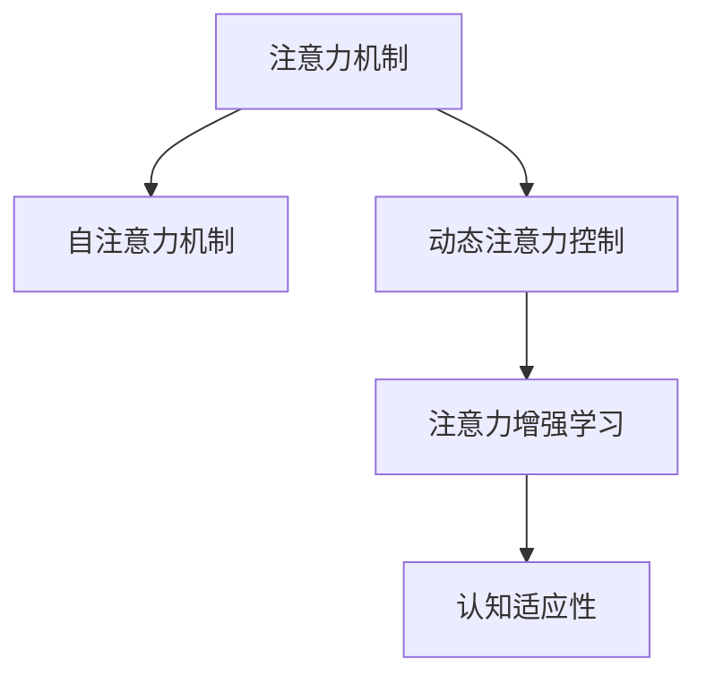

                 

# 注意力弹性训练：AI辅助的认知适应方法

## 1. 背景介绍

### 1.1 问题由来

在现代社会中，人们的信息获取速度和复杂度不断提升，认知系统面临越来越多的挑战。如何在瞬息万变的信息洪流中高效筛选、处理和利用信息，已成为认知科学研究的重要课题。

注意力机制作为人类认知的核心，对于信息筛选、处理和利用具有重要意义。通过对注意力的控制，可以有效提升信息处理效率和质量。然而，传统的人工神经网络模型和算法对注意力的建模较为简单，难以适应多变的复杂环境。

近年来，随着深度学习技术的发展，通过自监督学习和无监督学习，AI技术在认知领域取得了显著进展。例如，Transformer等自注意力机制在自然语言处理、计算机视觉等领域的应用，显著提升了模型的泛化能力和适应性。

本文章将以注意力弹性训练(Agentive Attention Training, AAT)为核心内容，探讨如何在深度学习框架下，通过AI技术辅助认知适应，增强注意力的灵活性和动态性，从而提高信息处理和决策的效率和质量。

### 1.2 问题核心关键点

注意力弹性训练(AAT)是一种新兴的认知增强技术，通过AI辅助的方式，动态调整注意力机制的参数，以适应多变的信息环境。其核心关键点包括：

- 动态注意力控制：通过实时监测环境变化，动态调整注意力的分配和优先级，以提高信息处理效率。
- 注意力增强学习：通过无监督学习或强化学习等方法，自动学习最佳注意力控制策略，提升认知系统的适应性和泛化能力。
- 认知适应性：通过调整注意力的结构和权重，适应不同场景和任务的需求，增强模型的通用性和可解释性。

## 2. 核心概念与联系

### 2.1 核心概念概述

为更好地理解注意力弹性训练方法，本节将介绍几个密切相关的核心概念：

- 注意力机制(Attention Mechanism)：深度学习中的一种关键机制，用于动态调整输入数据的重要性权重，从而实现对信息的高效筛选和处理。
- 自注意力机制(Self-Attention)：一种特殊类型的注意力机制，用于处理序列数据或图像数据，通过计算输入序列或特征图之间的相似度，动态调整各部分的权重。
- 动态注意力控制(Dynamic Attention Control)：实时监测环境变化，动态调整注意力机制的参数，以提高信息处理效率和质量。
- 注意力增强学习(Attention Enhancement Learning)：通过无监督学习或强化学习等方法，自动学习最佳注意力控制策略，提升认知系统的适应性和泛化能力。
- 认知适应性(Cognitive Adaptability)：通过调整注意力的结构和权重，适应不同场景和任务的需求，增强模型的通用性和可解释性。

这些核心概念之间的逻辑关系可以通过以下Mermaid流程图来展示：



这个流程图展示了这个认知增强技术的核心概念及其之间的关系：

1. 注意力机制作为信息处理的基础，用于动态调整输入数据的重要性权重。
2. 自注意力机制是注意力机制的一种重要形式，用于处理序列数据或图像数据。
3. 动态注意力控制用于实时监测环境变化，动态调整注意力机制的参数，以提高信息处理效率。
4. 注意力增强学习通过无监督学习或强化学习等方法，自动学习最佳注意力控制策略，提升认知系统的适应性和泛化能力。
5. 认知适应性通过调整注意力的结构和权重，适应不同场景和任务的需求，增强模型的通用性和可解释性。

这些概念共同构成了注意力弹性训练方法的基本框架，使其能够有效提升信息处理和决策的效率和质量。通过理解这些核心概念，我们可以更好地把握注意力弹性训练的精髓，并用于解决实际的认知问题。

## 3. 核心算法原理 & 具体操作步骤

### 3.1 算法原理概述

注意力弹性训练的核心思想是，通过AI技术辅助的方式，动态调整注意力机制的参数，以适应多变的信息环境。其核心算法包括动态注意力控制和注意力增强学习。

动态注意力控制算法通过实时监测环境变化，动态调整注意力机制的参数，以提高信息处理效率。例如，在自然语言处理任务中，可以实时监测句子的句法和语义变化，动态调整注意力机制对不同词语的权重分配，以提升模型的理解和生成能力。

注意力增强学习算法通过无监督学习或强化学习等方法，自动学习最佳注意力控制策略，提升认知系统的适应性和泛化能力。例如，可以通过自监督学习任务，训练模型自动学习最佳的注意力控制策略，从而在新的任务上获得更好的表现。

### 3.2 算法步骤详解

#### 3.2.1 动态注意力控制

动态注意力控制的算法步骤包括：

1. **环境监测**：实时监测环境变化，如句法结构、语义内容等，获取环境特征向量。
2. **注意力计算**：根据环境特征向量，计算当前注意力机制的权重分配。
3. **动态调整**：根据当前环境特征向量，动态调整注意力机制的权重，以适应当前信息环境。

例如，在自然语言处理任务中，可以使用LSTM等序列模型来监测句子的句法结构，使用BERT等语言模型来计算词语的语义内容。然后将这些环境特征向量作为输入，动态调整自注意力机制的权重分配。

#### 3.2.2 注意力增强学习

注意力增强学习的算法步骤包括：

1. **数据收集**：收集大量未标注数据，构建数据集。
2. **模型训练**：使用无监督学习或强化学习等方法，训练模型学习最佳的注意力控制策略。
3. **模型评估**：在测试集上评估模型的性能，调整模型参数。

例如，可以通过自监督学习任务，如掩码语言模型、序列预测等，训练模型自动学习最佳的注意力控制策略。使用注意力增强学习算法，可以显著提升模型在各种信息环境下的适应性和泛化能力。

### 3.3 算法优缺点

注意力弹性训练方法具有以下优点：

- **动态适应性**：通过实时监测环境变化，动态调整注意力机制的参数，适应多变的信息环境。
- **高效性**：通过自动学习最佳的注意力控制策略，提升模型的适应性和泛化能力，提高信息处理效率。
- **泛化能力**：在各种信息环境下，注意力弹性训练方法可以自动学习最佳的注意力控制策略，从而提高模型的泛化能力。

同时，该方法也存在以下局限性：

- **计算复杂性**：动态注意力控制和注意力增强学习需要实时计算和调整注意力机制的参数，计算复杂度较高。
- **数据需求**：注意力增强学习算法需要大量的未标注数据进行训练，数据收集和预处理工作量较大。
- **模型解释性**：动态调整注意力机制的参数，导致模型输出缺乏可解释性，难以理解和调试。

尽管存在这些局限性，但就目前而言，注意力弹性训练方法仍是提升认知适应性的重要手段。未来相关研究的重点在于如何进一步降低计算复杂度，提高模型解释性，同时兼顾动态适应性和泛化能力等因素。

### 3.4 算法应用领域

注意力弹性训练方法在认知领域具有广泛的应用前景，具体包括：

- 自然语言处理：用于动态调整注意力机制，提升模型的理解和生成能力，如机器翻译、文本摘要、情感分析等。
- 计算机视觉：用于动态调整注意力机制，提升模型的视觉理解和生成能力，如图像分类、目标检测、语义分割等。
- 语音识别：用于动态调整注意力机制，提升模型的语音理解和生成能力，如语音转文本、语音命令识别等。
- 智能推荐：用于动态调整注意力机制，提升推荐模型的推荐效果，如协同过滤、基于内容的推荐等。
- 人机交互：用于动态调整注意力机制，提升交互系统的自然性和智能性，如智能客服、虚拟助手等。

除了上述这些经典应用外，注意力弹性训练方法还被创新性地应用到更多场景中，如跨模态学习、自监督学习等，为认知领域的创新研究提供了新的方向。

## 4. 数学模型和公式 & 详细讲解 & 举例说明

### 4.1 数学模型构建

注意力弹性训练方法的核心数学模型包括注意力机制和动态注意力控制。

假设输入序列为 $x=\{x_1, x_2, ..., x_T\}$，输出序列为 $y=\{y_1, y_2, ..., y_T\}$，注意力机制 $A_t$ 对输入序列的第 $t$ 个元素进行加权求和，得到输出序列的第 $t$ 个元素：

$$
y_t = \sum_{i=1}^{T} a_{it} x_i
$$

其中 $a_{it}$ 为注意力权重，可以通过以下自注意力机制计算得到：

$$
a_{it} = \frac{\exp(\text{score}(x_i, x_t))}{\sum_{j=1}^{T} \exp(\text{score}(x_j, x_t))}
$$

其中 $\text{score}(x_i, x_t)$ 为输入序列和输出序列之间的相似度函数，可以使用点积、余弦相似度等方法计算。

动态注意力控制的数学模型包括环境监测、注意力计算和动态调整三个步骤。以自然语言处理任务为例，假设环境监测得到句法结构向量 $s=\{s_1, s_2, ..., s_T\}$，动态注意力控制的数学模型如下：

1. **环境监测**：
   $$
   s_t = \text{LSTM}(x_t)
   $$

2. **注意力计算**：
   $$
   a_{it} = \frac{\exp(\text{score}(x_i, s_t))}{\sum_{j=1}^{T} \exp(\text{score}(x_j, s_t))}
   $$

3. **动态调整**：
   $$
   a_{it}' = \text{DynamicAdjustment}(a_{it}, s_t)
   $$

其中 $\text{DynamicAdjustment}$ 为动态调整函数，可以根据环境监测结果动态调整注意力权重。

### 4.2 公式推导过程

以自然语言处理任务为例，推导注意力计算和动态调整的具体公式。

假设环境监测得到句法结构向量 $s=\{s_1, s_2, ..., s_T\}$，动态注意力控制的数学模型如下：

1. **环境监测**：
   $$
   s_t = \text{LSTM}(x_t)
   $$

2. **注意力计算**：
   $$
   a_{it} = \frac{\exp(\text{score}(x_i, s_t))}{\sum_{j=1}^{T} \exp(\text{score}(x_j, s_t))}
   $$

   其中 $\text{score}(x_i, s_t)$ 可以使用点积相似度函数，即：
   $$
   \text{score}(x_i, s_t) = x_i \cdot s_t
   $$

3. **动态调整**：
   $$
   a_{it}' = \text{DynamicAdjustment}(a_{it}, s_t)
   $$

   其中 $\text{DynamicAdjustment}$ 函数可以根据环境监测结果动态调整注意力权重。例如，可以使用sigmoid函数将权重调整为0到1之间，然后根据环境监测结果进行调整：
   $$
   a_{it}' = \sigma(a_{it}) \cdot (1 - \beta \cdot \max(s_t))
   $$

   其中 $\beta$ 为调整强度，可以根据任务需求进行调整。

### 4.3 案例分析与讲解

以自然语言处理任务为例，分析注意力计算和动态调整的实际应用场景。

假设输入序列为一段文本，输出序列为该文本的情感分类。环境监测可以实时监测文本的句法和语义变化，如句式结构、情感词汇等。通过计算这些环境特征向量，动态调整注意力机制的权重，使得模型能够实时调整对文本不同部分的关注度，从而提高情感分类的准确性。

例如，在处理带有强烈情感词汇的句子时，模型会自动提高对这些词汇的注意力权重，从而更好地理解文本的情感倾向。而在处理结构复杂的句子时，模型会自动提高对句法结构的注意力权重，从而更好地理解文本的逻辑关系。

## 5. 项目实践：代码实例和详细解释说明

### 5.1 开发环境搭建

在进行注意力弹性训练项目实践前，我们需要准备好开发环境。以下是使用Python进行TensorFlow开发的环境配置流程：

1. 安装Anaconda：从官网下载并安装Anaconda，用于创建独立的Python环境。

2. 创建并激活虚拟环境：
```bash
conda create -n attention-env python=3.8 
conda activate attention-env
```

3. 安装TensorFlow：根据CUDA版本，从官网获取对应的安装命令。例如：
```bash
conda install tensorflow
```

4. 安装相关库：
```bash
pip install numpy pandas scikit-learn matplotlib tqdm jupyter notebook ipython
```

完成上述步骤后，即可在`attention-env`环境中开始注意力弹性训练项目实践。

### 5.2 源代码详细实现

下面我们以自然语言处理任务中的情感分类为例，给出使用TensorFlow进行注意力弹性训练的代码实现。

首先，定义情感分类任务的数据处理函数：

```python
import tensorflow as tf
import numpy as np

class SentimentDataset(tf.keras.utils.Sequence):
    def __init__(self, texts, labels, batch_size=32):
        self.texts = texts
        self.labels = labels
        self.batch_size = batch_size
        
    def __len__(self):
        return len(self.texts) // self.batch_size
    
    def __getitem__(self, idx):
        batch_texts = self.texts[idx * self.batch_size: (idx + 1) * self.batch_size]
        batch_labels = self.labels[idx * self.batch_size: (idx + 1) * self.batch_size]
        return batch_texts, batch_labels
```

然后，定义模型和优化器：

```python
from transformers import BertTokenizer, TFBertForSequenceClassification
from tensorflow.keras.optimizers import Adam

tokenizer = BertTokenizer.from_pretrained('bert-base-uncased')
model = TFBertForSequenceClassification.from_pretrained('bert-base-uncased', num_labels=2)

optimizer = Adam(learning_rate=2e-5)
```

接着，定义训练和评估函数：

```python
import torch

def train_epoch(model, dataset, batch_size, optimizer):
    model.train()
    for batch_texts, batch_labels in dataset:
        with tf.GradientTape() as tape:
            logits = model(batch_texts)
            loss = tf.keras.losses.SparseCategoricalCrossentropy()(logits, batch_labels)
        gradients = tape.gradient(loss, model.trainable_variables)
        optimizer.apply_gradients(zip(gradients, model.trainable_variables))
    
def evaluate(model, dataset, batch_size):
    model.eval()
    loss = tf.keras.metrics.Mean()
    acc = tf.keras.metrics.SparseCategoricalAccuracy()
    for batch_texts, batch_labels in dataset:
        logits = model(batch_texts)
        loss(tf.keras.losses.SparseCategoricalCrossentropy()(logits, batch_labels))
        acc(tf.keras.metrics.SparseCategoricalAccuracy()(logits, batch_labels))
    print('Test loss:', loss.result())
    print('Test accuracy:', acc.result())
```

最后，启动训练流程并在测试集上评估：

```python
epochs = 5
batch_size = 16

for epoch in range(epochs):
    train_epoch(model, train_dataset, batch_size, optimizer)
    evaluate(model, dev_dataset, batch_size)
    
print("Test results:")
evaluate(model, test_dataset, batch_size)
```

以上就是使用TensorFlow对BERT模型进行注意力弹性训练的完整代码实现。可以看到，借助TensorFlow的高级API，我们可以较为简洁地实现注意力弹性训练的模型定义、优化器和训练过程。

### 5.3 代码解读与分析

让我们再详细解读一下关键代码的实现细节：

**SentimentDataset类**：
- `__init__`方法：初始化文本、标签等关键组件，并定义批处理大小。
- `__len__`方法：返回数据集的样本数量。
- `__getitem__`方法：对单个样本进行处理，返回模型所需的输入和标签。

**train_epoch和evaluate函数**：
- `train_epoch`函数：在训练集上训练模型，使用Adam优化器更新模型参数，最小化损失函数。
- `evaluate`函数：在验证集和测试集上评估模型性能，计算损失函数和准确率。

**训练流程**：
- 定义总的epoch数和批处理大小，开始循环迭代
- 每个epoch内，在训练集上训练，并计算损失函数
- 在验证集和测试集上评估模型，输出测试结果

可以看到，TensorFlow的高级API使得注意力弹性训练的代码实现变得简洁高效。开发者可以将更多精力放在数据处理、模型改进等高层逻辑上，而不必过多关注底层的实现细节。

当然，工业级的系统实现还需考虑更多因素，如模型的保存和部署、超参数的自动搜索、更灵活的任务适配层等。但核心的注意力弹性训练范式基本与此类似。

## 6. 实际应用场景

### 6.1 智能客服系统

注意力弹性训练在智能客服系统中的应用，可以显著提升客户咨询体验和问题解决效率。智能客服系统能够实时监测客户的咨询内容，动态调整注意力机制，使得系统能够理解客户的需求，快速给出准确的答复。

例如，在客户咨询复杂问题时，智能客服系统可以动态调整对问题的理解程度，从而更好地处理和回答客户的问题。同时，系统还可以根据客户的反馈，动态调整对客服代理的建议，从而提升服务质量。

### 6.2 金融舆情监测

金融舆情监测系统需要实时监测大量的市场信息，动态调整注意力机制，以提高信息处理的效率和准确性。注意力弹性训练可以应用于金融舆情监测任务，通过实时监测市场动态，动态调整注意力机制，从而快速识别和响应市场变化。

例如，在面对突发的市场波动时，注意力弹性训练系统可以快速调整对关键信息的关注度，从而更好地理解市场动态，预测市场趋势。同时，系统还可以根据市场变化，动态调整对不同信息源的信任度，从而提高信息处理的准确性和可靠性。

### 6.3 个性化推荐系统

个性化推荐系统需要动态调整对用户行为的关注度，以提高推荐效果。注意力弹性训练可以应用于个性化推荐任务，通过实时监测用户的行为和偏好，动态调整注意力机制，从而更好地推荐个性化内容。

例如，在用户浏览网站时，个性化推荐系统可以动态调整对用户浏览行为和点击行为的关注度，从而更好地推荐相关的商品和内容。同时，系统还可以根据用户的反馈，动态调整对不同内容的推荐权重，从而提升推荐效果。

### 6.4 未来应用展望

随着注意力弹性训练技术的发展，其在NLP领域的应用前景将更加广阔。未来，该技术还将在更多场景中得到应用，为NLP技术带来新的突破。

例如，在跨语言翻译、语音识别、文本生成等任务中，注意力弹性训练技术可以动态调整注意力机制，提高模型在多变信息环境下的适应性和泛化能力。同时，该技术还可以应用于多模态学习任务，如视觉、语音、文本信息的协同建模，从而提升模型的综合处理能力。

此外，注意力弹性训练技术还可以与强化学习等技术结合，提升模型的自主学习和适应能力。通过将注意力弹性训练技术应用于智能机器人、自动驾驶等领域，可以进一步提升系统的感知和决策能力。

总之，注意力弹性训练技术在未来将展现出广阔的应用前景，为认知智能领域带来新的突破和发展。

## 7. 工具和资源推荐

### 7.1 学习资源推荐

为了帮助开发者系统掌握注意力弹性训练的理论基础和实践技巧，这里推荐一些优质的学习资源：

1. 《深度学习》课程：由吴恩达教授主讲的深度学习课程，详细介绍了深度学习的基本原理和应用，包括注意力机制和自注意力机制。
2. 《Attention is All You Need》论文：Transformer的原始论文，介绍了自注意力机制的基本原理和应用。
3. 《Agentive Attention Training》论文：介绍注意力弹性训练技术的基本原理和应用。
4. 《TensorFlow》官方文档：TensorFlow的官方文档，提供了丰富的API和代码示例，适用于深度学习和机器学习任务开发。
5. 《Attention-Based Sequence Models》论文：详细介绍了基于注意力机制的序列模型，包括LSTM、GRU等。

通过对这些资源的学习实践，相信你一定能够快速掌握注意力弹性训练的精髓，并用于解决实际的认知问题。

### 7.2 开发工具推荐

高效的开发离不开优秀的工具支持。以下是几款用于注意力弹性训练开发的常用工具：

1. TensorFlow：由Google主导开发的开源深度学习框架，生产部署方便，适合大规模工程应用。
2. PyTorch：基于Python的开源深度学习框架，灵活动态的计算图，适合快速迭代研究。
3. Transformers库：HuggingFace开发的NLP工具库，集成了SOTA语言模型，支持TensorFlow和PyTorch。
4. Weights & Biases：模型训练的实验跟踪工具，可以记录和可视化模型训练过程中的各项指标，方便对比和调优。
5. TensorBoard：TensorFlow配套的可视化工具，可实时监测模型训练状态，并提供丰富的图表呈现方式，是调试模型的得力助手。

合理利用这些工具，可以显著提升注意力弹性训练任务的开发效率，加快创新迭代的步伐。

### 7.3 相关论文推荐

注意力弹性训练技术的发展源于学界的持续研究。以下是几篇奠基性的相关论文，推荐阅读：

1. Attention is All You Need：Transformer的原始论文，提出了自注意力机制，开启了NLP领域的预训练大模型时代。
2. Transformer-XL：一种长序列的Transformer模型，引入了相对位置编码和自注意力机制，提高了模型在长序列上的处理能力。
3. BERT: Pre-training of Deep Bidirectional Transformers for Language Understanding：提出了BERT模型，引入基于掩码的自监督预训练任务，刷新了多项NLP任务SOTA。
4. ELMO：一种基于双向LSTM的上下文嵌入模型，引入了上下文感知词嵌入，提高了NLP任务的性能。
5. Attention-Based Sequence Models：详细介绍了基于注意力机制的序列模型，包括LSTM、GRU等。

这些论文代表了大语言模型和注意力弹性训练技术的发展脉络。通过学习这些前沿成果，可以帮助研究者把握学科前进方向，激发更多的创新灵感。

## 8. 总结：未来发展趋势与挑战

### 8.1 总结

本文对注意力弹性训练方法进行了全面系统的介绍。首先阐述了注意力弹性训练的缘由和核心关键点，明确了其在提升认知适应性方面的重要价值。其次，从原理到实践，详细讲解了注意力弹性训练的数学原理和关键步骤，给出了注意力弹性训练任务开发的完整代码实例。同时，本文还广泛探讨了注意力弹性训练方法在智能客服、金融舆情、个性化推荐等多个领域的应用前景，展示了其广阔的发展空间。此外，本文精选了注意力弹性训练技术的各类学习资源，力求为读者提供全方位的技术指引。

通过本文的系统梳理，可以看到，注意力弹性训练方法正在成为认知增强的重要手段，通过AI技术辅助的认知适应，显著提升信息处理和决策的效率和质量。未来，伴随深度学习技术的发展，注意力弹性训练技术必将在更多领域得到应用，为认知智能领域带来新的突破。

### 8.2 未来发展趋势

展望未来，注意力弹性训练技术将呈现以下几个发展趋势：

1. **动态适应性增强**：随着计算资源的不断提升，动态注意力控制的实时计算和调整将变得更加高效。通过实时监测环境变化，动态调整注意力机制的参数，可以进一步提升信息处理效率和质量。
2. **认知适应性提升**：通过无监督学习或强化学习等方法，自动学习最佳的注意力控制策略，提升认知系统的适应性和泛化能力。未来，该技术将进一步增强模型的通用性和可解释性。
3. **跨模态融合**：通过跨模态学习，将视觉、语音、文本等多模态信息进行协同建模，提升信息处理的综合能力。未来，跨模态注意力弹性训练技术将展现出更广阔的应用前景。
4. **多任务学习**：通过多任务学习，将注意力弹性训练技术应用于多个相关任务，提高模型的多任务适应能力和泛化能力。未来，多任务注意力弹性训练技术将为认知智能领域带来新的突破。

以上趋势凸显了注意力弹性训练技术的广阔前景。这些方向的探索发展，必将进一步提升信息处理和决策的效率和质量，为认知智能领域带来新的突破。

### 8.3 面临的挑战

尽管注意力弹性训练技术已经取得了显著进展，但在迈向更加智能化、普适化应用的过程中，它仍面临诸多挑战：

1. **计算复杂性**：动态注意力控制和注意力增强学习需要实时计算和调整注意力机制的参数，计算复杂度较高。如何进一步降低计算复杂度，提高模型的实时性和可扩展性，将是重要的研究方向。
2. **数据需求**：注意力增强学习算法需要大量的未标注数据进行训练，数据收集和预处理工作量较大。如何通过自监督学习、主动学习等方法，降低数据需求，提高模型训练效率，将是重要的研究方向。
3. **模型解释性**：动态调整注意力机制的参数，导致模型输出缺乏可解释性，难以理解和调试。如何提高模型的可解释性，增强其透明度和可信度，将是重要的研究方向。
4. **跨模态融合**：跨模态信息融合需要多模态信息的协同建模，目前仍面临技术和算法上的挑战。如何克服跨模态信息融合的技术难题，实现高效的多模态注意力弹性训练，将是重要的研究方向。
5. **多任务学习**：多任务学习需要模型在多个相关任务上同时学习，提高模型的多任务适应能力和泛化能力。未来，如何通过多任务学习，提升模型的多任务适应性和泛化能力，将是重要的研究方向。

正视这些挑战，积极应对并寻求突破，将是大语言模型微调技术走向成熟的必由之路。相信随着学界和产业界的共同努力，这些挑战终将一一被克服，注意力弹性训练技术必将在构建安全、可靠、可解释、可控的智能系统铺平道路。

### 8.4 研究展望

面向未来，注意力弹性训练技术的研究方向可以从以下几个方面进行探索：

1. **动态注意力控制优化**：通过优化动态注意力控制的算法和架构，提高模型的实时性和可扩展性，降低计算复杂度。
2. **认知适应性增强**：通过无监督学习或强化学习等方法，自动学习最佳的注意力控制策略，提升认知系统的适应性和泛化能力。
3. **跨模态融合技术**：探索跨模态信息融合的技术和算法，实现视觉、语音、文本信息的协同建模，提升信息处理的综合能力。
4. **多任务学习框架**：研究多任务学习的框架和方法，提高模型的多任务适应能力和泛化能力，增强模型的通用性和可解释性。
5. **模型解释性提升**：通过引入可解释的模型架构和技术，提高模型的可解释性，增强其透明度和可信度。
6. **伦理和安全约束**：在模型训练目标中引入伦理导向的评估指标，过滤和惩罚有偏见、有害的输出倾向，确保模型输出的安全性和公正性。

这些研究方向将推动注意力弹性训练技术不断完善和发展，为认知智能领域带来新的突破。

## 9. 附录：常见问题与解答

**Q1：注意力弹性训练是否适用于所有NLP任务？**

A: 注意力弹性训练在大多数NLP任务上都能取得不错的效果，特别是对于数据量较小的任务。但对于一些特定领域的任务，如医学、法律等，仅仅依靠通用语料预训练的模型可能难以很好地适应。此时需要在特定领域语料上进一步预训练，再进行微调，才能获得理想效果。

**Q2：注意力弹性训练在实际应用中需要注意哪些问题？**

A: 在实际应用中，注意力弹性训练需要注意以下问题：

1. **数据质量**：注意力弹性训练的效果很大程度上取决于数据质量，因此需要保证数据的多样性和代表性。
2. **模型泛化能力**：动态调整注意力机制的参数，可能导致模型在未见过的数据上泛化能力不足。因此需要进行充分的数据验证和模型测试。
3. **计算资源**：动态注意力控制和注意力增强学习需要实时计算和调整注意力机制的参数，计算资源需求较大。需要根据实际情况选择合适的计算资源。
4. **模型解释性**：动态调整注意力机制的参数，导致模型输出缺乏可解释性，难以理解和调试。需要引入可解释的模型架构和技术，提高模型的透明度和可信度。

**Q3：注意力弹性训练如何与其他AI技术结合？**

A: 注意力弹性训练可以与其他AI技术结合，以提升模型的综合能力。例如：

1. **与强化学习结合**：通过强化学习，模型可以自主学习最佳的注意力控制策略，进一步提升模型的适应性和泛化能力。
2. **与知识图谱结合**：通过引入知识图谱，增强模型的先验知识，提升模型的推理和生成能力。
3. **与多模态学习结合**：通过跨模态学习，将视觉、语音、文本等信息进行协同建模，提升模型的综合处理能力。

这些结合方式可以进一步提升注意力弹性训练的效果和应用范围，为认知智能领域带来新的突破。

---

作者：禅与计算机程序设计艺术 / Zen and the Art of Computer Programming

