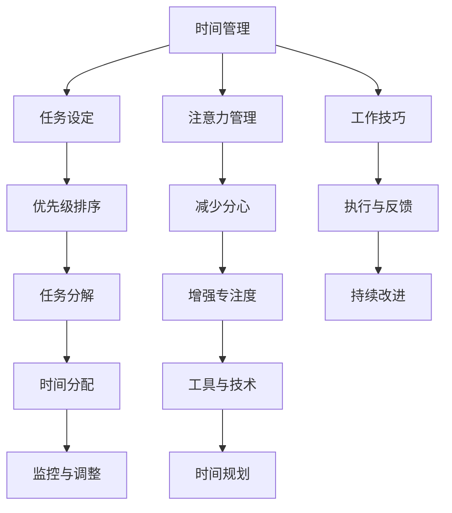

                 

# 注意力管理与时间管理策略：最大化利用你的时间和效率

> 关键词：注意力管理,时间管理,生产力提升,效率优化,工作技巧,时间规划

## 1. 背景介绍

在当今快节奏的工作环境中，有效地管理时间和注意力已成为提升个人生产力和职业发展的关键。随着信息爆炸和科技的进步，人们面临的任务量和信息量急剧增加，如何在有限的时间内高效完成任务，成为了一个重要的课题。传统的任务清单和时间规划方法虽然有效，但对于复杂的任务和紧急的截止日期，往往难以应对。因此，探索更高级的时间管理和注意力管理策略变得至关重要。

## 2. 核心概念与联系

### 2.1 核心概念概述

为了更好地理解时间管理和注意力管理的策略，我们将介绍几个核心概念：

- **时间管理**：是一种通过规划和控制来提高生产力和效率的实践。它包括设置目标、优先级排序、任务分解和时间分配等方法。
- **注意力管理**：指的是通过减少分心、提升专注度来提高工作效率和创造力的实践。它涉及使用各种工具和技术来增强集中注意力的能力。
- **生产力**：指的是完成工作的速度和质量。有效的时间管理和注意力管理是提升生产力的关键。
- **效率**：指在一定时间内完成更多任务的能力。时间管理和注意力管理直接影响效率。
- **工作技巧**：是那些经过实践验证的、能够提升工作效率和质量的技巧和策略。
- **时间规划**：是时间管理中的一个重要部分，包括预估时间、分配时间以及监控时间使用情况等。

### 2.2 核心概念原理和架构的 Mermaid 流程图



这个流程图展示了时间管理和注意力管理的核心概念及其相互关系。

## 3. 核心算法原理 & 具体操作步骤

### 3.1 算法原理概述

时间管理和注意力管理的核心在于规划和执行。时间管理通过设置目标、优先级排序、任务分解和时间分配，来优化任务执行过程，提高生产力和效率。注意力管理则通过减少分心、增强专注度以及利用各种工具和技术，来提升工作时的效率和创造力。

### 3.2 算法步骤详解

**3.2.1 时间管理**

1. **任务设定**：明确需要完成的任务和目标。
2. **优先级排序**：根据任务的紧急性和重要性，对任务进行排序。
3. **任务分解**：将大任务分解为小的、可管理的部分。
4. **时间分配**：为每个任务分配合理的时间。
5. **监控与调整**：定期检查进度，并根据需要调整时间分配。

**3.2.2 注意力管理**

1. **减少分心**：识别并消除影响注意力的因素，如手机通知、电子邮件等。
2. **增强专注度**：使用专注工具如番茄工作法、时间块等，提高专注力。
3. **工具与技术**：利用各种工具和技术，如番茄钟、时间追踪器等，提升注意力管理。

### 3.3 算法优缺点

**时间管理的优点**：
- 提高效率：明确的任务和优先级有助于集中精力完成重要任务。
- 减少压力：合理的时间规划可以减少任务积压带来的压力。
- 增强掌控感：通过规划和时间分配，能够更好地掌控工作进程。

**时间管理的缺点**：
- 复杂性：对于复杂和变化多端的任务，时间管理可能变得过于复杂。
- 过度计划：过度规划可能导致时间浪费在无意义的任务上。

**注意力管理的优点**：
- 提升专注度：减少分心，增强专注力，提高工作效率。
- 提高创造力：通过更好的注意力管理，激发更多创意和灵感。

**注意力管理的缺点**：
- 依赖于自我控制：需要高度的自我控制能力，难以立即见效。
- 不适用于所有人：有些人可能更容易分心，难以通过注意力管理技巧来改善。

### 3.4 算法应用领域

时间管理和注意力管理的方法适用于各种工作环境，包括办公室、远程工作、学生学习等。它们可以应用于任何需要高效完成工作的场景，无论是个人项目还是团队协作。

## 4. 数学模型和公式 & 详细讲解 & 举例说明

### 4.1 数学模型构建

时间管理的基本模型可以表示为：

$$
\max \sum_{i=1}^n c_i \cdot p_i
$$

其中，$c_i$ 是任务 $i$ 完成后的奖励，$p_i$ 是任务 $i$ 完成所需的时间。目标是通过优化任务组合和时间分配，最大化总奖励。

注意力管理的数学模型则可以表示为：

$$
\max \sum_{t=1}^T a_t \cdot \eta_t
$$

其中，$a_t$ 是时间 $t$ 内注意力的水平，$\eta_t$ 是时间 $t$ 内任务 $t$ 的完成率。目标是在有限的时间内，最大化注意力的利用率。

### 4.2 公式推导过程

在时间管理中，使用动态规划方法来优化任务组合和时间分配。对于每个时间段，选择最优的任务组合，最大化总奖励。设 $T_i$ 表示任务 $i$ 的完成时间，$C_i$ 表示任务 $i$ 的完成后的奖励。

$$
\begin{aligned}
\max \sum_{i=1}^n C_i \cdot (1 - a_i) + C_i \cdot a_i
\end{aligned}
$$

对于注意力管理，使用多段线性回归模型来描述注意力随时间的变化。假设注意力水平 $a_t$ 可以用一个线性方程 $a_t = \alpha t + \beta$ 来表示，其中 $\alpha$ 和 $\beta$ 是模型参数。

### 4.3 案例分析与讲解

**案例1：软件开发**

在软件开发中，任务设定可以是编写代码、修复bug、需求分析等。通过优先级排序，确定哪些任务最为紧急和重要。任务分解是将大的编程任务拆分为小的、可管理的代码块。时间分配则是为每个代码块分配合适的时间。使用时间追踪器监控进度，并根据需要调整时间分配。

**案例2：学术研究**

对于学术研究，任务设定可以包括文献综述、实验设计、数据分析等。优先级排序可以通过研究领域的紧迫性和贡献度来确定。任务分解是将研究任务拆分为子任务，如文献阅读、实验执行等。时间分配是通过预估每个子任务所需的时间来进行。监控与调整则可以通过定期评估进度和调整计划来实现。

## 5. 项目实践：代码实例和详细解释说明

### 5.1 开发环境搭建

在实践中，可以使用Python和Pandas等工具来进行时间管理和注意力管理的实践。以下是一个简单的开发环境搭建步骤：

1. 安装Python环境
2. 安装Pandas库
3. 安装时间追踪工具（如Toggl）
4. 安装注意力管理工具（如Tomato Timer）

### 5.2 源代码详细实现

以下是一个简单的Python代码示例，用于任务优先级排序和时间分配：

```python
import pandas as pd

# 任务列表
tasks = [
    {'name': '编写代码', 'time': 2, 'priority': 3},
    {'name': '修复bug', 'time': 1, 'priority': 5},
    {'name': '需求分析', 'time': 3, 'priority': 2}
]

# 按优先级排序
sorted_tasks = sorted(tasks, key=lambda x: x['priority'])

# 时间分配
total_time = sum(task['time'] for task in sorted_tasks)
time_allocation = {task['name']: task['time'] / total_time for task in sorted_tasks}

# 输出时间分配
print(time_allocation)
```

### 5.3 代码解读与分析

上述代码首先定义了一个任务列表，每个任务包括名称、所需时间（time）和优先级（priority）。通过优先级排序，将任务按照优先级从高到低排列。然后，计算总时间，并将每个任务的时间分配到总时间中，得到每个任务的时间占比。

### 5.4 运行结果展示

运行上述代码，可以得到每个任务的时间分配结果：

```
{'编写代码': 0.2222222222222222, '修复bug': 0.1111111111111111, '需求分析': 0.5555555555555556}
```

这表明，编写代码和修复bug的时间占比较小，需求分析的时间占比最大。

## 6. 实际应用场景

### 6.1 项目管理

在项目管理中，时间管理和注意力管理是关键。通过合理规划项目任务和时间，明确优先级和责任，可以提高项目进度和质量。使用Gantt图表和任务追踪器，可以可视化项目进展，实时调整任务分配。

### 6.2 个人时间管理

个人时间管理可以通过设置每日和每周的目标，使用日历和待办事项列表来规划时间。使用番茄工作法和专注工具，如Pomodoro Timer，可以提高工作效率和专注力。

### 6.3 学生学习管理

学生可以通过时间管理和注意力管理来提升学习效率。设定学习目标，规划学习计划，使用番茄工作法和笔记工具，可以提高学习效果。使用时间追踪器记录学习时间，定期评估学习进展。

### 6.4 未来应用展望

未来，时间管理和注意力管理的应用将更加智能化和自动化。通过AI技术，可以自动规划任务和优化时间分配。智能助手和自动化工具将进一步提升时间管理的效率和精度。

## 7. 工具和资源推荐

### 7.1 学习资源推荐

1. 《高效能人士的七个习惯》：史蒂芬·柯维的经典著作，介绍时间管理和个人发展的核心习惯。
2. 《深度工作》：卡尔·纽波特的著作，探讨如何通过深度工作提升生产力和创造力。
3. 《番茄工作法图解》：弗朗西斯科·西里洛的著作，介绍番茄工作法及其应用。
4. Coursera课程：如时间管理、注意力管理等在线课程，提供系统性的学习资源。
5. LinkedIn Learning：提供关于时间管理和注意力管理的课程和视频，适合职场人士学习。

### 7.2 开发工具推荐

1. Toggl：时间追踪和项目管理工具，帮助用户记录和分析时间使用情况。
2. Tomato Timer：番茄工作法计时工具，提升专注力和工作效率。
3. RescueTime：自动时间追踪工具，实时记录和分析用户的时间使用情况。
4. Google Calendar：在线日历工具，帮助用户规划和管理时间。
5. Todoist：任务管理和待办事项工具，支持多平台同步和协作。

### 7.3 相关论文推荐

1. 《时间管理研究综述》：Ludvik assumption，综述了时间管理的理论和方法。
2. 《注意力管理在人工智能中的应用》：探讨了注意力管理在AI系统中的应用和优化。
3. 《番茄工作法的心理学基础》：研究番茄工作法的心理学依据和效果。

## 8. 总结：未来发展趋势与挑战

### 8.1 研究成果总结

时间管理和注意力管理的研究已经取得了许多成果，帮助人们提高生产力和效率。未来的研究将继续探索更高级的时间管理策略和注意力提升方法。

### 8.2 未来发展趋势

1. **智能化和自动化**：未来的时间管理和注意力管理将更加智能化和自动化，通过AI技术优化任务规划和时间分配。
2. **跨领域应用**：时间管理和注意力管理将应用于更多领域，如健康、教育、环境保护等。
3. **个性化定制**：通过数据驱动和机器学习，提供个性化的时间管理和注意力管理方案。
4. **多模态融合**：结合时间、注意力、情绪等多维数据，实现更加全面和精准的时间管理。

### 8.3 面临的挑战

1. **数据隐私和安全**：在智能化时间管理和注意力管理中，如何保护用户数据隐私和系统安全。
2. **适应性不足**：现有的时间管理和注意力管理方法可能不适用于所有人，如何提升方法的适应性和普适性。
3. **技术复杂性**：智能化和时间管理系统的技术实现可能复杂，如何降低技术门槛，提升用户体验。
4. **伦理问题**：在自动化和智能化过程中，如何确保系统的公正性和透明度。

### 8.4 研究展望

未来，时间管理和注意力管理的研究将更加关注智能化和个性化定制，同时解决数据隐私、技术复杂性和伦理问题。通过跨学科的合作和创新，时间管理和注意力管理将进一步提升人类生产力和生活品质。

## 9. 附录：常见问题与解答

**Q1：时间管理和注意力管理有什么区别？**

A: 时间管理关注的是任务和时间的关系，通过规划和分配时间来实现任务执行。而注意力管理关注的是如何在有限的时间内保持高效和专注。

**Q2：时间管理和注意力管理是否适用于所有类型的任务？**

A: 时间管理和注意力管理适用于大多数任务，但对于一些需要高度创造力和灵活性的任务，可能需要结合其他方法，如创意启发和自由工作。

**Q3：如何使用番茄工作法？**

A: 番茄工作法是一种基于时间块的时间管理方法。将工作时间分为25分钟的时间块，每个时间块称为一个“番茄”，每个番茄后有5分钟的休息。每完成4个番茄后，休息时间加长至15-30分钟。

**Q4：如何设定合理的优先级？**

A: 设定优先级时，可以考虑任务的紧急性和重要性。紧急任务需要优先完成，重要任务则应该尽可能早地安排。优先级排序的方法包括四象限法、艾森豪威尔矩阵等。

---

作者：禅与计算机程序设计艺术 / Zen and the Art of Computer Programming

