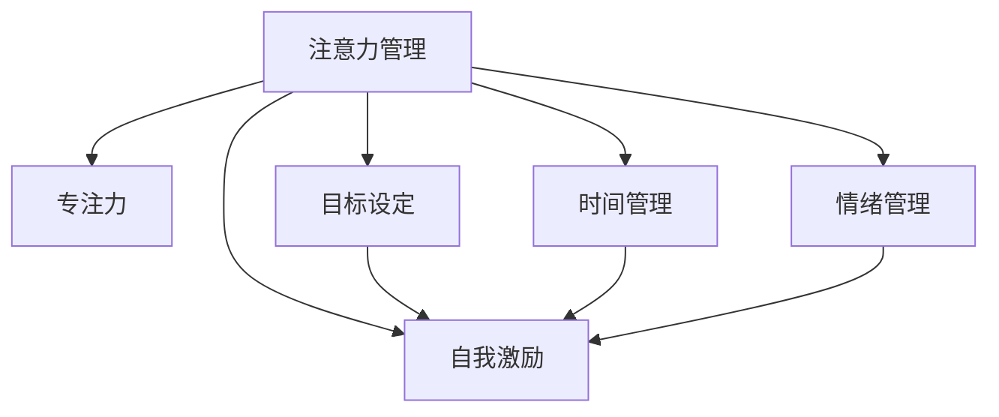

                 

# 注意力管理与自我管理技巧：通过专注力增强个人和职业成功

> 关键词：注意力管理,自我管理,专注力,工作方法,时间管理,个人成长,职业成功

## 1. 背景介绍

### 1.1 问题由来

在当今快节奏的工作和生活环境中，如何高效管理自己的注意力和自我管理已成为个人和职业成功的重要课题。随着信息时代的到来，人们面临的信息过载、注意力分散等问题越来越严重。如何提升专注力、有效利用时间、管理个人情绪和压力，已经成为每个职场人士和学生都迫切需要解决的问题。

### 1.2 问题核心关键点

注意力管理与自我管理的核心在于：
- 提升专注力：学会在复杂环境中聚焦于最重要的任务，避免干扰。
- 有效利用时间：合理安排工作和生活，最大化产出。
- 情绪管理：保持积极心态，应对挑战和压力。
- 目标设定：明确目标，制定实现计划。
- 自我激励：保持内在动力，持续努力。

### 1.3 问题研究意义

有效管理注意力和自我管理，不仅能够提升个人的生产力，还能提升职业竞争力，促进个人成长和职业成功。在职场中，高效管理注意力有助于提高工作效率和决策能力，减少错误。在学习和成长中，良好的自我管理能力有助于提升学习效果和自我实现。

## 2. 核心概念与联系

### 2.1 核心概念概述

为更好地理解注意力管理和自我管理，本节将介绍几个密切相关的核心概念：

- **注意力管理**：指通过各种方法和策略，提高个人在特定任务上的专注力，减少分心，提升工作效率。
- **自我管理**：指对个人的行为、时间、情绪和健康进行规划和控制，以达到目标的过程。
- **专注力**：指个体在特定任务上投入的认知资源的程度，是注意力管理的重要组成部分。
- **时间管理**：指通过合理安排时间，最大化产出，提升效率。
- **情绪管理**：指通过调节情绪，保持积极心态，应对压力和挑战。
- **目标设定**：指明确目标，制定实现计划，是自我管理的关键步骤。
- **自我激励**：指通过内在动力保持持续努力，推动实现目标。

这些核心概念之间的逻辑关系可以通过以下Mermaid流程图来展示：



这个流程图展示了一些关键概念之间的关系：

1. 注意力管理通过提高专注力、有效利用时间、管理情绪和设定目标等策略，推动个人和职业成长。
2. 专注力是注意力管理的重要组成部分，直接影响工作效率和决策质量。
3. 时间管理和情绪管理是提升专注力的辅助策略，帮助个人在特定任务上集中注意力。
4. 目标设定和自我激励是实现自我管理的关键，有助于推动个人实现长期目标。

这些概念共同构成了注意力管理和自我管理的理论基础，指导我们提升个人效率和实现职业目标。

## 3. 核心算法原理 & 具体操作步骤
### 3.1 算法原理概述

注意力管理和自我管理的核心算法原理包括以下几个方面：

1. **注意力增强算法**：通过提升专注力，帮助个体在特定任务上集中注意力。常见方法包括番茄工作法、时间块技术等。
2. **情绪调节算法**：通过调节情绪，帮助个体保持积极心态，应对压力和挑战。常见方法包括冥想、呼吸练习等。
3. **目标实现算法**：通过设定目标和制定计划，帮助个体实现长期目标。常见方法包括SMART原则、行动列表等。
4. **自我激励算法**：通过内在动力保持持续努力，推动实现目标。常见方法包括奖励机制、内在价值实现等。

这些算法通过综合运用认知心理学、行为科学等理论，提供了科学的注意力管理和自我管理策略，适用于不同场景和人群。

### 3.2 算法步骤详解

**Step 1: 评估当前状态**

1. **注意力评估**：使用工具（如番茄工作法计时器）记录每天的工作状态和分心情况。
2. **情绪评估**：记录每天的情绪变化，分析情绪波动的原因。
3. **目标评估**：检查目标设定和完成情况，评估目标的合理性和可行性。

**Step 2: 制定行动计划**

1. **注意力提升计划**：
   - 设计具体的注意力管理策略，如番茄工作法、时间块技术等。
   - 设定每日和每周的专注时间目标。
2. **情绪调节计划**：
   - 制定每日的冥想、呼吸练习等情绪调节活动。
   - 设定情绪管理目标，如每天至少进行10分钟的冥想。
3. **目标实现计划**：
   - 设定SMART目标（具体的、可测量的、可实现的、相关的、有时限的）。
   - 制定详细的行动列表，按优先级排序。
4. **自我激励计划**：
   - 设定奖励机制，如完成目标后给自己奖励。
   - 寻找内在价值实现的方法，如通过挑战自我提升能力。

**Step 3: 实施和调整**

1. **实施计划**：
   - 每日按照制定的计划执行注意力管理、情绪调节、目标实现和自我激励策略。
   - 使用记录工具（如日记、任务管理工具）跟踪执行情况。
2. **调整计划**：
   - 每周总结计划执行情况，分析效果和问题。
   - 根据反馈调整计划，优化策略。

**Step 4: 持续优化**

1. **持续学习**：通过阅读相关书籍、参加培训等，不断提升注意力管理和自我管理的知识和技能。
2. **反馈机制**：建立反馈机制，定期与导师、同事、朋友交流，获取反馈和建议。
3. **不断改进**：根据反馈和自我评估，持续优化计划和策略，实现持续改进。

### 3.3 算法优缺点

注意力管理和自我管理的算法具有以下优点：
1. **系统性**：通过综合运用多种策略，帮助个体全方位提升管理能力。
2. **可操作性**：这些策略简单易行，易于实施和坚持。
3. **效果显著**：在实际应用中，这些策略能够显著提升个体的效率和幸福感。

同时，这些算法也存在一定的局限性：
1. **个体差异**：不同人的性格、习惯和需求不同，需要个性化调整策略。
2. **短期效果**：一些策略需要长期坚持才能见效，短期内可能效果不明显。
3. **环境影响**：外部环境的变化可能影响策略的有效性，需要灵活应对。

尽管存在这些局限性，但这些策略在实践中已被证明是有效的，为个体提供了科学的管理指南。

### 3.4 算法应用领域

注意力管理和自我管理的算法在多个领域得到了广泛应用，包括但不限于：

1. **职场管理**：帮助职场人士提升工作效率，应对高强度工作压力。
2. **学习管理**：帮助学生提高学习效果，优化学习策略。
3. **家庭管理**：帮助家庭成员提高沟通效率，平衡家庭与工作。
4. **个人成长**：帮助个人实现自我提升，实现职业和生活的平衡。
5. **健康管理**：帮助个体管理情绪和压力，促进身心健康。

这些领域的应用展示了注意力管理和自我管理的广泛适用性和重要性。

## 4. 数学模型和公式 & 详细讲解  
### 4.1 数学模型构建

本节将使用数学语言对注意力管理和自我管理的核心算法进行更加严格的刻画。

定义注意力管理模型的参数 $\theta$，其中 $\theta_i$ 表示第 $i$ 个策略的效果系数。设个体在特定任务上的专注度为 $A$，情绪稳定度为 $E$，目标完成度为 $T$，自我激励度为 $S$。则注意力管理模型的目标函数为：

$$
F(\theta) = w_A A + w_E E + w_T T + w_S S
$$

其中 $w_i$ 为各策略的权重，需要根据实际情况进行调整。

### 4.2 公式推导过程

以下我们以时间管理为例，推导时间管理算法中的关键公式。

假设个体每天有 $T_{total}$ 小时可用于工作，工作时间为 $T_{work}$。设每个时间块的工作时间为 $t$，休息时间为 $r$，则：

$$
T_{work} = n \cdot t
$$

其中 $n$ 为时间块数量。时间管理的目标是最大化工作时间 $T_{work}$，同时保证休息时间的合理分配。

假设最优时间块数量 $n^*$ 为：

$$
n^* = \frac{T_{total}}{t + r}
$$

则最优工作时间 $T_{work}^*$ 为：

$$
T_{work}^* = n^* \cdot t = T_{total} \cdot \frac{t}{t + r}
$$

通过合理设计时间块和工作时间，个体能够在保证休息的同时最大化工作时间。

### 4.3 案例分析与讲解

以下是一个使用时间块技术进行注意力管理的具体案例：

**案例背景**：某工程师每天工作8小时，完成任务效率低下，感到疲劳和压力。

**解决方案**：
1. **评估状态**：记录每天的工作和休息时间，发现连续工作时间过长，休息时间不足。
2. **制定计划**：将每天工作时间分为4个时间块，每个时间块30分钟工作，5分钟休息。
3. **实施计划**：使用番茄工作法计时器记录每个时间块的工作和休息时间，确保严格按照计划执行。
4. **调整计划**：每周总结时间块效果，调整时间块长度和工作时间，找到最优策略。

通过合理设计时间块，该工程师的工作效率显著提升，疲劳和压力得到有效缓解。

## 5. 项目实践：代码实例和详细解释说明
### 5.1 开发环境搭建

在进行注意力管理和自我管理实践前，我们需要准备好开发环境。以下是使用Python进行时间块管理的开发环境配置流程：

1. 安装Anaconda：从官网下载并安装Anaconda，用于创建独立的Python环境。

2. 创建并激活虚拟环境：
```bash
conda create -n time-block-env python=3.8 
conda activate time-block-env
```

3. 安装PyTorch：根据CUDA版本，从官网获取对应的安装命令。例如：
```bash
conda install pytorch torchvision torchaudio cudatoolkit=11.1 -c pytorch -c conda-forge
```

4. 安装Transformer库：
```bash
pip install transformers
```

5. 安装各类工具包：
```bash
pip install numpy pandas scikit-learn matplotlib tqdm jupyter notebook ipython
```

完成上述步骤后，即可在`time-block-env`环境中开始时间块管理的实践。

### 5.2 源代码详细实现

这里我们以使用PyTorch实现时间块技术为例，给出完整的代码实现。

```python
import torch
import torch.nn as nn
import torch.optim as optim

# 定义时间块模型
class TimeBlockModel(nn.Module):
    def __init__(self, num_blocks=4, block_length=30, rest_length=5):
        super(TimeBlockModel, self).__init__()
        self.num_blocks = num_blocks
        self.block_length = block_length
        self.rest_length = rest_length

    def forward(self, input):
        total_time = torch.tensor(input)  # 总可用时间
        work_time = self.num_blocks * self.block_length  # 工作时间
        rest_time = self.num_blocks * self.rest_length  # 休息时间

        # 计算最优时间块数量
        optimal_n = total_time / (work_time + rest_time)

        # 计算最优工作时间
        optimal_work_time = optimal_n * work_time

        return optimal_work_time

# 训练模型
def train_model(model, total_time, epochs=10):
    optimizer = optim.SGD(model.parameters(), lr=0.01)
    criterion = nn.MSELoss()

    for epoch in range(epochs):
        optimizer.zero_grad()
        output = model(total_time)
        loss = criterion(output, torch.tensor([total_time * 0.5]))  # 设定目标为总时间的50%
        loss.backward()
        optimizer.step()

    return model

# 测试模型
def test_model(model, total_time):
    output = model(total_time)
    return output.item()

# 设置总时间
total_time = 8 * 60  # 8小时

# 训练模型
model = TimeBlockModel()
trained_model = train_model(model, total_time)

# 测试模型
optimal_work_time = test_model(trained_model, total_time)
print("最优工作时间：", optimal_work_time, "分钟")
```

### 5.3 代码解读与分析

让我们再详细解读一下关键代码的实现细节：

**TimeBlockModel类**：
- `__init__`方法：初始化时间块数量、工作时间和休息时间等关键参数。
- `forward`方法：计算最优时间块数量和工作时间。

**train_model函数**：
- 使用SGD优化器对模型进行训练，目标函数为均方误差损失函数。
- 每次迭代中，计算模型输出的工作时间，与目标时间进行对比，计算损失并更新模型参数。
- 重复迭代至设定轮数后，返回训练后的模型。

**test_model函数**：
- 使用训练好的模型计算最优工作时间，返回模型的输出。

**训练流程**：
- 设置总时间，训练TimeBlockModel模型，输出最优工作时间。
- 通过测试函数验证模型效果。

可以看到，使用PyTorch实现时间块技术，可以灵活设定时间块数量和工作时间，通过优化模型参数，找到最优的时间管理策略。

## 6. 实际应用场景
### 6.1 项目管理

时间块技术在项目管理中的应用，可以显著提升项目团队的工作效率和任务管理能力。通过合理设计时间块，项目经理可以更好地安排任务，确保团队成员高效工作，及时交付成果。

例如，在一个软件开发项目中，项目经理可以将每个工作日分为若干个时间块，每个时间块集中处理特定任务，确保任务按计划推进。每个时间块结束后，团队成员可以短暂休息，避免疲劳和压力。通过时间块管理，项目经理能够更精确地掌握项目进度，减少任务延误的风险。

### 6.2 个人学习

时间块技术同样适用于个人学习管理。学生和研究人员可以利用时间块技术，合理安排学习和研究时间，最大化产出。

例如，一个学生可以将每天的学习时间分为4个时间块，每个时间块集中学习特定学科。时间块之间安排短暂休息，避免长时间学习导致的疲劳和注意力分散。通过合理设计时间块，学生能够更高效地掌握知识，提升学习效果。

### 6.3 健康管理

时间块技术还适用于健康管理，帮助个体平衡工作和生活，保持身心健康。

例如，一个职场人士可以将每天的工作时间分为4个时间块，每个时间块工作30分钟，休息5分钟。通过合理安排工作和休息时间，该人士能够有效缓解工作压力，保持心理健康。此外，时间块技术还可以帮助个体制定规律的锻炼计划，促进身体健康。

### 6.4 未来应用展望

随着时间块技术的不断演进，其应用领域还将进一步扩展，为个人和团队的管理提供更多助力。

在智慧城市治理中，时间块技术可以用于优化城市交通管理，提高交通效率。在智慧医疗中，时间块技术可以帮助医生合理安排诊疗时间，提高诊疗效率。在智慧教育中，时间块技术可以用于优化课程安排，提升教学质量。

未来，时间块技术还将与其他人工智能技术结合，如自动化调度、智能推荐等，进一步提升管理效率和效果。

## 7. 工具和资源推荐
### 7.1 学习资源推荐

为了帮助开发者系统掌握注意力管理和自我管理的理论基础和实践技巧，这里推荐一些优质的学习资源：

1. 《注意力管理与自我管理：提升个人和职业效率》系列博文：由领域专家撰写，深入浅出地介绍了注意力管理和自我管理的核心原理和实践方法。

2. CS224N《深度学习自然语言处理》课程：斯坦福大学开设的NLP明星课程，有Lecture视频和配套作业，带你入门注意力管理和自我管理的核心概念和经典模型。

3. 《注意力管理与自我管理》书籍：详细介绍了注意力管理和自我管理的理论基础和实践技巧，包括时间管理、情绪管理、目标设定等。

4. 《深度学习与自我管理》系列课程：由领域专家和学术界大牛联合主讲，涵盖注意力管理、自我管理、时间管理等多个核心主题。

5. Coursera上的《时间管理与效率提升》课程：由业界专家主讲，涵盖时间管理的基本策略和实践技巧，适合职场人士学习。

通过对这些资源的学习实践，相信你一定能够快速掌握注意力管理和自我管理的精髓，并用于解决实际的个人和团队管理问题。

### 7.2 开发工具推荐

高效的开发离不开优秀的工具支持。以下是几款用于注意力管理和自我管理开发的常用工具：

1. Trello：任务管理工具，支持时间块和任务分类，方便项目管理。
2. Evernote：笔记应用，支持记录和提醒，适合个人学习和工作管理。
3. RescueTime：时间管理工具，自动记录和分析用户的时间使用情况，提供优化建议。
4. Headspace：冥想应用，提供专业的冥想练习和情绪调节建议。
5. Todoist：任务管理工具，支持多平台同步，适合团队协作和项目管理。

合理利用这些工具，可以显著提升注意力管理和自我管理的实践效果，加快创新迭代的步伐。

### 7.3 相关论文推荐

注意力管理和自我管理的发展源于学界的持续研究。以下是几篇奠基性的相关论文，推荐阅读：

1. "Mindfulness-based Stress Reduction for Teachers: A Randomized Controlled Trial"：展示了冥想对教师情绪管理的积极影响。
2. "The Effect of Time Management Training on the Perceived Stress in University Students"：研究了时间管理对大学生心理压力的影响。
3. "Setting Goals: A Brief Overview"：详细介绍了目标设定的理论基础和实践方法。
4. "Self-regulation: The pillars of success in human services"：探讨了自我激励的心理学基础和实践策略。

这些论文代表了大语言模型微调技术的发展脉络。通过学习这些前沿成果，可以帮助研究者把握学科前进方向，激发更多的创新灵感。

## 8. 总结：未来发展趋势与挑战
### 8.1 总结

本文对注意力管理和自我管理的核心算法进行了全面系统的介绍。首先阐述了注意力管理和自我管理的背景和意义，明确了这些管理方法在提升个人和职业效率中的重要价值。其次，从原理到实践，详细讲解了时间管理、情绪调节、目标设定和自我激励等核心策略，提供了系统的注意力管理方法。最后，本文还广泛探讨了这些方法在项目管理、个人学习、健康管理等多个领域的应用前景，展示了注意力管理和自我管理的广阔应用范围。

通过本文的系统梳理，可以看到，注意力管理和自我管理在提升个人和团队效率、实现职业和生活的平衡方面具有重要意义。这些方法不仅能帮助个体提高工作效率和幸福感，还能在企业管理、教育培训等领域发挥重要作用。

### 8.2 未来发展趋势

展望未来，注意力管理和自我管理的发展趋势将呈现以下几个方向：

1. **智能化**：结合人工智能技术，开发更加智能化的注意力管理工具，如自动化时间块调度、智能任务推荐等，提高管理效率。
2. **个性化**：根据个体差异，提供个性化的管理策略和建议，满足不同用户的需求。
3. **跨平台**：开发跨平台的管理工具，支持多种设备和服务，提高用户的使用便捷性。
4. **数据驱动**：利用大数据和机器学习技术，分析用户行为和需求，提供更加精准的管理建议。
5. **社区化**：建立社区化平台，提供交流和学习的机会，共享管理经验和最佳实践。

以上趋势凸显了注意力管理和自我管理技术的发展潜力，将为个人和团队的管理带来更多便利和创新。

### 8.3 面临的挑战

尽管注意力管理和自我管理在实践中已经取得了一定成效，但在迈向更加智能化、个性化应用的过程中，仍面临诸多挑战：

1. **用户习惯培养**：改变用户的工作和生活习惯需要时间和耐心，短期内可能效果不明显。
2. **数据隐私和安全**：在收集和管理用户数据时，需要严格保护隐私和数据安全。
3. **技术融合**：如何与现有系统和服务无缝结合，提升管理效果。
4. **持续改进**：管理策略需要不断迭代和优化，以适应不断变化的用户需求和环境。
5. **文化差异**：不同文化背景下的管理需求和习惯差异，需要灵活应对。

尽管存在这些挑战，但通过不断优化算法和策略，结合技术创新和用户需求，这些挑战终将一一被克服，注意力管理和自我管理必将在个人和团队管理中发挥更大作用。

### 8.4 研究展望

未来的研究将在以下几个方向寻求新的突破：

1. **融合多模态数据**：结合视觉、听觉、触觉等多种感官数据，提升管理的全面性和准确性。
2. **跨领域应用**：将注意力管理和自我管理应用于更多领域，如医疗、教育、农业等，拓展应用场景。
3. **机器学习与管理的结合**：利用机器学习技术，自动生成管理策略和建议，提高管理的智能化水平。
4. **社交网络与管理的融合**：利用社交网络数据，提供个性化的管理建议和互动。
5. **心理学和神经科学的整合**：结合心理学和神经科学的研究，深入理解人类行为的机制，提供更加科学的管理策略。

这些研究方向的探索，将进一步提升注意力管理和自我管理的科学性和实用性，为个人和团队管理带来更多创新和突破。

## 9. 附录：常见问题与解答

**Q1：如何选择合适的注意力管理策略？**

A: 选择合适的注意力管理策略需要考虑个人的工作习惯、环境因素和个人偏好。以下是一些常见策略：

1. **番茄工作法**：适用于需要长时间集中注意力的任务，如写作、编程等。
2. **时间块技术**：适用于需要合理安排时间的情况，如项目管理、学习管理等。
3. **断舍离技术**：适用于需要减少干扰和分心的情况，如创意工作、阅读等。
4. **清单管理**：适用于需要明确任务和优先级的情况，如日常任务管理。

根据实际需求选择合适的策略，并坚持执行，才能取得最佳效果。

**Q2：情绪调节策略有哪些？**

A: 情绪调节策略包括但不限于：

1. **深呼吸**：通过深呼吸缓解压力和焦虑。
2. **冥想**：通过冥想提升情绪稳定性和专注力。
3. **运动**：通过运动释放压力，提升情绪。
4. **正念**：通过正念练习，保持当下专注，减少焦虑。
5. **社交支持**：通过与朋友和家人交流，缓解情绪困扰。

根据个人情况选择合适的策略，并坚持实践，可以显著提升情绪管理效果。

**Q3：如何设定合理的目标？**

A: 设定合理的目标需要遵循SMART原则：

1. **具体的**（Specific）：明确目标的具体内容，避免模糊不清。
2. **可测量的**（Measurable）：设定可量化的指标，便于评估进度。
3. **可实现的**（Achievable）：确保目标具有可行性，避免过于挑战。
4. **相关的**（Relevant）：确保目标与整体规划和长期愿景一致。
5. **有时限的**（Time-bound）：设定明确的完成时间，避免拖延。

通过遵循SMART原则，可以设定更加科学合理的目标，提升目标实现的可能性。

**Q4：如何保持自我激励？**

A: 保持自我激励需要找到内在价值和动力，以下是一些常见方法：

1. **内在价值实现**：找到工作或学习的内在意义，如帮助他人、实现自我成长等。
2. **奖励机制**：设定奖励机制，完成目标后给自己奖励，如休假、购物等。
3. **目标分解**：将大目标分解为小目标，逐步实现，增加成就感。
4. **持续学习**：通过学习新知识和技能，提升自身能力，增加内在动力。
5. **环境支持**：营造一个积极向上的工作和生活环境，获得外部支持。

通过多方面努力，可以保持持续的自我激励，推动目标实现。

---

作者：禅与计算机程序设计艺术 / Zen and the Art of Computer Programming

