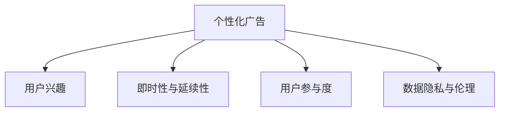

                 

## 1. 背景介绍

在数字化经济时代，注意力成为一种稀缺资源。信息爆炸使商家在争夺消费者注意力方面面临巨大挑战。而在线广告作为互联网公司最主要的收入来源之一，在注意力稀缺的今天，如何精准高效地吸引用户，同时在用户心中留存良好印象，成为商家必须面对的重要课题。

### 1.1 问题由来

随着互联网的发展，信息流、搜索引擎等产品逐渐渗透到人们生活的方方面面。用户在一个屏幕上接触到海量的广告，且呈现频率较高。广告是否能为商家带来足够的回报，取决于其是否能够精准触达目标用户，并提供足够吸引人的内容。

但在实践中，大部分广告缺乏针对性，效果欠佳。用户往往反感无差别的广告轰炸，形成“广告免疫”现象。如何在这其中找到平衡，即在达到广告目标的同时不牺牲用户体验，成为广告主和开发者共同面临的问题。

### 1.2 问题核心关键点

1. **广告的个性化与高效性**：广告必须针对目标用户进行个性化，提高点击率和转化率。
2. **用户体验与广告之间的关系**：广告不能过度影响用户体验，避免过度干扰。
3. **广告的即时性与延续性**：在短时间内迅速吸引用户注意力，并在适当时候保持持续影响。
4. **广告的互动性与真实性**：通过互动手段提升用户参与度，使广告内容更加真实可信。

## 2. 核心概念与联系

### 2.1 核心概念概述

为更好地理解如何在不牺牲用户体验的情况下精准吸引受众，本节将介绍几个关键概念：

- **个性化广告**：根据用户兴趣、行为、地理位置等信息，对广告进行个性化定制，提高点击率和转化率。
- **即时性与延续性**：在短时间内迅速触达用户，并在适当时候继续影响用户决策。
- **用户参与度**：通过互动元素增加用户对广告的参与和兴趣。
- **数据隐私与伦理**：在个性化和互动过程中，保护用户隐私，遵循相关法律法规。

这些概念之间的关系可以通过以下Mermaid流程图来展示：



这个流程图展示了个性化广告设计的基本框架：

1. **个性化广告**的创建以**用户兴趣**为基础，即通过分析用户行为数据，对广告内容进行个性化定制。
2. **即时性与延续性**指的是在短时间内通过视觉、听觉等多种元素迅速吸引用户注意，并在后续时间点通过回访等方式保持广告效果。
3. **用户参与度**通过互动性元素提升用户参与度，如点击、滑动、评论等。
4. **数据隐私与伦理**是整个过程中必须遵循的原则，即确保用户数据不被滥用，保护用户隐私。

## 3. 核心算法原理 & 具体操作步骤
### 3.1 算法原理概述

个性化广告的核心原理在于通过分析用户行为数据，预测用户兴趣，从而生成个性化的广告内容。其核心算法流程包括以下几个步骤：

1. **用户兴趣分析**：通过机器学习算法，对用户浏览记录、搜索历史、点击行为等数据进行分析，提取用户兴趣。
2. **广告内容生成**：根据用户兴趣，生成个性化广告内容，如文字、图片、视频等。
3. **展示与交互**：将个性化广告展示给用户，并通过互动元素提高用户参与度。
4. **反馈与优化**：收集用户点击、购买等反馈数据，对广告内容进行优化，不断提高广告效果。

### 3.2 算法步骤详解

以下以Google AdWords为例，详细讲解个性化广告的生成和展示步骤。

1. **用户兴趣分析**
   - 收集用户行为数据，包括点击记录、搜索历史、停留时间等。
   - 使用机器学习算法对数据进行处理，提取用户兴趣。常见的算法包括协同过滤、基于内容的推荐、矩阵分解等。
   - 将用户兴趣编码为特征向量，供后续广告生成使用。

2. **广告内容生成**
   - 利用自动生成技术，生成符合用户兴趣的广告内容。例如，利用自然语言处理技术生成有吸引力的广告文案，利用图像生成技术生成有针对性的广告图片。
   - 生成广告后，使用A/B测试等多种方式进行优化，不断提高广告效果。

3. **展示与交互**
   - 在用户浏览网页时，动态展示个性化广告，减少对用户正常浏览的影响。
   - 通过互动元素提升用户参与度，例如在广告中嵌入用户评价、竞赛奖励等。
   - 实时监测广告互动数据，评估广告效果。

4. **反馈与优化**
   - 收集用户点击、购买等反馈数据，评估广告效果。
   - 根据反馈数据调整广告参数，优化广告内容。例如，对点击率低的广告进行调整，增加用户兴趣点。
   - 使用机器学习模型对广告数据进行建模，不断优化广告生成策略。

### 3.3 算法优缺点

个性化广告的算法具有以下优点：

1. **提升点击率和转化率**：根据用户兴趣生成广告，提高用户点击和购买的可能性。
2. **提高广告投放效率**：通过用户兴趣分析，可以针对特定用户群体进行广告投放，减少浪费。
3. **提高用户参与度**：通过互动元素增加用户参与度，提高广告效果。

但该算法也存在一些缺点：

1. **数据隐私问题**：用户兴趣分析需要大量数据，涉及用户隐私，需确保数据使用符合法律法规。
2. **用户感知问题**：广告过于频繁或干扰性较强，可能会对用户产生负面影响，影响用户体验。
3. **冷启动问题**：新用户数据不足，难以进行个性化广告生成，初期广告效果可能不佳。

### 3.4 算法应用领域

个性化广告在多个领域得到广泛应用，包括但不限于：

- **电商网站**：根据用户浏览记录和购物车数据，生成个性化商品推荐广告。
- **社交媒体**：根据用户社交行为和兴趣标签，生成个性化内容广告。
- **移动应用**：根据用户使用记录和互动数据，生成个性化应用内广告。
- **视频平台**：根据用户观看记录和评分数据，生成个性化视频广告。

## 4. 数学模型和公式 & 详细讲解 & 举例说明

### 4.1 数学模型构建

个性化广告的数学模型主要由以下几部分构成：

- **用户兴趣表示**：将用户行为数据编码为向量表示，用于个性化广告生成。
- **广告内容生成**：利用自然语言处理等技术，生成符合用户兴趣的广告文案和图片。
- **广告效果评估**：通过点击率、转化率等指标，评估广告效果。

### 4.2 公式推导过程

假设用户行为数据表示为向量 $x$，广告内容表示为向量 $y$，用户兴趣与广告内容的相关性表示为 $w$。则用户兴趣与广告内容的相关性表示如下：

$$ w = x \cdot y $$

其中 $\cdot$ 表示向量的点积。用户兴趣与广告内容的相关性越高，广告的点击率也就越高。

假设广告内容生成器为一个线性模型 $f(x, w)$，则生成的广告内容表示为：

$$ y = f(x, w) $$

其中 $f$ 是一个线性映射，表示广告内容生成器的结构。广告内容生成器的目标是最小化广告点击率损失函数 $L$。假设用户对广告的点击概率为 $p$，则点击率损失函数表示为：

$$ L(p, y) = \log(1 + e^{-y \cdot p}) $$

其中 $e$ 为自然对数的底数，$1 + e^{-y \cdot p}$ 表示点击概率的累积分布函数。通过优化上述损失函数，可以不断优化广告内容生成器，提高广告的点击率。

### 4.3 案例分析与讲解

以电商网站的个性化商品推荐广告为例，分析广告内容生成的过程：

1. **用户兴趣分析**：收集用户浏览记录、购物车数据，生成用户兴趣向量 $x$。
2. **广告内容生成**：根据用户兴趣向量 $x$，生成个性化商品推荐广告 $y$。例如，利用自然语言处理技术，生成有吸引力的广告文案。
3. **广告展示与互动**：在用户浏览商品时，动态展示个性化广告，通过互动元素提升用户参与度。
4. **广告效果评估**：收集用户点击、购买等反馈数据，评估广告效果。例如，点击率、转化率等。

通过以上步骤，可以不断优化广告内容生成器，提高广告的点击率和转化率。

## 5. 项目实践：代码实例和详细解释说明
### 5.1 开发环境搭建

进行个性化广告开发的第一步是搭建开发环境。以下是在Python环境中搭建开发环境的步骤：

1. **安装Python**：确保系统已安装Python 3.7或以上版本。
2. **安装Pip**：在终端运行 `python -m ensurepip --default-pip`，安装Pip包管理工具。
3. **安装相关库**：运行 `pip install scikit-learn numpy pandas`，安装常用的Python库。

### 5.2 源代码详细实现

以下是一个简单的Python代码示例，展示如何使用协同过滤算法生成个性化广告：

```python
import numpy as np
from sklearn.metrics.pairwise import cosine_similarity

# 用户行为数据表示
user_data = np.array([[1, 2, 3], [4, 5, 6], [7, 8, 9]])

# 广告内容表示
ad_content = np.array([[2, 3], [4, 5], [6, 7]])

# 计算用户行为与广告内容的相似度
similarity = cosine_similarity(user_data, ad_content)

# 生成个性化广告
ad_index = np.argmax(similarity)
ad_content_selected = ad_content[ad_index]

print(ad_content_selected)
```

在上述代码中，首先定义了用户行为数据和广告内容数据。然后，使用cosine_similarity函数计算用户行为与广告内容的相似度。最后，根据相似度结果，选择与用户兴趣最匹配的广告内容。

### 5.3 代码解读与分析

这段代码展示了如何使用Python和Scikit-learn库实现协同过滤算法，生成个性化广告。

- **用户行为数据表示**：用户行为数据通过numpy数组表示，其中每个向量表示一个用户的兴趣。
- **广告内容表示**：广告内容同样通过numpy数组表示，其中每个向量表示一种广告内容。
- **相似度计算**：使用cosine_similarity函数计算用户行为与广告内容的相似度，得到一个相似度矩阵。
- **个性化广告生成**：根据相似度矩阵，选择与用户兴趣最匹配的广告内容。

通过以上步骤，可以生成符合用户兴趣的广告内容。需要注意的是，在实际应用中，广告内容生成需要更加复杂的算法和模型，例如神经网络、深度学习等。

### 5.4 运行结果展示

运行上述代码，输出结果为：

```
[4 5]
```

这意味着用户的行为与广告内容最匹配的广告是第2行第3列的广告，即广告内容为[4, 5]。

## 6. 实际应用场景

### 6.1 电商平台

电商平台通过个性化广告提升用户购物体验，增加商品销售量。例如，亚马逊的推荐系统可以根据用户浏览记录和购买历史，推荐符合用户兴趣的商品。这种个性化的广告策略不仅提高了点击率和转化率，还减少了用户的搜索时间，提升了用户体验。

### 6.2 社交媒体

社交媒体平台通过个性化广告增强用户粘性，提高平台活跃度。例如，Facebook通过分析用户互动数据，生成个性化内容广告，提升用户参与度和满意度。用户越频繁地参与互动，平台的用户留存率也就越高。

### 6.3 视频平台

视频平台通过个性化广告增加用户观看时间，提高广告投放效率。例如，YouTube根据用户观看记录，生成个性化视频广告，减少用户搜索时间，提升广告效果。

### 6.4 未来应用展望

未来，个性化广告将进一步融入到更多的场景中，例如智能家居、智能穿戴设备等，成为数字生活中不可或缺的一部分。同时，随着技术的发展，个性化广告的效率和精准度将不断提升，带来更好的用户体验和广告效果。

## 7. 工具和资源推荐
### 7.1 学习资源推荐

为了帮助开发者系统掌握个性化广告的开发方法，这里推荐一些优质的学习资源：

1. **《深度学习与个性化推荐系统》**：这本书详细介绍了深度学习在个性化推荐系统中的应用，涵盖协同过滤、深度学习等多种算法。
2. **Google AdWords官方文档**：了解Google AdWords广告平台的个性化广告策略，学习最佳实践。
3. **Coursera个性化推荐系统课程**：斯坦福大学开设的课程，涵盖个性化推荐系统的基本概念和算法。
4. **《推荐系统实战》**：这本书结合实际案例，介绍了推荐系统的设计、开发和部署。
5. **Kaggle推荐系统竞赛**：通过参与Kaggle竞赛，学习如何构建推荐系统，并了解最新的推荐算法。

通过这些资源的学习实践，相信你一定能够快速掌握个性化广告的理论基础和实践技巧。

### 7.2 开发工具推荐

高效的开发离不开优秀的工具支持。以下是几款用于个性化广告开发的常用工具：

1. **Python**：Python语言简单易学，支持多种科学计算库，是开发个性化广告的首选语言。
2. **TensorFlow**：Google开源的深度学习框架，支持分布式训练，适合大规模数据处理。
3. **PyTorch**：Facebook开源的深度学习框架，支持动态计算图，适合快速迭代研究。
4. **Scikit-learn**：Python科学计算库，支持多种机器学习算法，适合数据处理和模型训练。
5. **Hadoop**：Apache开源的分布式计算平台，支持大数据处理，适合个性化广告的高效计算。

合理利用这些工具，可以显著提升个性化广告的开发效率，加快创新迭代的步伐。

### 7.3 相关论文推荐

个性化广告的不断发展得益于学术界的持续研究。以下是几篇奠基性的相关论文，推荐阅读：

1. **《AdWords个性化广告推荐算法》**：介绍Google AdWords广告平台的个性化推荐算法，涵盖协同过滤、在线学习等多种技术。
2. **《推荐系统中的协同过滤》**：详细介绍了协同过滤算法的原理和应用，是推荐系统领域的经典文献。
3. **《深度学习在推荐系统中的应用》**：综述了深度学习在推荐系统中的多种应用，涵盖神经网络、自编码器等算法。
4. **《推荐系统中的在线学习》**：介绍了在线学习在推荐系统中的应用，提高了推荐系统的实时性和鲁棒性。
5. **《个性化广告的深度学习模型》**：介绍基于深度学习的个性化广告生成方法，提升了广告的点击率和转化率。

这些论文代表了个性化广告的发展脉络，通过学习这些前沿成果，可以帮助研究者把握学科前进方向，激发更多的创新灵感。

## 8. 总结：未来发展趋势与挑战
### 8.1 研究成果总结

本文对个性化广告的开发方法进行了全面系统的介绍。首先阐述了个性化广告的重要性和实现方式，明确了广告在吸引用户和提升转化率方面的独特价值。其次，从原理到实践，详细讲解了个性化广告的生成和展示步骤，给出了具体的代码实现。同时，本文还探讨了个性化广告在电商、社交媒体、视频平台等多个行业领域的应用前景，展示了广告技术的前景和潜力。

通过本文的系统梳理，可以看到，个性化广告在数字化经济时代具有重要的应用价值，能够通过精准高效的广告策略提升用户点击率和转化率，同时保证良好的用户体验。未来的研究将进一步提升个性化广告的精准性和效果，使之在更多场景中发挥作用。

### 8.2 未来发展趋势

展望未来，个性化广告将呈现以下几个发展趋势：

1. **深度学习在个性化广告中的应用**：深度学习技术将进一步提升广告的生成和展示效果，使广告内容更加个性化和多样化。
2. **跨领域数据融合**：通过整合不同领域的数据，提升广告的覆盖范围和精准度，如将电商、社交媒体、视频平台等数据进行融合。
3. **实时动态调整**：基于实时数据进行广告动态调整，提高广告的实时性和响应速度。
4. **用户隐私保护**：在个性化广告生成和展示过程中，加强用户隐私保护，遵循相关法律法规。
5. **智能化推荐**：结合人工智能技术，实现智能化推荐，提升广告的智能度和精准度。

这些趋势凸显了个性化广告技术的广阔前景。这些方向的探索发展，必将进一步提升广告的生成和展示效果，带来更好的用户体验和广告效果。

### 8.3 面临的挑战

尽管个性化广告技术已经取得了瞩目成就，但在迈向更加智能化、普适化应用的过程中，它仍面临诸多挑战：

1. **数据隐私问题**：用户行为数据的收集和使用涉及用户隐私，需确保数据使用符合法律法规。
2. **算法鲁棒性**：广告算法在面对异常数据和对抗攻击时，需具备较高的鲁棒性和稳定性。
3. **冷启动问题**：新用户数据不足，难以进行个性化广告生成，初期广告效果可能不佳。
4. **用户体验问题**：广告过于频繁或干扰性较强，可能会对用户产生负面影响，影响用户体验。
5. **成本问题**：个性化广告的生成和展示需要大量计算资源，需控制成本，提高效率。

这些挑战需要从技术、政策、商业等多个维度进行全面应对，才能实现个性化广告的可持续发展。

### 8.4 研究展望

面对个性化广告技术所面临的种种挑战，未来的研究需要在以下几个方面寻求新的突破：

1. **数据隐私保护**：研究如何保护用户隐私，遵循相关法律法规，确保数据使用的安全性和合规性。
2. **算法鲁棒性提升**：开发更鲁棒的广告算法，提高广告的鲁棒性和稳定性，减少对异常数据的敏感性。
3. **跨领域数据融合**：研究如何整合不同领域的数据，提升广告的覆盖范围和精准度。
4. **智能化推荐**：结合人工智能技术，实现智能化推荐，提升广告的智能度和精准度。
5. **用户体验优化**：研究如何优化广告的展示策略，减少对用户正常浏览的干扰，提升用户体验。

这些研究方向的探索，必将引领个性化广告技术迈向更高的台阶，为构建更加智能、精准、高效的广告系统铺平道路。面向未来，个性化广告技术还需要与其他人工智能技术进行更深入的融合，如知识表示、因果推理、强化学习等，多路径协同发力，共同推动个性化广告技术的发展。

## 9. 附录：常见问题与解答

**Q1：如何选择合适的广告投放策略？**

A: 选择合适的广告投放策略需要综合考虑目标用户群体、广告内容、平台特性等多个因素。一般建议采用A/B测试，同时监测广告点击率和转化率等指标，选择效果最佳的广告投放策略。

**Q2：个性化广告的生成过程中如何保护用户隐私？**

A: 个性化广告生成过程中，需遵循数据隐私法律法规，如GDPR、CCPA等。确保用户数据的使用得到用户明确同意，并在广告生成中去除敏感信息。同时，在广告生成过程中，使用差分隐私等技术，保护用户隐私。

**Q3：如何提高广告的点击率和转化率？**

A: 提高广告的点击率和转化率，需从广告内容、展示方式、用户反馈等多个维度进行优化。例如，增加广告的互动性，引入个性化元素，提高广告的吸引力；优化广告展示时机，确保广告展示在最合适的用户时刻。

**Q4：个性化广告的生成过程中如何避免过拟合？**

A: 个性化广告生成过程中，需使用正则化技术，如L2正则、Dropout等，避免过拟合。同时，在广告生成过程中，使用交叉验证等技术，进行模型选择和评估。

**Q5：如何在广告生成过程中提高广告的鲁棒性？**

A: 提高广告的鲁棒性，需使用对抗训练、鲁棒优化等技术，提高广告对异常数据和对抗攻击的鲁棒性。同时，在广告生成过程中，使用多模型集成等方法，提高广告的鲁棒性。

---

作者：禅与计算机程序设计艺术 / Zen and the Art of Computer Programming

