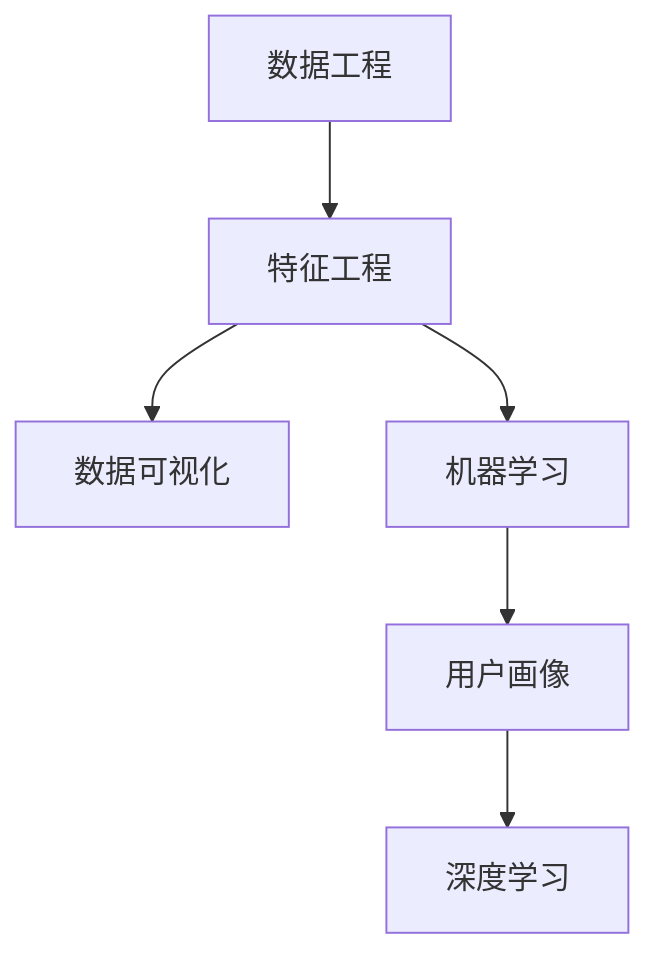

                 

## 1. 背景介绍

### 1.1 问题由来

在数字化时代，注意力成为一种稀缺资源。媒体、广告、电商平台等各类平台争夺着用户的目光，而数据成为了理解受众行为和偏好的关键。如何高效利用数据，准确分析用户的行为模式和需求，成为现代商业竞争的关键。

### 1.2 问题核心关键点

这个问题的核心在于：如何通过数据分析技巧，识别出用户的关键行为特征和偏好，从而实现精准营销、个性化推荐、用户画像构建等目标。需要考虑的关键点包括：

- 数据收集与存储：收集多源异构的数据，确保数据质量和完整性。
- 数据清洗与预处理：去除噪声和异常值，确保数据可用性。
- 特征工程：构建高效、有意义的特征，提高模型性能。
- 模型选择与优化：选择合适的算法和模型，并针对数据和业务需求进行调优。
- 数据可视化与解释：将分析结果可视化，便于理解，并建立模型可解释性。

这些问题点涵盖了数据工程、机器学习、数据可视化等多个领域的知识，需要对技术和业务有深刻的理解。

### 1.3 问题研究意义

在数字化转型的大背景下，数据的价值日益凸显。通过数据驱动的决策，能够提升用户体验，优化资源配置，增强竞争力。利用数据理解受众行为和偏好，可以：

- 优化产品设计：把握用户需求，提高产品质量。
- 精准营销：提升广告投放的ROI，实现高效的用户转化。
- 个性化推荐：根据用户偏好，提供更加个性化、多样化的服务。
- 用户画像构建：基于用户行为数据，形成全面的用户画像，实现深度互动。

这将推动传统行业向数字化转型，提升整体运营效率，创造新的价值。

## 2. 核心概念与联系

### 2.1 核心概念概述

为更好地理解如何利用数据理解受众行为和偏好，本节将介绍几个密切相关的核心概念：

- 数据工程（Data Engineering）：指从数据收集、存储、清洗、预处理到数据存储的整个流程。数据工程是数据分析的基础。
- 特征工程（Feature Engineering）：指通过特征提取、转换、选择等手段，构建高效、有意义的特征，提高模型性能。
- 数据可视化（Data Visualization）：指将数据通过图表、地图等形式直观呈现，便于理解和使用。
- 机器学习（Machine Learning）：指通过算法模型对数据进行学习和预测，是数据分析的核心手段。
- 用户画像（User Persona）：指基于用户行为数据构建的用户模型，用于指导产品设计和营销策略。
- 深度学习（Deep Learning）：指利用深度神经网络进行数据建模和分析，具备强大的数据处理能力。

这些核心概念之间的逻辑关系可以通过以下Mermaid流程图来展示：



这个流程图展示了大数据技术的应用流程：

1. 数据工程获取原始数据，进行存储和预处理。
2. 特征工程对数据进行特征提取，构建有意义的特征向量。
3. 数据可视化将分析结果直观展示，便于理解。
4. 机器学习通过模型对数据进行学习，提取规律。
5. 用户画像基于学习结果构建用户模型，指导产品设计。
6. 深度学习利用神经网络提高模型性能，进一步提升分析能力。

这些概念共同构成了数据驱动的决策流程，为理解受众行为和偏好提供了技术支撑。

## 3. 核心算法原理 & 具体操作步骤

### 3.1 算法原理概述

利用数据理解受众行为和偏好的过程，本质上是通过机器学习算法对用户行为数据进行学习和预测。该过程包括特征提取、模型训练、结果可视化和用户画像构建等多个环节。

形式化地，设用户行为数据集为 $D=\{(x_i,y_i)\}_{i=1}^N$，其中 $x_i$ 为特征向量，$y_i$ 为标签（如购买行为、兴趣爱好等）。目标是通过训练模型 $M$，使得 $M(x_i)$ 逼近 $y_i$。

常用的模型包括决策树、逻辑回归、随机森林、支持向量机等传统机器学习模型，以及神经网络、深度学习模型。具体选择何种模型，取决于数据特性和业务需求。

### 3.2 算法步骤详解

基于机器学习的受众行为和偏好分析流程，通常包括以下几个关键步骤：

**Step 1: 数据收集与预处理**
- 从多个数据源收集用户行为数据，包括电商点击记录、社交媒体互动、搜索引擎查询等。
- 对数据进行清洗和预处理，去除噪声和异常值，确保数据质量。

**Step 2: 特征工程**
- 对原始数据进行特征提取，构建高效、有意义的特征。
- 特征选择：选择与预测任务最相关的特征，减少维度。
- 特征转换：对特征进行标准化、归一化等处理，提升模型性能。
- 特征构建：使用各种算法（如TF-IDF、Word2Vec等）提取特征，丰富数据表示。

**Step 3: 模型训练与调优**
- 选择合适的机器学习模型（如随机森林、XGBoost、深度神经网络等）进行训练。
- 设置合适的超参数，如学习率、正则化系数等，并进行调优。
- 使用交叉验证等技术，评估模型性能。

**Step 4: 结果可视化**
- 将模型预测结果通过图表、热力图等形式可视化，便于理解。
- 探索性数据分析（EDA），识别数据中的关键模式和异常值。
- 建立交互式可视化界面，方便用户交互和探索。

**Step 5: 用户画像构建**
- 基于模型预测结果，构建用户画像。
- 分析用户的行为特征、兴趣爱好等，形成全面的用户画像。
- 利用用户画像指导产品设计、营销策略和用户服务。

以上是利用机器学习算法进行受众行为和偏好分析的一般流程。在实际应用中，还需要针对具体任务和数据特点进行优化设计，如引入更高效的特征工程技术、选择更适合的模型算法等。

### 3.3 算法优缺点

基于机器学习的受众行为和偏好分析方法具有以下优点：
1. 自动化程度高。机器学习算法可以自动从数据中提取特征和规律，降低人工干预成本。
2. 适应性强。模型可以处理大规模、多源异构数据，适应不同的业务需求。
3. 效果显著。利用数据驱动的决策，能够显著提升用户满意度和业务绩效。
4. 可解释性好。现代机器学习算法（如决策树、LIME等）具有较好的可解释性，便于理解模型的决策过程。

同时，该方法也存在一定的局限性：
1. 对标注数据依赖高。机器学习模型通常需要标注数据进行训练，获取高质量标注数据的成本较高。
2. 需要处理噪声和异常值。原始数据中往往存在噪声和异常值，需要额外的处理和清洗。
3. 模型复杂度高。深度神经网络等复杂模型需要较大的计算资源，训练时间较长。
4. 结果依赖数据质量。模型性能高度依赖数据质量和特征提取的效果，数据偏差会导致模型失效。

尽管存在这些局限性，但就目前而言，基于机器学习的受众行为和偏好分析方法仍是大数据应用的主流范式。未来相关研究的重点在于如何进一步降低对标注数据的依赖，提高模型的鲁棒性和可解释性，同时兼顾算法的计算效率。

### 3.4 算法应用领域

基于机器学习的受众行为和偏好分析方法，已经在电商推荐、社交媒体分析、搜索引擎优化、广告投放等诸多领域得到广泛应用，为数据驱动的业务决策提供了重要支持。

- **电商推荐系统**：通过分析用户点击、购买行为，构建用户画像，实现个性化商品推荐。
- **社交媒体分析**：分析用户互动数据，识别话题热点和用户偏好，优化社交媒体内容。
- **搜索引擎优化**：通过分析用户查询行为，优化搜索结果和广告投放，提升搜索引擎点击率。
- **广告投放**：根据用户行为数据，进行精准广告投放，提高广告ROI。
- **用户画像构建**：综合多源异构数据，构建用户兴趣图谱，实现深度互动。

除了上述这些经典应用外，基于机器学习的分析方法还被创新性地应用到更多场景中，如行为预测、风险控制、营销效果评估等，为大数据应用带来了全新的突破。

## 4. 数学模型和公式 & 详细讲解 & 举例说明

### 4.1 数学模型构建

设用户行为数据集为 $D=\{(x_i,y_i)\}_{i=1}^N$，其中 $x_i$ 为特征向量，$y_i$ 为标签（如购买行为、兴趣爱好等）。

定义模型 $M$ 在特征 $x_i$ 上的预测为 $\hat{y_i}=M(x_i)$，则在数据集 $D$ 上的经验风险为：

$$
\mathcal{L}(M)=\frac{1}{N}\sum_{i=1}^N \ell(\hat{y_i},y_i)
$$

其中 $\ell$ 为损失函数，如均方误差、交叉熵等。目标是最小化经验风险，即找到最优模型：

$$
\hat{M}=\mathop{\arg\min}_{M} \mathcal{L}(M)
$$

在实践中，我们通常使用梯度下降等优化算法来近似求解上述最优化问题。设 $\eta$ 为学习率，则参数的更新公式为：

$$
\theta \leftarrow \theta - \eta \nabla_{\theta}\mathcal{L}(\theta)
$$

其中 $\nabla_{\theta}\mathcal{L}(\theta)$ 为损失函数对参数 $\theta$ 的梯度，可通过反向传播算法高效计算。

### 4.2 公式推导过程

以下我们以线性回归为例，推导最小二乘法的公式及其梯度的计算公式。

假设模型 $M_{\theta}$ 为线性回归模型：$\hat{y_i}=\theta_0+\sum_{j=1}^d \theta_j x_{ij}$，其中 $\theta=(\theta_0,\theta_1,...,\theta_d)$。

目标是最小化损失函数：

$$
\ell(\hat{y_i},y_i)=(\hat{y_i}-y_i)^2
$$

在数据集 $D$ 上的经验风险为：

$$
\mathcal{L}(\theta)=\frac{1}{N}\sum_{i=1}^N (\hat{y_i}-y_i)^2
$$

最小化经验风险，得：

$$
\frac{\partial \mathcal{L}(\theta)}{\partial \theta_j}=-\frac{2}{N}\sum_{i=1}^N (y_i-\hat{y_i})x_{ij}
$$

将梯度代入参数更新公式，得：

$$
\theta_j \leftarrow \theta_j - \eta \frac{2}{N}\sum_{i=1}^N (y_i-\hat{y_i})x_{ij}
$$

以上是利用线性回归模型进行数据预测和参数更新的基本流程。

## 5. 项目实践：代码实例和详细解释说明

### 5.1 开发环境搭建

在进行数据驱动的受众行为和偏好分析实践前，我们需要准备好开发环境。以下是使用Python进行scikit-learn开发的环境配置流程：

1. 安装Anaconda：从官网下载并安装Anaconda，用于创建独立的Python环境。

2. 创建并激活虚拟环境：
```bash
conda create -n sklearn-env python=3.8 
conda activate sklearn-env
```

3. 安装scikit-learn：
```bash
pip install scikit-learn
```

4. 安装各类工具包：
```bash
pip install numpy pandas matplotlib scikit-learn
```

5. 安装可视化工具：
```bash
pip install matplotlib seaborn plotly
```

完成上述步骤后，即可在`sklearn-env`环境中开始数据分析实践。

### 5.2 源代码详细实现

下面我们以用户购买行为分析为例，给出使用scikit-learn进行线性回归模型训练的Python代码实现。

首先，定义数据处理函数：

```python
import pandas as pd
from sklearn.model_selection import train_test_split

def load_data(file_path):
    data = pd.read_csv(file_path)
    X = data.drop('y', axis=1)
    y = data['y']
    return X, y

X, y = load_data('user_purchase_data.csv')
```

然后，定义训练和评估函数：

```python
from sklearn.linear_model import LinearRegression
from sklearn.metrics import mean_squared_error, r2_score

def train_model(X, y, train_fraction=0.8):
    X_train, X_test, y_train, y_test = train_test_split(X, y, train_size=train_fraction, test_size=1-train_fraction)
    model = LinearRegression()
    model.fit(X_train, y_train)
    return model, X_test, y_test

def evaluate_model(model, X_test, y_test):
    y_pred = model.predict(X_test)
    mse = mean_squared_error(y_test, y_pred)
    r2 = r2_score(y_test, y_pred)
    print(f'Mean Squared Error: {mse:.3f}')
    print(f'R-squared: {r2:.3f}')

model, X_test, y_test = train_model(X, y)
evaluate_model(model, X_test, y_test)
```

最后，启动训练流程并在测试集上评估：

```python
train_model(X, y, train_fraction=0.8)
evaluate_model(model, X_test, y_test)
```

以上就是使用scikit-learn进行用户购买行为分析的完整代码实现。可以看到，通过scikit-learn的封装，我们可以用相对简洁的代码完成线性回归模型的训练和评估。

### 5.3 代码解读与分析

让我们再详细解读一下关键代码的实现细节：

**load_data函数**：
- `load_data`方法：读取CSV文件，将数据分为特征和标签，并返回。
- 使用`drop`方法去除不需要的标签列，确保数据的完整性和一致性。

**train_model函数**：
- `train_test_split`方法：将数据集分为训练集和测试集，按照一定比例分配。
- `LinearRegression`模型：使用线性回归模型进行训练，自动选择最优参数。
- 返回模型和测试集数据，方便后续评估。

**evaluate_model函数**：
- `mean_squared_error`和`r2_score`方法：计算均方误差和决定系数，评估模型性能。
- `print`方法：输出评估结果，便于查看。

**训练流程**：
- `train_model`函数：传入数据集，并指定训练集占比，训练模型。
- `evaluate_model`函数：传入训练好的模型和测试集数据，进行模型评估。

可以看到，scikit-learn提供了丰富的工具函数和模型库，能够高效地支持数据分析和模型训练。开发者可以利用这些工具，快速构建出高性能的预测模型。

当然，实际应用中还需要考虑更多因素，如数据特征选择、模型参数调优、异常值处理等。但核心的数据分析流程基本与此类似。

## 6. 实际应用场景

### 6.1 智能推荐系统

基于用户行为数据分析的推荐系统，已经在电商、内容平台等领域得到了广泛应用。通过分析用户的浏览、点击、购买行为，构建用户画像，实现个性化推荐。

在技术实现上，可以收集用户的历史行为数据，如浏览记录、购买历史、评分等，构建特征向量。通过训练线性回归、逻辑回归、深度神经网络等模型，预测用户对新商品的兴趣。在推荐系统中，根据预测结果排序，推荐最可能被用户喜欢的商品，提高转化率。

### 6.2 用户行为预测

预测用户的行为趋势和偏好，能够帮助企业提前优化资源配置，提升用户体验。例如，在电商平台上，预测用户是否会购买某商品，能够在库存管理、物流配送等方面做出合理的决策。

通过时间序列分析、深度学习等方法，对用户的历史行为数据进行建模，预测用户未来的行为。在预测模型训练过程中，引入用户的基本信息、商品属性等特征，提升预测准确性。

### 6.3 营销效果评估

评估营销活动的ROI，能够帮助企业优化广告投放策略，提高广告效果。例如，在社交媒体广告投放中，通过分析用户的点击、互动行为，评估广告的转化率、点击率等指标。

通过A/B测试等方法，对比不同广告版本的效果，识别出用户行为的关键影响因素。使用机器学习模型对广告效果进行预测，量化营销活动的ROI。

### 6.4 用户画像构建

用户画像能够帮助企业更好地理解用户，指导产品设计和营销策略。例如，通过分析用户在社交媒体上的互动行为，构建用户兴趣图谱，实现深度互动。

在用户画像构建过程中，需要综合多源异构数据，如用户基本信息、社交网络行为、搜索记录等，构建全面、准确的用户模型。利用用户画像，进行个性化营销、产品推荐、内容推送等。

### 6.5 未来应用展望

随着数据技术的不断进步，基于机器学习的用户行为和偏好分析将在更多领域得到应用，为行业带来变革性影响。

在智慧城市治理中，通过分析居民的出行、消费行为，优化城市资源配置，提高城市管理效率。在金融服务中，通过分析用户的投资行为，优化金融产品设计，提升用户体验。

在医疗健康领域，通过分析用户的健康数据，提供个性化的健康建议，提升用户体验。在教育培训中，通过分析学生的学习行为，提供个性化的学习建议，提升学习效果。

此外，在媒体娱乐、社交网络、交通出行等多个领域，基于数据驱动的决策也将不断涌现，为各行各业带来新的发展机遇。相信随着数据的不断积累和技术的不断进步，基于机器学习的用户行为和偏好分析将带来更多的商业价值和社会效益。

## 7. 工具和资源推荐

### 7.1 学习资源推荐

为了帮助开发者系统掌握数据驱动的受众行为和偏好分析的理论基础和实践技巧，这里推荐一些优质的学习资源：

1. 《Python数据科学手册》系列博文：由知名数据科学家撰写，系统介绍了Python在数据分析、机器学习中的应用。
2. Coursera《机器学习》课程：由斯坦福大学教授Andrew Ng主讲的机器学习课程，涵盖了机器学习的基础和高级内容。
3. 《深度学习》书籍：DeepLearning.ai的深度学习课程，介绍了深度神经网络的基本原理和实践技巧。
4. Kaggle数据科学竞赛：Kaggle是全球最大的数据科学社区，提供了丰富的数据集和竞赛平台，帮助开发者实践和提升。
5. GitHub开源项目：GitHub是全球最大的代码托管平台，提供了大量的开源项目和代码示例，便于学习和参考。

通过对这些资源的学习实践，相信你一定能够快速掌握数据驱动的受众行为和偏好分析的精髓，并用于解决实际的商业问题。

### 7.2 开发工具推荐

高效的数据分析离不开优秀的工具支持。以下是几款用于数据分析开发的常用工具：

1. Jupyter Notebook：基于Web的交互式开发环境，支持Python、R等多种语言，便于数据可视化和代码编写。
2. Pandas：基于NumPy的数据分析库，提供了高效的数据处理和分析功能。
3. NumPy：基于C语言的高性能科学计算库，提供了丰富的数学函数和操作。
4. Matplotlib：基于Python的绘图库，提供了多种绘图接口，支持数据可视化。
5. Seaborn：基于Matplotlib的高级绘图库，提供了更丰富的可视化样式和接口。
6. Plotly：基于Web的可视化工具，支持交互式图表和动态数据展示。

合理利用这些工具，可以显著提升数据分析的效率和质量，加快创新迭代的步伐。

### 7.3 相关论文推荐

数据驱动的受众行为和偏好分析源于学界的持续研究。以下是几篇奠基性的相关论文，推荐阅读：

1. "Algorithms for Scalable Multiple Machine Learning"：Lars V. Bottou和Lisa Girshick提出的分布式机器学习算法，支持大规模数据集的处理和优化。
2. "Deep Learning for Recommender Systems: A Survey and Tasks"：Weng et al.综述了深度学习在推荐系统中的应用，介绍了多种推荐算法和实践技巧。
3. "Analyzing User's Interest with Supervised Learning Approach"：Xue et al.研究了基于监督学习的用户兴趣预测模型，评估了各种特征选择方法和模型性能。
4. "Data-Driven Approaches for Predicting User Behavior"：Palvia et al.综述了基于数据驱动的用户行为预测方法，介绍了时间序列分析、深度学习等多种技术。
5. "User Profiling: A Survey"：Wu et al.综述了用户画像构建的方法和技术，介绍了多模态数据融合和个性化推荐。

这些论文代表了大数据技术的发展脉络。通过学习这些前沿成果，可以帮助研究者把握学科前进方向，激发更多的创新灵感。

## 8. 总结：未来发展趋势与挑战

### 8.1 总结

本文对基于机器学习的数据驱动受众行为和偏好分析方法进行了全面系统的介绍。首先阐述了数据工程、特征工程、数据可视化、机器学习等核心概念，明确了数据分析在业务决策中的重要价值。其次，从原理到实践，详细讲解了数据驱动分析的数学模型和关键步骤，给出了数据驱动分析任务开发的完整代码实例。同时，本文还广泛探讨了数据分析方法在电商推荐、用户行为预测、营销效果评估、用户画像构建等领域的实际应用，展示了数据驱动分析的广阔前景。

通过本文的系统梳理，可以看到，基于机器学习的用户行为和偏好分析方法在大数据技术中的应用已经非常广泛，为现代商业竞争提供了重要的决策依据。利用数据驱动的决策，能够显著提升用户体验，优化资源配置，增强竞争力。

### 8.2 未来发展趋势

展望未来，基于机器学习的用户行为和偏好分析技术将呈现以下几个发展趋势：

1. 数据源多样化。随着物联网、5G等技术的普及，更多的设备将产生数据，用户行为数据将更加丰富和全面。

2. 数据处理自动化。自动化数据处理技术，如数据清洗、特征工程等，将进一步降低数据准备的工作量，提高数据质量。

3. 模型复杂化。深度神经网络、Transformer等复杂模型将在推荐系统、用户画像构建等任务中得到广泛应用，提高预测准确性。

4. 数据共享与合作。数据孤岛问题将逐步得到解决，不同企业之间的数据共享和合作将提高数据利用效率，促进技术进步。

5. 可解释性增强。现代机器学习模型（如LIME、SHAP等）将进一步提升模型的可解释性，帮助理解模型的决策过程。

6. 实时性提升。实时数据处理和分析技术，如流计算、实时数据可视化等，将提升数据驱动决策的实时性。

以上趋势凸显了基于机器学习的用户行为和偏好分析技术的广阔前景。这些方向的探索发展，必将进一步提升数据驱动决策的能力，推动各行业的数字化转型。

### 8.3 面临的挑战

尽管基于机器学习的用户行为和偏好分析技术已经取得了瞩目成就，但在迈向更加智能化、普适化应用的过程中，仍面临诸多挑战：

1. 数据隐私和安全。用户数据隐私和安全问题越来越受到关注，如何在利用数据的同时，保护用户隐私，确保数据安全，是技术发展的重要课题。

2. 数据质量和准确性。用户行为数据存在噪声和异常值，数据质量的提升需要更多技术和方法。

3. 计算资源瓶颈。复杂的模型和海量数据需要高计算资源支持，如何优化计算资源配置，提高数据处理效率，是一个重要挑战。

4. 模型复杂度与可解释性。深度神经网络等复杂模型虽然性能优异，但难以解释，如何提升模型的可解释性，使其更易于理解和应用，也是亟待解决的课题。

5. 模型鲁棒性和泛化性。模型在大规模异构数据上的鲁棒性和泛化性能，需要进一步提高，避免因数据偏差导致模型失效。

6. 数据跨域整合。不同数据源的数据整合和融合，需要克服数据格式、来源等方面的差异，建立统一的数据标准和框架。

正视这些挑战，积极应对并寻求突破，将是大数据技术走向成熟的必由之路。相信随着学界和产业界的共同努力，这些挑战终将一一被克服，基于机器学习的用户行为和偏好分析技术将进一步提升商业决策的智能化水平。

### 8.4 研究展望

未来的研究需要在以下几个方面寻求新的突破：

1. 探索半监督和无监督学习。在数据标注成本高的情况下，探索半监督和无监督学习，利用更多的未标注数据提升模型性能。

2. 引入因果推断方法。将因果推断思想引入数据分析，提升模型的因果推断能力，更准确地理解用户行为。

3. 结合深度强化学习。将深度强化学习技术与数据分析结合，优化推荐系统和广告投放策略，提升用户体验。

4. 引入外部知识。将外部知识库、规则库等与数据模型结合，提升模型的知识整合能力，形成更加全面、准确的用户画像。

5. 优化算法和模型结构。探索高效算法和模型结构，降低计算资源消耗，提升数据处理效率。

6. 改进数据共享机制。建立数据共享和合作机制，提高数据利用效率，促进技术进步。

这些研究方向的探索，必将引领基于机器学习的用户行为和偏好分析技术迈向更高的台阶，为数据驱动的决策提供更全面、精准的支持。

## 9. 附录：常见问题与解答

**Q1：数据工程在数据驱动的决策中扮演什么角色？**

A: 数据工程是大数据分析和决策的核心环节。数据工程通过数据收集、存储、清洗、预处理等步骤，确保数据的完整性和质量。数据工程为后续的特征工程、模型训练和评估提供坚实的基础，是数据驱动决策的重要保障。

**Q2：如何构建高效、有意义的特征？**

A: 构建高效、有意义的特征是特征工程的核心。关键步骤包括：
1. 特征选择：选择与预测任务最相关的特征，减少维度。
2. 特征转换：对特征进行标准化、归一化等处理，提升模型性能。
3. 特征构建：使用各种算法（如TF-IDF、Word2Vec等）提取特征，丰富数据表示。
4. 特征降维：使用PCA、LDA等降维技术，降低特征维度，提高模型效率。

**Q3：机器学习模型在实际应用中应注意哪些问题？**

A: 机器学习模型在实际应用中应注意以下问题：
1. 数据偏差：数据集可能存在偏差，影响模型的泛化性能。
2. 过拟合和欠拟合：模型可能出现过拟合或欠拟合，需要选择合适的超参数，进行调优。
3. 模型鲁棒性：模型可能对噪声和异常值敏感，需要引入正则化和对抗训练等技术。
4. 模型可解释性：复杂的模型（如深度神经网络）难以解释，需要引入可解释性工具和技术。
5. 计算资源：大规模数据和复杂模型需要高计算资源支持，需要优化资源配置，提高效率。

**Q4：用户画像构建过程中，如何处理数据隐私和安全问题？**

A: 用户画像构建过程中，数据隐私和安全问题越来越受到关注。处理数据隐私和安全问题的方法包括：
1. 数据匿名化：去除或加密敏感信息，确保数据匿名化。
2. 数据加密：对数据进行加密处理，防止数据泄露。
3. 访问控制：对数据访问进行严格的控制和审计，防止未经授权的数据使用。
4. 合规性检查：确保数据处理和使用的合规性，遵循相关法规和标准。

**Q5：数据驱动的决策如何保障数据质量？**

A: 数据驱动的决策中，数据质量至关重要。保障数据质量的方法包括：
1. 数据清洗：去除噪声和异常值，确保数据干净。
2. 数据验证：通过数据验证技术，检查数据的完整性和准确性。
3. 数据更新：定期更新数据，保持数据的时效性和相关性。
4. 数据监控：实时监控数据质量，及时发现和处理异常情况。

通过这些方法，能够有效提升数据质量，为数据驱动的决策提供可靠的依据。

---

作者：禅与计算机程序设计艺术 / Zen and the Art of Computer Programming

