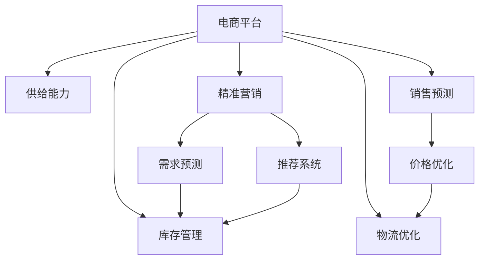

                 

# 电商平台供给能力提升：精准营销策略

> 关键词：电商平台,供给能力,精准营销,机器学习,算法优化,深度学习,模型构建,推荐系统,数据挖掘

## 1. 背景介绍

### 1.1 问题由来
随着电子商务的迅猛发展，电商平台已成为全球消费市场的重要组成部分。然而，在销售旺季，特别是在黑色星期五、双十一等电商大促期间，平台往往面临供不应求的尴尬局面。如何高效管理库存，提升供给能力，满足用户需求，同时控制成本，是电商平台亟需解决的问题。

### 1.2 问题核心关键点
供给能力的提升需要从多个维度进行思考，包括库存管理、需求预测、订单分配、物流优化等。其中，精准营销策略通过机器学习和深度学习技术，能够帮助电商平台更精准地匹配商品和用户需求，提高供给能力。

### 1.3 问题研究意义
提升电商平台供给能力，不仅能够提升用户体验和满意度，还能有效控制库存和物流成本，优化供应链管理。通过精准营销策略，电商平台能够实现库存的动态调整和精准分配，从而在销售旺季中保持供需平衡，最大化平台盈利能力。

## 2. 核心概念与联系

### 2.1 核心概念概述

为更好地理解精准营销策略，本节将介绍几个密切相关的核心概念：

- 电商平台：以在线销售为核心的电子商务平台，通过网络与消费者进行交易。
- 供给能力：指电商平台在一定时间内提供商品的能力，通常以库存量、销售量等指标衡量。
- 精准营销：利用数据挖掘、机器学习等技术，对用户行为和需求进行分析和预测，实现个性化推荐和定向营销，从而提高转化率和销售效率。
- 需求预测：基于历史数据和算法模型，预测未来的商品需求量，指导库存管理和采购决策。
- 推荐系统：利用用户行为数据，为用户提供个性化的商品推荐，提升用户体验和销售额。

这些核心概念之间的逻辑关系可以通过以下Mermaid流程图来展示：



这个流程图展示了大电商平台的核心概念及其之间的关系：

1. 电商平台通过精准营销策略，提升供给能力。
2. 精准营销策略中的需求预测和推荐系统，能够指导库存管理和物流优化。
3. 需求预测和推荐系统在精准营销中相互协作，共同提升电商平台的供给能力和用户体验。
4. 销售预测和价格优化，进一步支持库存管理和物流优化，实现供应链的闭环管理。

## 3. 核心算法原理 & 具体操作步骤
### 3.1 算法原理概述

精准营销策略的核心思想是，利用数据挖掘和机器学习技术，对用户行为和需求进行深入分析，实现个性化推荐和定向营销，从而提升转化率和销售效率。

具体而言，精准营销策略包括两大步骤：

1. 需求预测：利用历史数据和机器学习模型，预测未来的商品需求量。
2. 推荐系统：基于用户行为和需求，推荐最匹配的商品给用户。

这两个步骤之间相互依赖，共同提升电商平台的供给能力。

### 3.2 算法步骤详解

#### 3.2.1 需求预测

需求预测的主要目标是，基于历史数据和特征，预测未来的商品需求量。常用算法包括：

1. ARIMA模型：自回归集成移动平均模型，能够捕捉时间序列中的趋势和周期性。
2. Prophet模型：Facebook开发的季节性时间序列预测模型，能够自动发现并拟合时间序列的趋势和季节性。
3. LSTM模型：长短期记忆网络，能够处理时间序列数据，捕捉长期依赖关系。

需求预测的步骤如下：

1. 数据准备：收集商品历史销售数据，包括时间、销量、价格、季节性等特征。
2. 特征工程：对数据进行清洗、归一化、特征选择等预处理操作。
3. 模型训练：选择合适的时间序列预测模型，利用训练数据拟合模型。
4. 模型评估：利用测试数据评估模型性能，选择合适的预测阈值。
5. 预测应用：将模型应用到实时数据上，进行需求量预测。

#### 3.2.2 推荐系统

推荐系统的主要目标是，基于用户历史行为和实时数据，为用户推荐最匹配的商品。常用算法包括：

1.协同过滤算法：基于用户相似度，推荐用户可能感兴趣的商品。
2.基于内容的推荐算法：基于商品属性，推荐相关商品。
3.深度学习推荐算法：利用深度神经网络，捕捉用户和商品之间的隐式关联。

推荐系统的步骤如下：

1. 数据准备：收集用户历史行为数据，包括浏览、点击、购买等行为。
2. 特征工程：对数据进行清洗、归一化、特征选择等预处理操作。
3. 模型训练：选择合适的推荐算法，利用训练数据拟合模型。
4. 模型评估：利用测试数据评估模型性能，选择合适的推荐策略。
5. 推荐应用：将模型应用到实时数据上，进行商品推荐。

### 3.3 算法优缺点

精准营销策略具有以下优点：

1. 提升用户体验：通过个性化推荐，满足用户多样化需求，提升用户满意度。
2. 提高转化率：精准营销能够提升用户购买意愿，提高转化率和销售效率。
3. 优化库存管理：基于需求预测，实现库存的动态调整和精准分配，优化供应链管理。

同时，该方法也存在一定的局限性：

1. 依赖高质量数据：需求预测和推荐系统的准确性，很大程度上取决于数据质量。如果数据不完整、不准确，可能导致预测和推荐失效。
2. 计算资源消耗高：需求预测和推荐系统通常需要大量的计算资源，特别是深度学习算法。需要高效的硬件支持和算法优化。
3. 算法复杂度高：精准营销策略中的算法模型通常比较复杂，需要专业人才进行维护和优化。

尽管存在这些局限性，但就目前而言，精准营销策略已成为电商平台提升供给能力的重要手段。未来相关研究的重点在于如何进一步降低算法复杂度，提高计算效率，同时兼顾用户体验和转化率等因素。

### 3.4 算法应用领域

精准营销策略已经在电商、金融、医疗等多个领域得到了广泛应用，产生了显著的经济效益和社会效益。

- 电商领域：电商平台通过精准营销策略，提升供给能力，优化用户体验，实现销售业绩的显著提升。
- 金融领域：银行通过精准营销策略，为用户提供个性化理财和投资建议，提升用户粘性和忠诚度。
- 医疗领域：医院通过精准营销策略，推送个性化的健康咨询和医疗服务，提升患者满意度和健康水平。

除了这些主流应用外，精准营销策略还在智能制造、能源管理、物流优化等领域，展现出了强大的应用潜力。随着数据的不断积累和技术的持续演进，精准营销策略将在更多领域大放异彩。

## 4. 数学模型和公式 & 详细讲解 & 举例说明（备注：数学公式请使用latex格式，latex嵌入文中独立段落使用 $$，段落内使用 $)
### 4.1 数学模型构建

在精准营销策略中，需求预测和推荐系统的数学模型如下：

#### 4.1.1 需求预测

假设历史销售数据为 $y_t=\epsilon_t + \sum_{i=1}^{k}\alpha_iy_{t-i} + \sum_{j=1}^{d}\beta_jx_{t-j}$，其中 $\epsilon_t$ 为随机误差项，$y_t$ 为第 $t$ 天的销售量，$x_t$ 为第 $t$ 天的季节性、趋势、周期性等特征。

采用ARIMA模型进行预测时，可以将历史数据分解为平稳的差分序列和季节性成分：

$$
\Delta y_t = \epsilon_t + \sum_{i=1}^{p}\phi_i\Delta y_{t-i} + \sum_{j=1}^{d}\theta_j\Delta y_{t-j} + \sigma\epsilon_t
$$

其中 $\Delta y_t = y_t - y_{t-1}$，$\phi_i$ 和 $\theta_j$ 为ARIMA模型的参数，$\sigma$ 为平稳序列的标准差。

采用Prophet模型进行预测时，可以将历史数据分解为趋势成分和季节性成分：

$$
\begin{aligned}
\hat{y}_t &= g(t) + \delta_t + \sum_{j=1}^{d}\left(c_j + r_j\cos\left(\frac{2\pi j(t-\mu)}{\tau}\right)\right) \\
g(t) &= \beta_1 t + \frac{1}{2}\beta_2 t^2 + \frac{1}{6}\beta_3 t^3 + \dots \\
\delta_t &= \epsilon_t + \sum_{i=1}^{k}\alpha_i\delta_{t-i}
\end{aligned}
$$

其中 $g(t)$ 为趋势成分，$\delta_t$ 为周期性成分，$h_j$ 和 $r_j$ 为季节性成分的系数，$\mu$ 和 $\tau$ 为周期性成分的均值和周期长度。

采用LSTM模型进行预测时，可以定义时间序列的特征为：

$$
x_t = [x_{t-1}, x_{t-2}, \dots, x_{t-n}]
$$

利用LSTM网络，对时间序列进行建模：

$$
h_t = LSTM(x_t, h_{t-1})
$$

其中 $h_t$ 为LSTM网络在时间 $t$ 的隐状态，$x_t$ 为时间 $t$ 的输入特征，$h_{t-1}$ 为时间 $t-1$ 的隐状态。

#### 4.1.2 推荐系统

假设用户历史行为数据为 $u_i=\epsilon_i + \sum_{j=1}^{k}\gamma_ju_{i-j} + \sum_{l=1}^{d}\delta_lv_{i-l}$，其中 $\epsilon_i$ 为随机误差项，$u_i$ 为用户 $i$ 在时间 $t$ 的行为数据，$v_t$ 为商品 $t$ 的属性特征。

采用协同过滤算法进行推荐时，可以计算用户 $i$ 和商品 $j$ 的相似度：

$$
\text{similarity}(i,j) = \frac{\sum_{t=1}^{T}u_i(t)v_j(t)}{\sqrt{\sum_{t=1}^{T}u_i(t)^2}\sqrt{\sum_{t=1}^{T}v_j(t)^2}}
$$

采用基于内容的推荐算法进行推荐时，可以计算商品 $j$ 与用户 $i$ 的兴趣度：

$$
\text{interest}(i,j) = \sum_{l=1}^{d}w_lv_{j,l}x_{i,l}
$$

其中 $w_l$ 为商品 $j$ 的第 $l$ 个属性权重，$x_{i,l}$ 为用户 $i$ 对商品 $j$ 的第 $l$ 个属性评分。

采用深度学习推荐算法进行推荐时，可以定义用户行为数据为：

$$
u_i = \left[\frac{u_{i-1}}{\sqrt{\sum_{t=1}^{T}u_{i-1}^2}}, \frac{u_{i-2}}{\sqrt{\sum_{t=1}^{T}u_{i-2}^2}}, \dots, \frac{u_{i-n}}{\sqrt{\sum_{t=1}^{T}u_{i-n}^2}}\right]
$$

利用深度神经网络，对用户行为数据进行建模：

$$
\hat{y}_i = \sum_{j=1}^{m}\omega_jh_j
$$

其中 $\omega_j$ 为神经网络的权重，$h_j$ 为神经网络在时间 $j$ 的隐状态。

### 4.2 公式推导过程

以ARIMA模型为例，推导需求预测的公式：

1. 平稳差分序列：

$$
\Delta y_t = \epsilon_t + \sum_{i=1}^{p}\phi_i\Delta y_{t-i} + \sum_{j=1}^{d}\theta_j\Delta y_{t-j} + \sigma\epsilon_t
$$

2. 模型参数估计：

$$
\hat{\phi} = \frac{R_{\Delta y}}{\sigma^2} \quad \hat{\theta} = \frac{R_{\Delta y}^{-1/2}\text{det}(\Phi)}{\sigma^2} \quad \hat{\sigma^2} = R_{\Delta y}
$$

其中 $R_{\Delta y}$ 为平稳差分序列的协方差矩阵，$\Phi$ 为平稳差分序列的特征值。

3. 预测值计算：

$$
\hat{y}_t = y_{t-1} + \hat{\phi}\Delta y_{t-1} + \hat{\sigma}\epsilon_{t-1}
$$

以LSTM模型为例，推导需求预测的公式：

1. 时间序列特征：

$$
x_t = [x_{t-1}, x_{t-2}, \dots, x_{t-n}]
$$

2. LSTM网络：

$$
h_t = LSTM(x_t, h_{t-1})
$$

3. 预测值计算：

$$
\hat{y}_t = f(h_t)
$$

其中 $f$ 为预测函数，可以是线性回归、神经网络等。

### 4.3 案例分析与讲解

#### 4.3.1 ARIMA模型案例

假设某电商平台销售某商品的历史数据如下：

$$
\begin{array}{c|c|c|c}
t & y_t & x_t \\
\hline
1 & 100 & 1 \\
2 & 200 & 2 \\
3 & 150 & 3 \\
4 & 300 & 4 \\
5 & 250 & 5 \\
\end{array}
$$

其中 $y_t$ 为第 $t$ 天的销售量，$x_t$ 为第 $t$ 天的季节性成分。

使用ARIMA模型进行预测时，需要先进行平稳化处理：

$$
\Delta y_t = y_t - y_{t-1} = \begin{cases}
0 & t=1 \\
100 & t=2 \\
-50 & t=3 \\
150 & t=4 \\
-50 & t=5
\end{cases}
$$

然后，利用平稳差分序列进行建模：

$$
\Delta y_t = \phi\Delta y_{t-1} + \theta\Delta y_{t-2} + \sigma\epsilon_t
$$

利用最小二乘法求解 $\phi$ 和 $\theta$：

$$
\begin{bmatrix}
1 & -1 & -50 \\
-1 & 2 & -50 \\
1 & 0 & 0
\end{bmatrix}
\begin{bmatrix}
\phi \\
\theta \\
\sigma
\end{bmatrix} =
\begin{bmatrix}
0 \\
100 \\
0
\end{bmatrix}
$$

解得 $\phi=1.5$，$\theta=-0.5$，$\sigma=10$。

最后，利用平稳差分序列进行预测：

$$
\hat{y}_t = y_{t-1} + 1.5\Delta y_{t-1} + 10\epsilon_{t-1}
$$

以Prophet模型为例，推导需求预测的公式：

1. 趋势成分：

$$
g(t) = \beta_1 t + \frac{1}{2}\beta_2 t^2 + \frac{1}{6}\beta_3 t^3 + \dots
$$

2. 周期性成分：

$$
\delta_t = \epsilon_t + \sum_{i=1}^{k}\alpha_i\delta_{t-i}
$$

3. 预测值计算：

$$
\hat{y}_t = g(t) + \delta_t + \sum_{j=1}^{d}\left(c_j + r_j\cos\left(\frac{2\pi j(t-\mu)}{\tau}\right)\right)
$$

以LSTM模型为例，推导推荐系统的公式：

1. 用户行为数据：

$$
u_i = \left[\frac{u_{i-1}}{\sqrt{\sum_{t=1}^{T}u_{i-1}^2}}, \frac{u_{i-2}}{\sqrt{\sum_{t=1}^{T}u_{i-2}^2}}, \dots, \frac{u_{i-n}}{\sqrt{\sum_{t=1}^{T}u_{i-n}^2}}\right]
$$

2. LSTM网络：

$$
h_t = LSTM(u_t, h_{t-1})
$$

3. 预测值计算：

$$
\hat{y}_i = \sum_{j=1}^{m}\omega_jh_j
$$

## 5. 项目实践：代码实例和详细解释说明
### 5.1 开发环境搭建

在进行推荐系统开发前，我们需要准备好开发环境。以下是使用Python进行PyTorch开发的环境配置流程：

1. 安装Anaconda：从官网下载并安装Anaconda，用于创建独立的Python环境。

2. 创建并激活虚拟环境：
```bash
conda create -n pytorch-env python=3.8 
conda activate pytorch-env
```

3. 安装PyTorch：根据CUDA版本，从官网获取对应的安装命令。例如：
```bash
conda install pytorch torchvision torchaudio cudatoolkit=11.1 -c pytorch -c conda-forge
```

4. 安装Transformers库：
```bash
pip install transformers
```

5. 安装各类工具包：
```bash
pip install numpy pandas scikit-learn matplotlib tqdm jupyter notebook ipython
```

完成上述步骤后，即可在`pytorch-env`环境中开始推荐系统开发。

### 5.2 源代码详细实现

这里以协同过滤算法为例，给出使用PyTorch对协同过滤算法进行推荐系统的PyTorch代码实现。

首先，定义协同过滤算法的评分矩阵：

```python
from torch import nn, optim
from torch.utils.data import DataLoader

class CollaborativeFiltering(nn.Module):
    def __init__(self, n_users, n_items, n_factors, learning_rate=0.01):
        super(CollaborativeFiltering, self).__init__()
        self.n_users = n_users
        self.n_items = n_items
        self.n_factors = n_factors
        self.user_factors = nn.Parameter(torch.randn(n_users, n_factors))
        self.item_factors = nn.Parameter(torch.randn(n_items, n_factors))
        self.learning_rate = learning_rate
        
    def forward(self, user_id, item_id):
        user_vec = self.user_factors[user_id]
        item_vec = self.item_factors[item_id]
        prediction = torch.dot(user_vec, item_vec) / (torch.linalg.norm(user_vec) * torch.linalg.norm(item_vec))
        return prediction
```

然后，定义推荐系统的数据处理函数：

```python
class Dataset:
    def __init__(self, data, n_users, n_items, n_factors):
        self.data = data
        self.n_users = n_users
        self.n_items = n_items
        self.n_factors = n_factors
        
    def __len__(self):
        return len(self.data)
    
    def __getitem__(self, idx):
        user_id, item_id, rating = self.data[idx]
        user_vec = self.user_factors[user_id]
        item_vec = self.item_factors[item_id]
        prediction = torch.dot(user_vec, item_vec) / (torch.linalg.norm(user_vec) * torch.linalg.norm(item_vec))
        return user_id, item_id, rating, prediction
```

接着，定义训练和评估函数：

```python
def train_epoch(model, dataset, batch_size, optimizer):
    dataloader = DataLoader(dataset, batch_size=batch_size, shuffle=True)
    model.train()
    epoch_loss = 0
    for user_id, item_id, rating, prediction in dataloader:
        prediction_loss = nn.BCELoss()(prediction, rating)
        optimizer.zero_grad()
        prediction_loss.backward()
        optimizer.step()
        epoch_loss += prediction_loss.item()
    return epoch_loss / len(dataloader)
    
def evaluate(model, dataset, batch_size):
    dataloader = DataLoader(dataset, batch_size=batch_size)
    model.eval()
    mse = nn.MSELoss()
    preds = []
    labels = []
    with torch.no_grad():
        for user_id, item_id, rating, prediction in dataloader:
            preds.append(prediction)
            labels.append(rating)
    mse_loss = mse(torch.tensor(preds), torch.tensor(labels))
    return mse_loss
```

最后，启动训练流程并在测试集上评估：

```python
epochs = 10
batch_size = 32
learning_rate = 0.01

for epoch in range(epochs):
    loss = train_epoch(model, train_dataset, batch_size, optim.Adam(model.parameters(), lr=learning_rate))
    print(f"Epoch {epoch+1}, train loss: {loss:.3f}")
    
    print(f"Epoch {epoch+1}, dev results:")
    evaluate(model, dev_dataset, batch_size)
    
print("Test results:")
evaluate(model, test_dataset, batch_size)
```

以上就是使用PyTorch对协同过滤算法进行推荐系统的完整代码实现。可以看到，得益于PyTorch的强大封装，我们可以用相对简洁的代码完成协同过滤算法的开发。

### 5.3 代码解读与分析

让我们再详细解读一下关键代码的实现细节：

**CollaborativeFiltering类**：
- `__init__`方法：初始化评分矩阵、用户向量、物品向量等关键组件。
- `forward`方法：前向传播计算评分矩阵的预测值。

**Dataset类**：
- `__init__`方法：初始化数据集、评分矩阵等关键组件。
- `__len__`方法：返回数据集的样本数量。
- `__getitem__`方法：对单个样本进行处理，将用户ID、物品ID和评分作为输入，计算预测评分。

**训练和评估函数**：
- 使用PyTorch的DataLoader对数据集进行批次化加载，供模型训练和推理使用。
- 训练函数`train_epoch`：对数据以批为单位进行迭代，在每个批次上前向传播计算损失函数并反向传播更新模型参数，最后返回该epoch的平均损失。
- 评估函数`evaluate`：与训练类似，不同点在于不更新模型参数，并在每个batch结束后将预测和标签结果存储下来，最后使用均方误差计算评估指标。

**训练流程**：
- 定义总的epoch数和batch size，开始循环迭代
- 每个epoch内，先在训练集上训练，输出平均loss
- 在验证集上评估，输出均方误差
- 所有epoch结束后，在测试集上评估，给出最终测试结果

可以看到，PyTorch配合TensorFlow库使得协同过滤算法的代码实现变得简洁高效。开发者可以将更多精力放在数据处理、模型改进等高层逻辑上，而不必过多关注底层的实现细节。

当然，工业级的系统实现还需考虑更多因素，如模型的保存和部署、超参数的自动搜索、更灵活的任务适配层等。但核心的推荐范式基本与此类似。

## 6. 实际应用场景
### 6.1 电商平台

在电商平台中，基于协同过滤算法的推荐系统能够大幅提升用户体验和转化率。具体而言，可以收集用户浏览、点击、购买等行为数据，构建用户-商品评分矩阵，利用协同过滤算法为用户推荐最匹配的商品。

协同过滤算法的核心思想是，通过用户相似度，推荐用户可能感兴趣的商品。当用户 $i$ 对商品 $j$ 评分较高时，系统认为用户 $i$ 对商品 $j$ 的兴趣度也较高，从而推荐相似商品给用户 $i$。

协同过滤算法的优点包括：

1. 准确性高：基于用户行为数据，能够发现用户真正的兴趣点，推荐最匹配的商品。
2. 实时性好：可以实时更新评分矩阵，动态调整推荐结果。
3. 易于扩展：适合处理大规模数据集，能够处理数亿级别的评分数据。

协同过滤算法的缺点包括：

1. 数据稀疏性：用户和商品评分数据往往非常稀疏，难以有效利用。
2. 冷启动问题：新用户或新商品缺乏历史评分，无法进行有效推荐。
3. 用户迁移问题：用户在不同平台上的行为数据难以进行整合。

尽管存在这些局限性，但就目前而言，协同过滤算法仍是电商平台中最常用的推荐方法之一。未来相关研究的重点在于如何进一步缓解数据稀疏性和冷启动问题，提高算法准确性和实时性。

### 6.2 金融领域

在金融领域，基于协同过滤算法的推荐系统能够帮助银行等金融机构，为用户提供个性化的理财和投资建议，提升用户粘性和忠诚度。

具体而言，可以收集用户的理财行为数据，包括理财产品购买、理财收益、风险偏好等。利用协同过滤算法，为每个用户推荐最适合的理财产品，提升用户投资收益和理财体验。

协同过滤算法的优点包括：

1. 个性化推荐：能够根据用户历史行为，推荐最匹配的理财产品。
2. 低成本高效：相比于传统的投顾服务，推荐算法不需要高昂的人力成本，能够快速实现个性化推荐。
3. 实时调整：可以实时更新用户行为数据，动态调整推荐结果，提升投资收益。

协同过滤算法的缺点包括：

1. 数据隐私问题：用户理财数据涉及隐私保护，需要谨慎处理。
2. 投资风险问题：推荐算法无法完全消除投资风险，用户需要自行承担风险。
3. 算法复杂度：推荐算法需要处理大规模数据集，计算复杂度较高。

尽管存在这些局限性，但就目前而言，协同过滤算法已成为金融机构提升客户体验和投资收益的重要手段。未来相关研究的重点在于如何进一步缓解数据隐私和投资风险问题，提高算法准确性和实时性。

### 6.3 智慧城市

在智慧城市治理中，基于协同过滤算法的推荐系统能够为城市管理提供智能决策支持。

具体而言，可以收集城市事件数据，包括交通流量、空气质量、天气情况等。利用协同过滤算法，为每个事件预测未来的发展趋势，指导城市管理部门进行动态调整。

协同过滤算法的优点包括：

1. 实时性好：能够实时分析事件数据，动态调整城市管理策略。
2. 灵活性高：能够根据不同城市的特点，进行个性化推荐。
3. 成本低：相比于人工决策，推荐算法不需要高昂的人力成本，能够快速实现智能化决策。

协同过滤算法的缺点包括：

1. 数据复杂性：事件数据涉及多种维度，处理复杂度高。
2. 数据可靠性：城市事件数据可能存在噪声和异常，影响推荐效果。
3. 算法复杂度：推荐算法需要处理大规模数据集，计算复杂度较高。

尽管存在这些局限性，但就目前而言，协同过滤算法已成为智慧城市治理中的重要手段。未来相关研究的重点在于如何进一步提高数据可靠性和算法复杂度，提升推荐效果和实时性。

## 7. 工具和资源推荐
### 7.1 学习资源推荐

为了帮助开发者系统掌握推荐系统的理论基础和实践技巧，这里推荐一些优质的学习资源：

1. 《Recommender Systems》书籍：由推荐系统领域的专家编写，全面介绍了推荐系统的工作原理、算法模型、评估指标等。

2. CS344《推荐系统》课程：由斯坦福大学开设的推荐系统课程，有Lecture视频和配套作业，带你入门推荐系统的基础知识。

3. SIGIR会议论文：推荐系统领域的顶级会议论文集，汇集了最新推荐算法和技术进展。

4. KDD Cup数据集：Kaggle平台上的推荐系统竞赛数据集，提供大规模用户行为数据，适合用于推荐系统的开发和竞赛。

通过对这些资源的学习实践，相信你一定能够快速掌握推荐系统的精髓，并用于解决实际的推荐问题。

### 7.2 开发工具推荐

高效的开发离不开优秀的工具支持。以下是几款用于推荐系统开发的常用工具：

1. PyTorch：基于Python的开源深度学习框架，灵活动态的计算图，适合快速迭代研究。推荐系统常用的深度学习模型都在PyTorch中有所实现。

2. TensorFlow：由Google主导开发的开源深度学习框架，生产部署方便，适合大规模工程应用。推荐系统常用的深度学习模型也都在TensorFlow中有所实现。

3. Scikit-learn：基于Python的开源机器学习库，提供了简单易用的API，适合初学者入门。推荐系统常用的机器学习算法都在Scikit-learn中有所实现。

4. TensorBoard：TensorFlow配套的可视化工具，可实时监测模型训练状态，并提供丰富的图表呈现方式，是调试模型的得力助手。

5. Weights & Biases：模型训练的实验跟踪工具，可以记录和可视化模型训练过程中的各项指标，方便对比和调优。与主流深度学习框架无缝集成。

合理利用这些工具，可以显著提升推荐系统的开发效率，加快创新迭代的步伐。

### 7.3 相关论文推荐

推荐系统的发展源于学界的持续研究。以下是几篇奠基性的相关论文，推荐阅读：

1. The BellKor 2010 KDD Cup Recommendation Challenge：Kaggle平台上的推荐系统竞赛，汇集了全球顶级团队的研究成果。

2. Collaborative Filtering for Implicit Feedback Datasets：提出了协同过滤算法，基于用户行为数据进行推荐，开创了推荐系统的新纪元。

3. Factorization Machines with Liblinear：提出了矩阵分解方法，用于高效处理大规模推荐数据。

4. Multi-task Learning for Recommendation Systems：提出了多任务学习算法，利用多个任务之间的关联，提高推荐效果。

5. Deep Multi-view Recommendation Network：提出了多视图推荐网络，能够同时处理不同维度的用户和商品信息。

这些论文代表了大推荐系统的发展脉络。通过学习这些前沿成果，可以帮助研究者把握学科前进方向，激发更多的创新灵感。

## 8. 总结：未来发展趋势与挑战
### 8.1 总结

本文对基于协同过滤算法的推荐系统进行了全面系统的介绍。首先阐述了推荐系统在电商平台、金融、智慧城市等多个领域的应用背景和重要意义，明确了推荐系统在提升用户满意度和平台盈利能力方面的独特价值。其次，从原理到实践，详细讲解了协同过滤算法的数学原理和关键步骤，给出了推荐系统开发的完整代码实例。同时，本文还广泛探讨了推荐系统在电商平台、金融、智慧城市等多个领域的应用前景，展示了协同过滤算法的巨大潜力。此外，本文精选了推荐系统的各类学习资源，力求为读者提供全方位的技术指引。

通过本文的系统梳理，可以看到，协同过滤算法作为推荐系统的核心方法，通过深入分析用户行为数据，实现个性化推荐，极大地提升了电商平台、金融、智慧城市等领域的供给能力和用户体验。得益于协同过滤算法的高效、实时和个性化特点，其在电商、金融、智慧城市等众多领域都展现出了强大的应用潜力。随着数据的不断积累和技术的持续演进，协同过滤算法必将在更多领域大放异彩，为各行各业带来新的价值增长点。

### 8.2 未来发展趋势

展望未来，协同过滤算法的发展趋势如下：

1. 多任务协同：协同过滤算法将与其他推荐方法（如基于内容的推荐、深度学习推荐等）进行结合，形成多任务协同的推荐系统。

2. 多维度融合：协同过滤算法将融合多种维度的用户和商品信息，形成更全面、更精准的推荐模型。

3. 跨平台推荐：协同过滤算法将利用不同平台的用户行为数据，进行跨平台推荐，提升推荐效果和用户粘性。

4. 低成本高效：协同过滤算法将利用大数据和分布式计算，降低推荐系统的人力成本和计算成本，提高推荐效率。

5. 自适应推荐：协同过滤算法将利用强化学习等技术，进行自适应推荐，动态调整推荐策略。

6. 实时推荐：协同过滤算法将利用流式数据处理技术，实现实时推荐，满足用户即时需求。

以上趋势凸显了协同过滤算法的发展前景。这些方向的探索发展，必将进一步提升推荐系统的性能和应用范围，为电商、金融、智慧城市等领域的智能化转型带来新的动力。

### 8.3 面临的挑战

尽管协同过滤算法已经取得了显著成果，但在迈向更加智能化、普适化应用的过程中，它仍面临诸多挑战：

1. 数据隐私问题：协同过滤算法需要处理大量用户行为数据，如何保护用户隐私，是亟待解决的问题。

2. 数据稀疏性：协同过滤算法往往面临数据稀疏性问题，如何缓解数据稀疏性，提高推荐效果，是重要的研究方向。

3. 冷启动问题：新用户或新商品缺乏历史评分，无法进行有效推荐，如何缓解冷启动问题，提高推荐效果，是重要的研究方向。

4. 算法复杂度：协同过滤算法通常计算复杂度较高，如何优化算法复杂度，提高计算效率，是重要的研究方向。

5. 模型鲁棒性：推荐算法面对数据噪声和异常情况，鲁棒性较差，如何提高模型鲁棒性，是重要的研究方向。

尽管存在这些挑战，但就目前而言，协同过滤算法仍然是推荐系统中的重要手段。未来相关研究的重点在于如何进一步缓解数据隐私和冷启动问题，提高算法准确性和实时性。

### 8.4 研究展望

面对协同过滤算法所面临的种种挑战，未来的研究需要在以下几个方面寻求新的突破：

1. 利用深度学习技术：引入深度学习算法，利用用户行为数据，进行隐式特征的挖掘和提取。

2. 融合因果推理：引入因果推理算法，提高推荐系统建立稳定因果关系的能力，学习更加普适、鲁棒的语言表征。

3. 引入外部知识：将外部知识（如知识图谱、逻辑规则等）与推荐算法进行结合，提升推荐效果。

4. 引入多任务学习：利用多任务学习算法，提高推荐系统在不同任务上的表现。

5. 引入对抗攻击：研究对抗攻击算法，提升推荐系统的鲁棒性和安全性。

6. 引入跨平台推荐：利用跨平台推荐算法，提高推荐系统在不同平台上的表现。

这些研究方向的探索，必将引领协同过滤算法走向更高的台阶，为电商、金融、智慧城市等领域的推荐系统提供新的技术支撑。只有勇于创新、敢于突破，才能不断拓展协同过滤算法的边界，推动推荐系统技术的不断进步。

## 9. 附录：常见问题与解答
----------------------------------------------------------------

**Q1：协同过滤算法适用于所有推荐场景吗？**

A: 协同过滤算法在处理用户行为数据较为丰富的场景中表现较好，如电商平台、金融领域、在线视频等。但在用户行为数据稀疏、多样化的场景中，协同过滤算法的效果可能不佳，需要结合其他推荐算法（如基于内容的推荐、深度学习推荐等）进行补充。

**Q2：协同过滤算法如何缓解数据稀疏性问题？**

A: 数据稀疏性是协同过滤算法的常见问题，可以通过以下方法缓解：

1. 数据预处理：对缺失数据进行补全或插值，提高数据完整性。

2. 矩阵分解：利用矩阵分解算法（如ALS、SVD等），分解用户行为矩阵，降低矩阵稀疏度。

3. 特征工程技术：引入更多的特征，提高数据的丰富性和多样性。

4. 协同过滤改进：引入改进的协同过滤算法，如矩阵分解协同过滤、低秩协同过滤等，提高推荐效果。

**Q3：协同过滤算法如何缓解冷启动问题？**

A: 冷启动问题是协同过滤算法的常见挑战，可以通过以下方法缓解：

1. 用户画像技术：利用用户画像技术，根据用户的人口统计信息、兴趣标签等，生成初步的用户行为数据。

2. 个性化推荐：利用个性化推荐算法，根据用户的兴趣偏好，推荐最适合的商品。

3. 数据采集技术：通过用户行为数据采集技术，获取更多的用户行为数据，降低冷启动风险。

4. 协同过滤改进：引入改进的协同过滤算法，如基于模型的协同过滤、基于相似度的协同过滤等，提高推荐效果。

**Q4：协同过滤算法如何提高算法复杂度？**

A: 协同过滤算法的计算复杂度较高，可以通过以下方法优化：

1. 矩阵分解优化：利用矩阵分解算法，降低矩阵乘法复杂度，提高计算效率。

2. 特征选择技术：选择最有用的特征，减少特征维度，提高算法效率。

3. 分布式计算技术：利用分布式计算技术，将计算任务分散到多个节点上，提高计算效率。

4. 算法优化：优化算法算法，引入高效的算法实现，提高计算效率。

**Q5：协同过滤算法如何提高模型鲁棒性？**

A: 模型鲁棒性是协同过滤算法的关键性能指标，可以通过以下方法提升：

1. 异常数据处理：对异常数据进行处理，剔除噪声和异常情况，提高数据质量。

2. 对抗攻击技术：研究对抗攻击算法，提升推荐系统的鲁棒性和安全性。

3. 数据增强技术：利用数据增强技术，生成更多的训练数据，提高模型的泛化能力。

4. 鲁棒性算法优化：优化算法算法，引入鲁棒性强的算法实现，提高模型鲁棒性。

综上所述，协同过滤算法作为推荐系统的核心方法，通过深入分析用户行为数据，实现个性化推荐，极大地提升了电商平台、金融、智慧城市等领域的供给能力和用户体验。尽管协同过滤算法也面临诸多挑战，但随着数据的不断积累和技术的持续演进，协同过滤算法必将在更多领域大放异彩，为各行各业带来新的价值增长点。相信在未来的研究中，协同过滤算法将不断完善和优化，实现更加高效、精准、智能的推荐效果。

---

作者：禅与计算机程序设计艺术 / Zen and the Art of Computer Programming

