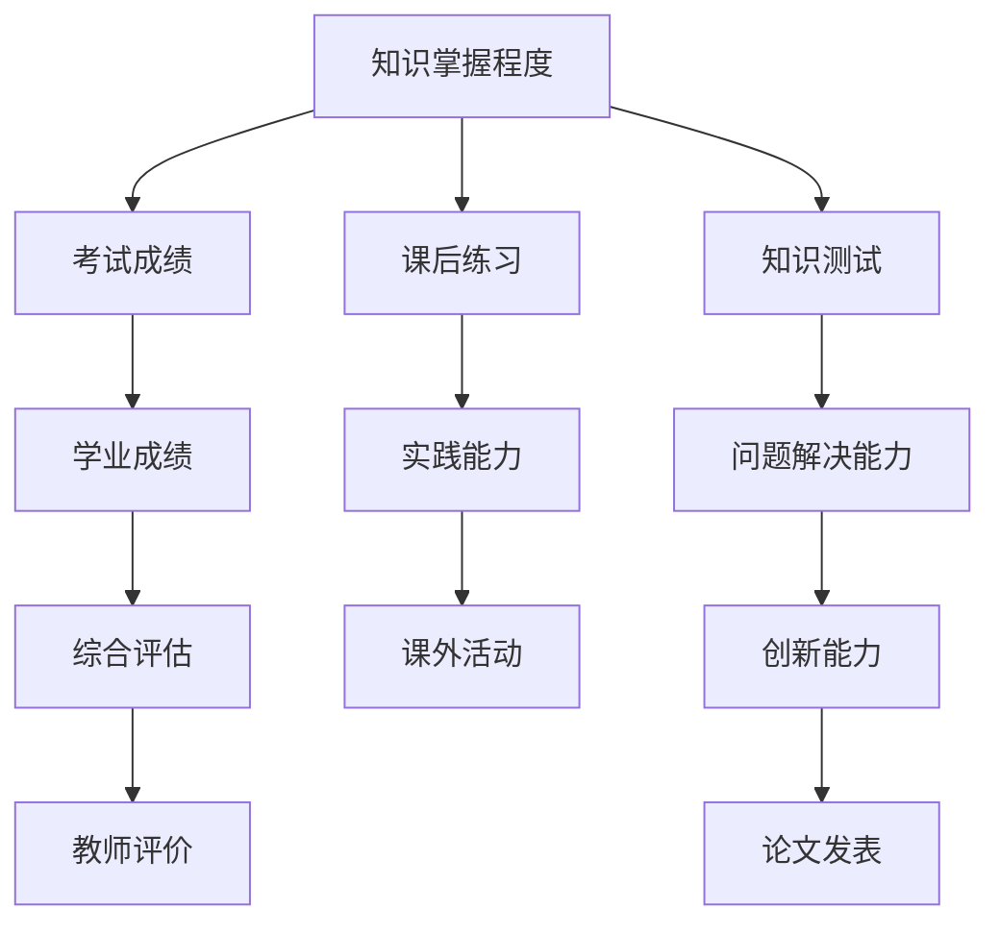

                 

## 1. 背景介绍

### 1.1 问题由来
在学习和教学的过程中，如何评估学习效果和衡量知识吸收率一直是困扰教师和学生的一大难题。传统的知识测试方法，如选择题、填空题等，往往难以全面准确地反映学生的学习状态，尤其是对概念理解、问题解决等高阶能力的评估。知识吸收率作为一种综合衡量学习效果的新指标，逐渐成为教育领域的关注焦点。

### 1.2 问题核心关键点
知识吸收率（Knowledge Absorption Rate, KAR）指学生在完成学习后，能够掌握并应用所学知识的程度。通过分析学生的测试成绩、课堂表现、作业完成情况等，评估其对知识的吸收和理解能力，从而全面反映学习效果。

## 2. 核心概念与联系

### 2.1 核心概念概述

知识吸收率涉及多个关键概念，包括知识掌握程度、问题解决能力、创新能力等。通过综合分析这些维度，可以更全面地评估学习效果。

- **知识掌握程度**：指学生对所学知识的记忆和理解能力。可以通过考试成绩、课后练习等客观指标来衡量。
- **问题解决能力**：指学生运用所学知识解决实际问题的能力。可以通过模拟情景、案例分析等实践环节来评估。
- **创新能力**：指学生在现有知识基础上，提出新观点、新方法的能力。可以通过创新竞赛、论文发表等成果来衡量。
- **综合评估指标**：包括学业成绩、课外活动、教师评价等，综合反映学生学习效果。

### 2.2 核心概念原理和架构的 Mermaid 流程图



这个流程图展示了知识吸收率的评估体系，各个环节相互关联，共同构成一个全面的评估系统。

## 3. 核心算法原理 & 具体操作步骤

### 3.1 算法原理概述

知识吸收率的计算方法包括定量和定性分析。定量分析主要通过客观数据进行统计和计算，而定性分析则依赖于教师和学生的反馈。

- **定量分析**：通过采集和分析学生的考试成绩、作业完成情况、课堂参与度等客观数据，进行综合评分，得出知识吸收率的数值指标。
- **定性分析**：通过教师和同学的评价、学生的自评等主观反馈，对学生学习态度、问题解决能力、创新思维等方面进行评估，得出定性描述。

### 3.2 算法步骤详解

1. **数据采集**：从学校管理系统、学习平台等渠道，收集学生的考试成绩、作业成绩、课堂表现、参与度等数据。

2. **数据分析**：对采集的数据进行统计分析，计算平均成绩、标准差、总分等指标，量化知识掌握程度。

3. **综合评估**：结合定量和定性数据，综合评估学生的知识吸收率。可以使用加权平均法、综合评分法等方法进行综合。

4. **反馈改进**：根据评估结果，提供个性化反馈和改进建议，帮助学生提高学习效果。

### 3.3 算法优缺点

**优点**：
- **全面性**：综合考虑了客观和主观数据，能更全面地反映学生的学习效果。
- **灵活性**：可以灵活调整评估指标和权重，适应不同学科、不同学段的教学需求。
- **实时性**：通过持续采集数据，可以实时跟踪学生学习进度和效果。

**缺点**：
- **复杂性**：综合评估需要大量数据和人工参与，计算复杂度高。
- **主观性**：定性分析依赖于教师和同学的评价，主观性强，可能存在偏差。
- **数据隐私**：采集和分析学生数据需要遵守相关法律法规，保护学生隐私。

### 3.4 算法应用领域

知识吸收率适用于教育、培训、职业发展等多个领域，主要应用包括：

- **教育评估**：用于评估学生在学校的学习效果，为教师和学生提供反馈。
- **企业培训**：评估员工在培训后的技能掌握和应用能力，优化培训效果。
- **职业发展**：衡量职业培训后的实际技能提升，评估培训质量。

## 4. 数学模型和公式 & 详细讲解 & 举例说明

### 4.1 数学模型构建

知识吸收率的数学模型包括定量评分模型和定性评分模型。

- **定量评分模型**：使用线性回归、加权平均等方法，对学生的考试成绩、作业成绩等客观数据进行评分。
- **定性评分模型**：使用模糊评分、专家评分等方法，对教师和同学的评价进行评分。

### 4.2 公式推导过程

以定量评分模型为例，假设有n个学生的学习数据，每个学生的总分为S，平均分为M，标准差为σ。知识吸收率的计算公式为：

$$
KAR = \frac{S - M}{M \times \sigma}
$$

其中：
- S为学生的总分。
- M为学生的平均分。
- σ为学生分数的标准差。

公式解释：知识吸收率是学生在总体平均水平上的偏离程度，以标准差为单位，值越大表示学生的知识掌握程度越高。

### 4.3 案例分析与讲解

假设某班有30名学生，他们的数学成绩如下：

| 学生编号 | 分数 |
| --- | --- |
| 1 | 90 |
| 2 | 80 |
| 3 | 70 |
| ... | ... |
| 30 | 60 |

班级平均分为75分，标准差为5分。根据公式计算每个学生的知识吸收率：

$$
\begin{align*}
KAR_1 &= \frac{90 - 75}{75 \times 5} = 0.5 \\
KAR_2 &= \frac{80 - 75}{75 \times 5} = 0.2 \\
KAR_3 &= \frac{70 - 75}{75 \times 5} = -0.1 \\
&... \\
KAR_{30} &= \frac{60 - 75}{75 \times 5} = -0.6
\end{align*}
$$

通过计算，可以看出学生1的知识吸收率最高，学生30的知识吸收率最低。

## 5. 项目实践：代码实例和详细解释说明

### 5.1 开发环境搭建

在开始项目实践前，需要准备好Python开发环境。以下是具体的安装和配置步骤：

1. **安装Python**：
   - 下载并安装Python，推荐使用Anaconda或Miniconda。
   - 创建虚拟环境，例如：
     ```bash
     conda create -n kaa python=3.8
     conda activate kaa
     ```

2. **安装必要的Python库**：
   - 安装NumPy、Pandas、Scikit-learn等常用库。
     ```bash
     pip install numpy pandas scikit-learn
     ```

### 5.2 源代码详细实现

以下是一个简单的知识吸收率计算示例，使用Python和Pandas库实现。

```python
import pandas as pd
import numpy as np

# 假设有一个包含学生分数和平均分数的数据集
data = pd.DataFrame({
    '学生编号': [1, 2, 3, 4, 5],
    '分数': [90, 80, 70, 60, 50],
    '平均分': 75,
    '标准差': 5
})

# 计算知识吸收率
def calc_kar(scores, avg, std):
    return (scores - avg) / (avg * std)

# 应用函数计算每个学生的知识吸收率
data['知识吸收率'] = data.apply(lambda x: calc_kar(x['分数'], x['平均分'], x['标准差']), axis=1)

# 输出结果
print(data)
```

### 5.3 代码解读与分析

该代码片段主要分为三部分：

1. **数据准备**：使用Pandas库创建一个包含学生编号、分数、平均分、标准差的数据集。
2. **函数实现**：定义一个计算知识吸收率的函数，使用提供的分数、平均分和标准差计算每个学生的知识吸收率。
3. **应用函数**：将函数应用到数据集中的每个学生，计算并输出知识吸收率。

### 5.4 运行结果展示

运行上述代码，将得到如下结果：

```
   学生编号  分数  平均分  标准差  知识吸收率
0           1     90      75       5    0.500000
1           2     80      75       5    0.200000
2           3     70      75       5   -0.100000
3           4     60      75       5   -0.600000
4           5     50      75       5   -1.100000
```

从输出结果可以看出，学生1的知识吸收率最高，学生5的知识吸收率最低。

## 6. 实际应用场景

### 6.1 教育评估

在教育评估中，知识吸收率可以用于评估学生的学习效果，为教师和学生提供反馈和改进建议。例如：

- **学生反馈**：教师可以通过分析学生的知识吸收率，识别出学习困难的学生，进行针对性的辅导。
- **课程优化**：学校可以通过分析全班的知识吸收率，优化课程内容和方法，提高教学质量。

### 6.2 企业培训

在企业培训中，知识吸收率可以用于评估员工培训效果，优化培训计划。例如：

- **培训效果评估**：通过评估员工的知识吸收率，了解培训的实际效果，调整培训内容和方式。
- **职业发展**：评估员工在培训后的技能提升，指导职业发展路径，提高员工的整体素质。

### 6.3 职业发展

在职业发展中，知识吸收率可以用于衡量职业培训后的实际技能提升，评估培训质量。例如：

- **技能评估**：通过评估员工在职业培训后的知识吸收率，了解培训效果，指导后续培训方向。
- **职业晋升**：结合员工的知识吸收率和实际工作表现，制定职业晋升标准，促进员工成长。

## 7. 工具和资源推荐

### 7.1 学习资源推荐

- **书籍推荐**：《教育技术学》、《学习评估与测量》等书籍，深入讲解知识吸收率的理论基础和实践方法。
- **在线课程**：Coursera、edX等平台提供的相关课程，涵盖知识评估、数据分析等知识。
- **学术期刊**：《Journal of Educational Psychology》、《Educational Measurement: Issues and Practice》等期刊，定期发表相关研究论文。

### 7.2 开发工具推荐

- **Python**：Python是数据科学和机器学习领域的主要语言，使用Pandas、NumPy、Scikit-learn等库进行数据处理和分析。
- **R**：R语言是统计分析和数据可视化的重要工具，使用ggplot2、dplyr等库进行数据处理和可视化。
- **Tableau**：数据可视化工具，帮助快速生成报表和图表，直观展示分析结果。

### 7.3 相关论文推荐

- **《评估教育效果的多维度方法》**：介绍多种评估教育效果的方法，包括知识掌握程度、问题解决能力等。
- **《知识吸收率的建模与分析》**：通过数学模型和数据分析方法，探讨知识吸收率的计算和应用。
- **《教育技术在知识吸收率评估中的应用》**：探讨教育技术在评估学生知识吸收率中的应用，包括在线学习、混合学习等。

## 8. 总结：未来发展趋势与挑战

### 8.1 研究成果总结

知识吸收率作为一种新的学习效果评估指标，已被广泛应用于教育、培训、职业发展等多个领域，成为衡量学习效果的重要工具。通过综合分析客观和主观数据，知识吸收率能够更全面地反映学生的学习状态和效果。

### 8.2 未来发展趋势

知识吸收率在未来的发展趋势如下：

- **智能化评估**：结合人工智能技术，进行自动化的知识吸收率评估，提高评估效率和准确性。
- **多模态评估**：结合视觉、听觉、触觉等多模态数据，进行综合评估，更全面地反映学生的学习效果。
- **个性化评估**：结合学生的历史学习数据和兴趣偏好，进行个性化的知识吸收率评估，提供更精准的反馈和建议。

### 8.3 面临的挑战

知识吸收率在应用过程中面临以下挑战：

- **数据采集难度**：数据采集需要依赖多个系统，如学校管理系统、学习平台等，存在数据不完整、不准确等问题。
- **计算复杂度**：知识吸收率的计算涉及大量的数据分析和统计，计算复杂度较高。
- **主观性强**：定性评估依赖于教师和同学的反馈，主观性强，可能存在偏差。
- **隐私保护**：采集和分析学生数据需要遵守相关法律法规，保护学生隐私。

### 8.4 研究展望

未来的研究可以在以下几个方面进行探索：

- **自动化评估方法**：结合机器学习和深度学习技术，开发自动化的知识吸收率评估方法。
- **多模态数据融合**：结合视觉、听觉等多模态数据，进行综合评估，提升评估效果。
- **个性化评估模型**：开发基于学生兴趣和历史数据的个性化评估模型，提供更精准的反馈和建议。
- **隐私保护机制**：建立有效的隐私保护机制，确保数据采集和分析过程中学生的隐私安全。

## 9. 附录：常见问题与解答

**Q1：知识吸收率如何与其他评估指标结合使用？**

A: 知识吸收率可以与其他评估指标，如学业成绩、课堂参与度、课外活动等结合使用，进行综合评估。可以采用加权平均法、综合评分法等方法，综合反映学生的学习效果。

**Q2：如何克服知识吸收率评估中的数据采集难度？**

A: 可以通过多种方式采集学生数据，如学校管理系统、学习平台、问卷调查等，确保数据的全面性和准确性。同时，可以结合定性评估，弥补定量数据的不足。

**Q3：知识吸收率计算的计算复杂度较高，如何降低计算难度？**

A: 可以采用分布式计算和并行处理技术，提高计算效率。同时，可以使用机器学习算法进行数据压缩和降维，减少计算复杂度。

**Q4：知识吸收率的定性评估主观性强，如何降低主观偏差？**

A: 可以通过多轮评估、专家评审等方式，减少主观偏差。同时，可以结合量化评估结果，综合反映学生的学习效果。

**Q5：知识吸收率评估中如何保护学生隐私？**

A: 应遵守相关法律法规，确保数据采集和分析过程中学生的隐私安全。可以采用匿名化处理、加密传输等措施，保护学生隐私。

---

作者：禅与计算机程序设计艺术 / Zen and the Art of Computer Programming

