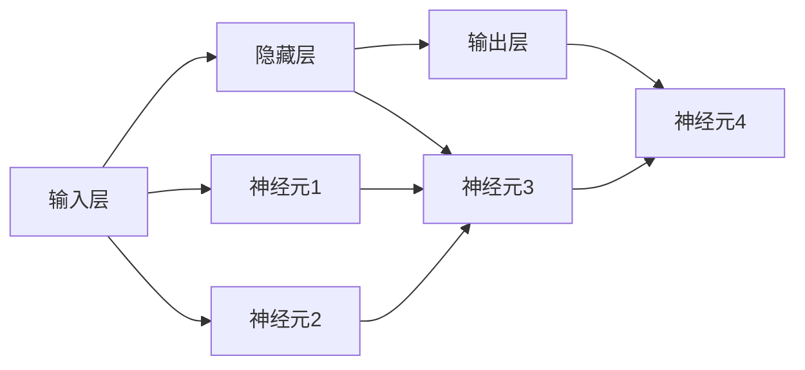

                 

# 神经网络：改变世界的技术

## 1. 背景介绍

神经网络是20世纪70年代由科学家们提出的一种新型的信息处理模型，最初应用于模拟生物神经元的活动。然而，在80年代后期，随着计算机技术的进步，神经网络开始被广泛应用到图像识别、语音识别、自然语言处理等领域，并逐渐成为人工智能的核心技术之一。

在21世纪初期，神经网络技术的进步加速了其在实际应用中的落地，尤其是在深度学习框架的推动下，大规模神经网络模型的训练和推理变得可能，大幅提升了模型的性能和应用范围。例如，卷积神经网络（CNN）在图像识别任务上取得了突破性进展，循环神经网络（RNN）和长短期记忆网络（LSTM）在自然语言处理领域表现出色。

在近几年，随着深度学习技术的进一步发展和应用，神经网络已经在医疗诊断、自动驾驶、游戏智能、机器人技术等领域取得了显著的成就，改变了许多行业的工作模式，推动了技术革命的浪潮。

## 2. 核心概念与联系

### 2.1 核心概念概述

神经网络是由大量的人工神经元（或称神经元细胞）相互连接构成的非线性模型。每个神经元接收输入数据，并根据输入数据和自己的权重计算结果，生成输出。这种模型通过反向传播算法优化权重，使得模型能够从大量数据中自动学习到特征，并实现对新数据的预测和分类。

神经网络的核心概念包括：

- 人工神经元：神经网络的单个单元，接收输入并生成输出。
- 激活函数：用于引入非线性特性，常见的激活函数有sigmoid、ReLU、tanh等。
- 权重：连接人工神经元的参数，用于控制神经元之间的影响大小。
- 反向传播算法：通过链式法则计算梯度，用于优化权重参数。
- 损失函数：用于衡量模型预测结果与真实结果之间的差异。
- 优化器：用于控制反向传播过程中的权重更新方式，常见的优化器有SGD、Adam、Adagrad等。

这些核心概念构成了神经网络的基本框架，并通过其不断迭代和优化，推动了神经网络技术的发展和应用。

### 2.2 核心概念原理和架构的 Mermaid 流程图



上述流程图展示了神经网络的基本架构，其中输入层、隐藏层和输出层是神经网络的三层结构。每个神经元接收上一层神经元的输出，并计算自己的结果。隐藏层可以是多个，每个神经元都接收上一层神经元的输出，并计算自己的结果，最终将结果传递给下一层。

### 2.3 核心概念之间的联系

神经网络的核心概念之间有着紧密的联系。例如，激活函数引入非线性特性，使得神经网络能够处理非线性关系。权重决定了神经元之间的连接强度，用于控制神经元之间的影响大小。反向传播算法通过链式法则计算梯度，用于优化权重参数。损失函数衡量模型预测结果与真实结果之间的差异，优化器用于控制反向传播过程中的权重更新方式，以达到最小化损失函数的目的。

这些概念相互依赖，共同构成了神经网络的完整体系，使得神经网络能够从大量数据中自动学习特征，并实现对新数据的预测和分类。

## 3. 核心算法原理 & 具体操作步骤

### 3.1 算法原理概述

神经网络的核心算法是反向传播算法，用于计算梯度并优化权重。反向传播算法的基本原理是将误差从输出层向输入层反向传播，通过链式法则计算梯度，并使用梯度下降等优化算法更新权重参数。通过不断迭代，神经网络能够逐步优化权重参数，提升模型的性能。

神经网络的训练过程通常分为两个阶段：前向传播和反向传播。前向传播是指将输入数据传递到神经网络，计算出模型的预测结果。反向传播是指计算模型预测结果与真实结果之间的误差，并将误差从输出层向输入层反向传播，计算出每个神经元对误差的贡献，最终更新权重参数。

### 3.2 算法步骤详解

神经网络的训练过程通常包括以下几个关键步骤：

1. 准备数据：将数据集划分为训练集、验证集和测试集，并进行预处理，如数据归一化、数据增强等。
2. 搭建模型：根据任务选择合适的神经网络结构，并进行初始化。
3. 前向传播：将输入数据传递到神经网络，计算出模型的预测结果。
4. 计算损失：计算模型预测结果与真实结果之间的误差，通常使用均方误差、交叉熵等损失函数。
5. 反向传播：计算误差从输出层向输入层的反向传播，并计算每个神经元对误差的贡献。
6. 更新权重：使用梯度下降等优化算法，根据每个神经元的误差贡献更新权重参数。
7. 迭代训练：重复以上步骤，直到模型收敛。

### 3.3 算法优缺点

神经网络的优点包括：

- 非线性建模：神经网络能够处理非线性关系，适用于处理复杂的数据。
- 自动特征提取：神经网络能够自动从大量数据中学习到特征，减少人工特征工程的投入。
- 可扩展性：神经网络能够通过增加层数和神经元数量，提升模型的性能和应用范围。

神经网络的缺点包括：

- 数据依赖：神经网络的性能很大程度上取决于数据的质量和数量。
- 过拟合：当训练数据不足时，神经网络容易出现过拟合，导致模型泛化能力差。
- 计算复杂度高：神经网络需要大量的计算资源和时间进行训练，并且需要大量的数据。
- 可解释性差：神经网络的内部机制复杂，难以解释模型的决策过程。

### 3.4 算法应用领域

神经网络在多个领域得到了广泛的应用，例如：

- 图像识别：卷积神经网络（CNN）在图像识别领域取得了突破性进展，广泛应用于人脸识别、物体检测、图像分类等任务。
- 语音识别：循环神经网络（RNN）和长短期记忆网络（LSTM）在语音识别领域表现出色，广泛应用于语音助手、语音翻译等任务。
- 自然语言处理：神经网络在自然语言处理领域取得了显著的进展，应用于机器翻译、情感分析、文本分类、问答系统等任务。
- 自动驾驶：神经网络在自动驾驶领域应用广泛，用于图像识别、行为预测、路径规划等任务。
- 机器人技术：神经网络在机器人技术中应用广泛，用于视觉识别、动作控制、路径规划等任务。
- 金融预测：神经网络在金融预测领域表现出色，用于股票价格预测、信用风险评估等任务。
- 游戏智能：神经网络在人工智能游戏中应用广泛，用于游戏策略优化、对手分析等任务。

这些应用领域展示了神经网络的强大功能和广泛应用前景，为各行各业带来了深刻的变革。

## 4. 数学模型和公式 & 详细讲解 & 举例说明

### 4.1 数学模型构建

神经网络的基本数学模型可以表示为：

$$
y = f(W \cdot x + b)
$$

其中 $y$ 为输出结果，$f$ 为激活函数，$W$ 为权重矩阵，$x$ 为输入数据，$b$ 为偏置向量。

在反向传播算法中，梯度 $\nabla J$ 可以表示为：

$$
\nabla J = \frac{\partial J}{\partial y} \cdot \frac{\partial y}{\partial z} \cdot \frac{\partial z}{\partial x}
$$

其中 $J$ 为损失函数，$z$ 为中间变量。

### 4.2 公式推导过程

以一个简单的二分类任务为例，推导神经网络的梯度计算公式。

假设输入数据为 $x$，模型的输出结果为 $y$，损失函数为 $J$。模型的前向传播过程可以表示为：

$$
z = W \cdot x + b
$$
$$
y = f(z)
$$

其中 $f$ 为激活函数。

模型的损失函数可以表示为：

$$
J = \frac{1}{2} \sum_{i=1}^n (y_i - t_i)^2
$$

其中 $t$ 为真实标签，$n$ 为样本数量。

对 $W$ 进行梯度计算，可以使用反向传播算法。根据链式法则，梯度 $\nabla J$ 可以表示为：

$$
\nabla J = \frac{\partial J}{\partial z} \cdot \frac{\partial z}{\partial W}
$$

其中：

$$
\frac{\partial J}{\partial z} = -(y - t) \cdot f'(z)
$$

$$
\frac{\partial z}{\partial W} = x^T
$$

因此，$W$ 的梯度计算公式为：

$$
\nabla J_W = \frac{\partial J}{\partial z} \cdot \frac{\partial z}{\partial W} \cdot \frac{\partial y}{\partial z} = -(y - t) \cdot f'(z) \cdot x^T
$$

### 4.3 案例分析与讲解

以一个简单的二分类任务为例，介绍神经网络的训练过程。

假设有一个二分类任务，训练集为 $(x_i, y_i)$，其中 $x_i$ 为输入数据，$y_i$ 为真实标签。

1. 初始化权重和偏置：对 $W$ 和 $b$ 进行初始化，通常使用随机初始化。
2. 前向传播：将输入数据 $x$ 传递到神经网络，计算出模型的输出结果 $y$。
3. 计算损失：计算模型预测结果与真实结果之间的误差，得到损失函数 $J$。
4. 反向传播：计算误差从输出层向输入层的反向传播，计算出每个神经元对误差的贡献。
5. 更新权重：使用梯度下降等优化算法，根据每个神经元的误差贡献更新权重参数 $W$ 和偏置 $b$。
6. 迭代训练：重复以上步骤，直到模型收敛。

例如，对于一个简单的二分类任务，可以使用如下代码实现神经网络的训练：

```python
import numpy as np

# 定义激活函数
def sigmoid(z):
    return 1 / (1 + np.exp(-z))

# 定义损失函数
def binary_cross_entropy(y_true, y_pred):
    return - (y_true * np.log(y_pred) + (1 - y_true) * np.log(1 - y_pred))

# 定义神经网络
class NeuralNetwork:
    def __init__(self):
        self.W = np.random.randn(1, 1)
        self.b = np.zeros((1, 1))
    
    def forward(self, x):
        z = np.dot(x, self.W) + self.b
        y = sigmoid(z)
        return y
    
    def backward(self, x, y_true, learning_rate=0.1):
        y_pred = self.forward(x)
        J = binary_cross_entropy(y_true, y_pred)
        dJ_dz = -(y_true - y_pred) * sigmoid(z) * (1 - sigmoid(z))
        dJ_dW = np.dot(x.T, dJ_dz)
        dJ_db = np.sum(dJ_dz, axis=0)
        self.W -= learning_rate * dJ_dW
        self.b -= learning_rate * dJ_db
```

## 5. 项目实践：代码实例和详细解释说明

### 5.1 开发环境搭建

在进行神经网络开发时，需要搭建合适的开发环境。以下是使用Python进行Keras开发的流程：

1. 安装Keras：使用pip安装Keras。
```python
pip install keras
```

2. 安装TensorFlow：Keras默认使用TensorFlow作为后端，需要先安装TensorFlow。
```python
pip install tensorflow
```

3. 安装NumPy：Keras依赖NumPy进行数组计算。
```python
pip install numpy
```

4. 安装Matplotlib：用于可视化模型训练过程。
```python
pip install matplotlib
```

完成上述步骤后，即可在Python环境中开始神经网络开发。

### 5.2 源代码详细实现

以下是一个简单的多层感知器（MLP）在MNIST手写数字识别任务上的实现代码：

```python
import keras
from keras.datasets import mnist
from keras.models import Sequential
from keras.layers import Dense
from keras.utils import to_categorical
from keras.optimizers import Adam

# 加载数据集
(x_train, y_train), (x_test, y_test) = mnist.load_data()

# 数据预处理
x_train = x_train / 255.0
x_test = x_test / 255.0
y_train = to_categorical(y_train, 10)
y_test = to_categorical(y_test, 10)

# 搭建模型
model = Sequential()
model.add(Dense(64, input_dim=784, activation='relu'))
model.add(Dense(10, activation='softmax'))

# 编译模型
model.compile(loss='categorical_crossentropy', optimizer=Adam(), metrics=['accuracy'])

# 训练模型
model.fit(x_train, y_train, epochs=10, batch_size=32, validation_data=(x_test, y_test))

# 评估模型
test_loss, test_acc = model.evaluate(x_test, y_test)
print('Test accuracy:', test_acc)
```

### 5.3 代码解读与分析

**数据预处理**：将数据集进行归一化和one-hot编码，以便输入到神经网络中进行训练。

**模型搭建**：使用Keras中的Sequential模型搭建多层感知器，包含两个全连接层。

**模型编译**：使用Adam优化器和交叉熵损失函数编译模型，并指定评估指标为准确率。

**模型训练**：使用fit方法训练模型，指定训练轮数为10，批次大小为32，验证集为测试集。

**模型评估**：使用evaluate方法评估模型在测试集上的性能，并打印输出准确率。

## 6. 实际应用场景

### 6.1 图像识别

神经网络在图像识别领域取得了巨大的成功。例如，谷歌的Inception网络在ImageNet数据集上取得了突破性进展，并在多个图像识别任务上应用广泛。

### 6.2 语音识别

神经网络在语音识别领域也表现出色。例如，微软的DeepSpeech模型在语音识别任务上取得了显著进展，并在实时语音翻译、语音助手等领域得到了广泛应用。

### 6.3 自然语言处理

神经网络在自然语言处理领域也取得了显著的进展。例如，谷歌的BERT模型在多项NLP任务上取得了SOTA，并广泛应用于问答系统、文本分类、机器翻译等任务。

### 6.4 自动驾驶

神经网络在自动驾驶领域应用广泛，用于图像识别、行为预测、路径规划等任务。例如，特斯拉的自动驾驶系统就使用了神经网络技术。

### 6.5 游戏智能

神经网络在人工智能游戏中应用广泛，用于游戏策略优化、对手分析等任务。例如，AlphaGo就使用了深度神经网络进行游戏策略优化。

### 6.6 医疗诊断

神经网络在医疗诊断领域应用广泛，用于医学影像分析、疾病预测等任务。例如，深度学习在医学影像分析中取得了显著进展。

## 7. 工具和资源推荐

### 7.1 学习资源推荐

- Keras官方文档：Keras官方文档提供了丰富的教程和样例代码，是Keras学习的最佳资源。
- TensorFlow官方文档：TensorFlow官方文档提供了全面的API和模型示例，是深度学习学习的必备资源。
- PyTorch官方文档：PyTorch官方文档提供了丰富的API和样例代码，是深度学习学习的推荐资源。
- Deep Learning with Python书籍：Deep Learning with Python书籍深入浅出地介绍了深度学习的基本概念和应用。
- TensorFlow实战深度学习书籍：TensorFlow实战深度学习书籍提供了丰富的实践案例，是深度学习学习的推荐资源。

### 7.2 开发工具推荐

- Jupyter Notebook：Jupyter Notebook是一个开源的交互式编程工具，可以方便地编写和运行代码，并可视化实验结果。
- PyCharm：PyCharm是一个流行的Python IDE，提供了丰富的代码编辑、调试和测试功能，是深度学习学习的推荐工具。
- Visual Studio Code：Visual Studio Code是一个轻量级的代码编辑器，支持多种编程语言，是深度学习学习的推荐工具。
- TensorBoard：TensorBoard是TensorFlow的可视化工具，可以实时监测模型训练状态，并提供丰富的图表呈现方式，是深度学习学习的推荐工具。

### 7.3 相关论文推荐

- ImageNet大规模视觉识别挑战赛：ImageNet大规模视觉识别挑战赛是计算机视觉领域的顶级赛事，推动了图像识别技术的快速发展。
- AlphaGo Zero：AlphaGo Zero是谷歌DeepMind开发的AlphaGo改进版，使用了深度神经网络进行游戏策略优化，展示了神经网络的强大能力。
- BERT：BERT是由谷歌发布的预训练语言模型，在自然语言处理领域取得了显著的进展。

## 8. 总结：未来发展趋势与挑战

### 8.1 研究成果总结

神经网络技术在过去几十年中取得了显著的进展，应用范围不断扩大。通过反向传播算法和梯度优化算法，神经网络可以从大量数据中自动学习特征，并实现对新数据的预测和分类。在图像识别、语音识别、自然语言处理、自动驾驶等领域，神经网络已经取得了显著的成就。

### 8.2 未来发展趋势

未来神经网络技术将呈现出以下几个发展趋势：

- 深度学习：深度学习将继续推动神经网络的发展，进一步提升模型的性能和应用范围。
- 自监督学习：自监督学习将更加广泛地应用于神经网络中，减少对标注数据的依赖。
- 迁移学习：迁移学习将进一步推动神经网络在不同任务之间的知识共享和迁移。
- 强化学习：强化学习将与神经网络结合，推动智能系统在复杂环境中的自主决策。
- 联邦学习：联邦学习将推动神经网络在多个分布式节点上的协同学习，提升模型的泛化能力。
- 边缘计算：边缘计算将推动神经网络在低功耗设备上的实时推理，提升系统的实时性。

### 8.3 面临的挑战

尽管神经网络技术在过去几十年中取得了显著的进展，但在未来发展中仍面临以下挑战：

- 数据依赖：神经网络的性能很大程度上取决于数据的质量和数量，如何获取和处理大规模高质量数据，仍然是一个重要的挑战。
- 模型复杂度：神经网络的内部结构复杂，如何设计高效的神经网络架构，减少模型的复杂度和计算资源消耗，仍然是一个重要的挑战。
- 可解释性：神经网络的内部机制复杂，难以解释模型的决策过程，如何提高模型的可解释性，仍然是一个重要的挑战。
- 鲁棒性：神经网络在面对噪声和攻击时，容易产生错误，如何提高模型的鲁棒性，仍然是一个重要的挑战。
- 隐私保护：神经网络在处理敏感数据时，容易泄露用户隐私，如何保护数据隐私，仍然是一个重要的挑战。

### 8.4 研究展望

未来神经网络技术的研究方向包括：

- 深度学习：深度学习将继续推动神经网络的发展，进一步提升模型的性能和应用范围。
- 自监督学习：自监督学习将更加广泛地应用于神经网络中，减少对标注数据的依赖。
- 迁移学习：迁移学习将进一步推动神经网络在不同任务之间的知识共享和迁移。
- 强化学习：强化学习将与神经网络结合，推动智能系统在复杂环境中的自主决策。
- 联邦学习：联邦学习将推动神经网络在多个分布式节点上的协同学习，提升模型的泛化能力。
- 边缘计算：边缘计算将推动神经网络在低功耗设备上的实时推理，提升系统的实时性。

总之，神经网络技术将在未来继续推动人工智能技术的发展，带来更加广泛的应用场景和更加深刻的社会变革。

## 9. 附录：常见问题与解答

**Q1：神经网络是否只适用于图像和语音识别任务？**

A: 神经网络不仅适用于图像和语音识别任务，还可以应用于自然语言处理、游戏智能、医疗诊断等领域。例如，神经网络在自然语言处理领域中的BERT模型取得了显著的进展，广泛应用于问答系统、文本分类、机器翻译等任务。

**Q2：神经网络是否需要大量的数据进行训练？**

A: 是的，神经网络的性能很大程度上取决于数据的质量和数量。一般来说，神经网络需要大量的数据进行训练，以学习到丰富的特征。但通过迁移学习等技术，可以一定程度上降低对数据量的依赖。

**Q3：神经网络是否容易过拟合？**

A: 是的，当训练数据不足时，神经网络容易出现过拟合，导致模型泛化能力差。解决过拟合的方法包括数据增强、正则化、早停等技术。

**Q4：神经网络的训练过程是否需要大量的计算资源和时间？**

A: 是的，神经网络的训练过程需要大量的计算资源和时间，特别是在大规模神经网络中，训练时间可能会长达数天甚至数周。为了加快训练速度，可以使用分布式训练、GPU加速等技术。

**Q5：神经网络的模型参数是否可以共享？**

A: 是的，神经网络的模型参数可以共享。迁移学习技术就是基于模型参数共享的思想，在不同任务之间进行知识迁移，提高模型的泛化能力。

**Q6：神经网络的可解释性如何？**

A: 神经网络的可解释性较差，通常被认为是"黑盒"模型。但通过可视化技术，可以一定程度上了解神经网络的内部机制，例如可视化神经元的活动、可视化梯度流向等。

**Q7：神经网络在实际应用中是否容易受到攻击？**

A: 是的，神经网络在实际应用中容易受到攻击，例如对抗样本攻击、梯度泄露攻击等。为保护神经网络的安全性，可以采用数据脱敏、对抗训练等技术。

---

作者：禅与计算机程序设计艺术 / Zen and the Art of Computer Programming

