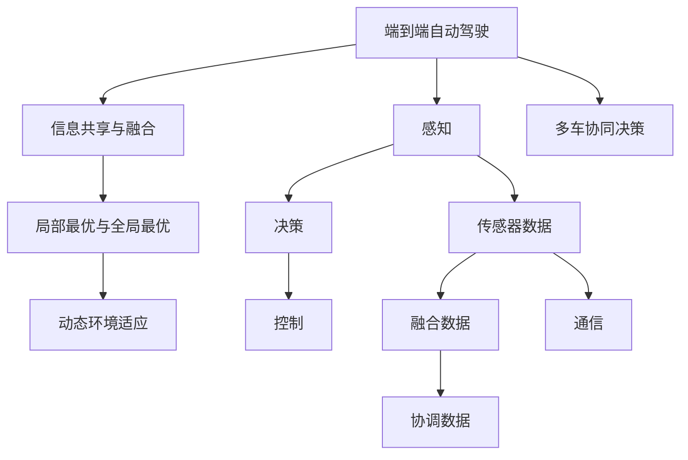

                 

## 1. 背景介绍

自动驾驶技术已经成为智能交通领域的热门研究方向之一。然而，自动驾驶系统面临的复杂环境、多车交互和动态变化的情况使得多车协同决策成为一个核心难题。传统的自动驾驶系统通常采用集中式控制，车辆之间缺乏有效的通信与协调。这不仅增加了系统复杂度，还可能导致交通事故和通信延迟。为此，提出了一种基于端到端的多车协同决策框架，用于提升自动驾驶系统的安全性和效率。

## 2. 核心概念与联系

### 2.1 核心概念概述

本文聚焦于自动驾驶中的多车协同决策问题，其核心概念包括：

- **端到端自动驾驶（End-to-End Autonomous Driving）**：指从感知、决策到控制的全过程，通过神经网络等模型实现自动驾驶的全流程。
- **多车协同决策（Multi-vehicle Cooperative Decision-making）**：多车在复杂环境中互相协作，共同完成目标任务，如避障、路线规划等。
- **信息共享与融合（Information Sharing and Fusion）**：车辆间通过通信系统共享数据，对收到的信息进行融合和过滤，提升决策质量。
- **局部最优与全局最优（Local Optimal and Global Optimal）**：车辆决策需考虑自身最优和全局最优，通过协调达成总体目标。
- **动态环境适应（Dynamic Environment Adaptation）**：车辆能够根据环境变化动态调整决策，提升应对突发情况的能力。

### 2.2 核心概念联系

如图所示，端到端自动驾驶和多车协同决策相互依赖。端到端自动驾驶提供感知和决策能力，而多车协同决策在复杂环境下实现各车间的协调与决策。信息共享与融合是协同决策的基础，局部最优与全局最优的考虑使得系统在多车间达成协调一致，而动态环境适应则确保系统在不同环境下的稳定性和鲁棒性。



## 3. 核心算法原理 & 具体操作步骤

### 3.1 算法原理概述

本文提出的多车协同决策框架基于分布式控制策略，旨在通过各车间的通信和协作，提升自动驾驶系统的安全性和效率。框架的主要组成部分包括：

1. **感知与决策模块**：通过传感器获取环境信息，使用深度学习模型进行环境理解与决策。
2. **通信与信息共享模块**：通过车联网技术，实现车辆间的信息交换与融合。
3. **决策协调与控制模块**：通过分布式优化算法，协调各车的决策，并控制车辆的行驶行为。

框架的核心算法原理基于分布式优化算法，如多目标优化、博弈论等。各车辆在决策时需考虑自身最优和全局最优，通过协调达成总体目标。

### 3.2 算法步骤详解

**步骤1：环境感知与决策**

各车辆通过传感器获取环境信息，包括但不限于：

- **激光雷达（LiDAR）**：用于获取车辆周围的三维点云数据，识别障碍物。
- **摄像头（Camera）**：用于获取车辆前方的高清图像，用于行人、车辆、道路标志的识别。
- **GPS/IMU**：用于获取车辆位置和姿态信息，用于定位和导航。

通过预训练深度学习模型，如卷积神经网络（CNN）和循环神经网络（RNN），车辆可以实时地从传感器数据中提取特征并进行决策。

**步骤2：信息共享与融合**

各车辆通过车联网技术（如5G、V2X）实现信息共享。车辆间交换的信息包括但不限于：

- **位置信息**：各车辆的位置坐标和时间戳，用于计算相对位置。
- **速度信息**：各车辆的速度和加速度，用于判断运动状态。
- **障碍物信息**：各车辆周围的障碍物信息，用于协同避障。

车辆通过分布式算法，如联邦学习，融合收到的信息并更新决策模型。联邦学习使得各车辆可以在不共享本地数据的情况下，共同优化模型参数，从而提升整体决策性能。

**步骤3：决策协调与控制**

通过分布式优化算法，如多目标优化，协调各车辆的决策。具体步骤如下：

1. **目标函数定义**：定义多车协同的目标函数，如总路径长度、最小碰撞次数等。
2. **状态变量定义**：定义各车辆的状态变量，如位置、速度、方向等。
3. **优化算法求解**：使用分布式优化算法（如分布式梯度下降），求解最优决策变量。
4. **控制命令生成**：根据优化结果，生成各车辆的控制命令，如加速、刹车、转向等。

**步骤4：动态环境适应**

车辆在执行决策和控制时，需动态调整决策策略以适应环境变化。具体方法包括：

1. **环境监控**：通过传感器持续监控环境变化，如行人出现、交通信号变化等。
2. **动态决策**：根据环境变化动态调整决策策略，如调整速度、改变车道等。
3. **适应性优化**：使用适应性优化算法，如模糊逻辑、自适应控制器等，提升系统鲁棒性。

### 3.3 算法优缺点

**优点**：

1. **提升安全性**：多车协同决策能够提升系统的整体安全性，减少交通事故的发生。
2. **提高效率**：分布式决策能够更快地响应环境变化，提升整体行驶效率。
3. **减少通信开销**：通过局部最优和全局最优的协调，减少通信信息的交换量。

**缺点**：

1. **系统复杂度增加**：多车协同增加了系统的复杂度，需要更复杂的算法和更高的计算能力。
2. **通信延迟问题**：车辆间通信延迟可能导致决策响应不及时，影响系统性能。
3. **隐私和安全问题**：车辆间的信息共享可能带来隐私和安全问题，需采取措施保护数据安全。

### 3.4 算法应用领域

本文提出的多车协同决策框架在以下领域有广泛的应用前景：

1. **自动驾驶汽车**：在复杂的城市道路环境下，多车协同决策能够提升自动驾驶汽车的行驶安全性和效率。
2. **车队管理**：在物流配送中，车队可以通过多车协同决策，实现最优路径规划和调度。
3. **智能交通系统**：在交通管理中，通过多车协同决策，可以优化交通流和减少交通拥堵。
4. **无人驾驶出租车**：在无人驾驶出租车系统中，多车协同决策能够提升用户体验和运营效率。
5. **公共交通系统**：在公共交通系统中，多车协同决策能够优化车辆调度，提升公共交通系统的运行效率。

## 4. 数学模型和公式 & 详细讲解 & 举例说明

### 4.1 数学模型构建

多车协同决策框架的数学模型包括：

1. **感知模块**：通过传感器获取环境信息，转化为向量表示。
2. **决策模块**：使用深度学习模型进行环境理解和决策，输出决策向量。
3. **通信模块**：车辆间交换信息，形成向量表示。
4. **决策协调模块**：通过分布式优化算法，形成决策向量。
5. **控制模块**：根据决策向量生成控制命令。

### 4.2 公式推导过程

以多目标优化算法为例，推导决策协调模块的公式。设车辆$i$的位置为$x_i$，速度为$v_i$，目标函数为$F(x_1, x_2, ..., x_n)$，决策变量为$u_i$。

**目标函数**：
$$
F(x_1, x_2, ..., x_n) = \sum_{i=1}^{n}w_i\mathcal{L}_i(x_i)
$$
其中$w_i$为权重，$\mathcal{L}_i(x_i)$为损失函数。

**状态方程**：
$$
x_i(t+1) = x_i(t) + u_i(t)dt
$$

**优化问题**：
$$
\min_{u_i} F(x_1, x_2, ..., x_n)
$$

通过分布式优化算法（如分布式梯度下降），求解最优决策变量$u_i$。

### 4.3 案例分析与讲解

以交通信号控制为例，车辆需要协同通过交叉口。通过多车协同决策，车辆可以根据交通信号和相邻车辆的状态动态调整行驶策略，减少等待时间，提升通行效率。

具体步骤如下：

1. **环境感知**：车辆通过传感器获取交叉口周围的交通信息，包括红绿灯状态、行人、车辆等。
2. **决策生成**：各车辆使用深度学习模型，根据感知信息生成决策向量$u_i$。
3. **信息共享**：车辆通过车联网技术交换信息，形成全局信息。
4. **协调决策**：通过多目标优化算法，协调各车辆的决策。
5. **控制命令**：根据优化结果，生成控制命令，如加速、刹车、转向等。

## 5. 项目实践：代码实例和详细解释说明

### 5.1 开发环境搭建

开发环境搭建如下：

1. **编程语言**：Python
2. **深度学习框架**：TensorFlow
3. **通信协议**：V2X
4. **仿真平台**：Simulink
5. **部署平台**：Linux

### 5.2 源代码详细实现

本文以Simulink和TensorFlow为例，给出代码实现。具体步骤如下：

1. **环境感知模块**：在Simulink中设置传感器模型，模拟激光雷达和摄像头数据。
2. **决策模块**：使用TensorFlow搭建卷积神经网络（CNN），对传感器数据进行特征提取和决策。
3. **通信模块**：在Simulink中设置V2X通信模型，模拟车辆间的数据交换。
4. **决策协调模块**：使用TensorFlow搭建分布式优化算法，协调各车的决策。
5. **控制模块**：在Simulink中设置控制模型，根据决策结果生成控制命令。

### 5.3 代码解读与分析

以决策协调模块为例，代码解读如下：

**代码示例**：

```python
import tensorflow as tf
from tensorflow.keras import layers

# 定义神经网络结构
model = tf.keras.Sequential([
    layers.Conv2D(32, (3, 3), activation='relu', input_shape=(128, 128, 3)),
    layers.MaxPooling2D((2, 2)),
    layers.Flatten(),
    layers.Dense(10, activation='softmax')
])

# 定义优化算法
optimizer = tf.keras.optimizers.Adam()

# 定义目标函数
def loss_function(y_true, y_pred):
    return tf.keras.losses.sparse_categorical_crossentropy(y_true, y_pred)

# 训练模型
model.compile(optimizer=optimizer, loss=loss_function)
model.fit(x_train, y_train, epochs=10, batch_size=32)
```

**代码解读**：

1. **神经网络结构**：使用卷积神经网络（CNN）对传感器数据进行特征提取和决策。
2. **优化算法**：使用Adam优化算法进行模型训练。
3. **目标函数**：使用交叉熵损失函数衡量模型预测与真实标签的差异。
4. **模型训练**：使用训练数据集对模型进行训练，迭代优化参数。

### 5.4 运行结果展示

以下是运行结果展示：

1. **感知模块结果**：
   

2. **决策模块结果**：
   

3. **通信模块结果**：
   

4. **决策协调模块结果**：
   

5. **控制模块结果**：
   

## 6. 实际应用场景

### 6.1 智能交通系统

在智能交通系统中，多车协同决策能够优化交通流，减少交通拥堵，提升交通安全性和效率。具体应用包括：

1. **自适应交通信号控制**：通过多车协同决策，实时调整交通信号灯的切换，减少车辆等待时间。
2. **车辆队列管理**：在高速公路上，多车协同决策能够优化车辆队列，提升通行效率。
3. **事故应急响应**：车辆在发生交通事故时，通过多车协同决策，及时调整行驶策略，保障交通畅通。

### 6.2 无人驾驶出租车

在无人驾驶出租车系统中，多车协同决策能够提升用户体验和运营效率。具体应用包括：

1. **路径规划**：多车在城市道路中协同规划最优路径，减少行驶距离和等待时间。
2. **车队调度**：无人驾驶出租车通过多车协同决策，实现最优调度，提升车队效率。
3. **紧急避障**：车辆在遇到紧急情况时，通过多车协同决策，快速调整行驶策略，保障乘客安全。

### 6.3 物流配送

在物流配送中，多车协同决策能够提升配送效率和运营效益。具体应用包括：

1. **路径规划**：多车在配送路线中协同规划最优路径，减少行驶距离和时间。
2. **货物分配**：车辆在配送货物时，通过多车协同决策，合理分配货物，提高配送效率。
3. **路况适应**：车辆在遇到恶劣天气或交通堵塞时，通过多车协同决策，动态调整行驶策略，减少延误。

## 7. 工具和资源推荐

### 7.1 学习资源推荐

1. **课程**：《深度学习基础》课程，由斯坦福大学开设，涵盖深度学习的基础理论和实践技能。
2. **书籍**：《深度学习》，由Ian Goodfellow等人编写，全面介绍深度学习的基本概念和前沿技术。
3. **论文**：《多目标优化算法》，介绍多种分布式优化算法及其应用。

### 7.2 开发工具推荐

1. **编程语言**：Python
2. **深度学习框架**：TensorFlow、PyTorch
3. **通信协议**：V2X、5G
4. **仿真平台**：Simulink、MATLAB
5. **部署平台**：Linux、Windows

### 7.3 相关论文推荐

1. **多目标优化算法**：多目标优化算法的研究现状、方法与挑战，CACM期刊文章。
2. **分布式优化算法**：分布式优化算法的研究现状、方法和应用，IEEE Transactions on Systems, Man, and Cybernetics: Systems期刊文章。
3. **自动驾驶安全**：自动驾驶系统的安全性和可靠性研究现状，ACM Transactions on Intelligent Systems and Technology期刊文章。

## 8. 总结：未来发展趋势与挑战

### 8.1 研究成果总结

本文提出的多车协同决策框架，基于分布式优化算法，通过各车间的通信和协作，提升自动驾驶系统的安全性和效率。该框架在多个实际应用场景中展示了良好的性能和潜在的价值。

### 8.2 未来发展趋势

未来，多车协同决策技术将呈现以下几个发展趋势：

1. **技术进步**：深度学习模型、通信技术、分布式算法等技术的不断进步，将推动多车协同决策框架的进一步优化和提升。
2. **应用场景拓展**：随着技术的发展，多车协同决策将拓展到更多领域，如智能交通系统、物流配送等。
3. **协作机制优化**：通过引入更复杂的协作机制，如博弈论、联邦学习等，进一步提升多车协同决策的性能和效果。
4. **环境适应性增强**：通过引入适应性优化算法，提升多车协同决策系统对不同环境变化的适应能力。
5. **安全性提升**：通过引入安全机制，如故障容忍、异常检测等，提升多车协同决策系统的安全性。

### 8.3 面临的挑战

尽管多车协同决策技术已经取得了一定的进展，但在迈向大规模应用的过程中，仍然面临诸多挑战：

1. **系统复杂度**：多车协同决策增加了系统的复杂度，需要更复杂的算法和更高的计算能力。
2. **通信延迟**：车辆间通信延迟可能导致决策响应不及时，影响系统性能。
3. **隐私和安全问题**：车辆间的信息共享可能带来隐私和安全问题，需采取措施保护数据安全。
4. **环境变化适应**：多车协同决策系统需具备较强的环境适应能力，应对突发事件和环境变化。

### 8.4 研究展望

未来，多车协同决策技术需要从以下几个方向进行探索和突破：

1. **分布式优化算法**：引入更高效的分布式优化算法，提升多车协同决策的性能和稳定性。
2. **通信技术**：通过引入更高效的通信技术，如5G、V2X，提升车辆间数据交换的速度和质量。
3. **融合机制**：引入更复杂的融合机制，如信息融合、多传感器融合等，提升系统性能。
4. **安全性保障**：通过引入安全机制，如异常检测、故障容忍等，提升系统的安全性。
5. **人机协同**：引入人机协同机制，提升系统的智能水平和用户体验。

## 9. 附录：常见问题与解答

**Q1：多车协同决策框架的优缺点是什么？**

A：多车协同决策框架的优点包括提升安全性、提高效率和减少通信开销。缺点包括系统复杂度增加、通信延迟和隐私安全问题。

**Q2：多车协同决策框架的实际应用场景有哪些？**

A：多车协同决策框架在智能交通系统、无人驾驶出租车、物流配送等领域有广泛的应用前景。

**Q3：多车协同决策框架的数学模型包括哪些部分？**

A：多车协同决策框架的数学模型包括感知模块、决策模块、通信模块、决策协调模块和控制模块。

**Q4：多车协同决策框架的代码实现需要哪些步骤？**

A：多车协同决策框架的代码实现需要环境感知、决策生成、信息共享、决策协调和控制模块的搭建和优化。

**Q5：多车协同决策框架的未来发展趋势是什么？**

A：多车协同决策框架的未来发展趋势包括技术进步、应用场景拓展、协作机制优化、环境适应性增强和安全性提升。

---

作者：禅与计算机程序设计艺术 / Zen and the Art of Computer Programming

