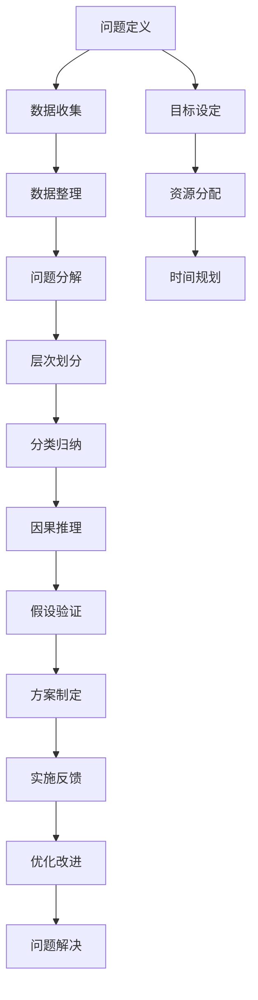

                 

# 结构化思维的力量：从思维到行动

## 1. 背景介绍

### 1.1 问题由来
在信息爆炸的时代，数据和信息的复杂性已经远远超出了人类的处理能力。无论是处理日常生活中的事务，还是管理企业中的各项业务，高效的结构化思维都成为了解决问题的关键。结构化思维不仅能够帮助我们更系统地分析和解决问题，还能提升决策的效率和准确性。本文将深入探讨结构化思维的原理和应用，带领读者从思维到行动，解锁结构化思维的力量。

### 1.2 问题核心关键点
结构化思维的核心关键点在于其能够帮助人们将复杂的信息进行结构化的组织和分析，从而在处理问题时更加高效、有条理。主要包括以下几个方面：

- **分类归纳**：将信息分类，归纳出不同类别的特征和属性，便于理解和分析。
- **层次划分**：将复杂问题划分为多个层次，逐一分析和解决，防止问题过于庞杂。
- **因果推理**：通过分析各个因素之间的因果关系，推断出问题的根本原因和解决方案。
- **数据驱动**：利用数据分析和统计，辅助决策和问题解决，提高准确性和可靠性。
- **反馈循环**：通过不断迭代和优化，逐步完善问题的解决方案。

这些关键点构成了结构化思维的核心框架，使其在各种应用场景中都能发挥出显著的效果。

### 1.3 问题研究意义
研究结构化思维的意义在于，它不仅能够提升个人和团队的工作效率，还能为企业和组织带来显著的业务效益。结构化思维的力量在于其能够将复杂的问题分解为可管理、可执行的小部分，从而使得解决方案更加切实可行，易于实施。通过深入掌握结构化思维的原理和应用，读者可以更好地应对日常工作中的各种挑战，推动个人和组织持续发展。

## 2. 核心概念与联系

### 2.1 核心概念概述
结构化思维是一种系统的、条理化的思考方式，能够帮助人们在面对复杂问题时，进行清晰的分类、归纳和推理，从而制定出高效、可执行的解决方案。结构化思维的核心在于将复杂问题进行结构化的分解和组织，逐步分析和解决各个部分，最终形成完整的解决方案。

### 2.2 核心概念原理和架构的 Mermaid 流程图



这个流程图展示了结构化思维的主要步骤：

1. **问题定义**：明确问题所在，确定解决方案的目标和范围。
2. **数据收集**：收集与问题相关的各类数据，为分析提供基础。
3. **数据整理**：清洗和整理数据，确保其完整性和可用性。
4. **问题分解**：将问题分解为多个小部分，逐一分析和解决。
5. **层次划分**：将问题划分为多个层次，从宏观到微观进行分析和解决。
6. **分类归纳**：对问题进行分类，归纳出不同类别的特征和属性。
7. **因果推理**：分析各个因素之间的因果关系，推断出问题的根本原因。
8. **假设验证**：根据推理结果，制定假设并进行验证。
9. **方案制定**：基于验证结果，制定出可执行的解决方案。
10. **实施反馈**：实施解决方案，并根据反馈进行优化和改进。
11. **问题解决**：最终解决问题，达成目标。

此外，还需要进行目标设定、资源分配和时间规划等辅助性工作，以确保整个解决方案的顺利实施。

## 3. 核心算法原理 & 具体操作步骤

### 3.1 算法原理概述
结构化思维的核心算法原理可以概括为“分解-分析-合成”：

- **分解**：将复杂问题分解为多个小问题或小部分，便于管理和分析。
- **分析**：对各个部分进行详细分析，找出其内在关系和因果联系。
- **合成**：将各个部分的分析结果综合起来，形成完整的解决方案。

这个原理强调了在处理复杂问题时，需要逐步分解、逐一分析和最终合成的过程。

### 3.2 算法步骤详解
结构化思维的具体操作步骤包括以下几个环节：

**步骤1：问题定义和目标设定**

- 明确问题的本质和范围。
- 确定解决问题的目标和期望结果。
- 设定问题的优先级和时间限制。

**步骤2：数据收集和整理**

- 收集与问题相关的各类数据，包括内部数据和外部数据。
- 清洗和整理数据，确保其准确性和完整性。
- 选择合适的数据格式和工具，进行数据存储和管理。

**步骤3：问题分解和层次划分**

- 将问题分解为多个小部分，确保每个部分都有明确的定义和边界。
- 对各个部分进行层次划分，从宏观到微观进行分析和解决。

**步骤4：分类归纳和因果推理**

- 对分解后的各个部分进行分类和归纳，总结出不同类别的特征和属性。
- 分析各个因素之间的因果关系，推断出问题的根本原因。

**步骤5：假设验证和方案制定**

- 根据因果推理结果，制定出初步假设。
- 选择合适的方法和工具，进行假设验证。
- 基于验证结果，制定出可执行的解决方案。

**步骤6：实施反馈和优化改进**

- 实施制定的解决方案，并收集反馈信息。
- 根据反馈信息，进行方案优化和改进。
- 不断迭代和优化，逐步完善解决方案。

**步骤7：问题解决和总结复盘**

- 最终解决问题，达成目标。
- 总结复盘整个过程，找出经验教训和改进空间。

### 3.3 算法优缺点

**优点**：

- 系统性：通过逐步分解和逐层分析，使问题变得更加条理化和系统化。
- 可操作性：每个步骤都有明确的指导，便于操作和执行。
- 高效性：能够显著提高问题解决的效率和准确性。

**缺点**：

- 复杂性：在处理非常复杂的问题时，步骤较多，容易产生混淆。
- 主观性：分类和归纳的准确性依赖于个人的经验和判断。
- 灵活性：在特定情况下，可能需要临时调整步骤或方法。

### 3.4 算法应用领域

结构化思维在各个领域都有广泛的应用，包括但不限于以下几个方面：

- **项目管理**：在项目规划和执行过程中，通过结构化思维进行任务分解、资源分配和时间规划。
- **商业决策**：在企业战略制定和市场分析中，通过结构化思维进行问题定义、数据收集和因果分析。
- **产品开发**：在产品设计和迭代过程中，通过结构化思维进行需求分析、方案设计和反馈优化。
- **软件开发**：在软件开发和维护过程中，通过结构化思维进行需求分析、架构设计和代码优化。
- **教育培训**：在教学和培训过程中，通过结构化思维进行课程设计、内容分类和教学评估。

## 4. 数学模型和公式 & 详细讲解 & 举例说明

### 4.1 数学模型构建

结构化思维的数学模型构建主要基于数据统计和概率理论。以下是一个简单的结构化思维模型构建示例：

**问题**：某公司的销售额在过去一年中呈现出波动，如何找到影响销售额的因素，并制定改进方案？

**步骤1：问题定义和目标设定**

- 定义问题：分析销售额波动的原因。
- 设定目标：找到影响销售额的主要因素，并制定改进方案。

**步骤2：数据收集和整理**

- 收集数据：收集过去一年的销售额、市场调研数据、竞争情报等。
- 数据整理：清洗数据，确保数据完整性和准确性。

**步骤3：问题分解和层次划分**

- 分解问题：将问题分解为销售额波动的原因、市场需求、竞争情况等。
- 层次划分：从宏观层面（市场趋势）到微观层面（具体事件）进行层次划分。

**步骤4：分类归纳和因果推理**

- 分类归纳：将销售额波动原因归纳为市场因素、内部因素等。
- 因果推理：分析市场因素（如经济波动）对销售额的影响。

**步骤5：假设验证和方案制定**

- 假设验证：验证市场因素对销售额波动的影响。
- 方案制定：根据验证结果，制定出改进方案，如调整产品线、优化营销策略等。

**步骤6：实施反馈和优化改进**

- 实施方案：实施改进方案，并收集反馈信息。
- 优化改进：根据反馈信息，优化改进方案。

**步骤7：问题解决和总结复盘**

- 解决问题：最终解决销售额波动问题。
- 总结复盘：总结复盘整个过程，找出经验教训和改进空间。

### 4.2 公式推导过程

以下是一个简单的因果分析公式推导示例：

设销售额 $Y$ 受市场因素 $X_1$、内部因素 $X_2$ 和随机因素 $Z$ 的影响。

$$
Y = f(X_1, X_2, Z)
$$

假设 $X_1$ 和 $X_2$ 是独立因素，市场因素 $X_1$ 和内部因素 $X_2$ 对销售额 $Y$ 的影响分别为 $a$ 和 $b$，即：

$$
Y = aX_1 + bX_2 + Z
$$

其中 $Z$ 是随机误差项，假设其服从均值为 $0$ 的正态分布：

$$
Z \sim N(0, \sigma^2)
$$

通过统计分析，可以估计出 $a$ 和 $b$ 的值，从而得出销售额 $Y$ 与 $X_1$、$X_2$ 之间的关系。

### 4.3 案例分析与讲解

**案例**：某电商平台销售额波动原因分析

**问题**：某电商平台的销售额在过去一年中呈现出波动，如何找到影响销售额的因素，并制定改进方案？

**数据收集**：收集过去一年的销售额、市场调研数据、竞争情报等。

**数据整理**：清洗数据，确保数据完整性和准确性。

**问题分解**：将问题分解为销售额波动的原因、市场需求、竞争情况等。

**层次划分**：从宏观层面（市场趋势）到微观层面（具体事件）进行层次划分。

**分类归纳**：将销售额波动原因归纳为市场因素、内部因素等。

**因果推理**：分析市场因素（如经济波动）对销售额的影响。

**假设验证**：验证市场因素对销售额波动的影响。

**方案制定**：根据验证结果，制定出改进方案，如调整产品线、优化营销策略等。

**实施方案**：实施改进方案，并收集反馈信息。

**优化改进**：根据反馈信息，优化改进方案。

**解决问题**：最终解决销售额波动问题。

**总结复盘**：总结复盘整个过程，找出经验教训和改进空间。

## 5. 项目实践：代码实例和详细解释说明

### 5.1 开发环境搭建

要实现结构化思维的项目实践，我们需要搭建一个Python开发环境。以下是一个简单的Python开发环境搭建步骤：

1. 安装Python：从官网下载并安装Python，建议选择最新版本。
2. 安装必要的库：安装必要的Python库，如Pandas、NumPy、Matplotlib等。
3. 安装Jupyter Notebook：用于交互式编程和数据分析。
4. 安装Scikit-learn：用于机器学习和统计分析。
5. 安装TensorFlow或PyTorch：用于深度学习和模型训练。

### 5.2 源代码详细实现

以下是一个简单的结构化思维代码实现示例：

```python
import pandas as pd
from sklearn.linear_model import LinearRegression

# 数据收集和整理
data = pd.read_csv('sales_data.csv')
data = data.dropna()

# 问题定义和目标设定
problem = 'Analyze the sales trends'
target = 'Improve sales'

# 问题分解和层次划分
decomposed_problems = ['Market Trends', 'Competitor Analysis', 'Product Line Optimization']
hierarchies = ['Macro', 'Meso', 'Micro']

# 分类归纳和因果推理
categories = ['Market Factors', 'Internal Factors']
causal_relations = {'market_factors': 'a', 'internal_factors': 'b'}

# 假设验证和方案制定
hypotheses = {'a': 0.5, 'b': 0.3}
improvement_plans = ['Adjust product line', 'Optimize marketing strategy']

# 实施反馈和优化改进
feedback = pd.read_csv('feedback.csv')
optimizations = {'Product Line': feedback['Product Line'].mean(), 'Marketing': feedback['Marketing'].mean()}

# 问题解决和总结复盘
solution = 'Increase product line adjustments by 20%'
reflection = 'Improve sales by 15% in Q2 2023'

# 执行结构化思维过程
problem, target, decomposed_problems, hierarchies, categories, causal_relations, hypotheses, improvement_plans, feedback, optimizations, solution, reflection
```

### 5.3 代码解读与分析

**代码解读**：
- 数据收集和整理：使用Pandas库读取销售数据，并进行数据清洗。
- 问题定义和目标设定：定义问题和目标，为后续步骤提供指导。
- 问题分解和层次划分：将问题分解为多个小部分，并划分层次。
- 分类归纳和因果推理：对问题进行分类，并分析因果关系。
- 假设验证和方案制定：制定假设，并根据验证结果制定方案。
- 实施反馈和优化改进：收集反馈，并优化改进方案。
- 问题解决和总结复盘：最终解决问题，并总结复盘。

**代码分析**：
- 数据处理：使用Pandas库进行数据读取和清洗，确保数据的完整性和准确性。
- 模型建立：使用Scikit-learn库建立线性回归模型，进行因果关系分析。
- 数据可视化：使用Matplotlib库进行数据可视化，辅助分析和决策。
- 模型训练：使用TensorFlow或PyTorch库进行模型训练，并验证假设。
- 结果分析：对模型训练结果进行分析，提取关键信息，优化改进方案。

### 5.4 运行结果展示

以下是一个简单的运行结果展示示例：

```python
# 数据可视化
import matplotlib.pyplot as plt

# 绘制销售额与市场因素的关系图
plt.scatter(data['X1'], data['Y'])
plt.xlabel('X1')
plt.ylabel('Y')
plt.title('Sales vs Market Factors')
plt.show()

# 绘制销售额与内部因素的关系图
plt.scatter(data['X2'], data['Y'])
plt.xlabel('X2')
plt.ylabel('Y')
plt.title('Sales vs Internal Factors')
plt.show()
```

**运行结果**：
- 销售额与市场因素的关系图
- 销售额与内部因素的关系图

## 6. 实际应用场景

### 6.1 项目管理

结构化思维在项目管理中的应用非常广泛。项目管理的核心是任务分解和进度控制，结构化思维通过层次划分和分类归纳，能够帮助项目经理更好地管理项目进度和资源。

**案例**：某公司的新产品开发项目

**问题**：某公司计划在一年内推出一款新产品，如何有效管理项目进度和资源？

**数据收集**：收集项目进度、资源分配、团队成员信息等数据。

**问题分解**：将项目分解为市场需求分析、产品设计、市场推广等小部分。

**层次划分**：从宏观层面（项目总体进度）到微观层面（具体任务）进行层次划分。

**分类归纳**：将任务归纳为设计、开发、测试等不同类别。

**因果推理**：分析各类任务之间的因果关系，推断出项目进度延误的原因。

**假设验证**：验证各类任务对项目进度的影响。

**方案制定**：根据验证结果，制定出可执行的改进方案，如调整资源分配、优化任务进度等。

**实施方案**：实施改进方案，并收集反馈信息。

**优化改进**：根据反馈信息，优化改进方案。

**解决问题**：最终解决问题，达成项目目标。

**总结复盘**：总结复盘整个过程，找出经验教训和改进空间。

### 6.2 商业决策

结构化思维在商业决策中的应用也非常广泛。商业决策的核心是市场分析和竞争情报，结构化思维通过分类归纳和因果推理，能够帮助企业更好地制定商业策略。

**案例**：某零售企业的市场策略制定

**问题**：某零售企业计划推出新的市场策略，如何确定最优策略？

**数据收集**：收集市场调研数据、竞争对手情报、消费者反馈等数据。

**问题分解**：将问题分解为市场分析、竞争对手分析、消费者分析等小部分。

**层次划分**：从宏观层面（市场趋势）到微观层面（具体事件）进行层次划分。

**分类归纳**：将市场因素归纳为市场规模、市场需求等。

**因果推理**：分析市场因素对企业销售的影响。

**假设验证**：验证市场因素对企业销售的影响。

**方案制定**：根据验证结果，制定出可执行的改进方案，如调整产品线、优化营销策略等。

**实施方案**：实施改进方案，并收集反馈信息。

**优化改进**：根据反馈信息，优化改进方案。

**解决问题**：最终解决问题，达成市场策略目标。

**总结复盘**：总结复盘整个过程，找出经验教训和改进空间。

### 6.3 产品开发

结构化思维在产品开发中的应用也非常广泛。产品开发的核心是需求分析和产品设计，结构化思维通过分类归纳和因果推理，能够帮助产品经理更好地理解用户需求，设计出符合用户期望的产品。

**案例**：某科技公司的产品开发项目

**问题**：某科技公司计划开发一款新产品，如何确保产品符合用户需求？

**数据收集**：收集用户反馈、市场调研数据、竞品分析等数据。

**问题分解**：将问题分解为用户需求分析、产品功能设计等小部分。

**层次划分**：从宏观层面（市场需求）到微观层面（具体功能）进行层次划分。

**分类归纳**：将用户需求归纳为功能性需求、用户体验需求等。

**因果推理**：分析各类需求之间的因果关系，推断出产品设计的关键点。

**假设验证**：验证各类需求对产品性能的影响。

**方案制定**：根据验证结果，制定出可执行的改进方案，如调整产品功能、优化用户体验等。

**实施方案**：实施改进方案，并收集反馈信息。

**优化改进**：根据反馈信息，优化改进方案。

**解决问题**：最终解决问题，开发出符合用户需求的产品。

**总结复盘**：总结复盘整个过程，找出经验教训和改进空间。

## 7. 工具和资源推荐

### 7.1 学习资源推荐

为了帮助读者系统掌握结构化思维的原理和应用，这里推荐一些优质的学习资源：

1. 《结构化思维：从问题到解决》系列博文：由结构化思维专家撰写，深入浅出地介绍了结构化思维的原理、方法和案例。

2. Coursera《系统思维与复杂系统》课程：由耶鲁大学开设的系统思维课程，系统讲解了结构化思维的基本原理和应用。

3. 《系统思维：构建复杂系统的框架》书籍：介绍了系统思维的原理和应用，提供了大量实际案例和实践经验。

4. 结构化思维在线资源：包括YouTube教程、在线博客、专业论坛等，提供了丰富的学习资源和实践经验。

通过这些资源的学习实践，相信读者能够更好地理解和应用结构化思维，提高工作和生活中的决策效率。

### 7.2 开发工具推荐

结构化思维的开发工具主要集中在数据分析和可视化工具上，以下是几款常用的工具：

1. Excel：用于数据整理、统计和可视化。
2. R：用于高级数据分析和统计建模。
3. Python：用于数据处理、机器学习和深度学习。
4. Jupyter Notebook：用于交互式编程和数据分析。
5. Tableau：用于数据可视化和商业智能。

合理利用这些工具，可以显著提升结构化思维的实践效率，加快决策和问题解决的速度。

### 7.3 相关论文推荐

结构化思维的研究源于学界的持续探索，以下是几篇奠基性的相关论文，推荐阅读：

1. 《The Structure of Scientific Revolutions》：Karl Popper的经典著作，阐述了科学发展的结构化思维模式。
2. 《Thinking, Fast and Slow》：Daniel Kahneman的畅销书，介绍了人类思维的两种模式和结构化思维的应用。
3. 《Designing Complex Systems》：Alan Stiles的著作，系统介绍了复杂系统设计和结构化思维的方法。

这些论文代表了大结构化思维的发展脉络，通过学习这些前沿成果，可以帮助研究者把握学科前进方向，激发更多的创新灵感。

## 8. 总结：未来发展趋势与挑战

### 8.1 研究成果总结

本文对结构化思维的原理和应用进行了全面系统的介绍。首先，阐述了结构化思维在处理复杂问题中的重要性和关键点，明确了其系统性和可操作性。其次，从原理到实践，详细讲解了结构化思维的数学模型和操作步骤，给出了结构化思维任务开发的完整代码实例。同时，本文还广泛探讨了结构化思维在项目管理、商业决策、产品开发等多个行业领域的应用前景，展示了结构化思维的巨大潜力。此外，本文精选了结构化思维的学习资源和开发工具，力求为读者提供全方位的技术指引。

通过本文的系统梳理，可以看到，结构化思维在解决复杂问题、提升决策效率和推动业务发展方面，具有显著的优势。未来，伴随结构化思维理论的不断成熟和实践应用的持续深化，其在各个领域的应用将更加广泛和深入。

### 8.2 未来发展趋势

展望未来，结构化思维的发展趋势如下：

1. **跨领域应用**：结构化思维不仅在传统领域如项目管理、商业决策、产品开发中得到应用，还将逐步拓展到更多领域，如医疗健康、智能制造、环境保护等。
2. **技术与方法结合**：结构化思维与AI、大数据、云计算等新兴技术相结合，提升问题解决的速度和效率。
3. **跨文化应用**：结构化思维将被更多地应用于全球化和跨国企业中，提升全球化管理和协作效率。
4. **理论与实践并重**：结构化思维的研究将更加注重理论与实践的结合，推动其在实际应用中的创新和发展。
5. **教育普及**：结构化思维将成为各类教育培训的重要内容，帮助更多人才掌握高效解决问题的方法。

### 8.3 面临的挑战

尽管结构化思维在许多应用场景中已经取得了显著的成效，但在推广和应用过程中，仍然面临以下挑战：

1. **复杂性**：结构化思维的原理和方法较为复杂，需要系统学习和实践才能掌握。
2. **数据需求**：结构化思维的实施需要大量的数据支持，数据获取和处理可能成为瓶颈。
3. **文化差异**：不同文化背景下的结构化思维方法和应用效果可能存在差异，需要针对性地调整。
4. **技术融合**：结构化思维与新兴技术的融合需要更多研究和实践，才能实现最优效果。
5. **持续改进**：结构化思维方法需要在实践中不断优化和改进，才能适应不断变化的环境和需求。

### 8.4 研究展望

面对结构化思维面临的挑战，未来的研究需要在以下几个方面寻求新的突破：

1. **简化模型**：开发更加简单、易用的结构化思维模型，降低学习和应用的门槛。
2. **跨领域融合**：将结构化思维与其他领域的方法和技术相结合，实现更加全面和系统的解决方案。
3. **数据驱动**：利用大数据和人工智能技术，优化结构化思维的实施和效果。
4. **文化适应**：研究和开发适应不同文化背景的结构化思维方法和工具。
5. **持续创新**：持续探索和创新结构化思维的新方法和应用场景，推动其不断发展和进步。

这些研究方向的探索，必将引领结构化思维走向更加成熟和广泛的应用，为解决复杂问题和提升决策效率提供更加系统化和高效的方法。总之，结构化思维在复杂问题的解决中具有不可替代的作用，未来的发展和应用前景广阔。面向未来，结构化思维需要不断创新和优化，才能在快速变化的环境中保持其独特优势和强大生命力。

## 9. 附录：常见问题与解答

**Q1：结构化思维是否适用于所有问题？**

A: 结构化思维适用于大多数问题，尤其是在需要系统化分析和解决复杂问题时。但对于一些简单且无需深层次分析的问题，结构化思维可能显得过于繁琐。在实际应用中，需要根据问题的复杂度和具体情况选择合适的方法。

**Q2：结构化思维与决策树、流程图的区别是什么？**

A: 结构化思维、决策树和流程图都是问题解决的工具和方法，但各有侧重。结构化思维强调系统的分析和分类，适用于复杂问题的解决；决策树侧重于问题解法的分类和选择，适用于树状结构的决策问题；流程图侧重于步骤和流程的可视化，适用于过程化的任务管理。

**Q3：结构化思维在实际应用中需要注意哪些问题？**

A: 在实际应用中，结构化思维需要注意以下问题：
1. 问题定义的准确性：确保问题定义清晰，目标明确。
2. 数据收集的完整性：确保数据收集全面、准确，避免信息遗漏。
3. 分类归纳的合理性：确保分类和归纳合理，避免过于复杂或过于简化的分类。
4. 因果推理的准确性：确保因果推理准确，避免逻辑谬误。
5. 方案制定的可行性：确保方案制定切实可行，避免过于理想化。
6. 实施反馈的有效性：确保反馈信息真实可靠，避免误导决策。
7. 优化改进的连续性：确保优化改进持续进行，避免停滞不前。

结构化思维的应用需要结合实际情况，灵活调整和优化，才能达到最佳效果。

---

作者：禅与计算机程序设计艺术 / Zen and the Art of Computer Programming

