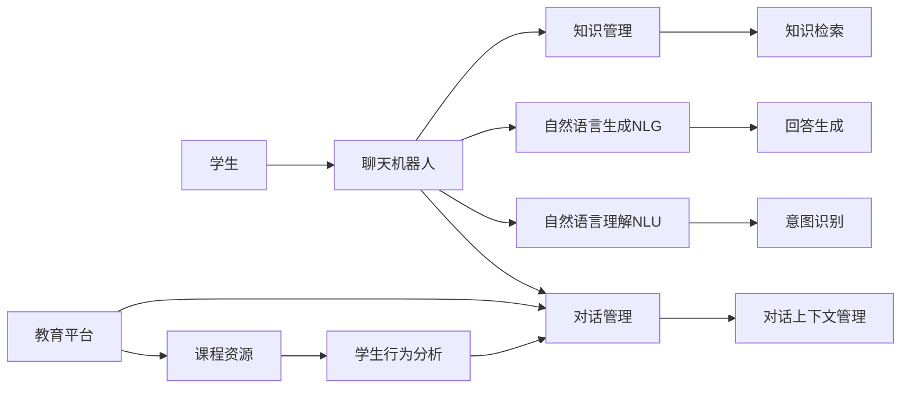

                 

## 1. 背景介绍

随着人工智能技术的飞速发展，聊天机器人（Chatbot）已经成为教育领域的一项重要工具。传统的教育模式受到时空限制，个性化学习和终身教育难以普及。而基于聊天机器人的个性化学习和终身教育平台，以数据驱动的方式，提供了更加灵活、高效的解决方案。

本节将首先介绍聊天机器人在教育中的应用背景，并阐述其重要性。

### 1.1 教育领域现状

传统的教育模式依赖于课堂教学、教科书和固定时间表，教育资源分配不均，难以满足个性化学习需求。即便在课后，教师也无法及时响应学生的问题。而对于终身教育，学生毕业后，与教育机构的联系便中断了。

人工智能技术，特别是聊天机器人技术，将重塑教育的面貌。通过智能化的互动和个性化推荐，聊天机器人能够弥补传统教育模式的缺陷，支持个性化学习和终身教育。

### 1.2 聊天机器人的应用优势

聊天机器人作为教育工具，具备以下优势：

- **个性化学习**：根据学生的学习进度、兴趣和能力，提供定制化的学习计划和资源。
- **终身学习**：学生随时随地可以与聊天机器人进行互动，获取新的知识和技能。
- **实时反馈**：聊天机器人可以即时反馈学生学习成果，及时纠正错误。
- **互动性强**：聊天机器人采用自然语言处理技术，与学生的交流更自然，互动性更强。

### 1.3 发展历程与趋势

近年来，聊天机器人技术在教育领域的应用经历了以下几个阶段：

- **第一阶段**：初期探索，多使用规则引擎，缺乏自适应能力。
- **第二阶段**：基于知识图谱的问答系统，可以回答固定问题，具备一定的自适应能力。
- **第三阶段**：基于深度学习的对话系统，可以处理更复杂对话场景，并具备一定的自学习能力。

未来，随着技术进步和数据积累，聊天机器人将在个性化学习和终身教育中发挥更加重要的作用。

## 2. 核心概念与联系

### 2.1 核心概念概述

在教育场景中，聊天机器人（Chatbot）可以定义为：一种基于自然语言处理（Natural Language Processing, NLP）技术的软件系统，通过与用户自然对话，提供个性化的学习和教育服务。

聊天机器人的核心能力包括：

- **自然语言理解（NLU）**：理解用户意图和上下文。
- **自然语言生成（NLG）**：生成符合用户需求的自然语言回答。
- **对话管理**：管理对话流程，确保对话连贯。
- **知识管理**：存储和管理知识库，支持知识检索和推理。

聊天机器人与教育相结合，产生了多种教育应用场景：

- **智能辅导**：通过自然语言交互，提供个性化辅导和习题解答。
- **在线答疑**：24小时不间断提供课后答疑服务，帮助学生解决学习中遇到的问题。
- **虚拟教室**：创建虚拟课堂环境，支持学生互动讨论，老师监控学习进度。
- **个性化推荐**：根据学生的学习行为，推荐相关课程和资源。

聊天机器人的核心概念和技术架构可以通过以下Mermaid流程图来展示：



这个流程图展示了聊天机器人与教育平台之间的数据和交互关系：

1. 学生与聊天机器人进行自然语言交互。
2. 聊天机器人利用NLU技术解析学生意图，并利用NLG技术生成回答。
3. 对话管理模块控制对话流程，确保对话连贯。
4. 知识管理模块负责知识库存储和管理。
5. 教育平台提供课程资源，支持知识检索和推荐。
6. 学生行为分析模块分析学习行为，生成个性化推荐。

这些核心概念和技术架构构成了聊天机器人教育变革的基础。

## 3. 核心算法原理 & 具体操作步骤

### 3.1 算法原理概述

基于聊天机器人的教育变革，本质上是一个数据驱动的学习过程。其核心算法包括自然语言理解（NLU）、自然语言生成（NLG）、对话管理、知识管理等。

本节将重点介绍聊天机器人教育中的核心算法原理，并给出具体操作步骤。

### 3.2 算法步骤详解

聊天机器人教育的核心算法步骤包括：

1. **数据准备**：收集和处理教育相关的文本数据，如课程教材、学生反馈等。
2. **模型训练**：使用深度学习模型训练自然语言理解和自然语言生成模块。
3. **知识库构建**：构建知识库，支持知识检索和推理。
4. **对话管理**：设计对话管理策略，确保对话连贯和高效。
5. **个性化推荐**：分析学生行为数据，生成个性化学习路径和资源推荐。

下面将详细介绍每个步骤的具体操作。

### 3.3 算法优缺点

聊天机器人教育算法具有以下优点：

- **灵活性高**：可以根据学生的学习进度和兴趣，提供个性化的学习计划和资源。
- **效率高**：支持24小时不间断交互，提高学习效率。
- **可扩展性强**：支持多用户并发，便于大规模部署。

同时，该算法也存在以下缺点：

- **数据依赖性强**：需要大量的教育相关数据，才能训练出高效的模型。
- **知识更新困难**：需要定期更新知识库，保持内容的时效性和准确性。
- **模型复杂度高**：深度学习模型的训练和推理需要较高的计算资源。

### 3.4 算法应用领域

聊天机器人教育算法在多个领域得到了广泛应用：

1. **K-12教育**：支持基础教育阶段的学习辅导和答疑。
2. **职业培训**：支持技能培训和专业知识的获取。
3. **高等教育**：支持复杂知识的理解和应用。
4. **语言学习**：支持多种语言的学习和口语练习。
5. **企业培训**：支持员工的职业发展和技能提升。

## 4. 数学模型和公式 & 详细讲解 & 举例说明

### 4.1 数学模型构建

在聊天机器人教育中，数学模型主要应用于自然语言理解（NLU）和自然语言生成（NLG）两个环节。

自然语言理解（NLU）的数学模型可以表示为：

$$
\text{NLU}(x) = \text{Intent}(x) + \text{Entities}(x)
$$

其中，$\text{Intent}(x)$表示输入文本的意图，$\text{Entities}(x)$表示文本中提及的实体。

自然语言生成（NLG）的数学模型可以表示为：

$$
\text{NLG}(y) = \text{Template}(y) + \text{LexicalChoice}(y)
$$

其中，$\text{Template}(y)$表示生成答案的模板，$\text{LexicalChoice}(y)$表示生成答案时词语的选择。

### 4.2 公式推导过程

下面以问答系统为例，推导自然语言理解和自然语言生成公式。

假设问答系统的输入为$x$，输出为$y$。自然语言理解模型的目标是将输入$x$转化为意图$\text{Intent}(x)$和实体$\text{Entities}(x)$。

使用序列标注模型进行意图识别：

$$
\text{Intent}(x) = \text{Seq2Seq}(x) + \text{Attention}(x)
$$

其中，$\text{Seq2Seq}$为序列到序列模型，$\text{Attention}$为注意力机制。

使用实体识别模型进行实体标注：

$$
\text{Entities}(x) = \text{CRF}(x)
$$

其中，$\text{CRF}$为条件随机场模型。

自然语言生成模型的目标是根据意图$\text{Intent}(x)$和实体$\text{Entities}(x)$，生成对应的答案$y$。

使用模板匹配模型进行回答生成：

$$
\text{NLG}(y) = \text{TemplateMatch}(\text{Intent}(x), \text{Entities}(x))
$$

其中，$\text{TemplateMatch}$为模板匹配模型。

### 4.3 案例分析与讲解

以下是一个聊天机器人教育系统对学生问题进行意图识别和实体标注的示例：

假设学生的输入为：

$$
x = \text{"请帮我解释一下牛顿第二定律"}
$$

首先，自然语言理解模块进行意图识别：

$$
\text{Intent}(x) = \text{Seq2Seq}(x) + \text{Attention}(x) = \text{"解释"}
$$

然后，自然语言理解模块进行实体标注：

$$
\text{Entities}(x) = \text{CRF}(x) = \text{"牛顿第二定律"}
$$

最后，自然语言生成模块根据意图和实体生成回答：

$$
\text{NLG}(y) = \text{TemplateMatch}(\text{Intent}(x), \text{Entities}(x)) = \text{"牛顿第二定律的公式为F=ma"}
$$

整个系统通过上述数学模型，完成了意图识别、实体标注和回答生成的过程。

## 5. 项目实践：代码实例和详细解释说明

### 5.1 开发环境搭建

以下是搭建聊天机器人教育系统的开发环境：

1. **Python环境配置**：安装Python 3.8，并配置虚拟环境。
2. **深度学习框架安装**：安装PyTorch、TensorFlow等深度学习框架。
3. **自然语言处理库安装**：安装NLTK、SpaCy等自然语言处理库。
4. **知识管理库安装**：安装Scikit-learn等知识管理库。
5. **Web框架安装**：安装Flask、Django等Web框架。

### 5.2 源代码详细实现

下面以一个简单的聊天机器人系统为例，展示代码实现：

```python
import torch
from transformers import BertForQuestionAnswering, BertTokenizer
from flask import Flask, request, jsonify

app = Flask(__name__)

# 初始化Bert模型和分词器
model = BertForQuestionAnswering.from_pretrained('bert-base-uncased')
tokenizer = BertTokenizer.from_pretrained('bert-base-uncased')

@app.route('/qa', methods=['POST'])
def qa():
    data = request.get_json()
    question = data['question']
    context = data['context']
    inputs = tokenizer(question=question, context=context, return_tensors='pt')
    outputs = model(**inputs)
    start_logits, end_logits = outputs.start_logits, outputs.end_logits
    start_idx, end_idx = start_logits.argmax(), end_logits.argmax()
    answer = tokenizer.decode(inputs['input_ids'][0][start_idx:end_idx+1])
    return jsonify({'answer': answer})

if __name__ == '__main__':
    app.run(debug=True)
```

### 5.3 代码解读与分析

该代码展示了如何使用PyTorch和Flask实现一个简单的问答系统：

1. **模型加载**：使用BertForQuestionAnswering和BertTokenizer加载预训练的BERT模型。
2. **API设计**：定义一个`/qa`接口，接收`question`和`context`两个参数。
3. **数据预处理**：将问题和上下文进行分词，转换为模型所需的输入。
4. **模型推理**：将输入数据送入模型进行推理，得到开始位置和结束位置的概率。
5. **结果生成**：根据开始位置和结束位置，生成答案文本。
6. **接口返回**：将答案文本作为JSON格式返回。

通过上述代码，我们实现了问答系统的基础功能。

### 5.4 运行结果展示

运行上述代码后，可以通过Postman或其他工具发送测试请求，获取答案文本。

## 6. 实际应用场景

### 6.1 智能辅导

智能辅导系统可以实时回答学生在学习中遇到的问题，提供个性化辅导。

例如，学生在数学课程中遇到难以理解的问题，可以向智能辅导系统提出询问：

$$
x = \text{"为什么平方根的平方等于原数"}
$$

系统进行意图识别和实体标注，并生成回答：

$$
\text{Intent}(x) = \text{Seq2Seq}(x) + \text{Attention}(x) = \text{"解释"}
$$

$$
\text{Entities}(x) = \text{CRF}(x) = \text{"平方根"}
$$

系统生成的回答为：

$$
\text{NLG}(y) = \text{TemplateMatch}(\text{Intent}(x), \text{Entities}(x)) = \text{"平方根的平方等于原数，因为平方根是原数的开平方，开平方两次后即恢复原数"}
$$

### 6.2 在线答疑

在线答疑系统可以24小时不间断提供课后答疑服务，帮助学生解决学习中遇到的问题。

例如，学生在课后提出问题：

$$
x = \text{"我需要理解时间复杂度的概念"}
$$

系统进行意图识别和实体标注，并生成回答：

$$
\text{Intent}(x) = \text{Seq2Seq}(x) + \text{Attention}(x) = \text{"解释"}
$$

$$
\text{Entities}(x) = \text{CRF}(x) = \text{"时间复杂度"}
$$

系统生成的回答为：

$$
\text{NLG}(y) = \text{TemplateMatch}(\text{Intent}(x), \text{Entities}(x)) = \text{"时间复杂度是衡量算法执行效率的指标，表示算法执行时间与问题规模的增长关系"}
$$

### 6.3 虚拟教室

虚拟教室系统可以创建虚拟课堂环境，支持学生互动讨论，老师监控学习进度。

例如，学生在虚拟教室中提出问题：

$$
x = \text{"Python中如何使用循环结构"}
$$

系统进行意图识别和实体标注，并生成回答：

$$
\text{Intent}(x) = \text{Seq2Seq}(x) + \text{Attention}(x) = \text{"说明"}
$$

$$
\text{Entities}(x) = \text{CRF}(x) = \text{"循环结构"}
$$

系统生成的回答为：

$$
\text{NLG}(y) = \text{TemplateMatch}(\text{Intent}(x), \text{Entities}(x)) = \text{"Python中使用for循环和while循环可以实现循环结构"}
$$

### 6.4 未来应用展望

未来，聊天机器人教育将有以下几个发展趋势：

1. **深度学习应用更广泛**：更多深度学习技术将被应用于自然语言理解、自然语言生成、对话管理等环节，提升系统性能。
2. **个性化推荐更精准**：基于用户行为数据，生成更加个性化和符合用户需求的学习路径和资源推荐。
3. **跨领域知识管理**：将不同领域知识库进行整合，支持跨领域知识的检索和应用。
4. **多模态交互**：支持语音、图像等多模态输入和输出，提升用户体验。
5. **情感分析**：引入情感分析技术，识别用户情感状态，提供更加个性化的服务。

## 7. 工具和资源推荐

### 7.1 学习资源推荐

为了帮助开发者系统掌握聊天机器人教育技术，这里推荐一些优质的学习资源：

1. **《深度学习》系列课程**：斯坦福大学李飞飞教授的深度学习课程，涵盖了深度学习的基本概念和前沿技术。
2. **《自然语言处理》教材**：北京大学自然语言处理教材，介绍了NLP的基本原理和经典模型。
3. **《Python自然语言处理》书籍**：介绍了Python在NLP中的应用，包括文本处理、情感分析等。
4. **《Chatbot实战》系列书籍**：介绍了聊天机器人的开发流程和实战技巧，适合有一定编程基础的读者。

通过这些学习资源，相信你一定能够快速掌握聊天机器人教育技术的精髓，并用于解决实际的NLP问题。

### 7.2 开发工具推荐

以下是几款用于聊天机器人教育开发的常用工具：

1. **Python**：简单易用的编程语言，支持深度学习框架和自然语言处理库的安装。
2. **PyTorch**：深度学习框架，支持动态图和静态图两种计算图模式。
3. **TensorFlow**：由Google主导开发的深度学习框架，生产部署方便，支持大规模工程应用。
4. **NLTK**：自然语言处理工具包，提供分词、词性标注等基本功能。
5. **SpaCy**：自然语言处理库，支持高效的文本处理和分析。
6. **Flask**：轻量级的Web框架，支持快速的API开发和部署。

合理利用这些工具，可以显著提升聊天机器人教育系统的开发效率，加快创新迭代的步伐。

### 7.3 相关论文推荐

聊天机器人教育技术的发展源于学界的持续研究。以下是几篇奠基性的相关论文，推荐阅读：

1. **Attention is All You Need**：提出Transformer结构，开启了NLP领域的预训练大模型时代。
2. **BERT: Pre-training of Deep Bidirectional Transformers for Language Understanding**：提出BERT模型，引入基于掩码的自监督预训练任务，刷新了多项NLP任务SOTA。
3. **Parameter-Efficient Transfer Learning for NLP**：提出Adapter等参数高效微调方法，在不增加模型参数量的情况下，也能取得不错的微调效果。
4. **Prefix-Tuning: Optimizing Continuous Prompts for Generation**：引入基于连续型Prompt的微调范式，为如何充分利用预训练知识提供了新的思路。

这些论文代表了大语言模型微调技术的发展脉络。通过学习这些前沿成果，可以帮助研究者把握学科前进方向，激发更多的创新灵感。

## 8. 总结：未来发展趋势与挑战

### 8.1 总结

本文对聊天机器人教育变革进行了全面系统的介绍。首先阐述了聊天机器人在教育中的应用背景和重要性，明确了其对于个性化学习和终身教育的独特价值。其次，从原理到实践，详细讲解了聊天机器人教育的核心算法，并给出了具体操作步骤。同时，本文还探讨了聊天机器人教育在多个行业领域的应用前景，展示了其广阔的发展空间。最后，本文精选了聊天机器人教育技术的各类学习资源，力求为读者提供全方位的技术指引。

通过本文的系统梳理，可以看到，聊天机器人教育技术正在成为教育领域的重要工具，极大地提升了学习的灵活性和高效性。未来，随着技术的不断进步和应用场景的拓展，聊天机器人教育必将在更多领域发挥重要作用，推动教育事业的变革。

### 8.2 未来发展趋势

展望未来，聊天机器人教育技术将呈现以下几个发展趋势：

1. **深度学习应用更广泛**：更多深度学习技术将被应用于自然语言理解、自然语言生成、对话管理等环节，提升系统性能。
2. **个性化推荐更精准**：基于用户行为数据，生成更加个性化和符合用户需求的学习路径和资源推荐。
3. **跨领域知识管理**：将不同领域知识库进行整合，支持跨领域知识的检索和应用。
4. **多模态交互**：支持语音、图像等多模态输入和输出，提升用户体验。
5. **情感分析**：引入情感分析技术，识别用户情感状态，提供更加个性化的服务。

### 8.3 面临的挑战

尽管聊天机器人教育技术已经取得了显著进展，但在迈向更加智能化、普适化应用的过程中，仍面临诸多挑战：

1. **数据依赖性强**：需要大量的教育相关数据，才能训练出高效的模型。
2. **知识更新困难**：需要定期更新知识库，保持内容的时效性和准确性。
3. **模型复杂度高**：深度学习模型的训练和推理需要较高的计算资源。
4. **安全性问题**：用户数据隐私和安全问题需要高度重视，确保数据和模型安全。
5. **伦理道德问题**：聊天机器人需要遵守伦理道德，避免有害信息输出。

### 8.4 研究展望

面对聊天机器人教育技术所面临的挑战，未来的研究需要在以下几个方面寻求新的突破：

1. **无监督和半监督学习**：探索无监督和半监督学习范式，降低对标注数据的依赖。
2. **多模态交互**：开发多模态交互技术，支持语音、图像等多模态输入和输出。
3. **个性化推荐**：研究更加高效和精准的个性化推荐算法，提升推荐效果。
4. **情感分析**：引入情感分析技术，提高聊天机器人的情感理解和反应能力。
5. **跨领域知识管理**：研究跨领域知识管理技术，支持知识整合和应用。

这些研究方向的探索，将推动聊天机器人教育技术的进一步发展和应用，为教育事业带来深远影响。相信随着技术的不断进步和应用场景的拓展，聊天机器人教育必将在更多领域发挥重要作用，推动教育事业的变革。

## 9. 附录：常见问题与解答

**Q1：如何处理聊天机器人教育中的多模态交互问题？**

A: 多模态交互问题是聊天机器人教育中一个重要挑战。解决该问题，可以采用以下策略：

1. **融合多种数据源**：将文本、图像、语音等多种数据源进行融合，提升系统性能。
2. **多模态推理**：引入多模态推理技术，结合不同模态的信息进行综合分析。
3. **多模态表示学习**：使用深度学习模型，学习多种模态数据的联合表示，提升交互效果。

通过这些策略，可以实现更加高效和智能的多模态交互。

**Q2：聊天机器人教育系统如何保证数据隐私和安全？**

A: 数据隐私和安全是聊天机器人教育系统需要高度重视的问题。以下是一些解决方案：

1. **数据加密**：使用数据加密技术，保护用户数据隐私。
2. **匿名化处理**：对用户数据进行匿名化处理，保护用户隐私。
3. **访问控制**：设置严格的访问控制机制，限制数据访问权限。
4. **安全审计**：定期进行安全审计，及时发现和修复安全漏洞。
5. **隐私保护算法**：引入隐私保护算法，如差分隐私，保护用户隐私。

通过这些措施，可以有效地保护聊天机器人教育系统的数据隐私和安全。

**Q3：如何提高聊天机器人教育的个性化推荐效果？**

A: 个性化推荐是聊天机器人教育系统的核心功能之一。以下是一些提高个性化推荐效果的策略：

1. **用户行为分析**：深入分析用户的学习行为，生成个性化学习路径。
2. **知识图谱构建**：构建知识图谱，支持复杂知识的检索和推荐。
3. **协同过滤**：引入协同过滤技术，推荐与用户兴趣相近的学习资源。
4. **深度学习**：使用深度学习模型，学习用户和内容的关联关系，提升推荐效果。
5. **多目标优化**：引入多目标优化算法，平衡推荐效果和系统资源消耗。

通过这些策略，可以显著提高聊天机器人教育的个性化推荐效果。

**Q4：聊天机器人教育系统如何处理歧义性问题？**

A: 歧义性问题是聊天机器人教育系统常见的挑战之一。解决该问题，可以采用以下策略：

1. **意图识别**：使用意图识别技术，解析用户的意图和上下文，避免歧义。
2. **多轮对话**：引入多轮对话机制，逐步澄清用户意图。
3. **上下文管理**：设计上下文管理策略，保持对话连贯和一致。
4. **人工干预**：引入人工干预机制，及时纠正模型输出。
5. **反馈机制**：设计反馈机制，收集用户反馈，持续优化系统性能。

通过这些策略，可以有效处理聊天机器人教育系统中的歧义性问题。

**Q5：聊天机器人教育系统如何处理情感分析问题？**

A: 情感分析是聊天机器人教育系统中另一个重要功能。以下是一些解决情感分析问题的策略：

1. **情感词典**：使用情感词典，识别用户情感状态。
2. **深度学习**：使用深度学习模型，学习情感分类任务。
3. **多模态分析**：结合语音、图像等多模态信息，提升情感分析效果。
4. **情感反馈**：设计情感反馈机制，及时调整聊天机器人输出。
5. **用户监督**：引入用户监督机制，提高情感分析模型的鲁棒性。

通过这些策略，可以有效地解决聊天机器人教育系统中的情感分析问题。

---

作者：禅与计算机程序设计艺术 / Zen and the Art of Computer Programming

