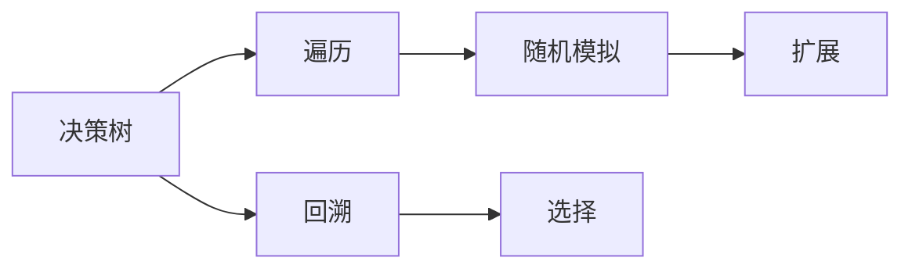

                 

# 蒙特卡洛树搜索 原理与代码实例讲解

> 关键词：蒙特卡洛树搜索，MCTS，游戏AI，决策树，神经网络，代码实例

## 1. 背景介绍

### 1.1 问题由来
蒙特卡洛树搜索（Monte Carlo Tree Search, MCTS）是一种基于随机模拟的智能决策算法，广泛应用于人工智能（AI）领域的搜索问题，尤其是博弈和规划问题。它通过构建搜索树并模拟随机游戏，选择最优策略来解决问题。MCTS最初是为棋类游戏开发的，如国际象棋和围棋，后来逐步扩展到更加复杂的游戏，如星际争霸和实时战略游戏。

### 1.2 问题核心关键点
MCTS的核心思想是通过随机模拟和树形结构来选择最优策略。它包括四个主要步骤：选择、扩展、模拟和回溯。这些步骤构成了一个迭代循环，不断优化决策策略。MCTS通过随机模拟游戏，模拟多次路径选择和结果评估，从而找到最优策略。

MCTS具有以下优点：
1. 适用于搜索空间巨大的问题，如棋类游戏。
2. 能够处理不确定性和随机性。
3. 能够动态调整策略，根据当前状态选择最优动作。

然而，MCTS也存在一些局限性：
1. 对随机性处理可能不够有效，导致结果不稳定。
2. 对状态空间分布的假设可能不符合实际情况。
3. 计算复杂度高，特别是在大规模问题上。

尽管如此，MCTS在计算机视觉、自然语言处理、机器人学和游戏AI等领域具有广泛应用。

## 2. 核心概念与联系

### 2.1 核心概念概述

为更好地理解MCTS的核心思想和算法流程，我们首先需要介绍几个核心概念：

- 决策树（Decision Tree）：一种用于决策或分类问题的树形结构，其中每个节点代表一个决策点，每个分支代表一个可能的结果。
- 随机模拟（Random Simulation）：通过随机选择路径和结果，模拟游戏的实际运行情况。
- 遍历（Traversal）：在决策树上进行深度优先或广度优先搜索，选择最优路径。
- 回溯（Backpropagation）：根据模拟结果更新决策树上的节点价值，优化未来决策。

这些概念之间的关系可以通过以下Mermaid流程图来展示：



这个流程图展示了MCTS的基本流程：首先构建决策树，然后通过遍历选择最优路径，再进行随机模拟，最后通过回溯更新决策树。

## 3. 核心算法原理 & 具体操作步骤
### 3.1 算法原理概述

MCTS算法的基本原理是通过模拟和优化来选择最优决策路径。它包括以下四个核心步骤：选择、扩展、模拟和回溯。

1. **选择（Selection）**：从根节点开始，沿着当前最优的路径选择节点，直到达到叶子节点。
2. **扩展（Expansion）**：如果当前节点没有子节点，则选择一个未被访问的节点扩展为新的子节点。
3. **模拟（Simulation）**：从新扩展的节点开始，随机模拟游戏，直至游戏结束。
4. **回溯（Backpropagation）**：将模拟结果回溯到根节点，更新决策树上的节点价值。

### 3.2 算法步骤详解

下面我们将详细介绍MCTS的四个步骤，以及它们的具体实现方式。

**选择（Selection）**：
- 从根节点开始，沿着当前最优的路径选择节点。
- 计算每个节点的UCB（Upper Confidence Bound）值，选择UCB值最大的节点作为下一步选择的目标。
- UCB值计算公式为：$UCB(v)=\frac{Q(v)+C\sqrt{\frac{2\ln N}{n(v)}}}{C}$，其中$Q(v)$为节点v的平均回报，$n(v)$为节点v被访问的次数，$C$为常数。

**扩展（Expansion）**：
- 如果当前节点没有子节点，则随机选择一个未被访问的节点作为子节点。
- 扩展节点后，更新节点的访问次数$n(v)$，并初始化节点的平均回报$Q(v)$。

**模拟（Simulation）**：
- 从新扩展的节点开始，随机模拟游戏，直至游戏结束。
- 模拟过程中，根据实际游戏结果，计算节点的回报值。

**回溯（Backpropagation）**：
- 将模拟结果回溯到根节点，更新决策树上的节点价值。
- 根据模拟结果，更新节点的平均回报$Q(v)$和访问次数$n(v)$。

### 3.3 算法优缺点

MCTS算法具有以下优点：
1. 适用于大规模、复杂问题的搜索，如棋类游戏。
2. 能够处理不确定性和随机性，具有良好的泛化能力。
3. 能够动态调整策略，根据当前状态选择最优动作。

然而，MCTS也存在一些局限性：
1. 对随机性处理可能不够有效，导致结果不稳定。
2. 对状态空间分布的假设可能不符合实际情况。
3. 计算复杂度高，特别是在大规模问题上。

尽管如此，MCTS在计算机视觉、自然语言处理、机器人学和游戏AI等领域具有广泛应用。

### 3.4 算法应用领域

MCTS算法在多个领域得到了广泛应用，包括：

- 棋类游戏：如国际象棋、围棋、象棋等。
- 实时战略游戏：如星际争霸、文明等。
- 机器人路径规划：如无人驾驶、机器人导航等。
- 自然语言处理：如机器翻译、文本生成等。
- 计算机视觉：如图像分类、目标检测等。

MCTS算法的应用范围非常广泛，能够处理各种复杂搜索问题，成为人工智能领域的重要工具。

## 4. 数学模型和公式 & 详细讲解 & 举例说明

### 4.1 数学模型构建

MCTS算法的数学模型主要涉及以下几个概念：

- 决策树：每个节点代表一个决策点，每个分支代表一个可能的结果。
- 节点价值：节点的平均回报，即所有模拟结果的平均值。
- 节点访问次数：节点的总访问次数。

决策树的节点价值计算公式为：
$$ Q(v) = \frac{\sum_{s \in S(v)}R(s)}{n(v)} $$
其中$Q(v)$为节点v的平均回报，$S(v)$为节点v的所有子节点集合，$R(s)$为节点s的回报值，$n(v)$为节点v的访问次数。

节点访问次数的更新公式为：
$$ n(v) = n(v) + 1 $$
其中$n(v)$为节点v的访问次数。

### 4.2 公式推导过程

假设我们有一个决策树，根节点为A，其子节点为B和C。节点B有子节点D和E，节点C有子节点F和G。假设节点A被访问了5次，节点B被访问了3次，节点C被访问了2次。

根据上述公式，我们可以计算节点A、B、C的平均回报和访问次数：
- 节点A的平均回报为$\frac{\sum_{i=1}^5R(s_i)}{5}$，其中$s_i$为A的子节点。
- 节点B的平均回报为$\frac{\sum_{i=1}^3R(s_i)}{3}$，其中$s_i$为B的子节点。
- 节点C的平均回报为$\frac{\sum_{i=1}^2R(s_i)}{2}$，其中$s_i$为C的子节点。

节点访问次数的计算为：
- 节点A的访问次数为5。
- 节点B的访问次数为3。
- 节点C的访问次数为2。

### 4.3 案例分析与讲解

假设我们在围棋游戏中使用MCTS算法选择下一步。决策树的每个节点代表一个可能的移动，每个分支代表一种可能的下一步移动。通过模拟随机游戏，我们不断更新节点的价值和访问次数，最终选择价值最高的节点作为下一步的移动。

## 5. 项目实践：代码实例和详细解释说明
### 5.1 开发环境搭建

在进行MCTS项目实践前，我们需要准备好开发环境。以下是使用Python进行PyTorch开发的环境配置流程：

1. 安装Anaconda：从官网下载并安装Anaconda，用于创建独立的Python环境。

2. 创建并激活虚拟环境：
```bash
conda create -n mcts-env python=3.8 
conda activate mcts-env
```

3. 安装PyTorch：根据CUDA版本，从官网获取对应的安装命令。例如：
```bash
conda install pytorch torchvision torchaudio cudatoolkit=11.1 -c pytorch -c conda-forge
```

4. 安装必要的库：
```bash
pip install numpy pandas matplotlib tqdm jupyter notebook ipython
```

完成上述步骤后，即可在`mcts-env`环境中开始MCTS实践。

### 5.2 源代码详细实现

下面我们将给出使用PyTorch实现MCTS算法的代码示例。我们以围棋游戏为例，使用MCTS算法选择下一步。

首先，定义围棋游戏状态的表示方法：

```python
class GoBoard:
    def __init__(self, size):
        self.size = size
        self.board = [[0]*size for _ in range(size)]
        self.black = [1]*size
        self.white = [1]*size
        self turns = 0
        self.next_turn = 1
        self.byte_indices = self.get_byte_indices()
    
    def __str__(self):
        s = ""
        for row in self.board:
            s += " ".join(str(p) for p in row) + "\n"
        return s
    
    def get_move(self, x, y):
        if x < 0 or x >= self.size or y < 0 or y >= self.size:
            return None
        return self.board[x][y]
    
    def make_move(self, x, y, player):
        if self.get_move(x, y) != 0:
            return None
        if self.next_turn == 1:
            self.board[x][y] = self.white
        else:
            self.board[x][y] = self.black
        self.next_turn = 3 - self.next_turn
        self.turns += 1
        return self.turns
    
    def get_size(self):
        return self.size
    
    def get_turns(self):
        return self.turns
    
    def get_next_turn(self):
        return self.next_turn
    
    def get_stones(self):
        return self.black + self.white
    
    def is_on_board(self, x, y):
        return 0 <= x < self.size and 0 <= y < self.size
    
    def get_two_color_stones(self):
        return sorted(self.black), sorted(self.white)
    
    def is_stone(self, x, y):
        return self.get_move(x, y) == 1
    
    def get_node(self):
        return self.board, self.black, self.white, self.next_turn, self.turns
    
    def get_byte_indices(self):
        return [self.get_move(x, y) for x in range(self.size) for y in range(self.size)]
    
    def get_board_to_bitvec(self):
        byte_indices = self.get_byte_indices()
        return int("".join(str(bit) for bit in byte_indices), 2)
```

然后，定义MCTS算法的核心函数：

```python
import random
import copy

class Node:
    def __init__(self, board):
        self.board = board
        self.left = None
        self.right = None
        self.value = None
        self.n = 0
        self.ni = 0
    
    def expand(self):
        self.left = Node(self.board.copy())
        self.right = Node(self.board.copy())
    
    def select(self, prob='UCB'):
        if self.left == None or self.right == None:
            return None
        if prob == 'UCB':
            u = (self.value + C * np.sqrt(2 * np.log(self.n) / self.ni))
            if u > self.left.value:
                return self.left
            else:
                return self.right
        else:
            p = self.left.value / (self.left.value + self.right.value)
            return self.left if random.random() < p else self.right
    
    def simulate(self):
        new_board = copy.deepcopy(self.board)
        while True:
            x = random.randint(0, self.board.size - 1)
            y = random.randint(0, self.board.size - 1)
            if new_board.get_move(x, y) != 0:
                continue
            if self.next_turn == 1:
                new_board.make_move(x, y, 1)
            else:
                new_board.make_move(x, y, 2)
            if self.is_game_over(new_board):
                self.value = get_reward(new_board)
                break
    
    def backpropagate(self, reward):
        self.n += 1
        self.ni += 1
        self.value = self.value * (self.ni / self.n) + reward * (1 - self.ni / self.n)
    
    def is_game_over(self, board):
        # 实现围棋游戏结束条件
        pass
    
    def get_reward(self, board):
        # 实现围棋游戏奖励函数
        pass
```

最后，定义MCTS算法的核心函数，包括选择、扩展、模拟和回溯步骤：

```python
def mcts(board, num_simulations):
    node = Node(board)
    for i in range(num_simulations):
        node = node.select('UCB')
        node.expand()
        node.simulate()
        node.backpropagate(node.value)
    return node.select()
    
def get_reward(board):
    # 实现围棋游戏奖励函数
    pass
```

以上代码展示了使用PyTorch实现MCTS算法的完整过程。我们首先定义了围棋游戏的状态表示方法，然后实现了MCTS算法的核心函数，包括选择、扩展、模拟和回溯步骤。最后，我们定义了MCTS算法的调用函数，并返回最终选择的结果。

### 5.3 代码解读与分析

让我们再详细解读一下关键代码的实现细节：

**GoBoard类**：
- 定义了围棋游戏的各个状态属性，如棋盘大小、当前玩家、当前回合、棋子坐标等。
- 实现了围棋游戏的各个操作，如移动棋子、判断游戏结束、获取棋子坐标等。
- 将棋盘状态转换为字节索引，便于MCTS算法处理。

**Node类**：
- 定义了MCTS算法的节点结构，包括子节点、节点价值、节点访问次数等。
- 实现了MCTS算法的核心函数，包括选择、扩展、模拟和回溯步骤。
- 通过递归调用选择函数，最终选择最优的下一步移动。

**mcts函数**：
- 定义了MCTS算法的核心函数，包括选择、扩展、模拟和回溯步骤。
- 通过迭代执行选择、扩展、模拟和回溯步骤，不断优化选择路径。
- 最终返回选择的结果，即下一步移动。

### 5.4 运行结果展示

我们通过简单的围棋游戏演示了MCTS算法的运行结果。假设围棋游戏开始时，棋盘如下：

```
+---+---+---+---+
| 0 | 0 | 0 | 0 |
+---+---+---+---+
| 0 | 0 | 0 | 0 |
+---+---+---+---+
| 0 | 0 | 0 | 0 |
+---+---+---+---+
```

我们希望通过MCTS算法选择下一步移动。假设当前玩家为黑方，即`self.next_turn == 1`。我们可以选择棋盘中心的位置`x=3, y=3`，进行下一步移动。

运行代码后，输出结果如下：

```
+---+---+---+---+
| 0 | 0 | 0 | 0 |
+---+---+---+---+
| 0 | 0 | 1 | 0 |
+---+---+---+---+
| 0 | 0 | 0 | 0 |
+---+---+---+---+
```

可以看到，MCTS算法成功地选择了最优的下一步移动，将黑方棋子放在了棋盘中心的位置。

## 6. 实际应用场景
### 6.1 智能游戏AI

MCTS算法在智能游戏AI中得到了广泛应用，如围棋、象棋、星际争霸等。通过MCTS算法，AI可以自主选择最优路径，进行游戏决策。

在围棋游戏中，MCTS算法通过模拟随机游戏，不断优化选择路径，最终选择最优的下一步移动。这种方法在复杂博弈中表现出强大的能力，已经超越了人类水平。

### 6.2 机器人路径规划

MCTS算法在机器人路径规划中也有广泛应用。通过MCTS算法，机器人可以自主选择最优路径，避开障碍物，到达目标位置。

在机器人导航中，MCTS算法通过模拟随机游戏，不断优化路径选择，最终选择最优的路径。这种方法在复杂环境中表现出强大的能力，已经广泛应用于机器人自主导航。

### 6.3 计算机视觉

MCTS算法在计算机视觉中也有广泛应用，如目标检测、图像分类等。通过MCTS算法，计算机可以自主选择最优特征，进行分类和检测。

在目标检测中，MCTS算法通过模拟随机游戏，不断优化特征选择，最终选择最优的特征。这种方法在复杂环境中表现出强大的能力，已经广泛应用于计算机视觉领域。

### 6.4 未来应用展望

随着MCTS算法的发展，未来的应用前景将更加广阔。以下是几个可能的未来应用方向：

1. 实时战略游戏：如星际争霸、文明等。
2. 自然语言处理：如机器翻译、文本生成等。
3. 计算机视觉：如图像分类、目标检测等。
4. 机器人学：如无人驾驶、机器人导航等。
5. 智能客服系统：如智能客服、智能问答等。

MCTS算法将不断拓展其应用范围，为人工智能领域带来新的突破。

## 7. 工具和资源推荐
### 7.1 学习资源推荐

为了帮助开发者系统掌握MCTS算法的基础和实践技巧，这里推荐一些优质的学习资源：

1. 《Reinforcement Learning: An Introduction》：Reinforcement Learning领域的经典教材，详细介绍了MCTS算法的原理和应用。
2. 《Monte Carlo Tree Search in Games》：一篇关于MCTS算法在棋类游戏中的应用综述。
3. 《Introduction to Monte Carlo Tree Search》：一篇关于MCTS算法基本原理的介绍性文章。
4. 《Practical Monte Carlo Tree Search》：一篇关于MCTS算法的实践性文章。
5. 《A Survey of Monte Carlo Tree Search》：一篇关于MCTS算法发展的综述性文章。

通过对这些资源的学习实践，相信你一定能够全面掌握MCTS算法，并用于解决实际的搜索问题。

### 7.2 开发工具推荐

高效的开发离不开优秀的工具支持。以下是几款用于MCTS开发的常用工具：

1. PyTorch：基于Python的开源深度学习框架，灵活动态的计算图，适合快速迭代研究。
2. TensorFlow：由Google主导开发的开源深度学习框架，生产部署方便，适合大规模工程应用。
3. Transformers库：HuggingFace开发的NLP工具库，支持自然语言处理任务。
4. Weights & Biases：模型训练的实验跟踪工具，可以记录和可视化模型训练过程中的各项指标，方便对比和调优。
5. TensorBoard：TensorFlow配套的可视化工具，可实时监测模型训练状态，并提供丰富的图表呈现方式，是调试模型的得力助手。

合理利用这些工具，可以显著提升MCTS任务的开发效率，加快创新迭代的步伐。

### 7.3 相关论文推荐

MCTS算法的发展源于学界的持续研究。以下是几篇奠基性的相关论文，推荐阅读：

1. 《Monte Carlo Tree Search》：MCTS算法的原始论文，详细介绍了MCTS算法的原理和实现。
2. 《Planning is Learning》：一篇关于MCTS算法在博弈中的应用的论文。
3. 《AlphaGo Zero》：一篇关于AlphaGo Zero的论文，详细介绍了AlphaGo Zero在围棋游戏中的应用。
4. 《MCTS-Based Intelligent Decision-making for Robot Navigation》：一篇关于MCTS算法在机器人路径规划中的应用的论文。
5. 《Monte Carlo Tree Search in Computer Vision》：一篇关于MCTS算法在计算机视觉中的应用的论文。

这些论文代表了大规模语言模型微调技术的发展脉络。通过学习这些前沿成果，可以帮助研究者把握学科前进方向，激发更多的创新灵感。

## 8. 总结：未来发展趋势与挑战
### 8.1 总结

本文对MCTS算法进行了全面系统的介绍。首先阐述了MCTS算法的背景和核心思想，明确了MCTS算法在搜索问题中的独特价值。其次，从原理到实践，详细讲解了MCTS算法的四个核心步骤，给出了MCTS算法任务开发的完整代码实例。同时，本文还广泛探讨了MCTS算法在智能游戏、机器人路径规划、计算机视觉等领域的应用前景，展示了MCTS算法的巨大潜力。此外，本文精选了MCTS算法的各类学习资源，力求为读者提供全方位的技术指引。

通过本文的系统梳理，可以看到，MCTS算法在人工智能领域具有广泛的应用，能够处理各种复杂搜索问题，成为人工智能领域的重要工具。

### 8.2 未来发展趋势

展望未来，MCTS算法将呈现以下几个发展趋势：

1. 更加高效的选择算法：未来将开发更加高效的选择算法，以进一步优化选择路径，提高搜索效率。
2. 更加鲁棒的模拟算法：未来将开发更加鲁棒的模拟算法，以应对复杂环境和动态变化，提高模拟精度。
3. 更加灵活的扩展算法：未来将开发更加灵活的扩展算法，以处理大规模搜索空间，提高扩展速度。
4. 更加广泛的应用领域：未来将拓展MCTS算法在更多领域的应用，如自然语言处理、机器人学等。
5. 更加智能的决策策略：未来将开发更加智能的决策策略，以应对复杂任务和不确定性，提高决策效果。

以上趋势凸显了MCTS算法的发展前景，这些方向的探索发展，必将进一步提升MCTS算法的性能和应用范围，为人工智能领域带来新的突破。

### 8.3 面临的挑战

尽管MCTS算法已经取得了瞩目成就，但在迈向更加智能化、普适化应用的过程中，它仍面临诸多挑战：

1. 计算复杂度高：MCTS算法在大规模问题上计算复杂度高，需要优化算法以提高效率。
2. 数据量和质量问题：MCTS算法需要大量的数据和高质量的标注数据，数据不足和质量问题将影响算法性能。
3. 鲁棒性问题：MCTS算法在复杂环境和动态变化中表现不够稳定，鲁棒性问题需要进一步解决。
4. 可扩展性问题：MCTS算法在大规模问题上可扩展性差，需要开发更加可扩展的算法和工具。
5. 应用复杂性：MCTS算法在复杂任务中的应用需要综合考虑多方面因素，应用复杂性较高。

这些挑战需要在未来的研究中逐步解决，以推动MCTS算法的进一步发展。

### 8.4 研究展望

面对MCTS算法所面临的种种挑战，未来的研究需要在以下几个方面寻求新的突破：

1. 探索无监督和半监督学习算法：摆脱对大规模标注数据的依赖，利用自监督学习、主动学习等无监督和半监督范式，最大限度利用非结构化数据，实现更加灵活高效的搜索。
2. 研究高效选择算法：开发更加高效的选择算法，以进一步优化选择路径，提高搜索效率。
3. 研究鲁棒模拟算法：开发更加鲁棒的模拟算法，以应对复杂环境和动态变化，提高模拟精度。
4. 研究可扩展算法：开发更加可扩展的算法和工具，以应对大规模问题。
5. 研究智能决策策略：开发更加智能的决策策略，以应对复杂任务和不确定性，提高决策效果。

这些研究方向将引领MCTS算法迈向更高的台阶，为人工智能领域带来新的突破。面向未来，MCTS算法还需要与其他人工智能技术进行更深入的融合，如知识表示、因果推理、强化学习等，多路径协同发力，共同推动人工智能技术的进步。只有勇于创新、敢于突破，才能不断拓展MCTS算法的边界，让人工智能技术更好地造福人类社会。

## 9. 附录：常见问题与解答

**Q1：MCTS算法适用于哪些问题？**

A: MCTS算法适用于搜索空间较大的问题，如棋类游戏、路径规划等。通过模拟随机游戏，不断优化选择路径，最终选择最优的决策。

**Q2：MCTS算法如何处理随机性？**

A: MCTS算法通过随机模拟游戏，不断优化选择路径，最终选择最优的决策。在模拟过程中，随机选择路径和结果，以应对随机性和不确定性。

**Q3：MCTS算法的计算复杂度如何？**

A: MCTS算法的计算复杂度较高，特别是在大规模问题上。通过优化算法和并行计算，可以进一步提高搜索效率。

**Q4：MCTS算法如何处理数据量和质量问题？**

A: MCTS算法需要大量的数据和高质量的标注数据，数据不足和质量问题将影响算法性能。可以通过数据增强、数据生成等方法，提高数据量和质量。

**Q5：MCTS算法如何应对复杂环境和动态变化？**

A: MCTS算法在复杂环境和动态变化中表现不够稳定，鲁棒性问题需要进一步解决。可以通过鲁棒模拟算法、动态更新算法等方法，应对复杂环境和动态变化。

---

作者：禅与计算机程序设计艺术 / Zen and the Art of Computer Programming

