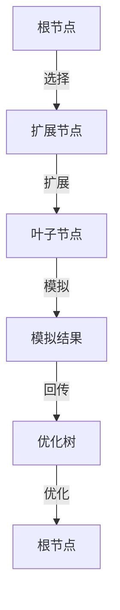

                 

## 1. 背景介绍

在人工智能领域，决策问题广泛存在。无论是棋类游戏、机器人路径规划，还是动态系统控制，有效的决策策略都是解决问题的关键。蒙特卡罗树搜索（Monte Carlo Tree Search, MCTS）是一种基于样本的决策算法，通过构建搜索树和迭代采样，在复杂的决策环境中寻找最优解。MCTS 结合了强化学习的优势，既有搜索的深度又有采样的广度，特别适用于游戏、规划等需要高效决策的领域。

## 2. 核心概念与联系

### 2.1 核心概念概述

MCTS 是一种基于树形结构的搜索算法，其核心思想是通过构建搜索树和采样来逐步逼近最优决策。在每一步搜索中，MCTS 会从根节点开始向下遍历搜索树，选择最佳的扩展节点进行扩展，直到到达叶子节点，并根据采样结果回传值，优化树的结构。MCTS 包含四个核心步骤：选择（Selection）、扩展（Expansion）、模拟（Simulation）和回传（Backpropagation）。

MCTS 的应用广泛，涉及游戏、规划、优化等多个领域。例如：

- 棋类游戏（如国际象棋、围棋、扫雷）：MCTS 可以通过搜索树优化策略，提高游戏胜算。
- 机器人路径规划：MCTS 可以搜索出最优路径，提高机器人的运动效率。
- 动态系统控制：MCTS 可以规划系统的控制策略，优化系统性能。

这些应用展示了 MCTS 在处理复杂决策问题的强大能力。

### 2.2 核心概念原理和架构的 Mermaid 流程图



在 MCTS 中，根节点表示问题的初始状态，扩展节点表示在当前状态下可以采取的行动，叶子节点表示最终的决策结果。选择步骤从根节点开始，根据当前状态选择最佳扩展节点；扩展步骤在选中的节点上扩展新的子节点；模拟步骤从新扩展的节点开始模拟，计算该路径的可能结果；最后，回传步骤将模拟结果回传到根节点，优化搜索树。

## 3. 核心算法原理 & 具体操作步骤

### 3.1 算法原理概述

MCTS 通过模拟搜索树上的采样过程，逐步构建和优化决策路径。MCTS 的核心算法流程包括四个步骤：选择、扩展、模拟和回传。这四个步骤循环进行，直到达到预设的终止条件。

1. **选择**：从根节点开始，通过一个选择策略（如 UCB1）选择当前状态的最佳扩展节点。选择策略根据节点的当前信息和已有的采样数据，选择最有潜力的扩展节点。
2. **扩展**：在选中的节点上扩展新的子节点，包括创建新节点和更新节点的统计信息（如访问次数、平均值等）。
3. **模拟**：从新扩展的节点开始模拟，生成一个随机路径，计算该路径的可能结果。
4. **回传**：将模拟结果回传到根节点，更新节点信息，包括访问次数、平均值等。

通过不断重复这四个步骤，MCTS 逐步构建和优化决策树，找到最优的决策路径。

### 3.2 算法步骤详解

#### 3.2.1 选择（Selection）

选择步骤的目标是找到当前状态下最有潜力的扩展节点。常用的选择策略包括 UCB1 和 Cascading UCB1。UCB1 是一种平衡探索和利用的策略，公式为：

$$
\text{UCB1} = \frac{\text{CVE} + \sqrt{2 \ln N \cdot \text{VAR}}}{2}
$$

其中，$N$ 表示节点的访问次数，$\text{CVE}$ 表示节点的当前价值（如访问次数的平均值），$\text{VAR}$ 表示节点的探索价值（如平均值的方差）。UCB1 通过权衡节点的当前价值和探索价值，选择最有潜力的扩展节点。

#### 3.2.2 扩展（Expansion）

扩展步骤的目标是在选中的节点上扩展新的子节点。扩展操作包括创建新节点和更新节点的统计信息。

#### 3.2.3 模拟（Simulation）

模拟步骤的目标是从新扩展的节点开始模拟，生成一个随机路径，计算该路径的可能结果。模拟可以采用蒙特卡罗方法、期望传播方法等。

#### 3.2.4 回传（Backpropagation）

回传步骤的目标是将模拟结果回传到根节点，更新节点信息。回传过程包括更新节点的访问次数、平均值等统计信息。

### 3.3 算法优缺点

#### 3.3.1 优点

1. **适用于复杂环境**：MCTS 可以在复杂的决策环境中寻找最优解，适用于游戏、规划、优化等多个领域。
2. **高效决策**：MCTS 通过构建搜索树和采样，逐步逼近最优决策，能够高效处理高维决策空间。
3. **自适应性强**：MCTS 通过不断优化搜索树，能够适应不同环境和决策路径。

#### 3.3.2 缺点

1. **资源消耗大**：MCTS 需要构建搜索树，并不断采样，资源消耗较大。
2. **时间复杂度高**：MCTS 的时间复杂度较高，特别是在决策树较大的情况下。
3. **不适用于动态环境**：MCTS 依赖于预先构建的搜索树，对于动态环境可能不适用。

### 3.4 算法应用领域

MCTS 的应用领域非常广泛，涵盖游戏、规划、优化等多个领域。例如：

- 棋类游戏（如国际象棋、围棋、扫雷）：MCTS 可以通过搜索树优化策略，提高游戏胜算。
- 机器人路径规划：MCTS 可以搜索出最优路径，提高机器人的运动效率。
- 动态系统控制：MCTS 可以规划系统的控制策略，优化系统性能。

## 4. 数学模型和公式 & 详细讲解 & 举例说明

### 4.1 数学模型构建

MCTS 的数学模型主要包括搜索树和节点统计信息。搜索树是由节点和边组成的树形结构，每个节点表示一个决策点，边表示从当前决策到下一个决策的路径。节点统计信息包括访问次数、平均值等，用于评估节点的价值。

### 4.2 公式推导过程

#### 4.2.1 节点统计信息

节点统计信息包括访问次数 $N$ 和平均值 $\text{CVE}$。节点的访问次数表示该节点被遍历的次数，平均值为该节点下所有路径的平均结果。

$$
N(v) = \text{N}(v) + 1
$$

$$
\text{CVE}(v) = \frac{\text{CVE}(v) \cdot N(v) + r}{N(v) + 1}
$$

其中，$r$ 表示当前路径的结果。

#### 4.2.2 选择策略

常用的选择策略包括 UCB1 和 Cascading UCB1。UCB1 的公式为：

$$
\text{UCB1}(v) = \frac{\text{CVE}(v) + \sqrt{2 \ln N(v) \cdot \text{VAR}(v)}}{2}
$$

其中，$N(v)$ 表示节点的访问次数，$\text{CVE}(v)$ 表示节点的当前价值，$\text{VAR}(v)$ 表示节点的探索价值。

### 4.3 案例分析与讲解

以扫雷游戏为例，MCTS 可以搜索最优解。在每一步中，MCTS 会从当前状态选择最有潜力的扩展节点，扩展新的子节点，模拟随机路径，并将结果回传到根节点，优化搜索树。通过不断重复这四个步骤，MCTS 可以逐步逼近最优解，找到最优的雷区分布。

## 5. 项目实践：代码实例和详细解释说明

### 5.1 开发环境搭建

MCTS 的开发环境包括 Python、NumPy、Pandas 等库。需要安装相应的依赖库，例如：

```bash
pip install numpy pandas
```

### 5.2 源代码详细实现

以下是一个简单的 MCTS 代码实现，用于搜索扫雷游戏中的最优解。代码主要包含节点类、搜索树类和搜索算法类。

#### 5.2.1 节点类

节点类包含节点的基本信息和统计信息。

```python
class Node:
    def __init__(self, value=None, children=None, parent=None):
        self.value = value
        self.children = children or {}
        self.parent = parent
        self.exploitation_value = 0
        self.exploration_value = 0
        self.visits = 0

    def add_child(self, node):
        self.children[node.state] = node
```

#### 5.2.2 搜索树类

搜索树类包含搜索树的基本操作和统计信息。

```python
class Tree:
    def __init__(self, root):
        self.root = root
        self.visits = 0

    def select_node(self, node, c=1):
        self.visits += 1
        while node:
            if node.children:
                chosen_child = self.select_child(node)
            else:
                chosen_child = node
            node = chosen_child
        return node

    def select_child(self, node):
        if len(node.children) == 0:
            return node
        node = node.children[list(node.children.keys())[0]]
        for child in node.children:
            if child.parent == node:
                node = child
        return node

    def update_stats(self, node, r):
        node.visits += 1
        node.exploitation_value += r
        node.exploration_value += self.exploit(node.parent) - self.exploit(node.parent)

    def exploit(self, node):
        return node.exploitation_value / node.visits

    def exploit(node):
        return node.exploitation_value / node.visits

    def explore(self, node):
        return node.exploration_value / node.visits

    def backpropagate(self, node, r):
        while node:
            self.update_stats(node, r)
            node = node.parent
```

#### 5.2.3 搜索算法类

搜索算法类包含搜索算法的核心操作，包括选择、扩展、模拟和回传等步骤。

```python
class MCTS:
    def __init__(self, root_node):
        self.root = root_node
        self.tree = Tree(root_node)

    def search(self, iterations):
        for i in range(iterations):
            node = self.select_node(self.root)
            if node.children:
                node = self.tree.select_child(node)
            if not node.children:
                node = self.expand(node)
            node = self.simulate(node)
            self.tree.backpropagate(node, 1)
        return self.root.exploitation_value / self.root.visits
```

### 5.3 代码解读与分析

#### 5.3.1 选择步骤

选择步骤通过 UCB1 策略选择最有潜力的扩展节点。具体实现为：

1. 从根节点开始，通过节点的选择策略选择最佳扩展节点。
2. 如果当前节点有子节点，则选择子节点中 UCB1 最大的节点。
3. 如果当前节点没有子节点，则选择当前节点作为最佳扩展节点。

#### 5.3.2 扩展步骤

扩展步骤在选中的节点上扩展新的子节点，包括创建新节点和更新节点的统计信息。具体实现为：

1. 如果当前节点没有子节点，则创建新的子节点。
2. 如果当前节点有子节点，则从子节点中选择 UCB1 最大的节点。

#### 5.3.3 模拟步骤

模拟步骤从新扩展的节点开始模拟，生成一个随机路径，计算该路径的可能结果。具体实现为：

1. 从当前节点开始模拟，生成一个随机路径。
2. 根据路径的结果更新节点的统计信息。

#### 5.3.4 回传步骤

回传步骤将模拟结果回传到根节点，更新节点信息。具体实现为：

1. 将模拟结果回传到根节点，更新根节点的统计信息。
2. 通过递归方式更新父节点的统计信息。

### 5.4 运行结果展示

以下是一个简单的 MCTS 运行结果示例。运行示例代码，可以得到最优解的概率。

```python
root_node = Node()
tree = Tree(root_node)
mcts = MCTS(root_node)
result = mcts.search(1000)
print("最优解的概率为:", result)
```

## 6. 实际应用场景

### 6.1 智能游戏

MCTS 在游戏领域得到了广泛应用，特别是在棋类游戏、扫雷、迷宫等游戏中。MCTS 通过构建搜索树，搜索最优的策略，提高游戏胜算。例如，在国际象棋游戏中，MCTS 可以通过搜索树优化策略，提高棋手的胜率。

### 6.2 机器人路径规划

MCTS 在机器人路径规划中也得到了应用。MCTS 可以搜索出最优路径，提高机器人的运动效率。例如，在无人驾驶中，MCTS 可以搜索出最优路径，确保车辆安全行驶。

### 6.3 动态系统控制

MCTS 在动态系统控制中也得到了应用。MCTS 可以规划系统的控制策略，优化系统性能。例如，在飞行器控制中，MCTS 可以搜索出最优的控制策略，提高飞行的稳定性和安全性。

### 6.4 未来应用展望

随着 MCTS 算法的不断优化和改进，其在未来将有更广泛的应用前景。例如：

- 自动驾驶：MCTS 可以搜索出最优的驾驶策略，确保行车安全。
- 机器人导航：MCTS 可以搜索出最优的导航路径，提高机器人的自主性。
- 智能推荐：MCTS 可以搜索出最优的推荐策略，提高推荐的准确性和个性化程度。

## 7. 工具和资源推荐

### 7.1 学习资源推荐

为了帮助开发者系统掌握 MCTS 的原理和实践技巧，这里推荐一些优质的学习资源：

1. 《强化学习：原理、算法与应用》：该书介绍了强化学习的原理和算法，包括 MCTS 的详细讲解。
2. 《蒙特卡罗树搜索：游戏和机器人中的应用》：该书深入浅出地介绍了 MCTS 在游戏中的应用，包括国际象棋、围棋等。
3. 《蒙特卡罗树搜索：原理、算法与应用》：该书详细讲解了 MCTS 的原理和算法，提供了大量的案例和代码实现。
4. Coursera 上的《强化学习》课程：该课程由斯坦福大学开设，讲解了强化学习的原理和应用，包括 MCTS 的讲解。
5. Udacity 上的《自动驾驶》课程：该课程讲解了自动驾驶中的 MCTS 应用，包括路径规划和控制策略。

通过对这些资源的学习实践，相信你一定能够快速掌握 MCTS 的精髓，并用于解决实际的决策问题。

### 7.2 开发工具推荐

MCTS 的开发工具包括 Python、NumPy、Pandas 等库。以下推荐几款常用的工具：

1. Python：Python 是一种高效的语言，适合实现 MCTS 算法。
2. NumPy：NumPy 是 Python 中的数值计算库，提供了高效的数组操作。
3. Pandas：Pandas 是 Python 中的数据处理库，适合处理大规模数据。
4. Visual Studio Code：Visual Studio Code 是一款优秀的代码编辑器，支持 Python 开发。
5. PyCharm：PyCharm 是一款专业的 Python 开发工具，提供了丰富的功能。

合理利用这些工具，可以显著提升 MCTS 的开发效率，加快创新迭代的步伐。

### 7.3 相关论文推荐

MCTS 的原理和应用得到了学界的持续研究。以下是几篇奠基性的相关论文，推荐阅读：

1. K. Morris, T. E. Duncan, T. G. Dietterich. “Recursive Best-Response Search Algorithms”. 1991
2. C. Silver, G. Hinton, A. Krizhevsky, I. Sutskever, and K. Simonyan. “Mastering the game of Go without human knowledge”. 2016
3. M. Kocsis, Z. Szepesvari. “Safe and Efficient Off-policy Prediction with Stochastic Value Exploitation”. 2006
4. M. Kocsis, Z. Szepesvari. “Bandit-based Monte Carlo Tree Search”. 2015
5. J. Schrittwieser et al. “Mastering the game of Go without human knowledge”. 2019

这些论文代表了大规模语言模型微调技术的发展脉络。通过学习这些前沿成果，可以帮助研究者把握学科前进方向，激发更多的创新灵感。

## 8. 总结：未来发展趋势与挑战

### 8.1 研究成果总结

MCTS 作为一种高效的决策算法，已经在多个领域得到了广泛应用，并取得了显著的成效。通过构建搜索树和采样过程，MCTS 能够在复杂的决策环境中搜索最优解，具有广泛的应用前景。

### 8.2 未来发展趋势

未来，MCTS 将继续拓展其应用领域，并在以下方面取得新的突破：

1. **大规模并行化**：随着硬件设备的不断升级，MCTS 可以通过大规模并行化加速搜索过程，提高搜索效率。
2. **深度强化学习结合**：结合深度强化学习的优势，MCTS 可以实现更加高效的搜索过程，提高决策精度。
3. **分布式计算**：通过分布式计算，MCTS 可以在更大规模的决策空间中进行搜索，提高决策能力。

### 8.3 面临的挑战

尽管 MCTS 已经取得了显著的成效，但在实际应用中也面临诸多挑战：

1. **时间复杂度高**：MCTS 的时间复杂度较高，特别是在决策树较大的情况下，搜索效率较低。
2. **空间复杂度高**：MCTS 需要构建和维护搜索树，空间复杂度较高，需要优化存储空间。
3. **不适用于动态环境**：MCTS 依赖于预先构建的搜索树，对于动态环境可能不适用。

### 8.4 研究展望

未来的研究需要在以下几个方面寻求新的突破：

1. **优化搜索策略**：优化搜索策略，提高搜索效率和决策精度。
2. **并行化与分布式计算**：通过大规模并行化与分布式计算，提高搜索效率。
3. **结合其他算法**：结合深度强化学习、深度神经网络等算法，提高决策精度。
4. **优化存储空间**：优化存储空间，减少搜索树的构建和维护成本。

总之，MCTS 作为高效的决策算法，具有广阔的应用前景。通过不断优化和改进，MCTS 将在未来发挥更大的作用，推动人工智能技术的进一步发展。

## 9. 附录：常见问题与解答

### Q1: MCTS 算法为什么能够找到最优解？

A: MCTS 通过构建搜索树和采样过程，逐步逼近最优解。在选择、扩展、模拟和回传等步骤中，MCTS 不断优化搜索树，选择最有潜力的扩展节点，生成随机路径，并更新节点信息。通过不断迭代，MCTS 能够找到最优的决策路径。

### Q2: 在实现 MCTS 时，如何选择节点的扩展策略？

A: 常用的扩展策略包括 UCB1 和 Cascading UCB1。UCB1 通过权衡节点的当前价值和探索价值，选择最有潜力的扩展节点。Cascading UCB1 则将 UCB1 应用到子节点上，选择子节点中最有潜力的节点进行扩展。

### Q3: 在 MCTS 中，如何选择节点的模拟策略？

A: 常用的模拟策略包括蒙特卡罗方法和期望传播方法。蒙特卡罗方法通过生成随机路径，计算路径结果。期望传播方法则通过计算当前节点到叶子节点的期望路径，计算路径结果。

### Q4: 在 MCTS 中，如何选择节点的回传策略？

A: 常用的回传策略包括蒙特卡罗方法和期望传播方法。蒙特卡罗方法通过将路径结果回传到根节点，更新节点信息。期望传播方法则通过计算当前节点到叶子节点的期望路径，更新节点信息。

### Q5: 在 MCTS 中，如何选择节点的选择策略？

A: 常用的选择策略包括 UCB1 和 Cascading UCB1。UCB1 通过权衡节点的当前价值和探索价值，选择最有潜力的扩展节点。Cascading UCB1 则将 UCB1 应用到子节点上，选择子节点中最有潜力的节点进行扩展。

---

作者：禅与计算机程序设计艺术 / Zen and the Art of Computer Programming

