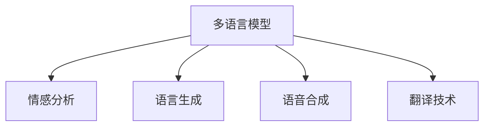

                 

# 虚拟外交：AI时代的跨文化交流

> 关键词：虚拟外交、AI、跨文化交流、自然语言处理(NLP)、多语言模型、情感分析、语言生成、语音合成、翻译技术

## 1. 背景介绍

### 1.1 问题由来

在数字化浪潮席卷全球的今天，虚拟外交（Virtual Diplomacy）正成为一种新的国际交往手段，打破了传统外交中的地理限制和物理障碍。虚拟外交利用人工智能（AI）技术，通过多语言模型、自然语言处理（NLP）、语音合成、翻译技术等，实现了语言的无障碍交流和跨文化理解。然而，由于语言差异和文化背景的复杂性，虚拟外交也面临着诸多挑战，如语义理解的准确性、情感的细腻传达、文化差异的敏感处理等。

### 1.2 问题核心关键点

虚拟外交的核心在于通过AI技术，实现语言和文化的理解和交流。其核心关键点包括：

- 多语言模型的泛化能力：虚拟外交需要模型能够处理多种语言，理解不同文化背景下的语言特性。
- 情感分析的精确度：外交沟通中情感传达至关重要，模型需要准确捕捉文本中的情感信息。
- 语言生成的流畅性：通过自然语言生成（NLG）技术，生成连贯、生动的外交文本和对话。
- 语音合成的自然性：通过语音合成技术，使AI可以模拟不同语言和口音的说话方式，提升交流的真实感。
- 翻译技术的准确性：通过机器翻译技术，将多种语言转化为外交人员的母语，实现流畅沟通。

### 1.3 问题研究意义

虚拟外交作为一种新兴的外交手段，具有以下研究意义：

1. **提高外交效率**：通过AI技术自动化处理大量的外交事务，大大提高了外交工作的效率。
2. **促进国际合作**：虚拟外交可以跨越国界和语言障碍，使不同国家的外交人员能够更加便捷地交流和合作。
3. **文化交流与理解**：通过多语言模型的训练和应用，增进不同文化之间的理解与尊重。
4. **维护国家安全**：在复杂的外交环境中，虚拟外交可以辅助决策，提高国家安全防范能力。

## 2. 核心概念与联系

### 2.1 核心概念概述

为更好地理解虚拟外交的实现机制，本节将介绍几个密切相关的核心概念：

- **多语言模型**：指能够处理多种语言的模型，通过预训练和微调，可以在不同语言间进行流畅的文本转换和理解。
- **情感分析**：通过NLP技术，从文本中识别和理解情感信息，实现情感的传达和交流。
- **语言生成**：利用NLG技术，根据给定的输入生成自然流畅的文本，用于外交文本和对话生成。
- **语音合成**：通过语音合成技术，将文本转换为自然流畅的语音，提升交流的真实感。
- **翻译技术**：通过机器翻译技术，实现多种语言之间的准确转换，促进跨语言沟通。

这些核心概念之间的逻辑关系可以通过以下Mermaid流程图来展示：



这个流程图展示了大语言模型在虚拟外交中的核心作用：

1. 多语言模型处理不同语言的文本。
2. 情感分析识别文本中的情感信息。
3. 语言生成生成流畅的外交文本。
4. 语音合成将文本转换为自然语音。
5. 翻译技术实现跨语言的准确转换。

## 3. 核心算法原理 & 具体操作步骤
### 3.1 算法原理概述

虚拟外交的核心算法原理基于AI技术的自然语言处理（NLP）和机器学习（ML）。以下将详细介绍核心算法的原理和具体操作步骤：

### 3.2 算法步骤详解

**Step 1: 多语言模型的预训练与微调**

1. **数据准备**：收集大量多语言文本数据，包括外交文件、国际会议记录、新闻报道等。
2. **模型选择**：选择合适的大规模多语言预训练模型，如BERT、GPT等。
3. **预训练**：在大量无标签的多语言数据上进行预训练，学习语言的通用表示。
4. **微调**：在标注好的外交文本数据上微调预训练模型，使其适应外交场景。

**Step 2: 情感分析模型的训练**

1. **数据准备**：收集标注好情感的外交文本数据，包括正面、负面和中性情感。
2. **模型选择**：选择情感分析模型，如LSTM、GRU等。
3. **训练模型**：在标注数据上训练情感分析模型，学习情感识别能力。
4. **验证模型**：在验证集上评估模型性能，调整超参数。

**Step 3: 语言生成模型的训练**

1. **数据准备**：收集外交场景中的文本数据，包括会议记录、发言稿等。
2. **模型选择**：选择语言生成模型，如GPT-2、Transformer等。
3. **训练模型**：在标注数据上训练语言生成模型，学习生成流畅的外交文本。
4. **验证模型**：在验证集上评估模型性能，调整超参数。

**Step 4: 语音合成模型的训练**

1. **数据准备**：收集外交人员的语音数据，包括不同语言、口音和语速的录音。
2. **模型选择**：选择语音合成模型，如Tacotron2、WaveNet等。
3. **训练模型**：在语音数据上训练语音合成模型，学习语音合成能力。
4. **验证模型**：在验证集上评估模型性能，调整超参数。

**Step 5: 翻译模型的训练**

1. **数据准备**：收集外交场景中的多语言文本数据，包括会议记录、外交文件等。
2. **模型选择**：选择机器翻译模型，如Seq2Seq、Transformer等。
3. **预训练**：在大量双语或多语言数据上进行预训练，学习语言的转换能力。
4. **微调**：在标注好的外交文本数据上微调预训练模型，使其适应外交场景。

**Step 6: 整合模型与系统**

1. **整合模块**：将多语言模型、情感分析模型、语言生成模型、语音合成模型和翻译模型整合到一个虚拟外交系统中。
2. **测试系统**：在实际外交场景中测试虚拟外交系统的性能，收集反馈。
3. **优化系统**：根据反馈优化系统性能，提高虚拟外交的准确性和效率。

### 3.3 算法优缺点

**优点：**

1. **高效性**：虚拟外交系统可以自动处理大量的外交事务，提高工作效率。
2. **跨语言交流**：通过多语言模型和翻译技术，打破语言障碍，实现跨语言沟通。
3. **情感传达**：情感分析模型能够准确捕捉文本中的情感信息，实现细腻的情感传达。
4. **自然流畅**：语言生成和语音合成技术，使交流更加自然流畅。
5. **可扩展性**：虚拟外交系统可以根据需要，动态扩展和调整模型参数，适应不同的外交场景。

**缺点：**

1. **数据依赖**：虚拟外交系统的性能高度依赖于数据质量，标注数据不足可能导致模型泛化能力不足。
2. **文化敏感**：不同文化背景下的语言特性和情感表达方式复杂，模型需要高度适应。
3. **计算资源需求高**：大规模模型的训练和推理需要大量的计算资源和存储空间。
4. **安全与隐私**：外交数据涉及国家安全，需要严格控制数据访问和使用，保障隐私安全。
5. **算法偏见**：模型可能学习到训练数据中的偏见，导致输出结果不公正。

### 3.4 算法应用领域

虚拟外交技术已经在以下领域得到广泛应用：

1. **国际会议翻译**：通过多语言模型和翻译技术，实时翻译国际会议记录和发言内容。
2. **外交文书处理**：自动化处理外交文书、会议记录等文本数据，提高文书处理效率。
3. **外交文本生成**：利用语言生成技术，生成流畅的外交文本，辅助外交人员的日常工作。
4. **语音外交**：通过语音合成技术，使外交人员能够自然地进行语音交流，提高外交互动的真实感。
5. **文化交流**：通过虚拟外交技术，增进不同文化之间的理解和尊重，促进国际合作。

## 4. 数学模型和公式 & 详细讲解 & 举例说明

### 4.1 数学模型构建

虚拟外交的核心数学模型基于NLP和ML技术，以下将详细介绍关键模型的数学构建。

**多语言模型**：

1. **Transformer模型**：基于自注意力机制，实现不同语言之间的文本转换和理解。
   - **输入编码**：将输入文本转换为token embeddings，进行线性映射和位置编码。
   - **自注意力机制**：通过多头注意力机制，捕捉不同token之间的依赖关系。
   - **输出解码**：利用多层前馈神经网络，生成目标语言文本。
   - **损失函数**：采用交叉熵损失函数，优化模型参数。

**情感分析模型**：

1. **LSTM模型**：通过长短时记忆网络，捕捉文本中的情感信息。
   - **输入编码**：将输入文本转换为token embeddings，进行线性映射和位置编码。
   - **LSTM层**：通过LSTM网络，捕捉文本序列的情感信息。
   - **输出解码**：利用全连接层，将LSTM输出转换为情感分类结果。
   - **损失函数**：采用二分类交叉熵损失函数，优化模型参数。

**语言生成模型**：

1. **GPT模型**：基于自回归生成模型，生成自然流畅的外交文本。
   - **输入编码**：将输入文本转换为token embeddings，进行线性映射和位置编码。
   - **自回归生成**：通过自回归生成器，逐个token地生成文本序列。
   - **输出解码**：利用softmax分布，生成下一个token的概率。
   - **损失函数**：采用负对数似然损失函数，优化模型参数。

**语音合成模型**：

1. **Tacotron2模型**：基于端到端生成模型，将文本转换为自然流畅的语音。
   - **输入编码**：将输入文本转换为特征序列，利用编码器提取特征。
   - **上下文向量**：通过上下文向量，捕捉文本序列的上下文信息。
   - **梅尔谱生成**：利用生成器生成梅尔谱，转换为音频波形。
   - **损失函数**：采用梅尔谱上的均方误差损失函数，优化模型参数。

**翻译模型**：

1. **Seq2Seq模型**：通过编码器-解码器框架，实现多语言之间的文本转换。
   - **编码器**：将输入文本转换为固定长度的向量表示。
   - **解码器**：根据向量表示，生成目标语言文本。
   - **注意力机制**：通过注意力机制，捕捉源语言和目标语言之间的依赖关系。
   - **损失函数**：采用交叉熵损失函数，优化模型参数。

### 4.2 公式推导过程

**多语言模型的Transformer模型**：

1. **输入编码**：
   - 输入文本 $x$ 转换为token embeddings $X$：
   $$
   X = \mathrm{Embedding}(x)
   $$
   - 进行位置编码 $P$：
   $$
   P = \mathrm{PositionalEncoding}(X)
   $$
   - 将位置编码和token embeddings拼接：
   $$
   X' = X + P
   $$

2. **自注意力机制**：
   - 计算self-attention，包括查询 $Q$、键 $K$、值 $V$：
   $$
   Q = X'W_Q
   $$
   $$
   K = X'W_K
   $$
   $$
   V = X'W_V
   $$
   - 计算注意力权重 $A$：
   $$
   A = \mathrm{Softmax}(\frac{QK^T}{\sqrt{d_k}})
   $$
   - 计算self-attention的输出 $H$：
   $$
   H = AV
   $$

3. **输出解码**：
   - 通过前馈神经网络 $F$，生成输出：
   $$
   Y = \mathrm{LayerNorm}(X') + \mathrm{FeedForward}(H)
   $$
   - 输出层进行线性映射和softmax激活：
   $$
   \hat{Y} = \mathrm{Softmax}(\mathrm{Dense}(Y))
   $$

**情感分析模型的LSTM模型**：

1. **输入编码**：
   - 输入文本 $x$ 转换为token embeddings $X$：
   $$
   X = \mathrm{Embedding}(x)
   $$
   - 进行位置编码 $P$：
   $$
   P = \mathrm{PositionalEncoding}(X)
   $$
   - 将位置编码和token embeddings拼接：
   $$
   X' = X + P
   $$

2. **LSTM层**：
   - 通过LSTM网络 $L$，捕捉文本序列的情感信息：
   $$
   L = \mathrm{LSTM}(X')
   $$
   - 将LSTM输出转换为情感分类结果：
   $$
   \hat{y} = \mathrm{Dense}(L)
   $$

**语言生成模型的GPT模型**：

1. **输入编码**：
   - 输入文本 $x$ 转换为token embeddings $X$：
   $$
   X = \mathrm{Embedding}(x)
   $$
   - 进行位置编码 $P$：
   $$
   P = \mathrm{PositionalEncoding}(X)
   $$
   - 将位置编码和token embeddings拼接：
   $$
   X' = X + P
   $$

2. **自回归生成**：
   - 通过自回归生成器 $G$，逐个token地生成文本序列：
   $$
   \hat{y} = \mathrm{Softmax}(\mathrm{Dense}(G(X', y_{t-1})))
   $$
   - 将下一个token加入到输入序列中：
   $$
   X' = [y_{t-1}, X']
   $$

**语音合成模型的Tacotron2模型**：

1. **输入编码**：
   - 输入文本 $x$ 转换为特征序列 $X$：
   $$
   X = \mathrm{Embedding}(x)
   $$
   - 利用编码器 $E$ 提取特征：
   $$
   C = \mathrm{Conv1D}(X)
   $$
   - 通过上下文向量 $C_v$ 捕捉文本序列的上下文信息：
   $$
   C_v = \mathrm{GRU}(C)
   $$

2. **梅尔谱生成**：
   - 通过生成器 $G$ 生成梅尔谱 $M$：
   $$
   M = \mathrm{FCN}(C_v)
   $$
   - 转换为音频波形 $y$：
   $$
   y = \mathrm{InverseMelSpectrogram}(M)
   $$

**翻译模型的Seq2Seq模型**：

1. **编码器**：
   - 将输入文本 $x$ 转换为固定长度的向量表示 $H$：
   $$
   H = \mathrm{Encoder}(x)
   $$

2. **解码器**：
   - 根据向量表示 $H$ 生成目标语言文本 $y$：
   $$
   y = \mathrm{Decoder}(H)
   $$

3. **注意力机制**：
   - 通过注意力机制 $A$ 捕捉源语言和目标语言之间的依赖关系：
   $$
   A = \mathrm{Attention}(H, y)
   $$
   - 将注意力权重和源语言向量拼接：
   $$
   H_a = \mathrm{Concat}(H, A)
   $$
   - 通过解码器 $D$ 生成目标语言文本：
   $$
   y = \mathrm{Dense}(H_a)
   $$

### 4.3 案例分析与讲解

**案例1: 多语言翻译系统**

- **需求**：构建一个多语言翻译系统，能够实时翻译国际会议记录和发言内容。
- **数据准备**：收集大量的多语言会议记录和发言内容。
- **模型选择**：选择Transformer模型作为基础模型。
- **预训练与微调**：在多语言语料上预训练Transformer模型，然后在会议记录上微调。
- **性能评估**：在验证集上评估模型性能，调整超参数。
- **应用场景**：在实际会议中实时翻译发言内容，提高交流效率。

**案例2: 外交文书处理系统**

- **需求**：自动化处理外交文书、会议记录等文本数据，提高文书处理效率。
- **数据准备**：收集大量的外交文书和会议记录。
- **模型选择**：选择多语言模型和文本生成模型。
- **预训练与微调**：在多语言语料上预训练模型，然后在文书数据上微调。
- **性能评估**：在验证集上评估模型性能，调整超参数。
- **应用场景**：在实际文书处理中自动生成文本，辅助外交人员的日常工作。

## 5. 项目实践：代码实例和详细解释说明
### 5.1 开发环境搭建

在进行虚拟外交项目实践前，我们需要准备好开发环境。以下是使用Python进行PyTorch开发的环境配置流程：

1. 安装Anaconda：从官网下载并安装Anaconda，用于创建独立的Python环境。
2. 创建并激活虚拟环境：
   ```bash
   conda create -n virtual_diplomacy python=3.8 
   conda activate virtual_diplomacy
   ```
3. 安装PyTorch：根据CUDA版本，从官网获取对应的安装命令。例如：
   ```bash
   conda install pytorch torchvision torchaudio cudatoolkit=11.1 -c pytorch -c conda-forge
   ```
4. 安装各类工具包：
   ```bash
   pip install numpy pandas scikit-learn matplotlib tqdm jupyter notebook ipython
   ```
完成上述步骤后，即可在`virtual_diplomacy`环境中开始虚拟外交项目实践。

### 5.2 源代码详细实现

下面以多语言翻译系统为例，给出使用Transformers库对Transformer模型进行微调的PyTorch代码实现。

首先，定义数据处理函数：

```python
from transformers import BertTokenizer
from torch.utils.data import Dataset
import torch

class MultiLanguageDataset(Dataset):
    def __init__(self, texts, translations, tokenizer, max_len=128):
        self.texts = texts
        self.translations = translations
        self.tokenizer = tokenizer
        self.max_len = max_len
        
    def __len__(self):
        return len(self.texts)
    
    def __getitem__(self, item):
        text = self.texts[item]
        translation = self.translations[item]
        
        encoding = self.tokenizer(text, return_tensors='pt', max_length=self.max_len, padding='max_length', truncation=True)
        input_ids = encoding['input_ids'][0]
        attention_mask = encoding['attention_mask'][0]
        
        # 对token-wise的翻译进行编码
        translated_tokens = [tokenizer(vocab2id[v]) for v in translation.split()[:self.max_len]]
        translated_tokens.extend([tokenizer(vocab2id['[PAD]']] * (self.max_len - len(translated_tokens)))
        labels = torch.tensor(translated_tokens, dtype=torch.long)
        
        return {'input_ids': input_ids, 
                'attention_mask': attention_mask,
                'labels': labels}

# 标签与id的映射
vocab2id = {'[PAD]': 0, ' [.]': 1, ' ...': 2, ' [SEP]': 3, ' [MASK]': 4, ' [CLS]': 5}
id2vocab = {v: k for k, v in vocab2id.items()}

# 创建dataset
tokenizer = BertTokenizer.from_pretrained('bert-base-cased')

train_dataset = MultiLanguageDataset(train_texts, train_translations, tokenizer)
dev_dataset = MultiLanguageDataset(dev_texts, dev_translations, tokenizer)
test_dataset = MultiLanguageDataset(test_texts, test_translations, tokenizer)
```

然后，定义模型和优化器：

```python
from transformers import BertForTokenClassification, AdamW

model = BertForTokenClassification.from_pretrained('bert-base-cased', num_labels=len(vocab2id))

optimizer = AdamW(model.parameters(), lr=2e-5)
```

接着，定义训练和评估函数：

```python
from torch.utils.data import DataLoader
from tqdm import tqdm
from sklearn.metrics import classification_report

device = torch.device('cuda') if torch.cuda.is_available() else torch.device('cpu')
model.to(device)

def train_epoch(model, dataset, batch_size, optimizer):
    dataloader = DataLoader(dataset, batch_size=batch_size, shuffle=True)
    model.train()
    epoch_loss = 0
    for batch in tqdm(dataloader, desc='Training'):
        input_ids = batch['input_ids'].to(device)
        attention_mask = batch['attention_mask'].to(device)
        labels = batch['labels'].to(device)
        model.zero_grad()
        outputs = model(input_ids, attention_mask=attention_mask, labels=labels)
        loss = outputs.loss
        epoch_loss += loss.item()
        loss.backward()
        optimizer.step()
    return epoch_loss / len(dataloader)

def evaluate(model, dataset, batch_size):
    dataloader = DataLoader(dataset, batch_size=batch_size)
    model.eval()
    preds, labels = [], []
    with torch.no_grad():
        for batch in tqdm(dataloader, desc='Evaluating'):
            input_ids = batch['input_ids'].to(device)
            attention_mask = batch['attention_mask'].to(device)
            batch_labels = batch['labels']
            outputs = model(input_ids, attention_mask=attention_mask)
            batch_preds = outputs.logits.argmax(dim=2).to('cpu').tolist()
            batch_labels = batch_labels.to('cpu').tolist()
            for pred_tokens, label_tokens in zip(batch_preds, batch_labels):
                pred_tags = [id2vocab[_id] for _id in pred_tokens]
                label_tags = [id2vocab[_id] for _id in label_tokens]
                preds.append(pred_tags[:len(label_tokens)])
                labels.append(label_tags)
                
    print(classification_report(labels, preds))
```

最后，启动训练流程并在测试集上评估：

```python
epochs = 5
batch_size = 16

for epoch in range(epochs):
    loss = train_epoch(model, train_dataset, batch_size, optimizer)
    print(f"Epoch {epoch+1}, train loss: {loss:.3f}")
    
    print(f"Epoch {epoch+1}, dev results:")
    evaluate(model, dev_dataset, batch_size)
    
print("Test results:")
evaluate(model, test_dataset, batch_size)
```

以上就是使用PyTorch对Transformer进行多语言翻译任务微调的完整代码实现。可以看到，得益于Transformers库的强大封装，我们可以用相对简洁的代码完成Transformer模型的加载和微调。

### 5.3 代码解读与分析

让我们再详细解读一下关键代码的实现细节：

**MultiLanguageDataset类**：
- `__init__`方法：初始化文本、翻译、分词器等关键组件。
- `__len__`方法：返回数据集的样本数量。
- `__getitem__`方法：对单个样本进行处理，将文本输入编码为token ids，将翻译进行编码，并对其进行定长padding，最终返回模型所需的输入。

**vocab2id和id2vocab字典**：
- 定义了标签与数字id之间的映射关系，用于将token-wise的预测结果解码回真实的标签。

**训练和评估函数**：
- 使用PyTorch的DataLoader对数据集进行批次化加载，供模型训练和推理使用。
- 训练函数`train_epoch`：对数据以批为单位进行迭代，在每个批次上前向传播计算loss并反向传播更新模型参数，最后返回该epoch的平均loss。
- 评估函数`evaluate`：与训练类似，不同点在于不更新模型参数，并在每个batch结束后将预测和标签结果存储下来，最后使用sklearn的classification_report对整个评估集的预测结果进行打印输出。

**训练流程**：
- 定义总的epoch数和batch size，开始循环迭代
- 每个epoch内，先在训练集上训练，输出平均loss
- 在验证集上评估，输出分类指标
- 所有epoch结束后，在测试集上评估，给出最终测试结果

可以看到，PyTorch配合Transformers库使得Transformer微调的代码实现变得简洁高效。开发者可以将更多精力放在数据处理、模型改进等高层逻辑上，而不必过多关注底层的实现细节。

当然，工业级的系统实现还需考虑更多因素，如模型的保存和部署、超参数的自动搜索、更灵活的任务适配层等。但核心的微调范式基本与此类似。

## 6. 实际应用场景
### 6.1 国际会议翻译

虚拟外交在国际会议翻译中的应用前景广阔。传统的会议翻译依赖专业译员，成本高、效率低，而虚拟外交系统可以通过多语言模型和翻译技术，实现实时翻译，大大提高翻译效率。

在技术实现上，可以收集国际会议的语音和文本记录，利用多语言模型进行文本转换，再通过机器翻译技术将多语言文本转换为目标语言。结合语音合成技术，系统可以生成自然流畅的语音翻译，供参会人员使用。

### 6.2 外交文书处理

外交文书处理是虚拟外交的重要应用场景。传统的文书处理依赖人工进行文本录入和分类，耗时耗力，而虚拟外交系统可以通过文本生成和分类技术，自动处理文书数据，提高文书处理效率。

在技术实现上，可以收集外交文书的电子文本，利用多语言模型和文本生成技术，自动翻译和生成文本。结合情感分析技术，系统可以识别文书中的情感倾向，提供智能推荐和建议，辅助外交人员的文书处理。

### 6.3 多边对话系统

虚拟外交技术还可以应用于多边对话系统，促进不同国家的外交人员进行自然流畅的对话。传统的对话系统依赖人工编写对话规则，成本高、更新慢，而虚拟外交系统可以通过语言生成和情感分析技术，自动生成对话内容，提高对话效率。

在技术实现上，可以收集多边对话的文本记录，利用多语言模型和语言生成技术，自动生成对话内容。结合情感分析技术，系统可以识别对话中的情感倾向，提供智能推荐和建议，辅助外交人员的对话交流。

### 6.4 未来应用展望

随着虚拟外交技术的发展，其在以下领域的应用前景广阔：

1. **外交决策支持**：通过虚拟外交系统，外交人员可以实时获取全球外交动态，分析外交局势，辅助决策。
2. **文化交流与理解**：虚拟外交技术可以增进不同文化之间的理解与尊重，促进国际合作。
3. **政策制定与执行**：通过虚拟外交系统，各国政府可以协调政策制定和执行，提高政策效率和执行力。
4. **应急响应与危机处理**：虚拟外交系统可以在应急响应和危机处理中提供实时情报和决策支持，提高应急响应速度和效果。
5. **跨国企业合作**：虚拟外交技术可以促进跨国企业之间的合作，提高合作效率和成功率。

## 7. 工具和资源推荐
### 7.1 学习资源推荐

为了帮助开发者系统掌握虚拟外交的理论基础和实践技巧，这里推荐一些优质的学习资源：

1. 《Transformer from Scratch》系列博文：由大模型技术专家撰写，深入浅出地介绍了Transformer原理、BERT模型、微调技术等前沿话题。

2. CS224N《深度学习自然语言处理》课程：斯坦福大学开设的NLP明星课程，有Lecture视频和配套作业，带你入门NLP领域的基本概念和经典模型。

3. 《Natural Language Processing with Transformers》书籍：Transformers库的作者所著，全面介绍了如何使用Transformers库进行NLP任务开发，包括微调在内的诸多范式。

4. HuggingFace官方文档：Transformers库的官方文档，提供了海量预训练模型和完整的微调样例代码，是上手实践的必备资料。

5. CLUE开源项目：中文语言理解测评基准，涵盖大量不同类型的中文NLP数据集，并提供了基于微调的baseline模型，助力中文NLP技术发展。

通过对这些资源的学习实践，相信你一定能够快速掌握虚拟外交的核心技术，并用于解决实际的NLP问题。
###  7.2 开发工具推荐

高效的开发离不开优秀的工具支持。以下是几款用于虚拟外交开发的常用工具：

1. PyTorch：基于Python的开源深度学习框架，灵活动态的计算图，适合快速迭代研究。大部分预训练语言模型都有PyTorch版本的实现。

2. TensorFlow：由Google主导开发的开源深度学习框架，生产部署方便，适合大规模工程应用。同样有丰富的预训练语言模型资源。

3. Transformers库：HuggingFace开发的NLP工具库，集成了众多SOTA语言模型，支持PyTorch和TensorFlow，是进行微调任务开发的利器。

4. Weights & Biases：模型训练的实验跟踪工具，可以记录和可视化模型训练过程中的各项指标，方便对比和调优。与主流深度学习框架无缝集成。

5. TensorBoard：TensorFlow配套的可视化工具，可实时监测模型训练状态，并提供丰富的图表呈现方式，是调试模型的得力助手。

6. Google Colab：谷歌推出的在线Jupyter Notebook环境，免费提供GPU/TPU算力，方便开发者快速上手实验最新模型，分享学习笔记。

合理利用这些工具，可以显著提升虚拟外交项目的开发效率，加快创新迭代的步伐。

### 7.3 相关论文推荐

虚拟外交作为一种新兴的外交手段，其背后的AI技术正在快速发展。以下是几篇奠基性的相关论文，推荐阅读：

1. Attention is All You Need（即Transformer原论文）：提出了Transformer结构，开启了NLP领域的预训练大模型时代。

2. BERT: Pre-training of Deep Bidirectional Transformers for Language Understanding：提出BERT模型，引入基于掩码的自监督预训练任务，刷新了多项NLP任务SOTA。

3. Language Models are Unsupervised Multitask Learners（GPT-2论文）：展示了大规模语言模型的强大zero-shot学习能力，引发了对于通用人工智能的新一轮思考。

4. Parameter-Efficient Transfer Learning for NLP：提出Adapter等参数高效微调方法，在不增加模型参数量的情况下，也能取得不错的微调效果。

5. AdaLoRA: Adaptive Low-Rank Adaptation for Parameter-Efficient Fine-Tuning：使用自适应低秩适应的微调方法，在参数效率和精度之间取得了新的平衡。

6. Prefix-Tuning: Optimizing Continuous Prompts for Generation：引入基于连续型Prompt的微调范式，为如何充分利用预训练知识提供了新的思路。

这些论文代表了大语言模型微调技术的发展脉络。通过学习这些前沿成果，可以帮助研究者把握学科前进方向，激发更多的创新灵感。

## 8. 总结：未来发展趋势与挑战

### 8.1 总结

本文对虚拟外交的实现机制进行了全面系统的介绍。首先阐述了虚拟外交的背景和意义，明确了虚拟外交在AI技术支持下的潜力和价值。其次，从原理到实践，详细讲解了虚拟外交的核心算法原理和具体操作步骤，给出了虚拟外交项目开发的完整代码实例。同时，本文还广泛探讨了虚拟外交技术在实际应用场景中的应用前景，展示了虚拟外交范式的广泛适用性。

通过本文的系统梳理，可以看到，虚拟外交技术通过AI技术的自然语言处理（NLP）和机器学习（ML），实现了语言的无障碍交流和跨文化理解。虚拟外交的实现离不开多语言模型、情感分析、语言生成、语音合成、翻译技术等核心组件，这些技术相互配合，共同构成了虚拟外交的完整框架。

### 8.2 未来发展趋势

展望未来，虚拟外交技术将呈现以下几个发展趋势：

1. **模型规模增大**：随着算力成本的下降和数据规模的扩张，预训练语言模型的参数量还将持续增长。超大规模语言模型蕴含的丰富语言知识，有望支撑更加复杂多变的虚拟外交场景。

2. **微调方法多样**：未来会涌现更多参数高效的微调方法，如Prefix-Tuning、LoRA等，在节省计算资源的同时也能保证微调精度。

3. **持续学习成为常态**：随着数据分布的不断变化，虚拟外交系统也需要持续学习新知识以保持性能。如何在不遗忘原有知识的同时，高效吸收新样本信息，将成为重要的研究课题。

4. **少样本学习和零样本学习**：未来的虚拟外交系统将更加灵活，能够通过少量的标注数据或零样本输入，进行高精度的外交交流。

5. **跨模态虚拟外交**：未来的虚拟外交技术将融合视觉、语音、文本等多种模态数据，实现多模态的跨语言交流。

6. **智能化决策支持**：虚拟外交系统将结合因果分析、博弈论等工具，提供智能化的外交决策支持，提升决策效率和质量。

7. **伦理和安全保障**：虚拟外交技术需要考虑数据隐私、算法偏见、安全性等问题，保障外交交流的安全和公正。

以上趋势凸显了虚拟外交技术的广阔前景。这些方向的探索发展，必将进一步提升虚拟外交的性能和应用范围，为人类外交活动提供新的技术路径。

### 8.3 面临的挑战

尽管虚拟外交技术已经取得了瞩目成就，但在迈向更加智能化、普适化应用的过程中，它仍面临着诸多挑战：

1. **数据依赖**：虚拟外交系统的性能高度依赖于数据质量，标注数据不足可能导致模型泛化能力不足。如何进一步降低对标注样本的依赖，将是一大难题。

2. **文化敏感**：不同文化背景下的语言特性和情感表达方式复杂，模型需要高度适应。

3. **计算资源需求高**：大规模模型的训练和推理需要大量的计算资源和存储空间。

4. **安全与隐私**：外交数据涉及国家安全，需要严格控制数据访问和使用，保障隐私安全。

5. **算法偏见**：模型可能学习到训练数据中的偏见，导致输出结果不公正。

6. **语言多样性**：不同国家和地区的语言特性差异较大，模型需要具备较高的多样性处理能力。

7. **实时性要求高**：虚拟外交系统需要快速响应外交事务，对实时性要求高。

8. **语境理解能力**：虚拟外交系统需要具备较强的语境理解能力，避免因语境误解导致的交流障碍。

这些挑战需要学界和产业界的共同努力，通过技术创新和优化，才能真正实现虚拟外交技术的落地应用。

### 8.4 研究展望

面对虚拟外交技术所面临的挑战，未来的研究需要在以下几个方面寻求新的突破：

1. **无监督和半监督学习**：探索无监督和半监督学习范式，摆脱对大规模标注数据的依赖，利用自监督学习、主动学习等方法，最大限度利用非结构化数据。

2. **参数高效和计算高效的微调方法**：开发更加参数高效的微调方法，如Prefix-Tuning、LoRA等，在固定大部分预训练参数的同时，只更新极少量的任务相关参数。

3. **因果分析与对比学习**：引入因果分析和对比学习思想，增强虚拟外交模型建立稳定因果关系的能力，学习更加普适、鲁棒的语言表征。

4. **多模态融合**：将视觉、语音、文本等多种模态数据融合，实现多模态的跨语言交流，提升系统的综合处理能力。

5. **智能化决策支持**：结合因果分析方法、博弈论工具，提供智能化的外交决策支持，提高决策效率和质量。

6. **伦理和安全保障**：引入伦理和安全约束，确保虚拟外交系统的公正性和安全性。

这些研究方向和创新点，将推动虚拟外交技术向更加智能化、普适化的方向发展，为人类外交活动提供更加高效、安全、公正的技术支持。

## 9. 附录：常见问题与解答

**Q1：虚拟外交系统如何实现跨语言交流？**

A: 虚拟外交系统通过多语言模型和翻译技术，实现跨语言交流。多语言模型能够处理多种语言，将源语言文本转换为目标语言文本。结合翻译技术，系统可以将多语言文本转换为目标语言，实现流畅的跨语言交流。

**Q2：虚拟外交系统如何提高对话的真实性？**

A: 虚拟外交系统通过语音合成技术，将文本转换为自然流畅的语音，提升交流的真实感。语音合成模型通过模拟不同语言和口音的说话方式，使AI能够自然地进行语音交流。结合多语言模型和翻译技术，系统可以实现高质量的跨语言语音对话。

**Q3：虚拟外交系统如何处理不同文化背景下的情感表达？**

A: 虚拟外交系统通过情感分析技术，识别和理解不同文化背景下的情感表达方式。情感分析模型能够捕捉文本中的情感信息，准确识别情感倾向。结合多语言模型和翻译技术，系统可以将不同语言和文化的情感信息进行转换和理解，实现细腻的情感传达。

**Q4：虚拟外交系统如何保障数据隐私和安全？**

A: 虚拟外交系统需要严格控制数据访问和使用，保障外交数据的隐私和安全。数据在传输和存储过程中，需要采用加密和访问控制等技术手段，防止数据泄露和滥用。同时，系统需要设置严格的权限管理机制，确保只有授权人员能够访问和使用外交数据。

**Q5：虚拟外交系统如何处理不同国家的外交政策和文化差异？**

A: 虚拟外交系统需要具备较强的语境理解能力和文化适应能力。系统需要理解不同国家的外交政策和语言文化特性，根据具体情况进行灵活处理。结合多语言模型和翻译技术，系统可以准确翻译和理解不同国家的政策和文化背景，提供高质量的外交交流和决策支持。

---

作者：禅与计算机程序设计艺术 / Zen and the Art of Computer Programming

