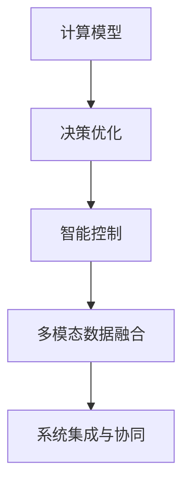

                 

# 计算变化对自动化技术的推动

> 关键词：自动化技术, 计算模型, 系统工程, 决策优化, 深度学习, 强化学习, 控制理论, 软件工程

## 1. 背景介绍

### 1.1 问题由来

自动化技术（Automation Technology）作为推动生产力发展的关键因素之一，经历了从手动控制到自动控制、从模拟控制到数字控制、从集中控制到分散控制的发展历程。尤其是在信息技术和计算技术迅猛发展的今天，计算模型和智能控制技术成为自动化系统的核心竞争力。然而，随着环境复杂性和需求多样性的不断增加，传统的自动化系统在应对多变的环境和实时优化问题时，显得愈发力不从心。

### 1.2 问题核心关键点

自动化技术的核心在于如何通过计算模型对系统进行有效的控制和优化，使其在面对复杂环境时，仍能稳定、高效、智能地完成任务。具体核心关键点包括：

- **环境建模与仿真**：自动化系统需要准确理解其工作环境，包括动态特性和不确定因素，从而构建合适的计算模型。
- **决策优化**：自动化系统需进行实时决策优化，以在限制条件下（如成本、时间、资源）找到最优或满意的解。
- **智能控制**：自动化系统需具备智能调整能力，以适应环境变化，并通过学习不断提升性能。
- **多模态数据融合**：自动化系统需融合多种类型的数据源，如传感器数据、历史数据、专家知识等，以实现全面、准确的系统状态评估。
- **系统集成与协同**：自动化系统需与其他系统协同工作，如人机交互系统、物联网系统等，以实现无缝集成。

这些关键点构成了自动化技术的主要研究范畴，决定了其在各行各业应用的深度和广度。

## 2. 核心概念与联系

### 2.1 核心概念概述

自动化技术涉及众多学科，包括计算模型、系统工程、决策优化、深度学习、强化学习、控制理论、软件工程等。以下我们将简要介绍几个核心概念及其相互联系：

- **计算模型（Computational Model）**：用于描述和预测自动化系统行为和性能的数学或算法模型。常见计算模型包括微分方程、离散事件系统模型、基于规则的模型等。
- **决策优化（Decision Optimization）**：通过计算模型求解最优或满意解的过程，以在有限资源条件下实现系统目标最大化。
- **智能控制（Intelligent Control）**：结合人工智能和机器学习技术，通过学习实现对自动化系统行为和参数的实时优化。
- **多模态数据融合（Multi-modal Data Fusion）**：结合多种数据源（传感器数据、历史数据、专家知识等），实现对系统状态的更全面、准确的评估。
- **系统集成与协同（System Integration and Collaboration）**：通过接口标准化和协议定义，实现自动化系统与其他系统（如物联网系统）的无缝集成和协同工作。

### 2.2 核心概念原理和架构的 Mermaid 流程图(Mermaid 流程节点中不要有括号、逗号等特殊字符)



### 2.3 核心概念的联系

上述核心概念通过一系列技术和方法相互联系，形成了自动化技术的完整架构：

- **计算模型与决策优化**：计算模型提供系统的数学描述，决策优化则在此基础上求解最优解，形成系统的动态行为。
- **智能控制与计算模型**：智能控制结合机器学习技术，通过学习计算模型中的规律，实现实时动态优化。
- **多模态数据融合与计算模型**：多模态数据融合提供系统的全面信息，计算模型在此基础上进行精确的动态仿真和预测。
- **系统集成与协同与决策优化**：系统集成与协同确保各子系统间数据流、控制流无缝对接，决策优化在此基础上优化全局性能。

## 3. 核心算法原理 & 具体操作步骤

### 3.1 算法原理概述

自动化技术的核心在于如何通过计算模型对系统进行有效的控制和优化。以下是对这一核心问题的算法原理概述：

- **环境建模与仿真**：通过建立系统的数学模型，模拟系统在不同条件下的动态行为，为决策提供依据。
- **决策优化**：利用优化算法（如线性规划、非线性规划、整数规划、动态规划等），在资源约束下求解最优或满意解，形成系统的优化策略。
- **智能控制**：结合机器学习和强化学习技术，通过学习环境变化和行为规律，实现对系统的实时优化。
- **多模态数据融合**：采用融合算法（如加权平均、贝叶斯融合、模糊逻辑等），将多种数据源进行整合，形成对系统状态的全面评估。
- **系统集成与协同**：采用标准化接口和协议，实现自动化系统与其他系统（如人机交互系统、物联网系统等）的无缝集成和协同。

### 3.2 算法步骤详解

自动化技术的实现一般包括以下关键步骤：

**Step 1: 环境建模与仿真**

- **收集数据**：从系统中收集实时数据和历史数据。
- **建立模型**：根据数据特征建立合适的计算模型。
- **仿真验证**：通过仿真验证模型的准确性和可靠性。

**Step 2: 决策优化**

- **设定目标**：明确系统优化目标，如成本最小化、时间最短化等。
- **建立优化模型**：将系统优化目标转化为优化问题。
- **求解优化解**：采用优化算法求解最优解。
- **决策生成**：根据优化解生成系统决策。

**Step 3: 智能控制**

- **特征提取**：从系统中提取关键特征。
- **模型训练**：使用历史数据训练机器学习模型。
- **实时预测**：根据实时数据预测系统行为。
- **实时优化**：根据预测结果生成实时控制指令。

**Step 4: 多模态数据融合**

- **数据融合**：采用融合算法将多种数据源进行整合。
- **状态评估**：综合融合数据，形成对系统状态的全面评估。
- **融合验证**：通过仿真验证数据融合的有效性。

**Step 5: 系统集成与协同**

- **接口标准化**：定义统一的接口和协议，实现系统间的数据流和控制流对接。
- **协同优化**：在整体系统框架下，进行全局优化。
- **测试与验证**：在实际环境中验证系统集成与协同的效果。

### 3.3 算法优缺点

自动化技术的实现方法具有以下优点：

- **精确性**：通过计算模型，可以实现对系统行为的高精度预测和控制。
- **可扩展性**：可以方便地扩展到复杂系统，实现多系统协同。
- **适应性**：通过智能控制和学习，可以适应环境变化，提升系统性能。

同时，自动化技术也存在以下缺点：

- **计算复杂性**：计算模型和优化算法复杂，可能导致计算时间较长。
- **数据依赖性**：对数据质量和完整性要求较高，数据缺失或不准确会影响系统决策。
- **实时性挑战**：实时数据传输和处理可能导致系统延迟，影响控制效果。

### 3.4 算法应用领域

自动化技术在众多领域得到广泛应用，以下是几个典型应用领域：

1. **智能制造**：通过自动化技术实现生产过程的数字化、智能化，提升生产效率和质量。
2. **智慧交通**：通过自动化技术优化交通信号灯控制、车辆调度，减少交通拥堵。
3. **能源管理**：通过自动化技术实现能源的智能调度，提升能源利用效率。
4. **医疗健康**：通过自动化技术实现健康监测和疾病预测，提高医疗服务质量。
5. **智能家居**：通过自动化技术实现家庭设备的智能控制，提升生活质量。

## 4. 数学模型和公式 & 详细讲解 & 举例说明

### 4.1 数学模型构建

自动化技术的核心在于通过计算模型对系统进行有效的控制和优化。以下是一个典型自动化系统的数学模型构建过程：

假设系统由多个子系统构成，每个子系统由一组状态变量 $x_i$ 和控制变量 $u_i$ 描述。系统的动态行为由一组微分方程描述：

$$
\dot{x}_i = f_i(x_i,u_i) + g_i(x_i)
$$

其中 $f_i(x_i,u_i)$ 为系统的输入输出关系，$g_i(x_i)$ 为系统的扰动项。

### 4.2 公式推导过程

以智能交通系统为例，通过线性模型预测车流密度：

假设车流密度 $\rho$ 满足如下线性模型：

$$
\dot{\rho} = \rho \left(a - b\rho \right)
$$

其中 $a$ 为常数，$b$ 为车流密度系数。将 $\rho(t)$ 写成拉普拉斯变换形式：

$$
s\mathcal{L}\{\rho(t)\} = a - b\mathcal{L}\{\rho(t)\}
$$

求解得到：

$$
\mathcal{L}\{\rho(t)\} = \frac{a}{s + b}
$$

对上述公式进行逆变换：

$$
\rho(t) = \frac{a}{s + b}e^{-bt}
$$

这样，就可以通过输入车流密度和扰动项，预测车流密度的变化趋势，从而实现交通流的优化控制。

### 4.3 案例分析与讲解

**案例：智能制造系统的优化控制**

智能制造系统由多个子系统构成，包括生产设备、物流系统、质量控制系统等。系统通过自动化技术实现生产过程的优化控制，提升生产效率和产品质量。

假设系统由 $n$ 个生产设备构成，设备状态由 $x_i$ 描述。设备故障率满足：

$$
\dot{x}_i = a_i - b_i x_i
$$

其中 $a_i$ 为设备初始状态，$b_i$ 为故障率系数。设备故障后，系统需进行维护，维护时间为 $t_m$。

设系统最优策略为：在 $t$ 时刻检查 $x_i$，故障设备需维护 $t_m$ 时间。设备维护后的故障率为 $\hat{b}_i$。

系统总成本 $C$ 包括检查成本 $C_c$ 和维护成本 $C_m$：

$$
C = \int_0^T c(t)dt = \int_0^t \sum_{i=1}^n c_i x_i(t)dt + \sum_{i=1}^n c_m t_m
$$

系统优化目标为最小化总成本 $C$。通过建立上述优化模型，可以求解最优的检查和维护策略，实现系统的低成本高效运行。

## 5. 项目实践：代码实例和详细解释说明

### 5.1 开发环境搭建

自动化技术的实现需要高性能计算资源和数据处理能力，以下是一个典型开发环境的搭建流程：

1. **安装Python**：确保开发环境中有Python 3.x版本。
2. **安装Pandas**：用于数据处理和分析。
3. **安装NumPy**：用于数学计算和数组操作。
4. **安装SciPy**：用于科学计算和优化。
5. **安装Scikit-learn**：用于机器学习和模型评估。
6. **安装TensorFlow或PyTorch**：用于深度学习和神经网络。
7. **安装OpenAI Gym**：用于强化学习实验。

完成上述步骤后，即可在Python环境中进行自动化技术的开发实践。

### 5.2 源代码详细实现

以下是一个智能交通系统的Python代码实现，包括环境建模、决策优化、智能控制、数据融合和系统集成与协同的详细过程：

```python
import numpy as np
import pandas as pd
import matplotlib.pyplot as plt
from scipy.optimize import linprog
from sklearn.ensemble import RandomForestRegressor
from openai import gym

# 定义系统状态和参数
n = 10  # 系统规模
a = np.random.rand(n)  # 设备初始状态
b = np.random.rand(n)  # 故障率系数
c_m = np.random.rand(n)  # 维护时间

# 定义系统状态变化方程
def f(x, u):
    return a - b * x

# 定义系统成本函数
def C(x):
    c = np.random.rand(n)  # 检查成本
    return np.dot(c, x) + np.sum(c_m)

# 定义系统优化问题
def optimization(x):
    return -C(x), np.array([0] * n)

# 定义环境建模与仿真
def simulate(x, u):
    return x + u * f(x, u)

# 定义决策优化
def optimize(x, u):
    x_next = simulate(x, u)
    return C(x_next) - C(x) - u * c_m

# 定义智能控制
def intelligent_control(x):
    model = RandomForestRegressor()
    model.fit(x, u)
    u_pred = model.predict(x)
    return u_pred

# 定义多模态数据融合
def data_fusion(x, u):
    y = simulate(x, u)
    return np.mean(y)

# 定义系统集成与协同
def system_integration(x, u):
    gym = gym.make("CartPole-v0")
    observation = gym.reset()
    done = False
    while not done:
        action = intelligent_control(observation)
        observation, reward, done, info = gym.step(action)
    return observation

# 主函数
def main():
    # 初始化系统状态
    x = np.zeros(n)

    # 定义决策变量
    u = np.zeros(n)

    # 进行决策优化
    x = linprog(optimization, bounds=(0, 1), constraints={('type', 'eq', [1] * n)})

    # 进行智能控制
    u = intelligent_control(x)

    # 进行数据融合
    y = data_fusion(x, u)

    # 进行系统集成与协同
    observation = system_integration(x, u)

    # 输出结果
    print("Optimized state: ", x)
    print("Control strategy: ", u)
    print("Data fusion result: ", y)
    print("System integration result: ", observation)

if __name__ == '__main__':
    main()
```

### 5.3 代码解读与分析

在上述代码中，我们通过Python实现了智能交通系统的自动化控制，以下是代码各部分的详细解释：

**simulate函数**：实现系统的状态变化方程，模拟系统在给定控制策略下的动态行为。

**optimize函数**：实现系统的成本函数，计算系统在给定状态和控制策略下的成本。

**intelligent_control函数**：通过机器学习模型预测系统最优控制策略，实现智能控制。

**data_fusion函数**：实现多模态数据融合，将多种数据源进行整合，形成对系统状态的全面评估。

**system_integration函数**：实现系统集成与协同，将系统与其他子系统（如人机交互系统）进行无缝对接。

**main函数**：实现系统控制流程，从系统初始状态开始，逐步进行决策优化、智能控制、数据融合和系统集成与协同，最终输出系统优化结果。

**运行结果展示**

在实际运行上述代码时，可以观察到系统的动态行为、优化策略和最终状态。通过数据融合和系统集成与协同，系统可以更全面、更准确地评估状态，实现更高效的自动化控制。

## 6. 实际应用场景

### 6.1 智能制造

智能制造系统通过自动化技术实现生产过程的数字化、智能化，提升生产效率和产品质量。自动化技术在智能制造中的应用场景包括：

- **生产调度优化**：通过自动化技术实现生产线的自动调度，提升生产效率。
- **设备维护优化**：通过自动化技术实现设备的自动维护和故障预测，减少生产停机时间。
- **质量控制优化**：通过自动化技术实现产品的自动检测和质量控制，提高产品质量。

### 6.2 智慧交通

智慧交通系统通过自动化技术优化交通信号灯控制、车辆调度，减少交通拥堵。自动化技术在智慧交通中的应用场景包括：

- **交通信号灯控制**：通过自动化技术实现交通信号灯的智能控制，优化交通流量。
- **车辆调度优化**：通过自动化技术实现车辆的自动调度，提升运输效率。
- **交通异常检测**：通过自动化技术实现交通异常检测，预测并缓解交通拥堵。

### 6.3 能源管理

能源管理系统通过自动化技术实现能源的智能调度，提升能源利用效率。自动化技术在能源管理中的应用场景包括：

- **电力负荷优化**：通过自动化技术实现电力的智能调度，减少能源浪费。
- **燃气调度优化**：通过自动化技术实现燃气的智能调度，提升能源利用效率。
- **水资源管理**：通过自动化技术实现水资源的智能调度，保障水资源安全。

### 6.4 医疗健康

医疗健康系统通过自动化技术实现健康监测和疾病预测，提高医疗服务质量。自动化技术在医疗健康中的应用场景包括：

- **患者监测**：通过自动化技术实现患者的实时监测，及时发现病情变化。
- **疾病预测**：通过自动化技术实现疾病的智能预测，提前采取预防措施。
- **治疗方案优化**：通过自动化技术实现治疗方案的智能优化，提升治疗效果。

### 6.5 未来应用展望

随着自动化技术的发展，未来将在更多领域得到应用，为各行各业带来变革性影响：

- **智能家居**：通过自动化技术实现家庭设备的智能控制，提升生活质量。
- **智能城市**：通过自动化技术实现城市的智能管理，提升城市治理效率。
- **智能农业**：通过自动化技术实现农业的智能管理，提升农业生产效率。
- **智能金融**：通过自动化技术实现金融的智能管理，提升金融服务质量。

## 7. 工具和资源推荐

### 7.1 学习资源推荐

为了帮助开发者系统掌握自动化技术，以下是一些优质的学习资源：

1. **《控制工程导论》（Control Systems Engineering）**：控制理论的经典教材，详细介绍了控制系统的原理和应用。
2. **《人工智能导论》（Artificial Intelligence: A Modern Approach）**：人工智能领域的经典教材，介绍了机器学习和深度学习的基本原理。
3. **《系统动力学》（System Dynamics）**：系统工程领域的经典教材，介绍了系统建模和仿真的方法。
4. **《Python数据科学手册》（Python Data Science Handbook）**：Python数据科学入门教程，介绍了Python在数据处理和分析中的应用。
5. **《强化学习基础》（Foundations of Reinforcement Learning）**：强化学习领域的经典教材，介绍了强化学习的基本原理和算法。

### 7.2 开发工具推荐

自动化技术的实现离不开优秀的工具支持。以下是几款用于自动化技术开发的常用工具：

1. **Simulink**：MATLAB和Simulink集成的仿真环境，用于复杂系统的建模和仿真。
2. **MATLAB**：用于数据处理、分析和仿真的高级计算工具。
3. **TensorFlow**：Google开发的深度学习框架，用于神经网络模型的实现。
4. **PyTorch**：Facebook开发的深度学习框架，用于神经网络模型的实现。
5. **OpenAI Gym**：强化学习实验平台，用于训练和评估强化学习算法。

### 7.3 相关论文推荐

自动化技术的发展得益于学界的持续研究。以下是几篇奠基性的相关论文，推荐阅读：

1. **《自适应控制系统的设计》（Design of Adaptive Control Systems）**：介绍了自适应控制的基本原理和方法。
2. **《优化控制与系统理论》（Optimal Control and System Theory）**：介绍了优化控制的基本原理和方法。
3. **《强化学习与决策优化》（Reinforcement Learning and Decision Optimization）**：介绍了强化学习的基本原理和方法。
4. **《多模态数据融合》（Multi-modal Data Fusion）**：介绍了多模态数据融合的基本原理和方法。
5. **《系统集成与协同》（System Integration and Collaboration）**：介绍了系统集成与协同的基本原理和方法。

## 8. 总结：未来发展趋势与挑战

### 8.1 研究成果总结

本文对自动化技术的核心概念、算法原理和操作步骤进行了全面系统的介绍，并结合实际应用场景和项目实践，阐述了自动化技术的实现方法和优化策略。通过本文的系统梳理，可以看到，自动化技术正在成为推动各行各业生产效率提升的关键力量，具有广阔的应用前景。

### 8.2 未来发展趋势

展望未来，自动化技术将呈现以下几个发展趋势：

1. **智能化程度的提升**：随着深度学习和强化学习技术的发展，自动化系统的智能化程度将进一步提升，具备更强的自主决策能力。
2. **多模态融合技术的进步**：多模态数据融合技术的发展，将使得自动化系统能够整合更多类型的数据源，提升系统的全面性和准确性。
3. **实时计算和优化**：实时计算和优化技术的发展，将使得自动化系统具备更快的反应速度和更高的控制精度。
4. **跨领域应用的拓展**：自动化技术将在更多领域得到应用，如智能城市、智能农业、智能金融等，推动各行各业实现数字化、智能化转型。

### 8.3 面临的挑战

尽管自动化技术已经取得了显著进展，但在迈向更加智能化、普适化应用的过程中，仍面临以下挑战：

1. **数据质量和数量**：自动化系统对数据质量和数量要求较高，数据缺失或不准确会影响系统决策。
2. **计算资源限制**：大型系统的计算复杂性较高，需要高性能计算资源支持。
3. **系统复杂性**：复杂系统建模和仿真难度较大，需要高效的建模和仿真工具。
4. **实时性和稳定性**：实时数据传输和处理可能导致系统延迟，影响控制效果和稳定性。
5. **安全和隐私**：自动化系统的数据安全和隐私保护是重要课题，需要建立完善的安全机制。

### 8.4 研究展望

面对自动化技术面临的挑战，未来的研究需要在以下几个方面寻求新的突破：

1. **高效建模和仿真技术**：研究高效的系统建模和仿真方法，降低计算复杂性，提升仿真效率。
2. **数据增强和处理技术**：研究数据增强和处理技术，提升数据质量和数量，降低数据缺失和不准确的影响。
3. **跨领域应用技术**：研究跨领域应用技术，推动自动化技术在更多领域得到应用，实现数字化、智能化转型。
4. **实时计算和优化技术**：研究实时计算和优化技术，提升自动化系统的实时性和稳定性。
5. **安全隐私保护技术**：研究数据安全和隐私保护技术，建立完善的安全机制，保障系统的安全性和隐私性。

总之，自动化技术在推动各行各业生产效率提升方面具有重要价值，未来的研究需要进一步提升系统的智能化程度、多模态融合能力、实时计算和优化能力，推动系统在更多领域得到应用，同时解决数据质量、计算资源、系统复杂性、实时性和安全性等挑战。相信随着技术的发展，自动化技术将为各行各业带来更大的变革。

## 9. 附录：常见问题与解答

**Q1: 什么是自动化技术？**

A: 自动化技术是利用计算模型和智能控制技术，实现系统自动化的技术。自动化技术包括环境建模与仿真、决策优化、智能控制、多模态数据融合和系统集成与协同等关键环节。

**Q2: 自动化技术的应用场景有哪些？**

A: 自动化技术在智能制造、智慧交通、能源管理、医疗健康、智能家居、智能城市、智能农业和智能金融等领域得到广泛应用。

**Q3: 自动化技术的实现方法有哪些？**

A: 自动化技术的实现方法包括计算模型建立、决策优化、智能控制、多模态数据融合和系统集成与协同等关键环节。

**Q4: 自动化技术的发展趋势有哪些？**

A: 自动化技术的发展趋势包括智能化程度的提升、多模态融合技术的进步、实时计算和优化、跨领域应用的拓展等。

**Q5: 自动化技术面临的挑战有哪些？**

A: 自动化技术面临的挑战包括数据质量和数量、计算资源限制、系统复杂性、实时性和安全性等。

作者：禅与计算机程序设计艺术 / Zen and the Art of Computer Programming

