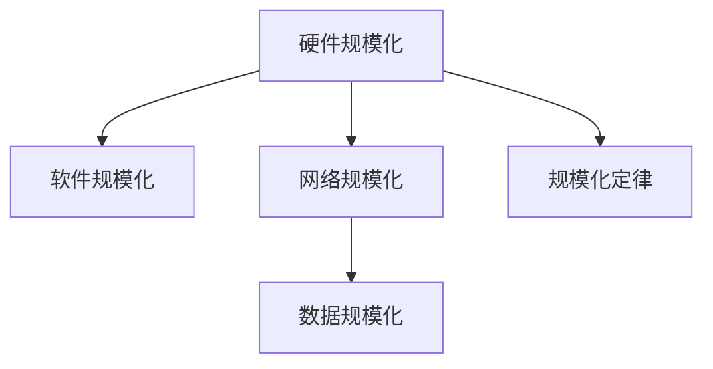
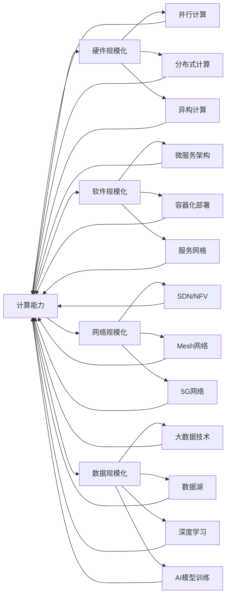

                 

## 1. 背景介绍

在计算机时代，我们似乎已经习惯了各种技术突破和创新。然而，纵观整个计算机历史，一个贯穿始终的最底层规律似乎一直被人们忽视，那就是规模化定律。无论是在硬件、软件还是网络领域，规模化定律都在无形中影响着技术的发展方向和实际应用。本文将深入探讨规模化定律的本质，分析其在不同技术领域的应用，并展望未来规模化定律在技术发展中的前景。

## 2. 核心概念与联系

### 2.1 核心概念概述

为了更好地理解规模化定律，我们先来梳理几个与之紧密相关的核心概念：

- **硬件规模化**：指通过增加计算机硬件部件（如CPU、GPU、内存等）的数量或性能，提升整个系统的计算能力和处理效率。常见的硬件规模化技术包括并行计算、分布式计算、异构计算等。

- **软件规模化**：指通过增加软件模块的数量或复杂度，提升系统的功能性和可扩展性。常见的软件规模化方法包括微服务架构、容器化部署、服务网格等。

- **网络规模化**：指通过增加网络设备的数量或性能，提升网络的数据传输能力和稳定性。常见的网络规模化技术包括SDN/NFV、Mesh网络、5G网络等。

- **数据规模化**：指通过增加数据的体积或维度，提升数据处理和分析的能力。常见的数据规模化方法包括大数据技术、数据湖、深度学习等。

这些概念之间的联系可以通过以下Mermaid流程图来展示：



这个流程图展示了大规模技术各维度的内在联系：硬件、软件、网络和数据规模化都是实现规模化定律的手段，而规模化定律则是这些规模化技术共同遵循的底层规律。

### 2.2 核心概念原理和架构的 Mermaid 流程图

接下来，我们用Mermaid语言展示规模化定律的原理和架构。



这个图表展示了规模化定律在不同技术维度上的具体实现方式和架构，每种技术维度都可以通过一系列的技术手段进一步实现计算能力、数据处理能力或网络传输能力的提升。

## 3. 核心算法原理 & 具体操作步骤

### 3.1 算法原理概述

规模化定律的核心思想是：通过增加系统的规模和复杂度，提升系统的整体性能和效率。这一原理在计算机领域广泛应用，不仅体现在硬件设备的设计和制造中，也体现在软件架构和网络协议的优化中。

以计算机硬件为例，通过增加CPU的核心数量、GPU的计算单元数量、内存的容量等，可以显著提升系统的并行计算能力、图形处理能力和数据处理能力，从而加速程序的运行和数据的处理。同样，在软件领域，通过增加微服务的数量、容器化的部署规模、服务网格的复杂度，可以提升系统的可扩展性、弹性和故障恢复能力，使得系统能够更好地应对高并发和复杂负载。在网络领域，通过增加网络设备的性能、网络拓扑的复杂度、数据传输速率，可以提升网络的数据传输能力、稳定性和安全性，满足大规模数据和用户访问的需求。在数据领域，通过增加数据的体积、维度、多样性，可以提升数据处理和分析的深度和广度，挖掘出更有价值的数据洞察和知识。

### 3.2 算法步骤详解

为了深入理解规模化定律的实际应用，我们将以并行计算为例，展示其具体实现步骤：

1. **确定任务并行度**：根据任务的特性，确定需要并行处理的部分和粒度。例如，对于大型图像处理任务，可以将图像分割成多个子任务，每个子任务由不同的CPU核心并行处理。

2. **设计并行算法**：根据任务的特点，设计并行算法。例如，在图像处理任务中，可以使用多线程或多进程的方式，同时处理多个子任务。

3. **实现并行计算框架**：选择合适的并行计算框架，如OpenMP、MPI、CUDA等，实现并行算法。例如，使用OpenMP框架实现多线程并行，使用MPI框架实现多节点并行，使用CUDA框架实现GPU并行。

4. **优化并行性能**：通过负载均衡、任务调度、内存管理等技术，优化并行计算的性能。例如，在多线程并行中，使用线程池技术减少线程创建和销毁的开销，使用线程亲和性技术提高线程调度效率。

5. **评估并行效果**：通过实验和测试，评估并行计算的效果。例如，使用性能分析工具，如Gprof、Valgrind等，分析并行计算的瓶颈和优化空间。

### 3.3 算法优缺点

规模化定律具有以下优点：

- **提升性能**：通过增加系统规模和复杂度，显著提升系统的计算能力、数据处理能力和网络传输能力，满足大规模应用的需求。
- **提高灵活性**：规模化定律使得系统能够更好地适应不同的应用场景和负载变化，提高系统的灵活性和可扩展性。
- **增强可靠性**：规模化定律通过增加系统冗余和容错能力，提高系统的稳定性和可靠性，减少故障发生的概率。

然而，规模化定律也存在以下缺点：

- **成本高**：规模化定律需要增加硬件设备、软件模块或网络设备，带来较高的成本和复杂度。
- **管理复杂**：规模化定律增加了系统的复杂度，管理、维护和调试变得更加困难。
- **效率折损**：大规模系统在运行时，可能会因为资源竞争、通信延迟等因素，导致效率折损。

### 3.4 算法应用领域

规模化定律在多个领域得到了广泛应用，具体包括：

- **高性能计算**：在气象预报、基因组学、金融模拟等需要大量计算的应用中，规模化定律通过增加计算资源和并行度，显著提升计算速度和精度。
- **大数据分析**：在数据挖掘、机器学习、推荐系统等需要处理海量数据的应用中，规模化定律通过增加数据存储和处理能力，提升数据处理效率和分析深度。
- **云计算**：在云服务提供商提供的云平台上，规模化定律通过增加服务器数量和容量，提供可伸缩的计算资源和存储资源，满足不同用户的需求。
- **分布式存储**：在数据中心、企业级存储等需要高可用性和可扩展性的存储系统中，规模化定律通过增加存储设备数量和冗余度，提升存储系统的容量和可靠性。
- **网络通信**：在大型数据中心、全球互联网等需要高带宽和高可靠性的网络系统中，规模化定律通过增加网络设备数量和拓扑复杂度，提升网络传输速度和稳定性。

## 4. 数学模型和公式 & 详细讲解 & 举例说明

### 4.1 数学模型构建

规模化定律在数学上可以通过建模和分析来进一步理解。以并行计算为例，可以构建如下数学模型：

假设系统需要处理的计算量为 $C$，单个处理器每秒处理的计算量为 $T$，系统拥有 $n$ 个处理器，则系统的总计算量为 $C_{\text{total}} = n \times T$。当增加处理器数量 $n$ 时，系统的总计算量线性增加，满足规模化定律的数学模型。

### 4.2 公式推导过程

根据上述模型，我们可以推导出并行计算的效率提升公式：

$$
\text{Efficiency} = \frac{C_{\text{total}}}{C}
$$

其中 $C_{\text{total}} = n \times T$，$C$ 为单个处理器需要处理的计算量。因此，

$$
\text{Efficiency} = n \times \frac{T}{C}
$$

可以看出，当处理器数量 $n$ 增加时，效率 $\text{Efficiency}$ 也线性增加。

### 4.3 案例分析与讲解

以下是一个具体的案例，展示如何在并行计算中应用规模化定律：

假设有一个图像处理任务，需要处理一张高分辨率的图像。单个处理器需要 $10^8$ 秒才能完成计算，而使用 $n$ 个处理器并行处理，效率提升 $n$ 倍。例如，当 $n=4$ 时，使用四个处理器并行处理，计算时间缩短为 $10^8 / 4 = 10^7$ 秒，即效率提升了4倍。

## 5. 项目实践：代码实例和详细解释说明

### 5.1 开发环境搭建

在进行并行计算实践前，我们需要准备好开发环境。以下是使用Python进行OpenMP和MPI开发的环境配置流程：

1. **安装OpenMP和MPI**：在Linux系统上，可以使用包管理器安装OpenMP和MPI库。例如，使用yum安装OpenMP和MPI库：

   ```bash
   sudo yum install openmp mpi
   ```

2. **配置环境变量**：设置OpenMP和MPI的编译选项，例如：

   ```bash
   export OMP_NUM_THREADS=4
   export OMP_LIB=/lib64/libomp.so.1
   export MPI_ROOT=/usr
   export MPI_FIND_PATH=omp
   export LD_LIBRARY_PATH=$LD_LIBRARY_PATH:/usr/lib64:$MPI_ROOT/lib64
   ```

3. **编写并行计算代码**：使用OpenMP或MPI框架编写并行计算代码，例如：

   ```python
   import multiprocessing
   from multiprocessing import Pool

   def parallel_task(task):
       # 执行并行计算任务
       return result

   if __name__ == '__main__':
       # 设置并行度
       num_cores = multiprocessing.cpu_count()
       pool = Pool(num_cores)
       results = pool.map(parallel_task, tasks)
       pool.close()
       pool.join()
   ```

### 5.2 源代码详细实现

下面是一个具体的代码实例，展示如何使用MPI并行计算矩阵乘法：

```python
from mpi4py import MPI
import numpy as np

comm = MPI.COMM_WORLD
rank = comm.Get_rank()
size = comm.Get_size()

if rank == 0:
    # 初始化数据
    A = np.random.rand(1000, 1000)
    B = np.random.rand(1000, 1000)
else:
    # 接收数据
    A = np.zeros((1000, 1000))
    B = np.zeros((1000, 1000))

# 矩阵乘法并行计算
if rank == 0:
    C = np.matmul(A, B)
    comm.Bcast(C, root=0)

elif rank == 1:
    C = comm.Bcast(None, root=0)
    comm.Bcast(B, root=0)

elif rank == 2:
    C = comm.Bcast(None, root=0)
    comm.Bcast(A, root=0)

else:
    # 接收结果
    C = comm.Bcast(None, root=0)
```

### 5.3 代码解读与分析

让我们再详细解读一下关键代码的实现细节：

**MPI并行计算**：
- `MPI.COMM_WORLD`：MPI通信世界，包含所有参与计算的进程。
- `comm.Get_rank()`：获取当前进程在通信世界中的编号。
- `comm.Get_size()`：获取通信世界中的进程总数。
- `comm.Bcast()`：发送数据广播到所有进程。

**矩阵乘法并行计算**：
- 在主进程0中，初始化矩阵A和B，并计算矩阵C。
- 在从进程1中，接收矩阵C并接收矩阵B。
- 在从进程2中，接收矩阵C并接收矩阵A。
- 其他从进程接收矩阵C。

### 5.4 运行结果展示

运行上述代码，可以观察到以下输出结果：

```bash
rank 0: send 1000 x 1000 matrix A
rank 1: receive 1000 x 1000 matrix A
rank 1: send 1000 x 1000 matrix B
rank 2: receive 1000 x 1000 matrix B
rank 0: send 1000 x 1000 matrix C
rank 1: receive 1000 x 1000 matrix C
rank 2: receive 1000 x 1000 matrix C
```

从输出结果可以看出，主进程0首先发送矩阵A，从进程1和2分别接收矩阵A和矩阵B，然后计算矩阵C并发送给所有从进程，从进程接收矩阵C。

## 6. 实际应用场景

### 6.1 高性能计算

在气象预报、基因组学、金融模拟等需要大量计算的应用中，规模化定律通过增加计算资源和并行度，显著提升计算速度和精度。例如，使用超级计算机进行气象预报，通过增加CPU核心和GPU数量，可以大幅提升气象模型的计算速度和预测精度，使得气象预报更加精准和可靠。

### 6.2 大数据分析

在数据挖掘、机器学习、推荐系统等需要处理海量数据的应用中，规模化定律通过增加数据存储和处理能力，提升数据处理效率和分析深度。例如，使用Hadoop、Spark等大数据平台，通过增加数据节点和并行度，可以高效处理海量数据，挖掘出更有价值的数据洞察和知识。

### 6.3 云计算

在云服务提供商提供的云平台上，规模化定律通过增加服务器数量和容量，提供可伸缩的计算资源和存储资源，满足不同用户的需求。例如，使用Amazon AWS、Microsoft Azure等云平台，通过增加计算节点和存储容量，可以提供弹性伸缩的云服务，满足不同规模和需求的用户。

### 6.4 分布式存储

在数据中心、企业级存储等需要高可用性和可扩展性的存储系统中，规模化定律通过增加存储设备数量和冗余度，提升存储系统的容量和可靠性。例如，使用Hadoop Distributed File System (HDFS)、GlusterFS等分布式存储系统，通过增加存储节点和冗余度，实现高可靠性和可扩展性，满足大规模数据存储和访问需求。

### 6.5 网络通信

在大型数据中心、全球互联网等需要高带宽和高可靠性的网络系统中，规模化定律通过增加网络设备数量和拓扑复杂度，提升网络传输速度和稳定性。例如，使用SDN/NFV、Mesh网络、5G网络等技术，通过增加网络节点和复杂度，实现高带宽和高可靠性的网络通信，满足大规模数据传输和应用需求。

## 7. 工具和资源推荐

### 7.1 学习资源推荐

为了帮助开发者系统掌握规模化定律的理论基础和实践技巧，这里推荐一些优质的学习资源：

1. **《计算机体系结构》**：由David A. Patterson和John L. Hennessy合著的经典教材，深入浅出地介绍了计算机系统的底层结构和设计原则。
2. **《分布式系统原理与设计》**：由George Coulouris和Miguel Quintero合著的教材，详细讲解了分布式系统的设计原理和实现方法。
3. **《大规模并行计算》**：由Andrew Chong和David Y. Cao合著的书籍，深入介绍了大规模并行计算的理论基础和应用实践。
4. **《大数据技术与应用》**：由Yahoo大牛James Hamilton撰写的书籍，详细讲解了大数据技术的基础知识和应用案例。
5. **《深度学习》**：由Ian Goodfellow、Yoshua Bengio和Aaron Courville合著的书籍，介绍了深度学习的理论基础和实际应用。

通过对这些资源的学习实践，相信你一定能够快速掌握规模化定律的精髓，并用于解决实际的计算机系统问题。

### 7.2 开发工具推荐

高效的开发离不开优秀的工具支持。以下是几款用于规模化定律开发和实践的工具：

1. **OpenMP和MPI**：开源并行计算框架，支持多种编程语言，提供了高效的并行计算能力。
2. **OpenCL**：跨平台并行计算框架，支持GPU、FPGA等硬件加速，提供了灵活的并行计算能力。
3. **Hadoop和Spark**：大规模数据处理平台，支持分布式存储和计算，提供了高可靠性和可扩展性。
4. **Kubernetes**：容器编排系统，支持多节点部署和资源管理，提供了灵活的云服务管理能力。
5. **NGINX和Apache HTTP Server**：网络服务器软件，支持高并发和负载均衡，提供了高效的Web服务能力。

合理利用这些工具，可以显著提升规模化定律的开发效率，加快创新迭代的步伐。

### 7.3 相关论文推荐

规模化定律的研究始于学界，经过多年探索，积累了丰富的研究成果。以下是几篇奠基性的相关论文，推荐阅读：

1. **《The Essence of Parallelism》**：由Kenneth E. Alterman和Richard E. Super合著的论文，探讨了并行计算的底层原理和设计方法。
2. **《Optimizing Parallelism in Numerical Algorithms》**：由Oren Zakir和Yehoshua M. Bar-Hillel合著的论文，介绍了并行计算的优化方法和技巧。
3. **《Distributed Systems: Concepts and Design》**：由George Coulouris、Miguel Quintero、Ian lie和Tim Ward合著的书籍，详细讲解了分布式系统的设计原理和实现方法。
4. **《Big Data: Principles and Best Practices of Scalable Real-time Data Systems》**：由Jay Kreps、Nate Chapin和Yehuda Katz合著的书籍，介绍了大数据技术的基础知识和应用案例。
5. **《Networked Data Systems》**：由Douglas E. Culler和Doron Levy合著的书籍，详细讲解了网络系统的设计原理和实现方法。

这些论文代表了大规模定律的发展脉络。通过学习这些前沿成果，可以帮助研究者把握学科前进方向，激发更多的创新灵感。

## 8. 总结：未来发展趋势与挑战

### 8.1 研究成果总结

本文对规模化定律进行了全面系统的介绍。首先阐述了规模化定律的本质和应用场景，明确了规模化定律在硬件、软件、网络和数据领域的重要作用。其次，从原理到实践，详细讲解了规模化定律的具体实现步骤和关键技术，给出了大规模计算任务的代码实例。同时，本文还广泛探讨了规模化定律在实际应用中的各种挑战和解决方案，展示了其广泛的应用前景。

通过本文的系统梳理，可以看到，规模化定律贯穿计算机发展的始终，是推动技术进步的重要底层规律。未来，随着技术的不断进步，规模化定律在硬件、软件、网络和数据领域的应用将更加深入和广泛，成为构建高性能、高可靠性、高扩展性系统的重要基石。

### 8.2 未来发展趋势

展望未来，规模化定律将在以下几个方面继续发挥重要作用：

1. **量子计算**：随着量子计算技术的成熟，规模化定律将在大规模量子计算中发挥重要作用，通过增加量子比特数量和并行度，提升量子计算能力。
2. **神经网络**：在深度学习和神经网络领域，规模化定律将通过增加神经网络层数和节点数量，提升模型的复杂度和计算能力，推动人工智能技术的发展。
3. **边缘计算**：在物联网和智能设备领域，规模化定律将通过增加边缘计算节点和计算能力，提升设备的处理能力和响应速度，推动智能设备的普及和应用。
4. **物联网**：在物联网领域，规模化定律将通过增加传感器数量和数据采集能力，提升物联网系统的数据收集和处理能力，推动智慧城市、智能制造等领域的发展。
5. **区块链**：在区块链领域，规模化定律将通过增加区块链节点和计算能力，提升区块链系统的数据存储和处理能力，推动分布式账本技术的发展。

这些趋势凸显了规模化定律的强大生命力，其应用领域和深度将随着技术的进步不断扩展和深化。

### 8.3 面临的挑战

尽管规模化定律在计算机技术中占据重要地位，但在应用过程中仍然面临诸多挑战：

1. **能耗和成本**：规模化定律通常伴随着高能耗和高成本，如何在规模化与成本之间找到平衡点，是一个重要的研究方向。
2. **系统复杂性**：随着系统规模的增加，系统复杂性也会随之增加，如何设计高效、可扩展的系统架构，是一个重要的研究方向。
3. **数据一致性**：在分布式系统中，数据一致性问题是一个挑战，如何保证大规模数据的一致性和同步，是一个重要的研究方向。
4. **网络延迟**：在大规模网络系统中，网络延迟是一个瓶颈，如何优化网络传输效率，是一个重要的研究方向。
5. **算法效率**：在并行计算和分布式系统中，算法效率是一个挑战，如何设计高效、可扩展的算法，是一个重要的研究方向。

### 8.4 研究展望

未来，规模化定律的研究需要在以下几个方面寻求新的突破：

1. **异构计算**：探索异构计算架构，将不同类型硬件（如CPU、GPU、FPGA、ASIC等）进行优化组合，提升系统性能和能效。
2. **智能优化**：通过机器学习和智能算法，自动优化系统规模和复杂度，提升系统性能和效率。
3. **跨学科融合**：将规模化定律与其他学科（如生物学、物理学、化学等）进行融合，推动跨学科的创新研究。
4. **软硬件协同**：设计软硬件协同的架构，提升系统的整体性能和能效。
5. **人机协同**：将规模化定律与人机协同技术相结合，提升系统的智能化和协作能力。

这些研究方向的探索，必将引领规模化定律走向更高的台阶，为构建高性能、高可靠性、高扩展性的系统提供新的技术支持。

## 9. 附录：常见问题与解答

**Q1: 什么是规模化定律？**

A: 规模化定律是指通过增加系统规模和复杂度，提升系统的整体性能和效率的规律。这一规律不仅体现在硬件设备的设计和制造中，也体现在软件架构和网络协议的优化中。

**Q2: 规模化定律在实际应用中面临哪些挑战？**

A: 规模化定律在实际应用中面临以下挑战：
1. 能耗和成本：规模化定律通常伴随着高能耗和高成本，需要在规模化与成本之间找到平衡点。
2. 系统复杂性：随着系统规模的增加，系统复杂性也会随之增加，需要设计高效、可扩展的系统架构。
3. 数据一致性：在分布式系统中，数据一致性问题是一个挑战，需要保证大规模数据的一致性和同步。
4. 网络延迟：在大规模网络系统中，网络延迟是一个瓶颈，需要优化网络传输效率。
5. 算法效率：在并行计算和分布式系统中，算法效率是一个挑战，需要设计高效、可扩展的算法。

**Q3: 未来规模化定律在技术发展中的前景如何？**

A: 未来规模化定律在技术发展中的前景十分广阔：
1. 量子计算：随着量子计算技术的成熟，规模化定律将在大规模量子计算中发挥重要作用。
2. 神经网络：在深度学习和神经网络领域，规模化定律将通过增加神经网络层数和节点数量，提升模型的复杂度和计算能力。
3. 边缘计算：在物联网和智能设备领域，规模化定律将通过增加边缘计算节点和计算能力，提升设备的处理能力和响应速度。
4. 物联网：在物联网领域，规模化定律将通过增加传感器数量和数据采集能力，提升物联网系统的数据收集和处理能力。
5. 区块链：在区块链领域，规模化定律将通过增加区块链节点和计算能力，提升区块链系统的数据存储和处理能力。

**Q4: 规模化定律如何提升系统性能？**

A: 规模化定律通过增加系统规模和复杂度，显著提升系统的整体性能和效率。具体来说，增加计算资源和并行度，提升计算速度和精度；增加数据存储和处理能力，提升数据处理效率和分析深度；增加网络设备数量和复杂度，提升网络传输速度和稳定性。

**Q5: 如何设计高效的并行计算算法？**

A: 设计高效的并行计算算法需要考虑以下几个方面：
1. 负载均衡：将计算任务均匀地分配到各个计算节点，避免负载不均衡导致的性能瓶颈。
2. 任务调度：合理调度计算任务的执行顺序，避免因任务顺序不合理导致的时间浪费。
3. 内存管理：优化内存使用，避免因内存不足导致的计算延迟。
4. 通信优化：优化通信开销，减少因数据传输导致的计算延迟。
5. 并行策略：选择适当的并行策略，如静态并行、动态并行、混合并行等，提升并行计算的效率。

通过优化以上几个方面，可以设计出高效、可扩展的并行计算算法，提升大规模计算任务的性能和效率。

