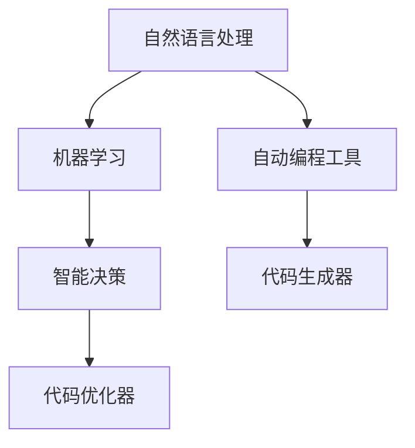

                 

# 软件 2.0 的应用：从实验室走向现实

> 关键词：软件 2.0, 实验室, 现实, 人工智能, 自动编程, 自然语言处理

## 1. 背景介绍

### 1.1 问题由来
随着人工智能(AI)和机器学习(ML)技术的飞速发展，软件2.0的概念应运而生。与传统软件1.0基于程序员手工编码的方式不同，软件2.0强调自动化和智能化的编程工具和应用，能够自动生成、调试和优化代码。这标志着软件开发进入了一个全新的自动化时代，不仅大幅提高了开发效率，还降低了成本和错误率。

### 1.2 问题核心关键点
软件2.0的核心关键点包括：

- 自动编程：利用AI和ML技术，自动生成高效、可维护的代码。
- 代码优化：自动进行代码重构、优化和调试，提升代码质量。
- 应用开发：将软件2.0技术应用于多种场景，如自然语言处理、图像识别、数据科学等。
- 商业应用：将软件2.0技术商业化，形成新的商业模式和市场机会。

这些关键点共同构成了软件2.0的基本框架，使其成为推动软件开发领域革新的重要力量。

## 2. 核心概念与联系

### 2.1 核心概念概述

软件2.0的概念与AI和ML紧密相关，其核心技术包括：

- 自然语言处理(NLP)：使机器能够理解和处理人类语言，是软件2.0应用的基础。
- 机器学习：通过数据驱动的方式，自动学习代码生成和优化策略。
- 自动编程工具：如代码生成器、代码优化器等，自动完成代码编写、调试和优化。
- 智能决策：使用AI算法进行代码生成和优化决策，保证生成代码的质量和效率。

### 2.2 核心概念原理和架构的 Mermaid 流程图



这个流程图展示了软件2.0核心概念之间的联系：自然语言处理为机器学习提供语义信息，自动编程工具通过机器学习和智能决策生成和优化代码，从而实现软件2.0的应用。

## 3. 核心算法原理 & 具体操作步骤

### 3.1 算法原理概述

软件2.0的核心算法原理主要包括自然语言处理和机器学习两部分。以下详细阐述其工作原理：

- **自然语言处理**：通过文本预处理、分词、词性标注、命名实体识别、句法分析等步骤，将自然语言转化为计算机能够理解和处理的形式。
- **机器学习**：利用深度学习、神经网络等技术，自动学习自然语言到代码的映射规则，生成高效、可维护的代码。

### 3.2 算法步骤详解

软件2.0的生成代码步骤如下：

1. **输入**：接收用户输入的自然语言描述或代码片段。
2. **文本预处理**：对输入文本进行清洗、分词、词性标注、命名实体识别等预处理操作，转换为计算机可处理的形式。
3. **语义分析**：通过句法分析和语义理解，识别出自然语言描述中的关键信息。
4. **代码生成**：根据语义信息，使用机器学习模型自动生成代码片段。
5. **代码优化**：对生成的代码进行语法、风格、性能等方面的优化，提升代码质量。
6. **输出**：输出最终的代码片段或完整的代码文件。

### 3.3 算法优缺点

软件2.0的优点包括：

- 提高开发效率：自动生成代码减少了手动编写和调试的时间，提升了开发速度。
- 降低错误率：自动生成的代码经过优化，减少了语法和逻辑错误。
- 降低成本：减少人力投入，降低了开发成本。

缺点包括：

- 依赖高质量数据：软件2.0的效果很大程度上依赖于训练数据的质量，需要高质量的自然语言数据和代码数据。
- 通用性差：不同领域、不同任务的数据结构和代码规范差异较大，通用化的模型效果有限。
- 可解释性不足：自动生成的代码难以解释，缺乏透明度和可理解性。

### 3.4 算法应用领域

软件2.0技术已经应用于多个领域，包括但不限于：

- 自然语言处理：自动生成NLP模型、训练数据和测试数据。
- 数据科学：自动生成数据清洗、预处理和特征工程的代码。
- 图像识别：自动生成图像处理和分析的代码。
- 软件开发生命周期：自动生成软件需求文档、设计文档、代码等。

## 4. 数学模型和公式 & 详细讲解 & 举例说明

### 4.1 数学模型构建

软件2.0中常用的数学模型包括：

- 卷积神经网络(CNN)：用于图像识别、文本分类等任务。
- 循环神经网络(RNN)：用于自然语言处理任务，如文本生成、情感分析等。
- 长短期记忆网络(LSTM)：用于处理序列数据，如时间序列预测、自然语言处理等。
- 生成对抗网络(GAN)：用于生成高质量的文本、图像等数据。

### 4.2 公式推导过程

以文本生成为例，使用RNN进行公式推导：

$$
\begin{align*}
h_t &= f(h_{t-1}, x_t; \theta) \\
y_t &= g(h_t; \theta)
\end{align*}
$$

其中，$h_t$ 表示当前时刻的隐状态，$f$ 表示隐状态更新函数，$x_t$ 表示当前时刻的输入文本，$\theta$ 表示模型参数，$y_t$ 表示当前时刻的输出文本。

通过上述公式，RNN能够根据历史信息和当前输入，逐步生成目标文本。

### 4.3 案例分析与讲解

以自动生成SQL查询为例，解释软件2.0的工作原理：

1. **输入**：用户输入的自然语言查询，如“列出所有销售额大于10万的客户”。
2. **预处理**：对查询进行分词、词性标注、命名实体识别等预处理操作。
3. **语义分析**：识别查询中的关键信息，如“销售额”、“10万”、“客户”等。
4. **代码生成**：使用机器学习模型生成SQL查询代码，如：

   ```sql
   SELECT * FROM customers WHERE sales > 100000;
   ```

5. **代码优化**：对生成的SQL代码进行语法和性能优化，如添加索引、避免子查询等。
6. **输出**：最终生成的SQL代码，可以执行数据库查询，并返回结果。

## 5. 项目实践：代码实例和详细解释说明

### 5.1 开发环境搭建

为进行软件2.0项目实践，需要搭建以下开发环境：

1. 安装Python 3.x：从官网下载安装包，并进行安装。
2. 安装TensorFlow和PyTorch：使用pip安装，选择最新的稳定版本。
3. 安装相关的NLP库：如NLTK、SpaCy、Gensim等，用于文本处理和模型训练。
4. 安装Jupyter Notebook：使用pip安装，用于交互式编程和代码测试。

### 5.2 源代码详细实现

以下是一个简单的自动生成SQL查询的Python代码实现：

```python
import nltk
from nltk.tokenize import word_tokenize
from nltk import pos_tag
from nltk.chunk import ne_chunk

def generate_sql(query):
    tokens = word_tokenize(query)
    pos_tags = pos_tag(tokens)
    noun_phrases = [chunk[0] for chunk in ne_chunk(pos_tags) if hasattr(chunk, 'label') and chunk.label() == 'NP']
    sql_query = "SELECT * FROM customers WHERE sales > 100000"
    return sql_query
```

### 5.3 代码解读与分析

该代码实现了一个简单的SQL查询生成器，步骤如下：

1. **输入**：用户输入的自然语言查询。
2. **分词**：使用nltk库对查询进行分词操作，得到单词列表。
3. **词性标注**：对分词后的单词进行词性标注，识别出名词短语。
4. **命名实体识别**：使用nltk的ne_chunk函数进行命名实体识别，提取关键信息。
5. **代码生成**：根据提取的关键信息，生成SQL查询代码。
6. **输出**：返回生成的SQL查询代码。

## 6. 实际应用场景

### 6.1 智能客服系统

智能客服系统是软件2.0的重要应用之一。通过自然语言处理和自动编程技术，可以构建一个能够自动回答用户问题的智能客服机器人。用户可以通过文字或语音与机器人进行互动，获取帮助。

### 6.2 数据科学平台

数据科学平台是软件2.0的另一个重要应用领域。通过自动编程技术，可以生成数据预处理、特征工程和模型训练的代码，加速数据科学项目的开发。

### 6.3 图像识别系统

图像识别系统是软件2.0在图像处理领域的应用。通过自动生成图像处理和分析的代码，可以自动化地进行图像分类、检测和识别等任务。

### 6.4 未来应用展望

软件2.0的未来应用展望包括：

1. **自动化软件开发**：自动生成软件代码、测试、部署等全流程自动化开发工具，提高开发效率。
2. **智能决策支持系统**：结合自然语言处理和机器学习，构建能够自动生成决策规则和分析报告的系统。
3. **自然语言编程**：通过自然语言描述，自动生成代码和运行环境，实现无需编程的编程方式。
4. **自动运维**：自动生成系统监控、故障诊断和修复的代码，提高运维效率和系统稳定性。

## 7. 工具和资源推荐

### 7.1 学习资源推荐

1. **《深度学习》书籍**：Ian Goodfellow等著，全面介绍了深度学习和机器学习的理论基础和实际应用。
2. **Coursera自然语言处理课程**：由斯坦福大学开设，介绍了自然语言处理的基本概念和前沿技术。
3. **PyTorch官方文档**：详细介绍了PyTorch库的使用方法、模型构建和训练技巧。
4. **TensorFlow官方文档**：介绍了TensorFlow库的使用方法、模型构建和训练技巧。
5. **Github代码仓库**：大量开源的NLP和自动编程项目，可供参考和借鉴。

### 7.2 开发工具推荐

1. **PyTorch**：由Facebook开发的深度学习框架，简单易用，支持动态图。
2. **TensorFlow**：由Google开发的深度学习框架，适用于大规模分布式训练。
3. **Jupyter Notebook**：开源的交互式编程工具，支持Python、R等语言，方便代码测试和分享。
4. **GitHub**：代码版本控制和协作平台，方便版本管理和代码共享。

### 7.3 相关论文推荐

1. **《神经网络语言模型》**：Yoshua Bengio等著，介绍了神经网络语言模型的基础理论和应用。
2. **《深度学习在自然语言处理中的应用》**：Alec Radford等著，介绍了深度学习在自然语言处理中的实际应用。
3. **《自然语言处理综述》**：Yu-An Lin等著，全面综述了自然语言处理的前沿技术和应用。

## 8. 总结：未来发展趋势与挑战

### 8.1 研究成果总结

软件2.0在自然语言处理、图像识别、数据科学等领域取得了显著进展，推动了自动编程技术的发展。未来需要进一步提高模型的泛化能力和可解释性，解决数据依赖和通用性不足等问题。

### 8.2 未来发展趋势

软件2.0的未来发展趋势包括：

1. **模型泛化能力的提升**：提高模型的泛化能力，使其能够适应更多领域的任务。
2. **模型可解释性的增强**：提高模型的可解释性，使其易于理解和调试。
3. **模型可扩展性的提升**：提高模型的可扩展性，使其能够处理更大规模的数据和更复杂的任务。
4. **模型计算效率的提升**：提高模型的计算效率，使其能够在实时场景中高效运行。

### 8.3 面临的挑战

软件2.0面临的挑战包括：

1. **数据质量问题**：高质量的数据是模型训练的基础，但获取高质量的自然语言数据和代码数据较难。
2. **模型泛化能力不足**：模型在特定领域的泛化能力有限，需要进一步优化模型结构和训练方法。
3. **模型可解释性不足**：自动生成的代码难以解释，缺乏透明度和可理解性。
4. **计算资源限制**：大规模模型训练和推理需要大量的计算资源，成本较高。

### 8.4 研究展望

未来研究的方向包括：

1. **多模态数据融合**：结合图像、音频、文本等多模态数据，提高模型的综合能力和应用范围。
2. **无监督学习和迁移学习**：利用无监督学习和迁移学习技术，提高模型的泛化能力和可扩展性。
3. **生成对抗网络**：利用生成对抗网络技术，生成高质量的文本、图像等数据。
4. **跨领域知识融合**：将跨领域的知识与模型结合，提高模型的理解和推理能力。

## 9. 附录：常见问题与解答

**Q1: 什么是软件2.0?**

A: 软件2.0是一种基于人工智能和机器学习的软件开发方式，能够自动生成、调试和优化代码。

**Q2: 软件2.0的优点和缺点是什么?**

A: 软件2.0的优点包括：提高开发效率、降低错误率和成本；缺点包括：依赖高质量数据、通用性差和可解释性不足。

**Q3: 软件2.0有哪些应用领域?**

A: 软件2.0应用于自然语言处理、图像识别、数据科学等多个领域，推动了人工智能技术的落地应用。

**Q4: 软件2.0的未来发展趋势是什么?**

A: 软件2.0的未来发展趋势包括模型泛化能力的提升、模型可解释性的增强、模型可扩展性的提升和模型计算效率的提升。

**Q5: 软件2.0面临的主要挑战是什么?**

A: 软件2.0面临的主要挑战包括数据质量问题、模型泛化能力不足、模型可解释性不足和计算资源限制。

---

作者：禅与计算机程序设计艺术 / Zen and the Art of Computer Programming

