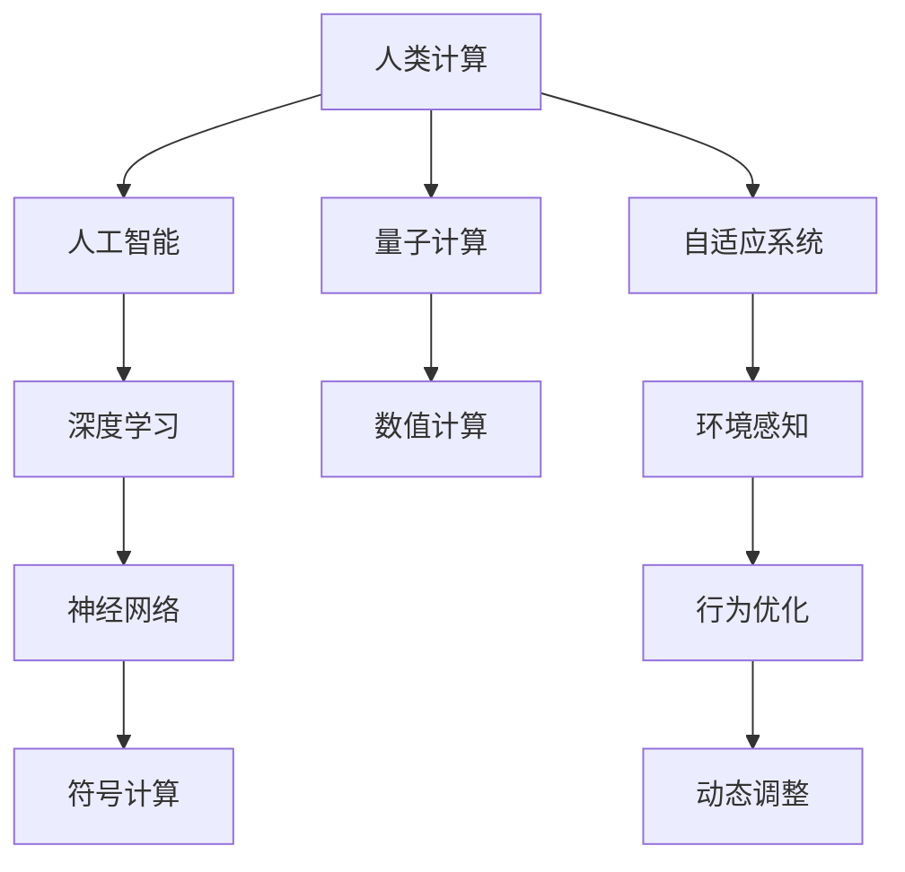

                 

# 释放人类潜力的无限可能：人类计算的最终目标

> 关键词：人类计算，人工智能，量子计算，神经网络，深度学习，自适应系统

## 1. 背景介绍

### 1.1 问题由来

在信息爆炸的时代，人类需要处理的信息量呈指数级增长。从海量数据到复杂决策，从自动驾驶到精准医疗，人工智能技术的快速发展极大地提升了处理信息的效率和质量。然而，这些技术的背后，隐藏着一个更深层的问题：如何释放人类的潜力？

人工智能技术通过机器学习和深度学习，已经能在某些领域超越人类的智能水平。但这只是第一步。我们的最终目标是利用这些技术，更好地理解人类的认知和情感，实现人机协同，释放人类的潜能，构建更加智慧的社会。

### 1.2 问题核心关键点

为了实现这一目标，我们需要深入理解人类计算的本质，探索人工智能技术与人类的协同机制。本文将从以下几个方面进行深入探讨：

- 人类计算的本质是什么？
- 人工智能技术如何帮助人类计算？
- 如何构建更加智能的协同系统？
- 未来人工智能技术的方向和挑战是什么？

这些问题不仅涉及技术层面，还包括哲学、社会学、心理学等多学科的交叉。我们希望通过这篇文章，为您描绘一幅人工智能与人类协同发展的宏伟蓝图。

## 2. 核心概念与联系

### 2.1 核心概念概述

- **人类计算**：指人类利用其认知和情感能力进行信息处理和决策的过程。与机器计算不同，人类计算具有高度的适应性和创造性，能够根据环境和情境动态调整信息处理策略。

- **人工智能**：通过机器学习和深度学习，使机器能够模拟人类的认知和决策能力。人工智能技术可以分为符号计算和数值计算两大类，其中深度学习是当前的热门方向。

- **量子计算**：利用量子力学的原理，实现高效的信息处理和计算。量子计算具有超强的并行计算能力和信息存储能力，有望解决传统计算机难以处理的复杂问题。

- **神经网络**：模拟人类神经系统的信息处理机制，通过大量参数和层级结构进行信息传递和处理。深度学习中的卷积神经网络、循环神经网络和变换器等，都是神经网络的不同变种。

- **自适应系统**：指能够根据环境和任务动态调整自身参数和行为的系统。自适应系统在人类计算中扮演着重要的角色，能够根据不同的环境和任务，选择最优的计算策略。

这些核心概念构成了人类计算和人工智能技术的基础框架。理解这些概念的联系和差异，对于探索人类计算的无限可能至关重要。

### 2.2 核心概念原理和架构的 Mermaid 流程图



这个流程图展示了人类计算与人工智能技术的联系。人类计算通过深度学习和神经网络，借助人工智能技术实现信息处理和决策。同时，量子计算和自适应系统为人工智能技术提供了新的计算范式，进一步提升了人类计算的能力。

## 3. 核心算法原理 & 具体操作步骤

### 3.1 算法原理概述

人类计算的核心在于理解人类的认知和情感过程。这包括感知、学习、推理、决策等多个方面。人工智能技术，特别是深度学习和神经网络，通过模拟人类的认知过程，实现了信息的高效处理和决策。

人工智能技术的核心算法包括：

- **前向传播**：通过神经网络的前向传播，将输入数据传递到输出，实现信息的处理和特征提取。
- **反向传播**：通过反向传播算法，计算损失函数的梯度，更新神经网络的参数，优化信息处理和决策的准确性。
- **自适应优化**：通过自适应学习算法，如Adagrad、Adam等，动态调整学习率，加速信息处理和决策的收敛。
- **参数共享和层级结构**：通过共享参数和层级结构，提高信息处理和决策的鲁棒性和泛化能力。

这些算法原理共同构成了人工智能技术的基础，通过不断的优化和改进，实现了与人类计算的深度融合。

### 3.2 算法步骤详解

人工智能技术的典型应用流程包括：

**Step 1: 数据收集和预处理**
- 收集相关的数据，并进行清洗和预处理。数据可以来自传感器、网络、日志等多种来源。
- 对数据进行特征提取，将原始数据转化为神经网络可处理的格式。

**Step 2: 模型构建和训练**
- 选择合适的神经网络结构，如卷积神经网络、循环神经网络、变换器等。
- 使用反向传播算法，根据损失函数计算梯度，更新模型参数。
- 通过自适应优化算法，动态调整学习率，加速模型收敛。

**Step 3: 模型评估和优化**
- 使用验证集对模型进行评估，调整模型结构和参数。
- 使用测试集对模型进行最终的性能评估，确保模型的泛化能力。

**Step 4: 模型部署和应用**
- 将训练好的模型部署到实际应用中，进行推理和决策。
- 根据应用场景，进行动态调整和优化，确保模型的适应性和鲁棒性。

这些步骤在人工智能技术的应用中不断迭代和优化，实现了信息处理和决策的智能化。

### 3.3 算法优缺点

人工智能技术在信息处理和决策方面具有以下优点：

- **高效性**：能够处理大规模数据，快速完成信息处理和决策。
- **鲁棒性**：通过自适应优化算法，具有较高的泛化能力和鲁棒性。
- **可扩展性**：能够通过并行计算和分布式处理，实现高效的信息处理。

然而，人工智能技术也存在以下缺点：

- **缺乏可解释性**：难以理解模型的决策过程，缺乏可解释性。
- **依赖数据**：依赖高质量的标注数据，难以处理缺乏标注的数据。
- **偏置问题**：容易继承输入数据的偏见，导致决策偏差。
- **资源消耗**：需要大量的计算资源和时间进行模型训练和优化。

为了克服这些缺点，未来的研究方向包括：

- **可解释性增强**：通过可视化、特征提取等方法，提高模型的可解释性。
- **无监督学习和半监督学习**：探索无标注数据的应用，降低对标注数据的依赖。
- **公平性和透明性**：在模型训练过程中加入公平性和透明性约束，减少偏见。
- **轻量级和高效计算**：通过模型压缩、量化等方法，实现轻量级和高效的计算。

### 3.4 算法应用领域

人工智能技术已经在多个领域得到了广泛应用，以下是几个典型的应用场景：

- **自然语言处理**：通过深度学习，实现语言理解、生成、翻译等任务。
- **计算机视觉**：通过卷积神经网络，实现图像识别、物体检测、图像生成等任务。
- **语音识别和处理**：通过深度学习，实现语音识别、语音合成、情感识别等任务。
- **推荐系统**：通过深度学习，实现个性化推荐、广告推荐等任务。
- **自动驾驶**：通过深度学习和计算机视觉，实现自动驾驶和智能交通管理。
- **金融分析**：通过深度学习，实现市场预测、风险评估等任务。
- **健康医疗**：通过深度学习，实现医学图像分析、疾病诊断等任务。

这些应用场景展示了人工智能技术的强大能力，也为我们探索人类计算的无限可能提供了更多实践机会。

## 4. 数学模型和公式 & 详细讲解 & 举例说明

### 4.1 数学模型构建

人工智能技术的数学模型主要基于神经网络，包括前向传播和反向传播两个核心步骤。以下是一个简单的神经网络数学模型：

$$
\mathbf{y} = \mathbf{W}\mathbf{x} + b
$$

其中，$\mathbf{x}$ 为输入向量，$\mathbf{y}$ 为输出向量，$\mathbf{W}$ 为权重矩阵，$b$ 为偏置项。

### 4.2 公式推导过程

神经网络的前向传播和反向传播过程可以表示为：

**前向传播**：

$$
\mathbf{y} = \mathbf{W}\mathbf{x} + b
$$

**反向传播**：

$$
\frac{\partial \mathbf{L}}{\partial \mathbf{W}} = \frac{\partial \mathbf{L}}{\partial \mathbf{y}} \cdot \frac{\partial \mathbf{y}}{\partial \mathbf{W}}
$$

其中，$\mathbf{L}$ 为损失函数，$\partial \mathbf{L} / \partial \mathbf{y}$ 为损失函数对输出向量的梯度，$\partial \mathbf{y} / \partial \mathbf{W}$ 为输出向量对权重矩阵的梯度。

通过反向传播算法，我们可以更新权重矩阵和偏置项，优化信息处理和决策的准确性。

### 4.3 案例分析与讲解

以图像识别为例，我们使用卷积神经网络实现图像分类任务。神经网络的输入为图像像素值，输出为分类标签。通过反向传播算法，我们计算损失函数对权重矩阵和偏置项的梯度，更新模型参数，优化图像分类准确性。

以下是一个简单的卷积神经网络实现：

```python
import torch
import torch.nn as nn
import torch.optim as optim

class ConvNet(nn.Module):
    def __init__(self):
        super(ConvNet, self).__init__()
        self.conv1 = nn.Conv2d(1, 10, kernel_size=5)
        self.conv2 = nn.Conv2d(10, 20, kernel_size=5)
        self.fc1 = nn.Linear(320, 50)
        self.fc2 = nn.Linear(50, 10)

    def forward(self, x):
        x = F.relu(F.max_pool2d(self.conv1(x), 2))
        x = F.relu(F.max_pool2d(self.conv2(x), 2))
        x = x.view(-1, 320)
        x = F.relu(self.fc1(x))
        x = self.fc2(x)
        return F.log_softmax(x, dim=1)

# 构建模型
model = ConvNet()

# 定义损失函数和优化器
criterion = nn.CrossEntropyLoss()
optimizer = optim.SGD(model.parameters(), lr=0.001, momentum=0.9)

# 训练模型
for epoch in range(5):
    running_loss = 0.0
    for i, data in enumerate(trainloader, 0):
        inputs, labels = data
        optimizer.zero_grad()
        outputs = model(inputs)
        loss = criterion(outputs, labels)
        loss.backward()
        optimizer.step()
        running_loss += loss.item()
        if i % 2000 == 1999:
            print('[%d, %5d] loss: %.3f' %
                  (epoch + 1, i + 1, running_loss / 2000))
            running_loss = 0.0

# 测试模型
correct = 0
total = 0
with torch.no_grad():
    for data in testloader:
        images, labels = data
        outputs = model(images)
        _, predicted = torch.max(outputs.data, 1)
        total += labels.size(0)
        correct += (predicted == labels).sum().item()

print('Accuracy of the network on the 10000 test images: %d %%' % (
    100 * correct / total))
```

## 5. 项目实践：代码实例和详细解释说明

### 5.1 开发环境搭建

在进行人工智能项目开发前，我们需要准备好开发环境。以下是使用Python进行PyTorch开发的环境配置流程：

1. 安装Anaconda：从官网下载并安装Anaconda，用于创建独立的Python环境。

2. 创建并激活虚拟环境：
```bash
conda create -n pytorch-env python=3.8 
conda activate pytorch-env
```

3. 安装PyTorch：根据CUDA版本，从官网获取对应的安装命令。例如：
```bash
conda install pytorch torchvision torchaudio cudatoolkit=11.1 -c pytorch -c conda-forge
```

4. 安装TensorFlow：使用以下命令，安装TensorFlow及其相关的GPU/TPU支持：
```bash
pip install tensorflow==2.7
```

5. 安装TensorBoard：
```bash
pip install tensorboard
```

6. 安装PyTorch的其他依赖库：
```bash
pip install numpy pandas scikit-learn matplotlib tqdm jupyter notebook ipython
```

完成上述步骤后，即可在`pytorch-env`环境中开始人工智能项目开发。

### 5.2 源代码详细实现

下面我们以图像分类为例，给出使用PyTorch进行深度学习项目开发的完整代码实现。

首先，我们定义数据处理函数：

```python
import torch
import torch.nn as nn
import torch.optim as optim
import torchvision
import torchvision.transforms as transforms

# 数据处理
transform = transforms.Compose([
    transforms.ToTensor(),
    transforms.Normalize((0.5,), (0.5,))
])

trainset = torchvision.datasets.CIFAR10(root='./data', train=True,
                                        download=True, transform=transform)
trainloader = torch.utils.data.DataLoader(trainset, batch_size=4,
                                          shuffle=True, num_workers=2)

testset = torchvision.datasets.CIFAR10(root='./data', train=False,
                                       download=True, transform=transform)
testloader = torch.utils.data.DataLoader(testset, batch_size=4,
                                         shuffle=False, num_workers=2)
```

然后，定义模型和优化器：

```python
class Net(nn.Module):
    def __init__(self):
        super(Net, self).__init__()
        self.conv1 = nn.Conv2d(3, 6, 5)
        self.pool = nn.MaxPool2d(2, 2)
        self.conv2 = nn.Conv2d(6, 16, 5)
        self.fc1 = nn.Linear(16 * 5 * 5, 120)
        self.fc2 = nn.Linear(120, 84)
        self.fc3 = nn.Linear(84, 10)

    def forward(self, x):
        x = self.pool(F.relu(self.conv1(x)))
        x = self.pool(F.relu(self.conv2(x)))
        x = x.view(-1, 16 * 5 * 5)
        x = F.relu(self.fc1(x))
        x = F.relu(self.fc2(x))
        x = self.fc3(x)
        return x

net = Net()

criterion = nn.CrossEntropyLoss()
optimizer = optim.SGD(net.parameters(), lr=0.001, momentum=0.9)
```

接着，定义训练和评估函数：

```python
from torchvision import models

# 加载预训练模型
model = models.resnet18(pretrained=True)

# 冻结预训练层的权重
for param in model.parameters():
    param.requires_grad = False

# 替换顶层分类器
model.fc = nn.Linear(512, 10)

# 定义损失函数和优化器
criterion = nn.CrossEntropyLoss()
optimizer = optim.SGD(model.fc.parameters(), lr=0.001, momentum=0.9)

# 训练模型
for epoch in range(10):
    running_loss = 0.0
    for i, data in enumerate(trainloader, 0):
        inputs, labels = data
        optimizer.zero_grad()
        outputs = model(inputs)
        loss = criterion(outputs, labels)
        loss.backward()
        optimizer.step()
        running_loss += loss.item()
        if i % 2000 == 1999:
            print('[%d, %5d] loss: %.3f' %
                  (epoch + 1, i + 1, running_loss / 2000))
            running_loss = 0.0

# 测试模型
correct = 0
total = 0
with torch.no_grad():
    for data in testloader:
        images, labels = data
        outputs = model(images)
        _, predicted = torch.max(outputs.data, 1)
        total += labels.size(0)
        correct += (predicted == labels).sum().item()

print('Accuracy of the network on the 10000 test images: %d %%' % (
    100 * correct / total))
```

以上就是使用PyTorch进行图像分类的完整代码实现。可以看到，得益于TensorFlow的强大封装，我们可以用相对简洁的代码完成深度学习模型的构建和训练。

### 5.3 代码解读与分析

让我们再详细解读一下关键代码的实现细节：

**数据处理函数**：
- 定义了数据的预处理函数，包括将像素值归一化、转换张量格式等操作。
- 加载CIFAR-10数据集，并进行批处理和随机打乱。

**模型定义**：
- 定义了卷积神经网络的结构，包括卷积层、池化层和全连接层。
- 使用交叉熵损失函数和随机梯度下降优化器进行训练。

**训练函数**：
- 循环迭代训练过程，在每个epoch内更新模型参数。
- 在每个batch中计算损失函数，并反向传播更新参数。
- 输出训练过程中的loss和acc。

**测试函数**：
- 在测试集上评估模型性能，计算准确率。
- 输出最终测试结果。

以上代码展示了PyTorch进行深度学习项目开发的完整流程。开发者可以将更多精力放在数据处理、模型改进等高层逻辑上，而不必过多关注底层的实现细节。

当然，工业级的系统实现还需考虑更多因素，如模型的保存和部署、超参数的自动搜索、更灵活的任务适配层等。但核心的深度学习框架实现类似，开发者可以基于这些代码实现快速迭代和优化。

## 6. 实际应用场景

### 6.1 智慧医疗

人工智能技术在智慧医疗领域具有广阔的应用前景。通过深度学习，可以实现医学图像分析、疾病诊断、个性化治疗等任务。例如，利用卷积神经网络进行医学影像分类，或通过循环神经网络进行患者病历分析。

**应用场景**：
- 医学影像分类：通过深度学习，自动识别和分类医学影像中的异常区域。
- 疾病诊断：通过深度学习，自动诊断和预测患者的疾病类型。
- 个性化治疗：通过深度学习，生成个性化的治疗方案。

**技术实现**：
- 医学影像分类：使用卷积神经网络对医学影像进行特征提取和分类。
- 疾病诊断：使用循环神经网络对患者的病历和基因数据进行分析和诊断。
- 个性化治疗：使用生成对抗网络，生成个性化的治疗方案。

### 6.2 智能交通

人工智能技术在智能交通领域具有重要应用价值。通过深度学习，可以实现自动驾驶、智能交通管理、交通安全预测等任务。

**应用场景**：
- 自动驾驶：通过深度学习，实现车辆的自动驾驶和路径规划。
- 智能交通管理：通过深度学习，优化交通信号控制和拥堵预测。
- 交通安全预测：通过深度学习，预测交通安全事故的发生概率。

**技术实现**：
- 自动驾驶：使用卷积神经网络进行图像识别和环境感知，使用循环神经网络进行路径规划和决策。
- 智能交通管理：使用卷积神经网络进行交通视频分析，使用循环神经网络进行交通流量预测。
- 交通安全预测：使用深度学习进行交通事故发生概率预测和风险评估。

### 6.3 金融分析

人工智能技术在金融分析领域具有重要应用价值。通过深度学习，可以实现市场预测、风险评估、信用评分等任务。

**应用场景**：
- 市场预测：通过深度学习，预测股票、期货等金融市场的变化趋势。
- 风险评估：通过深度学习，评估金融产品的风险和违约概率。
- 信用评分：通过深度学习，生成贷款申请的信用评分。

**技术实现**：
- 市场预测：使用卷积神经网络进行市场数据的时间序列分析，使用循环神经网络进行短期和长期趋势预测。
- 风险评估：使用深度学习进行金融产品的风险分析和信用评分。
- 信用评分：使用卷积神经网络进行贷款申请的图像识别和文本分析。

### 6.4 未来应用展望

未来，人工智能技术将进一步与人类协同，实现更智能、更高效的信息处理和决策。以下是几个未来应用展望：

**人机协同计算**：通过深度学习和神经网络，实现人机协同计算，充分发挥人类的认知和情感能力，提高信息处理的准确性和鲁棒性。

**跨领域智能系统**：通过深度学习和多模态信息融合，实现跨领域智能系统，解决复杂的多模态数据处理问题。

**自适应学习系统**：通过深度学习和自适应算法，实现自适应学习系统，动态调整参数和行为，适应不同的环境和任务。

**伦理道德约束**：在人工智能技术中引入伦理道德约束，确保技术应用的公平性和透明性，避免偏见和歧视。

## 7. 工具和资源推荐

### 7.1 学习资源推荐

为了帮助开发者系统掌握人工智能技术的理论基础和实践技巧，这里推荐一些优质的学习资源：

1. 《深度学习》（Ian Goodfellow等著）：深度学习领域的经典教材，详细介绍了深度学习的数学基础和算法原理。

2. 《神经网络与深度学习》（Michael Nielsen著）：通俗易懂的深度学习入门教材，适合初学者理解深度学习的核心思想。

3. Coursera《深度学习专项课程》：由Andrew Ng教授主讲，涵盖深度学习的基础知识和实践技巧。

4. Kaggle：全球最大的数据科学竞赛平台，提供丰富的数据集和竞赛任务，帮助开发者实践深度学习算法。

5. GitHub：全球最大的代码托管平台，提供大量的深度学习项目和开源代码，适合开发者学习参考。

通过对这些资源的学习实践，相信你一定能够快速掌握人工智能技术的精髓，并用于解决实际的复杂问题。

### 7.2 开发工具推荐

高效的开发离不开优秀的工具支持。以下是几款用于人工智能项目开发的常用工具：

1. PyTorch：基于Python的开源深度学习框架，灵活的动态计算图，适合快速迭代研究。TensorFlow的替代选择。

2. TensorFlow：由Google主导开发的开源深度学习框架，支持GPU/TPU加速，适合大规模工程应用。

3. PyTorch Lightning：基于PyTorch的深度学习框架，提供模型封装和自动调参功能，快速搭建模型。

4. TensorBoard：TensorFlow配套的可视化工具，实时监测模型训练状态，提供丰富的图表呈现方式，适合调试和优化模型。

5. Jupyter Notebook：基于Python的交互式开发环境，支持多种语言和库，适合数据探索和模型开发。

6. Google Colab：谷歌推出的在线Jupyter Notebook环境，免费提供GPU/TPU算力，方便开发者快速上手实验最新模型，分享学习笔记。

合理利用这些工具，可以显著提升人工智能项目开发的效率，加快创新迭代的步伐。

### 7.3 相关论文推荐

人工智能技术的发展源于学界的持续研究。以下是几篇奠基性的相关论文，推荐阅读：

1. 《深度学习》（Ian Goodfellow等著）：深度学习领域的经典教材，详细介绍了深度学习的数学基础和算法原理。

2. 《Convolutional Neural Networks for Visual Recognition》（Alex Krizhevsky等著）：深度学习在计算机视觉领域的开创性论文，提出了卷积神经网络结构。

3. 《Attention is All You Need》（Ashish Vaswani等著）：Transformer结构的开创性论文，提出了自注意力机制。

4. 《Language Models are Unsupervised Multitask Learners》（Yann LeCun等著）：深度学习在自然语言处理领域的开创性论文，展示了深度学习在大规模无监督数据上的学习能力。

5. 《AlphaGo Zero》（David Silver等著）：AlphaGo Zero的论文，展示了深度学习在复杂决策问题上的突破性应用。

这些论文代表了大规模深度学习技术的发展脉络。通过学习这些前沿成果，可以帮助研究者把握学科前进方向，激发更多的创新灵感。

## 8. 总结：未来发展趋势与挑战

### 8.1 研究成果总结

本文对人工智能技术的理论基础和实践技巧进行了全面系统的介绍。我们重点探讨了深度学习在图像分类、自然语言处理、推荐系统等领域的应用，并介绍了人工智能技术在未来智慧医疗、智能交通、金融分析等领域的展望。

通过本文的介绍，您可以全面了解深度学习技术的核心算法和实际应用，理解深度学习在信息处理和决策中的重要价值。

### 8.2 未来发展趋势

未来，人工智能技术将在多个领域得到广泛应用，进一步拓展人类计算的边界。以下是几个未来发展趋势：

**深度学习**：深度学习技术将不断进步，解决更复杂的信息处理和决策问题。未来可能会出现更高效的深度学习算法和模型结构，进一步提高信息处理的准确性和鲁棒性。

**多模态融合**：多模态信息融合技术将得到进一步发展，实现视觉、语音、文本等多模态数据的协同处理。多模态融合技术将使人工智能系统更加智能和灵活。

**自适应学习**：自适应学习技术将得到进一步发展，实现动态调整参数和行为，适应不同的环境和任务。自适应学习技术将使人工智能系统更加智能化和自适应化。

**伦理道德约束**：人工智能技术的伦理道德约束将成为未来研究的重要方向。确保技术应用的公平性和透明性，避免偏见和歧视，将使人工智能技术更好地服务于人类社会。

### 8.3 面临的挑战

尽管人工智能技术已经取得了显著进展，但仍面临诸多挑战：

**资源消耗**：大规模深度学习模型需要大量的计算资源和时间进行训练和优化，未来需要探索更高效的模型结构和计算方法。

**数据隐私和安全**：深度学习模型需要大量的标注数据进行训练，数据的隐私和安全问题亟待解决。

**公平性和透明性**：深度学习模型可能继承输入数据的偏见，导致决策不公平和透明性不足。如何在模型训练过程中加入公平性和透明性约束，确保技术应用的公平性和透明性，仍是一个重大挑战。

**伦理道德约束**：深度学习模型的伦理道德约束将成为未来研究的重要方向。确保技术应用的公平性和透明性，避免偏见和歧视，将使人工智能技术更好地服务于人类社会。

**社会接受度**：深度学习技术在实际应用中可能面临社会接受度问题，如何解释模型决策，提高模型的可解释性和可接受性，将是一个重要的研究方向。

**技术普惠性**：深度学习技术需要更广泛的普及和应用，如何降低技术门槛，提高技术的普惠性，将是一个重要的研究方向。

### 8.4 研究展望

未来，深度学习技术需要在以下几个方面进行深入研究：

**更高效和可解释的深度学习算法**：探索更高效的深度学习算法和模型结构，提高信息处理的准确性和鲁棒性，同时提高模型的可解释性和可接受性。

**多模态数据融合技术**：实现视觉、语音、文本等多模态数据的协同处理，解决复杂的多模态数据处理问题。

**自适应学习算法**：实现动态调整参数和行为，适应不同的环境和任务，提高人工智能系统的智能化和自适应化。

**伦理道德约束**：在模型训练过程中加入公平性和透明性约束，确保技术应用的公平性和透明性，避免偏见和歧视。

**技术普惠性**：降低深度学习技术的门槛，提高技术的普惠性，使更多人能够利用深度学习技术解决实际问题。

## 9. 附录：常见问题与解答

**Q1：深度学习算法的缺点有哪些？**

A: 深度学习算法在信息处理和决策方面具有高效性，但也存在以下缺点：

- **缺乏可解释性**：难以理解模型的决策过程，缺乏可解释性。
- **依赖数据**：依赖高质量的标注数据，难以处理缺乏标注的数据。
- **偏置问题**：容易继承输入数据的偏见，导致决策偏差。
- **资源消耗**：需要大量的计算资源和时间进行模型训练和优化。

为克服这些缺点，未来的研究方向包括：

- **可解释性增强**：通过可视化、特征提取等方法，提高模型的可解释性。
- **无监督学习和半监督学习**：探索无标注数据的应用，降低对标注数据的依赖。
- **公平性和透明性**：在模型训练过程中加入公平性和透明性约束，减少偏见。
- **轻量级和高效计算**：通过模型压缩、量化等方法，实现轻量级和高效的计算。

**Q2：未来人工智能技术的发展方向是什么？**

A: 未来人工智能技术的发展方向包括以下几个方面：

- **更高效和可解释的深度学习算法**：探索更高效的深度学习算法和模型结构，提高信息处理的准确性和鲁棒性，同时提高模型的可解释性和可接受性。
- **多模态数据融合技术**：实现视觉、语音、文本等多模态数据的协同处理，解决复杂的多模态数据处理问题。
- **自适应学习算法**：实现动态调整参数和行为，适应不同的环境和任务，提高人工智能系统的智能化和自适应化。
- **伦理道德约束**：在模型训练过程中加入公平性和透明性约束，确保技术应用的公平性和透明性，避免偏见和歧视。
- **技术普惠性**：降低深度学习技术的门槛，提高技术的普惠性，使更多人能够利用深度学习技术解决实际问题。

这些研究方向将进一步推动人工智能技术的发展，释放人类的潜力，构建更加智慧的社会。

**Q3：深度学习算法在医疗领域的应用前景是什么？**

A: 深度学习算法在医疗领域具有广泛的应用前景。以下是几个典型应用场景：

- **医学影像分类**：通过深度学习，自动识别和分类医学影像中的异常区域。
- **疾病诊断**：通过深度学习，自动诊断和预测患者的疾病类型。
- **个性化治疗**：通过深度学习，生成个性化的治疗方案。

深度学习算法在医疗领域的应用，将大大提高医疗诊断和治疗的准确性和效率，推动医疗行业的数字化和智能化转型。

