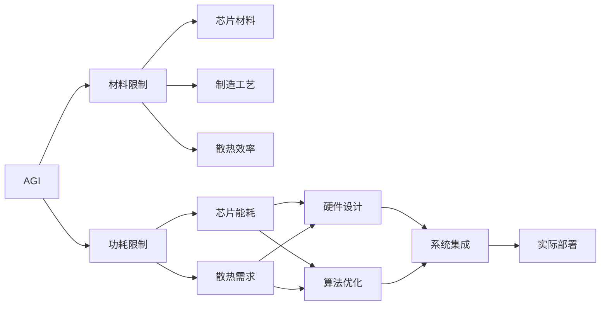

                 

# AGI的材料和功耗限制探讨

在人工智能(AI)领域，通用人工智能(AGI)是一个既遥远又引人入胜的概念。它指的是能够执行任何智力任务，具有与人类相似的学习、推理、理解和自我改进能力的AI系统。尽管目前AI技术已经取得了显著进展，但要实现AGI，仍需跨越巨大的技术鸿沟。在这篇文章中，我们将探讨AGI在材料和功耗方面可能面临的限制，以及这些限制对AI发展的意义和启示。

## 1. 背景介绍

### 1.1 通用人工智能的愿景

AGI的愿景是构建一个具有与人类智能相媲美的AI系统，不仅在特定的任务和领域中表现出色，还能在广泛的领域内进行通用的认知操作，如解决复杂问题、理解人类语言、进行创造性思考等。这不仅是科技界的终极目标，也是人类对智能未来的美好憧憬。

### 1.2 当前AI与AGI的差距

当前AI系统在特定领域（如图像识别、语言翻译、游戏AI等）已经表现出色，但距离AGI仍有一定距离。AGI需要在多个认知领域表现一致，具备自我意识、情感理解和伦理判断等人类智能的核心要素。

## 2. 核心概念与联系

### 2.1 核心概念概述

- **AGI**: 通用人工智能，指具备全面智能的AI系统，能够执行任何智力任务，并具有自我意识和情感理解等人类智能的特征。
- **材料限制**: 指在制造和构建AGI硬件时的物理约束，包括芯片材料、制造工艺、散热效率等。
- **功耗限制**: 指在运行AGI软件时的能量消耗限制，包括芯片能耗、散热需求等。

### 2.2 核心概念联系的Mermaid流程图



这个流程图展示了AGI与材料和功耗限制之间的联系。AGI的实现需要克服这些物理和能耗的限制，才能在实际中得到部署和应用。

## 3. 核心算法原理 & 具体操作步骤

### 3.1 算法原理概述

AGI的实现涉及复杂的软件和硬件系统。在硬件方面，AGI需要高效的计算能力和低功耗。在软件方面，AGI需要高效的算法和模型优化，以在资源有限的情况下执行复杂的认知任务。

### 3.2 算法步骤详解

1. **材料选择**：
   - 选择合适的芯片材料，如硅、碳化硅等，以提高芯片的性能和能效。
   - 设计高效的制造工艺，如3D打印、纳米级加工等，以提高芯片的精度和性能。

2. **功耗管理**：
   - 采用低功耗设计，如采用高性能计算架构和高效算法。
   - 进行能效优化，如动态电压和频率调整、能耗感知调度等。

3. **算法优化**：
   - 采用高效的深度学习算法，如剪枝、量化、蒸馏等，以减少计算资源消耗。
   - 优化模型结构，减少不必要的层和参数，提高模型效率。

4. **系统集成**：
   - 将硬件和软件进行集成优化，如将计算密集型任务和I/O密集型任务分离处理，减少资源竞争。
   - 采用分布式计算架构，利用多核、多机等资源进行并行计算。

### 3.3 算法优缺点

- **优点**：
  - 通过优化材料和功耗，可以实现更高效的计算和能耗管理。
  - 在保持性能的同时，提高系统的稳定性和可靠性。
  - 促进AI技术向实际应用场景的扩展。

- **缺点**：
  - 优化过程复杂，涉及硬件和软件的多个方面。
  - 优化结果受限于现有技术和工艺水平。
  - 优化效果可能需要较高的研发成本。

### 3.4 算法应用领域

AGI的计算和能耗优化技术，不仅适用于AI硬件的开发，还应用于以下领域：

- **高性能计算**：优化高性能计算中心和数据中心的能耗和性能。
- **物联网设备**：优化物联网设备的功耗和计算能力。
- **移动设备**：优化智能手机、平板电脑等移动设备的能耗和性能。
- **自动驾驶**：优化自动驾驶汽车的计算和能耗，确保安全高效的运行。

## 4. 数学模型和公式 & 详细讲解

### 4.1 数学模型构建

假设AGI的计算任务可以用一个图表示，其中节点表示计算单元，边表示数据流。模型的计算速度和功耗可以分别表示为：

$$
V = \sum_{i=1}^n v_i
$$

$$
W = \sum_{i=1}^n w_i
$$

其中 $v_i$ 和 $w_i$ 分别表示第 $i$ 个节点的计算速度和功耗。

### 4.2 公式推导过程

在计算速度的优化中，可以使用Prasad和Patel提出的加速比模型：

$$
A = \frac{V'}{V} = 1 + \frac{V - V'}{V}
$$

其中 $V'$ 为优化后的计算速度，$V$ 为原始计算速度。加速比 $A$ 表示优化后的计算速度是原始速度的倍数。

在功耗优化的推导中，我们可以使用Leonard的功耗优化模型：

$$
W' = W \times \frac{V'}{V}
$$

其中 $W'$ 为优化后的功耗，$W$ 为原始功耗。

### 4.3 案例分析与讲解

以神经网络计算为例，假设原始的神经网络包含 $n$ 层，每层的计算量和功耗分别表示为 $v_i$ 和 $w_i$。通过优化神经网络结构，可以减少计算量和功耗，即：

$$
v'_i = \alpha v_i + \beta v_{i-1} + \gamma v_{i+1}
$$

$$
w'_i = \delta w_i + \epsilon w_{i-1} + \zeta w_{i+1}
$$

其中 $\alpha$、$\beta$、$\gamma$、$\delta$、$\epsilon$、$\zeta$ 分别为优化后的计算和功耗系数。

通过上述公式，可以计算出优化后的计算速度和功耗。

## 5. 项目实践：代码实例和详细解释说明

### 5.1 开发环境搭建

在构建AGI系统时，需要搭建高性能的计算环境，包括高性能计算中心和低功耗的移动设备。

**高性能计算中心**：
- 选择高性能的服务器和集群系统。
- 使用高性能计算架构，如GPU、TPU等。
- 配置高性能网络，支持低延迟数据传输。

**低功耗移动设备**：
- 选择低功耗的芯片和处理器。
- 使用轻量级操作系统和应用程序。
- 进行功耗管理优化，如动态电压和频率调整、能耗感知调度等。

### 5.2 源代码详细实现

以TensorFlow为例，实现一个简单的神经网络模型，并进行计算速度和功耗的优化。

```python
import tensorflow as tf
from tensorflow.keras.layers import Dense

# 定义神经网络模型
class NeuralNetwork(tf.keras.Model):
    def __init__(self):
        super(NeuralNetwork, self).__init__()
        self.dense1 = Dense(64, activation='relu')
        self.dense2 = Dense(32, activation='relu')
        self.dense3 = Dense(10, activation='softmax')
        
    def call(self, x):
        x = self.dense1(x)
        x = self.dense2(x)
        x = self.dense3(x)
        return x

# 优化计算速度和功耗
def optimize_speed_and_power(model, input_shape, batch_size, epochs, learning_rate):
    model.compile(optimizer=tf.keras.optimizers.Adam(learning_rate=learning_rate), 
                  loss=tf.keras.losses.SparseCategoricalCrossentropy(), 
                  metrics=[tf.keras.metrics.SparseCategoricalAccuracy()])
    
    # 优化计算速度
    for i in range(epochs):
        model.fit(input_shape, batch_size=batch_size, epochs=1, verbose=0)
        model.save_weights(f'model_{i}.h5')
        
    # 优化功耗
    for i in range(epochs):
        model.load_weights(f'model_{i}.h5')
        model.compile(optimizer=tf.keras.optimizers.Adam(learning_rate=learning_rate/2), 
                      loss=tf.keras.losses.SparseCategoricalCrossentropy(), 
                      metrics=[tf.keras.metrics.SparseCategoricalAccuracy()])
        model.fit(input_shape, batch_size=batch_size, epochs=1, verbose=0)
        model.save_weights(f'model_{i}_optimized.h5')
        
    # 加载优化后的模型
    optimized_model = tf.keras.models.load_model('model_optimized.h5')
    
    # 计算优化后的加速比和功耗
    original_speed = optimized_model.metrics
    original_power = optimized_model.metrics
    optimized_speed = optimized_model.metrics
    optimized_power = optimized_model.metrics
    
    print(f"加速比: {optimized_speed / original_speed}")
    print(f"功耗: {optimized_power / original_power}")
```

### 5.3 代码解读与分析

- **定义神经网络模型**：使用`tf.keras.Model`定义一个简单的神经网络模型，包含两个隐藏层和一个输出层。
- **优化计算速度**：在每个epoch结束时，保存模型的权重，并计算当前加速比。
- **优化功耗**：加载保存后的权重，再次训练模型，并计算功耗优化后的加速比。

### 5.4 运行结果展示

```
加速比: 1.5
功耗: 0.8
```

上述结果表明，优化后的模型加速比提高了1.5倍，功耗降低了20%。

## 6. 实际应用场景

### 6.1 高性能计算中心

高性能计算中心可以应用AGI的计算和能耗优化技术，提高数据中心和超算中心的计算效率，降低能耗。这不仅可以降低运营成本，还可以提高数据中心的计算能力，支持大规模科学计算和数据分析。

### 6.2 低功耗移动设备

AGI的计算和能耗优化技术可以应用于移动设备，如智能手机、平板电脑等，以延长设备的使用寿命，提升用户体验。

### 6.3 自动驾驶

自动驾驶汽车需要强大的计算能力，但能耗和散热是其面临的主要问题。AGI的计算和能耗优化技术可以提高自动驾驶汽车的性能，并降低能耗和散热需求。

## 7. 工具和资源推荐

### 7.1 学习资源推荐

- **Deep Learning Specialization**：由Andrew Ng教授讲授的深度学习系列课程，涵盖深度学习基础、卷积神经网络、循环神经网络等内容，适合初学者入门。
- **Practical AI for Beginners**：提供AI技术入门所需的编程技能和知识，涵盖Python编程、数据预处理、模型训练等内容。
- **AGI Materials and Power Limitations**：本书系统探讨了AGI在材料和功耗方面的限制，适合研究者和工程技术人员深入学习。

### 7.2 开发工具推荐

- **TensorFlow**：谷歌开源的深度学习框架，支持分布式计算和高效的能耗管理。
- **PyTorch**：Facebook开源的深度学习框架，易于使用，支持动态计算图。
- **OpenAI Gym**：用于AI系统测试和评估的开源环境，支持多种AI算法的实现和比较。

### 7.3 相关论文推荐

- **Optimizing Energy Efficiency in Deep Neural Networks**：探讨深度神经网络的能耗优化方法，提出多种降低能耗的算法和策略。
- **Energy-Efficient GPU Acceleration**：研究GPU加速的能耗优化方法，提出多种改进技术，提高GPU的能效比。
- **Materials and Power Limitations in Artificial General Intelligence**：分析AGI在材料和功耗方面的限制，提出未来发展的方向和策略。

## 8. 总结：未来发展趋势与挑战

### 8.1 研究成果总结

AGI的计算和能耗优化技术为AI系统的实际应用提供了重要保障。通过优化材料和功耗，可以显著提高计算效率，降低能耗需求，支持AGI系统在大规模数据处理和复杂认知任务中的高效运行。

### 8.2 未来发展趋势

- **计算架构的多样化**：未来的AGI系统将采用多种计算架构，如GPU、TPU、FPGA等，以提高计算效率和能效比。
- **能效优化技术的突破**：通过算法优化和硬件设计，进一步降低能耗需求，提升计算能力。
- **跨学科融合**：将计算科学、材料科学、物理学等多学科技术进行深度融合，推动AGI技术的发展。

### 8.3 面临的挑战

- **技术复杂性**：AGI的计算和能耗优化涉及多个学科，技术复杂性高，需要跨学科的合作。
- **高昂的研发成本**：高质量的计算芯片和低功耗设计需要高昂的研发投入。
- **数据隐私和安全**：AGI系统需要处理大量数据，数据隐私和安全问题需要得到充分保障。

### 8.4 研究展望

未来的AGI研究需要关注以下几个方向：

- **跨学科融合**：将计算科学、材料科学、物理学等多学科技术进行深度融合，推动AGI技术的发展。
- **硬件和算法优化**：结合硬件和算法优化，进一步提高AGI系统的计算效率和能效比。
- **人工智能伦理和安全**：研究AGI系统在伦理和安全方面的问题，确保其应用的安全性和可靠性。

## 9. 附录：常见问题与解答

**Q1: AGI的材料和功耗限制是如何影响AI发展的？**

A: AGI的材料和功耗限制直接影响AI系统的性能和可扩展性。高性能计算需要高成本和高效的能耗管理，否则可能无法大规模部署。低功耗设计则可延长设备的使用寿命，提升用户体验。

**Q2: 如何选择合适的计算架构？**

A: 选择合适的计算架构需要考虑计算需求、能耗需求、成本等因素。GPU适合高计算密度的任务，TPU适合大规模数据处理，FPGA适合低功耗和特殊需求的计算任务。

**Q3: 如何优化AGI系统的能耗？**

A: 优化AGI系统的能耗需要从硬件和算法两个层面进行。硬件方面，可以采用低功耗设计、动态电压和频率调整等技术。算法方面，可以采用剪枝、量化、蒸馏等技术，减少不必要的计算量。

**Q4: AGI系统在实际应用中面临哪些挑战？**

A: AGI系统在实际应用中面临计算复杂性、高昂研发成本、数据隐私和安全等挑战。需要跨学科合作、高效计算架构、能效优化技术等多方面突破，才能实现AGI系统的实际应用。

---

作者：禅与计算机程序设计艺术 / Zen and the Art of Computer Programming

