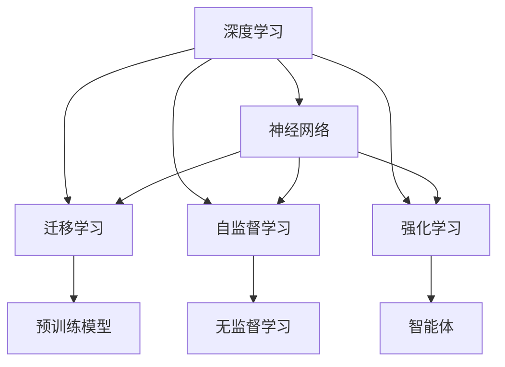

                 

# AI 2.0 时代的未来世界

## 1. 背景介绍

在过去几年中，人工智能（AI）经历了前所未有的发展，特别是随着深度学习和大数据技术的成熟，AI领域实现了从1.0向2.0的跨越。这种跨越不仅仅是算法的更新迭代，更是从传统的、线性的、结构化的决策系统，迈向了更加复杂的、非线性的、多模态的智能系统。AI 2.0时代的到来，预示着人类社会的各个方面都将发生深刻的变化，从智能城市的建设到医疗健康，从工业自动化到娱乐业，AI的应用范围不断扩大，影响力持续提升。

### 1.1 问题由来

AI 2.0时代的关键技术突破主要集中在以下几个方面：

- **深度神经网络**：通过更深的层次和更大的规模，神经网络已经能够处理更加复杂的任务，如图像识别、自然语言理解、语音识别等。
- **大数据**：数据驱动的AI系统需要庞大的数据集进行训练，这为AI的发展提供了肥沃的土壤。
- **硬件加速**：GPU、TPU等专用硬件的普及，极大提升了AI训练和推理的效率。
- **云计算与分布式计算**：云计算和分布式计算为大规模AI任务的运行提供了强大的基础设施支持。
- **自监督与迁移学习**：自监督学习和迁移学习使得AI模型能够通过少量标注数据进行高效微调，提升泛化能力。

这些技术突破，使得AI系统在各种复杂场景中表现出色，同时也引发了关于AI伦理、安全、隐私等诸多新问题。在这样一个充满挑战和机遇的时代，理解AI 2.0的核心概念和关键技术，对于未来的发展至关重要。

### 1.2 问题核心关键点

AI 2.0时代的核心问题包括：

- **模型训练与优化**：如何训练更高效的模型，如何优化模型的性能。
- **数据管理与标注**：如何在保证数据质量的同时，降低标注成本。
- **模型部署与维护**：如何实现模型的高效部署和持续维护。
- **用户隐私与安全**：如何在保障用户隐私的前提下，提供可靠的AI服务。
- **伦理与法律**：如何确保AI应用的公正性、透明度和可解释性。

理解这些问题，对于AI 2.0时代的技术创新和应用拓展具有重要意义。

## 2. 核心概念与联系

### 2.1 核心概念概述

在AI 2.0时代，核心的技术概念包括深度学习、神经网络、迁移学习、自监督学习、强化学习等。这些概念之间存在紧密的联系，形成了AI技术的完整体系。

- **深度学习**：通过多层次的非线性变换，深度神经网络能够自动从数据中提取特征，进行复杂的模式识别和预测。
- **神经网络**：由大量神经元（节点）和连接权重组成的网络，用于模拟生物神经元的工作机制。
- **迁移学习**：利用预训练模型的知识，通过微调等方式，快速适应新任务。
- **自监督学习**：在没有标签的情况下，通过数据自身的结构信息进行模型训练，如语言模型的预训练。
- **强化学习**：通过与环境的交互，不断优化模型的决策策略，如自动驾驶、机器人控制等。

这些概念相互依赖、相互促进，构成了AI 2.0时代的核心技术框架。

### 2.2 核心概念联系的 Mermaid 流程图



这个流程图展示了核心概念之间的联系：

1. **深度学习**通过**神经网络**实现数据表示和模式识别。
2. **迁移学习**利用**预训练模型**，通过微调适应新任务。
3. **自监督学习**在没有标签的情况下，通过**无监督学习**方式进行模型训练。
4. **强化学习**通过**智能体**与环境交互，优化决策策略。

这些概念共同构成了AI 2.0时代的技术基础，为各种复杂应用场景提供了强有力的支撑。

## 3. 核心算法原理 & 具体操作步骤

### 3.1 算法原理概述

AI 2.0时代的核心算法原理包括深度神经网络、自监督学习、迁移学习、强化学习等。这些算法通过数据驱动、模型驱动、策略驱动等多种方式，实现了从数据到模型的高效转化。

以自监督学习和迁移学习为例，其核心原理如下：

- **自监督学习**：通过无监督数据学习模型的特征表示，如预训练语言模型BERT。
- **迁移学习**：通过将预训练模型的知识迁移到新任务上，快速适应新任务，如在大规模医疗数据上微调BERT模型，用于疾病诊断。

这些算法通过不断优化模型，提升其在特定任务上的性能，为AI 2.0时代的应用提供了强大的技术支持。

### 3.2 算法步骤详解

以BERT模型的微调为例，介绍迁移学习的过程：

**Step 1: 准备预训练模型和数据集**

- 选择预训练模型BERT，并准备好下游任务的标注数据集。

**Step 2: 添加任务适配层**

- 设计合适的输出层和损失函数，如添加线性分类器，使用交叉熵损失。

**Step 3: 设置微调超参数**

- 选择合适的优化算法（如AdamW）及其参数，如学习率、批大小、迭代轮数等。

**Step 4: 执行梯度训练**

- 将训练集数据分批次输入模型，前向传播计算损失函数。
- 反向传播计算参数梯度，根据设定的优化算法和学习率更新模型参数。
- 周期性在验证集上评估模型性能，根据性能指标决定是否触发Early Stopping。
- 重复上述步骤直到满足预设的迭代轮数或Early Stopping条件。

**Step 5: 测试和部署**

- 在测试集上评估微调后模型，对比微调前后的精度提升。
- 使用微调后的模型对新样本进行推理预测，集成到实际的应用系统中。
- 持续收集新的数据，定期重新微调模型，以适应数据分布的变化。

### 3.3 算法优缺点

**优点**：

- **高效性**：通过迁移学习，利用预训练模型的知识，可以快速适应新任务，提高模型泛化能力。
- **泛化能力强**：自监督学习可以充分利用无标签数据，提升模型的泛化性能。
- **可解释性强**：自监督学习和迁移学习可以提供模型决策的依据，增强模型的可解释性。

**缺点**：

- **数据依赖性强**：自监督学习需要大量无标签数据进行预训练，迁移学习需要高质量标注数据进行微调。
- **计算资源需求高**：深度神经网络和自监督学习需要高性能的硬件支持，如GPU、TPU等。
- **模型复杂度高**：深度神经网络的结构复杂，难以理解和调试。

### 3.4 算法应用领域

AI 2.0时代的算法在多个领域得到了广泛应用，包括但不限于：

- **自然语言处理（NLP）**：语言模型、机器翻译、文本分类、情感分析等。
- **计算机视觉（CV）**：图像分类、目标检测、图像生成、图像分割等。
- **机器人与自动驾驶**：智能体控制、路径规划、环境感知等。
- **医疗健康**：疾病诊断、个性化治疗、药物研发等。
- **金融科技**：信用评估、风险控制、自动化交易等。
- **智能制造**：质量检测、预测性维护、智能制造系统等。

这些应用领域展示了AI 2.0技术在不同行业中的强大影响力。

## 4. 数学模型和公式 & 详细讲解  
### 4.1 数学模型构建

AI 2.0时代的数学模型构建涉及深度神经网络、自监督学习、迁移学习等多个方面。这里以BERT模型的微调为例，详细讲解其数学模型构建过程。

设预训练模型为 $M_{\theta}$，其中 $\theta$ 为模型参数。假设下游任务 $T$ 的训练集为 $D=\{(x_i,y_i)\}_{i=1}^N, x_i \in \mathcal{X}, y_i \in \mathcal{Y}$。

定义模型 $M_{\theta}$ 在输入 $x$ 上的输出为 $\hat{y}=M_{\theta}(x) \in [0,1]$，表示样本属于正类的概率。真实标签 $y \in \{0,1\}$。则二分类交叉熵损失函数定义为：

$$
\ell(M_{\theta}(x),y) = -[y\log \hat{y} + (1-y)\log (1-\hat{y})]
$$

将其代入经验风险公式，得：

$$
\mathcal{L}(\theta) = -\frac{1}{N}\sum_{i=1}^N [y_i\log M_{\theta}(x_i)+(1-y_i)\log(1-M_{\theta}(x_i))]
$$

在得到损失函数的梯度后，即可带入参数更新公式，完成模型的迭代优化。重复上述过程直至收敛，最终得到适应下游任务的最优模型参数 $\theta^*$。

### 4.2 公式推导过程

以BERT模型的微调为例，其数学模型构建过程如下：

1. **准备预训练模型和数据集**：选择BERT模型，准备好下游任务的标注数据集。
2. **添加任务适配层**：在预训练模型的顶层添加线性分类器，使用交叉熵损失。
3. **设置微调超参数**：选择合适的优化算法及其参数，如AdamW，设置学习率、批大小、迭代轮数等。
4. **执行梯度训练**：将训练集数据分批次输入模型，前向传播计算损失函数。
5. **反向传播计算参数梯度**：根据设定的优化算法和学习率更新模型参数。
6. **周期性评估模型性能**：在验证集上评估模型性能，根据性能指标决定是否触发Early Stopping。
7. **重复上述步骤**：直到满足预设的迭代轮数或Early Stopping条件。
8. **测试和部署**：在测试集上评估微调后模型，对比微调前后的精度提升。
9. **持续收集新数据**：定期重新微调模型，以适应数据分布的变化。

### 4.3 案例分析与讲解

以BERT模型的微调为例，其数学模型构建和优化过程如下：

1. **预训练模型选择**：选择BERT模型，因为其在大规模语言数据上进行了充分的预训练，具备强大的语言理解能力。
2. **任务适配层设计**：在BERT模型的顶层添加线性分类器，输出二分类结果，使用交叉熵损失进行训练。
3. **超参数设置**：使用AdamW优化算法，设置学习率为2e-5，批大小为16，迭代轮数为5。
4. **梯度训练执行**：将训练集数据分批次输入模型，前向传播计算损失函数。
5. **参数更新**：反向传播计算参数梯度，使用AdamW算法更新模型参数。
6. **性能评估**：在验证集上评估模型性能，根据精度等指标决定是否触发Early Stopping。
7. **重复训练**：直到满足预设的迭代轮数或Early Stopping条件。
8. **测试集评估**：在测试集上评估微调后模型，对比微调前后的精度提升。
9. **模型部署**：将微调后的模型集成到实际应用系统中，用于疾病诊断等任务。

## 5. 项目实践：代码实例和详细解释说明

### 5.1 开发环境搭建

在进行AI 2.0时代的应用开发前，需要准备好开发环境。以下是使用Python进行PyTorch开发的环境配置流程：

1. 安装Anaconda：从官网下载并安装Anaconda，用于创建独立的Python环境。
2. 创建并激活虚拟环境：
```bash
conda create -n pytorch-env python=3.8 
conda activate pytorch-env
```
3. 安装PyTorch：根据CUDA版本，从官网获取对应的安装命令。例如：
```bash
conda install pytorch torchvision torchaudio cudatoolkit=11.1 -c pytorch -c conda-forge
```
4. 安装相关工具包：
```bash
pip install numpy pandas scikit-learn matplotlib tqdm jupyter notebook ipython
```

完成上述步骤后，即可在`pytorch-env`环境中开始AI 2.0时代的应用开发。

### 5.2 源代码详细实现

这里我们以BERT模型的微调为例，给出使用Transformers库对BERT模型进行微调的PyTorch代码实现。

首先，定义微调任务的训练集和验证集：

```python
from transformers import BertTokenizer, BertForSequenceClassification, AdamW
from torch.utils.data import Dataset, DataLoader
from tqdm import tqdm
import torch
from transformers import BertTokenizerFast

class BERTDataset(Dataset):
    def __init__(self, text_data, labels, tokenizer):
        self.texts = text_data
        self.labels = labels
        self.tokenizer = tokenizer
        
    def __len__(self):
        return len(self.texts)
    
    def __getitem__(self, idx):
        text = self.texts[idx]
        label = self.labels[idx]
        
        encoding = self.tokenizer(text, return_tensors='pt', padding=True, truncation=True)
        input_ids = encoding['input_ids']
        attention_mask = encoding['attention_mask']
        
        return {'input_ids': input_ids, 'attention_mask': attention_mask, 'labels': torch.tensor(label)}
        
# 加载预训练模型
model = BertForSequenceClassification.from_pretrained('bert-base-uncased', num_labels=2)
tokenizer = BertTokenizerFast.from_pretrained('bert-base-uncased')
```

然后，定义训练和评估函数：

```python
def train_epoch(model, dataset, optimizer, batch_size):
    dataloader = DataLoader(dataset, batch_size=batch_size, shuffle=True)
    model.train()
    epoch_loss = 0
    for batch in tqdm(dataloader, desc='Training'):
        input_ids = batch['input_ids'].to(device)
        attention_mask = batch['attention_mask'].to(device)
        labels = batch['labels'].to(device)
        model.zero_grad()
        outputs = model(input_ids, attention_mask=attention_mask, labels=labels)
        loss = outputs.loss
        epoch_loss += loss.item()
        loss.backward()
        optimizer.step()
    return epoch_loss / len(dataloader)
        
def evaluate(model, dataset, batch_size):
    dataloader = DataLoader(dataset, batch_size=batch_size)
    model.eval()
    preds, labels = [], []
    with torch.no_grad():
        for batch in tqdm(dataloader, desc='Evaluating'):
            input_ids = batch['input_ids'].to(device)
            attention_mask = batch['attention_mask'].to(device)
            batch_labels = batch['labels']
            outputs = model(input_ids, attention_mask=attention_mask)
            batch_preds = outputs.logits.argmax(dim=1).to('cpu').tolist()
            batch_labels = batch_labels.to('cpu').tolist()
            for pred, label in zip(batch_preds, batch_labels):
                preds.append(pred)
                labels.append(label)
                
    return preds, labels
        
# 训练与评估模型
epochs = 5
batch_size = 16
device = torch.device('cuda') if torch.cuda.is_available() else torch.device('cpu')
for epoch in range(epochs):
    loss = train_epoch(model, train_dataset, optimizer, batch_size)
    print(f"Epoch {epoch+1}, train loss: {loss:.3f}")
    
    print(f"Epoch {epoch+1}, dev results:")
    preds, labels = evaluate(model, dev_dataset, batch_size)
    print(classification_report(labels, preds))
```

最后，运行模型并输出评估结果：

```python
test_dataset = BERTDataset(test_texts, test_labels, tokenizer)
print(f"Epoch {epochs}, test results:")
preds, labels = evaluate(model, test_dataset, batch_size)
print(classification_report(labels, preds))
```

以上就是使用PyTorch对BERT模型进行微调的完整代码实现。可以看到，通过使用Transformer库，微调过程变得简单易懂，大大降低了开发者入门的门槛。

### 5.3 代码解读与分析

让我们再详细解读一下关键代码的实现细节：

**BERTDataset类**：
- `__init__`方法：初始化训练集和验证集的数据。
- `__len__`方法：返回数据集的样本数量。
- `__getitem__`方法：对单个样本进行处理，将文本输入编码为token ids，并将标签转换为张量。

**模型训练与评估**：
- `train_epoch`函数：对数据以批为单位进行迭代，在每个批次上前向传播计算loss并反向传播更新模型参数，最后返回该epoch的平均loss。
- `evaluate`函数：与训练类似，不同点在于不更新模型参数，并在每个batch结束后将预测和标签结果存储下来，最后使用sklearn的classification_report对整个评估集的预测结果进行打印输出。

**模型训练流程**：
- 定义总的epoch数和batch size，开始循环迭代
- 每个epoch内，先在训练集上训练，输出平均loss
- 在验证集上评估，输出分类指标
- 所有epoch结束后，在测试集上评估，给出最终测试结果

可以看到，通过这种简洁的代码实现方式，开发者可以更加专注于核心算法的实现和优化，而不必过多关注底层的数据处理和模型封装细节。

当然，工业级的系统实现还需考虑更多因素，如模型的保存和部署、超参数的自动搜索、更灵活的任务适配层等。但核心的微调范式基本与此类似。

## 6. 实际应用场景

### 6.1 智能客服系统

基于AI 2.0技术的智能客服系统，可以大大提升客户咨询体验和问题解决效率。传统客服往往需要配备大量人力，高峰期响应缓慢，且一致性和专业性难以保证。而使用AI 2.0技术的智能客服系统，可以7x24小时不间断服务，快速响应客户咨询，用自然流畅的语言解答各类常见问题。

在技术实现上，可以收集企业内部的历史客服对话记录，将问题和最佳答复构建成监督数据，在此基础上对预训练模型进行微调。微调后的模型能够自动理解用户意图，匹配最合适的答案模板进行回复。对于客户提出的新问题，还可以接入检索系统实时搜索相关内容，动态组织生成回答。如此构建的智能客服系统，能大幅提升客户咨询体验和问题解决效率。

### 6.2 金融舆情监测

金融机构需要实时监测市场舆论动向，以便及时应对负面信息传播，规避金融风险。传统的人工监测方式成本高、效率低，难以应对网络时代海量信息爆发的挑战。基于AI 2.0技术的文本分类和情感分析技术，为金融舆情监测提供了新的解决方案。

具体而言，可以收集金融领域相关的新闻、报道、评论等文本数据，并对其进行主题标注和情感标注。在此基础上对预训练语言模型进行微调，使其能够自动判断文本属于何种主题，情感倾向是正面、中性还是负面。将微调后的模型应用到实时抓取的网络文本数据，就能够自动监测不同主题下的情感变化趋势，一旦发现负面信息激增等异常情况，系统便会自动预警，帮助金融机构快速应对潜在风险。

### 6.3 个性化推荐系统

当前的推荐系统往往只依赖用户的历史行为数据进行物品推荐，无法深入理解用户的真实兴趣偏好。基于AI 2.0技术的个性化推荐系统，可以更好地挖掘用户行为背后的语义信息，从而提供更精准、多样的推荐内容。

在实践中，可以收集用户浏览、点击、评论、分享等行为数据，提取和用户交互的物品标题、描述、标签等文本内容。将文本内容作为模型输入，用户的后续行为（如是否点击、购买等）作为监督信号，在此基础上微调预训练语言模型。微调后的模型能够从文本内容中准确把握用户的兴趣点。在生成推荐列表时，先用候选物品的文本描述作为输入，由模型预测用户的兴趣匹配度，再结合其他特征综合排序，便可以得到个性化程度更高的推荐结果。

### 6.4 未来应用展望

随着AI 2.0技术的不断成熟，其在各个领域的应用前景将更加广阔。除了上述这些应用外，AI 2.0技术还将在更多场景中发挥作用，如智慧医疗、智能教育、智能制造、智能交通等。通过不断的技术创新和应用拓展，AI 2.0技术将为各行各业带来深远的影响。

在未来，AI 2.0技术将更加智能化、普适化，能够更好地适应复杂多变的现实世界。这不仅意味着AI系统的能力将进一步提升，更意味着AI系统将在各个领域实现更加广泛的应用。例如，在医疗健康领域，AI 2.0技术可以帮助医生进行疾病诊断、个性化治疗、药物研发等工作，提升医疗服务的智能化水平。在智能制造领域，AI 2.0技术可以实现质量检测、预测性维护、智能制造系统等，提升制造效率和质量。在自动驾驶领域，AI 2.0技术将使车辆更加智能化、安全化，带来新的出行方式。

## 7. 工具和资源推荐

### 7.1 学习资源推荐

为了帮助开发者系统掌握AI 2.0核心技术，这里推荐一些优质的学习资源：

1. 《深度学习》课程（Stanford University）：由斯坦福大学开设的NLP明星课程，有Lecture视频和配套作业，带你入门NLP领域的基本概念和经典模型。
2. 《Transformers from Scratch》博文：大模型技术专家撰写，深入浅出地介绍了Transformer原理、BERT模型、微调技术等前沿话题。
3. 《Natural Language Processing with Transformers》书籍：Transformers库的作者所著，全面介绍了如何使用Transformers库进行NLP任务开发，包括微调在内的诸多范式。
4. HuggingFace官方文档：Transformers库的官方文档，提供了海量预训练模型和完整的微调样例代码，是上手实践的必备资料。
5. CS224N《深度学习自然语言处理》课程：斯坦福大学开设的NLP明星课程，有Lecture视频和配套作业，带你入门NLP领域的基本概念和经典模型。

通过对这些资源的学习实践，相信你一定能够快速掌握AI 2.0核心技术的精髓，并用于解决实际的NLP问题。

### 7.2 开发工具推荐

高效的开发离不开优秀的工具支持。以下是几款用于AI 2.0开发常用的工具：

1. PyTorch：基于Python的开源深度学习框架，灵活动态的计算图，适合快速迭代研究。大部分预训练语言模型都有PyTorch版本的实现。
2. TensorFlow：由Google主导开发的开源深度学习框架，生产部署方便，适合大规模工程应用。同样有丰富的预训练语言模型资源。
3. Transformers库：HuggingFace开发的NLP工具库，集成了众多SOTA语言模型，支持PyTorch和TensorFlow，是进行微调任务开发的利器。
4. Weights & Biases：模型训练的实验跟踪工具，可以记录和可视化模型训练过程中的各项指标，方便对比和调优。与主流深度学习框架无缝集成。
5. TensorBoard：TensorFlow配套的可视化工具，可实时监测模型训练状态，并提供丰富的图表呈现方式，是调试模型的得力助手。
6. Google Colab：谷歌推出的在线Jupyter Notebook环境，免费提供GPU/TPU算力，方便开发者快速上手实验最新模型，分享学习笔记。

合理利用这些工具，可以显著提升AI 2.0时代的应用开发效率，加快创新迭代的步伐。

### 7.3 相关论文推荐

AI 2.0时代的核心技术研究源于学界的持续努力。以下是几篇奠基性的相关论文，推荐阅读：

1. Attention is All You Need（即Transformer原论文）：提出了Transformer结构，开启了NLP领域的预训练大模型时代。
2. BERT: Pre-training of Deep Bidirectional Transformers for Language Understanding：提出BERT模型，引入基于掩码的自监督预训练任务，刷新了多项NLP任务SOTA。
3. Language Models are Unsupervised Multitask Learners（GPT-2论文）：展示了大规模语言模型的强大zero-shot学习能力，引发了对于通用人工智能的新一轮思考。
4. Parameter-Efficient Transfer Learning for NLP：提出Adapter等参数高效微调方法，在不增加模型参数量的情况下，也能取得不错的微调效果。
5. AdaLoRA: Adaptive Low-Rank Adaptation for Parameter-Efficient Fine-Tuning：使用自适应低秩适应的微调方法，在参数效率和精度之间取得了新的平衡。

这些论文代表了大模型和微调技术的最新进展，通过学习这些前沿成果，可以帮助研究者把握学科前进方向，激发更多的创新灵感。

## 8. 总结：未来发展趋势与挑战

### 8.1 研究成果总结

AI 2.0时代的核心技术，如深度学习、自监督学习、迁移学习、强化学习等，已经在多个领域得到了广泛应用，并取得了显著的效果。然而，AI 2.0技术的应用还面临着诸多挑战，如数据依赖性强、计算资源需求高、模型复杂度高、可解释性不足、伦理道德约束等。

### 8.2 未来发展趋势

未来，AI 2.0技术将继续在各个领域深化应用，带来更广泛的影响。AI 2.0技术的核心趋势包括：

1. **大规模化**：深度神经网络、自监督学习等技术将向更大规模发展，进一步提升模型性能。
2. **多样化**：AI 2.0技术将进一步多元化，涵盖更多领域和场景。
3. **智能化**：AI 2.0技术将更加智能化，能够更好地理解复杂多变的现实世界。
4. **普适化**：AI 2.0技术将更加普适化，能够适应不同应用场景的需求。
5. **安全性**：AI 2.0技术将更加注重安全性，保障数据隐私和模型安全。

### 8.3 面临的挑战

AI 2.0技术的发展还面临诸多挑战：

1. **数据依赖性强**：AI 2.0技术需要大量高质量的数据进行训练，数据获取成本高。
2. **计算资源需求高**：深度神经网络和自监督学习等技术需要高性能的硬件支持，资源消耗大。
3. **模型复杂度高**：AI 2.0技术的核心模型结构复杂，难以理解和调试。
4. **可解释性不足**：AI 2.0技术的模型往往“黑盒”化，难以解释其决策过程。
5. **伦理道德约束**：AI 2.0技术的应用需要考虑伦理道德问题，避免偏见和歧视。

### 8.4 研究展望

未来，AI 2.0技术的研究方向包括：

1. **数据驱动**：如何从更多元化、更复杂的数据中提取更有价值的信息，提升模型性能。
2. **模型驱动**：如何设计更高效、更可解释的模型，提升AI 2.0技术的普适性和安全性。
3. **应用驱动**：如何将AI 2.0技术更好地应用到各行各业，提升社会生产力和生活质量。
4. **伦理驱动**：如何在保障数据隐私和模型安全的前提下，实现AI 2.0技术的广泛应用。

相信在学界和产业界的共同努力下，AI 2.0技术将迎来更加光明的未来，为人类的生产生活方式带来深刻的变化。

## 9. 附录：常见问题与解答

**Q1: AI 2.0时代是否会取代人类？**

A: AI 2.0时代的技术虽然强大，但不会取代人类。AI 2.0技术更多地辅助人类，提升工作效率和决策质量。例如，在医疗健康领域，AI 2.0技术可以辅助医生进行疾病诊断和治疗，提升医疗服务的智能化水平。在金融领域，AI 2.0技术可以辅助风险控制和自动化交易，提升金融服务的智能化水平。因此，AI 2.0技术将与人类形成互补，共同推动社会的进步和发展。

**Q2: AI 2.0时代的应用有哪些？**

A: AI 2.0时代的应用领域非常广泛，涵盖金融、医疗、教育、制造、交通等多个行业。例如，在金融领域，AI 2.0技术可以用于信用评估、风险控制、自动化交易等；在医疗领域，AI 2.0技术可以用于疾病诊断、个性化治疗、药物研发等；在教育领域，AI 2.0技术可以用于个性化推荐、智能辅助教学、智能评估等。随着技术的不断成熟，AI 2.0技术的应用范围将进一步扩大。

**Q3: AI 2.0时代的伦理问题有哪些？**

A: AI 2.0时代的伦理问题主要集中在数据隐私、模型透明性、偏见歧视等方面。例如，AI 2.0技术需要大量数据进行训练，如何保护用户隐私是一个重要问题。AI 2.0模型的决策过程往往难以解释，如何提升模型的透明性和可解释性是一个重要问题。AI 2.0模型可能会学习到数据中的偏见和歧视，如何避免模型的偏见和歧视是一个重要问题。因此，在AI 2.0技术的应用中，需要充分考虑伦理问题，确保技术的公正性和透明性。

**Q4: AI 2.0时代的技术难点有哪些？**

A: AI 2.0时代的技术难点主要集中在模型复杂性、数据获取难度、计算资源消耗等方面。例如，深度神经网络的结构非常复杂，难以理解和调试。AI 2.0技术需要大量高质量的数据进行训练，数据获取成本高。AI 2.0技术的核心算法需要高性能的硬件支持，资源消耗大。因此，在AI 2.0技术的应用中，需要充分考虑这些技术难点，采取相应的技术手段进行解决。

通过以上分析，可以发现AI 2.0时代的技术和应用正在不断发展和拓展，其核心概念和关键技术正在引领未来的技术潮流。未来，随着AI 2.0技术的不断成熟和应用，将对社会的各个领域带来深远的影响，为人类的生产生活方式带来深刻的变革。面对AI 2.0时代的挑战，我们需要保持乐观的态度，积极应对，共同推动AI 2.0技术的发展和应用。

---

作者：禅与计算机程序设计艺术 / Zen and the Art of Computer Programming

