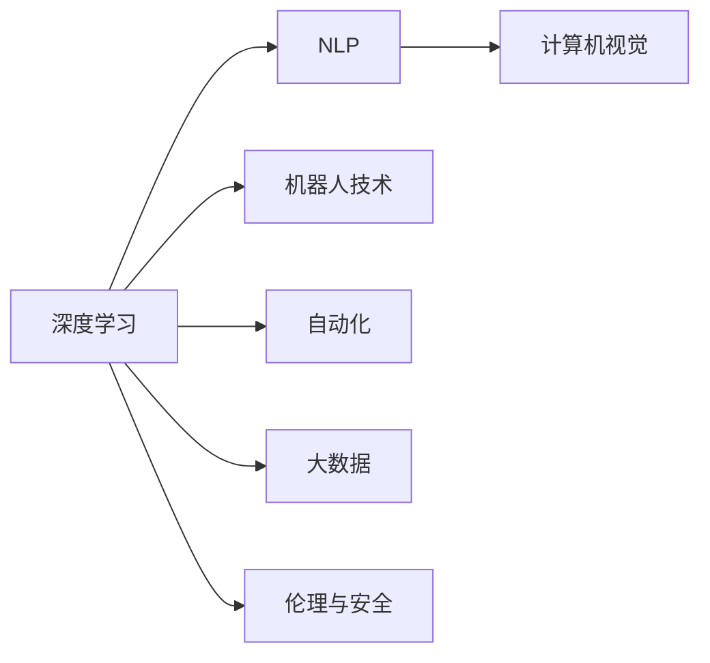

                 

# AI 2.0 时代的未来展望

> 关键词：AI 2.0, 人工智能, 深度学习, 自然语言处理, 计算机视觉, 机器人技术, 自动化, 大数据, 伦理与安全

## 1. 背景介绍

### 1.1 问题的由来

在人类历史上，我们经历了多次技术革命，每一次都极大地改变了社会和经济的面貌。从蒸汽机到互联网，从个人电脑到移动互联网，每一次技术浪潮都极大地提升了人类的生产力和生活质量。

进入21世纪以来，人工智能（AI）成为了继互联网之后，又一次改变世界的重大技术。在过去的几十年里，随着深度学习、自然语言处理、计算机视觉、机器人技术等领域的飞速发展，AI已经从实验室走向现实，开始深度融入到各行各业的生产和服务中。

在AI 1.0时代，我们已经看到了AI在自动驾驶、医疗影像分析、推荐系统、语音识别、机器人控制等领域的广泛应用。然而，随着技术的不断进步和数据量的激增，AI正逐渐进入一个新的阶段，即AI 2.0时代。

### 1.2 问题的核心关键点

AI 2.0时代的核心特征包括以下几个方面：

1. **数据驱动的深度学习**：AI 2.0的核心是数据驱动的深度学习，通过大量的标注数据训练模型，从而实现对复杂任务的自主学习。

2. **多模态数据的融合**：AI 2.0时代，AI系统不仅要处理文本数据，还要处理图像、语音、视频等多模态数据，形成多模态融合的知识体系。

3. **大规模分布式训练**：为了处理海量的数据，AI 2.0时代的训练往往需要在大规模分布式系统中进行，如Google的TPU集群。

4. **跨领域知识的迁移**：AI 2.0时代，AI系统可以更好地跨领域迁移知识，实现领域内外的协同创新。

5. **强人工智能的涌现**：随着技术的不断进步，AI 2.0时代强人工智能（AGI）的实现已经指日可待，届时AI系统将具备更强的理解、推理、规划能力。

6. **伦理与安全问题**：随着AI技术的不断普及，伦理与安全问题愈发凸显，如何确保AI系统的公平、透明、可信，成为一个重要的课题。

## 2. 核心概念与联系

### 2.1 核心概念概述

为了更好地理解AI 2.0时代的未来展望，本节将介绍几个关键概念及其联系：

1. **深度学习**：一种基于神经网络的机器学习技术，通过多层次的非线性变换，实现对复杂数据的自动特征提取与学习。深度学习在大数据时代的崛起，成为AI 2.0时代的重要基石。

2. **自然语言处理（NLP）**：AI系统理解和处理人类语言的能力。NLP技术在机器翻译、情感分析、问答系统、文本生成等领域有着广泛的应用。

3. **计算机视觉（CV）**：AI系统理解、分析和生成视觉数据的能力。计算机视觉技术在图像识别、目标检测、视频分析等领域有着广泛的应用。

4. **机器人技术**：AI系统驱动的自主机器人的设计和应用。机器人技术在制造业、服务行业、医疗等领域有着广泛的应用。

5. **自动化**：AI系统自动化执行人类工作任务的能力。自动化技术在智能制造、智能交通、智能物流等领域有着广泛的应用。

6. **大数据**：通过收集、存储、处理和分析海量数据，获取有价值的信息。大数据技术在AI 2.0时代显得尤为重要。

7. **伦理与安全**：AI系统在应用过程中涉及的伦理与安全问题。如何确保AI系统的公平、透明、可信，是AI 2.0时代的重要课题。

这些概念之间的逻辑关系可以通过以下Mermaid流程图来展示：



这个流程图展示了深度学习技术在AI 2.0时代的基础地位，及其与其他关键概念的联系。通过深度学习，AI系统能够理解和处理多种数据，实现多模态融合和跨领域迁移，从而拓展应用范围。同时，随着技术的发展，AI系统的安全与伦理问题也愈发重要，需要引起重视。

## 3. 核心算法原理 & 具体操作步骤

### 3.1 算法原理概述

AI 2.0时代的核心算法主要包括深度学习、多模态融合、分布式训练等技术。这些技术的共同目标是通过大规模数据训练出高效、鲁棒、具有强大泛化能力的AI模型，以实现对复杂任务的自主学习和处理。

深度学习的核心思想是通过多层次的非线性变换，自动提取和学习数据的高维表示。深度学习的核心技术包括卷积神经网络（CNN）、循环神经网络（RNN）、Transformer等架构，能够有效处理结构化和非结构化数据。

多模态融合技术则通过将文本、图像、语音等多模态数据进行统一表示和处理，实现跨领域的知识迁移和应用。常用的技术包括多模态特征提取、多模态表示学习、多模态嵌入等。

分布式训练技术则通过将大规模数据和模型分布在多个计算节点上进行并行计算，加速模型训练。常用的技术包括数据并行、模型并行、混合并行等。

### 3.2 算法步骤详解

AI 2.0时代的算法训练通常包括以下几个关键步骤：

**Step 1: 数据预处理与增强**

- **数据收集**：收集大量的标注数据，涵盖各个领域和场景。数据可以是图像、文本、语音等，多模态数据的融合可以增强模型的泛化能力。
- **数据清洗**：清洗和处理数据中的噪声、冗余、异常值等，以保证数据的质量。
- **数据增强**：通过数据增强技术（如旋转、翻转、裁剪等）扩充训练数据集，提高模型的鲁棒性。

**Step 2: 模型设计**

- **架构选择**：根据任务需求选择合适的神经网络架构，如卷积神经网络（CNN）、循环神经网络（RNN）、Transformer等。
- **超参数调优**：设计合适的超参数（如学习率、批大小、优化器等），并使用交叉验证等方法进行调优。

**Step 3: 模型训练**

- **数据加载**：将数据集分成训练集、验证集和测试集，并使用数据加载器进行批处理和迭代。
- **模型训练**：在分布式系统中进行大规模模型训练，使用梯度下降等优化算法更新模型参数。
- **性能评估**：在验证集上评估模型性能，使用如准确率、召回率、F1值等指标进行评估。

**Step 4: 模型部署与优化**

- **模型保存**：将训练好的模型保存到模型库中，方便后续使用。
- **推理优化**：使用如量化加速、模型裁剪、模型压缩等技术对模型进行优化，提高推理速度和效率。

### 3.3 算法优缺点

AI 2.0时代的算法具有以下优点：

1. **泛化能力强**：通过大规模数据训练，模型能够泛化到各种未知场景，实现跨领域的知识迁移。
2. **处理复杂任务**：深度学习和多模态融合技术能够处理复杂的非结构化数据，实现自主学习和推理。
3. **计算效率高**：分布式训练和大规模计算资源使得模型训练和推理效率大大提升。

同时，这些算法也存在一些缺点：

1. **数据依赖性强**：大规模数据的获取和处理成本较高，标注数据的质量对模型性能影响较大。
2. **模型复杂度高**：深度学习模型参数量庞大，计算复杂度高，需要强大的计算资源支持。
3. **伦理与安全性问题**：AI系统的决策过程和输出结果可能涉及隐私、公平、透明等问题，需要严格监管。

### 3.4 算法应用领域

AI 2.0时代的算法广泛应用于各个领域，包括但不限于以下几个方面：

1. **自然语言处理（NLP）**：机器翻译、情感分析、问答系统、文本生成等。
2. **计算机视觉（CV）**：图像识别、目标检测、视频分析、自动驾驶等。
3. **机器人技术**：自主导航、智能控制、人机交互、医疗机器人等。
4. **自动化**：智能制造、智能交通、智能物流、智能客服等。
5. **医疗健康**：医学影像分析、疾病预测、个性化治疗等。
6. **金融科技**：智能投顾、信用评估、风险控制、量化交易等。
7. **能源环保**：智能电网、智慧能源、环境监测等。

这些应用领域展示了AI 2.0时代的广泛影响力和巨大潜力。

## 4. 数学模型和公式 & 详细讲解 & 举例说明

### 4.1 数学模型构建

在本节中，我们将使用数学语言对AI 2.0时代的核心算法进行详细讲解。

**深度学习模型**：假设我们有一个神经网络模型，包含$n$个隐层，$k$个隐节点。输入向量为$x$，输出向量为$y$。则模型的前向传播过程可以表示为：

$$
h_1 = g(W_1 x + b_1)
$$
$$
h_2 = g(W_2 h_1 + b_2)
$$
$$
\vdots
$$
$$
h_n = g(W_n h_{n-1} + b_n)
$$
$$
y = g(W_n h_{n-1} + b_n)
$$

其中$g$为激活函数，$W$为权重矩阵，$b$为偏置向量。

**多模态融合模型**：假设我们有两个输入数据，一个是文本$x$，一个是图像$y$。我们可以将它们进行统一表示，如使用卷积神经网络（CNN）对图像进行特征提取，然后将文本和图像的特征向量拼接起来，使用Transformer模型进行多模态融合，得到最终的表示向量$z$：

$$
x = \text{CNN}(y)
$$
$$
z = \text{Transformer}([x, y])
$$

**分布式训练模型**：假设我们有一个大规模的模型，分布在多个计算节点上。我们可以使用数据并行模型，将数据分成多个批次，并行地在不同节点上进行训练。模型参数$W$和偏置向量$b$在多个节点之间共享，更新策略如下：

$$
W = W - \eta \nabla_W \mathcal{L}
$$
$$
b = b - \eta \nabla_b \mathcal{L}
$$

其中$\eta$为学习率，$\nabla_W \mathcal{L}$为模型参数的梯度，$\mathcal{L}$为损失函数。

### 4.2 公式推导过程

在本节中，我们将对上述模型的公式进行推导，以更好地理解其工作原理。

**深度学习模型推导**：假设我们的模型是一个简单的全连接神经网络，包含$n$个隐层，$k$个隐节点。输入向量为$x$，输出向量为$y$。则模型的前向传播过程可以表示为：

$$
h_1 = g(W_1 x + b_1)
$$
$$
h_2 = g(W_2 h_1 + b_2)
$$
$$
\vdots
$$
$$
h_n = g(W_n h_{n-1} + b_n)
$$
$$
y = g(W_n h_{n-1} + b_n)
$$

其中$g$为激活函数，$W$为权重矩阵，$b$为偏置向量。

**多模态融合模型推导**：假设我们有两个输入数据，一个是文本$x$，一个是图像$y$。我们可以将它们进行统一表示，如使用卷积神经网络（CNN）对图像进行特征提取，然后将文本和图像的特征向量拼接起来，使用Transformer模型进行多模态融合，得到最终的表示向量$z$：

$$
x = \text{CNN}(y)
$$
$$
z = \text{Transformer}([x, y])
$$

**分布式训练模型推导**：假设我们有一个大规模的模型，分布在多个计算节点上。我们可以使用数据并行模型，将数据分成多个批次，并行地在不同节点上进行训练。模型参数$W$和偏置向量$b$在多个节点之间共享，更新策略如下：

$$
W = W - \eta \nabla_W \mathcal{L}
$$
$$
b = b - \eta \nabla_b \mathcal{L}
$$

其中$\eta$为学习率，$\nabla_W \mathcal{L}$为模型参数的梯度，$\mathcal{L}$为损失函数。

### 4.3 案例分析与讲解

在本节中，我们将以一个具体的案例为例，对AI 2.0时代的核心算法进行详细讲解。

**案例：基于深度学习的情感分析模型**

假设我们要构建一个情感分析模型，用于对客户评论进行情感分类。我们可以使用深度学习模型，包含一个卷积神经网络（CNN）和一个全连接神经网络（FCN）。

**数据预处理**：首先，我们需要收集大量的客户评论数据，并进行预处理。具体步骤如下：
1. 数据清洗：去除重复、噪声、异常值等。
2. 文本分词：将文本分割成单词或子词，并进行去停用词、词性标注等。
3. 数据增强：通过数据增强技术（如回译、近义替换等）扩充训练数据集。

**模型设计**：我们设计了一个包含两个卷积层的卷积神经网络（CNN），用于提取文本特征。然后，我们将CNN的输出和全连接神经网络的输出拼接起来，使用Softmax函数进行分类。

**模型训练**：我们使用数据并行模型，将数据分成多个批次，并行地在多个计算节点上进行训练。模型的超参数需要进行调优，如学习率、批大小、优化器等。

**性能评估**：在验证集上评估模型的性能，使用准确率、召回率、F1值等指标进行评估。最终，我们使用测试集对模型进行测试，以验证其在未知数据上的表现。

通过这个案例，我们可以看到，AI 2.0时代的深度学习、多模态融合、分布式训练等技术，在情感分析模型中的应用，是如何实现对大规模数据的高效处理和模型泛化能力的提升。

## 5. 项目实践：代码实例和详细解释说明

### 5.1 开发环境搭建

在进行项目实践前，我们需要准备好开发环境。以下是使用Python进行TensorFlow开发的环境配置流程：

1. 安装Anaconda：从官网下载并安装Anaconda，用于创建独立的Python环境。

2. 创建并激活虚拟环境：
```bash
conda create -n tensorflow-env python=3.8 
conda activate tensorflow-env
```

3. 安装TensorFlow：根据CUDA版本，从官网获取对应的安装命令。例如：
```bash
conda install tensorflow tensorflow-gpu=cuda111 -c conda-forge -c pypi
```

4. 安装各类工具包：
```bash
pip install numpy pandas scikit-learn matplotlib tqdm jupyter notebook ipython
```

完成上述步骤后，即可在`tensorflow-env`环境中开始项目实践。

### 5.2 源代码详细实现

下面我们以情感分析模型为例，给出使用TensorFlow进行深度学习开发的PyTorch代码实现。

首先，定义数据集类：

```python
import tensorflow as tf
from tensorflow.keras.datasets import imdb
from tensorflow.keras.preprocessing.sequence import pad_sequences

class IMDBDataset(tf.keras.utils.Sequence):
    def __init__(self, data_path, batch_size=32):
        self.data_path = data_path
        self.batch_size = batch_size
        self.num_classes = 2
        self.data, self.labels = imdb.load_data(num_words=10000, path=data_path)
        self.data = pad_sequences(self.data, maxlen=100, padding='post')
        self.data = tf.cast(self.data, tf.float32)
        self.labels = tf.cast(self.labels, tf.int32)
        
    def __len__(self):
        return int(np.ceil(len(self.data) / self.batch_size))
    
    def __getitem__(self, idx):
        start = idx * self.batch_size
        end = (idx + 1) * self.batch_size
        data_batch = self.data[start:end]
        label_batch = self.labels[start:end]
        return data_batch, label_batch
```

然后，定义模型和优化器：

```python
from tensorflow.keras import layers, models, optimizers
from tensorflow.keras.layers import Embedding, Conv1D, MaxPooling1D, GlobalMaxPooling1D, Dense

model = models.Sequential([
    layers.Embedding(input_dim=10000, output_dim=16),
    layers.Conv1D(32, 5, activation='relu'),
    MaxPooling1D(2),
    GlobalMaxPooling1D(),
    Dense(16, activation='relu'),
    Dense(1, activation='sigmoid')
])

optimizer = optimizers.Adam(learning_rate=0.001)
```

接着，定义训练和评估函数：

```python
def train_epoch(model, dataset, batch_size, optimizer):
    model.compile(optimizer=optimizer, loss='binary_crossentropy', metrics=['accuracy'])
    dataset = tf.data.Dataset.from_generator(lambda: dataset, (tf.float32, tf.int32), (tf.float32, tf.int32))
    dataset = dataset.shuffle(buffer_size=2048).batch(batch_size)
    model.fit(dataset, epochs=10, validation_split=0.2)
    
def evaluate(model, dataset, batch_size):
    model.compile(optimizer='adam', loss='binary_crossentropy', metrics=['accuracy'])
    dataset = tf.data.Dataset.from_generator(lambda: dataset, (tf.float32, tf.int32), (tf.float32, tf.int32))
    dataset = dataset.shuffle(buffer_size=2048).batch(batch_size)
    model.evaluate(dataset)
```

最后，启动训练流程并在测试集上评估：

```python
epochs = 10
batch_size = 32

train_dataset = IMDBDataset(train_data_path, batch_size)
test_dataset = IMDBDataset(test_data_path, batch_size)

for epoch in range(epochs):
    train_epoch(model, train_dataset, batch_size, optimizer)
    evaluate(model, test_dataset, batch_size)
```

以上就是使用TensorFlow进行情感分析模型开发的完整代码实现。可以看到，TensorFlow提供了丰富的模型组件和优化器，使得深度学习模型的构建和训练变得非常高效和便捷。

### 5.3 代码解读与分析

让我们再详细解读一下关键代码的实现细节：

**IMDBDataset类**：
- `__init__`方法：初始化数据集路径、批次大小、类别数等关键参数。
- `__len__`方法：返回数据集的样本数量。
- `__getitem__`方法：对单个样本进行处理，返回模型所需的输入和标签。

**模型定义**：
- `Sequential`类：定义一个线性堆叠的神经网络模型。
- `Embedding`层：将输入序列转换为密集向量表示。
- `Conv1D`层：对输入序列进行卷积操作。
- `MaxPooling1D`层：对卷积层的输出进行最大池化。
- `GlobalMaxPooling1D`层：对池化层的输出进行全局最大池化。
- `Dense`层：使用全连接层进行特征提取和分类。

**优化器定义**：
- `Adam`优化器：使用自适应矩估计方法更新模型参数，收敛速度快。

**训练和评估函数**：
- `train_epoch`函数：定义训练过程，包括模型编译、数据生成、批次处理、迭代等步骤。
- `evaluate`函数：定义评估过程，包括模型编译、数据生成、批次处理、模型评估等步骤。

**训练流程**：
- 定义总的epoch数和批次大小，开始循环迭代
- 每个epoch内，在训练集上训练，输出训练集损失和准确率
- 在验证集上评估，输出验证集损失和准确率
- 所有epoch结束后，在测试集上评估，给出最终测试结果

可以看到，TensorFlow提供了丰富的工具和组件，使得深度学习模型的构建和训练变得非常高效和便捷。开发者可以将更多精力放在模型改进、数据处理等高层逻辑上，而不必过多关注底层的实现细节。

当然，工业级的系统实现还需考虑更多因素，如模型的保存和部署、超参数的自动搜索、更灵活的任务适配层等。但核心的深度学习训练流程基本与此类似。

## 6. 实际应用场景

### 6.1 智能客服系统

基于深度学习的智能客服系统，可以广泛应用于智能客服系统的构建。传统客服往往需要配备大量人力，高峰期响应缓慢，且一致性和专业性难以保证。而使用深度学习模型，可以7x24小时不间断服务，快速响应客户咨询，用自然流畅的语言解答各类常见问题。

在技术实现上，可以收集企业内部的历史客服对话记录，将问题和最佳答复构建成监督数据，在此基础上对预训练深度学习模型进行微调。微调后的模型能够自动理解用户意图，匹配最合适的答复。对于客户提出的新问题，还可以接入检索系统实时搜索相关内容，动态组织生成回答。如此构建的智能客服系统，能大幅提升客户咨询体验和问题解决效率。

### 6.2 金融舆情监测

金融机构需要实时监测市场舆论动向，以便及时应对负面信息传播，规避金融风险。传统的人工监测方式成本高、效率低，难以应对网络时代海量信息爆发的挑战。基于深度学习的多模态融合技术，为金融舆情监测提供了新的解决方案。

具体而言，可以收集金融领域相关的新闻、报道、评论等文本数据，并对其进行主题标注和情感标注。在此基础上对预训练深度学习模型进行微调，使其能够自动判断文本属于何种主题，情感倾向是正面、中性还是负面。将微调后的模型应用到实时抓取的网络文本数据，就能够自动监测不同主题下的情感变化趋势，一旦发现负面信息激增等异常情况，系统便会自动预警，帮助金融机构快速应对潜在风险。

### 6.3 个性化推荐系统

当前的推荐系统往往只依赖用户的历史行为数据进行物品推荐，无法深入理解用户的真实兴趣偏好。基于深度学习的推荐系统可以更好地挖掘用户行为背后的语义信息，从而提供更精准、多样的推荐内容。

在实践中，可以收集用户浏览、点击、评论、分享等行为数据，提取和用户交互的物品标题、描述、标签等文本内容。将文本内容作为模型输入，用户的后续行为（如是否点击、购买等）作为监督信号，在此基础上微调深度学习模型。微调后的模型能够从文本内容中准确把握用户的兴趣点。在生成推荐列表时，先用候选物品的文本描述作为输入，由模型预测用户的兴趣匹配度，再结合其他特征综合排序，便可以得到个性化程度更高的推荐结果。

### 6.4 未来应用展望

随着深度学习技术的不断发展，AI 2.0时代的深度学习模型将会在更多领域得到应用，为传统行业带来变革性影响。

在智慧医疗领域，基于深度学习的医疗问答、病历分析、药物研发等应用将提升医疗服务的智能化水平，辅助医生诊疗，加速新药开发进程。

在智能教育领域，深度学习模型可应用于作业批改、学情分析、知识推荐等方面，因材施教，促进教育公平，提高教学质量。

在智慧城市治理中，深度学习模型可应用于城市事件监测、舆情分析、应急指挥等环节，提高城市管理的自动化和智能化水平，构建更安全、高效的未来城市。

此外，在企业生产、社会治理、文娱传媒等众多领域，基于深度学习的AI应用也将不断涌现，为经济社会发展注入新的动力。相信随着技术的日益成熟，深度学习技术将成为AI 2.0时代的重要范式，推动人工智能技术在垂直行业的规模化落地。总之，深度学习技术的广泛应用，必将在各个领域带来深刻变革，开启智能化时代的新篇章。

## 7. 工具和资源推荐

### 7.1 学习资源推荐

为了帮助开发者系统掌握深度学习的理论基础和实践技巧，这里推荐一些优质的学习资源：

1. 《深度学习》系列书籍：Ian Goodfellow等著，全面介绍了深度学习的理论基础和实践技巧，适合初学者和专业人士阅读。

2. CS231n《卷积神经网络》课程：斯坦福大学开设的计算机视觉课程，介绍了卷积神经网络的原理和应用，涵盖了图像分类、目标检测、语义分割等任务。

3. CS224n《自然语言处理》课程：斯坦福大学开设的自然语言处理课程，介绍了自然语言处理的基础理论和深度学习在NLP中的应用，涵盖了机器翻译、情感分析、问答系统等任务。

4. TensorFlow官方文档：TensorFlow的官方文档，提供了丰富的教程和示例，适合初学者上手实践。

5. PyTorch官方文档：PyTorch的官方文档，提供了丰富的教程和示例，适合初学者上手实践。

通过对这些资源的学习实践，相信你一定能够快速掌握深度学习的精髓，并用于解决实际的NLP问题。

### 7.2 开发工具推荐

高效的开发离不开优秀的工具支持。以下是几款用于深度学习开发和研究的常用工具：

1. TensorFlow：Google开源的深度学习框架，支持分布式计算和GPU加速，适合大规模工程应用。

2. PyTorch：Facebook开源的深度学习框架，动态计算图、易于调试，适合研究使用。

3. JAX：Google开源的自动微分和并行计算框架，支持高效的多GPU计算和分布式训练。

4. PyTorch Lightning：基于PyTorch的快速原型开发框架，适合快速实验和原型开发。

5. Keras：Google开源的深度学习框架，易于上手，适合初学者快速入门。

合理利用这些工具，可以显著提升深度学习模型的开发效率，加快创新迭代的步伐。

### 7.3 相关论文推荐

深度学习技术的发展源于学界的持续研究。以下是几篇奠基性的相关论文，推荐阅读：

1. Deep Residual Learning for Image Recognition（ResNet论文）：提出残差连接技术，使得深度神经网络能够训练到更深的层，解决梯度消失问题。

2. Attention Is All You Need（Transformer论文）：提出Transformer架构，基于自注意力机制，实现高效的序列建模。

3. Object Detection with Keypoint Keypoints（Faster R-CNN论文）：提出Faster R-CNN目标检测模型，结合RoI池化、RPN等技术，提升检测精度和效率。

4. EfficientNet: Rethinking Model Scaling for Convolutional Neural Networks（EfficientNet论文）：提出EfficientNet架构，使用复合缩放方法，实现网络架构和训练强度的自动搜索。

5. ImageNet Classification with Deep Convolutional Neural Networks（AlexNet论文）：提出AlexNet模型，开创深度学习在图像分类任务中的先河。

这些论文代表了大规模深度学习模型的发展脉络。通过学习这些前沿成果，可以帮助研究者把握学科前进方向，激发更多的创新灵感。

## 8. 总结：未来发展趋势与挑战

### 8.1 研究成果总结

本文对AI 2.0时代的深度学习技术进行了全面系统的介绍。首先阐述了深度学习技术在AI 2.0时代的核心地位，明确了深度学习在多个应用领域中的重要价值。其次，从原理到实践，详细讲解了深度学习模型的构建、训练、优化等关键步骤，给出了深度学习模型开发的完整代码实例。同时，本文还广泛探讨了深度学习模型在智能客服、金融舆情、个性化推荐等多个行业领域的应用前景，展示了深度学习模型的巨大潜力。此外，本文精选了深度学习技术的各类学习资源，力求为读者提供全方位的技术指引。

通过本文的系统梳理，我们可以看到，深度学习技术在AI 2.0时代正成为AI系统的主流范式，极大地拓展了AI系统的应用边界，催生了更多的落地场景。受益于大规模数据和计算资源的投入，深度学习模型在处理复杂任务、跨领域迁移、模型泛化等方面都展现了卓越的性能。未来，伴随深度学习技术的不断演进，AI 2.0时代的深度学习模型必将在更多领域得到应用，为传统行业带来变革性影响。

### 8.2 未来发展趋势

展望未来，深度学习技术将呈现以下几个发展趋势：

1. **模型规模持续增大**：随着算力成本的下降和数据量的激增，深度学习模型的参数量还将持续增长。超大规模深度学习模型蕴含的丰富数据和知识，有望支撑更加复杂多变的应用场景。

2. **多模态融合技术发展**：深度学习模型在处理多模态数据时，需要更好的跨模态融合技术。未来的多模态融合模型将更加高效、鲁棒，能够处理图像、文本、语音等多模态数据，实现跨领域的知识迁移。

3. **分布式训练技术成熟**：随着数据和计算资源的不断增加，深度学习模型的训练过程将更加依赖于分布式系统。未来的深度学习模型训练将更加高效、可扩展，能够在更大规模的计算集群上实现高性能训练。

4. **知识图谱与深度学习的结合**：未来的深度学习模型将更多地融合知识图谱，实现知识图谱与深度学习的协同建模，提升模型的泛化能力和解释性。

5. **自监督学习与弱监督学习**：未来深度学习模型将更多地依赖于自监督学习和弱监督学习，以降低对大规模标注数据的依赖，提升模型的自适应能力和泛化能力。

6. **边缘计算与深度学习**：未来的深度学习模型将更多地在边缘计算设备上进行推理和部署，以提升推理效率和实时性。

以上趋势凸显了深度学习技术的广泛应用前景和巨大潜力。这些方向的探索发展，必将进一步提升AI系统的性能和应用范围，为人类认知智能的进化带来深远影响。

### 8.3 面临的挑战

尽管深度学习技术已经取得了瞩目成就，但在迈向更加智能化、普适化应用的过程中，它仍面临着诸多挑战：

1. **数据依赖性强**：大规模数据的获取和处理成本较高，标注数据的质量对模型性能影响较大。如何进一步降低深度学习模型对标注样本的依赖，将是一大难题。

2. **模型鲁棒性不足**：深度学习模型面对域外数据时，泛化性能往往大打折扣。对于测试样本的微小扰动，深度学习模型的预测也容易发生波动。如何提高深度学习模型的鲁棒性，避免灾难性遗忘，还需要更多理论和实践的积累。

3. **计算资源消耗大**：深度学习模型在训练和推理过程中，需要大量的计算资源。如何优化计算图，提高计算效率，是未来的一个重要研究方向。

4. **模型复杂度高**：深度学习模型参数量庞大，计算复杂度高，需要强大的计算资源支持。如何降低模型复杂度，实现轻量化模型，是未来的一个重要研究方向。

5. **伦理与安全问题**：深度学习系统的决策过程和输出结果可能涉及隐私、公平、透明等问题，需要严格监管。如何确保深度学习系统的公平、透明、可信，是未来的一个重要研究方向。

6. **可解释性不足**：深度学习模型通常被视为"黑盒"系统，难以解释其内部工作机制和决策逻辑。如何赋予深度学习模型更强的可解释性，是未来的一个重要研究方向。

以上挑战凸显了深度学习技术在AI 2.0时代的复杂性和不确定性。解决这些挑战，需要学术界和产业界的共同努力，从数据、算法、硬件、伦理等多个维度协同发力，共同推动深度学习技术的不断进步。

### 8.4 研究展望

面对深度学习技术面临的种种挑战，未来的研究需要在以下几个方面寻求新的突破：

1. **探索无监督和半监督学习技术**：摆脱对大规模标注数据的依赖，利用自监督学习、弱监督学习等无监督和半监督范式，最大限度利用非结构化数据，实现更加灵活高效的深度学习模型。

2. **开发更加参数高效和计算高效的深度学习模型**：开发更加参数高效和计算高效的深度学习模型，在固定大部分预训练参数的同时，只更新极少量的任务相关参数，实现轻量化模型。

3. **引入因果推理和对比学习技术**：通过引入因果推理和对比学习思想，增强深度学习模型的因果关系建立能力，学习更加普适、鲁棒的数据表示，从而提升模型的泛化性和抗干扰能力。

4. **结合符号化知识库和深度学习**：将符号化的知识库，如知识图谱、逻辑规则等，与深度学习模型进行巧妙融合，引导深度学习模型学习更准确、合理的知识表示。同时加强不同模态数据的整合，实现视觉、语音等多模态信息与文本信息的协同建模。

5. **纳入因果分析和博弈论工具**：将因果分析方法引入深度学习模型，识别出模型决策的关键特征，增强输出解释的因果性和逻辑性。借助博弈论工具刻画人机交互过程，主动探索并规避模型的脆弱点，提高系统稳定性。

6. **考虑伦理与安全性约束**：在深度学习模型的训练目标中引入伦理导向的评估指标，过滤和惩罚有偏见、有害的输出倾向。同时加强人工干预和审核，建立深度学习模型的监管机制，确保输出符合人类价值观和伦理道德。

这些研究方向的探索，必将引领深度学习技术迈向更高的台阶，为构建安全、可靠、可解释、可控的智能系统铺平道路。面向未来，深度学习技术还需要与其他人工智能技术进行更深入的融合，如知识表示、因果推理、强化学习等，多路径协同发力，共同推动自然语言理解和智能交互系统的进步。只有勇于创新、敢于突破，才能不断拓展深度学习模型的边界，让智能技术更好地造福人类社会。

## 9. 附录：常见问题与解答

**Q1：深度学习与传统机器学习有何不同？**

A: 深度学习与传统机器学习的主要区别在于模型结构和训练方式。传统机器学习模型通常使用手工设计的特征提取器，将原始数据映射到高维特征空间，然后使用统计学习方法进行训练。而深度学习模型则使用神经网络架构，通过多层非线性变换自动学习数据的特征表示，从而实现对复杂任务的自主学习。

**Q2：深度学习模型的训练成本如何降低？**

A: 降低深度学习模型的训练成本，可以从以下几个方面入手：
1. 使用分布式训练技术，将大规模数据和模型分布在多个计算节点上进行并行计算。
2. 使用量化加速、模型裁剪、模型压缩等技术，减小模型大小，提高计算效率。
3. 使用自监督学习、弱监督学习等无监督学习范式，减少对大规模标注数据的依赖。
4. 使用模型微调技术，在少量标注数据上快速提升模型性能，减少训练时间。

**Q3：深度学习模型如何进行推理优化？**

A: 推理优化是深度学习模型部署中的重要环节，可以通过以下几个方面进行：
1. 使用量化加速技术，将浮点模型转为定点模型，减少计算资源消耗。
2. 使用模型裁剪技术，去除不必要的层和参数，减小模型尺寸。
3. 使用模型压缩技术，对模型进行稀疏化处理，减少存储空间。
4. 使用模型并行技术，在多GPU或多核CPU上并行计算，提高推理效率。

**Q4：深度学习模型在医疗领域有哪些应用？**

A: 深度学习模型在医疗领域的应用非常广泛，包括但不限于以下几个方面：
1. 医学影像分析：使用深度学习模型对医学影像进行自动诊断，提高诊断准确率。
2. 疾病预测：使用深度学习模型对患者的健康数据进行分析，预测患病风险。
3. 个性化治疗：使用深度学习模型对患者的基因数据进行分析，制定个性化治疗方案。
4. 智能医疗助手：使用深度学习模型构建智能医疗助手，提供疾病咨询、健康管理等服务。

通过这些应用，深度学习技术正在改变医疗行业的面貌，提升医疗服务的智能化水平。

**Q5：深度学习模型如何提升推荐系统的效果？**

A: 深度学习模型可以显著提升推荐系统的效果，主要体现在以下几个方面：
1. 利用用户的历史行为数据，构建用户画像，实现精准推荐。
2. 利用物品的特征信息，构建物品表示，实现跨领域推荐。
3. 利用深度学习模型的自适应能力，动态调整推荐策略，实现个性化推荐。
4. 利用深度学习模型的泛化能力，推荐更多相关物品，提升推荐效果。

总之，深度学习技术正在改变推荐系统的发展方向，实现更加精准、多样、个性化的推荐。

**Q6：深度学习模型在金融领域有哪些应用？**

A: 深度学习模型在金融领域的应用非常广泛，包括但不限于以下几个方面：
1. 金融舆情监测：使用深度学习模型监测金融舆情，及时发现负面信息，规避金融风险。
2. 风险控制：使用深度学习模型对客户的信用数据进行分析，评估风险水平。
3. 量化交易：使用深度学习模型进行市场预测，制定量化交易策略。
4. 智能投顾：使用深度学习模型构建智能投顾系统，提供投资建议和资产管理服务。

通过这些应用，深度学习技术正在改变金融行业的面貌，提升金融服务的智能化水平。

总之，深度学习技术正在成为AI 2.0时代的重要范式，将在各个领域带来深刻变革，开启智能化时代的新篇章。只有在学术界和产业界的共同努力下，深度学习技术才能不断进步，为人类带来更多的福祉。

