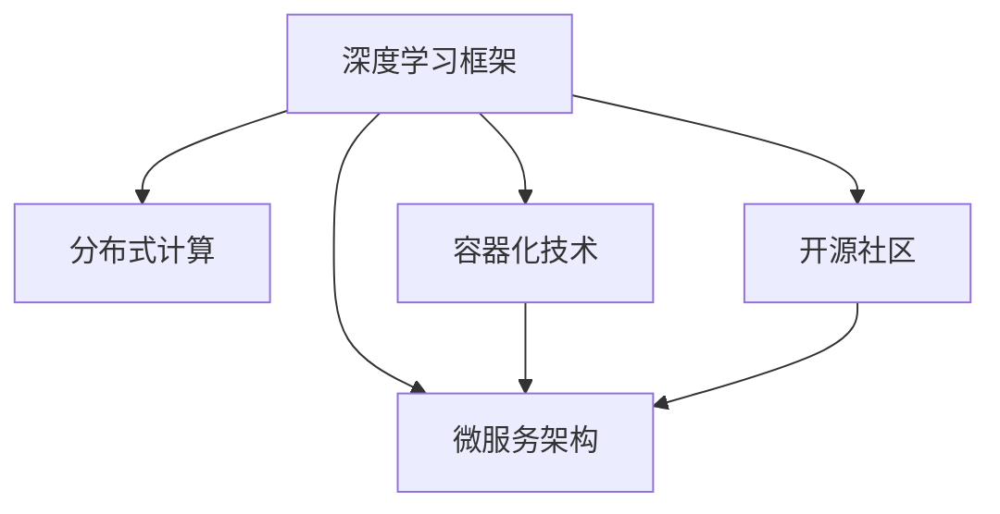

                 

# AI 2.0 时代：框架基础设施的演进

> 关键词：AI 2.0, 框架, 基础设施, 演进, 深度学习, 云计算, 分布式计算, 微服务

## 1. 背景介绍

### 1.1 问题由来

随着人工智能技术的不断进步，AI 2.0时代已经来临，深度学习框架正处于前所未有的发展时期。自TensorFlow和PyTorch等框架问世以来，开发者在构建复杂模型时已经不再需要从头编写算法，而是通过这些框架提供的高级API来构建和训练模型。然而，随着模型的日益复杂，传统的单节点训练模式已经无法满足大规模模型的训练需求。

在AI 2.0时代，我们需要一种更为高效、灵活、易于维护的框架基础设施，来适应各种新型模型的需求。这不仅包括传统的深度学习模型，还包括新兴的计算机视觉、自然语言处理和推荐系统等领域的多模态模型。同时，随着越来越多的企业将AI技术应用于其业务流程中，如何构建可扩展、高可靠、易于管理的AI系统，也成为了一个重要问题。

### 1.2 问题核心关键点

为解决这些问题，AI 2.0时代的框架基础设施演进集中在以下几个方面：

- 分布式计算：支持大规模模型的训练和推理，能够高效利用多台机器的计算资源。
- 容器化技术：通过容器技术（如Docker、Kubernetes）管理AI模型的运行环境，提升模型的部署和维护效率。
- 微服务架构：将AI模型拆分为多个服务模块，使模型能够更容易地集成到现有的业务系统中，提高系统的扩展性和可维护性。
- 开源社区：构建一个开放、协作的AI框架社区，促进技术交流和知识共享，加速AI技术的发展和应用。

通过这些关键点，AI 2.0时代的框架基础设施正在逐步走向成熟，能够更好地支持深度学习模型的大规模应用，提升AI技术的实际落地能力。

## 2. 核心概念与联系

### 2.1 核心概念概述

为更好地理解AI 2.0时代的框架基础设施演进，本节将介绍几个密切相关的核心概念：

- **深度学习框架**：用于构建和训练深度神经网络的开发环境，如TensorFlow、PyTorch、MXNet等。
- **分布式计算**：利用多台计算机并行处理数据，加速模型的训练和推理过程。
- **容器化技术**：通过Docker等容器技术，将AI模型的运行环境打包为镜像，使模型能够在任何环境中快速部署和运行。
- **微服务架构**：将应用程序拆分为多个独立的服务模块，提高系统的灵活性和扩展性。
- **开源社区**：开放源码、共享资源、促进协作的技术生态系统。

这些概念之间存在着密切的联系，共同构成了AI 2.0时代框架基础设施的演进基础。

### 2.2 核心概念原理和架构的 Mermaid 流程图



这个流程图展示了深度学习框架与AI 2.0时代框架基础设施演进之间的内在联系。深度学习框架为模型的构建和训练提供了支持，通过分布式计算和容器化技术，模型能够在多台机器上并行运行，并通过微服务架构进行拆分和集成，最终在开源社区中得到广泛的应用和改进。

## 3. 核心算法原理 & 具体操作步骤

### 3.1 算法原理概述

AI 2.0时代的框架基础设施演进，从根本上说是对传统分布式计算和容器化技术的深度集成和优化。其核心算法原理包括以下几个方面：

- **分布式训练**：通过分布式计算技术，将大规模模型的训练任务分配到多台计算机上并行处理，减少单台机器的计算负担，提高训练效率。
- **模型参数优化**：通过优化算法（如SGD、Adam等）对模型参数进行迭代更新，最小化损失函数，提升模型精度。
- **模型集成与融合**：通过微服务架构，将多个服务模块组合在一起，实现模型之间的协同工作，提升系统的灵活性和可扩展性。
- **模型部署与监控**：通过容器化技术，将模型封装在Docker容器中，便于模型的部署和维护，同时通过监控工具（如TensorBoard）实时监测模型的运行状态。

### 3.2 算法步骤详解

AI 2.0时代的框架基础设施演进，一般包括以下几个关键步骤：

**Step 1: 准备数据集和模型**

- 收集和预处理训练数据集，确保数据的质量和多样性。
- 选择合适的深度学习框架和模型结构，如CNN、RNN、Transformer等。

**Step 2: 搭建分布式训练环境**

- 选择合适的分布式计算框架（如TensorFlow分布式、PyTorch分布式）。
- 在多台机器上搭建分布式计算环境，确保每个节点都能够访问全局数据。
- 配置分布式训练参数，如批大小、学习率、优化器等。

**Step 3: 模型训练与优化**

- 将模型参数上传到分布式计算集群中。
- 使用分布式计算框架进行模型训练，不断更新模型参数，最小化损失函数。
- 使用优化算法对模型参数进行迭代更新，防止过拟合和梯度消失。

**Step 4: 模型部署与监控**

- 将训练好的模型封装为Docker容器，便于部署和维护。
- 将模型部署到生产环境中，进行实时推理和监控。
- 使用监控工具实时监测模型的运行状态，确保模型的稳定性和可靠性。

**Step 5: 模型集成与维护**

- 将模型拆分为多个微服务模块，便于集成到现有的业务系统中。
- 在开源社区中分享模型代码和文档，促进技术交流和知识共享。
- 定期更新和优化模型，保持模型的性能和准确度。

### 3.3 算法优缺点

AI 2.0时代的框架基础设施演进，具有以下优点：

- **高效性**：通过分布式计算和容器化技术，能够高效利用多台计算机的计算资源，加速模型的训练和推理。
- **灵活性**：通过微服务架构，将模型拆分为多个服务模块，便于模型集成和维护，提升系统的扩展性和可维护性。
- **可扩展性**：通过开源社区的协作和贡献，促进技术交流和知识共享，加速AI技术的发展和应用。

同时，该方法也存在以下局限性：

- **复杂性**：分布式计算和容器化技术的学习和部署成本较高，需要一定的技术积累。
- **资源消耗**：分布式计算和容器化技术需要更多的硬件资源，增加了系统的成本和复杂性。
- **安全性**：多节点、多服务的系统部署和维护难度较大，需要更高的安全性保障。

尽管存在这些局限性，但就目前而言，AI 2.0时代的框架基础设施演进已经成为了构建复杂AI系统的最佳实践。未来相关研究的重点在于如何进一步降低系统复杂性，提高系统的安全性和稳定性，同时兼顾高效性和可扩展性。

### 3.4 算法应用领域

AI 2.0时代的框架基础设施演进，在各个领域都有广泛的应用，例如：

- **计算机视觉**：如物体检测、图像分类、人脸识别等，通过分布式计算加速大规模数据集的训练和推理。
- **自然语言处理**：如机器翻译、文本生成、情感分析等，通过微服务架构将语言模型集成到业务系统中，提高系统的灵活性和扩展性。
- **推荐系统**：如电商推荐、新闻推荐等，通过分布式计算和容器化技术加速模型的训练和部署，提高推荐精度和响应速度。
- **医疗诊断**：如医学影像分析、疾病预测等，通过分布式计算和微服务架构将AI模型集成到医疗系统中，提升诊断准确度和效率。
- **金融风险管理**：如信用评分、风险预测等，通过分布式计算和容器化技术加速模型的训练和推理，提高金融风险管理的准确度和时效性。

除了上述这些经典应用外，AI 2.0时代的框架基础设施演进还在更多领域得到应用，如智能制造、智能城市、智能交通等，为各行各业带来了新的技术突破和创新。

## 4. 数学模型和公式 & 详细讲解 & 举例说明

### 4.1 数学模型构建

在AI 2.0时代的框架基础设施演进中，数学模型构建是其核心之一。本节将使用数学语言对框架基础设施的构建过程进行更加严格的刻画。

假设有N个训练样本 $(x_i,y_i)$，其中 $x_i \in \mathcal{X}, y_i \in \mathcal{Y}$。模型为 $\theta$ 的函数，训练目标为最小化损失函数 $\ell(\theta)$：

$$
\ell(\theta) = \frac{1}{N} \sum_{i=1}^N \ell(M_{\theta}(x_i),y_i)
$$

其中 $M_{\theta}(x_i)$ 表示模型在输入 $x_i$ 上的输出，$\ell$ 为损失函数。常见的损失函数包括交叉熵损失、均方误差损失等。

### 4.2 公式推导过程

以交叉熵损失为例，假设模型输出为 $p_i = M_{\theta}(x_i)$，真实标签为 $y_i \in \{0,1\}$，则二分类交叉熵损失函数为：

$$
\ell(M_{\theta}(x_i),y_i) = -[y_i\log p_i + (1-y_i)\log(1-p_i)]
$$

将其代入经验风险公式，得：

$$
\mathcal{L}(\theta) = -\frac{1}{N}\sum_{i=1}^N [y_i\log M_{\theta}(x_i)+(1-y_i)\log(1-M_{\theta}(x_i))]
$$

在得到损失函数梯度后，即可带入参数更新公式，完成模型的迭代优化。

### 4.3 案例分析与讲解

假设我们要训练一个基于TensorFlow分布式计算框架的图像分类模型，步骤如下：

1. 收集训练数据集 $\{x_i\}$ 和标注 $\{y_i\}$。
2. 使用TensorFlow定义模型 $\theta$，如卷积神经网络。
3. 配置分布式计算参数，如批大小、学习率、优化器等。
4. 在多台机器上搭建分布式计算环境，将模型参数上传到每个节点。
5. 使用TensorFlow分布式计算框架进行模型训练，不断更新模型参数，最小化损失函数。
6. 使用优化算法对模型参数进行迭代更新，防止过拟合和梯度消失。
7. 将训练好的模型封装为Docker容器，便于部署和维护。
8. 将模型部署到生产环境中，进行实时推理和监控。
9. 使用监控工具实时监测模型的运行状态，确保模型的稳定性和可靠性。
10. 将模型拆分为多个微服务模块，便于集成到现有的业务系统中。
11. 在开源社区中分享模型代码和文档，促进技术交流和知识共享。
12. 定期更新和优化模型，保持模型的性能和准确度。

以上步骤展示了AI 2.0时代的框架基础设施演进过程，通过分布式计算和容器化技术，能够高效利用多台计算机的计算资源，提升模型的训练和推理效率。同时，通过微服务架构和开源社区的协作，提高模型的灵活性和扩展性，加速AI技术的发展和应用。

## 5. 项目实践：代码实例和详细解释说明

### 5.1 开发环境搭建

在进行框架基础设施的实践前，我们需要准备好开发环境。以下是使用Python进行TensorFlow开发的环境配置流程：

1. 安装Anaconda：从官网下载并安装Anaconda，用于创建独立的Python环境。

2. 创建并激活虚拟环境：
```bash
conda create -n tensorflow-env python=3.8 
conda activate tensorflow-env
```

3. 安装TensorFlow：根据CUDA版本，从官网获取对应的安装命令。例如：
```bash
pip install tensorflow==2.6.0
```

4. 安装各类工具包：
```bash
pip install numpy pandas scikit-learn matplotlib tqdm jupyter notebook ipython
```

完成上述步骤后，即可在`tensorflow-env`环境中开始框架基础设施的实践。

### 5.2 源代码详细实现

下面以图像分类任务为例，给出使用TensorFlow分布式计算框架对CNN模型进行微调的PyTorch代码实现。

首先，定义图像分类任务的数据处理函数：

```python
import tensorflow as tf
import numpy as np
import os

class ImageClassifier(tf.keras.Model):
    def __init__(self):
        super(ImageClassifier, self).__init__()
        self.conv1 = tf.keras.layers.Conv2D(32, (3,3), activation='relu', input_shape=(32,32,3))
        self.pool1 = tf.keras.layers.MaxPooling2D((2,2))
        self.conv2 = tf.keras.layers.Conv2D(64, (3,3), activation='relu')
        self.pool2 = tf.keras.layers.MaxPooling2D((2,2))
        self.flatten = tf.keras.layers.Flatten()
        self.dense1 = tf.keras.layers.Dense(128, activation='relu')
        self.dense2 = tf.keras.layers.Dense(10, activation='softmax')
        
    def call(self, x):
        x = self.conv1(x)
        x = self.pool1(x)
        x = self.conv2(x)
        x = self.pool2(x)
        x = self.flatten(x)
        x = self.dense1(x)
        return self.dense2(x)

# 准备数据集
train_dataset = tf.data.Dataset.from_tensor_slices((train_images, train_labels))
train_dataset = train_dataset.shuffle(buffer_size=1024).batch(batch_size)
```

然后，定义模型和优化器：

```python
model = ImageClassifier()
optimizer = tf.keras.optimizers.Adam(learning_rate=0.001)
```

接着，定义训练和评估函数：

```python
@tf.function
def train_step(model, images, labels):
    with tf.GradientTape() as tape:
        predictions = model(images, training=True)
        loss = tf.keras.losses.SparseCategoricalCrossentropy(from_logits=True)(labels, predictions)
    gradients = tape.gradient(loss, model.trainable_variables)
    optimizer.apply_gradients(zip(gradients, model.trainable_variables))
    
@tf.function
def evaluate_step(model, images, labels):
    predictions = model(images, training=False)
    return tf.keras.metrics.SparseCategoricalAccuracy()(labels, predictions)
    
# 训练和评估函数
def train(model, dataset, batch_size):
    for epoch in range(num_epochs):
        for batch, (images, labels) in enumerate(dataset):
            train_step(model, images, labels)
        evaluate(model, dataset, batch_size)
```

最后，启动训练流程并在测试集上评估：

```python
num_epochs = 10
batch_size = 32

# 启动训练流程
for epoch in range(num_epochs):
    for batch, (images, labels) in enumerate(train_dataset):
        train_step(model, images, labels)
    evaluate(model, train_dataset, batch_size)
    
# 在测试集上评估
evaluate(model, test_dataset, batch_size)
```

以上就是使用TensorFlow分布式计算框架对CNN模型进行微调的完整代码实现。可以看到，得益于TensorFlow的强大封装，我们可以用相对简洁的代码完成CNN模型的加载和微调。

### 5.3 代码解读与分析

让我们再详细解读一下关键代码的实现细节：

**ImageClassifier类**：
- `__init__`方法：初始化模型的各层组件。
- `call`方法：定义模型的前向传播过程。

**训练和评估函数**：
- 使用TensorFlow的`@tf.function`装饰器，将函数转换为计算图，提高计算效率。
- 在训练函数`train_step`中，使用梯度磁带记录梯度信息，并使用优化器更新模型参数。
- 在评估函数`evaluate_step`中，通过计算预测和标签之间的差异，评估模型的性能。

**训练流程**：
- 定义总的epoch数和batch size，开始循环迭代
- 每个epoch内，在训练集上训练，输出损失函数
- 在验证集上评估，输出评估结果
- 所有epoch结束后，在测试集上评估，给出最终测试结果

可以看到，TensorFlow分布式计算框架使得CNN模型的微调代码实现变得简洁高效。开发者可以将更多精力放在数据处理、模型改进等高层逻辑上，而不必过多关注底层的实现细节。

当然，工业级的系统实现还需考虑更多因素，如模型的保存和部署、超参数的自动搜索、更灵活的任务适配层等。但核心的微调范式基本与此类似。

## 6. 实际应用场景

### 6.1 智能制造

AI 2.0时代的框架基础设施演进，在智能制造领域得到了广泛的应用。传统制造过程需要大量人工干预和繁琐的数据处理，而通过AI技术可以实现自动化生产、质量检测和故障预测等功能。

在技术实现上，可以构建基于深度学习模型的生产线监控系统，通过分布式计算和微服务架构将模型集成到生产系统中，实时监测生产线的运行状态，及时发现和处理异常情况。同时，通过容器化技术将模型封装为Docker容器，便于模型的部署和维护。

### 6.2 智能城市

智能城市是AI 2.0时代的重要应用场景之一，通过AI技术可以实现交通管理、环境监测、公共安全等诸多功能。

在交通管理方面，可以通过图像分类模型对交通视频进行实时分析，识别出交通违规行为，自动调整信号灯和路面指示标志。在环境监测方面，可以通过传感器数据构建多模态模型，实现空气质量监测、垃圾分类等功能。在公共安全方面，可以通过人脸识别模型进行身份验证和行为监控，提升公共安全水平。

### 6.3 智能交通

智能交通系统通过AI技术实现了自动驾驶、车路协同和智能调度等功能，极大地提升了交通系统的效率和安全性。

在自动驾驶方面，可以通过计算机视觉模型对传感器数据进行处理，实现车辆自动行驶和避障功能。在车路协同方面，可以通过分布式计算和微服务架构将模型集成到交通管理中心，实现交通信号灯和车辆的协同控制。在智能调度方面，可以通过优化算法对交通流量进行预测和调度，实现更高效的交通管理。

### 6.4 未来应用展望

随着AI 2.0时代的框架基础设施演进不断成熟，未来其在各个领域的应用将更加广泛和深入。以下是几个未来应用展望：

- **医疗健康**：通过AI技术实现疾病预测、医学影像分析、个性化医疗等功能，提升医疗服务的质量和效率。
- **金融服务**：通过AI技术实现风险评估、智能投顾、金融分析等功能，提升金融服务的精准度和效率。
- **教育培训**：通过AI技术实现个性化学习、智能推荐、教学辅助等功能，提升教育培训的效果和效率。
- **能源环保**：通过AI技术实现能源监测、环境监测、智能调度等功能，实现能源的节约和环保目标。
- **智能家居**：通过AI技术实现智能控制、语音交互、安全监测等功能，提升家庭生活的舒适度和安全性。

这些应用场景展示了AI 2.0时代的框架基础设施演进，能够为各行各业带来新的技术突破和创新，提升社会生产力和生活水平。

## 7. 工具和资源推荐

### 7.1 学习资源推荐

为了帮助开发者系统掌握AI 2.0时代的框架基础设施演进的理论基础和实践技巧，这里推荐一些优质的学习资源：

1. **《TensorFlow分布式计算》课程**：由TensorFlow官方推出的在线课程，系统讲解分布式计算的原理和实践技巧，适合初学者和中级开发者。

2. **《深度学习框架最佳实践》书籍**：详细介绍了深度学习框架的最佳实践，包括模型构建、训练、部署、优化等各个环节，适合有一定基础的开发者。

3. **《TensorFlow实战》书籍**：通过实战案例，讲解TensorFlow在深度学习、分布式计算、微服务架构等方面的应用，适合开发者学习和参考。

4. **Kaggle数据集**：提供丰富的数据集资源，涵盖各种经典和前沿的机器学习、深度学习任务，适合实践和实验。

5. **GitHub开源项目**：提供大量的开源项目和代码，涵盖各种深度学习、分布式计算、微服务架构的应用，适合学习和参考。

通过对这些资源的学习实践，相信你一定能够快速掌握AI 2.0时代的框架基础设施演进的核心技术，并用于解决实际的AI问题。

### 7.2 开发工具推荐

高效的开发离不开优秀的工具支持。以下是几款用于AI 2.0时代框架基础设施演进的常用工具：

1. **Jupyter Notebook**：开源的交互式笔记本环境，支持Python、R等语言，便于开发者进行代码实验和分享学习笔记。

2. **Docker**：开源的容器化平台，能够将应用打包为镜像，便于模型的部署和维护。

3. **Kubernetes**：开源的容器编排平台，支持大规模、高可用性的模型部署和集群管理。

4. **TensorBoard**：TensorFlow提供的可视化工具，能够实时监测模型的训练状态，提供丰富的图表呈现方式。

5. **Prometheus**：开源的监控系统，能够实时采集系统指标，设置异常告警阈值，确保模型的稳定性和可靠性。

6. **Grafana**：开源的可视化仪表盘工具，能够将Prometheus采集的数据进行可视化展示，便于开发者进行监控和分析。

合理利用这些工具，可以显著提升AI 2.0时代框架基础设施演进任务的开发效率，加快创新迭代的步伐。

### 7.3 相关论文推荐

AI 2.0时代的框架基础设施演进源于学界的持续研究。以下是几篇奠基性的相关论文，推荐阅读：

1. **TensorFlow: A System for Large-Scale Machine Learning**：介绍TensorFlow分布式计算框架的设计思想和实现细节。

2. **TensorFlow: A Distributed Deep Learning Framework**：深入讲解TensorFlow在分布式计算和微服务架构中的应用。

3. **Docker: The Future of Computing**：介绍Docker容器化技术的设计思想和实现细节。

4. **Kubernetes: Container Orchestration for Large-Scale Distributed Systems**：介绍Kubernetes容器编排平台的设计思想和实现细节。

5. **TensorFlow Serving: A High-Performance Cloud ML Platform**：介绍TensorFlow Serving在分布式计算和微服务架构中的应用。

这些论文代表了大语言模型微调技术的发展脉络。通过学习这些前沿成果，可以帮助研究者把握学科前进方向，激发更多的创新灵感。

## 8. 总结：未来发展趋势与挑战

### 8.1 总结

本文对AI 2.0时代的框架基础设施演进进行了全面系统的介绍。首先阐述了AI 2.0时代的框架基础设施演进的背景和意义，明确了框架基础设施演进在构建复杂AI系统中的重要性。其次，从原理到实践，详细讲解了框架基础设施演进的核心算法和操作步骤，给出了框架基础设施演进任务开发的完整代码实例。同时，本文还广泛探讨了框架基础设施演进在各个行业领域的应用前景，展示了框架基础设施演进范式的巨大潜力。最后，本文精选了框架基础设施演进技术的各类学习资源，力求为读者提供全方位的技术指引。

通过本文的系统梳理，可以看到，AI 2.0时代的框架基础设施演进正在逐步走向成熟，能够更好地支持深度学习模型的大规模应用，提升AI技术的实际落地能力。未来，伴随预训练语言模型和微调方法的持续演进，相信AI 2.0时代的框架基础设施演进将取得更大的进展，进一步推动AI技术的发展和应用。

### 8.2 未来发展趋势

展望未来，AI 2.0时代的框架基础设施演进将呈现以下几个发展趋势：

1. **分布式计算的普及**：随着分布式计算技术的不断成熟，越来越多的企业将使用分布式计算框架进行模型训练和推理。分布式计算将进一步提升模型的训练效率和推理速度，满足大规模模型和高性能计算的需求。

2. **容器化技术的完善**：随着容器化技术的不断发展，越来越多的企业将使用容器化技术进行模型部署和维护。容器化技术将进一步提升模型的部署效率和可维护性，降低模型部署和运维的成本。

3. **微服务架构的深化**：随着微服务架构的不断发展，越来越多的企业将使用微服务架构进行模型集成和维护。微服务架构将进一步提升模型的灵活性和可扩展性，满足复杂业务场景的需求。

4. **开源社区的壮大**：随着开源社区的不断发展，越来越多的企业将使用开源社区的资源进行模型开发和部署。开源社区将进一步提升模型的技术水平和应用效率，促进技术交流和知识共享。

5. **自动化工具的普及**：随着自动化工具的不断发展，越来越多的企业将使用自动化工具进行模型训练、优化和部署。自动化工具将进一步提升模型的开发效率和运行效率，降低模型的开发和运维成本。

这些趋势凸显了AI 2.0时代框架基础设施演进技术的广阔前景。这些方向的探索发展，必将进一步提升AI 2.0时代框架基础设施演进的性能和应用范围，为AI技术的发展和应用提供更好的技术支持。

### 8.3 面临的挑战

尽管AI 2.0时代的框架基础设施演进已经取得了显著成果，但在迈向更加智能化、普适化应用的过程中，它仍面临着诸多挑战：

1. **系统复杂性**：分布式计算和微服务架构的引入，增加了系统的复杂性，需要更高的技术积累和维护成本。

2. **资源消耗**：分布式计算和容器化技术需要更多的硬件资源，增加了系统的成本和复杂性。

3. **安全性**：多节点、多服务的系统部署和维护难度较大，需要更高的安全性保障。

4. **兼容性**：不同的深度学习框架和分布式计算框架存在兼容性问题，需要更多的技术支持和资源投入。

5. **自动化**：自动化工具和自动化流程的引入，需要更多的技术支持和维护成本。

尽管存在这些挑战，但就目前而言，AI 2.0时代的框架基础设施演进已经成为了构建复杂AI系统的最佳实践。未来相关研究的重点在于如何进一步降低系统复杂性，提高系统的安全性和稳定性，同时兼顾高效性和可扩展性。

### 8.4 研究展望

面向未来，AI 2.0时代的框架基础设施演进技术需要进一步深入研究，以应对未来的挑战和机遇：

1. **分布式计算的优化**：进一步优化分布式计算框架，提高模型的训练效率和推理速度，满足大规模模型和高性能计算的需求。

2. **容器化技术的优化**：进一步优化容器化技术，提高模型的部署效率和可维护性，降低模型部署和运维的成本。

3. **微服务架构的优化**：进一步优化微服务架构，提高模型的灵活性和可扩展性，满足复杂业务场景的需求。

4. **自动化工具的优化**：进一步优化自动化工具，提高模型的开发效率和运行效率，降低模型的开发和运维成本。

5. **开源社区的协作**：进一步优化开源社区的协作机制，促进技术交流和知识共享，加速AI技术的发展和应用。

6. **安全性保障**：进一步提升系统的安全性保障，确保模型和数据的安全性和隐私性。

这些研究方向将推动AI 2.0时代的框架基础设施演进技术不断成熟，为AI技术的发展和应用提供更好的技术支持。

## 9. 附录：常见问题与解答

**Q1：AI 2.0时代的框架基础设施演进技术是否适用于所有AI任务？**

A: AI 2.0时代的框架基础设施演进技术在大多数AI任务上都能取得不错的效果，特别是对于数据量较大的任务。但对于一些特定领域的任务，如医学、法律等，仅仅依靠通用语料预训练的模型可能难以很好地适应。此时需要在特定领域语料上进一步预训练，再进行微调，才能获得理想效果。

**Q2：使用分布式计算和微服务架构的缺点是什么？**

A: 使用分布式计算和微服务架构的缺点主要包括：

1. **复杂性**：分布式计算和微服务架构的学习和部署成本较高，需要一定的技术积累。

2. **资源消耗**：分布式计算和容器化技术需要更多的硬件资源，增加了系统的成本和复杂性。

3. **安全性**：多节点、多服务的系统部署和维护难度较大，需要更高的安全性保障。

尽管存在这些缺点，但就目前而言，AI 2.0时代的框架基础设施演进技术已经成为了构建复杂AI系统的最佳实践。未来相关研究的重点在于如何进一步降低系统复杂性，提高系统的安全性和稳定性，同时兼顾高效性和可扩展性。

**Q3：如何优化AI 2.0时代的框架基础设施演进技术？**

A: 优化AI 2.0时代的框架基础设施演进技术可以从以下几个方面入手：

1. **分布式计算优化**：进一步优化分布式计算框架，提高模型的训练效率和推理速度。

2. **容器化技术优化**：进一步优化容器化技术，提高模型的部署效率和可维护性。

3. **微服务架构优化**：进一步优化微服务架构，提高模型的灵活性和可扩展性。

4. **自动化工具优化**：进一步优化自动化工具，提高模型的开发效率和运行效率。

5. **安全性保障**：进一步提升系统的安全性保障，确保模型和数据的安全性和隐私性。

6. **开源社区协作**：进一步优化开源社区的协作机制，促进技术交流和知识共享，加速AI技术的发展和应用。

这些研究方向将推动AI 2.0时代的框架基础设施演进技术不断成熟，为AI技术的发展和应用提供更好的技术支持。

**Q4：AI 2.0时代的框架基础设施演进技术在各个领域的应用前景如何？**

A: AI 2.0时代的框架基础设施演进技术在各个领域都有广泛的应用前景，例如：

- **计算机视觉**：如物体检测、图像分类、人脸识别等，通过分布式计算加速大规模数据集的训练和推理。

- **自然语言处理**：如机器翻译、文本生成、情感分析等，通过微服务架构将语言模型集成到业务系统中，提高系统的灵活性和扩展性。

- **推荐系统**：如电商推荐、新闻推荐等，通过分布式计算和容器化技术加速模型的训练和部署，提高推荐精度和响应速度。

- **医疗诊断**：如医学影像分析、疾病预测等，通过分布式计算和微服务架构将AI模型集成到医疗系统中，提升诊断准确度和效率。

- **金融风险管理**：如信用评分、风险预测等，通过分布式计算和容器化技术加速模型的训练和推理，提高金融风险管理的准确度和时效性。

除了上述这些经典应用外，AI 2.0时代的框架基础设施演进技术还在更多领域得到应用，如智能制造、智能城市、智能交通等，为各行各业带来了新的技术突破和创新。

---

作者：禅与计算机程序设计艺术 / Zen and the Art of Computer Programming

