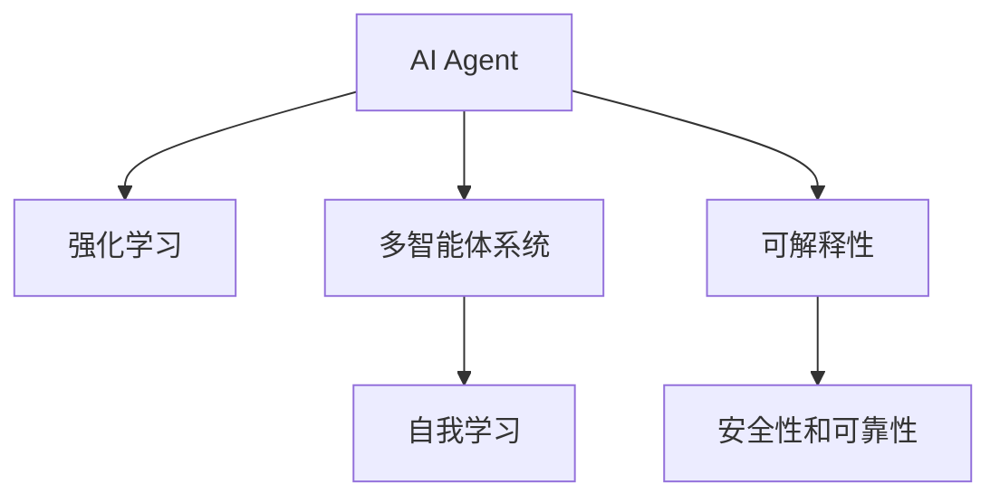

                 

# AI Agent 的未来展望

> 关键词：智能代理, 自我学习, 强化学习, 多智能体, 未来应用, 技术展望

## 1. 背景介绍

### 1.1 问题由来
人工智能技术在过去几十年中迅猛发展，从早期的符号计算、专家系统，到后来的机器学习、深度学习，再到近年来的智能代理和强化学习，每一次技术进步都极大地扩展了人工智能的应用范围和深度。随着技术的不断演进，AI代理（AI Agents）已经从简单的规则驱动的决策系统，成长为能够自主学习、自我优化，并在复杂环境中表现出卓越能力的智能实体。

AI代理的应用范围广泛，从自动化交易、机器人导航、智能家居，到医疗诊断、军事策略，几乎涵盖了人类活动的方方面面。然而，尽管AI代理在诸多领域取得了显著进展，但它们在实际应用中仍然面临诸多挑战。

### 1.2 问题核心关键点
当前，AI代理面临的核心挑战包括但不限于：
- 如何更高效地进行自我学习与优化？
- 如何在复杂、不确定的环境中进行决策？
- 如何更好地与人类进行交互与协作？
- 如何提升AI代理的透明性和可解释性？
- 如何确保AI代理的安全性和可靠性？

### 1.3 问题研究意义
研究AI代理的未来发展，对于推动人工智能技术的进一步成熟，拓展AI代理的应用边界，提高其决策能力和系统可靠性，具有重要意义。

AI代理能够更好地理解和模拟人类的行为和决策过程，从而在各种复杂、动态环境中提供更精准的预测和建议。通过不断自我学习与优化，AI代理能够适应新的环境和需求，提高系统的长期生存能力和适应性。

此外，AI代理在未来社会治理、智慧城市、智能医疗等领域将发挥关键作用，为各行各业带来变革性影响。掌握AI代理的前沿技术，对于构建智能、可持续的未来社会具有深远影响。

## 2. 核心概念与联系

### 2.1 核心概念概述

为更好地理解AI代理的未来发展，本节将介绍几个密切相关的核心概念：

- AI代理（AI Agent）：指能够在环境中自主行动，通过感知、规划、执行等步骤完成特定任务的智能实体。AI代理可以是软件系统、机器人、虚拟助手等。

- 强化学习（Reinforcement Learning, RL）：一种通过与环境交互，根据奖励信号不断调整策略的机器学习范式。AI代理常通过强化学习实现自主决策与优化。

- 多智能体系统（Multi-Agent System, MAS）：由多个AI代理组成的系统，各代理之间通过协作、竞争、博弈等复杂交互，达成共同的目标。

- 自我学习（Self-Learning）：指AI代理能够通过经验、反馈等自我适应和优化，提升决策能力的过程。

- 可解释性（Explainability）：指AI代理能够被理解和解释其行为和决策的机制，增强系统的透明度和可信度。

- 安全性和可靠性（Safety and Reliability）：指AI代理在执行任务时，能够避免错误、偏见和有害行为，确保系统稳定运行。

这些核心概念之间的逻辑关系可以通过以下Mermaid流程图来展示：



这个流程图展示了一个AI代理的基本组成和功能模块，以及它们之间的相互关系。

## 3. 核心算法原理 & 具体操作步骤
### 3.1 算法原理概述

AI代理的核心算法原理包括强化学习和多智能体系统等。强化学习通过奖励信号指导AI代理的行动，使其在环境中不断调整策略，以达到最优的长期回报。多智能体系统则强调各AI代理之间的协作与竞争，通过交互与协作达成共同目标。

AI代理的自我学习过程包括感知、规划和执行。感知模块负责从环境中获取信息，规划模块根据当前状态和目标，生成行动策略，执行模块则将策略转化为具体行动。这些模块的协同工作，使得AI代理能够在复杂环境中自主决策。

### 3.2 算法步骤详解

AI代理的自我学习与优化一般包括以下几个关键步骤：

**Step 1: 感知与环境建模**
- 使用传感器、相机、雷达等设备感知环境信息。
- 对环境进行建模，生成环境状态空间。

**Step 2: 状态空间与行动空间定义**
- 定义状态空间，包括环境中的物体、位置、时间等因素。
- 定义行动空间，如机器人的运动轨迹、策略参数等。

**Step 3: 策略定义与优化**
- 定义AI代理的决策策略，如Q-learning、策略梯度等。
- 使用强化学习算法优化策略参数，最大化预期回报。

**Step 4: 执行与反馈**
- 执行行动策略，观察环境变化。
- 根据环境反馈调整策略，继续执行或重新规划。

**Step 5: 模型训练与评估**
- 使用历史数据训练AI代理，评估策略性能。
- 在测试集上评估模型表现，进行调优。

### 3.3 算法优缺点

AI代理的强化学习范式具有以下优点：
1. 动态适应性。通过与环境交互，AI代理能够动态调整策略，适应不断变化的环境。
2. 自主优化。无需人类干预，AI代理能够自主学习最优策略，提升决策能力。
3. 可扩展性。可应用于各种复杂环境，如机器人导航、自动驾驶、游戏智能等。

同时，强化学习也存在以下局限性：
1. 奖励设计困难。如何设计合理的奖励信号，指导AI代理行动，是一个难点。
2. 学习效率低。强化学习需要大量时间在环境中探索，学习效率相对较低。
3. 样本效率低。在复杂环境中，需要大量样本才能使AI代理收敛到最优策略。
4. 局部最优。AI代理容易陷入局部最优，无法全局最优。

为了解决这些挑战，研究人员提出了多种改进措施，如模型基线学习、蒙特卡洛树搜索、Actor-Critic等，进一步提升了强化学习的效率和性能。

### 3.4 算法应用领域

AI代理的强化学习范式在多个领域取得了显著进展，应用范围包括：

- 机器人导航与操作：如自动驾驶汽车、无人机、工业机器人等。
- 游戏智能：如AlphaGo、DeepMind开发的多种游戏智能系统。
- 自动化交易：如高频交易、量化投资等。
- 医疗诊断：如癌症筛查、药物研发等。
- 智能客服：如聊天机器人、语音助手等。

除了上述这些经典应用外，AI代理的强化学习还被创新性地应用到更多场景中，如自然灾害预测、智能合约、社交网络优化等，为各行各业带来了新的突破。

## 4. 数学模型和公式 & 详细讲解 & 举例说明

### 4.1 数学模型构建

AI代理的强化学习过程可以形式化表示为一个马尔可夫决策过程（MDP）。MDP由状态空间 $\mathcal{S}$、行动空间 $\mathcal{A}$、转移概率 $p(s_{t+1}|s_t,a_t)$、奖励函数 $r(s_t,a_t)$ 和折扣因子 $\gamma$ 组成。其中 $s_t$ 表示时间 $t$ 的当前状态，$a_t$ 表示在状态 $s_t$ 下的行动，$s_{t+1}$ 表示下一个状态，$r(s_t,a_t)$ 表示在状态 $s_t$ 下采取行动 $a_t$ 的即时奖励。

### 4.2 公式推导过程

以Q-learning算法为例，Q-learning算法通过学习状态-行动价值函数 $Q(s,a)$，指导AI代理在每个状态下选择最优行动。其更新公式为：

$$
Q(s_t,a_t) \leftarrow Q(s_t,a_t) + \alpha [r(s_t,a_t) + \gamma \max_{a'} Q(s_{t+1},a')] - Q(s_t,a_t)
$$

其中 $\alpha$ 为学习率。Q-learning算法的核心思想是，根据当前状态和行动的即时奖励和下一状态的最大价值，更新状态-行动价值函数的估计值。

### 4.3 案例分析与讲解

以下是一个简单的例子，演示Q-learning算法在导航机器人中的应用：

假设一个导航机器人需要在一张二维网格上从起点 $s_0$ 到达终点 $s_T$，需要避障并找到最短路径。网格上每个格子代表一个状态 $s$，每个方向代表一个行动 $a$，每个格子都有一个障碍 $b$。

机器人可以通过移动、左转、右转等行动，从当前状态 $s_t$ 移动到下一个状态 $s_{t+1}$。在每个状态 $s_t$ 下，采取行动 $a_t$ 的即时奖励 $r(s_t,a_t)$ 为该状态障碍 $b$ 的倒数，即 $r(s_t,a_t) = 1/b$。

机器人的目标是最小化路径长度。可以使用Q-learning算法对机器人进行训练，使其学会在每个状态下选择最优行动。具体步骤如下：

1. 定义状态空间 $\mathcal{S}$ 为网格上的所有格子。
2. 定义行动空间 $\mathcal{A}$ 为机器人的所有可能移动方向。
3. 定义转移概率 $p(s_{t+1}|s_t,a_t)$，根据当前状态和行动，计算下一个状态。
4. 定义奖励函数 $r(s_t,a_t)$，根据即时奖励计算当前状态下的行动值。
5. 使用Q-learning算法，通过大量试验，优化状态-行动价值函数 $Q(s_t,a_t)$。

通过Q-learning算法训练后，机器人可以在导航过程中自主决策，选择最优行动路径，实现目标导航。

## 5. 项目实践：代码实例和详细解释说明
### 5.1 开发环境搭建

在进行AI代理的强化学习实践前，我们需要准备好开发环境。以下是使用Python进行Reinforcement Learning开发的环境配置流程：

1. 安装Anaconda：从官网下载并安装Anaconda，用于创建独立的Python环境。

2. 创建并激活虚拟环境：
```bash
conda create -n rl-env python=3.8 
conda activate rl-env
```

3. 安装相关库：
```bash
conda install numpy scipy matplotlib jupyter notebook 
pip install gym
```

4. 下载并配置OpenAI Gym：
```bash
pip install gym[atari]
```

5. 安装TensorFlow或PyTorch：
```bash
pip install tensorflow==2.6
# 或
pip install torch==1.9
```

完成上述步骤后，即可在`rl-env`环境中开始AI代理的强化学习实践。

### 5.2 源代码详细实现

我们以DQN算法在CartPole环境中的应用为例，给出完整的代码实现。

首先，定义CartPole环境：

```python
import gym

env = gym.make('CartPole-v1')
```

然后，定义DQN代理：

```python
import numpy as np
import tensorflow as tf
import tensorflow.keras as keras

class DQNAgent:
    def __init__(self, state_size, action_size, learning_rate):
        self.state_size = state_size
        self.action_size = action_size
        self.memory = deque(maxlen=2000)
        self.learning_rate = learning_rate
        self.gamma = 0.95
        self.epsilon = 1.0
        self.epsilon_min = 0.01
        self.epsilon_decay = 0.995
        self.model = self._build_model()

    def _build_model(self):
        model = keras.Sequential([
            keras.layers.Dense(24, input_dim=self.state_size, activation='relu'),
            keras.layers.Dense(24, activation='relu'),
            keras.layers.Dense(self.action_size, activation='linear')
        ])
        model.compile(loss='mse', optimizer=keras.optimizers.Adam(lr=self.learning_rate))
        return model
```

定义训练函数：

```python
def train_model(agent, env, episodes):
    for episode in range(episodes):
        state = env.reset()
        done = False
        while not done:
            if np.random.rand() <= agent.epsilon:
                action = env.action_space.sample()
            else:
                action = np.argmax(agent.model.predict(state.reshape(1, -1)))
            next_state, reward, done, _ = env.step(action)
            next_q_values = agent.model.predict(next_state.reshape(1, -1))
            q_values = agent.model.predict(state.reshape(1, -1))
            q_values[0][action] = reward + agent.gamma * np.amax(next_q_values)
            agent.memory.append((state, action, reward, next_state, done))
            if len(agent.memory) > agent.memory_size:
                agent.memory.popleft()
            if not done:
                state = next_state
        agent.epsilon *= agent.epsilon_decay
        if agent.epsilon < agent.epsilon_min:
            agent.epsilon = agent.epsilon_min
```

最后，启动训练流程并评估代理表现：

```python
state_size = env.observation_space.shape[0]
action_size = env.action_space.n
memory_size = 2000
agent = DQNAgent(state_size, action_size, learning_rate=0.001)
agent.memory_size = memory_size

episodes = 2000
train_model(agent, env, episodes)

test_episodes = 100
test_reward_sum = 0
for _ in range(test_episodes):
    state = env.reset()
    done = False
    while not done:
        action = np.argmax(agent.model.predict(state.reshape(1, -1)))
        next_state, reward, done, _ = env.step(action)
        test_reward_sum += reward
        state = next_state
print(f'Test Episodes: {test_episodes}, Test Reward Sum: {test_reward_sum}')
```

以上就是使用TensorFlow实现DQN算法的完整代码实例。可以看到，利用TensorFlow的深度学习框架，DQN算法的代码实现变得简洁高效。

### 5.3 代码解读与分析

让我们再详细解读一下关键代码的实现细节：

**DQNAgent类**：
- `__init__`方法：初始化状态大小、动作大小、记忆队列、学习率、折扣因子、探索率等参数。
- `_build_model`方法：定义神经网络模型，包含两个全连接层和一个线性输出层。

**训练函数train_model**：
- 循环遍历每轮训练，重置环境并模拟交互。
- 在每个状态下，根据探索率决定是否采取随机行动。
- 根据当前状态和行动计算即时奖励和下一个状态的价值，使用DQN算法更新模型参数。
- 记录训练过程中每一轮的状态、动作、奖励、下一个状态和是否结束的信息到记忆队列。
- 周期性更新探索率，确保训练过程中探索与利用之间的平衡。

**测试函数**：
- 循环遍历测试集，计算平均测试奖励。

可以看到，TensorFlow配合深度学习框架，使得DQN算法的代码实现变得简洁高效。开发者可以将更多精力放在数据处理、模型改进等高层逻辑上，而不必过多关注底层的实现细节。

当然，工业级的系统实现还需考虑更多因素，如模型的保存和部署、超参数的自动搜索、更灵活的任务适配层等。但核心的强化学习算法基本与此类似。

## 6. 实际应用场景
### 6.1 智能客服系统

AI代理的强化学习范式，可以广泛应用于智能客服系统的构建。传统客服往往需要配备大量人力，高峰期响应缓慢，且一致性和专业性难以保证。而使用强化学习训练的智能客服代理，可以7x24小时不间断服务，快速响应客户咨询，用自然流畅的语言解答各类常见问题。

在技术实现上，可以收集企业内部的历史客服对话记录，将问题和最佳答复构建成监督数据，在此基础上对强化学习模型进行训练。训练后的客服代理能够自动理解用户意图，匹配最合适的答案模板进行回复。对于客户提出的新问题，还可以接入检索系统实时搜索相关内容，动态组织生成回答。如此构建的智能客服系统，能大幅提升客户咨询体验和问题解决效率。

### 6.2 金融舆情监测

金融机构需要实时监测市场舆论动向，以便及时应对负面信息传播，规避金融风险。传统的人工监测方式成本高、效率低，难以应对网络时代海量信息爆发的挑战。使用强化学习训练的舆情监测代理，可以实时抓取网络文本数据，自动判断文本属于何种主题，情感倾向是正面、中性还是负面。将训练后的代理应用到实时抓取的网络文本数据，就能够自动监测不同主题下的情感变化趋势，一旦发现负面信息激增等异常情况，系统便会自动预警，帮助金融机构快速应对潜在风险。

### 6.3 个性化推荐系统

当前的推荐系统往往只依赖用户的历史行为数据进行物品推荐，无法深入理解用户的真实兴趣偏好。使用强化学习训练的个性化推荐代理，可以更好地挖掘用户行为背后的语义信息，从而提供更精准、多样的推荐内容。

在实践中，可以收集用户浏览、点击、评论、分享等行为数据，提取和用户交互的物品标题、描述、标签等文本内容。将文本内容作为模型输入，用户的后续行为（如是否点击、购买等）作为监督信号，在此基础上训练强化学习模型。训练后的推荐代理能够从文本内容中准确把握用户的兴趣点。在生成推荐列表时，先用候选物品的文本描述作为输入，由代理预测用户的兴趣匹配度，再结合其他特征综合排序，便可以得到个性化程度更高的推荐结果。

### 6.4 未来应用展望

随着强化学习技术的不断发展，AI代理将在更多领域得到应用，为各行各业带来变革性影响。

在智慧医疗领域，使用强化学习训练的智能诊断代理，能够快速识别医学影像、病理切片等复杂数据，辅助医生诊疗，提高诊断效率和准确性。

在智能教育领域，强化学习训练的智能辅导代理，可以实时分析学生的学习数据，推荐个性化的学习资源和练习，因材施教，促进教育公平，提高教学质量。

在智慧城市治理中，强化学习训练的智能交通代理，能够实时调整交通信号，优化交通流量，减少拥堵，提升交通效率。

此外，在企业生产、社会治理、文娱传媒等众多领域，强化学习训练的AI代理也将不断涌现，为经济社会发展注入新的动力。相信随着技术的日益成熟，强化学习方法将成为AI代理落地应用的重要范式，推动人工智能技术在垂直行业的规模化落地。

## 7. 工具和资源推荐
### 7.1 学习资源推荐

为了帮助开发者系统掌握AI代理的强化学习理论基础和实践技巧，这里推荐一些优质的学习资源：

1. 《强化学习：从原理到实践》系列博文：由大模型技术专家撰写，深入浅出地介绍了强化学习的原理、算法和应用，适合初学者和进阶开发者。

2. 《Reinforcement Learning: An Introduction》书籍：经典的强化学习入门教材，由Richard S. Sutton和Andrew G. Barto共同撰写，系统全面地介绍了强化学习的理论和实践。

3. 《Python强化学习基础》课程：Coursera平台上的在线课程，由David Silver主讲，深入讲解了强化学习的核心概念和算法，适合对强化学习感兴趣的同学。

4. OpenAI Gym：用于强化学习实验的开发环境，提供了多种环境和算法库，适合进行各种强化学习实验。

5. Reinforcement Learning Hub：GitHub上的开源项目，汇集了大量强化学习算法的实现和应用案例，适合学习和研究强化学习算法。

通过对这些资源的学习实践，相信你一定能够快速掌握强化学习的精髓，并用于解决实际的AI代理问题。

### 7.2 开发工具推荐

高效的开发离不开优秀的工具支持。以下是几款用于AI代理开发的常用工具：

1. TensorFlow和PyTorch：常用的深度学习框架，支持强大的计算图和分布式训练，适合实现复杂的神经网络模型。

2. OpenAI Gym：用于强化学习实验的开发环境，提供了多种环境和算法库，适合进行各种强化学习实验。

3. Jupyter Notebook：交互式的编程环境，支持Python和多种数学库的混合使用，适合快速迭代实验和研究。

4. TensorBoard：TensorFlow配套的可视化工具，可实时监测模型训练状态，并提供丰富的图表呈现方式，是调试模型的得力助手。

5. Weights & Biases：模型训练的实验跟踪工具，可以记录和可视化模型训练过程中的各项指标，方便对比和调优。

合理利用这些工具，可以显著提升AI代理的开发效率，加快创新迭代的步伐。

### 7.3 相关论文推荐

AI代理的强化学习发展源于学界的持续研究。以下是几篇奠基性的相关论文，推荐阅读：

1. Q-Learning：Watkins等人于1992年提出的Q-Learning算法，通过学习状态-行动价值函数，指导AI代理在每个状态下选择最优行动。

2. Deep Q-Learning：Mnih等人于2015年提出的Deep Q-Learning算法，将神经网络引入Q-Learning算法，提高了算法的计算效率和泛化能力。

3. Policy Gradient Methods：Sutton和Barto于1998年提出的Policy Gradient Methods算法，通过直接优化策略函数，提升了强化学习算法的性能。

4. Actor-Critic Methods：Sutton和Barto于1998年提出的Actor-Critic Methods算法，结合了策略梯度和价值函数的优点，进一步提升了强化学习算法的性能。

5. Trust Region Policy Optimization（TRPO）：Schulman等人于2015年提出的TRPO算法，通过优化策略函数的梯度，提升了算法的收敛性和稳定性。

6. Proximal Policy Optimization（PPO）：Schulman等人于2017年提出的PPO算法，通过优化策略函数的代理，提升了算法的计算效率和性能。

这些论文代表了大规模强化学习的演变脉络。通过学习这些前沿成果，可以帮助研究者把握学科前进方向，激发更多的创新灵感。

## 8. 总结：未来发展趋势与挑战
### 8.1 总结

本文对AI代理的强化学习范式进行了全面系统的介绍。首先阐述了AI代理和强化学习的基本概念，明确了强化学习在自主决策与优化中的独特价值。其次，从原理到实践，详细讲解了强化学习算法的数学原理和关键步骤，给出了强化学习任务开发的完整代码实例。同时，本文还广泛探讨了AI代理在智能客服、金融舆情、个性化推荐等多个行业领域的应用前景，展示了强化学习范式的巨大潜力。此外，本文精选了强化学习的各类学习资源，力求为读者提供全方位的技术指引。

通过本文的系统梳理，可以看到，AI代理的强化学习范式在多个领域取得了显著进展，为各行各业带来了变革性影响。未来，伴随强化学习技术的进一步成熟，AI代理将更广泛地应用于各种复杂环境中，为人类社会的智能化进程注入新的动力。

### 8.2 未来发展趋势

展望未来，AI代理的强化学习技术将呈现以下几个发展趋势：

1. 模型复杂度不断提升。随着算力成本的下降和数据规模的扩张，AI代理的模型规模将持续增大，学习到更加复杂的语言和决策模式。

2. 算法多样化。未来的强化学习算法将更加丰富，结合深度学习、进化算法、博弈论等多种思想，提升算法的性能和泛化能力。

3. 多智能体协同。未来的多智能体系统将更加复杂，各AI代理之间的交互将更加多样和动态。

4. 鲁棒性与可解释性提升。未来AI代理将更加注重鲁棒性和可解释性，避免模型在复杂环境中的不稳定性和不透明性。

5. 跨模态融合。未来的AI代理将结合视觉、语音、文字等多种模态信息，实现多模态交互和协同建模。

以上趋势凸显了AI代理强化学习技术的广阔前景。这些方向的探索发展，必将进一步提升AI代理的决策能力和系统可靠性，为构建智能、可持续的未来社会提供重要支撑。

### 8.3 面临的挑战

尽管AI代理的强化学习技术已经取得了显著进展，但在迈向更加智能化、普适化应用的过程中，仍面临诸多挑战：

1. 数据获取与处理困难。高质量的训练数据对于AI代理的性能至关重要，但在某些领域，获取和处理这些数据非常困难。

2. 算法复杂度高。强化学习算法通常需要复杂的数学推导和实现，对于算法复杂度较高的任务，需要更多的计算资源和时间。

3. 多智能体协同难度大。多智能体系统中的协作与竞争关系复杂，难以优化。

4. 模型泛化性不足。AI代理在特定环境下表现良好，但在未知或复杂环境中泛化能力有限。

5. 可解释性亟需加强。目前AI代理的决策过程缺乏透明性和可解释性，难以解释其行为和决策的机制。

6. 安全性和可靠性问题。AI代理的决策过程存在一定的不确定性和风险，容易产生有害行为或错误。

正视这些挑战，积极应对并寻求突破，将使AI代理的强化学习技术迈向更高的台阶，为构建安全、可靠、可解释的智能系统铺平道路。

### 8.4 研究展望

面向未来，AI代理的强化学习技术需要在以下几个方面寻求新的突破：

1. 数据增强技术。探索更多高效的数据增强方法，增加训练样本的多样性，提升模型的泛化能力。

2. 多智能体优化算法。开发新的多智能体协同优化算法，解决复杂环境中的协作与竞争问题。

3. 迁移学习。将预训练学习与强化学习相结合，提升模型的迁移能力和适应性。

4. 模型压缩与加速。研究模型压缩、稀疏化存储等技术，降低模型资源消耗，提高推理速度。

5. 可解释性增强。引入可解释性增强技术，提升AI代理的决策过程的透明性和可解释性。

6. 安全与可靠性保障。在算法设计中加入安全性、鲁棒性约束，确保AI代理在复杂环境中的稳定性和可靠性。

这些研究方向的探索，必将引领AI代理的强化学习技术迈向更高的台阶，为构建安全、可靠、可解释的智能系统铺平道路。

## 9. 附录：常见问题与解答

**Q1：AI代理的强化学习范式适用于所有NLP任务吗？**

A: AI代理的强化学习范式适用于多种NLP任务，尤其是那些需要自主决策与优化的任务，如对话系统、推荐系统、问答系统等。但对于一些特定领域的任务，如医学、法律等，训练数据获取较为困难，可能需要结合其他方法，如迁移学习、半监督学习等。

**Q2：强化学习如何处理高维度数据？**

A: 强化学习模型通常面临高维度的状态空间和行动空间，处理起来较为复杂。一种常用的方法是使用特征工程，提取有用的特征，简化模型输入。此外，神经网络模型可以处理高维数据，使用卷积神经网络、循环神经网络等结构，适应不同类型的高维数据。

**Q3：如何平衡探索与利用？**

A: 在强化学习中，探索是指在未知状态下尝试新的行动，以获取更多信息；利用是指在已知状态下选择已知的最优行动。平衡探索与利用是强化学习中一个重要的问题。常用的方法包括ε-greedy策略、softmax策略、UCB策略等，通过调整探索率或行动概率分布，实现探索与利用的平衡。

**Q4：强化学习如何处理连续动作空间？**

A: 强化学习处理连续动作空间的一种方法是将动作离散化，转化为离散的动作空间。另一种方法是使用策略梯度方法，直接优化连续动作空间的策略函数。常用的策略梯度方法包括REINFORCE、Trust Region Policy Optimization（TRPO）等。

**Q5：强化学习如何处理非平稳环境？**

A: 强化学习处理非平稳环境的方法包括时间差分学习（Temporal Difference Learning，TD-Learning）、最小化动态系统误差（Dynamic System Error，DSE）等。这些方法通过更新模型参数，学习环境中的动态变化规律，提升模型在非平稳环境中的适应能力。

通过这些问题的解答，可以看出AI代理的强化学习范式在多领域的应用潜力，也暴露了其在实际应用中的一些挑战。正视这些挑战，不断探索和创新，AI代理的强化学习技术必将在未来发挥更大的作用。

