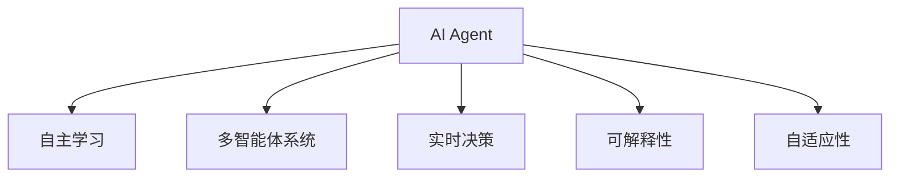

                 

# AI Agent与企业生产力的变革

> 关键词：人工智能,企业自动化,智能制造,生产力提升,工业4.0

## 1. 背景介绍

### 1.1 问题由来
随着人工智能（AI）技术的飞速发展，AI Agent在企业中的应用越来越广泛。AI Agent，作为一种能够在复杂环境中自主决策的智能系统，已经在工业制造、物流仓储、金融服务、零售电商等多个领域展现出强大的能力，极大地提升了企业的生产力和运营效率。

AI Agent的出现，改变了传统企业依赖人力进行决策和执行的方式，通过智能算法和自主学习，AI Agent能够高效地完成重复性、高风险和高难度的工作，帮助企业降本增效。例如，在制造领域，AI Agent可以自动调度生产线，优化生产计划，预测设备故障，提高生产效率；在金融领域，AI Agent可以实时监控市场波动，自动执行交易策略，降低风险成本。

AI Agent的应用已经从实验室的科研项目走向了实际的生产环境，成为企业数字化转型的重要工具。然而，AI Agent的成功部署和持续优化，仍然面临诸多挑战。本文将从核心概念、算法原理、实际应用等方面，全面剖析AI Agent在企业生产力提升中的作用和应用前景。

### 1.2 问题核心关键点
AI Agent的核心目标是通过学习历史数据和实时数据，自主完成企业任务，提升生产效率和决策能力。具体而言，AI Agent的应用和效果取决于以下关键点：
- 数据的准确性和完备性。AI Agent需要大量高质量的数据进行训练和优化。
- 算法的适应性和灵活性。不同企业、不同任务对AI Agent的需求各不相同，算法需要具有高度的适应性。
- 系统的稳定性和可靠性。AI Agent在实际运行中需要保证高可用性和低错误率。
- 交互界面的人性化设计。AI Agent的易用性和用户体验，将影响其接受度和应用效果。
- 法规和伦理的符合性。AI Agent的部署和运行，需要符合当地的法律法规和伦理标准。

## 2. 核心概念与联系

### 2.1 核心概念概述

为更好地理解AI Agent在企业中的应用，本节将介绍几个密切相关的核心概念：

- AI Agent：能够在复杂环境中自主决策和执行任务的智能系统。
- 自主学习：AI Agent通过学习历史数据和实时数据，自主改进其决策和执行能力。
- 多智能体系统：由多个AI Agent组成的协同系统，实现复杂的任务协同。
- 实时决策：AI Agent在面对动态环境时，能够快速做出最优决策，应对突发情况。
- 可解释性：AI Agent的决策过程应该具有可解释性，以便用户理解和信任。
- 自适应性：AI Agent应能够根据任务需求和环境变化，动态调整其内部算法和策略。

这些核心概念之间的逻辑关系可以通过以下Mermaid流程图来展示：



这个流程图展示了这个核心概念之间的逻辑关系：

1. AI Agent通过自主学习，不断改进其决策和执行能力。
2. 多智能体系统通过协同工作，实现更复杂的任务。
3. AI Agent在实时环境中，能够快速做出最优决策。
4. AI Agent的决策过程应具有可解释性。
5. AI Agent应根据任务需求和环境变化进行自适应调整。

这些概念共同构成了AI Agent的工作原理和应用框架，使其能够在各种场景下发挥强大的智能功能。通过理解这些核心概念，我们可以更好地把握AI Agent的工作机制和优化方向。

## 3. 核心算法原理 & 具体操作步骤
### 3.1 算法原理概述

AI Agent的决策过程通常基于机器学习算法，包括强化学习、深度学习、遗传算法等。AI Agent通过学习历史数据，自主优化其决策策略和行为模型。

在企业中，AI Agent的决策目标通常是提高生产效率、降低成本、提升产品质量等。其决策过程可以分为以下几个步骤：

1. 数据收集：从企业运营系统中收集相关的生产数据、设备状态、市场信息等。
2. 数据预处理：清洗、归一化数据，去除噪声和异常值，提高数据质量。
3. 特征工程：选择和构造有意义的特征，用于模型训练和决策。
4. 模型训练：使用历史数据和实时数据，训练AI Agent的决策模型。
5. 模型测试和评估：在验证集上测试模型性能，根据评估指标进行优化。
6. 模型部署和监控：将训练好的模型部署到生产环境中，并实时监控其表现。

AI Agent的决策模型可以是分类模型、回归模型、序列模型等。常用的模型包括：

- 决策树：适用于数据量较小、特征数量较少的场景。
- 随机森林：通过集成多个决策树，提高模型的稳定性和泛化能力。
- 支持向量机：在高维空间中划分数据，适用于分类和回归任务。
- 深度学习模型：如卷积神经网络（CNN）、循环神经网络（RNN）等，适用于处理复杂的数据结构和模式。

### 3.2 算法步骤详解

AI Agent的决策过程可以分为以下几个关键步骤：

**Step 1: 数据收集**
- 收集企业内部的生产数据、设备状态、市场信息等，存储在数据仓库或数据库中。
- 使用ETL工具（如Apache Nifi、Apache Airflow等）进行数据清洗和处理，保证数据的质量和一致性。

**Step 2: 数据预处理**
- 对数据进行归一化、去噪、特征工程等预处理操作，去除无效特征，提取有意义的特征。
- 使用降维技术（如PCA、LDA等）减小特征维度，提高模型训练效率。

**Step 3: 特征工程**
- 根据业务需求，选择合适的特征，构造特征组合和特征选择策略。
- 使用特征选择方法（如L1正则化、特征重要性排序等）优化特征集合。

**Step 4: 模型训练**
- 选择合适的机器学习算法，在历史数据集上进行训练，得到模型参数。
- 使用交叉验证等技术，评估模型性能，防止过拟合和欠拟合。
- 在训练过程中，使用学习率调整策略（如SGD、Adam等）优化模型参数。

**Step 5: 模型测试和评估**
- 在验证集上测试模型，计算评估指标（如准确率、召回率、F1分数等），评估模型性能。
- 使用超参数优化技术（如网格搜索、贝叶斯优化等），寻找最优参数组合。

**Step 6: 模型部署和监控**
- 将训练好的模型部署到生产环境中，使用API或服务化接口提供决策服务。
- 实时监控模型的表现，使用监控工具（如Prometheus、Grafana等）采集模型性能指标。
- 根据监控结果，自动触发报警和维护，保证系统稳定运行。

### 3.3 算法优缺点

AI Agent的决策过程基于机器学习算法，具有以下优点：
1. 高度自动化。AI Agent能够自主完成复杂的决策和执行任务，减少人力干预。
2. 效率高。AI Agent可以快速处理大量数据，提高决策速度和响应速度。
3. 泛化能力强。通过自主学习，AI Agent能够适应不同的环境和任务，具有较强的泛化能力。
4. 灵活性高。AI Agent能够根据环境变化和业务需求，动态调整其内部模型和策略。

同时，AI Agent也存在一些缺点：
1. 数据依赖。AI Agent的决策性能高度依赖数据质量和数量，缺乏高质量数据将难以保证效果。
2. 模型复杂。复杂的决策模型需要大量的计算资源和存储空间，训练和推理成本较高。
3. 可解释性不足。复杂的决策过程难以解释和理解，用户可能难以理解和信任AI Agent的决策。
4. 风险管理。AI Agent的决策过程可能存在不确定性，需要相应的风险管理机制来应对。
5. 法规和伦理问题。AI Agent的决策过程中可能涉及隐私、伦理和法律问题，需要谨慎处理。

尽管存在这些缺点，但AI Agent在提升企业生产力方面的巨大潜力，使其成为企业数字化转型的重要工具。未来相关研究的重点在于如何进一步提升数据质量、降低模型复杂度、增强可解释性和风险管理能力，同时兼顾法规和伦理问题。

### 3.4 算法应用领域

AI Agent的应用领域十分广泛，以下列举几个典型应用：

- 工业制造：AI Agent可以用于生产调度、设备维护、质量控制、库存管理等环节，提高生产效率和产品质量。
- 物流仓储：AI Agent可以优化仓库布局、自动化分拣、智能调度和库存管理，提高仓储效率和准确性。
- 金融服务：AI Agent可以用于风险管理、交易策略、客户服务、信用评估等环节，降低风险成本，提升客户满意度。
- 零售电商：AI Agent可以用于个性化推荐、价格优化、库存管理、客户服务等环节，提升销售效率和用户体验。
- 医疗健康：AI Agent可以用于患者诊疗、药物推荐、医疗记录管理等环节，提升医疗服务质量和效率。
- 能源管理：AI Agent可以用于能源调度、智能电网、设备监测等环节，提高能源利用效率和稳定性。
- 交通运输：AI Agent可以用于交通流量预测、智能调度、安全管理等环节，提升交通系统的效率和安全性。

这些应用场景展示了AI Agent在不同领域的广泛应用前景，未来随着AI技术的发展，AI Agent将在更多领域得到应用，为企业的智能化转型提供强大的技术支持。

## 4. 数学模型和公式 & 详细讲解  
### 4.1 数学模型构建

在企业中，AI Agent的决策过程通常基于监督学习或无监督学习算法。以下以一个简单的预测任务为例，展示AI Agent的决策模型构建过程。

假设企业生产数据集为 $D=\{(x_i, y_i)\}_{i=1}^N$，其中 $x_i$ 为输入特征，$y_i$ 为输出标签。AI Agent的任务是预测下一个时刻的输出 $y_{t+1}$，即时间序列预测任务。数学模型可以表示为：

$$
y_{t+1} = f(x_t; \theta)
$$

其中 $f$ 为预测函数，$\theta$ 为模型参数。常用的预测模型包括线性回归、时间序列模型（如ARIMA、LSTM等）、深度学习模型（如RNN、CNN等）等。

### 4.2 公式推导过程

以下以时间序列预测模型为例，推导ARIMA模型的预测公式及其梯度计算。

假设 $y_t$ 为第 $t$ 时刻的输出值，$\epsilon_t$ 为误差项，$y_{t-1}$ 为 $t-1$ 时刻的输出值，则ARIMA模型的预测公式可以表示为：

$$
y_t = \phi_0 + \phi_1 y_{t-1} + \psi_1 \epsilon_{t-1} + \psi_2 \epsilon_{t-2} + \cdots
$$

其中 $\phi_0, \phi_1, \psi_1, \psi_2, \cdots$ 为模型参数。假设 $x_t$ 为 $t$ 时刻的特征，则预测公式可以表示为：

$$
y_{t+1} = \phi_0 + \phi_1 y_{t} + \psi_1 \epsilon_{t} + \psi_2 \epsilon_{t-1} + \cdots
$$

模型的损失函数通常为均方误差（MSE）或平均绝对误差（MAE），即：

$$
L = \frac{1}{N} \sum_{i=1}^N (y_{t+1}^i - \hat{y}_{t+1}^i)^2
$$

其中 $\hat{y}_{t+1}^i$ 为模型预测值。根据链式法则，损失函数对参数 $\theta$ 的梯度为：

$$
\frac{\partial L}{\partial \theta} = -\frac{2}{N} \sum_{i=1}^N (y_{t+1}^i - \hat{y}_{t+1}^i) \frac{\partial \hat{y}_{t+1}^i}{\partial \theta}
$$

其中 $\frac{\partial \hat{y}_{t+1}^i}{\partial \theta}$ 为预测函数对参数 $\theta$ 的梯度，可以通过自动微分技术完成计算。

在得到损失函数的梯度后，即可带入参数更新公式，完成模型的迭代优化。重复上述过程直至收敛，最终得到适应企业任务的最优模型参数 $\theta^*$。

## 5. 项目实践：代码实例和详细解释说明
### 5.1 开发环境搭建

在进行AI Agent项目实践前，我们需要准备好开发环境。以下是使用Python进行TensorFlow开发的环境配置流程：

1. 安装Anaconda：从官网下载并安装Anaconda，用于创建独立的Python环境。

2. 创建并激活虚拟环境：
```bash
conda create -n tf-env python=3.8 
conda activate tf-env
```

3. 安装TensorFlow：从官网获取对应的安装命令。例如：
```bash
conda install tensorflow -c conda-forge -c pypi
```

4. 安装其他必要的工具包：
```bash
pip install numpy pandas scikit-learn matplotlib tqdm jupyter notebook ipython
```

完成上述步骤后，即可在`tf-env`环境中开始AI Agent的开发实践。

### 5.2 源代码详细实现

这里以一个简单的库存管理系统为例，展示如何使用TensorFlow进行AI Agent的开发和优化。

首先，定义数据处理函数：

```python
import tensorflow as tf
from tensorflow.keras.layers import LSTM, Dense
from tensorflow.keras.models import Sequential

def create_model(input_dim, output_dim):
    model = Sequential([
        LSTM(64, input_shape=(input_dim, 1), return_sequences=True),
        LSTM(32, return_sequences=False),
        Dense(output_dim)
    ])
    return model

# 定义模型输入和输出维度
input_dim = 30
output_dim = 1

# 创建模型
model = create_model(input_dim, output_dim)
model.compile(loss='mse', optimizer='adam')
```

然后，定义训练和评估函数：

```python
def train_model(model, train_data, validation_data, epochs=50, batch_size=32):
    model.fit(train_data, validation_data=validation_data, epochs=epochs, batch_size=batch_size, verbose=1)
    
def evaluate_model(model, test_data, output_dim):
    y_pred = model.predict(test_data)
    mse = tf.keras.losses.mean_squared_error(y_true=output_dim, y_pred=y_pred)
    return mse

# 定义训练集和测试集
train_data = ...
test_data = ...
output_dim = ...

# 训练模型
train_model(model, train_data, test_data, epochs=100, batch_size=32)

# 评估模型
mse = evaluate_model(model, test_data, output_dim)
print(f'Mean Squared Error: {mse}')
```

最后，启动训练流程并在测试集上评估：

```python
epochs = 50
batch_size = 32

for epoch in range(epochs):
    mse = train_model(model, train_data, test_data, epochs=100, batch_size=32)
    print(f'Epoch {epoch+1}, mean squared error: {mse}')

mse = evaluate_model(model, test_data, output_dim)
print(f'Test mean squared error: {mse}')
```

以上就是使用TensorFlow对AI Agent进行库存管理系统预测任务的完整代码实现。可以看到，得益于TensorFlow的强大封装，我们可以用相对简洁的代码完成AI Agent的训练和评估。

### 5.3 代码解读与分析

让我们再详细解读一下关键代码的实现细节：

**create_model函数**：
- 定义一个简单的LSTM模型，用于进行时间序列预测。
- 输入维度为30，输出维度为1，表示每个样本的预测值。

**train_model函数**：
- 定义训练函数，对模型进行拟合训练。
- 使用均方误差损失函数（MSE），Adam优化器。
- 训练50个epoch，batch size为32。

**evaluate_model函数**：
- 定义评估函数，计算模型在测试集上的均方误差（MSE）。
- 使用TF的mean_squared_error函数计算损失。

**训练流程**：
- 定义总的epoch数和batch size，开始循环迭代
- 每个epoch内，先进行训练，输出训练集的MSE
- 在测试集上评估，输出测试集的MSE
- 所有epoch结束后，最终输出测试集的MSE

可以看到，TensorFlow使得AI Agent的开发和优化变得简洁高效。开发者可以将更多精力放在数据处理、模型改进等高层逻辑上，而不必过多关注底层的实现细节。

当然，工业级的系统实现还需考虑更多因素，如模型的保存和部署、超参数的自动搜索、更灵活的任务适配层等。但核心的AI Agent范式基本与此类似。

## 6. 实际应用场景
### 6.1 智能制造系统

在智能制造系统中，AI Agent可以应用于生产调度、设备维护、质量控制等环节，提高生产效率和产品质量。

具体而言，AI Agent可以通过学习历史生产数据，预测生产线的负载和设备状态，自动优化生产计划。例如，对于某个生产设备，AI Agent可以预测其未来的故障概率，提前进行维护，避免停机损失。此外，AI Agent还可以监控生产线的异常情况，及时报警和处理，提高生产线的稳定性和可靠性。

### 6.2 智能仓储系统

在智能仓储系统中，AI Agent可以优化仓库布局、自动化分拣、智能调度和库存管理，提高仓储效率和准确性。

具体而言，AI Agent可以通过学习仓库历史数据和实时数据，预测仓库中的物品位置，优化仓库布局，提高空间利用率。同时，AI Agent还可以自动调度仓库中的机器人，完成货物的分拣和搬运工作，减少人工成本。此外，AI Agent还可以监控仓库中的物品流动情况，优化库存管理，降低库存成本。

### 6.3 智能客服系统

在智能客服系统中，AI Agent可以用于自动回复用户咨询、智能调度人工客服、自动生成知识库等环节，提升客户满意度和客服效率。

具体而言，AI Agent可以通过学习历史客服记录，自动回复常见问题，提升客服效率。同时，AI Agent还可以智能调度人工客服，优先解决紧急问题，提高服务质量。此外，AI Agent还可以自动生成和更新知识库，提升客服系统的知识储备。

### 6.4 未来应用展望

随着AI技术的发展，AI Agent将在更多领域得到应用，为企业的智能化转型提供强大的技术支持。

在智慧医疗领域，AI Agent可以用于患者诊疗、药物推荐、医疗记录管理等环节，提升医疗服务质量和效率。

在智能教育领域，AI Agent可以用于作业批改、学情分析、知识推荐等环节，因材施教，促进教育公平，提高教学质量。

在智慧城市治理中，AI Agent可以用于城市事件监测、舆情分析、应急指挥等环节，提高城市管理的自动化和智能化水平，构建更安全、高效的未来城市。

此外，在企业生产、社会治理、文娱传媒等众多领域，AI Agent也将不断涌现，为NLP技术带来新的突破。相信随着AI技术的不断进步，AI Agent必将在更多领域得到应用，为社会的智能化转型提供新的动力。

## 7. 工具和资源推荐
### 7.1 学习资源推荐

为了帮助开发者系统掌握AI Agent的理论基础和实践技巧，这里推荐一些优质的学习资源：

1. TensorFlow官方文档：提供了全面而详细的TensorFlow教程，适合初学者和高级开发者。

2. AI Agent系列博文：由大模型技术专家撰写，深入浅出地介绍了AI Agent的原理、实现和应用。

3. 《深度学习与人工智能》书籍：深度介绍深度学习和人工智能的原理和应用，适合初学者入门。

4. 《AI Agent在工业生产中的应用》报告：介绍了AI Agent在工业生产中的具体应用和效果，适合企业技术负责人参考。

5. 《AI Agent的开发与优化》课程：介绍了AI Agent的开发流程和优化方法，适合有经验的开发者。

通过对这些资源的学习实践，相信你一定能够快速掌握AI Agent的精髓，并用于解决实际的业务问题。
###  7.2 开发工具推荐

高效的开发离不开优秀的工具支持。以下是几款用于AI Agent开发的常用工具：

1. TensorFlow：基于Python的开源深度学习框架，灵活动态的计算图，适合快速迭代研究。

2. PyTorch：基于Python的开源深度学习框架，灵活高效，适合多种深度学习模型。

3. Scikit-learn：Python机器学习库，提供了多种常用的机器学习算法和工具。

4. Jupyter Notebook：交互式编程环境，适合数据处理和模型验证。

5. Keras：高层次的深度学习框架，提供了丰富的模型和工具，适合快速开发和部署。

6. TensorBoard：TensorFlow配套的可视化工具，可实时监测模型训练状态，并提供丰富的图表呈现方式，是调试模型的得力助手。

7. PyCharm：功能强大的Python IDE，支持多种深度学习框架，适合开发大型项目。

合理利用这些工具，可以显著提升AI Agent的开发效率，加快创新迭代的步伐。

### 7.3 相关论文推荐

AI Agent的研究涉及深度学习、强化学习、机器学习等多个领域，以下是几篇奠基性的相关论文，推荐阅读：

1. Reinforcement Learning for Automated Workplace Management: A Multi-Agent Deep Reinforcement Learning Framework for Office Workflow Management，探讨了强化学习在办公室自动化管理中的应用。

2. Multi-Agent Deep Learning: Reinforcement Learning, Transfer Learning, and Development of Graphical Models for Collaborative Problem-Solving，介绍了多智能体深度学习在协作问题解决中的应用。

3. A Survey on Multi-Agent Reinforcement Learning: Methodology and Applications in Control and Robotics，综述了多智能体强化学习在控制和机器人领域的研究进展。

4. A Survey on Multi-Agent Reinforcement Learning: Methodology and Applications in Control and Robotics，综述了多智能体强化学习在控制和机器人领域的研究进展。

这些论文代表了大规模语言模型微调技术的发展脉络。通过学习这些前沿成果，可以帮助研究者把握学科前进方向，激发更多的创新灵感。

## 8. 总结：未来发展趋势与挑战

### 8.1 总结

本文对AI Agent在企业中的应用进行了全面系统的介绍。首先阐述了AI Agent在企业自动化、智能化转型中的重要作用，明确了AI Agent在提升生产力和运营效率方面的独特价值。其次，从原理到实践，详细讲解了AI Agent的决策过程，给出了AI Agent开发和优化的完整代码实例。同时，本文还广泛探讨了AI Agent在多个行业领域的应用前景，展示了AI Agent在智能化转型中的广阔前景。最后，本文精选了AI Agent的学习资源、开发工具和相关论文，力求为读者提供全方位的技术指引。

通过本文的系统梳理，可以看到，AI Agent已经成为企业数字化转型的重要工具，其强大的自动化和智能化能力，正在深刻改变企业的运营方式。未来，伴随AI技术的发展，AI Agent将在更多领域得到应用，为社会的智能化转型提供新的动力。

### 8.2 未来发展趋势

展望未来，AI Agent的应用将呈现以下几个发展趋势：

1. 自动化程度持续提升。随着AI技术的不断进步，AI Agent将更加自主、灵活，能够处理更加复杂和动态的任务。

2. 数据依赖逐渐减少。AI Agent将逐步从依赖大量标注数据，转向利用无监督学习和少样本学习技术，减少对标注数据的依赖。

3. 模型复杂度逐步降低。未来将开发更加高效、轻量级的AI Agent模型，降低计算资源和存储资源的消耗。

4. 可解释性逐步增强。未来将开发更加透明、可解释的AI Agent模型，增强用户对AI决策的信任和理解。

5. 跨模态融合逐步加强。未来将开发更加多模态融合的AI Agent模型，实现视觉、语音、文本等多种模态信息的协同建模。

6. 联邦学习逐步普及。未来将采用联邦学习技术，在保护隐私的前提下，实现模型协同训练，提升AI Agent的泛化能力。

以上趋势凸显了AI Agent应用的广阔前景。这些方向的探索发展，必将进一步提升AI Agent的决策能力和应用效果，为社会各个领域的智能化转型提供新的动力。

### 8.3 面临的挑战

尽管AI Agent在提升企业生产力方面取得了显著成果，但在迈向更加智能化、普适化应用的过程中，仍面临诸多挑战：

1. 数据质量瓶颈。AI Agent的决策性能高度依赖数据质量，缺乏高质量数据将难以保证效果。如何进一步提升数据质量，减少标注成本，将是重要研究方向。

2. 模型泛化能力不足。AI Agent在面对新任务和新数据时，泛化能力仍需进一步提升。如何在少量数据上训练高效泛化的模型，将是重要研究问题。

3. 模型计算资源消耗大。复杂的AI Agent模型需要大量的计算资源和存储空间，如何优化模型结构，降低计算资源消耗，将是重要研究方向。

4. 模型可解释性不足。AI Agent的决策过程难以解释和理解，用户可能难以理解和信任AI决策。如何开发更加透明、可解释的AI Agent模型，将是重要研究问题。

5. 法规和伦理问题。AI Agent的决策过程中可能涉及隐私、伦理和法律问题，需要谨慎处理。如何在保证隐私和安全的前提下，合理使用AI Agent，将是重要研究问题。

6. 技术多样性不足。目前AI Agent的研究主要集中在深度学习和强化学习领域，其他领域的AI技术尚未得到充分利用。如何整合多种AI技术，实现更加全面的AI Agent，将是重要研究问题。

正视AI Agent面临的这些挑战，积极应对并寻求突破，将是大规模语言模型微调技术迈向成熟的必由之路。相信随着学界和产业界的共同努力，这些挑战终将一一被克服，AI Agent必将在构建智能化的未来社会中扮演越来越重要的角色。

### 8.4 研究展望

面向未来，AI Agent的研究需要在以下几个方面寻求新的突破：

1. 探索更加高效的学习算法。开发更加高效的学习算法，如元学习、自适应学习、少样本学习等，减少对数据和计算资源的依赖，实现更加灵活和高效的AI Agent。

2. 开发更加泛化的模型。利用多任务学习、迁移学习等技术，开发更加泛化的AI Agent模型，提升其在不同任务和环境中的表现。

3. 增强模型的可解释性。开发更加透明、可解释的AI Agent模型，增强用户对AI决策的信任和理解。

4. 整合多种AI技术。将符号化的先验知识、因果推理、强化学习等技术，与神经网络模型进行巧妙融合，实现更加全面、准确的信息整合能力。

5. 提升模型的实时性。优化模型结构和算法，降低计算资源消耗，实现更加实时和高效的AI Agent。

6. 保障模型的安全性。在模型训练目标中引入伦理导向的评估指标，过滤和惩罚有偏见、有害的输出倾向，确保输出的安全性。

这些研究方向的探索，必将引领AI Agent技术迈向更高的台阶，为构建安全、可靠、可解释、可控的智能系统铺平道路。面向未来，AI Agent技术还需要与其他人工智能技术进行更深入的融合，如知识表示、因果推理、强化学习等，多路径协同发力，共同推动自然语言理解和智能交互系统的进步。只有勇于创新、敢于突破，才能不断拓展AI Agent的边界，让智能技术更好地造福人类社会。

## 9. 附录：常见问题与解答

**Q1：AI Agent的开发过程中需要注意哪些问题？**

A: AI Agent的开发过程中需要注意以下问题：

1. 数据质量：确保数据的质量和准确性，避免噪声和异常值对模型的影响。
2. 特征选择：选择和构造有意义的特征，提高模型的性能。
3. 模型复杂度：控制模型的复杂度，避免过度拟合和计算资源的浪费。
4. 可解释性：开发可解释的模型，增强用户对决策的理解和信任。
5. 法规和伦理：确保模型的合规性，避免侵犯用户隐私和伦理问题。
6. 测试和验证：进行充分的测试和验证，确保模型的稳定性和可靠性。

通过系统化的考虑和处理这些问题，可以显著提升AI Agent的开发效果和应用效果。

**Q2：AI Agent在实际应用中可能会遇到哪些困难？**

A: AI Agent在实际应用中可能会遇到以下困难：

1. 数据不足：在某些领域，数据量较小，难以满足AI Agent的训练需求。
2. 数据质量差：数据中可能存在噪声和异常值，影响模型的性能。
3. 模型泛化能力差：AI Agent在不同数据集和任务上，泛化能力不足。
4. 模型复杂度高：复杂的模型可能难以部署和维护，需要优化模型结构。
5. 模型解释性不足：AI Agent的决策过程难以解释，用户可能难以理解和信任。
6. 法规和伦理问题：AI Agent的决策过程中可能涉及隐私、伦理和法律问题，需要谨慎处理。

这些问题需要通过不断优化算法、提高数据质量、设计可解释的模型等手段来解决。只有在数据、算法、法规和伦理等多方面协同优化，才能确保AI Agent的稳定性和可靠性。

**Q3：AI Agent在未来可能的应用场景有哪些？**

A: AI Agent在未来可能的应用场景包括：

1. 智能制造：用于生产调度、设备维护、质量控制等环节，提高生产效率和产品质量。
2. 智能仓储：优化仓库布局、自动化分拣、智能调度和库存管理，提高仓储效率和准确性。
3. 智能客服：自动回复用户咨询、智能调度人工客服、自动生成知识库，提升客户满意度和客服效率。
4. 智慧医疗：用于患者诊疗、药物推荐、医疗记录管理，提升医疗服务质量和效率。
5. 智能教育：用于作业批改、学情分析、知识推荐，因材施教，促进教育公平，提高教学质量。
6. 智慧城市：用于城市事件监测、舆情分析、应急指挥，提高城市管理的自动化和智能化水平。

这些应用场景展示了AI Agent在不同领域的广阔应用前景，未来随着AI技术的发展，AI Agent将在更多领域得到应用，为企业的智能化转型提供强大的技术支持。

---

作者：禅与计算机程序设计艺术 / Zen and the Art of Computer Programming

