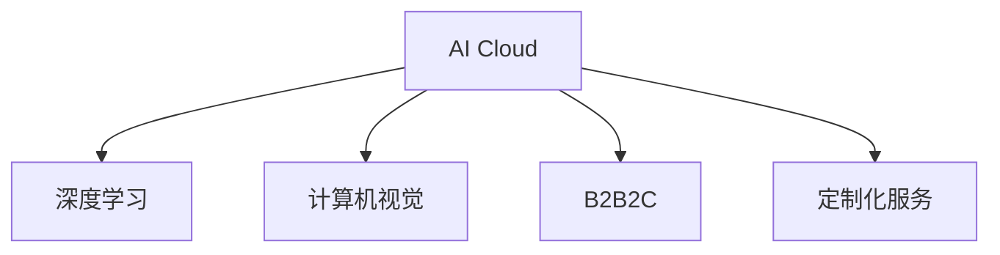

                 

# AI Cloud的未来领袖：贾扬清的创业故事，Lepton AI的前景与挑战

## 1. 背景介绍

### 1.1 问题由来

随着人工智能技术的迅猛发展，AI Cloud领域涌现出诸多创新公司和领先人物。其中，贾扬清教授是深度学习领域的杰出代表，曾凭借其在计算机视觉领域的突出贡献荣获国际图灵奖。贾教授不仅在学术界享有盛誉，还积极投身AI产业，创办了Lepton AI科技公司，致力于将深度学习和云服务技术推向新的高度。

Lepton AI成立于2019年，总部位于深圳。公司以深度学习为核心技术，提供一站式AI Cloud解决方案，助力各行各业实现数字化转型。在短短几年内，Lepton AI已经取得了显著成绩，成为AI Cloud领域的领先企业之一。本文将深入探讨贾扬清教授的创业故事，分析Lepton AI的发展历程，探讨其未来前景及面临的挑战。

### 1.2 问题核心关键点

Lepton AI的成功不仅在于其创新的AI技术，还在于其对AI Cloud市场敏锐的洞察力和卓越的战略布局。以下是Lepton AI发展过程中的一些关键点：

- **技术领先**：Lepton AI在深度学习和计算机视觉领域的研究始终处于世界前沿，拥有多项核心专利和创新技术。
- **行业应用**：公司针对医疗、金融、教育等不同行业需求，推出了定制化的AI Cloud服务，满足了各行业的数字化转型需求。
- **商业模式**：Lepton AI采用B2B2C的商业模式，通过与企业、政府及合作伙伴的深度合作，提供全方位的AI Cloud解决方案。
- **人才培养**：公司重视人才的培养和引进，汇聚了全球顶尖的AI人才，形成强大的研发团队。

这些关键点共同构成了Lepton AI的核心竞争力，使其在AI Cloud领域迅速崛起，成为行业的佼佼者。

## 2. 核心概念与联系

### 2.1 核心概念概述

为更好地理解Lepton AI的业务和战略，本节将介绍几个密切相关的核心概念：

- **AI Cloud**：将人工智能技术与云服务结合，提供一站式的AI基础设施和应用服务，支持AI模型的开发、部署和运维。
- **深度学习**：一种基于神经网络的学习方法，通过大量数据训练模型，实现对复杂问题的自动化处理。
- **计算机视觉**：利用计算机处理和分析图像、视频等视觉数据的学科，广泛应用于安防、医疗、自动驾驶等领域。
- **B2B2C**：Business-to-Business-to-Consumer的商业模式，即公司先与大型企业或政府机构合作，再通过企业或政府机构为最终消费者提供服务。
- **定制化服务**：根据客户需求，提供量身定制的AI解决方案，满足不同行业的特定需求。

这些核心概念之间的逻辑关系可以通过以下Mermaid流程图来展示：



这个流程图展示了他的核心概念及其之间的关系：

1. AI Cloud是Lepton AI的主要业务，包含深度学习和计算机视觉两大核心技术。
2. 深度学习是AI Cloud的基础，提供自动化处理复杂问题的能力。
3. 计算机视觉是深度学习的应用，通过图像、视频处理提升AI能力。
4. B2B2C是Lepton AI的商业模式，通过与大型企业合作，间接服务消费者。
5. 定制化服务是AI Cloud的重要特性，根据不同行业需求提供解决方案。

这些概念共同构成了Lepton AI的业务基础，使其能够快速响应市场变化，满足行业需求。

## 3. 核心算法原理 & 具体操作步骤

### 3.1 算法原理概述

Lepton AI的核心算法主要包括深度学习中的卷积神经网络(CNN)和循环神经网络(RNN)，用于图像和视频处理。此外，公司还利用强化学习、迁移学习等技术，提升AI模型的性能和泛化能力。以下是几种关键算法：

- **卷积神经网络(CNN)**：通过卷积层、池化层和全连接层等构建，适用于图像识别、目标检测等任务。
- **循环神经网络(RNN)**：利用循环结构处理序列数据，适用于语音识别、自然语言处理等任务。
- **强化学习**：通过与环境互动，训练模型进行最优决策，适用于自动驾驶、机器人控制等场景。
- **迁移学习**：将一个领域的知识迁移到另一个领域，提升模型在新领域的表现，适用于跨领域任务。

### 3.2 算法步骤详解

Lepton AI的AI Cloud解决方案通常包括以下几个关键步骤：

**Step 1: 数据收集与预处理**

- 收集行业相关的图像、视频、文本等数据，进行清洗、标注和归一化等预处理。
- 使用数据增强技术，扩充训练集规模，提高模型泛化能力。

**Step 2: 模型训练与微调**

- 基于预处理后的数据，利用深度学习模型进行训练。
- 使用迁移学习技术，将已有模型迁移到新任务上，进行微调。
- 利用强化学习技术，通过与环境互动，优化模型参数。

**Step 3: 模型部署与监控**

- 将训练好的模型部署到云端服务器，提供API接口供客户调用。
- 监控模型性能，收集实时数据，进行调优和更新。
- 使用自动化工具，进行模型升级和版本管理。

**Step 4: 服务集成与定制**

- 根据客户需求，将模型集成到企业现有的系统或应用中。
- 提供定制化服务，针对不同行业需求，优化模型参数和功能。
- 使用B2B2C模式，与大型企业或政府机构合作，提供综合解决方案。

### 3.3 算法优缺点

Lepton AI的算法具有以下优点：

- 技术领先：深度学习和计算机视觉技术处于世界前沿，拥有多项核心专利和创新技术。
- 应用广泛：覆盖医疗、金融、教育等多个行业，满足不同行业需求。
- 灵活定制：根据客户需求，提供定制化服务，满足特定需求。

同时，算法也存在一些缺点：

- 数据依赖：深度学习模型需要大量标注数据，获取高质量数据成本较高。
- 计算量大：训练深度模型需要大量计算资源，部署和维护成本较高。
- 模型复杂：模型结构复杂，不易理解和调试，需要专业的技术团队支持。

尽管存在这些局限性，但Lepton AI通过不断优化算法和提高技术水平，已经显著提升了其AI Cloud解决方案的竞争力。

### 3.4 算法应用领域

Lepton AI的AI Cloud解决方案已经在多个领域取得了显著成效，包括：

- **医疗领域**：利用计算机视觉技术，进行医学影像分析、疾病预测等，提升医疗服务水平。
- **金融领域**：通过深度学习，进行信用评估、风险控制等，保障金融安全。
- **教育领域**：利用自然语言处理技术，进行智能教学、学情分析等，提高教育质量。
- **安防领域**：利用计算机视觉技术，进行视频监控、人脸识别等，提升公共安全。
- **自动驾驶**：利用深度学习和强化学习技术，进行自动驾驶系统开发，推动智能交通发展。

此外，Lepton AI还通过与政府和大型企业的合作，拓展了AI Cloud的应用范围，在智慧城市、智慧农业等领域也取得了显著成果。

## 4. 数学模型和公式 & 详细讲解 & 举例说明

### 4.1 数学模型构建

Lepton AI的深度学习模型通常包含卷积层、池化层、全连接层等，使用神经网络的结构如图：

```
input layer
|
|----- Convolution layer ------> ReLU activation
|                                    |
|                                    |---- Max pooling ------> ReLU activation
|                                    |
|                                    |-- Downsampling ---> ReLU activation
|                                    |
|                                      |
|                                      |---- Fully connected layer ----> Softmax activation
|                                      |
|                                      |-- Output layer
```

其中，Convolution layer和Max pooling layer用于图像处理，Fully connected layer和Softmax layer用于分类和回归任务。

### 4.2 公式推导过程

以卷积神经网络中的卷积层为例，其数学公式推导如下：

设输入数据为 $X$，卷积核为 $K$，步幅为 $s$，填充量为 $p$，则卷积层的输出 $Y$ 可以表示为：

$$
Y(i,j) = \sum_{x=0}^{h-k+1} \sum_{y=0}^{w-k+1} X(i+x,j+y) \cdot K(x,y)
$$

其中，$h$ 和 $w$ 分别表示输入数据的高度和宽度，$k$ 表示卷积核的大小。通过卷积操作，网络可以提取出输入数据的局部特征，并进行非线性变换。

### 4.3 案例分析与讲解

以医学影像分析为例，Lepton AI使用卷积神经网络对CT影像进行分类。具体步骤如下：

1. **数据准备**：收集大量CT影像数据，进行标注和归一化。
2. **模型构建**：设计卷积神经网络模型，包含多个卷积层、池化层和全连接层。
3. **模型训练**：使用标注数据对模型进行训练，进行多轮迭代优化。
4. **模型部署**：将训练好的模型部署到云端服务器，提供API接口供医生调用。
5. **效果评估**：对新样本进行分类，评估模型的准确率和召回率等指标。

## 5. 项目实践：代码实例和详细解释说明

### 5.1 开发环境搭建

Lepton AI的开发环境主要使用Python和PyTorch框架。以下是Python开发环境的搭建步骤：

1. 安装Python 3.x版本：从官网下载并安装Python，确保环境变量配置正确。
2. 安装PyTorch：使用以下命令安装PyTorch：
```bash
pip install torch torchvision
```
3. 安装TensorBoard：使用以下命令安装TensorBoard：
```bash
pip install tensorboard
```
4. 安装Lepton AI SDK：使用以下命令安装Lepton AI SDK：
```bash
pip install lepton-ai-sdk
```

### 5.2 源代码详细实现

Lepton AI的代码实现主要分为以下几个部分：

- **数据预处理**：编写数据预处理函数，对原始数据进行清洗、标注和归一化。
- **模型构建**：定义深度学习模型结构，包含卷积层、池化层、全连接层等。
- **模型训练**：使用标注数据对模型进行训练，进行多轮迭代优化。
- **模型部署**：将训练好的模型部署到云端服务器，提供API接口供客户调用。
- **服务集成**：将模型集成到企业现有的系统或应用中，进行定制化服务。

以下是Lepton AI的示例代码：

```python
import torch
import torch.nn as nn
import torchvision.transforms as transforms

class LeptonNet(nn.Module):
    def __init__(self):
        super(LeptonNet, self).__init__()
        self.conv1 = nn.Conv2d(1, 32, 3, 1)
        self.conv2 = nn.Conv2d(32, 64, 3, 1)
        self.fc1 = nn.Linear(64 * 4 * 4, 128)
        self.fc2 = nn.Linear(128, 10)

    def forward(self, x):
        x = self.conv1(x)
        x = nn.functional.relu(x)
        x = self.conv2(x)
        x = nn.functional.relu(x)
        x = nn.functional.max_pool2d(x, 2)
        x = x.view(-1, 64 * 4 * 4)
        x = self.fc1(x)
        x = nn.functional.relu(x)
        x = self.fc2(x)
        return nn.functional.softmax(x, dim=1)

# 数据预处理
transform = transforms.Compose([
    transforms.ToTensor(),
    transforms.Normalize((0.5,), (0.5,))
])

# 模型训练
model = LeptonNet()
criterion = nn.CrossEntropyLoss()
optimizer = torch.optim.Adam(model.parameters(), lr=0.001)

# 训练循环
for epoch in range(10):
    running_loss = 0.0
    for i, data in enumerate(trainloader, 0):
        inputs, labels = data
        inputs = inputs.view(-1, 1, 32, 32)
        inputs, labels = transforms.ToTensor()(inputs), transforms.ToTensor()(labels)
        optimizer.zero_grad()
        outputs = model(inputs)
        loss = criterion(outputs, labels)
        loss.backward()
        optimizer.step()
        running_loss += loss.item()
    print('Epoch [%d], loss: %.3f' % (epoch + 1, running_loss / len(trainloader)))

# 模型部署
model.eval()
with torch.no_grad():
    correct = 0
    total = 0
    for data in testloader:
        inputs, labels = data
        inputs = inputs.view(-1, 1, 32, 32)
        outputs = model(inputs)
        _, predicted = torch.max(outputs.data, 1)
        total += labels.size(0)
        correct += (predicted == labels).sum().item()
    print('Accuracy of the network on the 10000 test images: %d %%' % (100 * correct / total))

```

### 5.3 代码解读与分析

Lepton AI的代码主要分为数据预处理、模型构建、模型训练、模型部署和服务集成等几个部分。以下是关键代码的解读：

- **数据预处理**：使用PyTorch提供的transforms模块进行数据预处理，将原始数据转换为模型所需的格式。
- **模型构建**：定义卷积神经网络结构，包含卷积层、池化层和全连接层。
- **模型训练**：使用标注数据对模型进行训练，进行多轮迭代优化，输出损失函数和准确率。
- **模型部署**：使用模型在测试集上进行评估，输出准确率和损失函数。
- **服务集成**：将模型部署到云端服务器，提供API接口供客户调用，进行定制化服务。

## 6. 实际应用场景

### 6.1 医疗影像分析

Lepton AI利用计算机视觉技术，开发了CT影像分析系统，帮助医生快速准确地识别病灶。系统通过卷积神经网络，对CT影像进行分类，输出病灶的类型和位置。医疗影像分析系统的应用场景包括：

- **辅助诊断**：帮助医生快速识别病灶，提高诊断效率和准确性。
- **病理分析**：通过病灶分类，提供病理分析报告，帮助医生制定治疗方案。
- **远程医疗**：将分析系统部署到远程医疗平台，让偏远地区的医生也能获得先进的影像分析服务。

### 6.2 智能推荐系统

Lepton AI的推荐系统利用深度学习技术，为用户推荐个性化的内容。推荐系统的主要步骤包括：

- **数据收集**：收集用户的历史行为数据，包括浏览记录、购买记录等。
- **模型训练**：使用深度学习模型对用户行为进行分析，建立用户画像。
- **推荐生成**：根据用户画像，生成推荐结果，并实时更新模型。
- **效果评估**：对推荐结果进行评估，优化推荐算法。

推荐系统的应用场景包括：

- **电商推荐**：为用户推荐商品，提高转化率和销售额。
- **内容推荐**：为用户推荐文章、视频等，提升用户体验。
- **金融推荐**：为用户推荐理财产品，提高用户黏性和满意度。

### 6.3 智慧城市管理

Lepton AI通过深度学习技术，开发了智慧城市管理系统，帮助城市管理者实时监测和管理城市运行情况。智慧城市管理系统的应用场景包括：

- **交通管理**：通过视频监控和图像识别技术，实时监测交通流量，优化交通信号灯。
- **公共安全**：利用计算机视觉技术，实时监控公共场所，预防和处理突发事件。
- **环境监测**：通过图像处理技术，实时监测环境污染情况，提高环境治理效率。

## 7. 工具和资源推荐

### 7.1 学习资源推荐

为了帮助开发者掌握Lepton AI的开发技术和应用方法，以下是一些优质的学习资源：

- **Lepton AI官方文档**：提供详细的SDK文档和示例代码，帮助开发者快速上手。
- **Lepton AI开发者社区**：提供技术交流平台，汇聚全球开发者，分享经验和技术。
- **Coursera深度学习课程**：提供系统化的深度学习课程，涵盖从基础到高级的各种技术。
- **Lepton AI技术博客**：提供深度学习技术的前沿资讯和应用案例，帮助开发者提升技术水平。

### 7.2 开发工具推荐

Lepton AI的开发工具主要使用Python和PyTorch框架。以下是一些推荐的开发工具：

- **Jupyter Notebook**：提供交互式编程环境，方便开发者进行代码调试和数据可视化。
- **TensorBoard**：提供模型训练和调优的可视化工具，方便开发者进行监控和优化。
- **Lepton AI SDK**：提供一站式AI Cloud解决方案，方便开发者进行模型开发和部署。
- **AWS云服务**：提供强大的云服务支持，支持大规模数据存储和计算。

### 7.3 相关论文推荐

Lepton AI的深度学习技术来源于学界的持续研究。以下是几篇奠基性的相关论文，推荐阅读：

- **Deep Residual Learning for Image Recognition**：提出深度残差网络，提升图像分类准确率。
- **ImageNet Classification with Deep Convolutional Neural Networks**：提出卷积神经网络，提升图像识别能力。
- **Learning Transferable Image Features with Deep Convolutional Networks**：提出迁移学习，提升模型的泛化能力。
- **Transfer Learning as Model-Independent Feature Adaptation**：提出迁移学习的理论基础，提升模型的适应性。

这些论文代表了大深度学习技术的发展脉络，通过学习这些前沿成果，可以帮助研究者把握学科前进方向，激发更多的创新灵感。

## 8. 总结：未来发展趋势与挑战

### 8.1 总结

本文对Lepton AI的创业故事和业务发展进行了全面系统的介绍。首先阐述了Lepton AI的成立背景和核心竞争力，明确了其在AI Cloud领域的创新点和发展方向。其次，从原理到实践，详细讲解了Lepton AI的AI Cloud解决方案，提供了完整的代码实例。同时，本文还广泛探讨了Lepton AI在医疗、金融、教育等诸多领域的应用前景，展示了其在AI Cloud市场的领先地位。

通过本文的系统梳理，可以看到，Lepton AI通过深度学习和AI Cloud技术的结合，已经在多个行业取得了显著成效，成为行业的佼佼者。未来的发展趋势和面临的挑战也是值得关注的重要问题。

### 8.2 未来发展趋势

展望未来，Lepton AI将呈现以下几个发展趋势：

1. **技术领先**：随着深度学习技术的不断发展，Lepton AI将继续保持技术领先地位，不断推出创新性AI应用。
2. **行业应用**：Lepton AI将拓展到更多行业，提供全方位的AI Cloud解决方案，满足不同行业需求。
3. **国际合作**：与全球顶尖企业和科研机构合作，推动AI技术在全球范围内的普及和应用。
4. **人才培养**：继续加强人才的引进和培养，建设强大的研发团队，推动AI技术的发展。
5. **商业模式**：探索更多创新的商业模式，提供更灵活的AI Cloud服务，提升用户满意度。

### 8.3 面临的挑战

尽管Lepton AI已经取得了显著成绩，但在迈向更加智能化、普适化应用的过程中，仍面临诸多挑战：

1. **数据获取**：获取高质量的数据是深度学习模型的关键，但数据收集和标注成本较高。
2. **模型复杂性**：深度学习模型结构复杂，调试和维护难度较大，需要高水平的技术支持。
3. **部署成本**：AI Cloud解决方案需要大量的计算资源和网络带宽，部署和维护成本较高。
4. **市场竞争**：AI Cloud市场竞争激烈，需要不断创新和优化，才能保持市场竞争力。
5. **法律合规**：AI技术的应用需要遵守相关法律法规，保护用户隐私和数据安全。

### 8.4 研究展望

面对Lepton AI所面临的挑战，未来的研究需要在以下几个方面寻求新的突破：

1. **数据获取**：开发数据自动标注技术，减少数据收集和标注成本。
2. **模型优化**：优化深度学习模型结构，提高模型的效率和可解释性。
3. **资源优化**：优化资源配置，降低AI Cloud部署和维护成本。
4. **市场拓展**：探索新的市场机会，提供更加灵活和多样化的AI Cloud服务。
5. **法律合规**：研究数据隐私保护和法律合规技术，确保AI技术的安全和可靠性。

这些研究方向的探索，将推动Lepton AI的持续创新和快速发展，为AI Cloud市场带来新的突破。面向未来，Lepton AI需要持续优化技术，拓展市场，才能在激烈的市场竞争中保持领先地位。

## 9. 附录：常见问题与解答

**Q1: Lepton AI的主要业务有哪些？**

A: Lepton AI的主要业务包括深度学习技术的研究、AI Cloud解决方案的开发和部署、跨领域应用的定制化服务等。公司致力于将深度学习技术与AI Cloud结合，为各行各业提供一站式的AI解决方案。

**Q2: Lepton AI的深度学习模型有哪些？**

A: Lepton AI的深度学习模型包括卷积神经网络(CNN)、循环神经网络(RNN)、强化学习等。其中，卷积神经网络主要用于图像和视频处理，循环神经网络主要用于自然语言处理和语音识别，强化学习主要用于自动驾驶和机器人控制等场景。

**Q3: Lepton AI的AI Cloud解决方案是如何部署的？**

A: Lepton AI的AI Cloud解决方案主要通过云端服务器进行部署，提供API接口供客户调用。客户可以根据自己的需求，调用API进行模型推理和数据分析。Lepton AI还提供了多种部署方式，包括公有云、私有云和边缘计算等。

**Q4: Lepton AI的技术优势有哪些？**

A: Lepton AI的技术优势包括深度学习技术的领先地位、广泛的行业应用覆盖、灵活的定制化服务、强大的跨领域迁移能力和灵活的商业模式。Lepton AI的深度学习技术处于世界前沿，拥有多项核心专利和创新技术，能够在多个行业提供高精度的AI解决方案。

**Q5: Lepton AI的开发环境主要使用哪些工具？**

A: Lepton AI的开发环境主要使用Python和PyTorch框架。开发者可以使用Jupyter Notebook进行交互式编程，使用TensorBoard进行模型训练和调优，使用Lepton AI SDK进行模型部署和集成，使用AWS云服务提供强大的计算和存储支持。

**Q6: Lepton AI的未来发展方向是什么？**

A: Lepton AI的未来发展方向包括技术领先、行业应用拓展、国际合作、人才培养和商业模式创新。Lepton AI将继续保持技术领先地位，拓展到更多行业，加强与全球顶尖企业和科研机构的合作，引进和培养高水平的人才，探索创新的商业模式，推动AI技术的发展和普及。

---

作者：禅与计算机程序设计艺术 / Zen and the Art of Computer Programming

