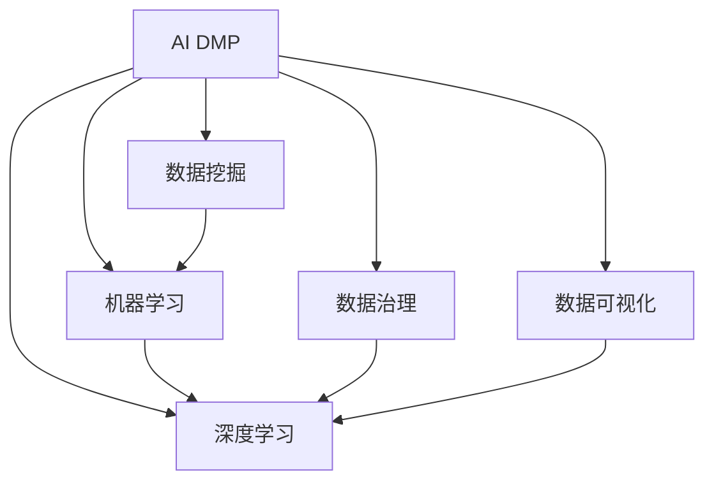

                 

# AI DMP 数据基建：数据应用与价值挖掘

在数字化时代，数据作为一种资产，其价值被越来越多的企业所认知。随着人工智能技术的兴起，数据分析的深度和广度也在不断拓展。AI DMP（人工智能驱动的数据营销平台）作为数据分析的重要工具，正在被越来越多的企业采用。本文将从背景介绍、核心概念、算法原理、实践案例、应用场景、资源推荐、未来展望等方面，深入探讨AI DMP的构建与价值挖掘。

## 1. 背景介绍

### 1.1 问题由来
AI DMP（人工智能驱动的数据营销平台）是利用人工智能技术对大规模数据进行挖掘和分析，以提高数据营销效果的平台。当前，随着互联网用户数量的激增，企业需要处理的数据量也越来越多，如何高效地利用这些数据，提升营销效果，成为了企业关注的焦点。

### 1.2 问题核心关键点
AI DMP的核心在于如何通过数据挖掘和分析，找到用户的行为模式和兴趣偏好，从而实现精准营销。AI DMP的核心挑战在于：

1. **数据采集和处理**：数据来源复杂，包括用户行为、交易记录、社交网络等多种数据源，数据格式和质量参差不齐。
2. **数据整合与清洗**：需要将不同来源的数据进行整合，消除数据重复和异常，提升数据质量。
3. **数据建模与分析**：通过机器学习、深度学习等技术，建立用户画像和行为模型，挖掘数据中的有用信息。
4. **策略优化**：将挖掘出的信息应用于营销策略，提升营销效果，实现个性化推荐和智能投放。

## 2. 核心概念与联系

### 2.1 核心概念概述

为更好地理解AI DMP的构建与价值挖掘，本节将介绍几个密切相关的核心概念：

- **AI DMP**：基于人工智能技术的数据营销平台，通过数据挖掘和分析，提升用户画像和行为模型的精准度，实现个性化推荐和智能投放。
- **数据挖掘（Data Mining）**：从大规模数据中提取有用信息和知识的过程，是AI DMP的核心技术之一。
- **机器学习（Machine Learning）**：通过算法从数据中学习模式和规律，是AI DMP中数据建模和分析的重要手段。
- **深度学习（Deep Learning）**：利用神经网络等技术，从数据中提取更高级别的特征和规律，适合处理大规模数据和复杂模式识别问题。
- **数据治理（Data Governance）**：确保数据的质量、完整性和安全性，是AI DMP数据管理的重要环节。
- **数据可视化（Data Visualization）**：通过图表和可视化工具，帮助企业理解数据中的趋势和模式，是AI DMP数据分析的重要输出。

这些核心概念之间的逻辑关系可以通过以下Mermaid流程图来展示：



这个流程图展示AI DMP的核心概念及其之间的关系：

1. AI DMP以数据挖掘为基础，提取数据中的有用信息。
2. 机器学习和深度学习是数据建模和分析的主要技术手段。
3. 数据治理确保数据的质量和安全性，是数据管理的重要环节。
4. 数据可视化提供数据分析的直观输出，帮助企业决策。

## 3. 核心算法原理 & 具体操作步骤

### 3.1 算法原理概述

AI DMP的核心算法主要分为数据挖掘、数据建模、策略优化三个步骤：

1. **数据挖掘**：利用机器学习和深度学习技术，从数据中提取用户行为和兴趣模式。
2. **数据建模**：通过数据挖掘得到的模式，建立用户画像和行为模型。
3. **策略优化**：将用户画像和行为模型应用于营销策略，实现个性化推荐和智能投放。

### 3.2 算法步骤详解

**Step 1: 数据采集与处理**
- 收集用户行为数据、交易记录、社交网络等多种来源的数据。
- 进行数据清洗和整合，消除数据重复和异常，提升数据质量。

**Step 2: 数据建模与分析**
- 利用机器学习或深度学习算法，建立用户行为和兴趣模型。
- 选择合适的特征和算法，如用户兴趣、行为序列、社交网络等。
- 在模型训练过程中，引入正则化技术，如L2正则、Dropout等，避免过拟合。

**Step 3: 策略优化与效果评估**
- 将用户画像和行为模型应用于营销策略，进行个性化推荐和智能投放。
- 通过A/B测试等方法，评估营销策略的效果，不断优化和迭代。

### 3.3 算法优缺点

AI DMP具有以下优点：

1. **精准度提升**：通过机器学习和深度学习技术，挖掘用户行为和兴趣模式，提高用户画像和行为模型的精准度。
2. **个性化推荐**：利用用户画像和行为模型，实现个性化推荐，提升用户体验和转化率。
3. **智能投放**：通过数据分析，优化广告投放策略，提升广告点击率和转化率。

同时，AI DMP也存在一些局限性：

1. **数据质量依赖**：AI DMP的效果很大程度上依赖于数据的质量和数量，获取高质量数据的成本较高。
2. **算法复杂度**：机器学习和深度学习算法较为复杂，需要较多的计算资源和时间。
3. **策略优化难度**：营销策略的优化涉及多维度因素，如用户行为、市场环境、竞争状况等，难以快速迭代优化。

### 3.4 算法应用领域

AI DMP在多个领域得到了广泛应用，包括但不限于：

- **电商**：通过分析用户行为和兴趣，进行个性化推荐和智能投放，提升销售转化率。
- **金融**：通过分析用户交易记录和行为模式，进行风险评估和欺诈检测，提升金融服务质量。
- **广告**：通过数据分析，优化广告投放策略，提升广告点击率和转化率。
- **医疗**：通过分析患者健康数据，提供个性化医疗服务，提升医疗服务质量。
- **教育**：通过分析学生学习数据，提供个性化教育推荐，提升教育效果。

## 4. 数学模型和公式 & 详细讲解 & 举例说明

### 4.1 数学模型构建

在AI DMP中，常用的数学模型包括：

1. **协同过滤（Collaborative Filtering）**：通过分析用户行为和物品属性，找到相似用户和相似物品，进行推荐。
2. **深度学习模型（如CTR预测模型）**：通过深度神经网络，预测用户点击率和转化率，进行广告投放优化。
3. **聚类分析（Clustering）**：将用户按照兴趣和行为模式进行分组，进行个性化推荐。

### 4.2 公式推导过程

以协同过滤为例，其基本公式如下：

$$
\hat{y}_{ui} = \sum_{j=1}^n a_{uji}y_{ji}
$$

其中，$y_{ui}$表示用户$u$对物品$i$的评分，$a_{uji}$表示用户$u$对物品$i$的评分与物品$i$的评分之间的相似度。

### 4.3 案例分析与讲解

假设某电商网站希望通过AI DMP进行个性化推荐，可以选择协同过滤模型，输入用户行为数据和物品属性数据，输出用户对不同物品的评分预测。通过模型训练和优化，提升推荐精度和用户体验。

## 5. 项目实践：代码实例和详细解释说明

### 5.1 开发环境搭建

在进行AI DMP开发前，我们需要准备好开发环境。以下是使用Python进行PyTorch开发的环境配置流程：

1. 安装Anaconda：从官网下载并安装Anaconda，用于创建独立的Python环境。

2. 创建并激活虚拟环境：
```bash
conda create -n pytorch-env python=3.8 
conda activate pytorch-env
```

3. 安装PyTorch：根据CUDA版本，从官网获取对应的安装命令。例如：
```bash
conda install pytorch torchvision torchaudio cudatoolkit=11.1 -c pytorch -c conda-forge
```

4. 安装各类工具包：
```bash
pip install numpy pandas scikit-learn matplotlib tqdm jupyter notebook ipython
```

完成上述步骤后，即可在`pytorch-env`环境中开始AI DMP的开发。

### 5.2 源代码详细实现

以下是使用PyTorch对协同过滤模型进行实现的代码实现：

```python
import torch
from torch.nn import Embedding, Linear, Sigmoid
from torch.optim import Adam

class CollaborativeFilteringModel(torch.nn.Module):
    def __init__(self, num_users, num_items, embed_dim):
        super(CollaborativeFilteringModel, self).__init__()
        self.user_embed = Embedding(num_users, embed_dim)
        self.item_embed = Embedding(num_items, embed_dim)
        self.linear = Linear(embed_dim * 2, 1)
        
    def forward(self, user_ids, item_ids):
        user_embeddings = self.user_embed(user_ids)
        item_embeddings = self.item_embed(item_ids)
        concatenated_embeddings = torch.cat([user_embeddings, item_embeddings], dim=1)
        prediction = self.linear(concatenated_embeddings)
        return Sigmoid(prediction)
        
model = CollaborativeFilteringModel(num_users=1000, num_items=1000, embed_dim=100)
optimizer = Adam(model.parameters(), lr=0.001)
criterion = torch.nn.BCELoss()
```

### 5.3 代码解读与分析

让我们再详细解读一下关键代码的实现细节：

**CollaborativeFilteringModel类**：
- `__init__`方法：初始化用户嵌入和物品嵌入，以及全连接层。
- `forward`方法：前向传播计算预测评分。
- `__getitem__`方法：接收用户ID和物品ID，输出预测评分。

**训练函数**：
```python
def train(model, train_loader, optimizer, criterion, num_epochs):
    model.train()
    for epoch in range(num_epochs):
        for user_ids, item_ids, labels in train_loader:
            optimizer.zero_grad()
            predictions = model(user_ids, item_ids)
            loss = criterion(predictions, labels)
            loss.backward()
            optimizer.step()
```

**评估函数**：
```python
def evaluate(model, test_loader):
    model.eval()
    correct = 0
    total = 0
    for user_ids, item_ids, labels in test_loader:
        predictions = model(user_ids, item_ids)
        _, predicted = torch.max(predictions, 1)
        total += labels.size(0)
        correct += (predicted == labels).sum().item()
    return correct / total
```

**训练流程**：
```python
num_epochs = 10
batch_size = 128

train_loader = DataLoader(train_dataset, batch_size=batch_size)
test_loader = DataLoader(test_dataset, batch_size=batch_size)

model.train()
for epoch in range(num_epochs):
    train_loss = train(model, train_loader, optimizer, criterion, num_epochs)
    test_accuracy = evaluate(model, test_loader)
    print(f'Epoch {epoch+1}, train loss: {train_loss:.3f}, test accuracy: {test_accuracy:.3f}')
```

### 5.4 运行结果展示

通过上述代码实现，我们可以训练一个简单的协同过滤模型，并进行训练和评估。

## 6. 实际应用场景

### 6.1 智能推荐系统

AI DMP的核心应用之一是智能推荐系统。电商、视频、音乐等领域，通过AI DMP进行用户画像和行为模型分析，实现个性化推荐，提升用户体验和转化率。

**电商推荐**：某电商网站通过分析用户浏览、点击、购买行为数据，建立用户画像和行为模型。通过协同过滤、深度学习等技术，进行个性化推荐，提升用户购买率和满意度。

**视频推荐**：某视频平台通过分析用户观看行为数据，建立用户画像和行为模型。通过协同过滤、深度学习等技术，进行个性化推荐，提升用户观看时长和订阅率。

**音乐推荐**：某音乐平台通过分析用户听歌行为数据，建立用户画像和行为模型。通过协同过滤、深度学习等技术，进行个性化推荐，提升用户听歌时长和付费率。

### 6.2 风险评估系统

AI DMP在风险评估系统中也得到广泛应用。金融、保险等领域，通过AI DMP进行用户行为分析，进行信用评估、欺诈检测、风险预警等。

**金融信用评估**：某银行通过AI DMP分析用户交易行为数据，建立用户画像和行为模型。通过机器学习模型，进行信用评估，提升信用审批效率和准确率。

**保险欺诈检测**：某保险公司通过AI DMP分析用户索赔行为数据，建立用户画像和行为模型。通过异常检测算法，进行欺诈检测，降低保险公司赔付风险。

**风险预警系统**：某金融机构通过AI DMP分析市场数据、用户行为数据，建立用户画像和行为模型。通过预测模型，进行风险预警，提前发现市场异常，避免金融风险。

### 6.3 智能广告投放系统

AI DMP在智能广告投放系统中也得到广泛应用。广告主通过AI DMP进行用户画像和行为模型分析，实现精准投放，提升广告点击率和转化率。

**精准广告投放**：某广告主通过AI DMP分析用户行为数据，建立用户画像和行为模型。通过协同过滤、深度学习等技术，进行精准广告投放，提升广告点击率和转化率。

**智能广告优化**：某广告平台通过AI DMP分析用户行为数据，建立用户画像和行为模型。通过优化算法，实时调整广告投放策略，提升广告效果。

**广告效果评估**：某广告公司通过AI DMP分析用户点击数据、转化数据，建立用户画像和行为模型。通过效果评估算法，评估广告效果，优化广告投放策略。

### 6.4 未来应用展望

随着AI DMP技术的发展，未来的应用场景将更加广泛，涵盖更多领域。以下是一些可能的未来应用场景：

- **智慧医疗**：通过AI DMP分析患者健康数据，进行个性化医疗服务，提升医疗服务质量。
- **智能交通**：通过AI DMP分析用户出行数据，进行个性化交通规划，提升交通效率和用户体验。
- **智能家居**：通过AI DMP分析用户家居数据，进行个性化家居控制，提升家居智能水平。
- **智能教育**：通过AI DMP分析学生学习数据，进行个性化教育推荐，提升教育效果。
- **智能城市**：通过AI DMP分析城市运行数据，进行智能城市管理，提升城市管理效率。

## 7. 工具和资源推荐

### 7.1 学习资源推荐

为了帮助开发者系统掌握AI DMP的构建与价值挖掘，这里推荐一些优质的学习资源：

1. **《深度学习入门》系列博文**：由AI DMP专家撰写，深入浅出地介绍了深度学习基本原理和应用案例。

2. **Coursera《深度学习专项课程》**：由斯坦福大学主导的深度学习课程，涵盖了深度学习的基础知识和前沿技术。

3. **《Python机器学习》书籍**：介绍机器学习算法和应用，适合初学者和中级开发者。

4. **Kaggle**：提供大量数据集和竞赛，帮助开发者实践和提升AI DMP开发能力。

5. **CS229《机器学习》课程**：斯坦福大学开设的机器学习课程，适合深入学习机器学习理论和算法。

通过对这些资源的学习实践，相信你一定能够快速掌握AI DMP的精髓，并用于解决实际的业务问题。

### 7.2 开发工具推荐

高效的开发离不开优秀的工具支持。以下是几款用于AI DMP开发的常用工具：

1. **PyTorch**：基于Python的开源深度学习框架，适合快速迭代研究和开发。

2. **TensorFlow**：由Google主导开发的开源深度学习框架，生产部署方便，适合大规模工程应用。

3. **Scikit-learn**：开源机器学习库，适合进行数据预处理和特征工程。

4. **Pandas**：开源数据分析库，适合进行数据清洗和处理。

5. **TensorBoard**：TensorFlow配套的可视化工具，可实时监测模型训练状态，并提供丰富的图表呈现方式。

6. **Jupyter Notebook**：开源Jupyter Notebook环境，免费提供GPU/TPU算力，方便开发者快速上手实验最新模型。

合理利用这些工具，可以显著提升AI DMP开发的效率，加快创新迭代的步伐。

### 7.3 相关论文推荐

AI DMP技术的发展源于学界的持续研究。以下是几篇奠基性的相关论文，推荐阅读：

1. **《协同过滤算法综述》**：介绍协同过滤算法的原理和应用。

2. **《深度学习应用于推荐系统的研究》**：介绍深度学习在推荐系统中的应用。

3. **《机器学习与数据挖掘在金融领域的应用》**：介绍机器学习在金融领域的应用。

4. **《深度学习与自然语言处理》**：介绍深度学习在自然语言处理中的应用。

5. **《智能广告投放系统优化》**：介绍智能广告投放系统的优化方法。

这些论文代表了大语言模型微调技术的发展脉络。通过学习这些前沿成果，可以帮助研究者把握学科前进方向，激发更多的创新灵感。

## 8. 总结：未来发展趋势与挑战

### 8.1 研究成果总结

本文对AI DMP的构建与价值挖掘进行了全面系统的介绍。首先阐述了AI DMP的研究背景和意义，明确了AI DMP在数据营销中的独特价值。其次，从原理到实践，详细讲解了AI DMP的数学模型和操作步骤，给出了AI DMP开发的全套代码实现。同时，本文还广泛探讨了AI DMP在多个行业领域的应用前景，展示了AI DMP的广阔应用前景。

### 8.2 未来发展趋势

展望未来，AI DMP技术将呈现以下几个发展趋势：

1. **数据源多样化**：AI DMP将从单一的数据源，拓展到多维度、多领域的数据源，提升数据的多样性和全面性。

2. **算法融合创新**：AI DMP将融合机器学习、深度学习、强化学习等多种算法，提升数据建模和分析的精度和效率。

3. **智能决策支持**：AI DMP将融合更多先验知识，如专家规则、知识图谱等，提升数据决策的准确性和智能化水平。

4. **个性化推荐优化**：AI DMP将进一步优化个性化推荐算法，提升用户体验和转化率。

5. **实时化智能投放**：AI DMP将实现实时数据采集和分析，实时调整广告投放策略，提升广告效果。

6. **全流程自动化**：AI DMP将实现从数据采集、处理、建模、优化到投放的全流程自动化，提升数据营销的效率和效果。

以上趋势凸显了AI DMP技术的广阔前景。这些方向的探索发展，必将进一步提升AI DMP的效果和应用范围，为数据营销带来新的突破。

### 8.3 面临的挑战

尽管AI DMP技术已经取得了瞩目成就，但在迈向更加智能化、普适化应用的过程中，它仍面临着诸多挑战：

1. **数据隐私与安全**：AI DMP需要处理大量敏感数据，如何保障数据隐私和安全，是一个重要挑战。

2. **算法透明与可解释性**：AI DMP的算法模型往往复杂，难以解释其内部工作机制和决策逻辑，对算法透明性与可解释性提出了较高要求。

3. **模型公平性与偏见**：AI DMP在处理用户数据时，如何避免模型偏见，提升模型公平性，是一个重要问题。

4. **数据质量与多样性**：AI DMP的效果很大程度上依赖于数据的质量和多样性，如何获取高质量、高多样性的数据，是一个重要挑战。

5. **技术集成与协同**：AI DMP需要与其他技术（如自然语言处理、图像识别等）进行协同，如何实现技术集成，是一个重要挑战。

6. **算法优化与效率**：AI DMP的算法模型往往较为复杂，如何提升算法效率，降低计算成本，是一个重要挑战。

### 8.4 研究展望

面对AI DMP所面临的挑战，未来的研究需要在以下几个方面寻求新的突破：

1. **数据隐私保护**：开发更加高效的数据隐私保护技术，保障用户数据安全。

2. **算法透明性与可解释性**：开发更透明的、可解释的AI DMP算法，提升用户信任度。

3. **模型公平性与偏见**：开发公平性保障技术，提升AI DMP算法的公平性。

4. **数据质量提升**：开发更加高效的数据采集和处理技术，提升数据质量。

5. **技术集成优化**：开发更加高效的技术集成技术，提升AI DMP的性能和效果。

6. **算法优化与效率**：开发更高效的算法模型，提升AI DMP的计算效率。

这些研究方向的探索，必将引领AI DMP技术迈向更高的台阶，为数据营销带来新的突破。

## 9. 附录：常见问题与解答

**Q1: AI DMP是否适用于所有行业？**

A: AI DMP在大多数行业都有广泛的应用前景。电商、金融、保险、医疗、教育等行业，都可以通过AI DMP进行数据挖掘和分析，提升营销效果和业务质量。但对于一些特定行业，如航天、国防等，AI DMP的应用需要考虑到数据敏感性和隐私保护问题。

**Q2: 如何提升AI DMP的算法效率？**

A: 提升AI DMP的算法效率可以从以下几个方面入手：

1. **数据预处理**：进行数据清洗和特征工程，提升数据质量。

2. **模型优化**：采用更加高效的模型结构，如稀疏表示、低秩表示等。

3. **分布式计算**：采用分布式计算技术，提升计算效率。

4. **硬件加速**：采用GPU、TPU等硬件加速技术，提升计算速度。

5. **算法并行**：采用模型并行、数据并行等并行计算技术，提升计算效率。

6. **参数压缩**：采用参数压缩技术，减小模型尺寸，提升计算效率。

**Q3: 如何保护用户数据隐私？**

A: 保护用户数据隐私可以从以下几个方面入手：

1. **数据匿名化**：对用户数据进行匿名化处理，保护用户隐私。

2. **差分隐私**：采用差分隐私技术，限制模型对用户数据的敏感性。

3. **联邦学习**：采用联邦学习技术，在本地设备上进行数据处理和模型训练，保护用户数据隐私。

4. **数据加密**：对用户数据进行加密处理，保护数据安全。

5. **访问控制**：采用访问控制技术，限制数据访问权限，保护用户数据隐私。

6. **数据备份与恢复**：建立数据备份与恢复机制，保护数据安全。

这些措施可以相互配合，从多个维度保护用户数据隐私。

**Q4: 如何提升AI DMP的可解释性？**

A: 提升AI DMP的可解释性可以从以下几个方面入手：

1. **模型可视化**：采用模型可视化技术，展示模型的内部工作机制和决策逻辑。

2. **特征重要性分析**：采用特征重要性分析技术，展示模型中重要特征和权重。

3. **因果分析**：采用因果分析技术，展示模型决策的因果关系。

4. **规则库融合**：将专家规则和知识图谱等先验知识融入模型，提升模型可解释性。

5. **用户交互**：通过用户交互和反馈，提升模型的可解释性和用户信任度。

6. **模型透明性**：采用更加透明的算法和模型结构，提升模型可解释性。

这些措施可以相互配合，从多个维度提升AI DMP的可解释性。

**Q5: 如何优化AI DMP的实时化智能投放？**

A: 优化AI DMP的实时化智能投放可以从以下几个方面入手：

1. **数据实时采集**：采用实时数据采集技术，获取实时数据。

2. **模型实时更新**：采用模型实时更新技术，根据实时数据调整模型参数。

3. **推荐实时化**：采用实时推荐技术，根据实时数据生成实时推荐结果。

4. **决策实时化**：采用实时决策技术，根据实时数据进行实时决策。

5. **用户行为实时分析**：采用实时分析技术，实时分析用户行为数据。

6. **系统实时化**：采用实时系统技术，提升系统响应速度和效率。

这些措施可以相互配合，从多个维度优化AI DMP的实时化智能投放。

---

作者：禅与计算机程序设计艺术 / Zen and the Art of Computer Programming

