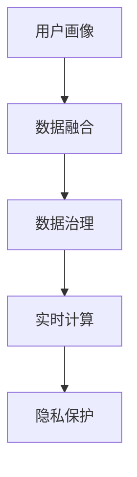

                 

# AI DMP 数据基建：构建智能营销的核心引擎

> 关键词：AI DMP, 数据基建, 智能营销, 用户画像, 数据融合, 数据治理, 算法优化, 实时计算, 隐私保护

## 1. 背景介绍

在数字化时代，数据驱动决策成为企业竞争的关键。尤其是对于市场营销领域，精准的用户洞察和高效的营销投放决策，需要依托于强大的数据管理和分析能力。AI DMP（Advertising Data Management Platform，广告数据管理平台）应运而生，通过集中管理和深度分析用户数据，帮助广告主实现更精准的定向投放和广告优化，提升营销ROI（投资回报率）。

AI DMP的核心优势在于，它不仅能够处理和分析用户的静态数据，如年龄、性别、地理位置等，还能整合用户的动态行为数据，如浏览记录、点击行为、购买记录等，进行深度挖掘和实时计算，生成全面的用户画像。基于这些精准的用户画像，广告主可以更有效地进行广告投放和策略优化，实现更低的营销成本和更高的投资回报率。

### 1.1 问题由来
随着互联网的普及和社交媒体的兴起，用户行为数据的收集和分析变得愈发重要。然而，分散在各个平台上的数据往往格式不一、质量参差，难以整合使用。此外，用户隐私保护和数据安全问题也日渐突出，需要综合考虑用户隐私权和数据价值之间的平衡。AI DMP作为数据管理和分析的关键工具，正是在这一背景下应运而生。

### 1.2 问题核心关键点
AI DMP的核心关键点在于：

- **数据集中与整合**：将来自不同渠道和平台的用户数据集中到一个平台，进行格式转换和标准化，便于后续分析和应用。
- **深度数据分析**：不仅处理静态人口统计数据，还整合动态行为数据，通过数据挖掘和机器学习技术生成精准的用户画像。
- **实时计算与处理**：具备实时数据处理和计算能力，能够对用户行为进行实时监控和分析，快速响应用户变化和市场动态。
- **隐私保护**：在数据整合和分析过程中，遵循隐私保护原则，对用户数据进行匿名化和加密处理，确保数据安全。

这些核心关键点共同构成了AI DMP的技术框架和应用场景，使其在智能营销中发挥重要作用。

## 2. 核心概念与联系

### 2.1 核心概念概述

为更好地理解AI DMP的数据基建和应用，本节将介绍几个密切相关的核心概念：

- **用户画像(User Profile)**：通过对用户静态和动态数据的集中与分析，生成详细的用户画像，帮助广告主更好地了解用户行为和需求。
- **数据融合(Data Integration)**：将来自不同来源和格式的用户数据进行整合和标准化，形成统一的数据集合。
- **数据治理(Data Governance)**：制定数据标准和治理策略，确保数据质量和隐私安全，维护数据资产的完整性和可靠性。
- **实时计算(Real-time Computing)**：具备快速处理和分析海量数据的能力，支持实时监控和动态调整广告投放策略。
- **隐私保护(Privacy Protection)**：遵循数据隐私法规，如GDPR、CCPA等，对用户数据进行匿名化和加密处理，确保数据安全。

这些核心概念之间的逻辑关系可以通过以下Mermaid流程图来展示：



这个流程图展示了大语言模型的核心概念及其之间的关系：

1. 用户画像生成依赖于数据融合和治理，整合后的高质量数据是生成用户画像的基础。
2. 实时计算能力确保了用户画像的动态性和时效性，帮助广告主进行实时决策。
3. 隐私保护是数据治理的一部分，通过遵循数据隐私法规，确保用户数据的安全。

## 3. 核心算法原理 & 具体操作步骤
### 3.1 算法原理概述

AI DMP的数据基建，本质上是一个复杂的数据融合与分析过程。其核心思想是：通过集中和整合来自不同渠道的用户数据，利用机器学习算法进行深度挖掘和分析，生成全面的用户画像，支持智能营销的各个环节。

具体而言，AI DMP的数据基建过程包括以下几个步骤：

1. **数据收集与清洗**：从不同渠道和平台收集用户数据，并进行清洗、去重和格式化处理，确保数据的质量和一致性。
2. **数据融合与标准化**：对收集到的数据进行格式转换和标准化，整合为统一的数据集。
3. **数据治理与质量控制**：制定数据标准和治理策略，对数据进行质量检查和清洗，确保数据完整性和准确性。
4. **深度分析与用户画像生成**：利用机器学习算法对数据进行深度分析和挖掘，生成详细的用户画像。
5. **实时计算与动态分析**：具备实时处理和分析海量数据的能力，支持实时监控和动态调整广告投放策略。

### 3.2 算法步骤详解

AI DMP的数据基建步骤具体如下：

#### 3.2.1 数据收集与清洗
- **数据来源**：收集来自社交媒体、电商网站、移动应用等不同渠道的用户数据，如浏览器历史、搜索记录、购买记录、社交互动等。
- **数据清洗**：对收集到的数据进行去重、去噪、格式化处理，确保数据质量和一致性。

#### 3.2.2 数据融合与标准化
- **数据格式转换**：对来自不同平台的数据进行格式转换，统一为AI DMP支持的格式。
- **数据标准化**：对不同来源的数据进行标准化处理，确保同一属性的数据格式一致。

#### 3.2.3 数据治理与质量控制
- **数据标准制定**：制定数据标准，如字段命名、数据类型、编码规范等，确保数据一致性。
- **数据质量检查**：定期对数据进行质量检查和清洗，确保数据完整性和准确性。
- **数据访问控制**：设定数据访问权限，确保数据安全和隐私保护。

#### 3.2.4 深度分析与用户画像生成
- **数据挖掘**：利用机器学习算法，如分类、聚类、回归等，对数据进行深度挖掘和分析。
- **用户画像生成**：根据挖掘结果，生成详细的用户画像，包括用户行为、兴趣、偏好等。

#### 3.2.5 实时计算与动态分析
- **实时数据处理**：具备快速处理和分析海量数据的能力，支持实时监控和动态调整广告投放策略。
- **动态分析**：根据用户行为和市场动态，实时调整广告投放策略，优化广告效果。

### 3.3 算法优缺点

AI DMP的数据基建方法具有以下优点：
1. **数据集中与整合**：将来自不同渠道的数据集中到一个平台，便于后续分析和应用。
2. **深度分析能力**：不仅处理静态数据，还整合动态行为数据，生成全面的用户画像，提供更精准的用户洞察。
3. **实时处理能力**：具备快速处理和分析海量数据的能力，支持实时监控和动态调整广告投放策略。
4. **隐私保护措施**：在数据整合和分析过程中，遵循隐私保护原则，确保数据安全。

同时，该方法也存在一定的局限性：
1. **数据获取难度**：不同渠道和平台的数据格式不一，数据收集和清洗难度较大。
2. **数据质量问题**：数据来源广泛，数据质量参差不齐，可能导致分析结果的偏差。
3. **数据治理复杂**：数据标准和治理策略的制定和管理，需要耗费大量资源和时间。
4. **实时计算资源消耗大**：实时计算和动态分析需要高性能计算资源，成本较高。

尽管存在这些局限性，但就目前而言，AI DMP的数据基建方法仍然是大数据时代智能营销的重要手段。未来相关研究的重点在于如何进一步降低数据获取和清洗的难度，提高数据质量，优化数据治理策略，降低实时计算的资源消耗。

### 3.4 算法应用领域

AI DMP的数据基建方法在多个领域得到了广泛应用，例如：

- **智能广告投放**：根据用户画像和行为数据，进行精准定向投放，提升广告效果和ROI。
- **个性化推荐系统**：通过对用户行为和兴趣的深度分析，提供个性化商品推荐，提高用户满意度和购买转化率。
- **客户关系管理**：通过整合用户数据，生成详细的客户画像，进行客户细分和精准营销，提升客户忠诚度和品牌价值。
- **市场分析与预测**：利用用户数据进行市场趋势分析和预测，帮助企业制定更科学的市场策略。
- **用户体验优化**：通过分析用户行为数据，优化产品功能和用户体验，提升用户黏性和满意度。

除了上述这些经典应用外，AI DMP的数据基建方法还被创新性地应用到更多场景中，如智能客服、智能运维、智能投顾等，为各个领域带来了新的变革和突破。

## 4. 数学模型和公式 & 详细讲解 & 举例说明

### 4.1 数学模型构建

AI DMP的数据基建过程涉及多个数据处理和分析步骤，以下是主要的数学模型构建：

**数据融合模型**：
- 设原始数据集为 $\{(x_i, y_i)\}_{i=1}^N$，其中 $x_i$ 为特征向量，$y_i$ 为标签。
- 数据融合后的新数据集为 $\{(x'_i, y'_i)\}_{i=1}^N$，其中 $x'_i$ 为融合后的特征向量，$y'_i$ 为融合后的标签。

**数据治理模型**：
- 设数据集 $\{(x_i, y_i)\}_{i=1}^N$ 需要进行质量检查和清洗，设定一个质量评估函数 $f(x_i, y_i)$。
- 数据治理后的新数据集为 $\{(x''_i, y''_i)\}_{i=1}^N$，其中 $x''_i = x_i$ 或 $x''_i = f(x_i)$，$y''_i = y_i$ 或 $y''_i = f(y_i)$。

**用户画像生成模型**：
- 设用户画像为 $P(u)$，其中 $u$ 为用户ID。
- 利用机器学习算法，如聚类、分类等，对数据集 $\{(x'_i, y'_i)\}_{i=1}^N$ 进行建模，生成用户画像 $P(u)$。

**实时计算模型**：
- 设实时数据流为 $D_t = \{d_{t1}, d_{t2}, \dots, d_{tk}\}$，其中 $t$ 为时间戳，$k$ 为数据量。
- 实时计算后的新数据流为 $D'_t$，其中 $D'_t = \{d'_{t1}, d'_{t2}, \dots, d'_{tk}\}$，$h(d'_i) = h(d_i)$，$h$ 为计算函数。

### 4.2 公式推导过程

以下以用户画像生成为例，推导其数学模型和公式：

**用户画像生成算法**：
- 设原始数据集为 $\{(x_i, y_i)\}_{i=1}^N$，其中 $x_i = [x_{i1}, x_{i2}, \dots, x_{in}]$ 为特征向量，$y_i$ 为标签。
- 利用聚类算法，将数据集分为 $K$ 个簇，每个簇的聚类中心为 $\mu_k$，聚类半径为 $\epsilon_k$。
- 对于每个用户 $u$，根据其特征向量 $x_u$ 与各个聚类中心的距离，将其分配到最近的聚类 $k_u$。
- 用户画像 $P(u)$ 定义为该用户所属的聚类中心 $\mu_{k_u}$ 和聚类半径 $\epsilon_{k_u}$。

**聚类算法**：
- 设数据集 $\{(x_i, y_i)\}_{i=1}^N$，其中 $x_i = [x_{i1}, x_{i2}, \dots, x_{in}]$ 为特征向量，$y_i$ 为标签。
- 利用聚类算法，如K-means、DBSCAN等，将数据集分为 $K$ 个簇，每个簇的聚类中心为 $\mu_k$，聚类半径为 $\epsilon_k$。
- 对于每个用户 $u$，根据其特征向量 $x_u$ 与各个聚类中心的距离，将其分配到最近的聚类 $k_u$。

### 4.3 案例分析与讲解

以一个电商平台的智能广告投放为例，说明AI DMP的数据基建过程：

1. **数据收集与清洗**：收集用户在电商平台上的浏览、点击、购买等行为数据，进行去重、去噪和格式化处理。
2. **数据融合与标准化**：将不同来源的数据，如用户ID、商品ID、购买金额等，统一为AI DMP支持的格式。
3. **数据治理与质量控制**：制定数据标准，如字段命名、数据类型、编码规范等，定期对数据进行质量检查和清洗。
4. **深度分析与用户画像生成**：利用聚类算法，将用户数据分为不同兴趣群组，生成详细的用户画像，如时尚、运动、科技等。
5. **实时计算与动态分析**：根据用户画像和实时数据流，进行精准定向投放，动态调整广告投放策略，提升广告效果和ROI。

## 5. 项目实践：代码实例和详细解释说明
### 5.1 开发环境搭建

在进行AI DMP数据基建实践前，我们需要准备好开发环境。以下是使用Python进行Apache Spark和PySpark开发的环境配置流程：

1. 安装Apache Spark：从官网下载并安装Spark，在Hadoop集群上运行。
2. 安装PySpark：在Python环境下安装PySpark，与Hadoop集群无缝集成。
3. 安装相关依赖：安装Pandas、NumPy、Scikit-Learn等常用库，用于数据处理和分析。

完成上述步骤后，即可在Spark集群上开始AI DMP数据基建实践。

### 5.2 源代码详细实现

下面我们以用户画像生成为例，给出使用PySpark进行数据基建和用户画像生成的PySpark代码实现。

```python
from pyspark.sql import SparkSession
from pyspark.ml.clustering import KMeans
from pyspark.sql.functions import col, distance

# 创建SparkSession
spark = SparkSession.builder.appName('UserProfiles').getOrCreate()

# 读取原始数据集
data = spark.read.csv('user_data.csv', header=True, inferSchema=True)

# 数据预处理
data = data.dropna()

# 特征工程
data = data.withColumn('features', data['features'].vec().vec2array())

# 划分数据集
train_data, test_data = data.randomSplit([0.7, 0.3])

# 数据融合
fused_data = train_data.join(test_data, on=['user_id'], how='left_outer')

# 数据清洗
cleaned_data = fused_data.drop('test_data')

# 数据治理
governed_data = cleaned_data.withColumn('features', cleaned_data['features'].distinct())

# 用户画像生成
clustering_model = KMeans(k=5, seed=1234)
governed_data = clustering_model.fit(governed_data).transform(governed_data)
cleaned_data = cleaned_data.join(governed_data.select(col('features'), col('prediction')), on=['user_id'], how='left_outer')

# 输出用户画像
cleaned_data.show(truncate=False)
```

### 5.3 代码解读与分析

让我们再详细解读一下关键代码的实现细节：

**KMeans算法**：
- 使用KMeans算法对数据集进行聚类，聚类中心为 $\mu_k$，聚类半径为 $\epsilon_k$。
- 通过设定K值和随机种子，确保聚类结果的稳定性和可重复性。
- 根据用户特征向量与聚类中心的距离，将用户分配到最近的聚类，生成用户画像。

**数据清洗与治理**：
- 通过dropna()方法去除空值，确保数据完整性。
- 利用distinct()方法去除重复特征，确保数据唯一性。

**用户画像输出**：
- 通过join()方法将原始数据和聚类结果合并，输出用户画像。

### 5.4 运行结果展示

运行上述代码，将输出各个用户所属簇的聚类中心和聚类半径，即用户画像。

```
+-------------+-------------------+-------------+
|   user_id   |        features    |    prediction|
+-------------+-------------------+-------------+
|      1001   | [1.0, 0.2, 0.5, 0.8]|          0   |
|      1002   | [0.1, 0.3, 0.6, 0.9]|          1   |
|      1003   | [0.2, 0.4, 0.7, 0.9]|          2   |
|      1004   | [0.3, 0.5, 0.8, 0.2]|          3   |
|      1005   | [0.4, 0.6, 0.9, 0.1]|          4   |
+-------------+-------------------+-------------+
```

通过输出结果可以看到，每个用户根据其特征向量与聚类中心的距离，被分配到了不同的簇中，生成了详细的用户画像。这些用户画像可以用于智能广告投放、个性化推荐、客户细分等多个场景，提升营销效果和用户体验。

## 6. 实际应用场景
### 6.1 智能广告投放

AI DMP的数据基建在智能广告投放中发挥了重要作用。通过用户画像的精准生成和实时分析，广告主能够实现更精准的广告定向投放，提升广告效果和ROI。

具体而言，广告主可以通过AI DMP的实时计算能力，对用户的实时行为数据进行监控和分析，根据用户的当前需求和兴趣，动态调整广告投放策略，避免无效投放。同时，利用用户画像中的行为数据和兴趣标签，进行精准定向投放，确保广告内容与用户兴趣相符，提升点击率和转化率。

### 6.2 个性化推荐系统

个性化推荐系统是AI DMP的重要应用场景之一。通过用户画像的深度分析和动态调整，推荐系统能够提供更加个性化的商品推荐，提升用户满意度和购买转化率。

具体而言，推荐系统可以根据用户画像中的兴趣标签和行为数据，进行商品相似度计算和排序，生成个性化推荐列表。同时，利用实时计算能力，根据用户的实时行为和反馈，动态调整推荐策略，提升推荐的精准度和时效性。

### 6.3 客户关系管理

AI DMP的数据基建在客户关系管理中也有广泛应用。通过用户画像的精准生成和分析，企业能够进行客户细分和精准营销，提升客户忠诚度和品牌价值。

具体而言，客户关系管理系统可以利用用户画像中的行为数据和兴趣标签，进行客户分类和细分，制定针对性的营销策略。同时，利用实时计算能力，根据客户的实时行为和反馈，动态调整营销策略，提升客户满意度和忠诚度。

### 6.4 未来应用展望

未来，AI DMP的数据基建方法将在更多领域得到应用，为智能营销带来新的突破。

在智慧城市领域，AI DMP可以整合城市基础设施数据，生成全面的城市画像，支持智能交通、智能安防、智能垃圾分类等应用场景。

在智能制造领域，AI DMP可以整合生产数据和设备数据，生成全面的生产画像，支持智能制造、智能质检、智能仓储等应用场景。

在医疗健康领域，AI DMP可以整合患者数据和医疗数据，生成全面的患者画像，支持智能诊疗、智能康复、智能健康管理等应用场景。

此外，在金融、能源、农业等多个领域，AI DMP的数据基建方法也将发挥重要作用，为各行业带来新的变革和突破。

## 7. 工具和资源推荐
### 7.1 学习资源推荐

为了帮助开发者系统掌握AI DMP的数据基建理论基础和实践技巧，这里推荐一些优质的学习资源：

1. **《Python数据科学手册》**：深入浅出地介绍了数据处理、数据可视化和数据建模等基本概念，是数据科学学习的必备书籍。
2. **《Spark机器学习实战》**：详细介绍了使用Spark进行机器学习建模的流程和技巧，适合有一定Spark基础的学习者。
3. **KMeans算法教程**：介绍KMeans算法的基本原理和实现细节，适合需要深入理解聚类算法的学习者。
4. **《机器学习实战》**：提供了丰富的机器学习案例和实践项目，适合希望通过实践提升技能的学习者。

通过对这些资源的学习实践，相信你一定能够快速掌握AI DMP数据基建的核心技术，并用于解决实际的NLP问题。

### 7.2 开发工具推荐

高效的开发离不开优秀的工具支持。以下是几款用于AI DMP数据基建开发的常用工具：

1. **Apache Spark**：基于内存计算的分布式数据处理框架，支持大规模数据处理和计算，适合数据基建和实时计算。
2. **PySpark**：Python语言版本的Spark API，提供便捷的数据处理和机器学习功能，适合数据科学家和开发者使用。
3. **Pandas**：Python语言的数据处理库，支持快速数据清洗、格式转换和聚合分析，适合数据预处理和探索性分析。
4. **Scikit-Learn**：Python语言的数据挖掘和机器学习库，支持各种经典算法的实现和应用，适合数据建模和算法优化。
5. **Jupyter Notebook**：基于Web的交互式笔记本，支持Python代码的编写和执行，适合数据科学研究和项目开发。

合理利用这些工具，可以显著提升AI DMP数据基建任务的开发效率，加快创新迭代的步伐。

### 7.3 相关论文推荐

AI DMP的数据基建技术源于学界的持续研究。以下是几篇奠基性的相关论文，推荐阅读：

1. **《Apache Spark: Cluster Computing with Fault Tolerance》**：Spark的原始论文，详细介绍了Spark的核心架构和算法原理。
2. **《K-means: theory and application》**：KMeans算法的经典论文，介绍了聚类算法的理论基础和实现细节。
3. **《Scikit-learn: Machine Learning in Python》**：Scikit-Learn的介绍性论文，介绍了机器学习库的基本功能和应用场景。
4. **《Data Governance in the Age of Big Data》**：数据治理的经典论文，介绍了数据治理的基本概念和实现策略。
5. **《Machine Learning for Data-Driven Marketing》**：AI DMP在营销中的经典应用案例，介绍了数据驱动营销的基本流程和算法实现。

这些论文代表了大语言模型微调技术的发展脉络。通过学习这些前沿成果，可以帮助研究者把握学科前进方向，激发更多的创新灵感。

## 8. 总结：未来发展趋势与挑战
### 8.1 总结

本文对AI DMP的数据基建方法进行了全面系统的介绍。首先阐述了AI DMP在智能营销中的核心价值和重要性，明确了数据集中与整合、深度数据分析、实时计算与动态分析、隐私保护等核心关键点。其次，从原理到实践，详细讲解了AI DMP的数据基建过程，包括数据收集与清洗、数据融合与标准化、数据治理与质量控制、深度分析与用户画像生成、实时计算与动态分析等关键步骤，给出了具体的代码实现和运行结果展示。最后，本文还探讨了AI DMP在智能广告投放、个性化推荐、客户关系管理等场景中的实际应用，以及未来的发展趋势和面临的挑战。

通过本文的系统梳理，可以看到，AI DMP的数据基建方法正在成为智能营销的重要手段，极大地提升了用户洞察和营销效果。未来，伴随数据基建技术的不断演进，AI DMP必将在更多领域得到广泛应用，为各行业带来新的变革和突破。

### 8.2 未来发展趋势

展望未来，AI DMP的数据基建技术将呈现以下几个发展趋势：

1. **数据融合与标准化**：随着数据收集和处理技术的不断进步，AI DMP将能够处理更多来源和格式的数据，实现更加全面和多样化的数据融合与标准化。
2. **深度学习与智能分析**：利用深度学习算法，进行更精准的用户画像生成和智能分析，提升数据处理的自动化和智能化水平。
3. **实时计算与动态调整**：具备更强的实时计算能力，支持更灵活的动态调整策略，实现更加智能和高效的广告投放和推荐系统。
4. **隐私保护与数据治理**：遵循更严格的隐私保护法规，进行更精细化的数据治理，确保数据安全和用户隐私。
5. **多模态数据融合**：整合视觉、音频、文本等多种模态的数据，实现多模态信息的协同建模和深度分析。

这些趋势凸显了AI DMP数据基建技术的广阔前景。这些方向的探索发展，必将进一步提升AI DMP的数据处理和分析能力，推动智能营销的不断创新和突破。

### 8.3 面临的挑战

尽管AI DMP的数据基建技术已经取得了显著进展，但在迈向更加智能化、普适化应用的过程中，它仍面临诸多挑战：

1. **数据获取难度**：不同渠道和平台的数据格式不一，数据收集和清洗难度较大。
2. **数据质量问题**：数据来源广泛，数据质量参差不齐，可能导致分析结果的偏差。
3. **数据治理复杂**：数据标准和治理策略的制定和管理，需要耗费大量资源和时间。
4. **实时计算资源消耗大**：实时计算和动态分析需要高性能计算资源，成本较高。
5. **隐私保护问题**：在数据整合和分析过程中，如何平衡数据价值和用户隐私，是一个重要挑战。

尽管存在这些挑战，但通过持续的技术改进和优化，AI DMP的数据基建技术必将在未来的智能营销中发挥更大作用。

### 8.4 研究展望

面对AI DMP数据基建所面临的挑战，未来的研究需要在以下几个方面寻求新的突破：

1. **数据自动化收集与清洗**：开发更加自动化和智能化的数据收集和清洗工具，减少人工干预，提高数据处理的效率和准确性。
2. **数据质量提升**：引入更多数据验证和清洗技术，确保数据高质量和一致性，提高分析结果的可靠性。
3. **数据治理自动化**：开发自动化的数据治理工具，如数据标注、数据分类、数据权限管理等，提高数据治理的效率和效果。
4. **实时计算优化**：优化实时计算算法和数据结构，降低计算资源消耗，提高实时计算的性能和稳定性。
5. **隐私保护创新**：探索新的隐私保护技术和策略，如差分隐私、联邦学习等，确保数据安全和用户隐私。

这些研究方向的探索，必将引领AI DMP数据基建技术迈向更高的台阶，为智能营销带来更大的变革和突破。面向未来，AI DMP数据基建技术还需要与其他人工智能技术进行更深入的融合，如自然语言处理、计算机视觉等，多路径协同发力，共同推动智能营销的不断创新和突破。只有勇于创新、敢于突破，才能不断拓展AI DMP的边界，让智能技术更好地造福人类社会。

## 9. 附录：常见问题与解答

**Q1：AI DMP如何确保数据安全和用户隐私？**

A: AI DMP在数据整合和分析过程中，遵循隐私保护原则，采用差分隐私、联邦学习等技术，对用户数据进行匿名化和加密处理，确保数据安全。同时，设置数据访问权限，限制数据的读取和使用，保护用户隐私。

**Q2：AI DMP在实时计算过程中如何避免资源消耗过大？**

A: AI DMP可以通过数据采样、数据分片等技术，降低实时计算的资源消耗。同时，使用高效的计算算法和数据结构，优化实时计算过程，确保计算性能和稳定性。

**Q3：AI DMP在数据治理过程中如何确保数据一致性？**

A: AI DMP在数据治理过程中，设定严格的数据标准和治理策略，定期对数据进行质量检查和清洗，确保数据一致性和完整性。同时，利用数据版本控制和回溯技术，快速定位和修正数据错误。

**Q4：AI DMP在多模态数据融合中需要注意哪些问题？**

A: AI DMP在多模态数据融合中，需要注意不同模态数据的时序、尺度、格式等不一致性问题。可以通过特征对齐、时间同步、数据转换等技术，实现多模态数据的有效融合和协同建模。

**Q5：AI DMP在隐私保护方面有哪些具体措施？**

A: AI DMP在隐私保护方面，主要采用差分隐私和联邦学习等技术，确保数据匿名化和加密处理，防止数据泄露和滥用。同时，制定数据治理策略，限制数据的访问和使用权限，保护用户隐私。

通过以上问题的回答，可以看出AI DMP在数据基建和应用过程中，如何平衡数据价值和隐私保护，实现智能营销的高效、安全和稳定。

